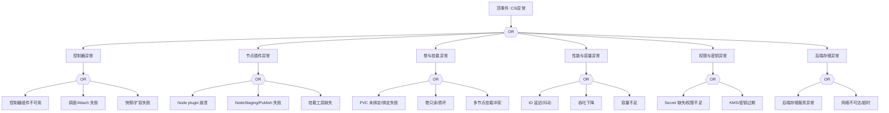

# CSI 存储异常 FTA 树

## 适用范围与说明
- **目标**：覆盖 CSI 存储在生产环境中的挂载、性能与可用性异常路径。
- **范围**：驱动与控制器、节点插件、卷与快照、权限与密钥、后端存储依赖。
- **符号**：
  - **OR 门**：任一子事件成立即可触发父事件
  - **AND 门**：所有子事件同时成立才触发父事件

---

## Mermaid FTA 树



---

## 生产级观测与证据
- **事件**：`FailedMount`、`FailedAttachVolume`、`VolumeAttachFailed`、`ProvisioningFailed`。
- **关键指标**：卷挂载失败率、IO 延迟、吞吐、PVC 绑定时长。
- **关键日志**：CSI controller/node 插件日志、`kubelet` 挂载日志、后端存储日志。
- **配置核对**：`StorageClass`、`VolumeSnapshotClass`、`Secret`、权限与拓扑约束。

---

## JSON 工作流（含与/或门控件）

```json
{
  "flow_steps": [
    { "name": "开始", "action": "start", "step": "start_csi_fta", "next_step": "event_csi_abnormal" },
    { "name": "顶事件: CSI异常", "action": "event", "step": "event_csi_abnormal", "description": "卷无法挂载/性能下降", "next_step": "gate_root_or" },
    { "name": "根因 OR 门", "action": "gate_or", "step": "gate_root_or", "control": "or_gate", "gate_type": "OR", "next_steps": ["cat_ctrl","cat_node","cat_vol","cat_perf","cat_auth","cat_back"] },

    { "name": "控制器异常", "action": "event", "step": "cat_ctrl", "next_step": "gate_ctrl_or" },
    { "name": "控制器 OR 门", "action": "gate_or", "step": "gate_ctrl_or", "control": "or_gate", "gate_type": "OR", "next_steps": ["evt_ctrl_down","evt_attach_fail","evt_resize_fail"] },
    { "name": "控制器组件不可用", "action": "event", "step": "evt_ctrl_down" },
    { "name": "调度/Attach 失败", "action": "event", "step": "evt_attach_fail" },
    { "name": "快照/扩容失败", "action": "event", "step": "evt_resize_fail" },

    { "name": "节点插件异常", "action": "event", "step": "cat_node", "next_step": "gate_node_or" },
    { "name": "节点插件 OR 门", "action": "gate_or", "step": "gate_node_or", "control": "or_gate", "gate_type": "OR", "next_steps": ["evt_node_crash","evt_stage_fail","evt_tool_missing"] },
    { "name": "Node plugin 崩溃", "action": "event", "step": "evt_node_crash" },
    { "name": "NodeStaging/Publish 失败", "action": "event", "step": "evt_stage_fail" },
    { "name": "挂载工具缺失", "action": "event", "step": "evt_tool_missing" },

    { "name": "卷与挂载异常", "action": "event", "step": "cat_vol", "next_step": "gate_vol_or" },
    { "name": "卷 OR 门", "action": "gate_or", "step": "gate_vol_or", "control": "or_gate", "gate_type": "OR", "next_steps": ["evt_pvc_unbound","evt_vol_readonly","evt_mount_conflict"] },
    { "name": "PVC 未绑定/绑定失败", "action": "event", "step": "evt_pvc_unbound" },
    { "name": "卷只读/损坏", "action": "event", "step": "evt_vol_readonly" },
    { "name": "多节点挂载冲突", "action": "event", "step": "evt_mount_conflict" },

    { "name": "性能与容量异常", "action": "event", "step": "cat_perf", "next_step": "gate_perf_or" },
    { "name": "性能 OR 门", "action": "gate_or", "step": "gate_perf_or", "control": "or_gate", "gate_type": "OR", "next_steps": ["evt_io_latency","evt_throughput_down","evt_capacity_low"] },
    { "name": "IO 延迟/抖动", "action": "event", "step": "evt_io_latency" },
    { "name": "吞吐下降", "action": "event", "step": "evt_throughput_down" },
    { "name": "容量不足", "action": "event", "step": "evt_capacity_low" },

    { "name": "权限与密钥异常", "action": "event", "step": "cat_auth", "next_step": "gate_auth_or" },
    { "name": "权限 OR 门", "action": "gate_or", "step": "gate_auth_or", "control": "or_gate", "gate_type": "OR", "next_steps": ["evt_secret_missing","evt_kms_expire"] },
    { "name": "Secret 缺失/权限不足", "action": "event", "step": "evt_secret_missing" },
    { "name": "KMS/密钥过期", "action": "event", "step": "evt_kms_expire" },

    { "name": "后端存储异常", "action": "event", "step": "cat_back", "next_step": "gate_back_or" },
    { "name": "后端 OR 门", "action": "gate_or", "step": "gate_back_or", "control": "or_gate", "gate_type": "OR", "next_steps": ["evt_backend_down","evt_backend_net"] },
    { "name": "后端存储服务异常", "action": "event", "step": "evt_backend_down" },
    { "name": "网络不可达/超时", "action": "event", "step": "evt_backend_net" },

    { "name": "结束", "action": "end", "step": "end_csi_fta" }
  ]
}
```
