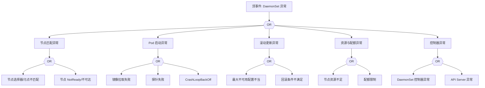

# DaemonSet 异常 FTA 树

## 适用范围与说明
- **目标**：覆盖 DaemonSet Pod 未覆盖、更新失败与节点绑定异常的关键成因与路径。
- **范围**：节点选择与污点、镜像与探针、滚动更新、资源与配额、控制器依赖。
- **符号**：
  - **OR 门**：任一子事件成立即可触发父事件
  - **AND 门**：所有子事件同时成立才触发父事件

---

## Mermaid FTA 树



---

## 生产级观测与证据
- **事件**：`FailedCreate`、`FailedScheduling`、`Unhealthy`。
- **关键指标**：`kube_daemonset_status_number_ready`、`kube_daemonset_status_desired_number_scheduled`。
- **关键日志**：`kube-controller-manager`、`kubelet`。
- **配置核对**：节点选择器、污点容忍、滚动更新策略、资源请求。

---

## JSON 工作流（含与/或门控件）

```json
{
  "flow_steps": [
    { "name": "开始", "action": "start", "step": "start_ds_fta", "next_step": "event_ds_abnormal" },
    { "name": "顶事件: DaemonSet 异常", "action": "event", "step": "event_ds_abnormal", "description": "节点未覆盖/更新失败", "next_step": "gate_root_or" },
    { "name": "根因 OR 门", "action": "gate_or", "step": "gate_root_or", "control": "or_gate", "gate_type": "OR", "next_steps": ["cat_node","cat_pod","cat_roll","cat_res","cat_ctrl"] }
  ]
}
```

---

## 版本适配（1.19–1.30）
- **1.19–1.23**：节点选择与污点容忍字段需核对；旧版事件可能不全。
- **1.24–1.27**：运行时切换后日志路径需更新。
- **1.28–1.30**：稳定 API 为主，滚动策略与审计链路需统一。
- **共性**：遵循 `fta_methodology_and_agentic_practices.md` 中的“版本适配基线”。
