<!-- condition: kubectl get rs -n <ns> -o jsonpath='{range .items[?(@.spec.replicas != @.status.readyReplicas)]} {.metadata.name}{\"\n\"}{end}' 显示副本数不匹配 -->

# Deployment 异常 FTA 树

## 适用范围与说明
- **目标**：覆盖 Deployment 滚动更新失败、回滚失败与副本不一致的关键成因与路径。
- **范围**：滚动发布、ReplicaSet 协同、镜像与探针、资源与配额、准入与策略。
- **符号**：
  - **OR 门**：任一子事件成立即可触发父事件
  - **AND 门**：所有子事件同时成立才触发父事件

---

## Mermaid FTA 树

```mermaid
flowchart TD
  TE[顶事件: Deployment 更新异常]
  OR0{{OR}}
  TE --> OR0

  OR0 --> RS[ReplicaSet 协同异常]
  OR0 --> POD[Pod 启动异常]
  OR0 --> STRAT[滚动策略异常]
  OR0 --> RES[资源与配额异常]
  OR0 --> SEC[安全与准入异常]

  RS_OR{{OR}}
  RS --> RS_OR
  RS_OR --> RS1[新旧 RS 版本冲突]
  RS_OR --> RS2[期望副本不收敛]
  RS_OR --> RS3[历史版本清理异常]

  RS1_OR{{OR}}
  RS1 --> RS1_OR
  RS1_OR --> RS1A[新 RS 创建失败]
  RS1_OR --> RS1B[旧 RS 无法缩容]

  POD_OR{{OR}}
  POD --> POD_OR
  POD_OR --> POD1[镜像拉取失败]
  POD_OR --> POD2[探针失败]
  POD_OR --> POD3[CrashLoopBackOff]
  POD_OR --> POD4[调度失败]

  POD1_OR{{OR}}
  POD1 --> POD1_OR
  POD1_OR --> POD1A[镜像不存在]
  POD1_OR --> POD1B[仓库认证失败]
  POD1_OR --> POD1C[网络不可达]

  POD2_OR{{OR}}
  POD2 --> POD2_OR
  POD2_OR --> POD2A[Readiness 探针失败]
  POD2_OR --> POD2B[Liveness 探针失败]
  POD2_OR --> POD2C[Startup 探针超时]

  STRAT_OR{{OR}}
  STRAT --> STRAT_OR
  STRAT_OR --> STR1[maxUnavailable/maxSurge 配置不当]
  STRAT_OR --> STR2[滚动更新卡死]
  STRAT_OR --> STR3[回滚失败]

  AND_STUCK{{AND}}
  STR2 --> AND_STUCK
  AND_STUCK --> STR2A[新 Pod CrashLoop]
  AND_STUCK --> STR2B[maxUnavailable=0]

  AND_ROLLBACK{{AND}}
  STR3 --> AND_ROLLBACK
  AND_ROLLBACK --> STR3A[历史 RS 被删除]
  AND_ROLLBACK --> STR3B[revisionHistoryLimit 过小]

  RES_OR{{OR}}
  RES --> RES_OR
  RES_OR --> RES1[资源不足导致调度失败]
  RES_OR --> RES2[配额限制]
  RES_OR --> RES3[PDB 阻止更新]

  RES1_OR{{OR}}
  RES1 --> RES1_OR
  RES1_OR --> RES1A[节点资源耗尽]
  RES1_OR --> RES1B[资源碎片化]

  SEC_OR{{OR}}
  SEC --> SEC_OR
  SEC_OR --> SEC1[准入 Webhook 拒绝]
  SEC_OR --> SEC2[安全策略阻断]
  SEC_OR --> SEC3[RBAC 权限不足]

  SEC1_OR{{OR}}
  SEC1 --> SEC1_OR
  SEC1_OR --> SEC1A[Webhook 超时]
  SEC1_OR --> SEC1B[策略校验失败]
```



---

## 生产级观测与证据
- **事件**：`ProgressDeadlineExceeded`、`FailedCreate`、`FailedScheduling`、`Unhealthy`、`BackOff`。
- **关键指标**：`kube_deployment_status_replicas_available`、`kube_deployment_status_replicas_unavailable`、`kube_deployment_status_observed_generation`、`kube_replicaset_status_ready_replicas`。
- **关键日志**：`kube-controller-manager`、`kubelet`、`admission webhook` 日志。
- **配置核对**：滚动发布策略（maxUnavailable/maxSurge）、镜像与探针、资源请求与配额、准入策略、revisionHistoryLimit。

---

## JSON 工作流（含与/或门控件）

```json
{
  "flow_steps": [
    { "name": "开始", "action": "start", "step": "start_deploy_fta", "next_step": "event_deploy_abnormal" },
    { "name": "顶事件: Deployment 更新异常", "action": "event", "step": "event_deploy_abnormal", "description": "滚动更新停滞/回滚失败/副本不一致", "next_step": "gate_root_or" },
    { "name": "根因 OR 门", "action": "gate_or", "step": "gate_root_or", "control": "or_gate", "gate_type": "OR", "next_steps": ["cat_rs", "cat_pod", "cat_strat", "cat_res", "cat_sec"] },

    { "name": "ReplicaSet 协同异常", "action": "event", "step": "cat_rs", "description": "RS 管理问题", "next_step": "gate_rs_or" },
    { "name": "RS OR 门", "action": "gate_or", "step": "gate_rs_or", "control": "or_gate", "gate_type": "OR", "next_steps": ["evt_rs_conflict", "evt_replica_diverge", "evt_history_cleanup"] },

    { "name": "新旧 RS 版本冲突", "action": "event", "step": "evt_rs_conflict", "description": "RS 版本管理问题", "next_step": "gate_rs_conflict_or" },
    { "name": "RS 冲突 OR 门", "action": "gate_or", "step": "gate_rs_conflict_or", "control": "or_gate", "gate_type": "OR", "next_steps": ["evt_new_rs_fail", "evt_old_rs_stuck"] },
    {
      "name": "新 RS 创建失败",
      "action": "event",
      "step": "evt_new_rs_fail",
      "severity": "critical",
      "probability": "medium",
      "mttr_minutes": 15,
      "detection": {
        "events": ["FailedCreate"],
        "metrics": ["kube_deployment_status_observed_generation != kube_deployment_metadata_generation"],
        "logs": ["controller-manager: failed to create new replica set"]
      },
      "remediation": {
        "manual_steps": ["检查 Deployment spec 配置", "验证资源配额"],
        "auto_actions": ["修正配置重新触发更新"]
      }
    },
    {
      "name": "旧 RS 无法缩容",
      "action": "event",
      "step": "evt_old_rs_stuck",
      "severity": "high",
      "probability": "medium",
      "mttr_minutes": 15,
      "detection": {
        "events": [],
        "metrics": ["kube_replicaset_status_replicas > 0"],
        "logs": []
      },
      "remediation": {
        "manual_steps": ["检查旧 RS Pod 是否有 finalizer", "验证 PDB 配置"],
        "auto_actions": ["手动删除卡住的 Pod"]
      }
    },

    {
      "name": "期望副本不收敛",
      "action": "event",
      "step": "evt_replica_diverge",
      "severity": "high",
      "probability": "common",
      "mttr_minutes": 15,
      "detection": {
        "events": ["ProgressDeadlineExceeded"],
        "metrics": ["kube_deployment_status_replicas != kube_deployment_spec_replicas"],
        "logs": []
      },
      "remediation": {
        "manual_steps": ["检查 Pod 创建失败原因", "验证资源和调度"],
        "auto_actions": ["增加 progressDeadlineSeconds"]
      }
    },
    {
      "name": "历史版本清理异常",
      "action": "event",
      "step": "evt_history_cleanup",
      "severity": "low",
      "probability": "rare",
      "mttr_minutes": 10,
      "detection": {
        "events": [],
        "metrics": [],
        "logs": ["failed to delete old replica set"]
      },
      "remediation": {
        "manual_steps": ["检查 revisionHistoryLimit 配置", "手动清理旧 RS"],
        "auto_actions": ["调整 revisionHistoryLimit"]
      }
    },

    { "name": "Pod 启动异常", "action": "event", "step": "cat_pod", "description": "新 Pod 无法正常启动", "next_step": "gate_pod_or" },
    { "name": "Pod OR 门", "action": "gate_or", "step": "gate_pod_or", "control": "or_gate", "gate_type": "OR", "next_steps": ["evt_image_fail", "evt_probe_fail", "evt_crashloop", "evt_schedule_fail"] },

    { "name": "镜像拉取失败", "action": "event", "step": "evt_image_fail", "description": "无法获取容器镜像", "next_step": "gate_image_or" },
    { "name": "镜像 OR 门", "action": "gate_or", "step": "gate_image_or", "control": "or_gate", "gate_type": "OR", "next_steps": ["evt_image_notfound", "evt_image_auth", "evt_image_net"] },
    {
      "name": "镜像不存在",
      "action": "event",
      "step": "evt_image_notfound",
      "severity": "critical",
      "probability": "common",
      "mttr_minutes": 10,
      "detection": {
        "events": ["ErrImagePull", "ImagePullBackOff"],
        "metrics": ["kube_pod_container_status_waiting_reason{reason='ErrImagePull'}"],
        "logs": ["Failed to pull image", "manifest unknown"]
      },
      "remediation": {
        "manual_steps": ["检查镜像名称和标签", "验证镜像是否已推送"],
        "auto_actions": ["修正镜像标签"]
      }
    },
    {
      "name": "仓库认证失败",
      "action": "event",
      "step": "evt_image_auth",
      "severity": "high",
      "probability": "common",
      "mttr_minutes": 10,
      "detection": {
        "events": ["ErrImagePull"],
        "metrics": [],
        "logs": ["unauthorized", "authentication required"]
      },
      "remediation": {
        "manual_steps": ["检查 imagePullSecrets 配置", "验证凭据有效性"],
        "auto_actions": ["更新 Secret"]
      }
    },
    {
      "name": "网络不可达",
      "action": "event",
      "step": "evt_image_net",
      "severity": "high",
      "probability": "medium",
      "mttr_minutes": 20,
      "detection": {
        "events": ["ErrImagePull"],
        "metrics": [],
        "logs": ["connection refused", "timeout"]
      },
      "remediation": {
        "manual_steps": ["检查节点网络连通性", "验证镜像仓库可达性"],
        "auto_actions": ["使用镜像缓存/代理"]
      }
    },

    { "name": "探针失败", "action": "event", "step": "evt_probe_fail", "description": "健康检查未通过", "next_step": "gate_probe_or" },
    { "name": "探针 OR 门", "action": "gate_or", "step": "gate_probe_or", "control": "or_gate", "gate_type": "OR", "next_steps": ["evt_readiness_fail", "evt_liveness_fail", "evt_startup_fail"] },
    {
      "name": "Readiness 探针失败",
      "action": "event",
      "step": "evt_readiness_fail",
      "severity": "high",
      "probability": "common",
      "mttr_minutes": 15,
      "detection": {
        "events": ["Unhealthy"],
        "metrics": ["kube_pod_status_ready==0"],
        "logs": ["Readiness probe failed"]
      },
      "remediation": {
        "manual_steps": ["检查探针配置", "验证应用健康检查端点"],
        "auto_actions": ["调整探针参数"]
      }
    },
    {
      "name": "Liveness 探针失败",
      "action": "event",
      "step": "evt_liveness_fail",
      "severity": "high",
      "probability": "common",
      "mttr_minutes": 15,
      "detection": {
        "events": ["Unhealthy", "Killing"],
        "metrics": ["kube_pod_container_status_restarts_total"],
        "logs": ["Liveness probe failed"]
      },
      "remediation": {
        "manual_steps": ["检查应用是否存活", "调整探针超时"],
        "auto_actions": ["增加 failureThreshold"]
      }
    },
    {
      "name": "Startup 探针超时",
      "action": "event",
      "step": "evt_startup_fail",
      "severity": "high",
      "probability": "medium",
      "mttr_minutes": 15,
      "detection": {
        "events": ["Unhealthy"],
        "metrics": [],
        "logs": ["Startup probe failed"]
      },
      "remediation": {
        "manual_steps": ["检查应用启动时间", "增加 startupProbe 超时"],
        "auto_actions": ["调整 failureThreshold 和 periodSeconds"]
      }
    },

    {
      "name": "CrashLoopBackOff",
      "action": "event",
      "step": "evt_crashloop",
      "severity": "critical",
      "probability": "common",
      "mttr_minutes": 20,
      "detection": {
        "events": ["BackOff", "CrashLoopBackOff"],
        "metrics": ["kube_pod_container_status_waiting_reason{reason='CrashLoopBackOff'}"],
        "logs": ["Back-off restarting failed container"]
      },
      "remediation": {
        "manual_steps": ["检查容器日志", "验证启动命令和配置"],
        "auto_actions": ["回滚到上一版本"]
      }
    },
    {
      "name": "调度失败",
      "action": "event",
      "step": "evt_schedule_fail",
      "severity": "high",
      "probability": "common",
      "mttr_minutes": 15,
      "detection": {
        "events": ["FailedScheduling"],
        "metrics": ["kube_pod_status_phase{phase='Pending'}"],
        "logs": ["Insufficient cpu", "Insufficient memory", "no nodes available"]
      },
      "remediation": {
        "manual_steps": ["检查节点资源", "验证亲和性配置"],
        "auto_actions": ["扩展集群节点"]
      }
    },

    { "name": "滚动策略异常", "action": "event", "step": "cat_strat", "description": "更新策略配置问题", "next_step": "gate_strat_or" },
    { "name": "策略 OR 门", "action": "gate_or", "step": "gate_strat_or", "control": "or_gate", "gate_type": "OR", "next_steps": ["evt_surge_bad", "evt_update_stuck", "evt_rollback_fail"] },
    {
      "name": "maxUnavailable/maxSurge 配置不当",
      "action": "event",
      "step": "evt_surge_bad",
      "severity": "medium",
      "probability": "common",
      "mttr_minutes": 10,
      "detection": {
        "events": [],
        "metrics": [],
        "logs": []
      },
      "remediation": {
        "manual_steps": ["检查 strategy.rollingUpdate 配置", "根据副本数调整"],
        "auto_actions": ["修正配置"]
      }
    },
    {
      "name": "滚动更新卡死",
      "action": "event",
      "step": "evt_update_stuck",
      "severity": "critical",
      "probability": "medium",
      "mttr_minutes": 20,
      "detection": {
        "events": ["ProgressDeadlineExceeded"],
        "metrics": ["kube_deployment_status_condition{condition='Progressing',status='False'}"],
        "logs": []
      },
      "remediation": {
        "manual_steps": ["分析 Pod 失败原因", "考虑回滚"],
        "auto_actions": ["触发回滚"]
      },
      "next_step": "gate_stuck_and"
    },
    { "name": "更新卡死 AND 门", "action": "gate_and", "step": "gate_stuck_and", "control": "and_gate", "gate_type": "AND", "next_steps": ["evt_new_pod_crash", "evt_max_unavailable_zero"] },
    {
      "name": "新 Pod CrashLoop",
      "action": "event",
      "step": "evt_new_pod_crash",
      "severity": "critical",
      "probability": "medium",
      "mttr_minutes": 20,
      "detection": {
        "events": ["CrashLoopBackOff"],
        "metrics": [],
        "logs": []
      },
      "remediation": {
        "manual_steps": ["分析 Pod 崩溃原因"],
        "auto_actions": ["回滚"]
      }
    },
    {
      "name": "maxUnavailable=0",
      "action": "event",
      "step": "evt_max_unavailable_zero",
      "severity": "medium",
      "probability": "common",
      "mttr_minutes": 10,
      "detection": {
        "events": [],
        "metrics": [],
        "logs": []
      },
      "remediation": {
        "manual_steps": ["临时调整 maxUnavailable > 0"],
        "auto_actions": ["修改策略后重试"]
      }
    },

    {
      "name": "回滚失败",
      "action": "event",
      "step": "evt_rollback_fail",
      "severity": "critical",
      "probability": "medium",
      "mttr_minutes": 20,
      "detection": {
        "events": [],
        "metrics": [],
        "logs": ["unable to find revision"]
      },
      "remediation": {
        "manual_steps": ["检查历史 RS 是否存在", "手动指定回滚版本"],
        "auto_actions": ["重建目标版本"]
      },
      "next_step": "gate_rollback_and"
    },
    { "name": "回滚 AND 门", "action": "gate_and", "step": "gate_rollback_and", "control": "and_gate", "gate_type": "AND", "next_steps": ["evt_history_deleted", "evt_revision_limit"] },
    {
      "name": "历史 RS 被删除",
      "action": "event",
      "step": "evt_history_deleted",
      "severity": "high",
      "probability": "medium",
      "mttr_minutes": 15,
      "detection": {
        "events": [],
        "metrics": [],
        "logs": []
      },
      "remediation": {
        "manual_steps": ["从 Git/CI 获取历史配置重新部署"],
        "auto_actions": ["使用 GitOps 恢复"]
      }
    },
    {
      "name": "revisionHistoryLimit 过小",
      "action": "event",
      "step": "evt_revision_limit",
      "severity": "medium",
      "probability": "common",
      "mttr_minutes": 10,
      "detection": {
        "events": [],
        "metrics": [],
        "logs": []
      },
      "remediation": {
        "manual_steps": ["增加 revisionHistoryLimit（建议 10）"],
        "auto_actions": ["调整配置"]
      }
    },

    { "name": "资源与配额异常", "action": "event", "step": "cat_res", "description": "资源限制问题", "next_step": "gate_res_or" },
    { "name": "资源 OR 门", "action": "gate_or", "step": "gate_res_or", "control": "or_gate", "gate_type": "OR", "next_steps": ["evt_resource_insufficient", "evt_quota_limit", "evt_pdb_block"] },

    { "name": "资源不足导致调度失败", "action": "event", "step": "evt_resource_insufficient", "description": "节点资源不足", "next_step": "gate_resource_or" },
    { "name": "资源不足 OR 门", "action": "gate_or", "step": "gate_resource_or", "control": "or_gate", "gate_type": "OR", "next_steps": ["evt_node_full", "evt_fragmentation"] },
    {
      "name": "节点资源耗尽",
      "action": "event",
      "step": "evt_node_full",
      "severity": "high",
      "probability": "common",
      "mttr_minutes": 20,
      "detection": {
        "events": ["FailedScheduling"],
        "metrics": ["kube_node_status_allocatable_cpu_cores", "kube_node_status_allocatable_memory_bytes"],
        "logs": ["Insufficient cpu", "Insufficient memory"]
      },
      "remediation": {
        "manual_steps": ["扩展集群节点", "优化资源请求"],
        "auto_actions": ["触发 Cluster Autoscaler"]
      }
    },
    {
      "name": "资源碎片化",
      "action": "event",
      "step": "evt_fragmentation",
      "severity": "medium",
      "probability": "medium",
      "mttr_minutes": 30,
      "detection": {
        "events": ["FailedScheduling"],
        "metrics": [],
        "logs": ["no nodes available to schedule pods"]
      },
      "remediation": {
        "manual_steps": ["使用 descheduler 重新平衡", "优化资源请求"],
        "auto_actions": ["运行 descheduler"]
      }
    },

    {
      "name": "配额限制",
      "action": "event",
      "step": "evt_quota_limit",
      "severity": "high",
      "probability": "common",
      "mttr_minutes": 15,
      "detection": {
        "events": ["FailedCreate", "exceeded quota"],
        "metrics": ["kube_resourcequota"],
        "logs": ["exceeded quota"]
      },
      "remediation": {
        "manual_steps": ["检查 ResourceQuota 使用情况", "申请配额提升"],
        "auto_actions": ["提升配额"]
      }
    },
    {
      "name": "PDB 阻止更新",
      "action": "event",
      "step": "evt_pdb_block",
      "severity": "medium",
      "probability": "common",
      "mttr_minutes": 15,
      "detection": {
        "events": ["EvictionBlocked"],
        "metrics": ["kube_poddisruptionbudget_status_pod_disruptions_allowed==0"],
        "logs": []
      },
      "remediation": {
        "manual_steps": ["检查 PDB 配置", "临时调整 minAvailable"],
        "auto_actions": ["等待副本恢复"]
      }
    },

    { "name": "安全与准入异常", "action": "event", "step": "cat_sec", "description": "安全策略问题", "next_step": "gate_sec_or" },
    { "name": "安全 OR 门", "action": "gate_or", "step": "gate_sec_or", "control": "or_gate", "gate_type": "OR", "next_steps": ["evt_webhook_reject", "evt_policy_block", "evt_rbac_deny"] },

    { "name": "准入 Webhook 拒绝", "action": "event", "step": "evt_webhook_reject", "description": "准入控制器拒绝", "next_step": "gate_webhook_or" },
    { "name": "Webhook OR 门", "action": "gate_or", "step": "gate_webhook_or", "control": "or_gate", "gate_type": "OR", "next_steps": ["evt_webhook_timeout", "evt_policy_validate"] },
    {
      "name": "Webhook 超时",
      "action": "event",
      "step": "evt_webhook_timeout",
      "severity": "high",
      "probability": "medium",
      "mttr_minutes": 15,
      "detection": {
        "events": ["FailedCreate"],
        "metrics": [],
        "logs": ["webhook call failed", "context deadline exceeded"]
      },
      "remediation": {
        "manual_steps": ["检查 Webhook 服务健康", "增加超时时间"],
        "auto_actions": ["重启 Webhook 服务"]
      }
    },
    {
      "name": "策略校验失败",
      "action": "event",
      "step": "evt_policy_validate",
      "severity": "high",
      "probability": "common",
      "mttr_minutes": 15,
      "detection": {
        "events": ["FailedCreate"],
        "metrics": [],
        "logs": ["denied by", "admission webhook denied"]
      },
      "remediation": {
        "manual_steps": ["检查策略要求", "修正 Pod 配置以符合策略"],
        "auto_actions": ["调整配置"]
      }
    },

    {
      "name": "安全策略阻断",
      "action": "event",
      "step": "evt_policy_block",
      "severity": "high",
      "probability": "medium",
      "mttr_minutes": 15,
      "detection": {
        "events": ["FailedCreate"],
        "metrics": [],
        "logs": ["violates PodSecurity", "forbidden"]
      },
      "remediation": {
        "manual_steps": ["检查 PSA/PSP/OPA 策略", "调整 securityContext"],
        "auto_actions": ["修正安全配置"]
      }
    },
    {
      "name": "RBAC 权限不足",
      "action": "event",
      "step": "evt_rbac_deny",
      "severity": "high",
      "probability": "medium",
      "mttr_minutes": 10,
      "detection": {
        "events": ["Forbidden"],
        "metrics": [],
        "logs": ["cannot create", "forbidden"]
      },
      "remediation": {
        "manual_steps": ["检查 ServiceAccount 权限", "验证 RoleBinding"],
        "auto_actions": ["修正 RBAC 配置"]
      }
    },

    { "name": "结束", "action": "end", "step": "end_deploy_fta" }
  ]
}
```

---

## 版本适配（1.19–1.30）
- **1.19–1.23**：RollingUpdate 字段稳定，需关注旧版 webhook 与 API 兼容性；PSP 可能仍在使用。
- **1.24–1.27**：PSP 移除后安全策略迁移影响准入链路，需补充 PSA/OPA 分支；progressDeadlineSeconds 默认值变化。
- **1.28–1.30**：使用稳定 API 与策略，版本差异主要体现在准入与审计链路；建议使用 Gateway API 替代部分 Ingress 场景。
- **共性**：遵循 `fta-methodology-and-agentic-practices.md` 中的"版本适配基线"。
