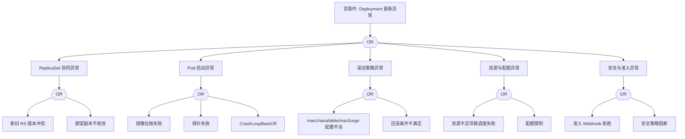

# Deployment 异常 FTA 树

## 适用范围与说明
- **目标**：覆盖 Deployment 滚动更新失败、回滚失败与副本不一致的关键成因与路径。
- **范围**：滚动发布、ReplicaSet 协同、镜像与探针、资源与配额、准入与策略。
- **符号**：
  - **OR 门**：任一子事件成立即可触发父事件
  - **AND 门**：所有子事件同时成立才触发父事件

---

## Mermaid FTA 树



---

## 生产级观测与证据
- **事件**：`ProgressDeadlineExceeded`、`FailedCreate`、`FailedScheduling`。
- **关键指标**：`kube_deployment_status_replicas_available`、`kube_deployment_status_replicas_unavailable`、`kube_replicaset_status_ready_replicas`。
- **关键日志**：`kube-controller-manager`、`kubelet`、`admission webhook` 日志。
- **配置核对**：滚动发布策略、镜像与探针、资源请求与配额、准入策略。

---

## JSON 工作流（含与/或门控件）

```json
{
  "flow_steps": [
    { "name": "开始", "action": "start", "step": "start_deploy_fta", "next_step": "event_deploy_abnormal" },
    { "name": "顶事件: Deployment 更新异常", "action": "event", "step": "event_deploy_abnormal", "description": "滚动更新停滞/回滚失败", "next_step": "gate_root_or" },
    { "name": "根因 OR 门", "action": "gate_or", "step": "gate_root_or", "control": "or_gate", "gate_type": "OR", "next_steps": ["cat_rs","cat_pod","cat_strat","cat_res","cat_sec"] }
  ]
}
```

---

## 版本适配（1.19–1.30）
- **1.19–1.23**：RollingUpdate 字段稳定，需关注旧版 webhook 与 API 兼容性。
- **1.24–1.27**：PSP 移除后安全策略迁移影响准入链路，需补充 PSA/OPA 分支。
- **1.28–1.30**：使用稳定 API 与策略，版本差异主要体现在准入与审计链路。
- **共性**：遵循 `fta_methodology_and_agentic_practices.md` 中的“版本适配基线”。
