# DNS 异常 FTA 树

## 适用范围与说明
- **目标**：覆盖 DNS 解析失败、延迟升高与解析不一致的关键成因与路径。
- **范围**：CoreDNS 部署、上游解析、网络策略、缓存与配置、资源压力。
- **符号**：
  - **OR 门**：任一子事件成立即可触发父事件
  - **AND 门**：所有子事件同时成立才触发父事件

---

## Mermaid FTA 树

```mermaid
flowchart TD
  TE[顶事件: DNS 解析异常]
  OR0{{OR}}
  TE --> OR0

  OR0 --> CORE[CoreDNS 异常]
  OR0 --> UP[上游解析异常]
  OR0 --> NET[网络策略/连通性异常]
  OR0 --> CFG[配置与缓存异常]
  OR0 --> RES[资源与容量异常]

  CORE_OR{{OR}}
  CORE --> CORE_OR
  CORE_OR --> CORE1[Pod 异常/重启]
  CORE_OR --> CORE2[服务发现异常]
  CORE_OR --> CORE3[插件加载失败]

  CORE1_OR{{OR}}
  CORE1 --> CORE1_OR
  CORE1_OR --> CORE1A[OOMKilled]
  CORE1_OR --> CORE1B[CrashLoopBackOff]
  CORE1_OR --> CORE1C[被节点驱逐]

  AND_OOM{{AND}}
  CORE1A --> AND_OOM
  AND_OOM --> CORE1A1[内存限制过低]
  AND_OOM --> CORE1A2[查询峰值突增]

  CORE2_OR{{OR}}
  CORE2 --> CORE2_OR
  CORE2_OR --> CORE2A[kube-dns Service 不存在]
  CORE2_OR --> CORE2B[ClusterIP 不可达]
  CORE2_OR --> CORE2C[DNS 端口被占用]

  UP_OR{{OR}}
  UP --> UP_OR
  UP_OR --> UP1[上游 DNS 不可达]
  UP_OR --> UP2[上游超时/丢包]
  UP_OR --> UP3[上游返回错误]

  UP1_OR{{OR}}
  UP1 --> UP1_OR
  UP1_OR --> UP1A[上游 DNS 服务异常]
  UP1_OR --> UP1B[防火墙/安全组拦截]
  UP1_OR --> UP1C[forward 配置地址错误]

  NET_OR{{OR}}
  NET --> NET_OR
  NET_OR --> NET1[NetworkPolicy 阻断 DNS]
  NET_OR --> NET2[跨节点网络不通]
  NET_OR --> NET3[Pod 网络未就绪]

  NET1_OR{{OR}}
  NET1 --> NET1_OR
  NET1_OR --> NET1A[Egress 策略拦截 53 端口]
  NET1_OR --> NET1B[Ingress 策略拦截 CoreDNS]

  CFG_OR{{OR}}
  CFG --> CFG_OR
  CFG_OR --> CFG1[CoreDNS 配置错误]
  CFG_OR --> CFG2[缓存失效连锁]
  CFG_OR --> CFG3[域名劫持/hosts 冲突]

  CFG1_OR{{OR}}
  CFG1 --> CFG1_OR
  CFG1_OR --> CFG1A[Corefile 语法错误]
  CFG1_OR --> CFG1B[forward 插件配置错误]
  CFG1_OR --> CFG1C[stub domain 配置错误]

  AND_CACHE{{AND}}
  CFG2 --> AND_CACHE
  AND_CACHE --> CFG2A[缓存 TTL 过期]
  AND_CACHE --> CFG2B[上游 DNS 不可达无法刷新]

  RES_OR{{OR}}
  RES --> RES_OR
  RES_OR --> RES1[CPU/内存资源不足]
  RES_OR --> RES2[查询峰值过高]
  RES_OR --> RES3[解析延迟暴增]

  AND_LATENCY{{AND}}
  RES3 --> AND_LATENCY
  AND_LATENCY --> RES3A[CoreDNS 资源不足]
  AND_LATENCY --> RES3B[并发查询量超限]
```



---

## 生产级观测与证据
- **事件**：`SERVFAIL`、解析超时、`NXDOMAIN` 异常升高、`OOMKilled`、`CrashLoopBackOff`。
- **关键指标**：`coredns_dns_request_count_total`、`coredns_dns_request_duration_seconds`、`coredns_cache_hits_total`、`coredns_cache_misses_total`、`coredns_forward_request_duration_seconds`、`container_memory_working_set_bytes{pod=~"coredns.*"}`。
- **关键日志**：`coredns` 日志、`kubelet` 日志、网络插件日志。
- **配置核对**：CoreDNS `Corefile`、上游 DNS 地址、NetworkPolicy、kube-dns Service。

---

## JSON 工作流（含与/或门控件）

```json
{
  "flow_steps": [
    { "name": "开始", "action": "start", "step": "start_dns_fta", "next_step": "event_dns_abnormal" },
    { "name": "顶事件: DNS 解析异常", "action": "event", "step": "event_dns_abnormal", "description": "解析超时/SERVFAIL/NXDOMAIN异常", "next_step": "gate_root_or" },
    { "name": "根因 OR 门", "action": "gate_or", "step": "gate_root_or", "control": "or_gate", "gate_type": "OR", "next_steps": ["cat_core", "cat_up", "cat_net", "cat_cfg", "cat_res"] },

    { "name": "CoreDNS 异常", "action": "event", "step": "cat_core", "description": "CoreDNS 服务本身异常", "next_step": "gate_core_or" },
    { "name": "CoreDNS OR 门", "action": "gate_or", "step": "gate_core_or", "control": "or_gate", "gate_type": "OR", "next_steps": ["evt_core_pod", "evt_core_discovery", "evt_core_plugin"] },

    { "name": "Pod 异常/重启", "action": "event", "step": "evt_core_pod", "description": "CoreDNS Pod 不健康", "next_step": "gate_core_pod_or" },
    { "name": "Pod 异常 OR 门", "action": "gate_or", "step": "gate_core_pod_or", "control": "or_gate", "gate_type": "OR", "next_steps": ["evt_oom", "evt_crashloop", "evt_evicted"] },

    {
      "name": "OOMKilled",
      "action": "event",
      "step": "evt_oom",
      "severity": "critical",
      "probability": "common",
      "mttr_minutes": 10,
      "detection": {
        "events": ["OOMKilled", "Container coredns was killed"],
        "metrics": ["kube_pod_container_status_last_terminated_reason{reason='OOMKilled',pod=~'coredns.*'}"],
        "logs": ["kernel: Out of memory: Kill process", "kubelet: Memory cgroup out of memory"]
      },
      "remediation": {
        "manual_steps": ["检查 CoreDNS 内存限制是否过低(默认170Mi)", "分析查询峰值是否超出预期"],
        "auto_actions": ["临时提升内存限制到512Mi", "触发 CoreDNS HPA 扩展"]
      },
      "next_step": "gate_oom_and"
    },
    { "name": "OOM AND 门", "action": "gate_and", "step": "gate_oom_and", "control": "and_gate", "gate_type": "AND", "next_steps": ["evt_mem_limit_low", "evt_query_spike"] },
    {
      "name": "内存限制过低",
      "action": "event",
      "step": "evt_mem_limit_low",
      "severity": "medium",
      "probability": "common",
      "mttr_minutes": 5,
      "detection": {
        "events": [],
        "metrics": ["container_spec_memory_limit_bytes{pod=~'coredns.*'}"],
        "logs": []
      },
      "remediation": {
        "manual_steps": ["检查 CoreDNS Deployment 资源配置", "参考集群规模调整内存限制"],
        "auto_actions": ["更新 Deployment 内存限制"]
      }
    },
    {
      "name": "查询峰值突增",
      "action": "event",
      "step": "evt_query_spike",
      "severity": "medium",
      "probability": "common",
      "mttr_minutes": 15,
      "detection": {
        "events": [],
        "metrics": ["rate(coredns_dns_request_count_total[5m])"],
        "logs": ["coredns: i]"]
      },
      "remediation": {
        "manual_steps": ["分析查询来源和模式", "检查是否存在 DNS 查询风暴"],
        "auto_actions": ["启用 CoreDNS autopath 插件", "增加 CoreDNS 副本数"]
      }
    },

    {
      "name": "CrashLoopBackOff",
      "action": "event",
      "step": "evt_crashloop",
      "severity": "critical",
      "probability": "medium",
      "mttr_minutes": 15,
      "detection": {
        "events": ["BackOff", "CrashLoopBackOff"],
        "metrics": ["kube_pod_container_status_waiting_reason{reason='CrashLoopBackOff',pod=~'coredns.*'}"],
        "logs": ["kubelet: Back-off restarting failed container"]
      },
      "remediation": {
        "manual_steps": ["检查 CoreDNS 容器日志", "验证 Corefile 配置正确性", "检查挂载的 ConfigMap"],
        "auto_actions": ["回滚到上一个已知正常的 ConfigMap 版本"]
      }
    },
    {
      "name": "被节点驱逐",
      "action": "event",
      "step": "evt_evicted",
      "severity": "high",
      "probability": "rare",
      "mttr_minutes": 10,
      "detection": {
        "events": ["Evicted", "The node was low on resource"],
        "metrics": ["kube_pod_status_reason{reason='Evicted',pod=~'coredns.*'}"],
        "logs": ["kubelet: evicting pod"]
      },
      "remediation": {
        "manual_steps": ["检查节点资源压力", "确认 CoreDNS PriorityClass 设置"],
        "auto_actions": ["设置 CoreDNS 为 system-cluster-critical 优先级"]
      }
    },

    { "name": "服务发现异常", "action": "event", "step": "evt_core_discovery", "description": "kube-dns Service 异常", "next_step": "gate_discovery_or" },
    { "name": "服务发现 OR 门", "action": "gate_or", "step": "gate_discovery_or", "control": "or_gate", "gate_type": "OR", "next_steps": ["evt_svc_missing", "evt_clusterip_unreachable", "evt_port_conflict"] },
    {
      "name": "kube-dns Service 不存在",
      "action": "event",
      "step": "evt_svc_missing",
      "severity": "critical",
      "probability": "rare",
      "mttr_minutes": 5,
      "detection": {
        "events": [],
        "metrics": ["kube_service_info{service='kube-dns',namespace='kube-system'}"],
        "logs": []
      },
      "remediation": {
        "manual_steps": ["检查 kube-system 命名空间中 kube-dns Service 是否存在", "重新创建 Service"],
        "auto_actions": ["通过 kubectl apply 重建 kube-dns Service"]
      }
    },
    {
      "name": "ClusterIP 不可达",
      "action": "event",
      "step": "evt_clusterip_unreachable",
      "severity": "critical",
      "probability": "medium",
      "mttr_minutes": 15,
      "detection": {
        "events": [],
        "metrics": ["kube_endpoint_address_available{endpoint='kube-dns'}"],
        "logs": ["connection refused", "no route to host"]
      },
      "remediation": {
        "manual_steps": ["检查 kube-proxy 是否正常运行", "验证 iptables/ipvs 规则"],
        "auto_actions": ["重启 kube-proxy DaemonSet"]
      }
    },
    {
      "name": "DNS 端口被占用",
      "action": "event",
      "step": "evt_port_conflict",
      "severity": "high",
      "probability": "rare",
      "mttr_minutes": 10,
      "detection": {
        "events": ["bind: address already in use"],
        "metrics": [],
        "logs": ["coredns: listen tcp :53: bind: address already in use"]
      },
      "remediation": {
        "manual_steps": ["检查是否有其他进程占用 53 端口", "检查节点上的本地 DNS 服务"],
        "auto_actions": ["终止占用端口的进程"]
      }
    },

    {
      "name": "插件加载失败",
      "action": "event",
      "step": "evt_core_plugin",
      "severity": "high",
      "probability": "medium",
      "mttr_minutes": 10,
      "detection": {
        "events": [],
        "metrics": [],
        "logs": ["coredns: plugin/", "coredns: failed to"]
      },
      "remediation": {
        "manual_steps": ["检查 Corefile 中的插件配置", "验证插件语法"],
        "auto_actions": ["回滚 Corefile ConfigMap"]
      }
    },

    { "name": "上游解析异常", "action": "event", "step": "cat_up", "description": "上游 DNS 服务器异常", "next_step": "gate_up_or" },
    { "name": "上游 OR 门", "action": "gate_or", "step": "gate_up_or", "control": "or_gate", "gate_type": "OR", "next_steps": ["evt_up_unreachable", "evt_up_timeout", "evt_up_error"] },

    { "name": "上游 DNS 不可达", "action": "event", "step": "evt_up_unreachable", "description": "无法连接上游 DNS", "next_step": "gate_up_unreachable_or" },
    { "name": "上游不可达 OR 门", "action": "gate_or", "step": "gate_up_unreachable_or", "control": "or_gate", "gate_type": "OR", "next_steps": ["evt_up_svc_down", "evt_up_firewall", "evt_up_forward_bad"] },
    {
      "name": "上游 DNS 服务异常",
      "action": "event",
      "step": "evt_up_svc_down",
      "severity": "high",
      "probability": "medium",
      "mttr_minutes": 30,
      "detection": {
        "events": [],
        "metrics": ["coredns_forward_healthcheck_failures_total"],
        "logs": ["coredns: unhealthy upstream"]
      },
      "remediation": {
        "manual_steps": ["检查上游 DNS 服务状态", "联系网络/基础设施团队"],
        "auto_actions": ["切换到备用上游 DNS"]
      }
    },
    {
      "name": "防火墙/安全组拦截",
      "action": "event",
      "step": "evt_up_firewall",
      "severity": "high",
      "probability": "medium",
      "mttr_minutes": 20,
      "detection": {
        "events": [],
        "metrics": [],
        "logs": ["connection timed out", "no route to host"]
      },
      "remediation": {
        "manual_steps": ["检查节点出向防火墙规则", "验证安全组配置允许 UDP/TCP 53"],
        "auto_actions": ["更新安全组规则"]
      }
    },
    {
      "name": "forward 配置地址错误",
      "action": "event",
      "step": "evt_up_forward_bad",
      "severity": "high",
      "probability": "medium",
      "mttr_minutes": 5,
      "detection": {
        "events": [],
        "metrics": [],
        "logs": ["coredns: no upstream host"]
      },
      "remediation": {
        "manual_steps": ["检查 Corefile 中 forward 插件配置的上游地址"],
        "auto_actions": ["更新 Corefile ConfigMap"]
      }
    },

    {
      "name": "上游超时/丢包",
      "action": "event",
      "step": "evt_up_timeout",
      "severity": "high",
      "probability": "common",
      "mttr_minutes": 15,
      "detection": {
        "events": [],
        "metrics": ["coredns_forward_request_duration_seconds", "coredns_forward_responses_total{rcode='SERVFAIL'}"],
        "logs": ["coredns: i/o timeout"]
      },
      "remediation": {
        "manual_steps": ["检查网络延迟和丢包率", "调整 forward 插件超时设置"],
        "auto_actions": ["增加重试次数", "切换上游 DNS"]
      }
    },
    {
      "name": "上游返回错误",
      "action": "event",
      "step": "evt_up_error",
      "severity": "medium",
      "probability": "medium",
      "mttr_minutes": 20,
      "detection": {
        "events": [],
        "metrics": ["coredns_forward_responses_total{rcode=~'SERVFAIL|REFUSED'}"],
        "logs": ["coredns: SERVFAIL", "coredns: REFUSED"]
      },
      "remediation": {
        "manual_steps": ["分析上游返回的错误类型", "检查域名是否存在"],
        "auto_actions": ["配置备用上游 DNS"]
      }
    },

    { "name": "网络策略/连通性异常", "action": "event", "step": "cat_net", "description": "网络层阻断 DNS 流量", "next_step": "gate_net_or" },
    { "name": "网络 OR 门", "action": "gate_or", "step": "gate_net_or", "control": "or_gate", "gate_type": "OR", "next_steps": ["evt_netpolicy", "evt_crossnode", "evt_pod_net"] },

    { "name": "NetworkPolicy 阻断 DNS", "action": "event", "step": "evt_netpolicy", "description": "网络策略拦截 DNS 流量", "next_step": "gate_netpolicy_or" },
    { "name": "NetworkPolicy OR 门", "action": "gate_or", "step": "gate_netpolicy_or", "control": "or_gate", "gate_type": "OR", "next_steps": ["evt_egress_block", "evt_ingress_block"] },
    {
      "name": "Egress 策略拦截 53 端口",
      "action": "event",
      "step": "evt_egress_block",
      "severity": "high",
      "probability": "common",
      "mttr_minutes": 10,
      "detection": {
        "events": [],
        "metrics": [],
        "logs": ["connection refused to kube-dns"]
      },
      "remediation": {
        "manual_steps": ["检查 Pod 所在命名空间的 NetworkPolicy", "验证是否允许出向访问 kube-system:kube-dns:53"],
        "auto_actions": ["添加允许 DNS 出向流量的 NetworkPolicy"]
      }
    },
    {
      "name": "Ingress 策略拦截 CoreDNS",
      "action": "event",
      "step": "evt_ingress_block",
      "severity": "high",
      "probability": "medium",
      "mttr_minutes": 10,
      "detection": {
        "events": [],
        "metrics": [],
        "logs": []
      },
      "remediation": {
        "manual_steps": ["检查 kube-system 命名空间的 NetworkPolicy", "确认允许所有 Pod 访问 CoreDNS"],
        "auto_actions": ["更新 CoreDNS Ingress NetworkPolicy"]
      }
    },

    {
      "name": "跨节点网络不通",
      "action": "event",
      "step": "evt_crossnode",
      "severity": "critical",
      "probability": "medium",
      "mttr_minutes": 30,
      "detection": {
        "events": [],
        "metrics": [],
        "logs": ["no route to host", "connection timed out"]
      },
      "remediation": {
        "manual_steps": ["检查 CNI 插件状态", "验证节点间网络连通性", "检查 Pod CIDR 路由"],
        "auto_actions": ["重启 CNI DaemonSet"]
      }
    },
    {
      "name": "Pod 网络未就绪",
      "action": "event",
      "step": "evt_pod_net",
      "severity": "high",
      "probability": "medium",
      "mttr_minutes": 10,
      "detection": {
        "events": ["NetworkNotReady"],
        "metrics": [],
        "logs": ["network is not ready"]
      },
      "remediation": {
        "manual_steps": ["等待 CNI 初始化完成", "检查节点 CNI 配置"],
        "auto_actions": ["重启 Pod 触发网络重新分配"]
      }
    },

    { "name": "配置与缓存异常", "action": "event", "step": "cat_cfg", "description": "CoreDNS 配置或缓存问题", "next_step": "gate_cfg_or" },
    { "name": "配置 OR 门", "action": "gate_or", "step": "gate_cfg_or", "control": "or_gate", "gate_type": "OR", "next_steps": ["evt_cfg_error", "evt_cache_cascade", "evt_hosts_conflict"] },

    { "name": "CoreDNS 配置错误", "action": "event", "step": "evt_cfg_error", "description": "Corefile 配置问题", "next_step": "gate_cfg_error_or" },
    { "name": "配置错误 OR 门", "action": "gate_or", "step": "gate_cfg_error_or", "control": "or_gate", "gate_type": "OR", "next_steps": ["evt_corefile_syntax", "evt_forward_bad", "evt_stub_bad"] },
    {
      "name": "Corefile 语法错误",
      "action": "event",
      "step": "evt_corefile_syntax",
      "severity": "critical",
      "probability": "medium",
      "mttr_minutes": 10,
      "detection": {
        "events": [],
        "metrics": [],
        "logs": ["coredns: parse error", "coredns: syntax error"]
      },
      "remediation": {
        "manual_steps": ["检查 Corefile ConfigMap 语法", "使用 coredns -validate 验证"],
        "auto_actions": ["回滚到上一个正确的 ConfigMap 版本"]
      }
    },
    {
      "name": "forward 插件配置错误",
      "action": "event",
      "step": "evt_forward_bad",
      "severity": "high",
      "probability": "medium",
      "mttr_minutes": 10,
      "detection": {
        "events": [],
        "metrics": [],
        "logs": ["coredns: plugin/forward"]
      },
      "remediation": {
        "manual_steps": ["检查 forward 插件上游地址配置", "验证协议和端口"],
        "auto_actions": ["更新 forward 配置"]
      }
    },
    {
      "name": "stub domain 配置错误",
      "action": "event",
      "step": "evt_stub_bad",
      "severity": "medium",
      "probability": "medium",
      "mttr_minutes": 10,
      "detection": {
        "events": [],
        "metrics": [],
        "logs": ["coredns: plugin/"]
      },
      "remediation": {
        "manual_steps": ["检查 stub domain 配置", "验证自定义 DNS 服务器可达性"],
        "auto_actions": ["更新 stub domain 配置"]
      }
    },

    {
      "name": "缓存失效连锁",
      "action": "event",
      "step": "evt_cache_cascade",
      "severity": "high",
      "probability": "medium",
      "mttr_minutes": 20,
      "detection": {
        "events": [],
        "metrics": ["coredns_cache_misses_total", "coredns_forward_request_count_total"],
        "logs": []
      },
      "remediation": {
        "manual_steps": ["检查缓存 TTL 设置", "验证上游 DNS 可达性"],
        "auto_actions": ["增加缓存 TTL", "恢复上游 DNS 连接"]
      },
      "next_step": "gate_cache_and"
    },
    { "name": "缓存失效 AND 门", "action": "gate_and", "step": "gate_cache_and", "control": "and_gate", "gate_type": "AND", "next_steps": ["evt_cache_ttl_expire", "evt_up_refresh_fail"] },
    {
      "name": "缓存 TTL 过期",
      "action": "event",
      "step": "evt_cache_ttl_expire",
      "severity": "low",
      "probability": "frequent",
      "mttr_minutes": 5,
      "detection": {
        "events": [],
        "metrics": ["coredns_cache_misses_total"],
        "logs": []
      },
      "remediation": {
        "manual_steps": ["调整缓存 TTL 配置"],
        "auto_actions": ["增加 cache 插件 TTL 值"]
      }
    },
    {
      "name": "上游 DNS 不可达无法刷新",
      "action": "event",
      "step": "evt_up_refresh_fail",
      "severity": "high",
      "probability": "medium",
      "mttr_minutes": 15,
      "detection": {
        "events": [],
        "metrics": ["coredns_forward_healthcheck_failures_total"],
        "logs": ["coredns: unhealthy upstream"]
      },
      "remediation": {
        "manual_steps": ["恢复上游 DNS 连接", "配置备用上游"],
        "auto_actions": ["切换到备用上游 DNS"]
      }
    },

    {
      "name": "域名劫持/hosts 冲突",
      "action": "event",
      "step": "evt_hosts_conflict",
      "severity": "medium",
      "probability": "rare",
      "mttr_minutes": 15,
      "detection": {
        "events": [],
        "metrics": [],
        "logs": []
      },
      "remediation": {
        "manual_steps": ["检查 hosts 插件配置", "验证是否有自定义 hosts 文件挂载"],
        "auto_actions": ["移除冲突的 hosts 配置"]
      }
    },

    { "name": "资源与容量异常", "action": "event", "step": "cat_res", "description": "CoreDNS 资源压力", "next_step": "gate_res_or" },
    { "name": "资源 OR 门", "action": "gate_or", "step": "gate_res_or", "control": "or_gate", "gate_type": "OR", "next_steps": ["evt_res_insufficient", "evt_query_peak", "evt_latency_spike"] },
    {
      "name": "CPU/内存资源不足",
      "action": "event",
      "step": "evt_res_insufficient",
      "severity": "high",
      "probability": "common",
      "mttr_minutes": 10,
      "detection": {
        "events": [],
        "metrics": ["container_cpu_usage_seconds_total{pod=~'coredns.*'}", "container_memory_working_set_bytes{pod=~'coredns.*'}"],
        "logs": []
      },
      "remediation": {
        "manual_steps": ["调整 CoreDNS 资源请求和限制", "增加副本数"],
        "auto_actions": ["触发 HPA 扩展", "提升资源限制"]
      }
    },
    {
      "name": "查询峰值过高",
      "action": "event",
      "step": "evt_query_peak",
      "severity": "medium",
      "probability": "common",
      "mttr_minutes": 15,
      "detection": {
        "events": [],
        "metrics": ["rate(coredns_dns_request_count_total[5m])"],
        "logs": []
      },
      "remediation": {
        "manual_steps": ["分析查询来源", "启用 NodeLocal DNSCache"],
        "auto_actions": ["扩展 CoreDNS 副本", "启用限流"]
      }
    },
    {
      "name": "解析延迟暴增",
      "action": "event",
      "step": "evt_latency_spike",
      "severity": "high",
      "probability": "medium",
      "mttr_minutes": 15,
      "detection": {
        "events": [],
        "metrics": ["histogram_quantile(0.99, coredns_dns_request_duration_seconds_bucket)"],
        "logs": []
      },
      "remediation": {
        "manual_steps": ["分析延迟来源", "检查上游响应时间"],
        "auto_actions": ["扩展副本", "优化缓存配置"]
      },
      "next_step": "gate_latency_and"
    },
    { "name": "延迟 AND 门", "action": "gate_and", "step": "gate_latency_and", "control": "and_gate", "gate_type": "AND", "next_steps": ["evt_res_pressure", "evt_concurrent_exceed"] },
    {
      "name": "CoreDNS 资源不足",
      "action": "event",
      "step": "evt_res_pressure",
      "severity": "medium",
      "probability": "common",
      "mttr_minutes": 10,
      "detection": {
        "events": [],
        "metrics": ["container_cpu_usage_seconds_total{pod=~'coredns.*'}"],
        "logs": []
      },
      "remediation": {
        "manual_steps": ["提升资源限制"],
        "auto_actions": ["调整资源配额"]
      }
    },
    {
      "name": "并发查询量超限",
      "action": "event",
      "step": "evt_concurrent_exceed",
      "severity": "medium",
      "probability": "medium",
      "mttr_minutes": 15,
      "detection": {
        "events": [],
        "metrics": ["coredns_dns_request_count_total"],
        "logs": []
      },
      "remediation": {
        "manual_steps": ["启用 NodeLocal DNSCache 分担负载"],
        "auto_actions": ["扩展 CoreDNS 副本"]
      }
    },

    { "name": "结束", "action": "end", "step": "end_dns_fta" }
  ]
}
```

---

## 版本适配（1.19–1.30）
- **1.19–1.23**：CoreDNS 版本差异较大，需关注缓存与插件兼容性；autopath 插件在早期版本可能不稳定。
- **1.24–1.27**：运行时切换后 coredns 日志路径与资源限制需校验；NodeLocal DNSCache 成为推荐配置。
- **1.28–1.30**：稳定 API 为主，DNS 观测信号应与审计链路一致；EndpointSlice 成为默认服务发现机制。
- **共性**：遵循 `fta_methodology_and_agentic_practices.md` 中的"版本适配基线"。
