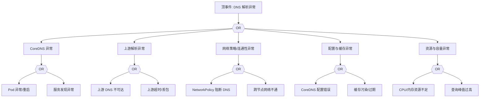

# DNS 异常 FTA 树

## 适用范围与说明
- **目标**：覆盖 DNS 解析失败、延迟升高与解析不一致的关键成因与路径。
- **范围**：CoreDNS 部署、上游解析、网络策略、缓存与配置、资源压力。
- **符号**：
  - **OR 门**：任一子事件成立即可触发父事件
  - **AND 门**：所有子事件同时成立才触发父事件

---

## Mermaid FTA 树



---

## 生产级观测与证据
- **事件**：`SERVFAIL`、解析超时、`NXDOMAIN` 异常升高。
- **关键指标**：`coredns_dns_request_count_total`、`coredns_dns_request_duration_seconds`、`coredns_cache_hits_total`。
- **关键日志**：`coredns` 日志、网络插件日志。
- **配置核对**：CoreDNS `Corefile`、上游 DNS 地址、NetworkPolicy。

---

## JSON 工作流（含与/或门控件）

```json
{
  "flow_steps": [
    { "name": "开始", "action": "start", "step": "start_dns_fta", "next_step": "event_dns_abnormal" },
    { "name": "顶事件: DNS 解析异常", "action": "event", "step": "event_dns_abnormal", "description": "解析超时/SERVFAIL", "next_step": "gate_root_or" },
    { "name": "根因 OR 门", "action": "gate_or", "step": "gate_root_or", "control": "or_gate", "gate_type": "OR", "next_steps": ["cat_core","cat_up","cat_net","cat_cfg","cat_res"] }
  ]
}
```

---

## 版本适配（1.19–1.30）
- **1.19–1.23**：CoreDNS 版本差异较大，需关注缓存与插件兼容性。
- **1.24–1.27**：运行时切换后 coredns 日志路径与资源限制需校验。
- **1.28–1.30**：稳定 API 为主，DNS 观测信号应与审计链路一致。
- **共性**：遵循 `fta_methodology_and_agentic_practices.md` 中的“版本适配基线”。
