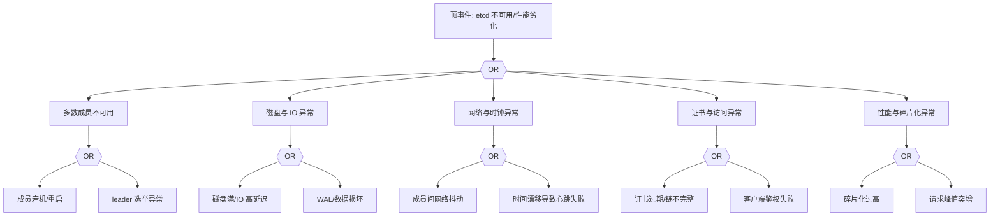

# etcd 异常 FTA 树

## 适用范围与说明
- **目标**：覆盖 etcd 不可用、写入失败与一致性风险的关键成因与路径。
- **范围**：成员可用性、读写性能、磁盘与 IO、网络与时钟、证书与访问控制、碎片与压缩。
- **符号**：
  - **OR 门**：任一子事件成立即可触发父事件
  - **AND 门**：所有子事件同时成立才触发父事件

---

## Mermaid FTA 树



---

## 生产级观测与证据
- **事件**：`etcdserver: request timed out`、`leader changed` 频繁。
- **关键指标**：`etcd_server_has_leader`、`etcd_server_leader_changes_seen_total`、`etcd_disk_wal_fsync_duration_seconds`、`etcd_debugging_mvcc_db_total_size_in_bytes`。
- **关键日志**：`etcd` 日志、apiserver 与 etcd 通信错误日志。
- **配置核对**：磁盘类型、`--quota-backend-bytes`、证书与 peer/client 配置、快照/压缩策略。

---

## JSON 工作流（含与/或门控件）

```json
{
  "flow_steps": [
    { "name": "开始", "action": "start", "step": "start_etcd_fta", "next_step": "event_etcd_abnormal" },
    { "name": "顶事件: etcd 不可用/性能劣化", "action": "event", "step": "event_etcd_abnormal", "description": "读写超时/leader 频繁变更", "next_step": "gate_root_or" },
    { "name": "根因 OR 门", "action": "gate_or", "step": "gate_root_or", "control": "or_gate", "gate_type": "OR", "next_steps": ["cat_quorum","cat_io","cat_net","cat_cert","cat_perf"] },

    { "name": "多数成员不可用", "action": "event", "step": "cat_quorum", "next_step": "gate_quorum_or" },
    { "name": "成员 OR 门", "action": "gate_or", "step": "gate_quorum_or", "control": "or_gate", "gate_type": "OR", "next_steps": ["evt_member_down","evt_leader"] },
    { "name": "成员宕机/重启", "action": "event", "step": "evt_member_down" },
    { "name": "leader 选举异常", "action": "event", "step": "evt_leader" }
  ]
}
```

---

## 版本适配（1.19–1.30）
- **1.19–1.23**：关注 etcd 磁盘与压缩策略，避免碎片化导致写入抖动；证书与 peer/client 配置需明确。
- **1.24–1.27**：升级窗口需与控制面组件一致，确保版本兼容与快照恢复流程可用。
- **1.28–1.30**：仅保留稳定 API 与审计链路，etcd 读写超时需与 APIServer 侧证据闭环。
- **共性**：遵循 `fta_methodology_and_agentic_practices.md` 中的“版本适配基线”。
