<!-- condition: kubectl get gateway,httproute -A -o jsonpath='{range .items[?(@.status.conditions[?(@.type!=\"Ready\" && @.status!=\"Accepted\")])]} {.kind}/{.metadata.namespace}/{.metadata.name}{\"\n\"}{end}' 显示 Gateway API 资源异常 -->

# Gateway API 异常 FTA 树

## 适用范围与说明
- **目标**：覆盖 Gateway API 路由失效、策略冲突与流量异常的关键成因与路径。
- **范围**：Gateway/Route 资源、Controller、证书与 TLS、后端服务、策略与审计。
- **符号**：
  - **OR 门**：任一子事件成立即可触发父事件
  - **AND 门**：所有子事件同时成立才触发父事件

---

## 诊断命令快速参考

### 1. Gateway Controller 诊断命令

| 节点 ID | 名称 | 诊断命令 | 预期输出模式 | 判定 |
|---------|------|----------|--------------|------|
| evt_ctrl_crashloop | Pod CrashLoop | `kubectl get pods -n ${GW_NS} -l app=${CONTROLLER_LABEL} -o wide` | Pod 状态 | CrashLoopBackOff 表示崩溃循环 |
| evt_ctrl_resource | 资源不足 | `kubectl top pod -n ${GW_NS} -l app=${CONTROLLER_LABEL}` | CPU/内存使用量 | 接近 limits 表示资源不足 |
| evt_ctrl_image | 镜像拉取失败 | `kubectl describe pod -n ${GW_NS} -l app=${CONTROLLER_LABEL} \| grep -A5 'Events:'` | 事件信息 | ImagePullBackOff 表示镜像问题 |
| evt_rbac_insufficient | RBAC 权限不足 | `kubectl auth can-i --list --as=system:serviceaccount:${GW_NS}:${SA_NAME}` | 权限列表 | 检查必要权限是否存在 |
| evt_config_error | 配置参数错误 | `kubectl logs -n ${GW_NS} -l app=${CONTROLLER_LABEL} --tail=50 \| grep -i error` | Controller 日志 | 配置错误信息 |
| evt_gwclass_notexist | GatewayClass 不存在 | `kubectl get gatewayclass ${GWCLASS_NAME} -o wide 2>&1` | GatewayClass 状态 | NotFound 表示不存在 |
| evt_gwclass_notready | GatewayClass 未就绪 | `kubectl get gatewayclass ${GWCLASS_NAME} -o jsonpath='{.status.conditions}'` | 条件状态 | Accepted=False 表示未就绪 |

### 2. 路由配置诊断命令

| 节点 ID | 名称 | 诊断命令 | 预期输出模式 | 判定 |
|---------|------|----------|--------------|------|
| evt_hostname_mismatch | hostnames 不匹配 | `kubectl get httproute ${ROUTE_NAME} -n ${NAMESPACE} -o jsonpath='{.spec.hostnames}'` | hostname 列表 | 检查是否包含目标域名 |
| evt_path_error | path 规则错误 | `kubectl get httproute ${ROUTE_NAME} -n ${NAMESPACE} -o jsonpath='{.spec.rules[*].matches}'` | 匹配规则 | 检查 path 配置是否正确 |
| evt_header_fail | headers 匹配失败 | `kubectl get httproute ${ROUTE_NAME} -n ${NAMESPACE} -o yaml \| grep -A10 'headers:'` | header 匹配规则 | 检查 header 配置 |
| evt_parent_notexist | parentRef Gateway 不存在 | `kubectl get gateway ${GW_NAME} -n ${GW_NS} 2>&1` | Gateway 状态 | NotFound 表示不存在 |
| evt_backend_notexist | backendRef Service 不存在 | `kubectl get svc ${SVC_NAME} -n ${NAMESPACE} 2>&1` | Service 状态 | NotFound 表示不存在 |
| evt_route_not_accepted | Route 未被 Accepted | `kubectl get httproute ${ROUTE_NAME} -n ${NAMESPACE} -o jsonpath='{.status.parents[*].conditions}'` | 条件状态 | Accepted=False 表示未接受 |
| evt_route_condition_fail | Route 条件不满足 | `kubectl describe httproute ${ROUTE_NAME} -n ${NAMESPACE}` | Route 详情 | 查看 conditions 和 events |

### 3. TLS 证书诊断命令

| 节点 ID | 名称 | 诊断命令 | 预期输出模式 | 判定 |
|---------|------|----------|--------------|------|
| evt_secret_notexist | Secret 不存在 | `kubectl get secret ${TLS_SECRET} -n ${GW_NS} 2>&1` | Secret 状态 | NotFound 表示不存在 |
| evt_secret_format_error | Secret 格式错误 | `kubectl get secret ${TLS_SECRET} -n ${GW_NS} -o jsonpath='{.data}' \| grep -E '(tls.crt\|tls.key)'` | Secret 数据键 | 缺少 tls.crt/tls.key 表示格式错误 |
| evt_cert_domain_mismatch | 证书与域名不匹配 | `kubectl get secret ${TLS_SECRET} -n ${GW_NS} -o jsonpath='{.data.tls\\.crt}' \| base64 -d \| openssl x509 -noout -subject -ext subjectAltName` | 证书 CN/SAN | 检查是否包含目标域名 |
| evt_cert_expired | 证书过期 | `kubectl get secret ${TLS_SECRET} -n ${GW_NS} -o jsonpath='{.data.tls\\.crt}' \| base64 -d \| openssl x509 -noout -dates` | 证书日期 | notAfter 早于当前时间表示过期 |
| evt_cert_chain_incomplete | 证书链不完整 | `kubectl get secret ${TLS_SECRET} -n ${GW_NS} -o jsonpath='{.data.tls\\.crt}' \| base64 -d \| openssl verify -CAfile /etc/ssl/certs/ca-certificates.crt` | 验证结果 | verify error 表示证书链问题 |
| evt_tls_mode_error | TLS 模式配置错误 | `kubectl get gateway ${GW_NAME} -n ${GW_NS} -o jsonpath='{.spec.listeners[*].tls}'` | TLS 配置 | 检查 mode 是否正确 |
| evt_tls_version_incompatible | TLS 版本不兼容 | `curl -v --tlsv1.2 https://${GATEWAY_HOST}/ 2>&1 \| grep -i 'ssl\|tls'` | TLS 握手信息 | 版本错误表示不兼容 |

### 4. 后端 Service 诊断命令

| 节点 ID | 名称 | 诊断命令 | 预期输出模式 | 判定 |
|---------|------|----------|--------------|------|
| evt_no_endpoint | 无可用 Endpoint | `kubectl get endpoints ${SVC_NAME} -n ${NAMESPACE} -o jsonpath='{.subsets[*].addresses}'` | Endpoint 地址 | 空表示无可用 Endpoint |
| evt_all_unhealthy | 后端 Pod 全部不健康 | `kubectl get pods -n ${NAMESPACE} -l ${POD_SELECTOR} -o jsonpath='{range .items[*]}{.metadata.name}: Ready={.status.conditions[?(@.type=="Ready")].status}{"\n"}{end}'` | Pod Ready 状态 | 全部 False 表示不健康 |
| evt_port_error | 端口号错误 | `kubectl get httproute ${ROUTE_NAME} -n ${NAMESPACE} -o jsonpath='{.spec.rules[*].backendRefs[*].port}'` | backendRef 端口 | 与 Service 端口对比 |
| evt_protocol_mismatch | 协议不匹配 | `kubectl get svc ${SVC_NAME} -n ${NAMESPACE} -o jsonpath='{.spec.ports[*]}'` | Service 端口配置 | 检查协议是否匹配 |
| evt_health_fail | 健康检查失败 | `kubectl get pods -n ${NAMESPACE} -l ${POD_SELECTOR} -o jsonpath='{range .items[*]}{.metadata.name}: {.status.containerStatuses[*].ready}{"\n"}{end}'` | 容器 Ready 状态 | false 表示健康检查失败 |
| evt_health_config_error | 健康检查配置错误 | `kubectl get pod ${POD_NAME} -n ${NAMESPACE} -o jsonpath='{.spec.containers[*].readinessProbe}'` | readinessProbe 配置 | 检查配置是否正确 |

### 5. 策略与审计诊断命令

| 节点 ID | 名称 | 诊断命令 | 预期输出模式 | 判定 |
|---------|------|----------|--------------|------|
| evt_route_priority_conflict | 多 Route 优先级冲突 | `kubectl get httproute -n ${NAMESPACE} -o jsonpath='{range .items[*]}{.metadata.name}: hostnames={.spec.hostnames}, rules={.spec.rules[*].matches[*].path}{"\n"}{end}'` | Route 匹配规则 | 多个 Route 匹配相同路径表示冲突 |
| evt_listener_conflict | Gateway 监听器冲突 | `kubectl get gateway ${GW_NAME} -n ${GW_NS} -o jsonpath='{.spec.listeners}'` | listener 配置 | 相同端口不同协议表示冲突 |
| evt_timeout_config | 超时配置不当 | `kubectl get httproute ${ROUTE_NAME} -n ${NAMESPACE} -o yaml \| grep -A5 'timeouts:'` | 超时配置 | 检查超时值是否合理 |
| evt_retry_error | 重试策略错误 | `kubectl get httproute ${ROUTE_NAME} -n ${NAMESPACE} -o yaml \| grep -A10 'retry:'` | 重试配置 | 检查重试参数是否正确 |
| evt_no_audit | 无审计日志 | `kubectl logs -n ${GW_NS} -l app=${CONTROLLER_LABEL} --tail=100 \| grep -i 'access\|audit'` | 审计日志 | 无输出表示未启用审计 |
| evt_no_rollback | 回滚路径缺失 | `kubectl get httproute ${ROUTE_NAME} -n ${NAMESPACE} -o jsonpath='{.metadata.annotations}'` | 注解信息 | 无版本注解表示无回滚路径 |

---

## Mermaid FTA 树

```mermaid
flowchart TD
  TE[顶事件: Gateway API 访问异常]
  OR0{{OR}}
  TE --> OR0

  OR0 --> CTRL[Gateway Controller 异常]
  OR0 --> ROUTE[路由配置错误]
  OR0 --> TLS[TLS 证书异常]
  OR0 --> SVC[后端 Service 异常]
  OR0 --> POLICY[策略冲突]

  %% Gateway Controller 异常分支 - 扩展到3-4层
  CTRL_OR{{OR}}
  CTRL --> CTRL_OR
  CTRL_OR --> CTRL1[Controller Pod 异常]
  CTRL_OR --> CTRL2[Controller 配置问题]
  CTRL_OR --> CTRL3[GatewayClass 问题]

  CTRL1_OR{{OR}}
  CTRL1 --> CTRL1_OR
  CTRL1_OR --> CTRL1A[Pod CrashLoop]
  CTRL1_OR --> CTRL1B[资源不足]
  CTRL1_OR --> CTRL1C[镜像拉取失败]

  CTRL2_OR{{OR}}
  CTRL2 --> CTRL2_OR
  CTRL2_OR --> CTRL2A[RBAC 权限不足]
  CTRL2_OR --> CTRL2B[配置参数错误]

  CTRL3_OR{{OR}}
  CTRL3 --> CTRL3_OR
  CTRL3_OR --> CTRL3A[GatewayClass 不存在]
  CTRL3_OR --> CTRL3B[GatewayClass 未就绪]

  %% 路由配置错误分支 - 扩展到3-4层 + AND 门
  ROUTE_OR{{OR}}
  ROUTE --> ROUTE_OR
  ROUTE_OR --> ROUTE1[匹配规则问题]
  ROUTE_OR --> ROUTE2[引用问题]
  ROUTE_OR --> ROUTE3[状态问题]

  ROUTE1_OR{{OR}}
  ROUTE1 --> ROUTE1_OR
  ROUTE1_OR --> ROUTE1A[hostnames 不匹配]
  ROUTE1_OR --> ROUTE1B[path 规则错误]
  ROUTE1_OR --> ROUTE1C[headers 匹配失败]

  ROUTE2_AND{{AND}}
  ROUTE2 --> ROUTE2_AND
  ROUTE2_AND --> ROUTE2A[parentRef Gateway 不存在]
  ROUTE2_AND --> ROUTE2B[backendRef Service 不存在]

  ROUTE3_OR{{OR}}
  ROUTE3 --> ROUTE3_OR
  ROUTE3_OR --> ROUTE3A[Route 未被 Accepted]
  ROUTE3_OR --> ROUTE3B[Route 条件不满足]

  %% TLS 证书异常分支 - 扩展到3-4层
  TLS_OR{{OR}}
  TLS --> TLS_OR
  TLS_OR --> TLS1[证书配置问题]
  TLS_OR --> TLS2[证书有效性问题]
  TLS_OR --> TLS3[TLS 模式问题]

  TLS1_OR{{OR}}
  TLS1 --> TLS1_OR
  TLS1_OR --> TLS1A[Secret 不存在]
  TLS1_OR --> TLS1B[Secret 格式错误]
  TLS1_OR --> TLS1C[证书与域名不匹配]

  TLS2_OR{{OR}}
  TLS2 --> TLS2_OR
  TLS2_OR --> TLS2A[证书过期]
  TLS2_OR --> TLS2B[证书链不完整]

  TLS3_OR{{OR}}
  TLS3 --> TLS3_OR
  TLS3_OR --> TLS3A[TLS 模式配置错误]
  TLS3_OR --> TLS3B[TLS 版本不兼容]

  %% 后端 Service 异常分支 - 扩展到3-4层 + AND 门
  SVC_OR{{OR}}
  SVC --> SVC_OR
  SVC_OR --> SVC1[Endpoint 问题]
  SVC_OR --> SVC2[端口问题]
  SVC_OR --> SVC3[健康检查问题]

  SVC1_AND{{AND}}
  SVC1 --> SVC1_AND
  SVC1_AND --> SVC1A[无可用 Endpoint]
  SVC1_AND --> SVC1B[后端 Pod 全部不健康]

  SVC2_OR{{OR}}
  SVC2 --> SVC2_OR
  SVC2_OR --> SVC2A[端口号错误]
  SVC2_OR --> SVC2B[协议不匹配]

  SVC3_OR{{OR}}
  SVC3 --> SVC3_OR
  SVC3_OR --> SVC3A[健康检查失败]
  SVC3_OR --> SVC3B[健康检查配置错误]

  %% 策略冲突分支 - 扩展到3-4层
  POLICY_OR{{OR}}
  POLICY --> POLICY_OR
  POLICY_OR --> POL1[路由策略问题]
  POLICY_OR --> POL2[流量策略问题]
  POLICY_OR --> POL3[审计问题]

  POL1_OR{{OR}}
  POL1 --> POL1_OR
  POL1_OR --> POL1A[多 Route 优先级冲突]
  POL1_OR --> POL1B[Gateway 监听器冲突]

  POL2_OR{{OR}}
  POL2 --> POL2_OR
  POL2_OR --> POL2A[超时配置不当]
  POL2_OR --> POL2B[重试策略错误]

  POL3_OR{{OR}}
  POL3 --> POL3_OR
  POL3_OR --> POL3A[无审计日志]
  POL3_OR --> POL3B[回滚路径缺失]
```



---

## 生产级观测与证据
- **事件**：路由命中失败、访问超时、证书错误、`404/502/503` 错误。
- **关键指标**：Gateway/Route 状态、`4xx/5xx` 比例、控制器健康、请求延迟。
- **关键日志**：Gateway Controller 日志、LB 日志、后端服务日志。
- **配置核对**：GatewayClass、Gateway、HTTPRoute/TCPRoute/GRPCRoute、TLS Secret、后端 Service。

---

## JSON 工作流（含与/或门控件）

```json
{
  "flow_steps": [
    {
      "name": "开始",
      "action": "start",
      "step": "start_gateway_fta",
      "next_step": "event_gateway_abnormal",
      "cmd": {
        "type": "single",
        "commands": [
          {
            "id": "init_context",
            "description": "初始化 Gateway API 诊断上下文",
            "exec": "kubectl config current-context && kubectl get gatewayclass,gateway,httproute -A --no-headers 2>/dev/null | wc -l",
            "timeout": "5s"
          }
        ]
      },
      "match": {
        "rules": [
          { "if": "命令执行成功", "then": "proceed", "confidence": 1.0 }
        ],
        "default": "proceed"
      }
    },
    {
      "name": "顶事件: Gateway API 访问异常",
      "action": "event",
      "step": "event_gateway_abnormal",
      "description": "路由失效/证书异常",
      "next_step": "gate_root_or",
      "cmd": {
        "type": "parallel",
        "commands": [
          {
            "id": "check_gw_status",
            "description": "检查 Gateway 状态",
            "exec": "kubectl get gateway -A -o wide 2>/dev/null | head -20",
            "timeout": "5s"
          },
          {
            "id": "check_route_status",
            "description": "检查 HTTPRoute 状态",
            "exec": "kubectl get httproute -A -o wide 2>/dev/null | head -20",
            "timeout": "5s"
          },
          {
            "id": "check_controller_status",
            "description": "检查 Gateway Controller 状态",
            "exec": "kubectl get pods -A -l 'app.kubernetes.io/component=controller' -o wide 2>/dev/null | head -10 || kubectl get pods -A | grep -iE '(gateway|envoy|istio|nginx)' | head -10",
            "timeout": "5s"
          }
        ]
      },
      "match": {
        "rules": [
          { "if": "Gateway 状态非 Programmed", "then": "route_to:cat_ctrl", "confidence": 0.85 },
          { "if": "HTTPRoute 状态非 Accepted", "then": "route_to:cat_route", "confidence": 0.85 },
          { "if": "Controller Pod 状态异常", "then": "route_to:cat_ctrl", "confidence": 0.9 }
        ],
        "default": "continue_to:gate_root_or"
      }
    },
    {
      "name": "根因 OR 门",
      "action": "gate_or",
      "step": "gate_root_or",
      "control": "or_gate",
      "gate_type": "OR",
      "next_steps": ["cat_ctrl", "cat_route", "cat_tls", "cat_svc", "cat_policy"],
      "cmd": {
        "type": "parallel",
        "commands": [
          {
            "id": "quick_ctrl_check",
            "description": "快速检查 Controller",
            "exec": "kubectl get pods -n ${GW_NS:-gateway-system} -l 'app.kubernetes.io/component=controller' --no-headers 2>/dev/null | awk '{print $1,$3,$4}' | head -5",
            "timeout": "5s"
          },
          {
            "id": "quick_route_check",
            "description": "快速检查路由状态",
            "exec": "kubectl get httproute ${ROUTE_NAME} -n ${NAMESPACE} -o jsonpath='{.status.parents[0].conditions[0]}' 2>/dev/null || echo 'Route not found or no status'",
            "timeout": "5s"
          },
          {
            "id": "quick_tls_check",
            "description": "快速检查 TLS",
            "exec": "kubectl get gateway ${GW_NAME} -n ${GW_NS} -o jsonpath='{.spec.listeners[*].tls.certificateRefs}' 2>/dev/null || echo 'No TLS config'",
            "timeout": "5s"
          }
        ]
      },
      "match": {
        "rules": [
          { "if": "Controller Pod 非 Running", "then": "prioritize:cat_ctrl", "confidence": 0.9 },
          { "if": "Route 未 Accepted", "then": "prioritize:cat_route", "confidence": 0.85 },
          { "if": "TLS 配置存在问题", "then": "prioritize:cat_tls", "confidence": 0.8 }
        ],
        "default": "check_all_branches"
      }
    },

    {
      "name": "Gateway Controller 异常",
      "action": "category",
      "step": "cat_ctrl",
      "next_step": "gate_ctrl_or",
      "cmd": {
        "type": "parallel",
        "commands": [
          {
            "id": "list_controllers",
            "description": "列出 Gateway Controller",
            "exec": "kubectl get pods -A -l 'app.kubernetes.io/component=controller' -o wide 2>/dev/null || kubectl get pods -A | grep -iE '(gateway-controller|envoy-gateway|istio-gateway)' | head -10",
            "timeout": "10s"
          },
          {
            "id": "check_gatewayclass",
            "description": "检查 GatewayClass",
            "exec": "kubectl get gatewayclass -o wide",
            "timeout": "5s"
          }
        ]
      },
      "match": {
        "rules": [
          { "if": "Controller Pod 不存在或状态异常", "then": "continue_to:gate_ctrl_or", "confidence": 0.9 }
        ],
        "default": "continue_to:gate_ctrl_or"
      }
    },
    {
      "name": "Controller OR 门",
      "action": "gate_or",
      "step": "gate_ctrl_or",
      "control": "or_gate",
      "gate_type": "OR",
      "next_steps": ["cat_ctrl_pod", "cat_ctrl_config", "cat_gwclass"],
      "cmd": {
        "type": "parallel",
        "commands": [
          {
            "id": "check_pod_status",
            "description": "检查 Pod 状态",
            "exec": "kubectl get pods -n ${GW_NS:-gateway-system} -l 'app.kubernetes.io/component=controller' -o jsonpath='{range .items[*]}{.metadata.name}: {.status.phase}, restarts={.status.containerStatuses[0].restartCount}{\"\\n\"}{end}'",
            "timeout": "5s"
          },
          {
            "id": "check_controller_logs",
            "description": "检查 Controller 日志错误",
            "exec": "kubectl logs -n ${GW_NS:-gateway-system} -l 'app.kubernetes.io/component=controller' --tail=30 2>/dev/null | grep -iE '(error|fatal|panic)' | tail -10",
            "timeout": "10s"
          },
          {
            "id": "check_gwclass_status",
            "description": "检查 GatewayClass 状态",
            "exec": "kubectl get gatewayclass -o jsonpath='{range .items[*]}{.metadata.name}: Accepted={.status.conditions[?(@.type==\"Accepted\")].status}{\"\\n\"}{end}'",
            "timeout": "5s"
          }
        ]
      },
      "match": {
        "rules": [
          { "if": "Pod restarts > 0 或状态非 Running", "then": "check:cat_ctrl_pod", "confidence": 0.9 },
          { "if": "日志包含 RBAC/forbidden 错误", "then": "check:cat_ctrl_config", "confidence": 0.85 },
          { "if": "GatewayClass Accepted=False", "then": "check:cat_gwclass", "confidence": 0.9 }
        ],
        "default": "check_all_sub_categories"
      }
    },

    {
      "name": "Controller Pod 异常",
      "action": "category",
      "step": "cat_ctrl_pod",
      "next_step": "gate_ctrl_pod_or",
      "cmd": {
        "type": "single",
        "commands": [
          {
            "id": "describe_controller_pods",
            "description": "获取 Controller Pod 详情",
            "exec": "kubectl describe pods -n ${GW_NS:-gateway-system} -l 'app.kubernetes.io/component=controller' | head -100",
            "timeout": "10s"
          }
        ]
      },
      "match": {
        "rules": [
          { "if": "Pod 详情显示异常", "then": "continue_to:gate_ctrl_pod_or", "confidence": 0.85 }
        ],
        "default": "continue_to:gate_ctrl_pod_or"
      }
    },
    {
      "name": "Controller Pod OR 门",
      "action": "gate_or",
      "step": "gate_ctrl_pod_or",
      "control": "or_gate",
      "gate_type": "OR",
      "next_steps": ["evt_ctrl_crashloop", "evt_ctrl_resource", "evt_ctrl_image"],
      "cmd": {
        "type": "parallel",
        "commands": [
          {
            "id": "check_crashloop",
            "description": "检查 CrashLoopBackOff",
            "exec": "kubectl get pods -n ${GW_NS:-gateway-system} -l 'app.kubernetes.io/component=controller' -o jsonpath='{range .items[*]}{.metadata.name}: {.status.containerStatuses[0].state}{\"\\n\"}{end}'",
            "timeout": "5s"
          },
          {
            "id": "check_resources",
            "description": "检查资源使用",
            "exec": "kubectl top pod -n ${GW_NS:-gateway-system} -l 'app.kubernetes.io/component=controller' 2>/dev/null || echo 'Metrics not available'",
            "timeout": "10s"
          },
          {
            "id": "check_image_status",
            "description": "检查镜像状态",
            "exec": "kubectl get pods -n ${GW_NS:-gateway-system} -l 'app.kubernetes.io/component=controller' -o jsonpath='{range .items[*]}{.metadata.name}: waiting={.status.containerStatuses[0].state.waiting.reason}{\"\\n\"}{end}'",
            "timeout": "5s"
          }
        ]
      },
      "match": {
        "rules": [
          { "if": "state 包含 CrashLoopBackOff", "then": "check:evt_ctrl_crashloop", "confidence": 0.95 },
          { "if": "资源使用接近 limits", "then": "check:evt_ctrl_resource", "confidence": 0.85 },
          { "if": "waiting.reason 为 ImagePullBackOff/ErrImagePull", "then": "check:evt_ctrl_image", "confidence": 0.95 }
        ],
        "default": "check_all_events"
      }
    },
    {
      "name": "Pod CrashLoop",
      "action": "bottom_event",
      "step": "evt_ctrl_crashloop",
      "severity": "critical",
      "probability": "medium",
      "mttr_minutes": 20,
      "detection": {
        "events": ["CrashLoopBackOff"],
        "metrics": ["kube_pod_container_status_waiting_reason{reason=\"CrashLoopBackOff\"} > 0"],
        "logs": ["controller: crash", "panic:"]
      },
      "remediation": {
        "manual_steps": ["检查 Controller 日志", "检查配置和权限"],
        "auto_actions": ["kubectl logs -n gateway-system deploy/gateway-controller"]
      },
      "cmd": {
        "type": "sequence",
        "commands": [
          {
            "id": "get_crash_logs",
            "description": "获取崩溃日志",
            "exec": "kubectl logs -n ${GW_NS:-gateway-system} -l 'app.kubernetes.io/component=controller' --previous --tail=100 2>/dev/null || kubectl logs -n ${GW_NS:-gateway-system} -l 'app.kubernetes.io/component=controller' --tail=100",
            "timeout": "15s"
          },
          {
            "id": "check_restart_count",
            "description": "检查重启次数",
            "exec": "kubectl get pods -n ${GW_NS:-gateway-system} -l 'app.kubernetes.io/component=controller' -o jsonpath='{range .items[*]}{.metadata.name}: restarts={.status.containerStatuses[0].restartCount}, lastState={.status.containerStatuses[0].lastState}{\"\\n\"}{end}'",
            "timeout": "5s"
          },
          {
            "id": "check_events",
            "description": "检查 Pod 事件",
            "exec": "kubectl get events -n ${GW_NS:-gateway-system} --sort-by='.lastTimestamp' | grep -iE '(controller|gateway)' | tail -10",
            "timeout": "10s"
          }
        ]
      },
      "match": {
        "rules": [
          { "if": "日志包含 panic 或 fatal", "then": "confirm:crash_due_to_panic", "confidence": 0.95 },
          { "if": "重启次数持续增加", "then": "confirm:crashloop_active", "confidence": 0.9 },
          { "if": "事件显示 BackOff", "then": "confirm:crashloop_backoff", "confidence": 0.9 }
        ],
        "default": "inconclusive"
      }
    },
    {
      "name": "资源不足",
      "action": "bottom_event",
      "step": "evt_ctrl_resource",
      "severity": "high",
      "probability": "medium",
      "mttr_minutes": 15,
      "detection": {
        "events": ["OOMKilled", "FailedScheduling"],
        "metrics": ["container_memory_working_set_bytes 接近 limits"],
        "logs": ["OOM killed"]
      },
      "remediation": {
        "manual_steps": ["增加资源限制", "优化 Controller 配置"],
        "auto_actions": ["调整 Pod 资源 requests/limits"]
      },
      "cmd": {
        "type": "sequence",
        "commands": [
          {
            "id": "check_resource_usage",
            "description": "检查资源使用量",
            "exec": "kubectl top pod -n ${GW_NS:-gateway-system} -l 'app.kubernetes.io/component=controller' 2>/dev/null || echo 'Metrics server not available'",
            "timeout": "10s"
          },
          {
            "id": "check_resource_limits",
            "description": "检查资源限制配置",
            "exec": "kubectl get pods -n ${GW_NS:-gateway-system} -l 'app.kubernetes.io/component=controller' -o jsonpath='{range .items[*]}{.metadata.name}: requests={.spec.containers[0].resources.requests}, limits={.spec.containers[0].resources.limits}{\"\\n\"}{end}'",
            "timeout": "5s"
          },
          {
            "id": "check_oom_events",
            "description": "检查 OOM 事件",
            "exec": "kubectl get events -n ${GW_NS:-gateway-system} --sort-by='.lastTimestamp' | grep -iE '(oom|memory|killed)' | tail -5",
            "timeout": "10s"
          }
        ]
      },
      "match": {
        "rules": [
          { "if": "内存使用接近 limits (>90%)", "then": "confirm:memory_pressure", "confidence": 0.9 },
          { "if": "事件包含 OOMKilled", "then": "confirm:oom_killed", "confidence": 0.95 },
          { "if": "CPU 使用持续高位", "then": "confirm:cpu_throttling", "confidence": 0.85 }
        ],
        "default": "inconclusive"
      }
    },
    {
      "name": "镜像拉取失败",
      "action": "bottom_event",
      "step": "evt_ctrl_image",
      "severity": "high",
      "probability": "medium",
      "mttr_minutes": 15,
      "detection": {
        "events": ["ImagePullBackOff"],
        "metrics": ["kube_pod_container_status_waiting_reason{reason=\"ImagePullBackOff\"} > 0"],
        "logs": ["Failed to pull image"]
      },
      "remediation": {
        "manual_steps": ["检查镜像地址", "配置 imagePullSecrets"],
        "auto_actions": ["修正镜像配置"]
      },
      "cmd": {
        "type": "sequence",
        "commands": [
          {
            "id": "check_image_config",
            "description": "检查镜像配置",
            "exec": "kubectl get pods -n ${GW_NS:-gateway-system} -l 'app.kubernetes.io/component=controller' -o jsonpath='{range .items[*]}{.metadata.name}: image={.spec.containers[0].image}{\"\\n\"}{end}'",
            "timeout": "5s"
          },
          {
            "id": "check_pull_secrets",
            "description": "检查 imagePullSecrets",
            "exec": "kubectl get pods -n ${GW_NS:-gateway-system} -l 'app.kubernetes.io/component=controller' -o jsonpath='{range .items[*]}{.metadata.name}: imagePullSecrets={.spec.imagePullSecrets}{\"\\n\"}{end}'",
            "timeout": "5s"
          },
          {
            "id": "check_image_events",
            "description": "检查镜像相关事件",
            "exec": "kubectl get events -n ${GW_NS:-gateway-system} --sort-by='.lastTimestamp' | grep -iE '(image|pull|registry)' | tail -10",
            "timeout": "10s"
          }
        ]
      },
      "match": {
        "rules": [
          { "if": "事件显示 ImagePullBackOff/ErrImagePull", "then": "confirm:image_pull_failed", "confidence": 0.95 },
          { "if": "镜像地址不正确或不可达", "then": "confirm:image_not_found", "confidence": 0.9 },
          { "if": "缺少 imagePullSecrets", "then": "confirm:missing_pull_secret", "confidence": 0.85 }
        ],
        "default": "inconclusive"
      }
    },

    {
      "name": "Controller 配置问题",
      "action": "category",
      "step": "cat_ctrl_config",
      "next_step": "gate_ctrl_config_or",
      "cmd": {
        "type": "single",
        "commands": [
          {
            "id": "check_controller_config",
            "description": "检查 Controller 配置",
            "exec": "kubectl get configmap -n ${GW_NS:-gateway-system} -o name | head -10",
            "timeout": "5s"
          }
        ]
      },
      "match": {
        "rules": [
          { "if": "配置存在", "then": "continue_to:gate_ctrl_config_or", "confidence": 0.8 }
        ],
        "default": "continue_to:gate_ctrl_config_or"
      }
    },
    {
      "name": "Controller 配置 OR 门",
      "action": "gate_or",
      "step": "gate_ctrl_config_or",
      "control": "or_gate",
      "gate_type": "OR",
      "next_steps": ["evt_rbac_insufficient", "evt_config_error"],
      "cmd": {
        "type": "parallel",
        "commands": [
          {
            "id": "check_rbac",
            "description": "检查 RBAC 配置",
            "exec": "kubectl get clusterrolebinding -o jsonpath='{range .items[*]}{.metadata.name}: sa={.subjects[*].name}{\"\\n\"}{end}' | grep -i gateway | head -5",
            "timeout": "10s"
          },
          {
            "id": "check_config_errors",
            "description": "检查配置错误",
            "exec": "kubectl logs -n ${GW_NS:-gateway-system} -l 'app.kubernetes.io/component=controller' --tail=50 2>/dev/null | grep -iE '(config|invalid|error)' | tail -10",
            "timeout": "10s"
          }
        ]
      },
      "match": {
        "rules": [
          { "if": "日志包含 forbidden/RBAC", "then": "check:evt_rbac_insufficient", "confidence": 0.9 },
          { "if": "日志包含 invalid config", "then": "check:evt_config_error", "confidence": 0.85 }
        ],
        "default": "check_all_events"
      }
    },
    {
      "name": "RBAC 权限不足",
      "action": "bottom_event",
      "step": "evt_rbac_insufficient",
      "severity": "high",
      "probability": "medium",
      "mttr_minutes": 15,
      "detection": {
        "events": ["Forbidden"],
        "metrics": [],
        "logs": ["controller: forbidden", "RBAC: access denied"]
      },
      "remediation": {
        "manual_steps": ["检查 ClusterRole/ClusterRoleBinding", "授予必要权限"],
        "auto_actions": ["kubectl auth can-i --list --as=system:serviceaccount:gateway-system:gateway-controller"]
      },
      "cmd": {
        "type": "sequence",
        "commands": [
          {
            "id": "get_sa_name",
            "description": "获取 ServiceAccount 名称",
            "exec": "kubectl get pods -n ${GW_NS:-gateway-system} -l 'app.kubernetes.io/component=controller' -o jsonpath='{.items[0].spec.serviceAccountName}'",
            "timeout": "5s"
          },
          {
            "id": "check_sa_permissions",
            "description": "检查 SA 权限",
            "exec": "SA_NAME=$(kubectl get pods -n ${GW_NS:-gateway-system} -l 'app.kubernetes.io/component=controller' -o jsonpath='{.items[0].spec.serviceAccountName}'); kubectl auth can-i --list --as=system:serviceaccount:${GW_NS:-gateway-system}:$SA_NAME 2>/dev/null | head -30",
            "timeout": "15s"
          },
          {
            "id": "check_rbac_logs",
            "description": "检查 RBAC 相关日志",
            "exec": "kubectl logs -n ${GW_NS:-gateway-system} -l 'app.kubernetes.io/component=controller' --tail=100 2>/dev/null | grep -iE '(forbidden|rbac|unauthorized|denied)' | tail -10",
            "timeout": "10s"
          }
        ]
      },
      "match": {
        "rules": [
          { "if": "日志显示 forbidden 访问 Gateway/HTTPRoute 资源", "then": "confirm:rbac_insufficient", "confidence": 0.95 },
          { "if": "权限列表缺少必要的 Gateway API 资源权限", "then": "confirm:missing_permissions", "confidence": 0.9 }
        ],
        "default": "inconclusive"
      }
    },
    {
      "name": "配置参数错误",
      "action": "bottom_event",
      "step": "evt_config_error",
      "severity": "high",
      "probability": "rare",
      "mttr_minutes": 20,
      "detection": {
        "events": [],
        "metrics": [],
        "logs": ["controller: invalid configuration"]
      },
      "remediation": {
        "manual_steps": ["检查 Controller 配置", "参考官方文档"],
        "auto_actions": ["修正配置参数"]
      },
      "cmd": {
        "type": "sequence",
        "commands": [
          {
            "id": "check_controller_args",
            "description": "检查 Controller 启动参数",
            "exec": "kubectl get pods -n ${GW_NS:-gateway-system} -l 'app.kubernetes.io/component=controller' -o jsonpath='{.items[0].spec.containers[0].args}'",
            "timeout": "5s"
          },
          {
            "id": "check_config_logs",
            "description": "检查配置相关日志",
            "exec": "kubectl logs -n ${GW_NS:-gateway-system} -l 'app.kubernetes.io/component=controller' --tail=100 2>/dev/null | grep -iE '(config|parameter|invalid|unknown)' | tail -10",
            "timeout": "10s"
          }
        ]
      },
      "match": {
        "rules": [
          { "if": "日志显示配置参数无效", "then": "confirm:invalid_config", "confidence": 0.9 },
          { "if": "启动参数包含未知选项", "then": "confirm:unknown_parameter", "confidence": 0.85 }
        ],
        "default": "inconclusive"
      }
    },

    {
      "name": "GatewayClass 问题",
      "action": "category",
      "step": "cat_gwclass",
      "next_step": "gate_gwclass_or",
      "cmd": {
        "type": "single",
        "commands": [
          {
            "id": "list_gatewayclasses",
            "description": "列出所有 GatewayClass",
            "exec": "kubectl get gatewayclass -o wide",
            "timeout": "5s"
          }
        ]
      },
      "match": {
        "rules": [
          { "if": "GatewayClass 列表非空", "then": "continue_to:gate_gwclass_or", "confidence": 0.8 }
        ],
        "default": "continue_to:gate_gwclass_or"
      }
    },
    {
      "name": "GatewayClass OR 门",
      "action": "gate_or",
      "step": "gate_gwclass_or",
      "control": "or_gate",
      "gate_type": "OR",
      "next_steps": ["evt_gwclass_notexist", "evt_gwclass_notready"],
      "cmd": {
        "type": "parallel",
        "commands": [
          {
            "id": "check_gwclass_exists",
            "description": "检查目标 GatewayClass 是否存在",
            "exec": "kubectl get gatewayclass ${GWCLASS_NAME:-example-gateway-class} 2>&1",
            "timeout": "5s"
          },
          {
            "id": "check_gwclass_conditions",
            "description": "检查 GatewayClass 条件",
            "exec": "kubectl get gatewayclass -o jsonpath='{range .items[*]}{.metadata.name}: Accepted={.status.conditions[?(@.type==\"Accepted\")].status}, reason={.status.conditions[?(@.type==\"Accepted\")].reason}{\"\\n\"}{end}'",
            "timeout": "5s"
          }
        ]
      },
      "match": {
        "rules": [
          { "if": "GatewayClass NotFound", "then": "check:evt_gwclass_notexist", "confidence": 0.95 },
          { "if": "Accepted=False", "then": "check:evt_gwclass_notready", "confidence": 0.9 }
        ],
        "default": "check_all_events"
      }
    },
    {
      "name": "GatewayClass 不存在",
      "action": "bottom_event",
      "step": "evt_gwclass_notexist",
      "severity": "critical",
      "probability": "rare",
      "mttr_minutes": 15,
      "detection": {
        "events": [],
        "metrics": ["Gateway status 显示 GatewayClass 不存在"],
        "logs": ["GatewayClass not found"]
      },
      "remediation": {
        "manual_steps": ["创建 GatewayClass", "确认 controllerName"],
        "auto_actions": ["kubectl apply -f gatewayclass.yaml"]
      },
      "cmd": {
        "type": "sequence",
        "commands": [
          {
            "id": "list_all_gwclass",
            "description": "列出所有 GatewayClass",
            "exec": "kubectl get gatewayclass -o wide 2>/dev/null || echo 'No GatewayClass found'",
            "timeout": "5s"
          },
          {
            "id": "check_gateway_ref",
            "description": "检查 Gateway 引用的 GatewayClass",
            "exec": "kubectl get gateway ${GW_NAME} -n ${GW_NS} -o jsonpath='{.spec.gatewayClassName}' 2>/dev/null || echo 'Gateway not found'",
            "timeout": "5s"
          },
          {
            "id": "suggest_create",
            "description": "建议创建 GatewayClass",
            "exec": "echo '建议创建 GatewayClass:'; echo 'apiVersion: gateway.networking.k8s.io/v1'; echo 'kind: GatewayClass'; echo 'metadata:'; echo '  name: <name>'; echo 'spec:'; echo '  controllerName: <controller-name>'",
            "timeout": "2s"
          }
        ]
      },
      "match": {
        "rules": [
          { "if": "Gateway 引用的 GatewayClass 不存在", "then": "confirm:gwclass_not_found", "confidence": 0.95 },
          { "if": "无任何 GatewayClass", "then": "confirm:no_gwclass_installed", "confidence": 0.9 }
        ],
        "default": "inconclusive"
      }
    },
    {
      "name": "GatewayClass 未就绪",
      "action": "bottom_event",
      "step": "evt_gwclass_notready",
      "severity": "high",
      "probability": "rare",
      "mttr_minutes": 20,
      "detection": {
        "events": [],
        "metrics": ["GatewayClass status.conditions"],
        "logs": ["GatewayClass not accepted"]
      },
      "remediation": {
        "manual_steps": ["检查 GatewayClass 状态", "检查 Controller 日志"],
        "auto_actions": ["kubectl describe gatewayclass"]
      },
      "cmd": {
        "type": "sequence",
        "commands": [
          {
            "id": "describe_gwclass",
            "description": "获取 GatewayClass 详情",
            "exec": "kubectl describe gatewayclass ${GWCLASS_NAME:-example-gateway-class}",
            "timeout": "5s"
          },
          {
            "id": "check_controller_name",
            "description": "检查 controllerName 是否正确",
            "exec": "kubectl get gatewayclass ${GWCLASS_NAME:-example-gateway-class} -o jsonpath='{.spec.controllerName}'",
            "timeout": "5s"
          },
          {
            "id": "check_controller_logs",
            "description": "检查 Controller 对 GatewayClass 的处理日志",
            "exec": "kubectl logs -n ${GW_NS:-gateway-system} -l 'app.kubernetes.io/component=controller' --tail=50 2>/dev/null | grep -i gatewayclass | tail -10",
            "timeout": "10s"
          }
        ]
      },
      "match": {
        "rules": [
          { "if": "controllerName 与实际 Controller 不匹配", "then": "confirm:controller_name_mismatch", "confidence": 0.95 },
          { "if": "Controller 日志显示无法处理 GatewayClass", "then": "confirm:controller_not_handling", "confidence": 0.9 }
        ],
        "default": "inconclusive"
      }
    },

    {
      "name": "路由配置错误",
      "action": "category",
      "step": "cat_route",
      "next_step": "gate_route_or",
      "cmd": {
        "type": "parallel",
        "commands": [
          {
            "id": "list_routes",
            "description": "列出 HTTPRoute",
            "exec": "kubectl get httproute -n ${NAMESPACE} -o wide 2>/dev/null || kubectl get httproute -A -o wide | head -20",
            "timeout": "5s"
          },
          {
            "id": "describe_route",
            "description": "获取路由详情",
            "exec": "kubectl describe httproute ${ROUTE_NAME} -n ${NAMESPACE} 2>/dev/null | head -50",
            "timeout": "5s"
          }
        ]
      },
      "match": {
        "rules": [
          { "if": "Route 存在但状态异常", "then": "continue_to:gate_route_or", "confidence": 0.85 }
        ],
        "default": "continue_to:gate_route_or"
      }
    },
    {
      "name": "路由 OR 门",
      "action": "gate_or",
      "step": "gate_route_or",
      "control": "or_gate",
      "gate_type": "OR",
      "next_steps": ["cat_match", "cat_ref", "cat_status"],
      "cmd": {
        "type": "parallel",
        "commands": [
          {
            "id": "check_route_matches",
            "description": "检查路由匹配规则",
            "exec": "kubectl get httproute ${ROUTE_NAME} -n ${NAMESPACE} -o jsonpath='{.spec.rules[*].matches}' 2>/dev/null",
            "timeout": "5s"
          },
          {
            "id": "check_route_refs",
            "description": "检查路由引用",
            "exec": "kubectl get httproute ${ROUTE_NAME} -n ${NAMESPACE} -o jsonpath='parentRefs={.spec.parentRefs}, backendRefs={.spec.rules[*].backendRefs}' 2>/dev/null",
            "timeout": "5s"
          },
          {
            "id": "check_route_status",
            "description": "检查路由状态",
            "exec": "kubectl get httproute ${ROUTE_NAME} -n ${NAMESPACE} -o jsonpath='{.status.parents[*].conditions}' 2>/dev/null",
            "timeout": "5s"
          }
        ]
      },
      "match": {
        "rules": [
          { "if": "matches 配置不正确", "then": "check:cat_match", "confidence": 0.85 },
          { "if": "parentRefs/backendRefs 问题", "then": "check:cat_ref", "confidence": 0.9 },
          { "if": "status 显示未 Accepted", "then": "check:cat_status", "confidence": 0.9 }
        ],
        "default": "check_all_sub_categories"
      }
    },

    {
      "name": "匹配规则问题",
      "action": "category",
      "step": "cat_match",
      "next_step": "gate_match_or",
      "cmd": {
        "type": "single",
        "commands": [
          {
            "id": "analyze_matches",
            "description": "分析匹配规则",
            "exec": "kubectl get httproute ${ROUTE_NAME} -n ${NAMESPACE} -o yaml | grep -A30 'rules:' | head -40",
            "timeout": "5s"
          }
        ]
      },
      "match": {
        "rules": [
          { "if": "匹配规则存在", "then": "continue_to:gate_match_or", "confidence": 0.8 }
        ],
        "default": "continue_to:gate_match_or"
      }
    },
    {
      "name": "匹配规则 OR 门",
      "action": "gate_or",
      "step": "gate_match_or",
      "control": "or_gate",
      "gate_type": "OR",
      "next_steps": ["evt_hostname_mismatch", "evt_path_error", "evt_header_fail"],
      "cmd": {
        "type": "parallel",
        "commands": [
          {
            "id": "check_hostnames",
            "description": "检查 hostnames",
            "exec": "kubectl get httproute ${ROUTE_NAME} -n ${NAMESPACE} -o jsonpath='{.spec.hostnames}'",
            "timeout": "5s"
          },
          {
            "id": "check_paths",
            "description": "检查 path 规则",
            "exec": "kubectl get httproute ${ROUTE_NAME} -n ${NAMESPACE} -o jsonpath='{range .spec.rules[*].matches[*]}{.path}{\"\\n\"}{end}'",
            "timeout": "5s"
          },
          {
            "id": "check_headers",
            "description": "检查 headers 规则",
            "exec": "kubectl get httproute ${ROUTE_NAME} -n ${NAMESPACE} -o jsonpath='{range .spec.rules[*].matches[*]}{.headers}{\"\\n\"}{end}'",
            "timeout": "5s"
          }
        ]
      },
      "match": {
        "rules": [
          { "if": "hostnames 为空或不匹配目标", "then": "check:evt_hostname_mismatch", "confidence": 0.9 },
          { "if": "path 配置不正确", "then": "check:evt_path_error", "confidence": 0.85 },
          { "if": "headers 匹配规则存在问题", "then": "check:evt_header_fail", "confidence": 0.8 }
        ],
        "default": "check_all_events"
      }
    },
    {
      "name": "hostnames 不匹配",
      "action": "bottom_event",
      "step": "evt_hostname_mismatch",
      "severity": "high",
      "probability": "common",
      "mttr_minutes": 10,
      "detection": {
        "events": ["路由未命中"],
        "metrics": ["404 错误率高"],
        "logs": ["no matching hostname"]
      },
      "remediation": {
        "manual_steps": ["检查 HTTPRoute hostnames 配置", "确认请求 Host 头"],
        "auto_actions": ["修正 hostnames 配置"]
      },
      "cmd": {
        "type": "sequence",
        "commands": [
          {
            "id": "get_route_hostnames",
            "description": "获取 Route hostnames",
            "exec": "kubectl get httproute ${ROUTE_NAME} -n ${NAMESPACE} -o jsonpath='Route hostnames: {.spec.hostnames}'",
            "timeout": "5s"
          },
          {
            "id": "get_gateway_listeners",
            "description": "获取 Gateway listener hostnames",
            "exec": "kubectl get gateway ${GW_NAME} -n ${GW_NS} -o jsonpath='{range .spec.listeners[*]}listener: {.name}, hostname: {.hostname}{\"\\n\"}{end}'",
            "timeout": "5s"
          },
          {
            "id": "test_host_access",
            "description": "测试指定 Host 访问",
            "exec": "curl -v -H 'Host: ${TARGET_HOST}' http://${GW_IP}:${GW_PORT}/ 2>&1 | head -30 || echo 'curl not available or connection failed'",
            "timeout": "15s"
          }
        ]
      },
      "match": {
        "rules": [
          { "if": "Route hostnames 与请求 Host 不匹配", "then": "confirm:hostname_mismatch", "confidence": 0.95 },
          { "if": "Gateway listener hostname 与 Route 不兼容", "then": "confirm:listener_hostname_conflict", "confidence": 0.9 }
        ],
        "default": "inconclusive"
      }
    },
    {
      "name": "path 规则错误",
      "action": "bottom_event",
      "step": "evt_path_error",
      "severity": "high",
      "probability": "common",
      "mttr_minutes": 10,
      "detection": {
        "events": ["路由未命中"],
        "metrics": ["404 错误率高"],
        "logs": ["no matching path"]
      },
      "remediation": {
        "manual_steps": ["检查 path match 配置", "验证 PathPrefix/Exact/RegularExpression"],
        "auto_actions": ["修正 path 配置"]
      },
      "cmd": {
        "type": "sequence",
        "commands": [
          {
            "id": "get_path_rules",
            "description": "获取 path 匹配规则",
            "exec": "kubectl get httproute ${ROUTE_NAME} -n ${NAMESPACE} -o jsonpath='{range .spec.rules[*].matches[*]}type={.path.type}, value={.path.value}{\"\\n\"}{end}'",
            "timeout": "5s"
          },
          {
            "id": "test_path_access",
            "description": "测试 path 访问",
            "exec": "curl -v http://${GW_IP}:${GW_PORT}${TARGET_PATH} 2>&1 | head -20 || echo 'curl not available'",
            "timeout": "10s"
          }
        ]
      },
      "match": {
        "rules": [
          { "if": "path.type 为 Exact 但请求路径不完全匹配", "then": "confirm:exact_path_mismatch", "confidence": 0.95 },
          { "if": "path.type 为 PathPrefix 但请求路径不以其开头", "then": "confirm:prefix_mismatch", "confidence": 0.9 }
        ],
        "default": "inconclusive"
      }
    },
    {
      "name": "headers 匹配失败",
      "action": "bottom_event",
      "step": "evt_header_fail",
      "severity": "medium",
      "probability": "medium",
      "mttr_minutes": 15,
      "detection": {
        "events": [],
        "metrics": [],
        "logs": ["header match failed"]
      },
      "remediation": {
        "manual_steps": ["检查 headers 匹配规则", "验证请求头"],
        "auto_actions": ["修正 headers 配置"]
      },
      "cmd": {
        "type": "sequence",
        "commands": [
          {
            "id": "get_header_rules",
            "description": "获取 header 匹配规则",
            "exec": "kubectl get httproute ${ROUTE_NAME} -n ${NAMESPACE} -o yaml | grep -A10 'headers:' | head -15",
            "timeout": "5s"
          },
          {
            "id": "test_header_access",
            "description": "测试带 header 访问",
            "exec": "curl -v -H '${HEADER_NAME}: ${HEADER_VALUE}' http://${GW_IP}:${GW_PORT}${TARGET_PATH} 2>&1 | head -20 || echo 'curl not available'",
            "timeout": "10s"
          }
        ]
      },
      "match": {
        "rules": [
          { "if": "header 匹配类型或值不正确", "then": "confirm:header_match_error", "confidence": 0.85 },
          { "if": "请求缺少必需的 header", "then": "confirm:missing_required_header", "confidence": 0.9 }
        ],
        "default": "inconclusive"
      }
    },

    {
      "name": "引用问题",
      "action": "category",
      "step": "cat_ref",
      "next_step": "gate_ref_and",
      "cmd": {
        "type": "single",
        "commands": [
          {
            "id": "check_references",
            "description": "检查资源引用",
            "exec": "kubectl get httproute ${ROUTE_NAME} -n ${NAMESPACE} -o jsonpath='parentRefs: {.spec.parentRefs}, backendRefs: {.spec.rules[*].backendRefs}'",
            "timeout": "5s"
          }
        ]
      },
      "match": {
        "rules": [
          { "if": "引用配置存在", "then": "continue_to:gate_ref_and", "confidence": 0.8 }
        ],
        "default": "continue_to:gate_ref_and"
      }
    },
    {
      "name": "引用 AND 门",
      "action": "gate_and",
      "step": "gate_ref_and",
      "control": "and_gate",
      "gate_type": "AND",
      "description": "parentRef Gateway 和 backendRef Service 同时存在问题导致路由完全失效",
      "next_steps": ["evt_parent_notexist", "evt_backend_notexist"],
      "cmd": {
        "type": "parallel",
        "commands": [
          {
            "id": "check_parent_gateway",
            "description": "检查 parentRef Gateway",
            "exec": "GW_NAME=$(kubectl get httproute ${ROUTE_NAME} -n ${NAMESPACE} -o jsonpath='{.spec.parentRefs[0].name}'); GW_NS=$(kubectl get httproute ${ROUTE_NAME} -n ${NAMESPACE} -o jsonpath='{.spec.parentRefs[0].namespace}'); kubectl get gateway $GW_NAME -n ${GW_NS:-${NAMESPACE}} 2>&1",
            "timeout": "10s"
          },
          {
            "id": "check_backend_service",
            "description": "检查 backendRef Service",
            "exec": "SVC_NAME=$(kubectl get httproute ${ROUTE_NAME} -n ${NAMESPACE} -o jsonpath='{.spec.rules[0].backendRefs[0].name}'); kubectl get svc $SVC_NAME -n ${NAMESPACE} 2>&1",
            "timeout": "10s"
          }
        ]
      },
      "match": {
        "rules": [
          { "if": "Gateway NotFound 且 Service NotFound", "then": "and_gate_satisfied", "confidence": 0.95 }
        ],
        "default": "and_gate_partial"
      }
    },
    {
      "name": "parentRef Gateway 不存在",
      "action": "bottom_event",
      "step": "evt_parent_notexist",
      "severity": "critical",
      "probability": "rare",
      "mttr_minutes": 15,
      "detection": {
        "events": [],
        "metrics": ["Route status 显示 parentRef 问题"],
        "logs": ["Gateway not found"]
      },
      "remediation": {
        "manual_steps": ["创建 Gateway", "修正 parentRef"],
        "auto_actions": ["kubectl apply -f gateway.yaml"]
      },
      "cmd": {
        "type": "sequence",
        "commands": [
          {
            "id": "get_parent_ref",
            "description": "获取 parentRef 配置",
            "exec": "kubectl get httproute ${ROUTE_NAME} -n ${NAMESPACE} -o jsonpath='{.spec.parentRefs}'",
            "timeout": "5s"
          },
          {
            "id": "verify_gateway_exists",
            "description": "验证 Gateway 是否存在",
            "exec": "GW_NAME=$(kubectl get httproute ${ROUTE_NAME} -n ${NAMESPACE} -o jsonpath='{.spec.parentRefs[0].name}'); GW_NS=$(kubectl get httproute ${ROUTE_NAME} -n ${NAMESPACE} -o jsonpath='{.spec.parentRefs[0].namespace}'); kubectl get gateway $GW_NAME -n ${GW_NS:-${NAMESPACE}} -o wide 2>&1",
            "timeout": "10s"
          },
          {
            "id": "list_available_gateways",
            "description": "列出可用的 Gateway",
            "exec": "kubectl get gateway -A -o wide",
            "timeout": "5s"
          }
        ]
      },
      "match": {
        "rules": [
          { "if": "Gateway NotFound", "then": "confirm:parent_gateway_not_found", "confidence": 0.95 },
          { "if": "parentRef namespace 配置错误", "then": "confirm:parent_ref_ns_error", "confidence": 0.9 }
        ],
        "default": "inconclusive"
      }
    },
    {
      "name": "backendRef Service 不存在",
      "action": "bottom_event",
      "step": "evt_backend_notexist",
      "severity": "critical",
      "probability": "medium",
      "mttr_minutes": 15,
      "detection": {
        "events": [],
        "metrics": ["Route status 显示 backendRef 问题"],
        "logs": ["Service not found"]
      },
      "remediation": {
        "manual_steps": ["创建 Service", "修正 backendRef"],
        "auto_actions": ["kubectl apply -f service.yaml"]
      },
      "cmd": {
        "type": "sequence",
        "commands": [
          {
            "id": "get_backend_ref",
            "description": "获取 backendRef 配置",
            "exec": "kubectl get httproute ${ROUTE_NAME} -n ${NAMESPACE} -o jsonpath='{.spec.rules[*].backendRefs}'",
            "timeout": "5s"
          },
          {
            "id": "verify_service_exists",
            "description": "验证 Service 是否存在",
            "exec": "SVC_NAME=$(kubectl get httproute ${ROUTE_NAME} -n ${NAMESPACE} -o jsonpath='{.spec.rules[0].backendRefs[0].name}'); kubectl get svc $SVC_NAME -n ${NAMESPACE} -o wide 2>&1",
            "timeout": "10s"
          },
          {
            "id": "list_namespace_services",
            "description": "列出命名空间内的 Service",
            "exec": "kubectl get svc -n ${NAMESPACE} -o wide",
            "timeout": "5s"
          }
        ]
      },
      "match": {
        "rules": [
          { "if": "Service NotFound", "then": "confirm:backend_service_not_found", "confidence": 0.95 },
          { "if": "Service 名称拼写错误", "then": "confirm:backend_name_typo", "confidence": 0.9 }
        ],
        "default": "inconclusive"
      }
    },

    {
      "name": "状态问题",
      "action": "category",
      "step": "cat_status",
      "next_step": "gate_status_or",
      "cmd": {
        "type": "single",
        "commands": [
          {
            "id": "check_route_status",
            "description": "检查 Route 状态",
            "exec": "kubectl get httproute ${ROUTE_NAME} -n ${NAMESPACE} -o jsonpath='{.status}'",
            "timeout": "5s"
          }
        ]
      },
      "match": {
        "rules": [
          { "if": "status 存在异常条件", "then": "continue_to:gate_status_or", "confidence": 0.85 }
        ],
        "default": "continue_to:gate_status_or"
      }
    },
    {
      "name": "状态 OR 门",
      "action": "gate_or",
      "step": "gate_status_or",
      "control": "or_gate",
      "gate_type": "OR",
      "next_steps": ["evt_route_not_accepted", "evt_route_condition_fail"],
      "cmd": {
        "type": "parallel",
        "commands": [
          {
            "id": "check_accepted",
            "description": "检查 Accepted 条件",
            "exec": "kubectl get httproute ${ROUTE_NAME} -n ${NAMESPACE} -o jsonpath='{range .status.parents[*]}{.parentRef.name}: Accepted={.conditions[?(@.type==\"Accepted\")].status}{\"\\n\"}{end}'",
            "timeout": "5s"
          },
          {
            "id": "check_all_conditions",
            "description": "检查所有条件",
            "exec": "kubectl get httproute ${ROUTE_NAME} -n ${NAMESPACE} -o jsonpath='{range .status.parents[*].conditions[*]}{.type}={.status}: {.reason}{\"\\n\"}{end}'",
            "timeout": "5s"
          }
        ]
      },
      "match": {
        "rules": [
          { "if": "Accepted=False", "then": "check:evt_route_not_accepted", "confidence": 0.95 },
          { "if": "其他条件为 False", "then": "check:evt_route_condition_fail", "confidence": 0.85 }
        ],
        "default": "check_all_events"
      }
    },
    {
      "name": "Route 未被 Accepted",
      "action": "bottom_event",
      "step": "evt_route_not_accepted",
      "severity": "high",
      "probability": "medium",
      "mttr_minutes": 15,
      "detection": {
        "events": [],
        "metrics": ["Route status.conditions Accepted=False"],
        "logs": ["Route not accepted"]
      },
      "remediation": {
        "manual_steps": ["检查 Route status", "查看 Controller 日志"],
        "auto_actions": ["kubectl describe httproute <name>"]
      },
      "cmd": {
        "type": "sequence",
        "commands": [
          {
            "id": "get_accepted_reason",
            "description": "获取 Accepted 条件详情",
            "exec": "kubectl get httproute ${ROUTE_NAME} -n ${NAMESPACE} -o jsonpath='{range .status.parents[*]}Gateway: {.parentRef.name}, Accepted: {.conditions[?(@.type==\"Accepted\")].status}, Reason: {.conditions[?(@.type==\"Accepted\")].reason}, Message: {.conditions[?(@.type==\"Accepted\")].message}{\"\\n\"}{end}'",
            "timeout": "5s"
          },
          {
            "id": "check_gateway_allowed",
            "description": "检查 Gateway 是否允许此 Route",
            "exec": "kubectl get gateway ${GW_NAME} -n ${GW_NS} -o jsonpath='{.spec.listeners[*].allowedRoutes}'",
            "timeout": "5s"
          }
        ]
      },
      "match": {
        "rules": [
          { "if": "reason 为 NotAllowedByListeners", "then": "confirm:listener_not_allow_route", "confidence": 0.95 },
          { "if": "reason 为 NoMatchingParent", "then": "confirm:no_matching_gateway", "confidence": 0.95 },
          { "if": "reason 为 UnsupportedValue", "then": "confirm:unsupported_config", "confidence": 0.9 }
        ],
        "default": "inconclusive"
      }
    },
    {
      "name": "Route 条件不满足",
      "action": "bottom_event",
      "step": "evt_route_condition_fail",
      "severity": "high",
      "probability": "medium",
      "mttr_minutes": 15,
      "detection": {
        "events": [],
        "metrics": ["Route status.conditions"],
        "logs": ["Route condition not met"]
      },
      "remediation": {
        "manual_steps": ["检查 Route conditions", "修复不满足的条件"],
        "auto_actions": ["kubectl get httproute <name> -o yaml"]
      },
      "cmd": {
        "type": "sequence",
        "commands": [
          {
            "id": "list_all_conditions",
            "description": "列出所有 Route 条件",
            "exec": "kubectl get httproute ${ROUTE_NAME} -n ${NAMESPACE} -o jsonpath='{range .status.parents[*].conditions[*]}type={.type}, status={.status}, reason={.reason}, message={.message}{\"\\n\"}{end}'",
            "timeout": "5s"
          },
          {
            "id": "describe_route",
            "description": "获取 Route 完整描述",
            "exec": "kubectl describe httproute ${ROUTE_NAME} -n ${NAMESPACE}",
            "timeout": "5s"
          }
        ]
      },
      "match": {
        "rules": [
          { "if": "ResolvedRefs=False", "then": "confirm:unresolved_refs", "confidence": 0.9 },
          { "if": "其他条件 status=False", "then": "confirm:condition_not_met", "confidence": 0.85 }
        ],
        "default": "inconclusive"
      }
    },

    {
      "name": "TLS 证书异常",
      "action": "category",
      "step": "cat_tls",
      "next_step": "gate_tls_or",
      "cmd": {
        "type": "parallel",
        "commands": [
          {
            "id": "check_gateway_tls",
            "description": "检查 Gateway TLS 配置",
            "exec": "kubectl get gateway ${GW_NAME} -n ${GW_NS} -o jsonpath='{range .spec.listeners[*]}{.name}: protocol={.protocol}, tls={.tls}{\"\\n\"}{end}'",
            "timeout": "5s"
          },
          {
            "id": "check_tls_secrets",
            "description": "检查 TLS Secret",
            "exec": "kubectl get secret -n ${GW_NS} -l 'app.kubernetes.io/component=tls' -o wide 2>/dev/null || kubectl get secret -n ${GW_NS} --field-selector type=kubernetes.io/tls -o wide",
            "timeout": "5s"
          }
        ]
      },
      "match": {
        "rules": [
          { "if": "TLS 配置存在", "then": "continue_to:gate_tls_or", "confidence": 0.8 }
        ],
        "default": "continue_to:gate_tls_or"
      }
    },
    {
      "name": "TLS OR 门",
      "action": "gate_or",
      "step": "gate_tls_or",
      "control": "or_gate",
      "gate_type": "OR",
      "next_steps": ["cat_tls_config", "cat_tls_validity", "cat_tls_mode"],
      "cmd": {
        "type": "parallel",
        "commands": [
          {
            "id": "check_cert_refs",
            "description": "检查证书引用",
            "exec": "kubectl get gateway ${GW_NAME} -n ${GW_NS} -o jsonpath='{.spec.listeners[*].tls.certificateRefs}'",
            "timeout": "5s"
          },
          {
            "id": "check_tls_mode",
            "description": "检查 TLS 模式",
            "exec": "kubectl get gateway ${GW_NAME} -n ${GW_NS} -o jsonpath='{.spec.listeners[*].tls.mode}'",
            "timeout": "5s"
          }
        ]
      },
      "match": {
        "rules": [
          { "if": "certificateRefs 引用的 Secret 不存在", "then": "check:cat_tls_config", "confidence": 0.9 },
          { "if": "TLS mode 配置不正确", "then": "check:cat_tls_mode", "confidence": 0.85 }
        ],
        "default": "check_all_sub_categories"
      }
    },

    {
      "name": "证书配置问题",
      "action": "category",
      "step": "cat_tls_config",
      "next_step": "gate_tls_config_or",
      "cmd": {
        "type": "single",
        "commands": [
          {
            "id": "analyze_tls_config",
            "description": "分析 TLS 配置",
            "exec": "kubectl get gateway ${GW_NAME} -n ${GW_NS} -o yaml | grep -A20 'tls:' | head -25",
            "timeout": "5s"
          }
        ]
      },
      "match": {
        "rules": [
          { "if": "TLS 配置存在", "then": "continue_to:gate_tls_config_or", "confidence": 0.8 }
        ],
        "default": "continue_to:gate_tls_config_or"
      }
    },
    {
      "name": "证书配置 OR 门",
      "action": "gate_or",
      "step": "gate_tls_config_or",
      "control": "or_gate",
      "gate_type": "OR",
      "next_steps": ["evt_secret_notexist", "evt_secret_format_error", "evt_cert_domain_mismatch"],
      "cmd": {
        "type": "parallel",
        "commands": [
          {
            "id": "check_secret_exists",
            "description": "检查 Secret 是否存在",
            "exec": "SECRET_NAME=$(kubectl get gateway ${GW_NAME} -n ${GW_NS} -o jsonpath='{.spec.listeners[0].tls.certificateRefs[0].name}'); kubectl get secret $SECRET_NAME -n ${GW_NS} 2>&1",
            "timeout": "10s"
          },
          {
            "id": "check_secret_keys",
            "description": "检查 Secret 数据键",
            "exec": "SECRET_NAME=$(kubectl get gateway ${GW_NAME} -n ${GW_NS} -o jsonpath='{.spec.listeners[0].tls.certificateRefs[0].name}'); kubectl get secret $SECRET_NAME -n ${GW_NS} -o jsonpath='{.data}' 2>/dev/null | grep -oE '\"(tls\\.crt|tls\\.key)\"'",
            "timeout": "10s"
          }
        ]
      },
      "match": {
        "rules": [
          { "if": "Secret NotFound", "then": "check:evt_secret_notexist", "confidence": 0.95 },
          { "if": "缺少 tls.crt 或 tls.key", "then": "check:evt_secret_format_error", "confidence": 0.9 }
        ],
        "default": "check_all_events"
      }
    },
    {
      "name": "Secret 不存在",
      "action": "bottom_event",
      "step": "evt_secret_notexist",
      "severity": "critical",
      "probability": "common",
      "mttr_minutes": 10,
      "detection": {
        "events": [],
        "metrics": ["Gateway status 显示 TLS 问题"],
        "logs": ["Secret not found"]
      },
      "remediation": {
        "manual_steps": ["创建 TLS Secret", "检查 secretRef"],
        "auto_actions": ["kubectl create secret tls ..."]
      },
      "cmd": {
        "type": "sequence",
        "commands": [
          {
            "id": "get_cert_ref",
            "description": "获取证书引用",
            "exec": "kubectl get gateway ${GW_NAME} -n ${GW_NS} -o jsonpath='{.spec.listeners[*].tls.certificateRefs}'",
            "timeout": "5s"
          },
          {
            "id": "verify_secret",
            "description": "验证 Secret 是否存在",
            "exec": "SECRET_NAME=$(kubectl get gateway ${GW_NAME} -n ${GW_NS} -o jsonpath='{.spec.listeners[0].tls.certificateRefs[0].name}'); SECRET_NS=$(kubectl get gateway ${GW_NAME} -n ${GW_NS} -o jsonpath='{.spec.listeners[0].tls.certificateRefs[0].namespace}'); kubectl get secret $SECRET_NAME -n ${SECRET_NS:-${GW_NS}} 2>&1",
            "timeout": "10s"
          },
          {
            "id": "list_tls_secrets",
            "description": "列出可用的 TLS Secret",
            "exec": "kubectl get secret -n ${GW_NS} --field-selector type=kubernetes.io/tls -o wide",
            "timeout": "5s"
          }
        ]
      },
      "match": {
        "rules": [
          { "if": "Secret NotFound", "then": "confirm:tls_secret_not_found", "confidence": 0.95 },
          { "if": "Secret 命名空间引用错误", "then": "confirm:secret_ns_error", "confidence": 0.9 }
        ],
        "default": "inconclusive"
      }
    },
    {
      "name": "Secret 格式错误",
      "action": "bottom_event",
      "step": "evt_secret_format_error",
      "severity": "high",
      "probability": "rare",
      "mttr_minutes": 15,
      "detection": {
        "events": [],
        "metrics": [],
        "logs": ["invalid TLS secret format"]
      },
      "remediation": {
        "manual_steps": ["检查 Secret 格式", "确认 tls.crt/tls.key"],
        "auto_actions": ["重新创建 Secret"]
      },
      "cmd": {
        "type": "sequence",
        "commands": [
          {
            "id": "check_secret_type",
            "description": "检查 Secret 类型",
            "exec": "kubectl get secret ${TLS_SECRET} -n ${GW_NS} -o jsonpath='{.type}'",
            "timeout": "5s"
          },
          {
            "id": "check_secret_data",
            "description": "检查 Secret 数据键",
            "exec": "kubectl get secret ${TLS_SECRET} -n ${GW_NS} -o jsonpath='{range .data}key: {}{\"\\n\"}{end}' | head -10",
            "timeout": "5s"
          },
          {
            "id": "validate_cert_format",
            "description": "验证证书格式",
            "exec": "kubectl get secret ${TLS_SECRET} -n ${GW_NS} -o jsonpath='{.data.tls\\.crt}' | base64 -d | openssl x509 -noout -text 2>&1 | head -20",
            "timeout": "10s"
          }
        ]
      },
      "match": {
        "rules": [
          { "if": "Secret type 不是 kubernetes.io/tls", "then": "confirm:wrong_secret_type", "confidence": 0.9 },
          { "if": "缺少 tls.crt 或 tls.key 键", "then": "confirm:missing_tls_keys", "confidence": 0.95 },
          { "if": "证书解析失败", "then": "confirm:invalid_cert_format", "confidence": 0.9 }
        ],
        "default": "inconclusive"
      }
    },
    {
      "name": "证书与域名不匹配",
      "action": "bottom_event",
      "step": "evt_cert_domain_mismatch",
      "severity": "high",
      "probability": "common",
      "mttr_minutes": 15,
      "detection": {
        "events": ["TLS 握手失败"],
        "metrics": [],
        "logs": ["certificate domain mismatch"]
      },
      "remediation": {
        "manual_steps": ["检查证书 CN/SAN", "更新证书"],
        "auto_actions": ["签发正确域名的证书"]
      },
      "cmd": {
        "type": "sequence",
        "commands": [
          {
            "id": "get_cert_domains",
            "description": "获取证书域名",
            "exec": "kubectl get secret ${TLS_SECRET} -n ${GW_NS} -o jsonpath='{.data.tls\\.crt}' | base64 -d | openssl x509 -noout -subject -ext subjectAltName 2>/dev/null",
            "timeout": "10s"
          },
          {
            "id": "get_gateway_hostname",
            "description": "获取 Gateway 配置的域名",
            "exec": "kubectl get gateway ${GW_NAME} -n ${GW_NS} -o jsonpath='{range .spec.listeners[*]}{.hostname}{\"\\n\"}{end}'",
            "timeout": "5s"
          },
          {
            "id": "compare_domains",
            "description": "对比域名匹配",
            "exec": "echo '请对比上述证书域名与 Gateway 配置的域名是否匹配'",
            "timeout": "2s"
          }
        ]
      },
      "match": {
        "rules": [
          { "if": "证书 CN/SAN 不包含 Gateway hostname", "then": "confirm:cert_domain_mismatch", "confidence": 0.95 },
          { "if": "通配符证书不匹配子域名", "then": "confirm:wildcard_mismatch", "confidence": 0.9 }
        ],
        "default": "inconclusive"
      }
    },

    {
      "name": "证书有效性问题",
      "action": "category",
      "step": "cat_tls_validity",
      "next_step": "gate_tls_validity_or",
      "cmd": {
        "type": "single",
        "commands": [
          {
            "id": "check_cert_validity",
            "description": "检查证书有效期",
            "exec": "kubectl get secret ${TLS_SECRET} -n ${GW_NS} -o jsonpath='{.data.tls\\.crt}' | base64 -d | openssl x509 -noout -dates 2>/dev/null",
            "timeout": "10s"
          }
        ]
      },
      "match": {
        "rules": [
          { "if": "证书有效期信息存在", "then": "continue_to:gate_tls_validity_or", "confidence": 0.8 }
        ],
        "default": "continue_to:gate_tls_validity_or"
      }
    },
    {
      "name": "证书有效性 OR 门",
      "action": "gate_or",
      "step": "gate_tls_validity_or",
      "control": "or_gate",
      "gate_type": "OR",
      "next_steps": ["evt_cert_expired", "evt_cert_chain_incomplete"],
      "cmd": {
        "type": "parallel",
        "commands": [
          {
            "id": "check_expiry",
            "description": "检查证书是否过期",
            "exec": "kubectl get secret ${TLS_SECRET} -n ${GW_NS} -o jsonpath='{.data.tls\\.crt}' | base64 -d | openssl x509 -noout -checkend 0 2>/dev/null && echo 'Certificate is valid' || echo 'Certificate has expired'",
            "timeout": "10s"
          },
          {
            "id": "check_chain",
            "description": "检查证书链",
            "exec": "kubectl get secret ${TLS_SECRET} -n ${GW_NS} -o jsonpath='{.data.tls\\.crt}' | base64 -d | openssl verify 2>&1 | head -5",
            "timeout": "10s"
          }
        ]
      },
      "match": {
        "rules": [
          { "if": "Certificate has expired", "then": "check:evt_cert_expired", "confidence": 0.95 },
          { "if": "verify error", "then": "check:evt_cert_chain_incomplete", "confidence": 0.85 }
        ],
        "default": "check_all_events"
      }
    },
    {
      "name": "证书过期",
      "action": "bottom_event",
      "step": "evt_cert_expired",
      "severity": "critical",
      "probability": "medium",
      "mttr_minutes": 20,
      "detection": {
        "events": ["TLS 握手失败"],
        "metrics": ["证书到期时间"],
        "logs": ["certificate has expired"]
      },
      "remediation": {
        "manual_steps": ["更新证书", "配置自动续期"],
        "auto_actions": ["cert-manager 自动续期"]
      },
      "cmd": {
        "type": "sequence",
        "commands": [
          {
            "id": "get_expiry_date",
            "description": "获取证书过期时间",
            "exec": "kubectl get secret ${TLS_SECRET} -n ${GW_NS} -o jsonpath='{.data.tls\\.crt}' | base64 -d | openssl x509 -noout -enddate",
            "timeout": "10s"
          },
          {
            "id": "check_cert_manager",
            "description": "检查 cert-manager 状态",
            "exec": "kubectl get certificate -n ${GW_NS} -o wide 2>/dev/null || echo 'cert-manager not in use'",
            "timeout": "5s"
          },
          {
            "id": "suggest_renewal",
            "description": "建议续期方式",
            "exec": "echo '建议续期方式:'; echo '1. 手动更新: kubectl create secret tls <name> --cert=<new-cert> --key=<new-key> -n <ns> --dry-run=client -o yaml | kubectl apply -f -'; echo '2. cert-manager 自动续期: 检查 Certificate 资源状态'",
            "timeout": "2s"
          }
        ]
      },
      "match": {
        "rules": [
          { "if": "证书已过期", "then": "confirm:cert_expired", "confidence": 0.95 },
          { "if": "证书即将过期(7天内)", "then": "warn:cert_expiring_soon", "confidence": 0.9 }
        ],
        "default": "inconclusive"
      }
    },
    {
      "name": "证书链不完整",
      "action": "bottom_event",
      "step": "evt_cert_chain_incomplete",
      "severity": "high",
      "probability": "rare",
      "mttr_minutes": 20,
      "detection": {
        "events": ["TLS 握手失败"],
        "metrics": [],
        "logs": ["certificate chain incomplete"]
      },
      "remediation": {
        "manual_steps": ["补全证书链", "更新 Secret"],
        "auto_actions": ["包含中间证书"]
      },
      "cmd": {
        "type": "sequence",
        "commands": [
          {
            "id": "check_cert_chain",
            "description": "检查证书链完整性",
            "exec": "kubectl get secret ${TLS_SECRET} -n ${GW_NS} -o jsonpath='{.data.tls\\.crt}' | base64 -d | openssl crl2pkcs7 -nocrl -certfile /dev/stdin | openssl pkcs7 -print_certs -noout 2>/dev/null | grep -c 'subject=' || echo '0'",
            "timeout": "10s"
          },
          {
            "id": "verify_chain",
            "description": "验证证书链",
            "exec": "kubectl get secret ${TLS_SECRET} -n ${GW_NS} -o jsonpath='{.data.tls\\.crt}' | base64 -d > /tmp/cert.pem && openssl verify -untrusted /tmp/cert.pem /tmp/cert.pem 2>&1; rm -f /tmp/cert.pem",
            "timeout": "10s"
          }
        ]
      },
      "match": {
        "rules": [
          { "if": "证书链只有1个证书(缺少中间证书)", "then": "confirm:missing_intermediate_cert", "confidence": 0.85 },
          { "if": "verify 显示 unable to get issuer certificate", "then": "confirm:chain_incomplete", "confidence": 0.95 }
        ],
        "default": "inconclusive"
      }
    },

    {
      "name": "TLS 模式问题",
      "action": "category",
      "step": "cat_tls_mode",
      "next_step": "gate_tls_mode_or",
      "cmd": {
        "type": "single",
        "commands": [
          {
            "id": "check_tls_mode",
            "description": "检查 TLS 模式配置",
            "exec": "kubectl get gateway ${GW_NAME} -n ${GW_NS} -o jsonpath='{range .spec.listeners[*]}{.name}: protocol={.protocol}, tls.mode={.tls.mode}{\"\\n\"}{end}'",
            "timeout": "5s"
          }
        ]
      },
      "match": {
        "rules": [
          { "if": "TLS 模式配置存在", "then": "continue_to:gate_tls_mode_or", "confidence": 0.8 }
        ],
        "default": "continue_to:gate_tls_mode_or"
      }
    },
    {
      "name": "TLS 模式 OR 门",
      "action": "gate_or",
      "step": "gate_tls_mode_or",
      "control": "or_gate",
      "gate_type": "OR",
      "next_steps": ["evt_tls_mode_error", "evt_tls_version_incompatible"],
      "cmd": {
        "type": "parallel",
        "commands": [
          {
            "id": "verify_tls_mode",
            "description": "验证 TLS 模式",
            "exec": "kubectl get gateway ${GW_NAME} -n ${GW_NS} -o jsonpath='{.spec.listeners[*].tls.mode}'",
            "timeout": "5s"
          },
          {
            "id": "test_tls_connection",
            "description": "测试 TLS 连接",
            "exec": "openssl s_client -connect ${GW_IP}:${GW_PORT} -servername ${TARGET_HOST} </dev/null 2>&1 | head -20 || echo 'OpenSSL test not available'",
            "timeout": "15s"
          }
        ]
      },
      "match": {
        "rules": [
          { "if": "TLS mode 与应用需求不匹配", "then": "check:evt_tls_mode_error", "confidence": 0.85 },
          { "if": "TLS 连接失败显示版本问题", "then": "check:evt_tls_version_incompatible", "confidence": 0.9 }
        ],
        "default": "check_all_events"
      }
    },
    {
      "name": "TLS 模式配置错误",
      "action": "bottom_event",
      "step": "evt_tls_mode_error",
      "severity": "high",
      "probability": "rare",
      "mttr_minutes": 15,
      "detection": {
        "events": [],
        "metrics": [],
        "logs": ["TLS mode error"]
      },
      "remediation": {
        "manual_steps": ["检查 TLS mode 配置", "选择 Terminate/Passthrough"],
        "auto_actions": ["修正 TLS 配置"]
      },
      "cmd": {
        "type": "sequence",
        "commands": [
          {
            "id": "get_current_mode",
            "description": "获取当前 TLS 模式",
            "exec": "kubectl get gateway ${GW_NAME} -n ${GW_NS} -o jsonpath='{.spec.listeners[*].tls.mode}'",
            "timeout": "5s"
          },
          {
            "id": "explain_modes",
            "description": "说明 TLS 模式",
            "exec": "echo 'TLS 模式说明:'; echo 'Terminate - Gateway 终止 TLS，后端使用 HTTP'; echo 'Passthrough - Gateway 透传 TLS 到后端'",
            "timeout": "2s"
          }
        ]
      },
      "match": {
        "rules": [
          { "if": "mode=Passthrough 但后端不支持 TLS", "then": "confirm:passthrough_backend_no_tls", "confidence": 0.9 },
          { "if": "mode=Terminate 但未配置证书", "then": "confirm:terminate_no_cert", "confidence": 0.95 }
        ],
        "default": "inconclusive"
      }
    },
    {
      "name": "TLS 版本不兼容",
      "action": "bottom_event",
      "step": "evt_tls_version_incompatible",
      "severity": "medium",
      "probability": "rare",
      "mttr_minutes": 20,
      "detection": {
        "events": ["TLS 握手失败"],
        "metrics": [],
        "logs": ["TLS version mismatch"]
      },
      "remediation": {
        "manual_steps": ["检查 TLS 版本配置", "调整最低版本要求"],
        "auto_actions": ["配置 minVersion/maxVersion"]
      },
      "cmd": {
        "type": "sequence",
        "commands": [
          {
            "id": "test_tls_versions",
            "description": "测试不同 TLS 版本",
            "exec": "for v in tls1 tls1_1 tls1_2 tls1_3; do echo \"Testing $v:\"; openssl s_client -connect ${GW_IP}:${GW_PORT} -$v </dev/null 2>&1 | grep -E '(Protocol|error)' | head -2; done",
            "timeout": "30s"
          },
          {
            "id": "check_gateway_tls_options",
            "description": "检查 Gateway TLS 选项",
            "exec": "kubectl get gateway ${GW_NAME} -n ${GW_NS} -o jsonpath='{.spec.listeners[*].tls.options}'",
            "timeout": "5s"
          }
        ]
      },
      "match": {
        "rules": [
          { "if": "客户端 TLS 版本低于 Gateway 最低要求", "then": "confirm:client_tls_too_old", "confidence": 0.9 },
          { "if": "Gateway 配置了不支持的 TLS 版本", "then": "confirm:gateway_tls_config_error", "confidence": 0.85 }
        ],
        "default": "inconclusive"
      }
    },

    {
      "name": "后端 Service 异常",
      "action": "category",
      "step": "cat_svc",
      "next_step": "gate_svc_or",
      "cmd": {
        "type": "parallel",
        "commands": [
          {
            "id": "list_backend_services",
            "description": "列出后端 Service",
            "exec": "kubectl get svc -n ${NAMESPACE} -o wide",
            "timeout": "5s"
          },
          {
            "id": "check_endpoints",
            "description": "检查 Endpoint",
            "exec": "kubectl get endpoints -n ${NAMESPACE} -o wide",
            "timeout": "5s"
          }
        ]
      },
      "match": {
        "rules": [
          { "if": "Service 存在但 Endpoint 为空", "then": "continue_to:gate_svc_or", "confidence": 0.9 }
        ],
        "default": "continue_to:gate_svc_or"
      }
    },
    {
      "name": "Service OR 门",
      "action": "gate_or",
      "step": "gate_svc_or",
      "control": "or_gate",
      "gate_type": "OR",
      "next_steps": ["cat_endpoint", "cat_port", "cat_health"],
      "cmd": {
        "type": "parallel",
        "commands": [
          {
            "id": "check_endpoint_count",
            "description": "检查 Endpoint 数量",
            "exec": "kubectl get endpoints ${SVC_NAME} -n ${NAMESPACE} -o jsonpath='{.subsets[*].addresses}' 2>/dev/null | grep -o 'ip' | wc -l",
            "timeout": "5s"
          },
          {
            "id": "check_svc_ports",
            "description": "检查 Service 端口",
            "exec": "kubectl get svc ${SVC_NAME} -n ${NAMESPACE} -o jsonpath='{.spec.ports}'",
            "timeout": "5s"
          }
        ]
      },
      "match": {
        "rules": [
          { "if": "Endpoint 数量为 0", "then": "check:cat_endpoint", "confidence": 0.95 },
          { "if": "端口配置问题", "then": "check:cat_port", "confidence": 0.85 }
        ],
        "default": "check_all_sub_categories"
      }
    },

    {
      "name": "Endpoint 问题",
      "action": "category",
      "step": "cat_endpoint",
      "next_step": "gate_endpoint_and",
      "cmd": {
        "type": "single",
        "commands": [
          {
            "id": "analyze_endpoints",
            "description": "分析 Endpoint 状态",
            "exec": "kubectl describe endpoints ${SVC_NAME} -n ${NAMESPACE}",
            "timeout": "5s"
          }
        ]
      },
      "match": {
        "rules": [
          { "if": "Endpoint 详情存在问题", "then": "continue_to:gate_endpoint_and", "confidence": 0.85 }
        ],
        "default": "continue_to:gate_endpoint_and"
      }
    },
    {
      "name": "Endpoint AND 门",
      "action": "gate_and",
      "step": "gate_endpoint_and",
      "control": "and_gate",
      "gate_type": "AND",
      "description": "无可用 Endpoint 且 后端 Pod 全部不健康导致 503 错误",
      "next_steps": ["evt_no_endpoint", "evt_all_unhealthy"],
      "cmd": {
        "type": "parallel",
        "commands": [
          {
            "id": "check_ready_addresses",
            "description": "检查就绪地址",
            "exec": "kubectl get endpoints ${SVC_NAME} -n ${NAMESPACE} -o jsonpath='{.subsets[*].addresses}' 2>/dev/null || echo 'null'",
            "timeout": "5s"
          },
          {
            "id": "check_pod_ready",
            "description": "检查 Pod Ready 状态",
            "exec": "kubectl get pods -n ${NAMESPACE} -l ${POD_SELECTOR} -o jsonpath='{range .items[*]}{.metadata.name}: Ready={.status.conditions[?(@.type==\"Ready\")].status}{\"\\n\"}{end}'",
            "timeout": "10s"
          }
        ]
      },
      "match": {
        "rules": [
          { "if": "addresses 为空/null 且 所有 Pod Ready=False", "then": "and_gate_satisfied", "confidence": 0.95 }
        ],
        "default": "and_gate_partial"
      }
    },
    {
      "name": "无可用 Endpoint",
      "action": "bottom_event",
      "step": "evt_no_endpoint",
      "severity": "critical",
      "probability": "common",
      "mttr_minutes": 15,
      "detection": {
        "events": ["503 错误"],
        "metrics": ["kube_endpoint_address_available == 0"],
        "logs": ["no endpoints available"]
      },
      "remediation": {
        "manual_steps": ["检查 Service selector", "确认 Pod 存在且 Ready"],
        "auto_actions": ["kubectl get endpoints <service>"]
      },
      "cmd": {
        "type": "sequence",
        "commands": [
          {
            "id": "get_svc_selector",
            "description": "获取 Service selector",
            "exec": "kubectl get svc ${SVC_NAME} -n ${NAMESPACE} -o jsonpath='{.spec.selector}'",
            "timeout": "5s"
          },
          {
            "id": "find_matching_pods",
            "description": "查找匹配的 Pod",
            "exec": "SELECTOR=$(kubectl get svc ${SVC_NAME} -n ${NAMESPACE} -o jsonpath='{.spec.selector}' | tr -d '{}\"' | sed 's/:/=/g'); kubectl get pods -n ${NAMESPACE} -l \"$SELECTOR\" -o wide",
            "timeout": "10s"
          },
          {
            "id": "check_endpoint_details",
            "description": "检查 Endpoint 详情",
            "exec": "kubectl describe endpoints ${SVC_NAME} -n ${NAMESPACE}",
            "timeout": "5s"
          }
        ]
      },
      "match": {
        "rules": [
          { "if": "Service selector 匹配的 Pod 数为 0", "then": "confirm:no_matching_pods", "confidence": 0.95 },
          { "if": "Pod 存在但未 Ready", "then": "continue_to:evt_all_unhealthy", "confidence": 0.9 }
        ],
        "default": "inconclusive"
      }
    },
    {
      "name": "后端 Pod 全部不健康",
      "action": "bottom_event",
      "step": "evt_all_unhealthy",
      "severity": "critical",
      "probability": "medium",
      "mttr_minutes": 20,
      "detection": {
        "events": ["503 错误"],
        "metrics": ["健康的 Pod 数为 0"],
        "logs": ["all backends unhealthy"]
      },
      "remediation": {
        "manual_steps": ["检查 Pod 健康状态", "修复 Pod 问题"],
        "auto_actions": ["kubectl describe pod"]
      },
      "cmd": {
        "type": "sequence",
        "commands": [
          {
            "id": "check_pod_conditions",
            "description": "检查 Pod 条件",
            "exec": "kubectl get pods -n ${NAMESPACE} -l ${POD_SELECTOR} -o jsonpath='{range .items[*]}{.metadata.name}: Ready={.status.conditions[?(@.type==\"Ready\")].status}, Reason={.status.conditions[?(@.type==\"Ready\")].reason}{\"\\n\"}{end}'",
            "timeout": "10s"
          },
          {
            "id": "check_readiness_probe",
            "description": "检查 readinessProbe",
            "exec": "kubectl get pods -n ${NAMESPACE} -l ${POD_SELECTOR} -o jsonpath='{range .items[*]}{.metadata.name}: readinessProbe={.spec.containers[0].readinessProbe}{\"\\n\"}{end}'",
            "timeout": "10s"
          },
          {
            "id": "describe_unhealthy_pod",
            "description": "描述不健康的 Pod",
            "exec": "POD=$(kubectl get pods -n ${NAMESPACE} -l ${POD_SELECTOR} --field-selector status.phase!=Running -o name | head -1); kubectl describe $POD -n ${NAMESPACE} 2>/dev/null | tail -30",
            "timeout": "10s"
          }
        ]
      },
      "match": {
        "rules": [
          { "if": "所有 Pod Ready=False", "then": "confirm:all_pods_unhealthy", "confidence": 0.95 },
          { "if": "readinessProbe 持续失败", "then": "confirm:readiness_probe_failing", "confidence": 0.9 }
        ],
        "default": "inconclusive"
      }
    },

    {
      "name": "端口问题",
      "action": "category",
      "step": "cat_port",
      "next_step": "gate_port_or",
      "cmd": {
        "type": "single",
        "commands": [
          {
            "id": "analyze_ports",
            "description": "分析端口配置",
            "exec": "kubectl get svc ${SVC_NAME} -n ${NAMESPACE} -o jsonpath='{.spec.ports}'",
            "timeout": "5s"
          }
        ]
      },
      "match": {
        "rules": [
          { "if": "端口配置存在", "then": "continue_to:gate_port_or", "confidence": 0.8 }
        ],
        "default": "continue_to:gate_port_or"
      }
    },
    {
      "name": "端口 OR 门",
      "action": "gate_or",
      "step": "gate_port_or",
      "control": "or_gate",
      "gate_type": "OR",
      "next_steps": ["evt_port_error", "evt_protocol_mismatch"],
      "cmd": {
        "type": "parallel",
        "commands": [
          {
            "id": "compare_ports",
            "description": "对比 Route 和 Service 端口",
            "exec": "echo '=== HTTPRoute backendRef port ===' && kubectl get httproute ${ROUTE_NAME} -n ${NAMESPACE} -o jsonpath='{.spec.rules[*].backendRefs[*].port}' && echo '' && echo '=== Service ports ===' && kubectl get svc ${SVC_NAME} -n ${NAMESPACE} -o jsonpath='{.spec.ports[*].port}'",
            "timeout": "5s"
          },
          {
            "id": "check_protocols",
            "description": "检查协议配置",
            "exec": "kubectl get svc ${SVC_NAME} -n ${NAMESPACE} -o jsonpath='{range .spec.ports[*]}port={.port}, protocol={.protocol}, appProtocol={.appProtocol}{\"\\n\"}{end}'",
            "timeout": "5s"
          }
        ]
      },
      "match": {
        "rules": [
          { "if": "Route port 与 Service port 不匹配", "then": "check:evt_port_error", "confidence": 0.95 },
          { "if": "协议配置不正确", "then": "check:evt_protocol_mismatch", "confidence": 0.85 }
        ],
        "default": "check_all_events"
      }
    },
    {
      "name": "端口号错误",
      "action": "bottom_event",
      "step": "evt_port_error",
      "severity": "high",
      "probability": "common",
      "mttr_minutes": 10,
      "detection": {
        "events": ["连接被拒"],
        "metrics": [],
        "logs": ["port not found"]
      },
      "remediation": {
        "manual_steps": ["检查 backendRef port", "确认 Service 端口"],
        "auto_actions": ["修正端口配置"]
      },
      "cmd": {
        "type": "sequence",
        "commands": [
          {
            "id": "get_route_port",
            "description": "获取 Route 配置的端口",
            "exec": "kubectl get httproute ${ROUTE_NAME} -n ${NAMESPACE} -o jsonpath='{.spec.rules[*].backendRefs[*].port}'",
            "timeout": "5s"
          },
          {
            "id": "get_svc_port",
            "description": "获取 Service 端口",
            "exec": "kubectl get svc ${SVC_NAME} -n ${NAMESPACE} -o jsonpath='{.spec.ports[*].port}'",
            "timeout": "5s"
          },
          {
            "id": "test_port_connectivity",
            "description": "测试端口连通性",
            "exec": "kubectl run test-port --rm -i --restart=Never --image=busybox -- nc -zv ${SVC_NAME}.${NAMESPACE}.svc.cluster.local ${PORT} -w 3 2>&1 || echo 'Port test failed'",
            "timeout": "30s"
          }
        ]
      },
      "match": {
        "rules": [
          { "if": "Route port 不在 Service ports 列表中", "then": "confirm:port_not_in_service", "confidence": 0.95 },
          { "if": "端口连通性测试失败", "then": "confirm:port_unreachable", "confidence": 0.9 }
        ],
        "default": "inconclusive"
      }
    },
    {
      "name": "协议不匹配",
      "action": "bottom_event",
      "step": "evt_protocol_mismatch",
      "severity": "high",
      "probability": "rare",
      "mttr_minutes": 15,
      "detection": {
        "events": [],
        "metrics": [],
        "logs": ["protocol mismatch"]
      },
      "remediation": {
        "manual_steps": ["检查后端协议", "配置正确的 backendProtocol"],
        "auto_actions": ["修正协议配置"]
      },
      "cmd": {
        "type": "sequence",
        "commands": [
          {
            "id": "check_svc_protocol",
            "description": "检查 Service 协议",
            "exec": "kubectl get svc ${SVC_NAME} -n ${NAMESPACE} -o jsonpath='{range .spec.ports[*]}name={.name}, protocol={.protocol}, appProtocol={.appProtocol}{\"\\n\"}{end}'",
            "timeout": "5s"
          },
          {
            "id": "check_route_type",
            "description": "检查 Route 类型",
            "exec": "kubectl get httproute,tcproute,grpcroute -n ${NAMESPACE} -o name | head -10",
            "timeout": "5s"
          }
        ]
      },
      "match": {
        "rules": [
          { "if": "HTTPRoute 用于非 HTTP 后端", "then": "confirm:route_type_mismatch", "confidence": 0.9 },
          { "if": "appProtocol 配置与实际不符", "then": "confirm:app_protocol_mismatch", "confidence": 0.85 }
        ],
        "default": "inconclusive"
      }
    },

    {
      "name": "健康检查问题",
      "action": "category",
      "step": "cat_health",
      "next_step": "gate_health_or",
      "cmd": {
        "type": "single",
        "commands": [
          {
            "id": "check_probe_config",
            "description": "检查健康检查配置",
            "exec": "kubectl get pods -n ${NAMESPACE} -l ${POD_SELECTOR} -o jsonpath='{range .items[*]}{.metadata.name}: readinessProbe={.spec.containers[0].readinessProbe}, livenessProbe={.spec.containers[0].livenessProbe}{\"\\n\"}{end}'",
            "timeout": "10s"
          }
        ]
      },
      "match": {
        "rules": [
          { "if": "健康检查配置存在", "then": "continue_to:gate_health_or", "confidence": 0.8 }
        ],
        "default": "continue_to:gate_health_or"
      }
    },
    {
      "name": "健康检查 OR 门",
      "action": "gate_or",
      "step": "gate_health_or",
      "control": "or_gate",
      "gate_type": "OR",
      "next_steps": ["evt_health_fail", "evt_health_config_error"],
      "cmd": {
        "type": "parallel",
        "commands": [
          {
            "id": "check_health_status",
            "description": "检查健康状态",
            "exec": "kubectl get pods -n ${NAMESPACE} -l ${POD_SELECTOR} -o jsonpath='{range .items[*]}{.metadata.name}: containerReady={.status.containerStatuses[0].ready}{\"\\n\"}{end}'",
            "timeout": "5s"
          },
          {
            "id": "check_probe_events",
            "description": "检查探针事件",
            "exec": "kubectl get events -n ${NAMESPACE} --sort-by='.lastTimestamp' | grep -iE '(probe|health|unhealthy)' | tail -10",
            "timeout": "10s"
          }
        ]
      },
      "match": {
        "rules": [
          { "if": "containerReady=false", "then": "check:evt_health_fail", "confidence": 0.9 },
          { "if": "探针事件显示失败", "then": "check:evt_health_config_error", "confidence": 0.85 }
        ],
        "default": "check_all_events"
      }
    },
    {
      "name": "健康检查失败",
      "action": "bottom_event",
      "step": "evt_health_fail",
      "severity": "high",
      "probability": "common",
      "mttr_minutes": 15,
      "detection": { "events": ["后端不健康"], "metrics": ["健康检查失败率"], "logs": ["health check failed"] },
      "remediation": { "manual_steps": ["检查后端健康状态", "修复应用问题"], "auto_actions": ["检查 readinessProbe"] },
      "cmd": {
        "type": "sequence",
        "commands": [
          { "id": "get_pod_logs", "description": "获取 Pod 日志", "exec": "kubectl logs -n ${NAMESPACE} -l ${POD_SELECTOR} --tail=50 2>/dev/null | tail -30", "timeout": "10s" },
          { "id": "check_probe_endpoint", "description": "测试健康检查端点", "exec": "PROBE_PATH=$(kubectl get pods -n ${NAMESPACE} -l ${POD_SELECTOR} -o jsonpath='{.items[0].spec.containers[0].readinessProbe.httpGet.path}'); echo \"Probe path: $PROBE_PATH\"", "timeout": "10s" }
        ]
      },
      "match": {
        "rules": [
          { "if": "应用日志显示错误", "then": "confirm:app_error_causing_health_fail", "confidence": 0.85 },
          { "if": "健康检查端点返回非 2xx", "then": "confirm:probe_endpoint_failing", "confidence": 0.9 }
        ],
        "default": "inconclusive"
      }
    },
    {
      "name": "健康检查配置错误",
      "action": "bottom_event",
      "step": "evt_health_config_error",
      "severity": "medium",
      "probability": "medium",
      "mttr_minutes": 15,
      "detection": { "events": [], "metrics": [], "logs": ["health check config error"] },
      "remediation": { "manual_steps": ["检查健康检查配置", "调整检查参数"], "auto_actions": ["修正健康检查配置"] },
      "cmd": {
        "type": "sequence",
        "commands": [
          { "id": "get_probe_config", "description": "获取探针配置详情", "exec": "kubectl get pods -n ${NAMESPACE} -l ${POD_SELECTOR} -o yaml | grep -A15 'readinessProbe:' | head -20", "timeout": "5s" }
        ]
      },
      "match": {
        "rules": [
          { "if": "探针路径或端口配置错误", "then": "confirm:probe_path_error", "confidence": 0.9 },
          { "if": "超时或阈值设置不合理", "then": "confirm:probe_timing_issue", "confidence": 0.85 }
        ],
        "default": "inconclusive"
      }
    },

    {
      "name": "策略冲突",
      "action": "category",
      "step": "cat_policy",
      "next_step": "gate_policy_or",
      "cmd": { "type": "single", "commands": [{ "id": "list_all_routes", "description": "列出所有路由", "exec": "kubectl get httproute -n ${NAMESPACE} -o wide", "timeout": "5s" }] },
      "match": { "rules": [{ "if": "存在多个路由", "then": "continue_to:gate_policy_or", "confidence": 0.8 }], "default": "continue_to:gate_policy_or" }
    },
    {
      "name": "策略 OR 门",
      "action": "gate_or",
      "step": "gate_policy_or",
      "control": "or_gate",
      "gate_type": "OR",
      "next_steps": ["cat_route_policy", "cat_traffic_policy", "cat_audit"],
      "cmd": { "type": "single", "commands": [{ "id": "check_route_conflicts", "description": "检查路由冲突", "exec": "kubectl get httproute -n ${NAMESPACE} -o jsonpath='{range .items[*]}{.metadata.name}: hostnames={.spec.hostnames}{\"\\n\"}{end}'", "timeout": "5s" }] },
      "match": { "rules": [{ "if": "多个路由匹配相同 hostname", "then": "check:cat_route_policy", "confidence": 0.85 }], "default": "check_all_sub_categories" }
    },

    {
      "name": "路由策略问题",
      "action": "category",
      "step": "cat_route_policy",
      "next_step": "gate_route_policy_or",
      "cmd": { "type": "single", "commands": [{ "id": "analyze_route_priorities", "description": "分析路由优先级", "exec": "kubectl get httproute -n ${NAMESPACE} -o jsonpath='{range .items[*]}{.metadata.name}: {.spec.hostnames}{\"\\n\"}{end}'", "timeout": "5s" }] },
      "match": { "rules": [{ "if": "存在多个路由", "then": "continue_to:gate_route_policy_or", "confidence": 0.8 }], "default": "continue_to:gate_route_policy_or" }
    },
    {
      "name": "路由策略 OR 门",
      "action": "gate_or",
      "step": "gate_route_policy_or",
      "control": "or_gate",
      "gate_type": "OR",
      "next_steps": ["evt_route_priority_conflict", "evt_listener_conflict"],
      "cmd": { "type": "single", "commands": [{ "id": "find_overlapping", "description": "查找重叠路由", "exec": "kubectl get httproute -n ${NAMESPACE} -o jsonpath='{range .items[*]}{.spec.hostnames[0]}:{.spec.rules[0].matches[0].path.value}{\"\\n\"}{end}' | sort | uniq -d", "timeout": "10s" }] },
      "match": { "rules": [{ "if": "存在重叠路由", "then": "check:evt_route_priority_conflict", "confidence": 0.9 }], "default": "check_all_events" }
    },
    {
      "name": "多 Route 优先级冲突",
      "action": "bottom_event",
      "step": "evt_route_priority_conflict",
      "severity": "medium",
      "probability": "medium",
      "mttr_minutes": 20,
      "detection": { "events": ["路由行为异常"], "metrics": [], "logs": ["route priority conflict"] },
      "remediation": { "manual_steps": ["分析 Route 优先级", "调整匹配规则"], "auto_actions": ["修正 Route 配置"] },
      "cmd": { "type": "single", "commands": [{ "id": "list_route_matches", "description": "列出所有路由匹配规则", "exec": "kubectl get httproute -n ${NAMESPACE} -o jsonpath='{range .items[*]}Route: {.metadata.name}, hostnames: {.spec.hostnames}, matches: {.spec.rules[*].matches}{\"\\n\"}{end}'", "timeout": "10s" }] },
      "match": { "rules": [{ "if": "多个路由匹配相同请求", "then": "confirm:route_overlap", "confidence": 0.85 }], "default": "inconclusive" }
    },
    {
      "name": "Gateway 监听器冲突",
      "action": "bottom_event",
      "step": "evt_listener_conflict",
      "severity": "high",
      "probability": "rare",
      "mttr_minutes": 20,
      "detection": { "events": [], "metrics": ["Gateway status 显示 listener 冲突"], "logs": ["listener conflict"] },
      "remediation": { "manual_steps": ["检查 Gateway listeners", "解决端口/协议冲突"], "auto_actions": ["修正 listener 配置"] },
      "cmd": { "type": "single", "commands": [{ "id": "list_listeners", "description": "列出所有监听器", "exec": "kubectl get gateway ${GW_NAME} -n ${GW_NS} -o jsonpath='{range .spec.listeners[*]}name={.name}, port={.port}, protocol={.protocol}{\"\\n\"}{end}'", "timeout": "5s" }] },
      "match": { "rules": [{ "if": "多个监听器使用相同端口但不同协议", "then": "confirm:port_protocol_conflict", "confidence": 0.95 }], "default": "inconclusive" }
    },

    {
      "name": "流量策略问题",
      "action": "category",
      "step": "cat_traffic_policy",
      "next_step": "gate_traffic_policy_or",
      "cmd": { "type": "single", "commands": [{ "id": "check_traffic_policies", "description": "检查流量策略", "exec": "kubectl get httproute ${ROUTE_NAME} -n ${NAMESPACE} -o yaml | grep -A20 'filters:' | head -25", "timeout": "5s" }] },
      "match": { "rules": [{ "if": "流量策略配置存在", "then": "continue_to:gate_traffic_policy_or", "confidence": 0.8 }], "default": "continue_to:gate_traffic_policy_or" }
    },
    {
      "name": "流量策略 OR 门",
      "action": "gate_or",
      "step": "gate_traffic_policy_or",
      "control": "or_gate",
      "gate_type": "OR",
      "next_steps": ["evt_timeout_config", "evt_retry_error"],
      "cmd": { "type": "single", "commands": [{ "id": "check_timeouts", "description": "检查超时配置", "exec": "kubectl get httproute ${ROUTE_NAME} -n ${NAMESPACE} -o yaml | grep -A5 'timeouts:'", "timeout": "5s" }] },
      "match": { "rules": [{ "if": "超时配置不合理", "then": "check:evt_timeout_config", "confidence": 0.85 }], "default": "check_all_events" }
    },
    {
      "name": "超时配置不当",
      "action": "bottom_event",
      "step": "evt_timeout_config",
      "severity": "medium",
      "probability": "common",
      "mttr_minutes": 15,
      "detection": { "events": ["请求超时"], "metrics": ["超时率高"], "logs": ["request timeout"] },
      "remediation": { "manual_steps": ["检查超时配置", "调整超时时间"], "auto_actions": ["修正 timeout 配置"] },
      "cmd": { "type": "single", "commands": [{ "id": "get_timeout_config", "description": "获取超时配置", "exec": "kubectl get httproute ${ROUTE_NAME} -n ${NAMESPACE} -o yaml | grep -A10 'timeouts:' | head -15", "timeout": "5s" }] },
      "match": { "rules": [{ "if": "超时值过短", "then": "confirm:timeout_too_short", "confidence": 0.9 }], "default": "inconclusive" }
    },
    {
      "name": "重试策略错误",
      "action": "bottom_event",
      "step": "evt_retry_error",
      "severity": "medium",
      "probability": "rare",
      "mttr_minutes": 15,
      "detection": { "events": [], "metrics": ["重试次数异常"], "logs": ["retry policy error"] },
      "remediation": { "manual_steps": ["检查重试策略", "调整重试参数"], "auto_actions": ["修正 retry 配置"] },
      "cmd": { "type": "single", "commands": [{ "id": "get_retry_config", "description": "获取重试配置", "exec": "kubectl get httproute ${ROUTE_NAME} -n ${NAMESPACE} -o yaml | grep -A15 'retry:' | head -20", "timeout": "5s" }] },
      "match": { "rules": [{ "if": "重试次数过多", "then": "confirm:retry_count_too_high", "confidence": 0.85 }], "default": "inconclusive" }
    },

    {
      "name": "审计问题",
      "action": "category",
      "step": "cat_audit",
      "next_step": "gate_audit_or",
      "cmd": { "type": "single", "commands": [{ "id": "check_access_logs", "description": "检查访问日志配置", "exec": "kubectl logs -n ${GW_NS:-gateway-system} -l 'app.kubernetes.io/component=controller' --tail=20 2>/dev/null | grep -iE '(access|audit)' | tail -5", "timeout": "10s" }] },
      "match": { "rules": [{ "if": "审计相关配置存在", "then": "continue_to:gate_audit_or", "confidence": 0.8 }], "default": "continue_to:gate_audit_or" }
    },
    {
      "name": "审计 OR 门",
      "action": "gate_or",
      "step": "gate_audit_or",
      "control": "or_gate",
      "gate_type": "OR",
      "next_steps": ["evt_no_audit", "evt_no_rollback"],
      "cmd": { "type": "single", "commands": [{ "id": "check_audit_enabled", "description": "检查审计是否启用", "exec": "kubectl get configmap -n ${GW_NS:-gateway-system} -o yaml 2>/dev/null | grep -iE '(access.log|audit)' | head -5", "timeout": "10s" }] },
      "match": { "rules": [{ "if": "无审计配置", "then": "check:evt_no_audit", "confidence": 0.85 }], "default": "check_all_events" }
    },
    {
      "name": "无审计日志",
      "action": "bottom_event",
      "step": "evt_no_audit",
      "severity": "medium",
      "probability": "medium",
      "mttr_minutes": 30,
      "detection": { "events": [], "metrics": [], "logs": [] },
      "remediation": { "manual_steps": ["启用审计日志", "配置访问日志"], "auto_actions": ["配置 Controller 审计"] },
      "cmd": { "type": "single", "commands": [{ "id": "suggest_audit", "description": "建议审计配置", "exec": "echo '建议启用访问日志: 1) 配置 Controller 访问日志输出 2) 集成到集中日志系统'", "timeout": "2s" }] },
      "match": { "rules": [{ "if": "无日志相关配置", "then": "confirm:audit_not_configured", "confidence": 0.9 }], "default": "inconclusive" }
    },
    {
      "name": "回滚路径缺失",
      "action": "bottom_event",
      "step": "evt_no_rollback",
      "severity": "medium",
      "probability": "common",
      "mttr_minutes": 30,
      "detection": { "events": [], "metrics": [], "logs": [] },
      "remediation": { "manual_steps": ["建立配置备份", "使用 GitOps"], "auto_actions": ["配置版本管理"] },
      "cmd": { "type": "single", "commands": [{ "id": "check_gitops", "description": "检查 GitOps", "exec": "kubectl get pods -A -l 'app.kubernetes.io/name in (argocd,flux)' --no-headers 2>/dev/null | head -3 || echo 'No GitOps found'", "timeout": "10s" }] },
      "match": { "rules": [{ "if": "无 GitOps 且无备份", "then": "confirm:no_rollback_mechanism", "confidence": 0.85 }], "default": "inconclusive" }
    },

    {
      "name": "结束",
      "action": "end",
      "step": "end_gateway_fta",
      "cmd": { "type": "single", "commands": [{ "id": "summary", "description": "生成诊断摘要", "exec": "echo '=== Gateway API FTA 诊断完成 ==='", "timeout": "2s" }] },
      "match": { "rules": [{ "if": "诊断完成", "then": "end", "confidence": 1.0 }], "default": "end" }
    }
  ]
}
```

---

## 版本适配（1.19–1.30）
- **1.19–1.23**：Gateway API 仍为新兴能力，需确认 CRD 与控制器版本兼容；部分功能为 Alpha。
- **1.24–1.27**：HTTPRoute 等资源趋于稳定，需补充与 Ingress 的共存路径；GRPCRoute 支持增强。
- **1.28–1.30**：稳定 API 为主，策略冲突与审计链路需补全；关注 BackendLBPolicy 等新特性。
- **共性**：遵循 `fta-methodology-and-agentic-practices.md` 中的"版本适配基线"。default": "continue_to:gate_health_or"
      }
    },
    { "name": "健康检查 OR 门", "action": "gate_or", "step": "gate_health_or", "control": "or_gate", "gate_type": "OR", "next_steps": ["evt_health_fail", "evt_health_config_error"], "cmd": { "type": "single", "commands": [{ "id": "check_health", "description": "检查健康状态", "exec": "kubectl get pods -n ${NAMESPACE} -l ${POD_SELECTOR} -o jsonpath='{range .items[*]}{.metadata.name}: ready={.status.containerStatuses[0].ready}{\"\\n\"}{end}'", "timeout": "5s" }] }, "match": { "rules": [{ "if": "ready=false", "then": "check:evt_health_fail", "confidence": 0.9 }], "default": "check_all_events" } },
    { "name": "健康检查失败", "action": "bottom_event", "step": "evt_health_fail", "severity": "high", "probability": "common", "mttr_minutes": 15, "detection": { "events": ["后端不健康"], "metrics": ["健康检查失败率"], "logs": ["health check failed"] }, "remediation": { "manual_steps": ["检查后端健康状态"], "auto_actions": ["检查 readinessProbe"] }, "cmd": { "type": "single", "commands": [{ "id": "get_pod_logs", "description": "获取 Pod 日志", "exec": "kubectl logs -n ${NAMESPACE} -l ${POD_SELECTOR} --tail=50 | tail -30", "timeout": "10s" }] }, "match": { "rules": [{ "if": "日志显示错误", "then": "confirm:app_error", "confidence": 0.85 }], "default": "inconclusive" } },
    { "name": "健康检查配置错误", "action": "bottom_event", "step": "evt_health_config_error", "severity": "medium", "probability": "medium", "mttr_minutes": 15, "detection": { "events": [], "metrics": [], "logs": ["health check config error"] }, "remediation": { "manual_steps": ["检查健康检查配置"], "auto_actions": ["修正配置"] }, "cmd": { "type": "single", "commands": [{ "id": "get_probe", "description": "获取探针配置", "exec": "kubectl get pods -n ${NAMESPACE} -l ${POD_SELECTOR} -o yaml | grep -A15 'readinessProbe:'", "timeout": "5s" }] }, "match": { "rules": [{ "if": "探针配置错误", "then": "confirm:probe_error", "confidence": 0.9 }], "default": "inconclusive" } },

    { "name": "策略冲突", "action": "category", "step": "cat_policy", "next_step": "gate_policy_or", "cmd": { "type": "single", "commands": [{ "id": "list_routes", "description": "列出路由", "exec": "kubectl get httproute -n ${NAMESPACE} -o wide", "timeout": "5s" }] }, "match": { "rules": [{ "if": "多个路由", "then": "continue_to:gate_policy_or", "confidence": 0.8 }], "default": "continue_to:gate_policy_or" } },
    { "name": "策略 OR 门", "action": "gate_or", "step": "gate_policy_or", "control": "or_gate", "gate_type": "OR", "next_steps": ["cat_route_policy", "cat_traffic_policy", "cat_audit"], "cmd": { "type": "single", "commands": [{ "id": "check_conflicts", "description": "检查冲突", "exec": "kubectl get httproute -n ${NAMESPACE} -o jsonpath='{range .items[*]}{.metadata.name}: {.spec.hostnames}{\"\\n\"}{end}'", "timeout": "5s" }] }, "match": { "rules": [{ "if": "路由冲突", "then": "check:cat_route_policy", "confidence": 0.85 }], "default": "check_all_sub_categories" } },
    { "name": "路由策略问题", "action": "category", "step": "cat_route_policy", "next_step": "gate_route_policy_or", "cmd": { "type": "single", "commands": [{ "id": "analyze_routes", "description": "分析路由", "exec": "kubectl get httproute -n ${NAMESPACE} -o jsonpath='{range .items[*]}{.metadata.name}: {.spec.hostnames}{\"\\n\"}{end}'", "timeout": "5s" }] }, "match": { "rules": [{ "if": "多路由", "then": "continue_to:gate_route_policy_or", "confidence": 0.8 }], "default": "continue_to:gate_route_policy_or" } },
    { "name": "路由策略 OR 门", "action": "gate_or", "step": "gate_route_policy_or", "control": "or_gate", "gate_type": "OR", "next_steps": ["evt_route_priority_conflict", "evt_listener_conflict"], "cmd": { "type": "single", "commands": [{ "id": "find_overlap", "description": "查找重叠", "exec": "kubectl get httproute -n ${NAMESPACE} -o jsonpath='{range .items[*]}{.spec.hostnames[0]}:{.spec.rules[0].matches[0].path.value}{\"\\n\"}{end}' | sort | uniq -d", "timeout": "10s" }] }, "match": { "rules": [{ "if": "重叠", "then": "check:evt_route_priority_conflict", "confidence": 0.9 }], "default": "check_all_events" } },
    { "name": "多 Route 优先级冲突", "action": "bottom_event", "step": "evt_route_priority_conflict", "severity": "medium", "probability": "medium", "mttr_minutes": 20, "detection": { "events": ["路由行为异常"], "metrics": [], "logs": ["route priority conflict"] }, "remediation": { "manual_steps": ["分析优先级"], "auto_actions": ["修正配置"] }, "cmd": { "type": "single", "commands": [{ "id": "list_matches", "description": "列出匹配规则", "exec": "kubectl get httproute -n ${NAMESPACE} -o jsonpath='{range .items[*]}Route: {.metadata.name}, hostnames: {.spec.hostnames}{\"\\n\"}{end}'", "timeout": "10s" }] }, "match": { "rules": [{ "if": "多路由匹配", "then": "confirm:route_overlap", "confidence": 0.85 }], "default": "inconclusive" } },
    { "name": "Gateway 监听器冲突", "action": "bottom_event", "step": "evt_listener_conflict", "severity": "high", "probability": "rare", "mttr_minutes": 20, "detection": { "events": [], "metrics": ["listener 冲突"], "logs": ["listener conflict"] }, "remediation": { "manual_steps": ["检查 listeners"], "auto_actions": ["修正配置"] }, "cmd": { "type": "single", "commands": [{ "id": "list_listeners", "description": "列出监听器", "exec": "kubectl get gateway ${GW_NAME} -n ${GW_NS} -o jsonpath='{range .spec.listeners[*]}name={.name}, port={.port}{\"\\n\"}{end}'", "timeout": "5s" }] }, "match": { "rules": [{ "if": "端口冲突", "then": "confirm:port_conflict", "confidence": 0.95 }], "default": "inconclusive" } },

    { "name": "流量策略问题", "action": "category", "step": "cat_traffic_policy", "next_step": "gate_traffic_policy_or", "cmd": { "type": "single", "commands": [{ "id": "check_filters", "description": "检查过滤器", "exec": "kubectl get httproute ${ROUTE_NAME} -n ${NAMESPACE} -o yaml | grep -A20 'filters:' | head -25", "timeout": "5s" }] }, "match": { "rules": [{ "if": "过滤器存在", "then": "continue_to:gate_traffic_policy_or", "confidence": 0.8 }], "default": "continue_to:gate_traffic_policy_or" } },
    { "name": "流量策略 OR 门", "action": "gate_or", "step": "gate_traffic_policy_or", "control": "or_gate", "gate_type": "OR", "next_steps": ["evt_timeout_config", "evt_retry_error"], "cmd": { "type": "single", "commands": [{ "id": "check_timeouts", "description": "检查超时", "exec": "kubectl get httproute ${ROUTE_NAME} -n ${NAMESPACE} -o yaml | grep -A5 'timeouts:'", "timeout": "5s" }] }, "match": { "rules": [{ "if": "超时问题", "then": "check:evt_timeout_config", "confidence": 0.85 }], "default": "check_all_events" } },
    { "name": "超时配置不当", "action": "bottom_event", "step": "evt_timeout_config", "severity": "medium", "probability": "common", "mttr_minutes": 15, "detection": { "events": ["请求超时"], "metrics": ["超时率高"], "logs": ["timeout"] }, "remediation": { "manual_steps": ["检查超时"], "auto_actions": ["修正配置"] }, "cmd": { "type": "single", "commands": [{ "id": "get_timeout", "description": "获取超时", "exec": "kubectl get httproute ${ROUTE_NAME} -n ${NAMESPACE} -o yaml | grep -A10 'timeouts:'", "timeout": "5s" }] }, "match": { "rules": [{ "if": "超时过短", "then": "confirm:timeout_short", "confidence": 0.9 }], "default": "inconclusive" } },
    { "name": "重试策略错误", "action": "bottom_event", "step": "evt_retry_error", "severity": "medium", "probability": "rare", "mttr_minutes": 15, "detection": { "events": [], "metrics": ["重试异常"], "logs": ["retry error"] }, "remediation": { "manual_steps": ["检查重试"], "auto_actions": ["修正配置"] }, "cmd": { "type": "single", "commands": [{ "id": "get_retry", "description": "获取重试", "exec": "kubectl get httproute ${ROUTE_NAME} -n ${NAMESPACE} -o yaml | grep -A15 'retry:'", "timeout": "5s" }] }, "match": { "rules": [{ "if": "重试过多", "then": "confirm:retry_high", "confidence": 0.85 }], "default": "inconclusive" } },

    { "name": "审计问题", "action": "category", "step": "cat_audit", "next_step": "gate_audit_or", "cmd": { "type": "single", "commands": [{ "id": "check_logs", "description": "检查日志", "exec": "kubectl logs -n ${GW_NS:-gateway-system} -l 'app.kubernetes.io/component=controller' --tail=20 | grep -iE '(access|audit)' | tail -5", "timeout": "10s" }] }, "match": { "rules": [{ "if": "审计存在", "then": "continue_to:gate_audit_or", "confidence": 0.8 }], "default": "continue_to:gate_audit_or" } },
    { "name": "审计 OR 门", "action": "gate_or", "step": "gate_audit_or", "control": "or_gate", "gate_type": "OR", "next_steps": ["evt_no_audit", "evt_no_rollback"], "cmd": { "type": "single", "commands": [{ "id": "check_audit", "description": "检查审计", "exec": "kubectl get configmap -n ${GW_NS:-gateway-system} -o yaml | grep -iE '(access.log|audit)' | head -5", "timeout": "10s" }] }, "match": { "rules": [{ "if": "无审计", "then": "check:evt_no_audit", "confidence": 0.85 }], "default": "check_all_events" } },
    { "name": "无审计日志", "action": "bottom_event", "step": "evt_no_audit", "severity": "medium", "probability": "medium", "mttr_minutes": 30, "detection": { "events": [], "metrics": [], "logs": [] }, "remediation": { "manual_steps": ["启用审计"], "auto_actions": ["配置审计"] }, "cmd": { "type": "single", "commands": [{ "id": "suggest", "description": "建议", "exec": "echo '建议启用访问日志'", "timeout": "2s" }] }, "match": { "rules": [{ "if": "无配置", "then": "confirm:no_audit", "confidence": 0.9 }], "default": "inconclusive" } },
    { "name": "回滚路径缺失", "action": "bottom_event", "step": "evt_no_rollback", "severity": "medium", "probability": "common", "mttr_minutes": 30, "detection": { "events": [], "metrics": [], "logs": [] }, "remediation": { "manual_steps": ["建立备份"], "auto_actions": ["配置 GitOps"] }, "cmd": { "type": "single", "commands": [{ "id": "check_gitops", "description": "检查 GitOps", "exec": "kubectl get pods -A -l 'app.kubernetes.io/name in (argocd,flux)' --no-headers | head -3", "timeout": "10s" }] }, "match": { "rules": [{ "if": "无 GitOps", "then": "confirm:no_rollback", "confidence": 0.85 }], "default": "inconclusive" } },

    { "name": "结束", "action": "end", "step": "end_gateway_fta", "cmd": { "type": "single", "commands": [{ "id": "summary", "description": "诊断摘要", "exec": "echo '=== Gateway API FTA 诊断完成 ==='", "timeout": "2s" }] }, "match": { "rules": [{ "if": "完成", "then": "end", "confidence": 1.0 }], "default": "end" } }
  ]
}
\`\`\`

---

## 版本适配（1.19–1.30）
- **1.19–1.23**：Gateway API 仍为新兴能力，需确认 CRD 与控制器版本兼容；部分功能为 Alpha。
- **1.24–1.27**：HTTPRoute 等资源趋于稳定，需补充与 Ingress 的共存路径；GRPCRoute 支持增强。
- **1.28–1.30**：稳定 API 为主，策略冲突与审计链路需补全；关注 BackendLBPolicy 等新特性。
- **共性**：遵循 \`fta-methodology-and-agentic-practices.md\` 中的"版本适配基线"。
