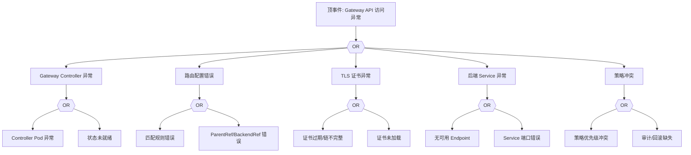

# Gateway API 异常 FTA 树

## 适用范围与说明
- **目标**：覆盖 Gateway API 路由失效、策略冲突与流量异常的关键成因与路径。
- **范围**：Gateway/Route 资源、Controller、证书与 TLS、后端服务、策略与审计。
- **符号**：
  - **OR 门**：任一子事件成立即可触发父事件
  - **AND 门**：所有子事件同时成立才触发父事件

---

## Mermaid FTA 树



---

## 生产级观测与证据
- **事件**：路由命中失败、访问超时、证书错误。
- **关键指标**：Gateway/Route 状态、`4xx/5xx` 比例、控制器健康。
- **关键日志**：Gateway Controller 日志、LB 日志。
- **配置核对**：GatewayClass、HTTPRoute/TCPRoute、TLS Secret、后端 Service。

---

## JSON 工作流（含与/或门控件）

```json
{
  "flow_steps": [
    { "name": "开始", "action": "start", "step": "start_gateway_fta", "next_step": "event_gateway_abnormal" },
    { "name": "顶事件: Gateway API 访问异常", "action": "event", "step": "event_gateway_abnormal", "description": "路由失效/证书异常", "next_step": "gate_root_or" },
    { "name": "根因 OR 门", "action": "gate_or", "step": "gate_root_or", "control": "or_gate", "gate_type": "OR", "next_steps": ["cat_ctrl","cat_route","cat_tls","cat_svc","cat_policy"] }
  ]
}
```

---

## 版本适配（1.19–1.30）
- **1.19–1.23**：Gateway API 仍为新兴能力，需确认 CRD 与控制器版本兼容。
- **1.24–1.27**：HTTPRoute 等资源趋于稳定，需补充与 Ingress 的共存路径。
- **1.28–1.30**：稳定 API 为主，策略冲突与审计链路需补全。
- **共性**：遵循 `fta_methodology_and_agentic_practices.md` 中的“版本适配基线”。
