# Gateway API 异常 FTA 树

## 适用范围与说明
- **目标**：覆盖 Gateway API 路由失效、策略冲突与流量异常的关键成因与路径。
- **范围**：Gateway/Route 资源、Controller、证书与 TLS、后端服务、策略与审计。
- **符号**：
  - **OR 门**：任一子事件成立即可触发父事件
  - **AND 门**：所有子事件同时成立才触发父事件

---

## Mermaid FTA 树

```mermaid
flowchart TD
  TE[顶事件: Gateway API 访问异常]
  OR0{{OR}}
  TE --> OR0

  OR0 --> CTRL[Gateway Controller 异常]
  OR0 --> ROUTE[路由配置错误]
  OR0 --> TLS[TLS 证书异常]
  OR0 --> SVC[后端 Service 异常]
  OR0 --> POLICY[策略冲突]

  %% Gateway Controller 异常分支 - 扩展到3-4层
  CTRL_OR{{OR}}
  CTRL --> CTRL_OR
  CTRL_OR --> CTRL1[Controller Pod 异常]
  CTRL_OR --> CTRL2[Controller 配置问题]
  CTRL_OR --> CTRL3[GatewayClass 问题]

  CTRL1_OR{{OR}}
  CTRL1 --> CTRL1_OR
  CTRL1_OR --> CTRL1A[Pod CrashLoop]
  CTRL1_OR --> CTRL1B[资源不足]
  CTRL1_OR --> CTRL1C[镜像拉取失败]

  CTRL2_OR{{OR}}
  CTRL2 --> CTRL2_OR
  CTRL2_OR --> CTRL2A[RBAC 权限不足]
  CTRL2_OR --> CTRL2B[配置参数错误]

  CTRL3_OR{{OR}}
  CTRL3 --> CTRL3_OR
  CTRL3_OR --> CTRL3A[GatewayClass 不存在]
  CTRL3_OR --> CTRL3B[GatewayClass 未就绪]

  %% 路由配置错误分支 - 扩展到3-4层 + AND 门
  ROUTE_OR{{OR}}
  ROUTE --> ROUTE_OR
  ROUTE_OR --> ROUTE1[匹配规则问题]
  ROUTE_OR --> ROUTE2[引用问题]
  ROUTE_OR --> ROUTE3[状态问题]

  ROUTE1_OR{{OR}}
  ROUTE1 --> ROUTE1_OR
  ROUTE1_OR --> ROUTE1A[hostnames 不匹配]
  ROUTE1_OR --> ROUTE1B[path 规则错误]
  ROUTE1_OR --> ROUTE1C[headers 匹配失败]

  ROUTE2_AND{{AND}}
  ROUTE2 --> ROUTE2_AND
  ROUTE2_AND --> ROUTE2A[parentRef Gateway 不存在]
  ROUTE2_AND --> ROUTE2B[backendRef Service 不存在]

  ROUTE3_OR{{OR}}
  ROUTE3 --> ROUTE3_OR
  ROUTE3_OR --> ROUTE3A[Route 未被 Accepted]
  ROUTE3_OR --> ROUTE3B[Route 条件不满足]

  %% TLS 证书异常分支 - 扩展到3-4层
  TLS_OR{{OR}}
  TLS --> TLS_OR
  TLS_OR --> TLS1[证书配置问题]
  TLS_OR --> TLS2[证书有效性问题]
  TLS_OR --> TLS3[TLS 模式问题]

  TLS1_OR{{OR}}
  TLS1 --> TLS1_OR
  TLS1_OR --> TLS1A[Secret 不存在]
  TLS1_OR --> TLS1B[Secret 格式错误]
  TLS1_OR --> TLS1C[证书与域名不匹配]

  TLS2_OR{{OR}}
  TLS2 --> TLS2_OR
  TLS2_OR --> TLS2A[证书过期]
  TLS2_OR --> TLS2B[证书链不完整]

  TLS3_OR{{OR}}
  TLS3 --> TLS3_OR
  TLS3_OR --> TLS3A[TLS 模式配置错误]
  TLS3_OR --> TLS3B[TLS 版本不兼容]

  %% 后端 Service 异常分支 - 扩展到3-4层 + AND 门
  SVC_OR{{OR}}
  SVC --> SVC_OR
  SVC_OR --> SVC1[Endpoint 问题]
  SVC_OR --> SVC2[端口问题]
  SVC_OR --> SVC3[健康检查问题]

  SVC1_AND{{AND}}
  SVC1 --> SVC1_AND
  SVC1_AND --> SVC1A[无可用 Endpoint]
  SVC1_AND --> SVC1B[后端 Pod 全部不健康]

  SVC2_OR{{OR}}
  SVC2 --> SVC2_OR
  SVC2_OR --> SVC2A[端口号错误]
  SVC2_OR --> SVC2B[协议不匹配]

  SVC3_OR{{OR}}
  SVC3 --> SVC3_OR
  SVC3_OR --> SVC3A[健康检查失败]
  SVC3_OR --> SVC3B[健康检查配置错误]

  %% 策略冲突分支 - 扩展到3-4层
  POLICY_OR{{OR}}
  POLICY --> POLICY_OR
  POLICY_OR --> POL1[路由策略问题]
  POLICY_OR --> POL2[流量策略问题]
  POLICY_OR --> POL3[审计问题]

  POL1_OR{{OR}}
  POL1 --> POL1_OR
  POL1_OR --> POL1A[多 Route 优先级冲突]
  POL1_OR --> POL1B[Gateway 监听器冲突]

  POL2_OR{{OR}}
  POL2 --> POL2_OR
  POL2_OR --> POL2A[超时配置不当]
  POL2_OR --> POL2B[重试策略错误]

  POL3_OR{{OR}}
  POL3 --> POL3_OR
  POL3_OR --> POL3A[无审计日志]
  POL3_OR --> POL3B[回滚路径缺失]
```



---

## 生产级观测与证据
- **事件**：路由命中失败、访问超时、证书错误、`404/502/503` 错误。
- **关键指标**：Gateway/Route 状态、`4xx/5xx` 比例、控制器健康、请求延迟。
- **关键日志**：Gateway Controller 日志、LB 日志、后端服务日志。
- **配置核对**：GatewayClass、Gateway、HTTPRoute/TCPRoute/GRPCRoute、TLS Secret、后端 Service。

---

## JSON 工作流（含与/或门控件）

```json
{
  "flow_steps": [
    { "name": "开始", "action": "start", "step": "start_gateway_fta", "next_step": "event_gateway_abnormal" },
    { "name": "顶事件: Gateway API 访问异常", "action": "event", "step": "event_gateway_abnormal", "description": "路由失效/证书异常", "next_step": "gate_root_or" },
    { "name": "根因 OR 门", "action": "gate_or", "step": "gate_root_or", "control": "or_gate", "gate_type": "OR", "next_steps": ["cat_ctrl","cat_route","cat_tls","cat_svc","cat_policy"] },

    { "name": "Gateway Controller 异常", "action": "category", "step": "cat_ctrl", "next_step": "gate_ctrl_or" },
    { "name": "Controller OR 门", "action": "gate_or", "step": "gate_ctrl_or", "control": "or_gate", "gate_type": "OR", "next_steps": ["cat_ctrl_pod","cat_ctrl_config","cat_gwclass"] },

    { "name": "Controller Pod 异常", "action": "category", "step": "cat_ctrl_pod", "next_step": "gate_ctrl_pod_or" },
    { "name": "Controller Pod OR 门", "action": "gate_or", "step": "gate_ctrl_pod_or", "control": "or_gate", "gate_type": "OR", "next_steps": ["evt_ctrl_crashloop","evt_ctrl_resource","evt_ctrl_image"] },
    { "name": "Pod CrashLoop", "action": "event", "step": "evt_ctrl_crashloop", "severity": "critical", "probability": "medium", "mttr_minutes": 20, "detection": { "events": ["CrashLoopBackOff"], "metrics": ["kube_pod_container_status_waiting_reason{reason=\"CrashLoopBackOff\"} > 0"], "logs": ["controller: crash", "panic:"] }, "remediation": { "manual_steps": ["检查 Controller 日志", "检查配置和权限"], "auto_actions": ["kubectl logs -n gateway-system deploy/gateway-controller"] } },
    { "name": "资源不足", "action": "event", "step": "evt_ctrl_resource", "severity": "high", "probability": "medium", "mttr_minutes": 15, "detection": { "events": ["OOMKilled", "FailedScheduling"], "metrics": ["container_memory_working_set_bytes 接近 limits"], "logs": ["OOM killed"] }, "remediation": { "manual_steps": ["增加资源限制", "优化 Controller 配置"], "auto_actions": ["调整 Pod 资源 requests/limits"] } },
    { "name": "镜像拉取失败", "action": "event", "step": "evt_ctrl_image", "severity": "high", "probability": "medium", "mttr_minutes": 15, "detection": { "events": ["ImagePullBackOff"], "metrics": ["kube_pod_container_status_waiting_reason{reason=\"ImagePullBackOff\"} > 0"], "logs": ["Failed to pull image"] }, "remediation": { "manual_steps": ["检查镜像地址", "配置 imagePullSecrets"], "auto_actions": ["修正镜像配置"] } },

    { "name": "Controller 配置问题", "action": "category", "step": "cat_ctrl_config", "next_step": "gate_ctrl_config_or" },
    { "name": "Controller 配置 OR 门", "action": "gate_or", "step": "gate_ctrl_config_or", "control": "or_gate", "gate_type": "OR", "next_steps": ["evt_rbac_insufficient","evt_config_error"] },
    { "name": "RBAC 权限不足", "action": "event", "step": "evt_rbac_insufficient", "severity": "high", "probability": "medium", "mttr_minutes": 15, "detection": { "events": ["Forbidden"], "metrics": [], "logs": ["controller: forbidden", "RBAC: access denied"] }, "remediation": { "manual_steps": ["检查 ClusterRole/ClusterRoleBinding", "授予必要权限"], "auto_actions": ["kubectl auth can-i --list --as=system:serviceaccount:gateway-system:gateway-controller"] } },
    { "name": "配置参数错误", "action": "event", "step": "evt_config_error", "severity": "high", "probability": "rare", "mttr_minutes": 20, "detection": { "events": [], "metrics": [], "logs": ["controller: invalid configuration"] }, "remediation": { "manual_steps": ["检查 Controller 配置", "参考官方文档"], "auto_actions": ["修正配置参数"] } },

    { "name": "GatewayClass 问题", "action": "category", "step": "cat_gwclass", "next_step": "gate_gwclass_or" },
    { "name": "GatewayClass OR 门", "action": "gate_or", "step": "gate_gwclass_or", "control": "or_gate", "gate_type": "OR", "next_steps": ["evt_gwclass_notexist","evt_gwclass_notready"] },
    { "name": "GatewayClass 不存在", "action": "event", "step": "evt_gwclass_notexist", "severity": "critical", "probability": "rare", "mttr_minutes": 15, "detection": { "events": [], "metrics": ["Gateway status 显示 GatewayClass 不存在"], "logs": ["GatewayClass not found"] }, "remediation": { "manual_steps": ["创建 GatewayClass", "确认 controllerName"], "auto_actions": ["kubectl apply -f gatewayclass.yaml"] } },
    { "name": "GatewayClass 未就绪", "action": "event", "step": "evt_gwclass_notready", "severity": "high", "probability": "rare", "mttr_minutes": 20, "detection": { "events": [], "metrics": ["GatewayClass status.conditions"], "logs": ["GatewayClass not accepted"] }, "remediation": { "manual_steps": ["检查 GatewayClass 状态", "检查 Controller 日志"], "auto_actions": ["kubectl describe gatewayclass"] } },

    { "name": "路由配置错误", "action": "category", "step": "cat_route", "next_step": "gate_route_or" },
    { "name": "路由 OR 门", "action": "gate_or", "step": "gate_route_or", "control": "or_gate", "gate_type": "OR", "next_steps": ["cat_match","cat_ref","cat_status"] },

    { "name": "匹配规则问题", "action": "category", "step": "cat_match", "next_step": "gate_match_or" },
    { "name": "匹配规则 OR 门", "action": "gate_or", "step": "gate_match_or", "control": "or_gate", "gate_type": "OR", "next_steps": ["evt_hostname_mismatch","evt_path_error","evt_header_fail"] },
    { "name": "hostnames 不匹配", "action": "event", "step": "evt_hostname_mismatch", "severity": "high", "probability": "common", "mttr_minutes": 10, "detection": { "events": ["路由未命中"], "metrics": ["404 错误率高"], "logs": ["no matching hostname"] }, "remediation": { "manual_steps": ["检查 HTTPRoute hostnames 配置", "确认请求 Host 头"], "auto_actions": ["修正 hostnames 配置"] } },
    { "name": "path 规则错误", "action": "event", "step": "evt_path_error", "severity": "high", "probability": "common", "mttr_minutes": 10, "detection": { "events": ["路由未命中"], "metrics": ["404 错误率高"], "logs": ["no matching path"] }, "remediation": { "manual_steps": ["检查 path match 配置", "验证 PathPrefix/Exact/RegularExpression"], "auto_actions": ["修正 path 配置"] } },
    { "name": "headers 匹配失败", "action": "event", "step": "evt_header_fail", "severity": "medium", "probability": "medium", "mttr_minutes": 15, "detection": { "events": [], "metrics": [], "logs": ["header match failed"] }, "remediation": { "manual_steps": ["检查 headers 匹配规则", "验证请求头"], "auto_actions": ["修正 headers 配置"] } },

    { "name": "引用问题", "action": "category", "step": "cat_ref", "next_step": "gate_ref_and" },
    { "name": "引用 AND 门", "action": "gate_and", "step": "gate_ref_and", "control": "and_gate", "gate_type": "AND", "description": "parentRef Gateway 和 backendRef Service 同时存在问题导致路由完全失效", "next_steps": ["evt_parent_notexist","evt_backend_notexist"] },
    { "name": "parentRef Gateway 不存在", "action": "event", "step": "evt_parent_notexist", "severity": "critical", "probability": "rare", "mttr_minutes": 15, "detection": { "events": [], "metrics": ["Route status 显示 parentRef 问题"], "logs": ["Gateway not found"] }, "remediation": { "manual_steps": ["创建 Gateway", "修正 parentRef"], "auto_actions": ["kubectl apply -f gateway.yaml"] } },
    { "name": "backendRef Service 不存在", "action": "event", "step": "evt_backend_notexist", "severity": "critical", "probability": "medium", "mttr_minutes": 15, "detection": { "events": [], "metrics": ["Route status 显示 backendRef 问题"], "logs": ["Service not found"] }, "remediation": { "manual_steps": ["创建 Service", "修正 backendRef"], "auto_actions": ["kubectl apply -f service.yaml"] } },

    { "name": "状态问题", "action": "category", "step": "cat_status", "next_step": "gate_status_or" },
    { "name": "状态 OR 门", "action": "gate_or", "step": "gate_status_or", "control": "or_gate", "gate_type": "OR", "next_steps": ["evt_route_not_accepted","evt_route_condition_fail"] },
    { "name": "Route 未被 Accepted", "action": "event", "step": "evt_route_not_accepted", "severity": "high", "probability": "medium", "mttr_minutes": 15, "detection": { "events": [], "metrics": ["Route status.conditions Accepted=False"], "logs": ["Route not accepted"] }, "remediation": { "manual_steps": ["检查 Route status", "查看 Controller 日志"], "auto_actions": ["kubectl describe httproute <name>"] } },
    { "name": "Route 条件不满足", "action": "event", "step": "evt_route_condition_fail", "severity": "high", "probability": "medium", "mttr_minutes": 15, "detection": { "events": [], "metrics": ["Route status.conditions"], "logs": ["Route condition not met"] }, "remediation": { "manual_steps": ["检查 Route conditions", "修复不满足的条件"], "auto_actions": ["kubectl get httproute <name> -o yaml"] } },

    { "name": "TLS 证书异常", "action": "category", "step": "cat_tls", "next_step": "gate_tls_or" },
    { "name": "TLS OR 门", "action": "gate_or", "step": "gate_tls_or", "control": "or_gate", "gate_type": "OR", "next_steps": ["cat_tls_config","cat_tls_validity","cat_tls_mode"] },

    { "name": "证书配置问题", "action": "category", "step": "cat_tls_config", "next_step": "gate_tls_config_or" },
    { "name": "证书配置 OR 门", "action": "gate_or", "step": "gate_tls_config_or", "control": "or_gate", "gate_type": "OR", "next_steps": ["evt_secret_notexist","evt_secret_format_error","evt_cert_domain_mismatch"] },
    { "name": "Secret 不存在", "action": "event", "step": "evt_secret_notexist", "severity": "critical", "probability": "common", "mttr_minutes": 10, "detection": { "events": [], "metrics": ["Gateway status 显示 TLS 问题"], "logs": ["Secret not found"] }, "remediation": { "manual_steps": ["创建 TLS Secret", "检查 secretRef"], "auto_actions": ["kubectl create secret tls ..."] } },
    { "name": "Secret 格式错误", "action": "event", "step": "evt_secret_format_error", "severity": "high", "probability": "rare", "mttr_minutes": 15, "detection": { "events": [], "metrics": [], "logs": ["invalid TLS secret format"] }, "remediation": { "manual_steps": ["检查 Secret 格式", "确认 tls.crt/tls.key"], "auto_actions": ["重新创建 Secret"] } },
    { "name": "证书与域名不匹配", "action": "event", "step": "evt_cert_domain_mismatch", "severity": "high", "probability": "common", "mttr_minutes": 15, "detection": { "events": ["TLS 握手失败"], "metrics": [], "logs": ["certificate domain mismatch"] }, "remediation": { "manual_steps": ["检查证书 CN/SAN", "更新证书"], "auto_actions": ["签发正确域名的证书"] } },

    { "name": "证书有效性问题", "action": "category", "step": "cat_tls_validity", "next_step": "gate_tls_validity_or" },
    { "name": "证书有效性 OR 门", "action": "gate_or", "step": "gate_tls_validity_or", "control": "or_gate", "gate_type": "OR", "next_steps": ["evt_cert_expired","evt_cert_chain_incomplete"] },
    { "name": "证书过期", "action": "event", "step": "evt_cert_expired", "severity": "critical", "probability": "medium", "mttr_minutes": 20, "detection": { "events": ["TLS 握手失败"], "metrics": ["证书到期时间"], "logs": ["certificate has expired"] }, "remediation": { "manual_steps": ["更新证书", "配置自动续期"], "auto_actions": ["cert-manager 自动续期"] } },
    { "name": "证书链不完整", "action": "event", "step": "evt_cert_chain_incomplete", "severity": "high", "probability": "rare", "mttr_minutes": 20, "detection": { "events": ["TLS 握手失败"], "metrics": [], "logs": ["certificate chain incomplete"] }, "remediation": { "manual_steps": ["补全证书链", "更新 Secret"], "auto_actions": ["包含中间证书"] } },

    { "name": "TLS 模式问题", "action": "category", "step": "cat_tls_mode", "next_step": "gate_tls_mode_or" },
    { "name": "TLS 模式 OR 门", "action": "gate_or", "step": "gate_tls_mode_or", "control": "or_gate", "gate_type": "OR", "next_steps": ["evt_tls_mode_error","evt_tls_version_incompatible"] },
    { "name": "TLS 模式配置错误", "action": "event", "step": "evt_tls_mode_error", "severity": "high", "probability": "rare", "mttr_minutes": 15, "detection": { "events": [], "metrics": [], "logs": ["TLS mode error"] }, "remediation": { "manual_steps": ["检查 TLS mode 配置", "选择 Terminate/Passthrough"], "auto_actions": ["修正 TLS 配置"] } },
    { "name": "TLS 版本不兼容", "action": "event", "step": "evt_tls_version_incompatible", "severity": "medium", "probability": "rare", "mttr_minutes": 20, "detection": { "events": ["TLS 握手失败"], "metrics": [], "logs": ["TLS version mismatch"] }, "remediation": { "manual_steps": ["检查 TLS 版本配置", "调整最低版本要求"], "auto_actions": ["配置 minVersion/maxVersion"] } },

    { "name": "后端 Service 异常", "action": "category", "step": "cat_svc", "next_step": "gate_svc_or" },
    { "name": "Service OR 门", "action": "gate_or", "step": "gate_svc_or", "control": "or_gate", "gate_type": "OR", "next_steps": ["cat_endpoint","cat_port","cat_health"] },

    { "name": "Endpoint 问题", "action": "category", "step": "cat_endpoint", "next_step": "gate_endpoint_and" },
    { "name": "Endpoint AND 门", "action": "gate_and", "step": "gate_endpoint_and", "control": "and_gate", "gate_type": "AND", "description": "无可用 Endpoint 且 后端 Pod 全部不健康导致 503 错误", "next_steps": ["evt_no_endpoint","evt_all_unhealthy"] },
    { "name": "无可用 Endpoint", "action": "event", "step": "evt_no_endpoint", "severity": "critical", "probability": "common", "mttr_minutes": 15, "detection": { "events": ["503 错误"], "metrics": ["kube_endpoint_address_available == 0"], "logs": ["no endpoints available"] }, "remediation": { "manual_steps": ["检查 Service selector", "确认 Pod 存在且 Ready"], "auto_actions": ["kubectl get endpoints <service>"] } },
    { "name": "后端 Pod 全部不健康", "action": "event", "step": "evt_all_unhealthy", "severity": "critical", "probability": "medium", "mttr_minutes": 20, "detection": { "events": ["503 错误"], "metrics": ["健康的 Pod 数为 0"], "logs": ["all backends unhealthy"] }, "remediation": { "manual_steps": ["检查 Pod 健康状态", "修复 Pod 问题"], "auto_actions": ["kubectl describe pod"] } },

    { "name": "端口问题", "action": "category", "step": "cat_port", "next_step": "gate_port_or" },
    { "name": "端口 OR 门", "action": "gate_or", "step": "gate_port_or", "control": "or_gate", "gate_type": "OR", "next_steps": ["evt_port_error","evt_protocol_mismatch"] },
    { "name": "端口号错误", "action": "event", "step": "evt_port_error", "severity": "high", "probability": "common", "mttr_minutes": 10, "detection": { "events": ["连接被拒"], "metrics": [], "logs": ["port not found"] }, "remediation": { "manual_steps": ["检查 backendRef port", "确认 Service 端口"], "auto_actions": ["修正端口配置"] } },
    { "name": "协议不匹配", "action": "event", "step": "evt_protocol_mismatch", "severity": "high", "probability": "rare", "mttr_minutes": 15, "detection": { "events": [], "metrics": [], "logs": ["protocol mismatch"] }, "remediation": { "manual_steps": ["检查后端协议", "配置正确的 backendProtocol"], "auto_actions": ["修正协议配置"] } },

    { "name": "健康检查问题", "action": "category", "step": "cat_health", "next_step": "gate_health_or" },
    { "name": "健康检查 OR 门", "action": "gate_or", "step": "gate_health_or", "control": "or_gate", "gate_type": "OR", "next_steps": ["evt_health_fail","evt_health_config_error"] },
    { "name": "健康检查失败", "action": "event", "step": "evt_health_fail", "severity": "high", "probability": "common", "mttr_minutes": 15, "detection": { "events": ["后端不健康"], "metrics": ["健康检查失败率"], "logs": ["health check failed"] }, "remediation": { "manual_steps": ["检查后端健康状态", "修复应用问题"], "auto_actions": ["检查 readinessProbe"] } },
    { "name": "健康检查配置错误", "action": "event", "step": "evt_health_config_error", "severity": "medium", "probability": "medium", "mttr_minutes": 15, "detection": { "events": [], "metrics": [], "logs": ["health check config error"] }, "remediation": { "manual_steps": ["检查健康检查配置", "调整检查参数"], "auto_actions": ["修正健康检查配置"] } },

    { "name": "策略冲突", "action": "category", "step": "cat_policy", "next_step": "gate_policy_or" },
    { "name": "策略 OR 门", "action": "gate_or", "step": "gate_policy_or", "control": "or_gate", "gate_type": "OR", "next_steps": ["cat_route_policy","cat_traffic_policy","cat_audit"] },

    { "name": "路由策略问题", "action": "category", "step": "cat_route_policy", "next_step": "gate_route_policy_or" },
    { "name": "路由策略 OR 门", "action": "gate_or", "step": "gate_route_policy_or", "control": "or_gate", "gate_type": "OR", "next_steps": ["evt_route_priority_conflict","evt_listener_conflict"] },
    { "name": "多 Route 优先级冲突", "action": "event", "step": "evt_route_priority_conflict", "severity": "medium", "probability": "medium", "mttr_minutes": 20, "detection": { "events": ["路由行为异常"], "metrics": [], "logs": ["route priority conflict"] }, "remediation": { "manual_steps": ["分析 Route 优先级", "调整匹配规则"], "auto_actions": ["修正 Route 配置"] } },
    { "name": "Gateway 监听器冲突", "action": "event", "step": "evt_listener_conflict", "severity": "high", "probability": "rare", "mttr_minutes": 20, "detection": { "events": [], "metrics": ["Gateway status 显示 listener 冲突"], "logs": ["listener conflict"] }, "remediation": { "manual_steps": ["检查 Gateway listeners", "解决端口/协议冲突"], "auto_actions": ["修正 listener 配置"] } },

    { "name": "流量策略问题", "action": "category", "step": "cat_traffic_policy", "next_step": "gate_traffic_policy_or" },
    { "name": "流量策略 OR 门", "action": "gate_or", "step": "gate_traffic_policy_or", "control": "or_gate", "gate_type": "OR", "next_steps": ["evt_timeout_config","evt_retry_error"] },
    { "name": "超时配置不当", "action": "event", "step": "evt_timeout_config", "severity": "medium", "probability": "common", "mttr_minutes": 15, "detection": { "events": ["请求超时"], "metrics": ["超时率高"], "logs": ["request timeout"] }, "remediation": { "manual_steps": ["检查超时配置", "调整超时时间"], "auto_actions": ["修正 timeout 配置"] } },
    { "name": "重试策略错误", "action": "event", "step": "evt_retry_error", "severity": "medium", "probability": "rare", "mttr_minutes": 15, "detection": { "events": [], "metrics": ["重试次数异常"], "logs": ["retry policy error"] }, "remediation": { "manual_steps": ["检查重试策略", "调整重试参数"], "auto_actions": ["修正 retry 配置"] } },

    { "name": "审计问题", "action": "category", "step": "cat_audit", "next_step": "gate_audit_or" },
    { "name": "审计 OR 门", "action": "gate_or", "step": "gate_audit_or", "control": "or_gate", "gate_type": "OR", "next_steps": ["evt_no_audit","evt_no_rollback"] },
    { "name": "无审计日志", "action": "event", "step": "evt_no_audit", "severity": "medium", "probability": "medium", "mttr_minutes": 30, "detection": { "events": [], "metrics": [], "logs": [] }, "remediation": { "manual_steps": ["启用审计日志", "配置访问日志"], "auto_actions": ["配置 Controller 审计"] } },
    { "name": "回滚路径缺失", "action": "event", "step": "evt_no_rollback", "severity": "medium", "probability": "common", "mttr_minutes": 30, "detection": { "events": [], "metrics": [], "logs": [] }, "remediation": { "manual_steps": ["建立配置备份", "使用 GitOps"], "auto_actions": ["配置版本管理"] } },

    { "name": "结束", "action": "end", "step": "end_gateway_fta" }
  ]
}
```

---

## 版本适配（1.19–1.30）
- **1.19–1.23**：Gateway API 仍为新兴能力，需确认 CRD 与控制器版本兼容；部分功能为 Alpha。
- **1.24–1.27**：HTTPRoute 等资源趋于稳定，需补充与 Ingress 的共存路径；GRPCRoute 支持增强。
- **1.28–1.30**：稳定 API 为主，策略冲突与审计链路需补全；关注 BackendLBPolicy 等新特性。
- **共性**：遵循 `fta_methodology_and_agentic_practices.md` 中的"版本适配基线"。
