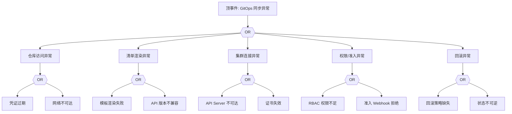

# GitOps（ArgoCD）异常 FTA 树

## 适用范围与说明
- **目标**：覆盖同步失败、应用状态漂移与回滚失败的关键成因与路径。
- **范围**：Git 仓库访问、清单渲染、集群连接、权限与审计、回滚流程。
- **符号**：
  - **OR 门**：任一子事件成立即可触发父事件
  - **AND 门**：所有子事件同时成立才触发父事件

---

## Mermaid FTA 树



---

## 生产级观测与证据
- **事件**：Sync 失败、应用状态漂移、回滚失败。
- **关键指标**：同步失败率、漂移次数、回滚成功率。
- **关键日志**：ArgoCD Controller 日志、`apiserver` 审计日志。
- **配置核对**：仓库凭证、应用清单、集群访问配置、RBAC。

---

## JSON 工作流（含与/或门控件）

```json
{
  "flow_steps": [
    { "name": "开始", "action": "start", "step": "start_gitops_fta", "next_step": "event_gitops_abnormal" },
    { "name": "顶事件: GitOps 同步异常", "action": "event", "step": "event_gitops_abnormal", "description": "同步失败/漂移/回滚失败", "next_step": "gate_root_or" },
    { "name": "根因 OR 门", "action": "gate_or", "step": "gate_root_or", "control": "or_gate", "gate_type": "OR", "next_steps": ["cat_repo","cat_mani","cat_cluster","cat_rbac","cat_rb"] }
  ]
}
```

---

## 版本适配（1.19–1.30）
- **1.19–1.23**：清单中旧版 API 需迁移；GitOps 工具需兼容旧 API。
- **1.24–1.27**：PSP 移除后 RBAC/准入策略需调整。
- **1.28–1.30**：稳定 API 为主，审计与回滚链路需一致。
- **共性**：遵循 `fta_methodology_and_agentic_practices.md` 中的“版本适配基线”。
