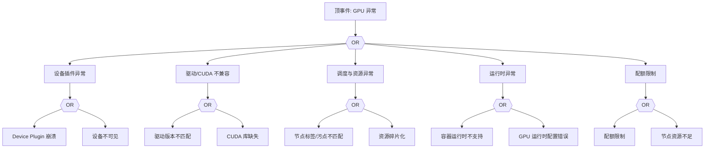

# GPU 异常 FTA 树

## 适用范围与说明
- **目标**：覆盖 GPU 设备不可用、调度失败与驱动不兼容的关键成因与路径。
- **范围**：设备插件、驱动/CUDA、资源调度、容器运行时、节点与配额。
- **符号**：
  - **OR 门**：任一子事件成立即可触发父事件
  - **AND 门**：所有子事件同时成立才触发父事件

---

## Mermaid FTA 树



---

## 生产级观测与证据
- **事件**：GPU 不可用、调度失败、设备插件错误。
- **关键指标**：GPU 资源利用率、Device Plugin 健康、调度失败率。
- **关键日志**：设备插件日志、`kubelet`、驱动日志。
- **配置核对**：驱动/CUDA 版本、资源请求、节点标签与污点。

---

## JSON 工作流（含与/或门控件）

```json
{
  "flow_steps": [
    { "name": "开始", "action": "start", "step": "start_gpu_fta", "next_step": "event_gpu_abnormal" },
    { "name": "顶事件: GPU 异常", "action": "event", "step": "event_gpu_abnormal", "description": "GPU 不可用/调度失败", "next_step": "gate_root_or" },
    { "name": "根因 OR 门", "action": "gate_or", "step": "gate_root_or", "control": "or_gate", "gate_type": "OR", "next_steps": ["cat_dev","cat_drv","cat_sched","cat_rt","cat_quota"] }
  ]
}
```

---

## 版本适配（1.19–1.30）
- **1.19–1.23**：设备插件与运行时依赖差异较大，需明确兼容矩阵。
- **1.24–1.27**：运行时切换后 GPU 运行时配置需同步更新。
- **1.28–1.30**：稳定 API 为主，GPU 调度策略与审计链路需一致。
- **共性**：遵循 `fta_methodology_and_agentic_practices.md` 中的“版本适配基线”。
