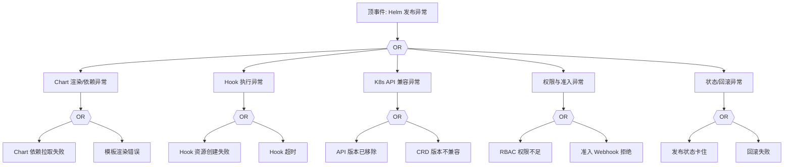

# Helm 发布异常 FTA 树

## 适用范围与说明
- **目标**：覆盖 Helm 发布失败、回滚失败与资源不一致的关键成因与路径。
- **范围**：Chart 仓库与渲染、Hook、K8s API 兼容、权限与审计。
- **符号**：
  - **OR 门**：任一子事件成立即可触发父事件
  - **AND 门**：所有子事件同时成立才触发父事件

---

## Mermaid FTA 树



---

## 生产级观测与证据
- **事件**：`helm install/upgrade` 失败、Release 状态 `FAILED`。
- **关键指标**：发布失败率、回滚失败率。
- **关键日志**：Helm CLI/Controller 日志、`apiserver` 审计日志。
- **配置核对**：Chart 版本、依赖项、Hook 配置、API 版本。

---

## JSON 工作流（含与/或门控件）

```json
{
  "flow_steps": [
    { "name": "开始", "action": "start", "step": "start_helm_fta", "next_step": "event_helm_abnormal" },
    { "name": "顶事件: Helm 发布异常", "action": "event", "step": "event_helm_abnormal", "description": "发布失败/回滚失败", "next_step": "gate_root_or" },
    { "name": "根因 OR 门", "action": "gate_or", "step": "gate_root_or", "control": "or_gate", "gate_type": "OR", "next_steps": ["cat_chart","cat_hook","cat_api","cat_rbac","cat_state"] }
  ]
}
```

---

## 版本适配（1.19–1.30）
- **1.19–1.23**：Chart 中旧版 API（如 Ingress/CronJob）需迁移；Hook 资源可能引用已弃用版本。
- **1.24–1.27**：PSP 移除后，Chart 中安全策略需改为 PSA/OPA；运行时变更影响 Hook 诊断。
- **1.28–1.30**：稳定 API 为主，CRD 版本与 Helm 依赖需严格对齐。
- **共性**：遵循 `fta_methodology_and_agentic_practices.md` 中的“版本适配基线”。
