# Higress 网关异常 FTA 树

## 适用范围与说明
- **目标**：覆盖 Higress API 网关在生产环境中的流量管理异常。
- **范围**：路由配置、xDS 推送、服务发现、Wasm 插件、证书、TLS、AI 网关能力。
- **符号**：
  - **OR 门**：任一子事件成立即可触发父事件
  - **AND 门**：所有子事件同时成立才触发父事件

---

## Mermaid FTA 树

```mermaid
flowchart TD
  TE[顶事件: Higress 网关异常]
  OR0{{OR}}
  TE --> OR0

  OR0 --> ROUTE[路由配置异常]
  OR0 --> XDS[xDS 配置推送异常]
  OR0 --> DISCO[服务发现异常]
  OR0 --> TLS[TLS/证书异常]
  OR0 --> PLUGIN[Wasm 插件异常]
  OR0 --> AI[AI 网关异常]
  OR0 --> CONFIG[配置/权限异常]

  %% 路由分支
  ROUTE_OR{{OR}}
  ROUTE --> ROUTE_OR
  ROUTE_OR --> ROUTE1[Ingress 规则解析失败]
  ROUTE_OR --> ROUTE2[路径匹配错误/优先级问题]
  ROUTE_OR --> ROUTE3[Upstream 选择失败]
  ROUTE_OR --> ROUTE4[灰度/Canary 规则异常]

  %% xDS 分支
  XDS_OR{{OR}}
  XDS --> XDS_OR
  XDS_OR --> XDS1[Istiod 连接失败]
  XDS_OR --> XDS2[Listener/Route 资源更新延迟]
  XDS_OR --> XDS3[Endpoint 信息过期]

  %% 服务发现分支
  DISCO_OR{{OR}}
  DISCO --> DISCO_OR
  DISCO_OR --> DISCO1[Nacos 连接失败]
  DISCO_OR --> DISCO2[服务实例列表为空]
  DISCO_OR --> DISCO3[K8s Endpoint 同步失败]

  %% TLS 分支
  TLS_OR{{OR}}
  TLS --> TLS_OR
  TLS_OR --> TLS1[证书过期/无效]
  TLS_OR --> TLS2[SNI 配置错误]
  TLS_OR --> TLS3[mTLS 双向认证失败]

  %% Wasm 分支
  PLUGIN_OR{{OR}}
  PLUGIN --> PLUGIN_OR
  PLUGIN_OR --> PLUGIN1[插件加载失败]
  PLUGIN_OR --> PLUGIN2[OCI 镜像无法下载]
  PLUGIN_OR --> PLUGIN3[插件执行超时]

  %% AI 网关分支
  AI_OR{{OR}}
  AI --> AI_OR
  AI_OR --> AI1[LLM Provider 连接失败]
  AI_OR --> AI2[Token 限流触发]
  AI_OR --> AI3[语义缓存未命中]

  %% 配置分支
  CONFIG_OR{{OR}}
  CONFIG --> CONFIG_OR
  CONFIG_OR --> CONFIG1[CRD 版本不兼容]
  CONFIG_OR --> CONFIG2[ServiceAccount 权限不足]
  CONFIG_OR --> CONFIG3[ConfigMap 格式错误]

  style TE fill:#ff6b6b,stroke:#c92a2a,color:#fff
  style ROUTE fill:#fbbf24,stroke:#d97706,color:#000
  style XDS fill:#fbbf24,stroke:#d97706,color:#000
  style DISCO fill:#fbbf24,stroke:#d97706,color:#000
  style TLS fill:#fbbf24,stroke:#d97706,color:#000
```



---

## 常见故障场景

### 场景 1: Ingress 路由不生效

**顶事件**: 配置了 Ingress 但流量未到达后端服务

```
诊断路径:
1. 检查 Higress Controller 状态
   kubectl get pods -n higress-system

2. 检查 Ingress 资源
   kubectl describe ingress <name> -n <namespace>

3. 检查 Envoy 配置
   kubectl exec -it Higress-gateway-xxx -c envoy -- curl localhost:15000/config_dump

4. 检查 Endpoints
   kubectl get endpoints <service> -n <namespace>

5. 检查日志
   kubectl logs -n higress-system -l app=higress-gateway --tail=100
```

### 场景 2: xDS 配置未推送

**顶事件**: Envoy 未收到路由配置，请求返回 404

```
诊断路径:
1. 检查 Istiod (Control Plane) 状态
   kubectl get pods -n istio-system

2. 检查 MCP Bridge 配置
   kubectl get mcphbridge -A

3. 检查 Listener 资源
   curl localhost:15000/config_dump?resource=dynamic_listeners

4. 检查 CDS/EDS 更新
   curl localhost:15000/config_dump?resource=dynamic_clusters
```

### 场景 3: 服务发现失败

**顶事件**: Nacos 注册的服务无法被路由

```
诊断路径:
1. 检查 McpBridge CR 状态
   kubectl get mcphbridge -A -o yaml

2. 检查 Nacos 连接
   kubectl exec -it <higress-pod> -- curl nacos:8848/v1/ns/instance/list?serviceName=xxx

3. 检查 K8s Endpoint
   kubectl get endpoints -n <namespace> -o yaml

4. 检查服务标签匹配
   - Ingress 的 host/path 是否与服务标签匹配
```

### 场景 4: Wasm 插件加载失败

**顶事件**: 配置了 Wasm 插件但请求报错 500

```
诊断路径:
1. 检查插件 OCI 镜像可访问性
   crictl images | grep <plugin-image>

2. 检查插件配置
   kubectl get wasmplugin -A

3. 检查 Envoy 日志
   kubectl logs -n higress-system <pod> -c envoy | grep wasm

4. 检查插件超时配置
   - Wasm 插件执行超时默认 5s
```

---

## 故障排查命令速查

```bash
# 1. 检查 Higress 系统组件状态
kubectl get pods -n higress-system

# 2. 检查 Higress 网关日志
kubectl logs -n higress-system -l app=higress-gateway --tail=200 -f

# 3. 检查 Ingress 配置
kubectl get ingress -A
kubectl describe ingress <name> -n <namespace>

# 4. 查看 Envoy 配置
kubectl exec -it <higress-gateway-pod> -c envoy -- curl localhost:15000/config_dump

# 5. 检查 xDS 同步状态
kubectl exec -it <higress-gateway-pod> -c envoy -- curl localhost:15000/clusters

# 6. 检查 McpBridge 配置
kubectl get mcphbridge -A
kubectl describe mcphbridge <name> -n <namespace>

# 7. 检查 WasmPlugin 配置
kubectl get wasmplugin -A

# 8. 测试路由
kubectl exec -it <test-pod> -- curl -H "Host: app.example.com" http://<higress-gateway>:80/

# 9. 检查 Nacos 连接
kubectl exec -it <higress-gateway-pod> -- curl nacos:8848/v1/ns/instance/list?serviceName=<svc>

# 10. 检查 TLS 证书
kubectl get secret -n higress-system | grep -E "tls|cert"
openssl s_client -connect <gateway>:443 -servername <sni>
```

---

## 与 nginx-ingress 迁移相关

> 从 nginx-ingress 迁移到 Higress 时，常见问题：

| 问题 | 原因 | 解决方案 |
|:---|:---|:---|
| 注解不兼容 | Higress 不支持部分 nginx 注解 | 使用 Ingress 标准注解或 Higress CRD |
| upstream 配置差异 | 默认 upstream 超时不同 | 调整 `higress.io/backend-timeout` |
| 灰度发布方式 | 算法不同 | 使用 Higress 的 `higress.io/canary` 注解 |

---

## 相关文档

- [Higress 企业级网关实践](./domain-40-cloud-native-api-gateway/04-higress-enterprise-gateway.md)
- [nginx-ingress 迁移指南](./domain-40-cloud-native-api-gateway/09-nginx-ingress-migration-guide.md)
- [Ingress 故障排查](./topic-structural-trouble-shooting/03-networking/03-service-ingress-troubleshooting.md)
- [Higress 全局索引](./topic-index/higress-index.md)