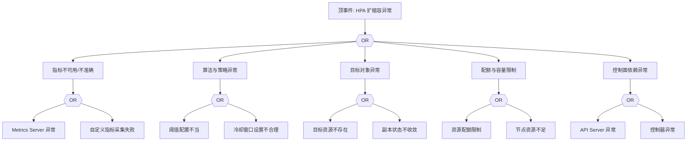

# HPA 异常 FTA 树

## 适用范围与说明
- **目标**：覆盖 HPA 扩缩容失效、指标不可用与震荡的关键成因与路径。
- **范围**：指标采集、算法策略、目标对象状态、资源与配额、控制面依赖。
- **符号**：
  - **OR 门**：任一子事件成立即可触发父事件
  - **AND 门**：所有子事件同时成立才触发父事件

---

## Mermaid FTA 树



---

## 生产级观测与证据
- **事件**：`FailedGetResourceMetric`、`FailedComputeMetricsReplicas`。
- **关键指标**：`kube_hpa_status_current_replicas`、`kube_hpa_status_desired_replicas`、`metrics-server` 可用性指标。
- **关键日志**：`kube-controller-manager`、`metrics-server`、自定义指标适配器日志。
- **配置核对**：目标资源、`min/maxReplicas`、指标阈值、稳定窗口。

---

## JSON 工作流（含与/或门控件）

```json
{
  "flow_steps": [
    { "name": "开始", "action": "start", "step": "start_hpa_fta", "next_step": "event_hpa_abnormal" },
    { "name": "顶事件: HPA 扩缩容异常", "action": "event", "step": "event_hpa_abnormal", "description": "扩缩容停滞或震荡", "next_step": "gate_root_or" },
    { "name": "根因 OR 门", "action": "gate_or", "step": "gate_root_or", "control": "or_gate", "gate_type": "OR", "next_steps": ["cat_metrics","cat_alg","cat_obj","cat_quota","cat_cp"] }
  ]
}
```

---

## 版本适配（1.19–1.30）
- **1.19–1.23**：HPA v2 API 与指标适配需核对；旧版 metrics-server 兼容性需关注。
- **1.24–1.27**：自定义指标适配器与 API 版本对齐，避免指标读取失败。
- **1.28–1.30**：稳定 API 为主，需确保指标链路与审计一致性。
- **共性**：遵循 `fta_methodology_and_agentic_practices.md` 中的“版本适配基线”。
