# Ingress 异常 FTA 树

## 适用范围与说明
- **目标**：覆盖 Ingress 请求失败、证书异常与路由错误的关键成因与路径。
- **范围**：Ingress Controller、规则配置、TLS 证书、后端服务、网络与 DNS。
- **符号**：
  - **OR 门**：任一子事件成立即可触发父事件
  - **AND 门**：所有子事件同时成立才触发父事件

---

## Mermaid FTA 树

```mermaid
flowchart TD
  TE[顶事件: Ingress 访问异常]
  OR0{{OR}}
  TE --> OR0

  OR0 --> CTRL[Ingress Controller 异常]
  OR0 --> RULE[规则/路由配置错误]
  OR0 --> TLS[TLS 证书异常]
  OR0 --> SVC[后端 Service 异常]
  OR0 --> NET[网络与 DNS 异常]

  CTRL_OR{{OR}}
  CTRL --> CTRL_OR
  CTRL_OR --> CTRL1[Controller Pod 异常]
  CTRL_OR --> CTRL2[负载均衡健康检查失败]
  CTRL_OR --> CTRL3[配置重载失败]
  CTRL_OR --> CTRL4[资源压力过大]

  CTRL1_OR{{OR}}
  CTRL1 --> CTRL1_OR
  CTRL1_OR --> CTRL1A[OOMKilled]
  CTRL1_OR --> CTRL1B[CrashLoopBackOff]
  CTRL1_OR --> CTRL1C[镜像拉取失败]

  CTRL2_OR{{OR}}
  CTRL2 --> CTRL2_OR
  CTRL2_OR --> CTRL2A[健康检查路径错误]
  CTRL2_OR --> CTRL2B[健康检查超时]
  CTRL2_OR --> CTRL2C[Controller 启动慢]

  RULE_OR{{OR}}
  RULE --> RULE_OR
  RULE_OR --> RULE1[Host/Path 规则错误]
  RULE_OR --> RULE2[Backend 端口配置错误]
  RULE_OR --> RULE3[Annotation 配置错误]
  RULE_OR --> RULE4[IngressClass 不匹配]

  RULE1_OR{{OR}}
  RULE1 --> RULE1_OR
  RULE1_OR --> RULE1A[Host 不匹配]
  RULE1_OR --> RULE1B[Path 正则错误]
  RULE1_OR --> RULE1C[路径优先级冲突]

  TLS_OR{{OR}}
  TLS --> TLS_OR
  TLS_OR --> TLS1[证书过期/链不完整]
  TLS_OR --> TLS2[证书未加载]
  TLS_OR --> TLS3[TLS 握手失败连锁]
  TLS_OR --> TLS4[SNI 配置错误]

  TLS1_OR{{OR}}
  TLS1 --> TLS1_OR
  TLS1_OR --> TLS1A[证书过期]
  TLS1_OR --> TLS1B[证书链不完整]
  TLS1_OR --> TLS1C[证书与域名不匹配]

  AND_TLS_FAIL{{AND}}
  TLS3 --> AND_TLS_FAIL
  AND_TLS_FAIL --> TLS3A[证书异常/过期]
  AND_TLS_FAIL --> TLS3B[客户端强制校验证书]

  SVC_OR{{OR}}
  SVC --> SVC_OR
  SVC_OR --> SVC1[无可用 Endpoint]
  SVC_OR --> SVC2[Service 端口错误]
  SVC_OR --> SVC3[503 错误连锁]
  SVC_OR --> SVC4[后端响应超时]

  SVC1_OR{{OR}}
  SVC1 --> SVC1_OR
  SVC1_OR --> SVC1A[Pod 不健康]
  SVC1_OR --> SVC1B[Selector 不匹配]
  SVC1_OR --> SVC1C[副本数为 0]

  AND_503{{AND}}
  SVC3 --> AND_503
  AND_503 --> SVC3A[后端无可用 Endpoint]
  AND_503 --> SVC3B[LB 健康检查失败]

  NET_OR{{OR}}
  NET --> NET_OR
  NET_OR --> NET1[DNS 解析异常]
  NET_OR --> NET2[网络策略阻断]
  NET_OR --> NET3[跨节点网络不通]
  NET_OR --> NET4[防火墙/安全组拦截]

  NET1_OR{{OR}}
  NET1 --> NET1_OR
  NET1_OR --> NET1A[DNS 记录不存在]
  NET1_OR --> NET1B[DNS 指向错误 IP]
  NET1_OR --> NET1C[DNS TTL 过长导致更新延迟]
```



---

## 生产级观测与证据
- **事件**：`503/502/504`、证书错误、访问超时、`Connection refused`。
- **关键指标**：Ingress Controller 响应延迟、`4xx/5xx` 比例、LB 健康状态、upstream_response_time、request_time。
- **关键日志**：Ingress Controller 日志（nginx-ingress/traefik/等）、LB 日志、cert-manager 日志。
- **配置核对**：Ingress 规则、TLS Secret、Service 端口、DNS 记录、IngressClass、Annotations。

---

## JSON 工作流（含与/或门控件）

```json
{
  "flow_steps": [
    { "name": "开始", "action": "start", "step": "start_ingress_fta", "next_step": "event_ingress_abnormal" },
    { "name": "顶事件: Ingress 访问异常", "action": "event", "step": "event_ingress_abnormal", "description": "访问失败/证书错误/502/503/504", "next_step": "gate_root_or" },
    { "name": "根因 OR 门", "action": "gate_or", "step": "gate_root_or", "control": "or_gate", "gate_type": "OR", "next_steps": ["cat_ctrl", "cat_rule", "cat_tls", "cat_svc", "cat_net"] },

    { "name": "Ingress Controller 异常", "action": "event", "step": "cat_ctrl", "description": "Controller 组件问题", "next_step": "gate_ctrl_or" },
    { "name": "Controller OR 门", "action": "gate_or", "step": "gate_ctrl_or", "control": "or_gate", "gate_type": "OR", "next_steps": ["evt_ctrl_pod", "evt_ctrl_lb", "evt_ctrl_reload", "evt_ctrl_pressure"] },

    { "name": "Controller Pod 异常", "action": "event", "step": "evt_ctrl_pod", "description": "Controller Pod 不健康", "next_step": "gate_ctrl_pod_or" },
    { "name": "Controller Pod OR 门", "action": "gate_or", "step": "gate_ctrl_pod_or", "control": "or_gate", "gate_type": "OR", "next_steps": ["evt_ctrl_oom", "evt_ctrl_crashloop", "evt_ctrl_image"] },
    {
      "name": "OOMKilled",
      "action": "event",
      "step": "evt_ctrl_oom",
      "severity": "critical",
      "probability": "medium",
      "mttr_minutes": 15,
      "detection": {
        "events": ["OOMKilled"],
        "metrics": ["kube_pod_container_status_last_terminated_reason{reason='OOMKilled',pod=~'ingress.*'}"],
        "logs": ["kernel: Out of memory"]
      },
      "remediation": {
        "manual_steps": ["检查 Controller 内存限制", "分析连接数和请求量"],
        "auto_actions": ["提升内存限制", "扩展 Controller 副本"]
      }
    },
    {
      "name": "CrashLoopBackOff",
      "action": "event",
      "step": "evt_ctrl_crashloop",
      "severity": "critical",
      "probability": "medium",
      "mttr_minutes": 15,
      "detection": {
        "events": ["BackOff", "CrashLoopBackOff"],
        "metrics": ["kube_pod_container_status_waiting_reason{reason='CrashLoopBackOff'}"],
        "logs": ["Back-off restarting failed container"]
      },
      "remediation": {
        "manual_steps": ["检查 Controller 日志", "验证配置正确性"],
        "auto_actions": ["回滚到上一个版本"]
      }
    },
    {
      "name": "镜像拉取失败",
      "action": "event",
      "step": "evt_ctrl_image",
      "severity": "high",
      "probability": "medium",
      "mttr_minutes": 15,
      "detection": {
        "events": ["ErrImagePull", "ImagePullBackOff"],
        "metrics": ["kube_pod_container_status_waiting_reason{reason='ImagePullBackOff'}"],
        "logs": ["Failed to pull image"]
      },
      "remediation": {
        "manual_steps": ["检查镜像名称和标签", "验证镜像仓库凭据"],
        "auto_actions": ["更新 imagePullSecrets"]
      }
    },

    { "name": "负载均衡健康检查失败", "action": "event", "step": "evt_ctrl_lb", "description": "LB 健康检查异常", "next_step": "gate_ctrl_lb_or" },
    { "name": "LB 健康检查 OR 门", "action": "gate_or", "step": "gate_ctrl_lb_or", "control": "or_gate", "gate_type": "OR", "next_steps": ["evt_lb_path_bad", "evt_lb_timeout", "evt_lb_slow_start"] },
    {
      "name": "健康检查路径错误",
      "action": "event",
      "step": "evt_lb_path_bad",
      "severity": "high",
      "probability": "common",
      "mttr_minutes": 10,
      "detection": {
        "events": [],
        "metrics": [],
        "logs": ["health check failed", "404"]
      },
      "remediation": {
        "manual_steps": ["检查 LB 健康检查路径", "验证 Controller 健康检查端点"],
        "auto_actions": ["修正健康检查配置"]
      }
    },
    {
      "name": "健康检查超时",
      "action": "event",
      "step": "evt_lb_timeout",
      "severity": "high",
      "probability": "common",
      "mttr_minutes": 10,
      "detection": {
        "events": [],
        "metrics": [],
        "logs": ["health check timeout"]
      },
      "remediation": {
        "manual_steps": ["增加健康检查超时时间", "检查 Controller 响应延迟"],
        "auto_actions": ["调整超时配置"]
      }
    },
    {
      "name": "Controller 启动慢",
      "action": "event",
      "step": "evt_lb_slow_start",
      "severity": "medium",
      "probability": "common",
      "mttr_minutes": 15,
      "detection": {
        "events": [],
        "metrics": [],
        "logs": []
      },
      "remediation": {
        "manual_steps": ["增加健康检查初始延迟", "优化 Controller 启动时间"],
        "auto_actions": ["配置 slow start"]
      }
    },

    {
      "name": "配置重载失败",
      "action": "event",
      "step": "evt_ctrl_reload",
      "severity": "high",
      "probability": "medium",
      "mttr_minutes": 15,
      "detection": {
        "events": [],
        "metrics": ["nginx_ingress_controller_config_last_reload_successful==0"],
        "logs": ["nginx: configuration file test failed", "error reloading"]
      },
      "remediation": {
        "manual_steps": ["检查 Ingress 配置语法", "验证 Annotation 正确性"],
        "auto_actions": ["回滚问题 Ingress 配置"]
      }
    },
    {
      "name": "资源压力过大",
      "action": "event",
      "step": "evt_ctrl_pressure",
      "severity": "high",
      "probability": "common",
      "mttr_minutes": 15,
      "detection": {
        "events": [],
        "metrics": ["container_cpu_usage_seconds_total{pod=~'ingress.*'}", "nginx_ingress_controller_nginx_process_connections"],
        "logs": ["worker_connections are not enough"]
      },
      "remediation": {
        "manual_steps": ["检查连接数和请求量", "评估是否需要扩展"],
        "auto_actions": ["扩展 Controller 副本", "提升资源限制"]
      }
    },

    { "name": "规则/路由配置错误", "action": "event", "step": "cat_rule", "description": "Ingress 规则问题", "next_step": "gate_rule_or" },
    { "name": "规则 OR 门", "action": "gate_or", "step": "gate_rule_or", "control": "or_gate", "gate_type": "OR", "next_steps": ["evt_host_path", "evt_backend_port", "evt_annotation", "evt_ingressclass"] },

    { "name": "Host/Path 规则错误", "action": "event", "step": "evt_host_path", "description": "路由匹配失败", "next_step": "gate_host_path_or" },
    { "name": "Host/Path OR 门", "action": "gate_or", "step": "gate_host_path_or", "control": "or_gate", "gate_type": "OR", "next_steps": ["evt_host_mismatch", "evt_path_regex", "evt_path_priority"] },
    {
      "name": "Host 不匹配",
      "action": "event",
      "step": "evt_host_mismatch",
      "severity": "high",
      "probability": "common",
      "mttr_minutes": 10,
      "detection": {
        "events": [],
        "metrics": ["nginx_ingress_controller_requests{status='404'}"],
        "logs": ["no server is currently configured for the requested host"]
      },
      "remediation": {
        "manual_steps": ["检查 Ingress host 配置", "验证 DNS 指向"],
        "auto_actions": ["修正 host 配置"]
      }
    },
    {
      "name": "Path 正则错误",
      "action": "event",
      "step": "evt_path_regex",
      "severity": "medium",
      "probability": "medium",
      "mttr_minutes": 10,
      "detection": {
        "events": [],
        "metrics": [],
        "logs": ["invalid regex"]
      },
      "remediation": {
        "manual_steps": ["检查 path 正则表达式语法", "验证 pathType 配置"],
        "auto_actions": ["修正 path 配置"]
      }
    },
    {
      "name": "路径优先级冲突",
      "action": "event",
      "step": "evt_path_priority",
      "severity": "medium",
      "probability": "medium",
      "mttr_minutes": 15,
      "detection": {
        "events": [],
        "metrics": [],
        "logs": []
      },
      "remediation": {
        "manual_steps": ["检查多个 Ingress 规则的路径优先级", "验证 pathType 设置"],
        "auto_actions": ["调整路径优先级"]
      }
    },

    {
      "name": "Backend 端口配置错误",
      "action": "event",
      "step": "evt_backend_port",
      "severity": "high",
      "probability": "common",
      "mttr_minutes": 10,
      "detection": {
        "events": [],
        "metrics": ["nginx_ingress_controller_requests{status='503'}"],
        "logs": ["upstream connect error", "Connection refused"]
      },
      "remediation": {
        "manual_steps": ["检查 Ingress backend service port", "验证 Service 端口配置"],
        "auto_actions": ["修正端口配置"]
      }
    },
    {
      "name": "Annotation 配置错误",
      "action": "event",
      "step": "evt_annotation",
      "severity": "medium",
      "probability": "common",
      "mttr_minutes": 10,
      "detection": {
        "events": [],
        "metrics": [],
        "logs": ["error parsing annotation", "unknown annotation"]
      },
      "remediation": {
        "manual_steps": ["检查 Ingress annotation 语法", "验证 Controller 支持的 annotation"],
        "auto_actions": ["移除错误 annotation"]
      }
    },
    {
      "name": "IngressClass 不匹配",
      "action": "event",
      "step": "evt_ingressclass",
      "severity": "high",
      "probability": "medium",
      "mttr_minutes": 10,
      "detection": {
        "events": [],
        "metrics": [],
        "logs": ["ingress class does not match"]
      },
      "remediation": {
        "manual_steps": ["检查 Ingress ingressClassName", "验证可用的 IngressClass"],
        "auto_actions": ["修正 ingressClassName"]
      }
    },

    { "name": "TLS 证书异常", "action": "event", "step": "cat_tls", "description": "HTTPS/TLS 问题", "next_step": "gate_tls_or" },
    { "name": "TLS OR 门", "action": "gate_or", "step": "gate_tls_or", "control": "or_gate", "gate_type": "OR", "next_steps": ["evt_cert_expired", "evt_cert_not_loaded", "evt_tls_handshake", "evt_sni_bad"] },

    { "name": "证书过期/链不完整", "action": "event", "step": "evt_cert_expired", "description": "证书问题", "next_step": "gate_cert_or" },
    { "name": "证书 OR 门", "action": "gate_or", "step": "gate_cert_or", "control": "or_gate", "gate_type": "OR", "next_steps": ["evt_cert_expire", "evt_cert_chain", "evt_cert_domain"] },
    {
      "name": "证书过期",
      "action": "event",
      "step": "evt_cert_expire",
      "severity": "critical",
      "probability": "medium",
      "mttr_minutes": 20,
      "detection": {
        "events": [],
        "metrics": ["nginx_ingress_controller_ssl_expire_time_seconds < time()"],
        "logs": ["certificate has expired", "SSL_ERROR_EXPIRED_CERT"]
      },
      "remediation": {
        "manual_steps": ["检查证书有效期", "更新 TLS Secret"],
        "auto_actions": ["触发 cert-manager 续期"]
      }
    },
    {
      "name": "证书链不完整",
      "action": "event",
      "step": "evt_cert_chain",
      "severity": "high",
      "probability": "medium",
      "mttr_minutes": 15,
      "detection": {
        "events": [],
        "metrics": [],
        "logs": ["unable to get local issuer certificate", "certificate verify failed"]
      },
      "remediation": {
        "manual_steps": ["检查证书链是否完整", "补充中间证书"],
        "auto_actions": ["更新 TLS Secret 包含完整证书链"]
      }
    },
    {
      "name": "证书与域名不匹配",
      "action": "event",
      "step": "evt_cert_domain",
      "severity": "high",
      "probability": "medium",
      "mttr_minutes": 15,
      "detection": {
        "events": [],
        "metrics": [],
        "logs": ["certificate name does not match", "SSL_ERROR_BAD_CERT_DOMAIN"]
      },
      "remediation": {
        "manual_steps": ["检查证书 SAN 和 CN", "验证域名配置"],
        "auto_actions": ["申请正确域名的证书"]
      }
    },

    {
      "name": "证书未加载",
      "action": "event",
      "step": "evt_cert_not_loaded",
      "severity": "critical",
      "probability": "medium",
      "mttr_minutes": 10,
      "detection": {
        "events": [],
        "metrics": [],
        "logs": ["secret not found", "failed to get secret"]
      },
      "remediation": {
        "manual_steps": ["检查 TLS Secret 是否存在", "验证 Ingress tls 配置"],
        "auto_actions": ["创建 TLS Secret"]
      }
    },

    {
      "name": "TLS 握手失败连锁",
      "action": "event",
      "step": "evt_tls_handshake",
      "severity": "critical",
      "probability": "medium",
      "mttr_minutes": 20,
      "detection": {
        "events": [],
        "metrics": [],
        "logs": ["SSL handshake failed", "tlsv1 alert"]
      },
      "remediation": {
        "manual_steps": ["检查证书状态", "验证 TLS 版本兼容性"],
        "auto_actions": ["更新证书", "调整 TLS 配置"]
      },
      "next_step": "gate_tls_handshake_and"
    },
    { "name": "TLS 握手 AND 门", "action": "gate_and", "step": "gate_tls_handshake_and", "control": "and_gate", "gate_type": "AND", "next_steps": ["evt_cert_issue", "evt_client_strict"] },
    {
      "name": "证书异常/过期",
      "action": "event",
      "step": "evt_cert_issue",
      "severity": "high",
      "probability": "medium",
      "mttr_minutes": 15,
      "detection": {
        "events": [],
        "metrics": [],
        "logs": []
      },
      "remediation": {
        "manual_steps": ["更新证书"],
        "auto_actions": ["触发证书续期"]
      }
    },
    {
      "name": "客户端强制校验证书",
      "action": "event",
      "step": "evt_client_strict",
      "severity": "medium",
      "probability": "common",
      "mttr_minutes": 10,
      "detection": {
        "events": [],
        "metrics": [],
        "logs": []
      },
      "remediation": {
        "manual_steps": ["验证客户端证书校验设置", "确保证书有效"],
        "auto_actions": ["更新有效证书"]
      }
    },

    {
      "name": "SNI 配置错误",
      "action": "event",
      "step": "evt_sni_bad",
      "severity": "medium",
      "probability": "medium",
      "mttr_minutes": 15,
      "detection": {
        "events": [],
        "metrics": [],
        "logs": ["no SNI provided"]
      },
      "remediation": {
        "manual_steps": ["检查 Ingress tls hosts 配置", "验证 SNI 设置"],
        "auto_actions": ["修正 tls 配置"]
      }
    },

    { "name": "后端 Service 异常", "action": "event", "step": "cat_svc", "description": "后端服务问题", "next_step": "gate_svc_or" },
    { "name": "Service OR 门", "action": "gate_or", "step": "gate_svc_or", "control": "or_gate", "gate_type": "OR", "next_steps": ["evt_no_endpoint", "evt_svc_port_bad", "evt_503_cascade", "evt_backend_timeout"] },

    { "name": "无可用 Endpoint", "action": "event", "step": "evt_no_endpoint", "description": "后端无可用地址", "next_step": "gate_no_ep_or" },
    { "name": "无 Endpoint OR 门", "action": "gate_or", "step": "gate_no_ep_or", "control": "or_gate", "gate_type": "OR", "next_steps": ["evt_pod_unhealthy", "evt_selector_bad", "evt_replica_zero"] },
    {
      "name": "Pod 不健康",
      "action": "event",
      "step": "evt_pod_unhealthy",
      "severity": "high",
      "probability": "common",
      "mttr_minutes": 15,
      "detection": {
        "events": ["Unhealthy"],
        "metrics": ["kube_pod_status_ready==0"],
        "logs": []
      },
      "remediation": {
        "manual_steps": ["检查后端 Pod 状态", "参考 pod-fta.md 诊断"],
        "auto_actions": ["重启不健康 Pod"]
      }
    },
    {
      "name": "Selector 不匹配",
      "action": "event",
      "step": "evt_selector_bad",
      "severity": "high",
      "probability": "medium",
      "mttr_minutes": 10,
      "detection": {
        "events": [],
        "metrics": ["kube_endpoint_address_available==0"],
        "logs": []
      },
      "remediation": {
        "manual_steps": ["检查 Service selector", "验证 Pod labels"],
        "auto_actions": ["修正 selector"]
      }
    },
    {
      "name": "副本数为 0",
      "action": "event",
      "step": "evt_replica_zero",
      "severity": "critical",
      "probability": "medium",
      "mttr_minutes": 10,
      "detection": {
        "events": [],
        "metrics": ["kube_deployment_spec_replicas==0"],
        "logs": []
      },
      "remediation": {
        "manual_steps": ["检查 Deployment 副本配置", "验证 HPA 设置"],
        "auto_actions": ["增加副本数"]
      }
    },

    {
      "name": "Service 端口错误",
      "action": "event",
      "step": "evt_svc_port_bad",
      "severity": "high",
      "probability": "common",
      "mttr_minutes": 10,
      "detection": {
        "events": [],
        "metrics": [],
        "logs": ["Connection refused"]
      },
      "remediation": {
        "manual_steps": ["检查 Service port/targetPort 配置", "验证 Pod 监听端口"],
        "auto_actions": ["修正端口配置"]
      }
    },

    {
      "name": "503 错误连锁",
      "action": "event",
      "step": "evt_503_cascade",
      "severity": "critical",
      "probability": "common",
      "mttr_minutes": 20,
      "detection": {
        "events": [],
        "metrics": ["nginx_ingress_controller_requests{status='503'}"],
        "logs": ["no live upstreams", "upstream connect error"]
      },
      "remediation": {
        "manual_steps": ["检查后端健康状态", "验证 LB 健康检查"],
        "auto_actions": ["修复后端服务", "调整健康检查"]
      },
      "next_step": "gate_503_and"
    },
    { "name": "503 AND 门", "action": "gate_and", "step": "gate_503_and", "control": "and_gate", "gate_type": "AND", "next_steps": ["evt_backend_no_ep", "evt_lb_health_fail"] },
    {
      "name": "后端无可用 Endpoint",
      "action": "event",
      "step": "evt_backend_no_ep",
      "severity": "high",
      "probability": "common",
      "mttr_minutes": 15,
      "detection": {
        "events": ["No endpoints available"],
        "metrics": ["kube_endpoint_address_available==0"],
        "logs": []
      },
      "remediation": {
        "manual_steps": ["修复后端 Pod"],
        "auto_actions": ["扩展副本"]
      }
    },
    {
      "name": "LB 健康检查失败",
      "action": "event",
      "step": "evt_lb_health_fail",
      "severity": "high",
      "probability": "common",
      "mttr_minutes": 15,
      "detection": {
        "events": [],
        "metrics": [],
        "logs": ["health check failed"]
      },
      "remediation": {
        "manual_steps": ["修正健康检查配置"],
        "auto_actions": ["调整健康检查参数"]
      }
    },

    {
      "name": "后端响应超时",
      "action": "event",
      "step": "evt_backend_timeout",
      "severity": "high",
      "probability": "common",
      "mttr_minutes": 15,
      "detection": {
        "events": [],
        "metrics": ["nginx_ingress_controller_requests{status='504'}"],
        "logs": ["upstream timed out"]
      },
      "remediation": {
        "manual_steps": ["检查后端服务响应时间", "调整超时配置"],
        "auto_actions": ["增加 proxy_read_timeout"]
      }
    },

    { "name": "网络与 DNS 异常", "action": "event", "step": "cat_net", "description": "网络层问题", "next_step": "gate_net_or" },
    { "name": "网络 OR 门", "action": "gate_or", "step": "gate_net_or", "control": "or_gate", "gate_type": "OR", "next_steps": ["evt_dns_fail", "evt_netpolicy", "evt_crossnode", "evt_firewall"] },

    { "name": "DNS 解析异常", "action": "event", "step": "evt_dns_fail", "description": "DNS 问题", "next_step": "gate_dns_or" },
    { "name": "DNS OR 门", "action": "gate_or", "step": "gate_dns_or", "control": "or_gate", "gate_type": "OR", "next_steps": ["evt_dns_no_record", "evt_dns_wrong_ip", "evt_dns_ttl"] },
    {
      "name": "DNS 记录不存在",
      "action": "event",
      "step": "evt_dns_no_record",
      "severity": "critical",
      "probability": "medium",
      "mttr_minutes": 15,
      "detection": {
        "events": [],
        "metrics": [],
        "logs": ["NXDOMAIN"]
      },
      "remediation": {
        "manual_steps": ["检查 DNS 记录配置", "验证域名注册"],
        "auto_actions": ["创建 DNS 记录"]
      }
    },
    {
      "name": "DNS 指向错误 IP",
      "action": "event",
      "step": "evt_dns_wrong_ip",
      "severity": "high",
      "probability": "medium",
      "mttr_minutes": 15,
      "detection": {
        "events": [],
        "metrics": [],
        "logs": []
      },
      "remediation": {
        "manual_steps": ["检查 DNS 记录 A/CNAME 配置", "验证 LB IP"],
        "auto_actions": ["更新 DNS 记录"]
      }
    },
    {
      "name": "DNS TTL 过长导致更新延迟",
      "action": "event",
      "step": "evt_dns_ttl",
      "severity": "medium",
      "probability": "common",
      "mttr_minutes": 30,
      "detection": {
        "events": [],
        "metrics": [],
        "logs": []
      },
      "remediation": {
        "manual_steps": ["等待 TTL 过期", "降低 TTL 值"],
        "auto_actions": ["调整 DNS TTL"]
      }
    },

    {
      "name": "网络策略阻断",
      "action": "event",
      "step": "evt_netpolicy",
      "severity": "high",
      "probability": "common",
      "mttr_minutes": 15,
      "detection": {
        "events": [],
        "metrics": [],
        "logs": ["connection refused", "connection timed out"]
      },
      "remediation": {
        "manual_steps": ["检查 NetworkPolicy 配置", "验证 Ingress Controller 访问后端的规则"],
        "auto_actions": ["添加允许规则"]
      }
    },
    {
      "name": "跨节点网络不通",
      "action": "event",
      "step": "evt_crossnode",
      "severity": "critical",
      "probability": "medium",
      "mttr_minutes": 30,
      "detection": {
        "events": [],
        "metrics": [],
        "logs": ["no route to host"]
      },
      "remediation": {
        "manual_steps": ["检查 CNI 状态", "验证节点间网络"],
        "auto_actions": ["重启 CNI"]
      }
    },
    {
      "name": "防火墙/安全组拦截",
      "action": "event",
      "step": "evt_firewall",
      "severity": "high",
      "probability": "common",
      "mttr_minutes": 15,
      "detection": {
        "events": [],
        "metrics": [],
        "logs": ["connection timed out"]
      },
      "remediation": {
        "manual_steps": ["检查安全组入向规则", "验证防火墙配置"],
        "auto_actions": ["更新安全组规则"]
      }
    },

    { "name": "结束", "action": "end", "step": "end_ingress_fta" }
  ]
}
```

---

## 版本适配（1.19–1.30）
- **1.19–1.23**：`networking.k8s.io/v1` 已 GA，1.22 起移除 `v1beta1`，需统一迁移；pathType 成为必填字段。
- **1.24–1.27**：Ingress API 稳定，证书与 Controller 版本需与集群对齐；IngressClass 成为推荐配置方式。
- **1.28–1.30**：稳定 API 为主，需补充 Gateway API 并行存在的路由差异说明；考虑迁移到 Gateway API。
- **共性**：遵循 `fta_methodology_and_agentic_practices.md` 中的"版本适配基线"。
