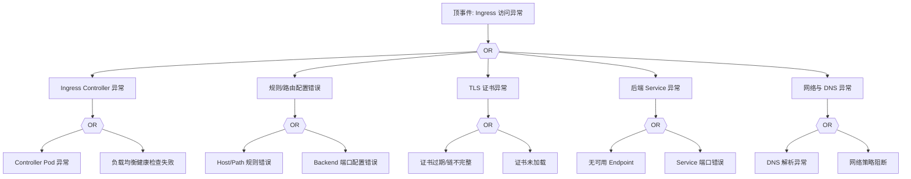

# Ingress 异常 FTA 树

## 适用范围与说明
- **目标**：覆盖 Ingress 请求失败、证书异常与路由错误的关键成因与路径。
- **范围**：Ingress Controller、规则配置、TLS 证书、后端服务、网络与 DNS。
- **符号**：
  - **OR 门**：任一子事件成立即可触发父事件
  - **AND 门**：所有子事件同时成立才触发父事件

---

## Mermaid FTA 树



---

## 生产级观测与证据
- **事件**：`503/502`、证书错误、访问超时。
- **关键指标**：Ingress Controller 响应延迟、`4xx/5xx` 比例、LB 健康状态。
- **关键日志**：Ingress Controller 日志、LB 日志、证书管理日志。
- **配置核对**：Ingress 规则、TLS Secret、Service 端口、DNS 记录。

---

## JSON 工作流（含与/或门控件）

```json
{
  "flow_steps": [
    { "name": "开始", "action": "start", "step": "start_ingress_fta", "next_step": "event_ingress_abnormal" },
    { "name": "顶事件: Ingress 访问异常", "action": "event", "step": "event_ingress_abnormal", "description": "访问失败/证书错误", "next_step": "gate_root_or" },
    { "name": "根因 OR 门", "action": "gate_or", "step": "gate_root_or", "control": "or_gate", "gate_type": "OR", "next_steps": ["cat_ctrl","cat_rule","cat_tls","cat_svc","cat_net"] }
  ]
}
```

---

## 版本适配（1.19–1.30）
- **1.19–1.23**：`networking.k8s.io/v1` 已 GA，1.22 起移除 `v1beta1`，需统一迁移。
- **1.24–1.27**：Ingress API 稳定，证书与 Controller 版本需与集群对齐。
- **1.28–1.30**：稳定 API 为主，需补充 Gateway API 并行存在的路由差异说明。
- **共性**：遵循 `fta_methodology_and_agentic_practices.md` 中的“版本适配基线”。
