# Job/CronJob 异常 FTA 树

## 适用范围与说明
- **目标**：覆盖 Job/CronJob 执行失败、未触发与重复执行的关键成因与路径。
- **范围**：调度触发、并发与重试策略、镜像与探针、资源与配额、控制器依赖。
- **符号**：
  - **OR 门**：任一子事件成立即可触发父事件
  - **AND 门**：所有子事件同时成立才触发父事件

---

## Mermaid FTA 树

```mermaid
flowchart TD
  TE[顶事件: Job/CronJob 异常]
  OR0{{OR}}
  TE --> OR0

  OR0 --> TRIG[触发/调度异常]
  OR0 --> POD[Pod 运行异常]
  OR0 --> RETRY[重试与并发异常]
  OR0 --> RES[资源与配额异常]
  OR0 --> CP[控制面依赖异常]

  %% 触发/调度异常分支 - 扩展到3-4层
  TRIG_OR{{OR}}
  TRIG --> TRIG_OR
  TRIG_OR --> TRIG1[CronJob 未触发]
  TRIG_OR --> TRIG2[调度时间问题]
  TRIG_OR --> TRIG3[Job 创建失败]

  TRIG1_OR{{OR}}
  TRIG1 --> TRIG1_OR
  TRIG1_OR --> TRIG1A[suspend 设置为 true]
  TRIG1_OR --> TRIG1B[schedule 表达式错误]
  TRIG1_OR --> TRIG1C[startingDeadlineSeconds 过期]

  TRIG2_OR{{OR}}
  TRIG2 --> TRIG2_OR
  TRIG2_OR --> TRIG2A[时区配置错误]
  TRIG2_OR --> TRIG2B[节点时间漂移]
  TRIG2_OR --> TRIG2C[控制器时钟不同步]

  TRIG3_OR{{OR}}
  TRIG3 --> TRIG3_OR
  TRIG3_OR --> TRIG3A[Job 模板配置错误]
  TRIG3_OR --> TRIG3B[Webhook 拦截失败]

  %% Pod 运行异常分支 - 扩展到3-4层
  POD_OR{{OR}}
  POD --> POD_OR
  POD_OR --> POD1[镜像拉取失败]
  POD_OR --> POD2[容器启动失败]
  POD_OR --> POD3[运行时错误]

  POD1_OR{{OR}}
  POD1 --> POD1_OR
  POD1_OR --> POD1A[ImagePullBackOff]
  POD1_OR --> POD1B[私有仓库认证失败]
  POD1_OR --> POD1C[镜像不存在]

  POD2_OR{{OR}}
  POD2 --> POD2_OR
  POD2_OR --> POD2A[CrashLoopBackOff]
  POD2_OR --> POD2B[配置/Secret 缺失]
  POD2_OR --> POD2C[权限不足]

  POD3_OR{{OR}}
  POD3 --> POD3_OR
  POD3_OR --> POD3A[任务逻辑错误退出]
  POD3_OR --> POD3B[OOMKilled]
  POD3_OR --> POD3C[超时被终止]

  %% 重试与并发异常分支 - 扩展到3-4层 + AND 门
  RETRY_OR{{OR}}
  RETRY --> RETRY_OR
  RETRY_OR --> RETRY1[重试策略问题]
  RETRY_OR --> RETRY2[并发策略问题]
  RETRY_OR --> RETRY3[历史 Job 积压]

  RETRY1_AND{{AND}}
  RETRY1 --> RETRY1_AND
  RETRY1_AND --> RETRY1A[任务持续失败]
  RETRY1_AND --> RETRY1B[backoffLimit 已达到]

  RETRY2_OR{{OR}}
  RETRY2 --> RETRY2_OR
  RETRY2_OR --> RETRY2A[Allow 导致重复运行]
  RETRY2_OR --> RETRY2B[Forbid 阻塞新任务]
  RETRY2_OR --> RETRY2C[Replace 导致任务丢失]

  RETRY3_OR{{OR}}
  RETRY3 --> RETRY3_OR
  RETRY3_OR --> RETRY3A[successfulJobsHistoryLimit 过大]
  RETRY3_OR --> RETRY3B[failedJobsHistoryLimit 过大]

  %% 资源与配额异常分支 - 扩展到3-4层
  RES_OR{{OR}}
  RES --> RES_OR
  RES_OR --> RES1[调度资源不足]
  RES_OR --> RES2[配额限制]
  RES_OR --> RES3[节点选择失败]

  RES1_OR{{OR}}
  RES1 --> RES1_OR
  RES1_OR --> RES1A[CPU/内存不足]
  RES1_OR --> RES1B[GPU 资源不足]
  RES1_OR --> RES1C[本地存储不足]

  RES2_OR{{OR}}
  RES2 --> RES2_OR
  RES2_OR --> RES2A[namespace 配额耗尽]
  RES2_OR --> RES2B[Pod 数量限制]

  RES3_OR{{OR}}
  RES3 --> RES3_OR
  RES3_OR --> RES3A[nodeSelector 不匹配]
  RES3_OR --> RES3B[污点容忍缺失]

  %% 控制面依赖异常分支 - 扩展到3-4层 + AND 门
  CP_OR{{OR}}
  CP --> CP_OR
  CP_OR --> CP1[API Server 问题]
  CP_OR --> CP2[控制器问题]
  CP_OR --> CP3[etcd 问题]

  CP1_OR{{OR}}
  CP1 --> CP1_OR
  CP1_OR --> CP1A[API Server 不可用]
  CP1_OR --> CP1B[请求被限流]

  CP2_AND{{AND}}
  CP2 --> CP2_AND
  CP2_AND --> CP2A[Job 控制器异常]
  CP2_AND --> CP2B[CronJob 控制器异常]

  CP3_OR{{OR}}
  CP3 --> CP3_OR
  CP3_OR --> CP3A[etcd 延迟高]
  CP3_OR --> CP3B[etcd 空间不足]
```



---

## 生产级观测与证据
- **事件**：`FailedCreate`、`FailedScheduling`、`BackoffLimitExceeded`、`DeadlineExceeded`、`SawCompletedJob`、`MissingJob`。
- **关键指标**：`kube_job_status_failed`、`kube_job_status_succeeded`、`kube_cronjob_status_last_schedule_time`、`kube_cronjob_next_schedule_time`、`kube_job_status_active`。
- **关键日志**：`kube-controller-manager`、`kubelet`、Job Pod 应用日志。
- **配置核对**：`schedule`、`concurrencyPolicy`、`backoffLimit`、`activeDeadlineSeconds`、`ttlSecondsAfterFinished`、资源请求。

---

## JSON 工作流（含与/或门控件）

```json
{
  "flow_steps": [
    { "name": "开始", "action": "start", "step": "start_job_fta", "next_step": "event_job_abnormal" },
    { "name": "顶事件: Job/CronJob 异常", "action": "event", "step": "event_job_abnormal", "description": "任务未执行/失败/重复", "next_step": "gate_root_or" },
    { "name": "根因 OR 门", "action": "gate_or", "step": "gate_root_or", "control": "or_gate", "gate_type": "OR", "next_steps": ["cat_trigger","cat_pod","cat_retry","cat_res","cat_cp"] },

    { "name": "触发/调度异常", "action": "category", "step": "cat_trigger", "next_step": "gate_trigger_or" },
    { "name": "触发调度 OR 门", "action": "gate_or", "step": "gate_trigger_or", "control": "or_gate", "gate_type": "OR", "next_steps": ["cat_cron_notrigger","cat_time_issue","cat_job_create_fail"] },

    { "name": "CronJob 未触发", "action": "category", "step": "cat_cron_notrigger", "next_step": "gate_cron_notrigger_or" },
    { "name": "CronJob 未触发 OR 门", "action": "gate_or", "step": "gate_cron_notrigger_or", "control": "or_gate", "gate_type": "OR", "next_steps": ["evt_suspend_true","evt_schedule_error","evt_deadline_expired"] },
    { "name": "suspend 设置为 true", "action": "event", "step": "evt_suspend_true", "severity": "low", "probability": "common", "mttr_minutes": 5, "detection": { "events": [], "metrics": ["kube_cronjob_spec_suspend == 1"], "logs": ["cronjob is suspended"] }, "remediation": { "manual_steps": ["确认是否故意暂停", "设置 suspend: false 恢复"], "auto_actions": ["kubectl patch cronjob <name> -p '{\"spec\":{\"suspend\":false}}'"] } },
    { "name": "schedule 表达式错误", "action": "event", "step": "evt_schedule_error", "severity": "high", "probability": "medium", "mttr_minutes": 10, "detection": { "events": ["InvalidSchedule"], "metrics": ["kube_cronjob_status_last_schedule_time 长期不更新"], "logs": ["controller-manager: invalid cron expression"] }, "remediation": { "manual_steps": ["检查 cron 表达式语法", "使用 crontab.guru 验证"], "auto_actions": ["修正 schedule 字段"] } },
    { "name": "startingDeadlineSeconds 过期", "action": "event", "step": "evt_deadline_expired", "severity": "medium", "probability": "medium", "mttr_minutes": 10, "detection": { "events": ["MissSchedule"], "metrics": ["kube_cronjob_status_last_schedule_time 落后于预期"], "logs": ["controller-manager: Missed starting window"] }, "remediation": { "manual_steps": ["增加 startingDeadlineSeconds", "检查控制器负载"], "auto_actions": ["kubectl patch cronjob <name> -p '{\"spec\":{\"startingDeadlineSeconds\":300}}'"] } },

    { "name": "调度时间问题", "action": "category", "step": "cat_time_issue", "next_step": "gate_time_issue_or" },
    { "name": "时间问题 OR 门", "action": "gate_or", "step": "gate_time_issue_or", "control": "or_gate", "gate_type": "OR", "next_steps": ["evt_timezone_error","evt_time_drift","evt_clock_unsync"] },
    { "name": "时区配置错误", "action": "event", "step": "evt_timezone_error", "severity": "medium", "probability": "medium", "mttr_minutes": 10, "detection": { "events": [], "metrics": ["Job 执行时间与预期偏差"], "logs": ["schedule time mismatch"] }, "remediation": { "manual_steps": ["检查 timeZone 字段 (1.25+)", "确认控制器时区设置"], "auto_actions": ["kubectl patch cronjob <name> -p '{\"spec\":{\"timeZone\":\"Asia/Shanghai\"}}'"] } },
    { "name": "节点时间漂移", "action": "event", "step": "evt_time_drift", "severity": "medium", "probability": "rare", "mttr_minutes": 20, "detection": { "events": [], "metrics": ["node_time_seconds 与标准时间偏差大"], "logs": ["NTP sync failed"] }, "remediation": { "manual_steps": ["检查 NTP 服务状态", "手动同步时间"], "auto_actions": ["systemctl restart chronyd"] } },
    { "name": "控制器时钟不同步", "action": "event", "step": "evt_clock_unsync", "severity": "medium", "probability": "rare", "mttr_minutes": 15, "detection": { "events": [], "metrics": ["控制面节点时间偏差"], "logs": ["controller-manager: time sync issue"] }, "remediation": { "manual_steps": ["检查控制面节点 NTP", "重启 controller-manager"], "auto_actions": ["ntpdate -u pool.ntp.org"] } },

    { "name": "Job 创建失败", "action": "category", "step": "cat_job_create_fail", "next_step": "gate_job_create_fail_or" },
    { "name": "Job 创建失败 OR 门", "action": "gate_or", "step": "gate_job_create_fail_or", "control": "or_gate", "gate_type": "OR", "next_steps": ["evt_template_error","evt_webhook_block"] },
    { "name": "Job 模板配置错误", "action": "event", "step": "evt_template_error", "severity": "high", "probability": "medium", "mttr_minutes": 15, "detection": { "events": ["FailedCreate: invalid job template"], "metrics": [], "logs": ["controller-manager: failed to create Job from template"] }, "remediation": { "manual_steps": ["检查 jobTemplate 配置", "验证 Pod spec 有效性"], "auto_actions": ["kubectl apply --dry-run=server -f cronjob.yaml"] } },
    { "name": "Webhook 拦截失败", "action": "event", "step": "evt_webhook_block", "severity": "high", "probability": "rare", "mttr_minutes": 20, "detection": { "events": ["FailedCreate: admission webhook denied"], "metrics": [], "logs": ["admission webhook rejected"] }, "remediation": { "manual_steps": ["检查 ValidatingWebhook 配置", "确认 Job 符合准入策略"], "auto_actions": ["修改 Job 配置符合策略要求"] } },

    { "name": "Pod 运行异常", "action": "category", "step": "cat_pod", "next_step": "gate_pod_or" },
    { "name": "Pod 运行 OR 门", "action": "gate_or", "step": "gate_pod_or", "control": "or_gate", "gate_type": "OR", "next_steps": ["cat_image","cat_startup","cat_runtime"] },

    { "name": "镜像拉取失败", "action": "category", "step": "cat_image", "next_step": "gate_image_or" },
    { "name": "镜像拉取 OR 门", "action": "gate_or", "step": "gate_image_or", "control": "or_gate", "gate_type": "OR", "next_steps": ["evt_imagepullbackoff","evt_registry_auth","evt_image_notfound"] },
    { "name": "ImagePullBackOff", "action": "event", "step": "evt_imagepullbackoff", "severity": "high", "probability": "common", "mttr_minutes": 15, "detection": { "events": ["Failed to pull image", "ImagePullBackOff"], "metrics": ["kube_pod_container_status_waiting_reason{reason=\"ImagePullBackOff\"} > 0"], "logs": ["kubelet: Failed to pull image"] }, "remediation": { "manual_steps": ["检查镜像地址是否正确", "检查网络连接到镜像仓库"], "auto_actions": ["crictl pull <image>"] } },
    { "name": "私有仓库认证失败", "action": "event", "step": "evt_registry_auth", "severity": "high", "probability": "common", "mttr_minutes": 10, "detection": { "events": ["Failed to pull image: unauthorized"], "metrics": ["kube_pod_container_status_waiting_reason{reason=\"ErrImagePull\"} > 0"], "logs": ["kubelet: unauthorized: authentication required"] }, "remediation": { "manual_steps": ["检查 imagePullSecrets 配置", "确认 Secret 中的认证信息正确"], "auto_actions": ["kubectl create secret docker-registry ..."] } },
    { "name": "镜像不存在", "action": "event", "step": "evt_image_notfound", "severity": "high", "probability": "common", "mttr_minutes": 10, "detection": { "events": ["Failed to pull image: not found"], "metrics": ["kube_pod_container_status_waiting_reason{reason=\"ErrImagePull\"} > 0"], "logs": ["kubelet: manifest unknown"] }, "remediation": { "manual_steps": ["确认镜像名称和 tag 正确", "检查镜像是否已推送到仓库"], "auto_actions": ["修正镜像地址"] } },

    { "name": "容器启动失败", "action": "category", "step": "cat_startup", "next_step": "gate_startup_or" },
    { "name": "容器启动 OR 门", "action": "gate_or", "step": "gate_startup_or", "control": "or_gate", "gate_type": "OR", "next_steps": ["evt_crashloop","evt_config_missing","evt_permission_denied"] },
    { "name": "CrashLoopBackOff", "action": "event", "step": "evt_crashloop", "severity": "high", "probability": "common", "mttr_minutes": 20, "detection": { "events": ["BackOff: Back-off restarting failed container"], "metrics": ["kube_pod_container_status_waiting_reason{reason=\"CrashLoopBackOff\"} > 0"], "logs": ["kubelet: Back-off restarting failed container"] }, "remediation": { "manual_steps": ["查看容器日志定位崩溃原因", "检查应用配置和依赖"], "auto_actions": ["kubectl logs <pod> -c <container> --previous"] } },
    { "name": "配置/Secret 缺失", "action": "event", "step": "evt_config_missing", "severity": "high", "probability": "medium", "mttr_minutes": 10, "detection": { "events": ["FailedMount", "CreateContainerConfigError"], "metrics": ["kube_pod_container_status_waiting_reason{reason=\"CreateContainerConfigError\"} > 0"], "logs": ["kubelet: Error: configmap/secret not found"] }, "remediation": { "manual_steps": ["检查 ConfigMap/Secret 是否存在", "检查卷挂载配置"], "auto_actions": ["创建缺失的 ConfigMap/Secret"] } },
    { "name": "权限不足", "action": "event", "step": "evt_permission_denied", "severity": "high", "probability": "medium", "mttr_minutes": 15, "detection": { "events": ["FailedCreate"], "metrics": [], "logs": ["container: permission denied"] }, "remediation": { "manual_steps": ["检查 securityContext 配置", "确认 ServiceAccount 权限"], "auto_actions": ["调整 runAsUser/runAsGroup 配置"] } },

    { "name": "运行时错误", "action": "category", "step": "cat_runtime", "next_step": "gate_runtime_or" },
    { "name": "运行时错误 OR 门", "action": "gate_or", "step": "gate_runtime_or", "control": "or_gate", "gate_type": "OR", "next_steps": ["evt_logic_error","evt_oomkilled","evt_timeout_killed"] },
    { "name": "任务逻辑错误退出", "action": "event", "step": "evt_logic_error", "severity": "high", "probability": "common", "mttr_minutes": 30, "detection": { "events": ["BackOff"], "metrics": ["kube_job_status_failed > 0"], "logs": ["container exited with error code"] }, "remediation": { "manual_steps": ["查看 Pod 日志分析错误", "修复任务代码逻辑"], "auto_actions": ["kubectl logs <pod>"] } },
    { "name": "OOMKilled", "action": "event", "step": "evt_oomkilled", "severity": "high", "probability": "common", "mttr_minutes": 15, "detection": { "events": ["OOMKilled"], "metrics": ["kube_pod_container_status_last_terminated_reason{reason=\"OOMKilled\"} > 0"], "logs": ["kubelet: Container killed due to OOM"] }, "remediation": { "manual_steps": ["增加 memory limits", "优化任务内存使用"], "auto_actions": ["kubectl patch job <name> -p '{\"spec\":{\"template\":{\"spec\":{\"containers\":[{\"name\":\"...\",\"resources\":{\"limits\":{\"memory\":\"...\"}}}]}}}}'"] } },
    { "name": "超时被终止", "action": "event", "step": "evt_timeout_killed", "severity": "medium", "probability": "medium", "mttr_minutes": 20, "detection": { "events": ["DeadlineExceeded"], "metrics": ["kube_job_status_failed{reason=\"DeadlineExceeded\"} > 0"], "logs": ["Job was active longer than activeDeadlineSeconds"] }, "remediation": { "manual_steps": ["增加 activeDeadlineSeconds", "优化任务执行时间"], "auto_actions": ["kubectl patch job <name> -p '{\"spec\":{\"activeDeadlineSeconds\":...}}'"] } },

    { "name": "重试与并发异常", "action": "category", "step": "cat_retry", "next_step": "gate_retry_or" },
    { "name": "重试并发 OR 门", "action": "gate_or", "step": "gate_retry_or", "control": "or_gate", "gate_type": "OR", "next_steps": ["cat_retry_policy","cat_concurrency","cat_history"] },

    { "name": "重试策略问题", "action": "category", "step": "cat_retry_policy", "next_step": "gate_retry_policy_and" },
    { "name": "重试策略 AND 门", "action": "gate_and", "step": "gate_retry_policy_and", "control": "and_gate", "gate_type": "AND", "description": "任务持续失败 且 backoffLimit 已达到导致 Job 失败", "next_steps": ["evt_task_fail_persist","evt_backofflimit_reached"] },
    { "name": "任务持续失败", "action": "event", "step": "evt_task_fail_persist", "severity": "high", "probability": "common", "mttr_minutes": 30, "detection": { "events": ["BackOff"], "metrics": ["kube_job_status_failed 持续增加"], "logs": ["container exited with non-zero exit code"] }, "remediation": { "manual_steps": ["分析任务失败根因", "修复代码或配置问题"], "auto_actions": ["kubectl logs <pod>"] } },
    { "name": "backoffLimit 已达到", "action": "event", "step": "evt_backofflimit_reached", "severity": "high", "probability": "common", "mttr_minutes": 10, "detection": { "events": ["BackoffLimitExceeded"], "metrics": ["kube_job_status_failed >= backoffLimit"], "logs": ["Job has reached the specified backoff limit"] }, "remediation": { "manual_steps": ["检查并增加 backoffLimit", "或修复任务确保成功"], "auto_actions": ["kubectl patch job <name> -p '{\"spec\":{\"backoffLimit\":...}}'"] } },

    { "name": "并发策略问题", "action": "category", "step": "cat_concurrency", "next_step": "gate_concurrency_or" },
    { "name": "并发策略 OR 门", "action": "gate_or", "step": "gate_concurrency_or", "control": "or_gate", "gate_type": "OR", "next_steps": ["evt_allow_duplicate","evt_forbid_block","evt_replace_lost"] },
    { "name": "Allow 导致重复运行", "action": "event", "step": "evt_allow_duplicate", "severity": "medium", "probability": "common", "mttr_minutes": 10, "detection": { "events": [], "metrics": ["kube_job_status_active > 1 (同一 CronJob)"], "logs": ["multiple Jobs running concurrently"] }, "remediation": { "manual_steps": ["评估是否允许并发", "改为 Forbid 或 Replace"], "auto_actions": ["kubectl patch cronjob <name> -p '{\"spec\":{\"concurrencyPolicy\":\"Forbid\"}}'"] } },
    { "name": "Forbid 阻塞新任务", "action": "event", "step": "evt_forbid_block", "severity": "medium", "probability": "medium", "mttr_minutes": 15, "detection": { "events": ["JobAlreadyActive"], "metrics": ["kube_cronjob_status_last_schedule_time 未按预期更新"], "logs": ["controller-manager: skipping job because previous job is still running"] }, "remediation": { "manual_steps": ["等待前一个 Job 完成", "或手动终止前一个 Job"], "auto_actions": ["kubectl delete job <previous-job>"] } },
    { "name": "Replace 导致任务丢失", "action": "event", "step": "evt_replace_lost", "severity": "high", "probability": "rare", "mttr_minutes": 20, "detection": { "events": ["SawCompletedJob deleted"], "metrics": ["Job 执行记录缺失"], "logs": ["controller-manager: replacing job"] }, "remediation": { "manual_steps": ["评估任务是否可被替换", "改为 Forbid 确保完成"], "auto_actions": ["调整 concurrencyPolicy"] } },

    { "name": "历史 Job 积压", "action": "category", "step": "cat_history", "next_step": "gate_history_or" },
    { "name": "历史积压 OR 门", "action": "gate_or", "step": "gate_history_or", "control": "or_gate", "gate_type": "OR", "next_steps": ["evt_success_history_large","evt_failed_history_large"] },
    { "name": "successfulJobsHistoryLimit 过大", "action": "event", "step": "evt_success_history_large", "severity": "low", "probability": "medium", "mttr_minutes": 10, "detection": { "events": [], "metrics": ["大量已完成 Job 对象存在"], "logs": [] }, "remediation": { "manual_steps": ["减小 successfulJobsHistoryLimit", "手动清理历史 Job"], "auto_actions": ["kubectl patch cronjob <name> -p '{\"spec\":{\"successfulJobsHistoryLimit\":3}}'"] } },
    { "name": "failedJobsHistoryLimit 过大", "action": "event", "step": "evt_failed_history_large", "severity": "low", "probability": "medium", "mttr_minutes": 10, "detection": { "events": [], "metrics": ["大量失败 Job 对象存在"], "logs": [] }, "remediation": { "manual_steps": ["减小 failedJobsHistoryLimit", "手动清理失败 Job"], "auto_actions": ["kubectl patch cronjob <name> -p '{\"spec\":{\"failedJobsHistoryLimit\":1}}'"] } },

    { "name": "资源与配额异常", "action": "category", "step": "cat_res", "next_step": "gate_res_or" },
    { "name": "资源配额 OR 门", "action": "gate_or", "step": "gate_res_or", "control": "or_gate", "gate_type": "OR", "next_steps": ["cat_sched_res","cat_quota","cat_node_select"] },

    { "name": "调度资源不足", "action": "category", "step": "cat_sched_res", "next_step": "gate_sched_res_or" },
    { "name": "调度资源 OR 门", "action": "gate_or", "step": "gate_sched_res_or", "control": "or_gate", "gate_type": "OR", "next_steps": ["evt_cpu_mem_insufficient","evt_gpu_insufficient","evt_local_storage_insufficient"] },
    { "name": "CPU/内存不足", "action": "event", "step": "evt_cpu_mem_insufficient", "severity": "high", "probability": "common", "mttr_minutes": 20, "detection": { "events": ["FailedScheduling: Insufficient cpu/memory"], "metrics": ["scheduler_pending_pods > 0"], "logs": ["scheduler: 0/N nodes are available"] }, "remediation": { "manual_steps": ["检查集群资源利用率", "扩容节点或清理资源"], "auto_actions": ["触发 Cluster Autoscaler"] } },
    { "name": "GPU 资源不足", "action": "event", "step": "evt_gpu_insufficient", "severity": "high", "probability": "medium", "mttr_minutes": 30, "detection": { "events": ["FailedScheduling: Insufficient nvidia.com/gpu"], "metrics": ["kube_node_status_allocatable{resource=\"nvidia_com_gpu\"} == 0"], "logs": ["scheduler: insufficient GPU resources"] }, "remediation": { "manual_steps": ["检查 GPU 节点状态", "扩容 GPU 节点"], "auto_actions": ["扩容 GPU 节点池"] } },
    { "name": "本地存储不足", "action": "event", "step": "evt_local_storage_insufficient", "severity": "medium", "probability": "medium", "mttr_minutes": 20, "detection": { "events": ["FailedScheduling: Insufficient ephemeral-storage"], "metrics": ["node_filesystem_avail_bytes 低"], "logs": ["scheduler: insufficient ephemeral-storage"] }, "remediation": { "manual_steps": ["清理节点磁盘空间", "减小 Pod ephemeral-storage 请求"], "auto_actions": ["kubectl get pods --sort-by=.status.startTime | head"] } },

    { "name": "配额限制", "action": "category", "step": "cat_quota", "next_step": "gate_quota_or" },
    { "name": "配额限制 OR 门", "action": "gate_or", "step": "gate_quota_or", "control": "or_gate", "gate_type": "OR", "next_steps": ["evt_ns_quota","evt_pod_limit"] },
    { "name": "namespace 配额耗尽", "action": "event", "step": "evt_ns_quota", "severity": "high", "probability": "medium", "mttr_minutes": 15, "detection": { "events": ["FailedCreate: exceeded quota"], "metrics": ["kube_resourcequota_hard == kube_resourcequota_used"], "logs": ["controller-manager: quota exceeded"] }, "remediation": { "manual_steps": ["检查并清理 namespace 中的资源", "申请增加配额"], "auto_actions": ["kubectl patch resourcequota ..."] } },
    { "name": "Pod 数量限制", "action": "event", "step": "evt_pod_limit", "severity": "medium", "probability": "medium", "mttr_minutes": 15, "detection": { "events": ["FailedCreate: exceeded quota for pods"], "metrics": ["kube_resourcequota 中 pods 达到限制"], "logs": ["exceeded quota: pods"] }, "remediation": { "manual_steps": ["清理已完成/失败的 Pod", "增加 Pod 配额"], "auto_actions": ["kubectl delete pod --field-selector=status.phase==Succeeded"] } },

    { "name": "节点选择失败", "action": "category", "step": "cat_node_select", "next_step": "gate_node_select_or" },
    { "name": "节点选择 OR 门", "action": "gate_or", "step": "gate_node_select_or", "control": "or_gate", "gate_type": "OR", "next_steps": ["evt_nodeselector_nomatch","evt_toleration_missing"] },
    { "name": "nodeSelector 不匹配", "action": "event", "step": "evt_nodeselector_nomatch", "severity": "high", "probability": "common", "mttr_minutes": 10, "detection": { "events": ["FailedScheduling: node selector not matching"], "metrics": ["scheduler_pending_pods > 0"], "logs": ["scheduler: node selector didn't match"] }, "remediation": { "manual_steps": ["检查 nodeSelector 配置", "确认存在匹配节点"], "auto_actions": ["kubectl label nodes <node> <key>=<value>"] } },
    { "name": "污点容忍缺失", "action": "event", "step": "evt_toleration_missing", "severity": "high", "probability": "common", "mttr_minutes": 10, "detection": { "events": ["FailedScheduling: node(s) had taints"], "metrics": ["scheduler_pending_pods > 0"], "logs": ["scheduler: pod tolerations not matching node taints"] }, "remediation": { "manual_steps": ["检查节点污点配置", "在 Job 中添加 tolerations"], "auto_actions": ["修改 Job 模板添加 tolerations"] } },

    { "name": "控制面依赖异常", "action": "category", "step": "cat_cp", "next_step": "gate_cp_or" },
    { "name": "控制面 OR 门", "action": "gate_or", "step": "gate_cp_or", "control": "or_gate", "gate_type": "OR", "next_steps": ["cat_apiserver","cat_controller","cat_etcd"] },

    { "name": "API Server 问题", "action": "category", "step": "cat_apiserver", "next_step": "gate_apiserver_or" },
    { "name": "API Server OR 门", "action": "gate_or", "step": "gate_apiserver_or", "control": "or_gate", "gate_type": "OR", "next_steps": ["evt_apiserver_down","evt_throttled"] },
    { "name": "API Server 不可用", "action": "event", "step": "evt_apiserver_down", "severity": "critical", "probability": "rare", "mttr_minutes": 30, "detection": { "events": [], "metrics": ["up{job=\"kube-apiserver\"} == 0"], "logs": ["connection refused to apiserver"] }, "remediation": { "manual_steps": ["检查 API Server 状态", "查看日志定位问题"], "auto_actions": ["systemctl restart kube-apiserver"] } },
    { "name": "请求被限流", "action": "event", "step": "evt_throttled", "severity": "medium", "probability": "rare", "mttr_minutes": 15, "detection": { "events": [], "metrics": ["apiserver_current_inflight_requests 接近限制"], "logs": ["Too Many Requests"] }, "remediation": { "manual_steps": ["检查 API Server 负载", "调整限流配置或减少请求"], "auto_actions": ["增加 API Server 副本"] } },

    { "name": "控制器问题", "action": "category", "step": "cat_controller", "next_step": "gate_controller_and" },
    { "name": "控制器 AND 门", "action": "gate_and", "step": "gate_controller_and", "control": "and_gate", "gate_type": "AND", "description": "Job 控制器和 CronJob 控制器同时异常导致任务完全无法调度", "next_steps": ["evt_job_controller_fail","evt_cronjob_controller_fail"] },
    { "name": "Job 控制器异常", "action": "event", "step": "evt_job_controller_fail", "severity": "critical", "probability": "rare", "mttr_minutes": 20, "detection": { "events": [], "metrics": ["workqueue_depth{name=\"job\"} 异常高"], "logs": ["controller-manager: job controller error"] }, "remediation": { "manual_steps": ["检查 controller-manager 状态", "查看日志定位问题"], "auto_actions": ["systemctl restart kube-controller-manager"] } },
    { "name": "CronJob 控制器异常", "action": "event", "step": "evt_cronjob_controller_fail", "severity": "critical", "probability": "rare", "mttr_minutes": 20, "detection": { "events": [], "metrics": ["workqueue_depth{name=\"cronjob\"} 异常高"], "logs": ["controller-manager: cronjob controller error"] }, "remediation": { "manual_steps": ["检查 controller-manager 状态", "查看日志定位问题"], "auto_actions": ["systemctl restart kube-controller-manager"] } },

    { "name": "etcd 问题", "action": "category", "step": "cat_etcd", "next_step": "gate_etcd_or" },
    { "name": "etcd OR 门", "action": "gate_or", "step": "gate_etcd_or", "control": "or_gate", "gate_type": "OR", "next_steps": ["evt_etcd_latency","evt_etcd_space"] },
    { "name": "etcd 延迟高", "action": "event", "step": "evt_etcd_latency", "severity": "high", "probability": "rare", "mttr_minutes": 30, "detection": { "events": [], "metrics": ["etcd_disk_wal_fsync_duration_seconds > 0.1"], "logs": ["etcd: slow disk IO"] }, "remediation": { "manual_steps": ["检查 etcd 磁盘性能", "迁移到 SSD 存储"], "auto_actions": ["优化 etcd 存储配置"] } },
    { "name": "etcd 空间不足", "action": "event", "step": "evt_etcd_space", "severity": "critical", "probability": "rare", "mttr_minutes": 30, "detection": { "events": [], "metrics": ["etcd_mvcc_db_total_size_in_bytes 接近 quota"], "logs": ["etcd: database space exceeded"] }, "remediation": { "manual_steps": ["执行 etcd 压缩", "增加 quota 或清理数据"], "auto_actions": ["etcdctl compact && etcdctl defrag"] } },

    { "name": "结束", "action": "end", "step": "end_job_fta" }
  ]
}
```

---

## 版本适配（1.19–1.30）
- **1.19–1.23**：CronJob 仍可能使用 `batch/v1beta1`，需明确 API 迁移路径。
- **1.24–1.27**：默认使用 `batch/v1`，字段差异需校验；timeZone 字段在 1.25+ 可用。
- **1.28–1.30**：仅保留稳定 API，调度触发与审计链路需统一。
- **共性**：遵循 `fta_methodology_and_agentic_practices.md` 中的"版本适配基线"。
