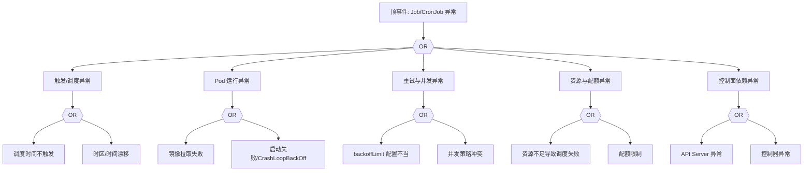

# Job/CronJob 异常 FTA 树

## 适用范围与说明
- **目标**：覆盖 Job/CronJob 执行失败、未触发与重复执行的关键成因与路径。
- **范围**：调度触发、并发与重试策略、镜像与探针、资源与配额、控制器依赖。
- **符号**：
  - **OR 门**：任一子事件成立即可触发父事件
  - **AND 门**：所有子事件同时成立才触发父事件

---

## Mermaid FTA 树



---

## 生产级观测与证据
- **事件**：`FailedCreate`、`FailedScheduling`、`BackoffLimitExceeded`。
- **关键指标**：`kube_job_status_failed`、`kube_cronjob_status_last_schedule_time`。
- **关键日志**：`kube-controller-manager`、`kubelet`。
- **配置核对**：`schedule`、`concurrencyPolicy`、`backoffLimit`、资源请求。

---

## JSON 工作流（含与/或门控件）

```json
{
  "flow_steps": [
    { "name": "开始", "action": "start", "step": "start_job_fta", "next_step": "event_job_abnormal" },
    { "name": "顶事件: Job/CronJob 异常", "action": "event", "step": "event_job_abnormal", "description": "任务未执行/失败/重复", "next_step": "gate_root_or" },
    { "name": "根因 OR 门", "action": "gate_or", "step": "gate_root_or", "control": "or_gate", "gate_type": "OR", "next_steps": ["cat_trigger","cat_pod","cat_retry","cat_res","cat_cp"] }
  ]
}
```

---

## 版本适配（1.19–1.30）
- **1.19–1.23**：CronJob 仍可能使用 `batch/v1beta1`，需明确 API 迁移路径。
- **1.24–1.27**：默认使用 `batch/v1`，字段差异需校验。
- **1.28–1.30**：仅保留稳定 API，调度触发与审计链路需统一。
- **共性**：遵循 `fta_methodology_and_agentic_practices.md` 中的“版本适配基线”。
