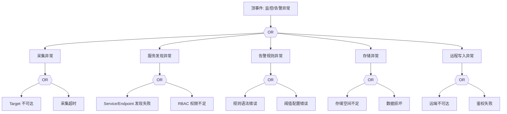

# 监控与告警异常 FTA 树

## 适用范围与说明
- **目标**：覆盖监控采集失败、告警不触发与数据丢失的关键成因与路径。
- **范围**：Prometheus 采集、目标发现、告警规则、存储与远程写入。
- **符号**：
  - **OR 门**：任一子事件成立即可触发父事件
  - **AND 门**：所有子事件同时成立才触发父事件

---

## Mermaid FTA 树



---

## 生产级观测与证据
- **事件**：采集失败、告警未触发、指标缺失。
- **关键指标**：`prometheus_target_interval_length_seconds`、`prometheus_rule_evaluation_failures_total`。
- **关键日志**：Prometheus/Alertmanager 日志、远程存储日志。
- **配置核对**：Scrape 配置、告警规则、存储与远程写入配置。

---

## JSON 工作流（含与/或门控件）

```json
{
  "flow_steps": [
    { "name": "开始", "action": "start", "step": "start_monitor_fta", "next_step": "event_monitor_abnormal" },
    { "name": "顶事件: 监控/告警异常", "action": "event", "step": "event_monitor_abnormal", "description": "采集失败/告警不触发", "next_step": "gate_root_or" },
    { "name": "根因 OR 门", "action": "gate_or", "step": "gate_root_or", "control": "or_gate", "gate_type": "OR", "next_steps": ["cat_scrape","cat_disc","cat_alert","cat_store","cat_remote"] }
  ]
}
```

---

## 版本适配（1.19–1.30）
- **1.19–1.23**：服务发现与 API 版本兼容需校验，旧版目标发现可能缺失 EndpointSlice。
- **1.24–1.27**：PSP 移除后监控组件权限需调整。
- **1.28–1.30**：稳定 API 为主，审计链路与告警口径需统一。
- **共性**：遵循 `fta_methodology_and_agentic_practices.md` 中的“版本适配基线”。
