# NetworkPolicy 异常 FTA 树

## 适用范围与说明
- **目标**：覆盖 NetworkPolicy 误拦截、策略冲突与生效异常的关键成因与路径。
- **范围**：策略配置、命名空间隔离、CNI 实现、服务发现与 DNS、审计与回滚。
- **符号**：
  - **OR 门**：任一子事件成立即可触发父事件
  - **AND 门**：所有子事件同时成立才触发父事件

---

## Mermaid FTA 树

```mermaid
flowchart TD
  TE[顶事件: NetworkPolicy 异常]
  OR0{{OR}}
  TE --> OR0

  OR0 --> CFG[策略配置错误]
  OR0 --> CNI[CNI 实现异常]
  OR0 --> NS[命名空间隔离异常]
  OR0 --> DNS[DNS 访问被阻断]
  OR0 --> AUDIT[审计/回滚缺失]

  %% 策略配置错误分支 - 扩展到3-4层
  CFG_OR{{OR}}
  CFG --> CFG_OR
  CFG_OR --> CFG1[Selector 配置问题]
  CFG_OR --> CFG2[规则配置问题]
  CFG_OR --> CFG3[端口配置问题]

  CFG1_OR{{OR}}
  CFG1 --> CFG1_OR
  CFG1_OR --> CFG1A[podSelector 选择错误]
  CFG1_OR --> CFG1B[namespaceSelector 错误]
  CFG1_OR --> CFG1C[标签不匹配]

  CFG2_OR{{OR}}
  CFG2 --> CFG2_OR
  CFG2_OR --> CFG2A[入站规则缺失]
  CFG2_OR --> CFG2B[出站规则缺失]
  CFG2_OR --> CFG2C[规则逻辑错误]

  CFG3_OR{{OR}}
  CFG3 --> CFG3_OR
  CFG3_OR --> CFG3A[端口号错误]
  CFG3_OR --> CFG3B[协议类型错误]

  %% CNI 实现异常分支 - 扩展到3-4层 + AND 门
  CNI_OR{{OR}}
  CNI --> CNI_OR
  CNI_OR --> CNI1[CNI 能力问题]
  CNI_OR --> CNI2[策略下发问题]
  CNI_OR --> CNI3[策略执行问题]

  CNI1_AND{{AND}}
  CNI1 --> CNI1_AND
  CNI1_AND --> CNI1A[CNI 不支持 NetworkPolicy]
  CNI1_AND --> CNI1B[策略模式未启用]

  CNI2_OR{{OR}}
  CNI2 --> CNI2_OR
  CNI2_OR --> CNI2A[策略同步延迟]
  CNI2_OR --> CNI2B[下发失败]
  CNI2_OR --> CNI2C[规则数量超限]

  CNI3_OR{{OR}}
  CNI3 --> CNI3_OR
  CNI3_OR --> CNI3A[iptables/eBPF 规则错误]
  CNI3_OR --> CNI3B[规则冲突]

  %% 命名空间隔离异常分支 - 扩展到3-4层
  NS_OR{{OR}}
  NS --> NS_OR
  NS_OR --> NS1[默认策略问题]
  NS_OR --> NS2[策略优先级问题]
  NS_OR --> NS3[跨命名空间问题]

  NS1_OR{{OR}}
  NS1 --> NS1_OR
  NS1_OR --> NS1A[默认拒绝策略过严]
  NS1_OR --> NS1B[默认允许策略过宽]

  NS2_OR{{OR}}
  NS2 --> NS2_OR
  NS2_OR --> NS2A[多策略优先级冲突]
  NS2_OR --> NS2B[策略叠加效果异常]

  NS3_OR{{OR}}
  NS3 --> NS3_OR
  NS3_OR --> NS3A[跨 NS 访问被拒绝]
  NS3_OR --> NS3B[namespaceSelector 配置错误]

  %% DNS 访问被阻断分支 - 扩展到3-4层 + AND 门
  DNS_OR{{OR}}
  DNS --> DNS_OR
  DNS_OR --> DNS1[DNS 规则问题]
  DNS_OR --> DNS2[CoreDNS 访问问题]

  DNS1_AND{{AND}}
  DNS1 --> DNS1_AND
  DNS1_AND --> DNS1A[出站 DNS 端口未放通]
  DNS1_AND --> DNS1B[默认拒绝策略生效]

  DNS2_OR{{OR}}
  DNS2 --> DNS2_OR
  DNS2_OR --> DNS2A[kube-system NS 访问被拒]
  DNS2_OR --> DNS2B[CoreDNS Pod 访问被拒]

  %% 审计/回滚缺失分支 - 扩展到3-4层
  AUDIT_OR{{OR}}
  AUDIT --> AUDIT_OR
  AUDIT_OR --> AUD1[审计问题]
  AUDIT_OR --> AUD2[回滚问题]

  AUD1_OR{{OR}}
  AUD1 --> AUD1_OR
  AUD1_OR --> AUD1A[无审计日志]
  AUD1_OR --> AUD1B[审计粒度不足]

  AUD2_OR{{OR}}
  AUD2 --> AUD2_OR
  AUD2_OR --> AUD2A[无历史版本备份]
  AUD2_OR --> AUD2B[回滚操作失败]
```



---

## 生产级观测与证据
- **事件**：应用连通性下降、DNS 解析失败、特定流量被阻断、`connection refused`、`connection timed out`。
- **关键指标**：策略命中率、丢包率、连接失败率、CNI 策略同步延迟。
- **关键日志**：CNI policy 日志、审计日志、CoreDNS 日志、应用连接错误日志。
- **配置核对**：NetworkPolicy 规则、命名空间默认策略、CNI 策略能力、DNS 放通规则。

---

## JSON 工作流（含与/或门控件）

```json
{
  "flow_steps": [
    { "name": "开始", "action": "start", "step": "start_np_fta", "next_step": "event_np_abnormal" },
    { "name": "顶事件: NetworkPolicy 异常", "action": "event", "step": "event_np_abnormal", "description": "误拦截/策略不生效", "next_step": "gate_root_or" },
    { "name": "根因 OR 门", "action": "gate_or", "step": "gate_root_or", "control": "or_gate", "gate_type": "OR", "next_steps": ["cat_cfg","cat_cni","cat_ns","cat_dns","cat_audit"] },

    { "name": "策略配置错误", "action": "category", "step": "cat_cfg", "next_step": "gate_cfg_or" },
    { "name": "策略配置 OR 门", "action": "gate_or", "step": "gate_cfg_or", "control": "or_gate", "gate_type": "OR", "next_steps": ["cat_selector","cat_rule","cat_port"] },

    { "name": "Selector 配置问题", "action": "category", "step": "cat_selector", "next_step": "gate_selector_or" },
    { "name": "Selector OR 门", "action": "gate_or", "step": "gate_selector_or", "control": "or_gate", "gate_type": "OR", "next_steps": ["evt_podselector_error","evt_nsselector_error","evt_label_mismatch"] },
    { "name": "podSelector 选择错误", "action": "event", "step": "evt_podselector_error", "severity": "high", "probability": "common", "mttr_minutes": 15, "detection": { "events": ["连接被拒绝"], "metrics": ["网络策略命中但流量被拒"], "logs": ["CNI: packet dropped by policy"] }, "remediation": { "manual_steps": ["检查 podSelector 配置", "验证目标 Pod 标签"], "auto_actions": ["kubectl get pods --show-labels"] } },
    { "name": "namespaceSelector 错误", "action": "event", "step": "evt_nsselector_error", "severity": "high", "probability": "common", "mttr_minutes": 15, "detection": { "events": ["跨命名空间连接失败"], "metrics": ["跨 NS 流量被拒"], "logs": ["CNI: cross-namespace traffic denied"] }, "remediation": { "manual_steps": ["检查 namespaceSelector 配置", "验证命名空间标签"], "auto_actions": ["kubectl get ns --show-labels"] } },
    { "name": "标签不匹配", "action": "event", "step": "evt_label_mismatch", "severity": "medium", "probability": "common", "mttr_minutes": 10, "detection": { "events": [], "metrics": ["策略未命中预期 Pod"], "logs": [] }, "remediation": { "manual_steps": ["对比策略 selector 与 Pod 标签", "修正标签或策略"], "auto_actions": ["kubectl label pod <pod> <key>=<value>"] } },

    { "name": "规则配置问题", "action": "category", "step": "cat_rule", "next_step": "gate_rule_or" },
    { "name": "规则 OR 门", "action": "gate_or", "step": "gate_rule_or", "control": "or_gate", "gate_type": "OR", "next_steps": ["evt_ingress_missing","evt_egress_missing","evt_rule_logic_error"] },
    { "name": "入站规则缺失", "action": "event", "step": "evt_ingress_missing", "severity": "high", "probability": "common", "mttr_minutes": 15, "detection": { "events": ["入站连接被拒"], "metrics": ["ingress 流量被拒"], "logs": ["CNI: ingress denied"] }, "remediation": { "manual_steps": ["添加 ingress 规则", "检查 from 配置"], "auto_actions": ["kubectl apply -f networkpolicy-ingress.yaml"] } },
    { "name": "出站规则缺失", "action": "event", "step": "evt_egress_missing", "severity": "high", "probability": "common", "mttr_minutes": 15, "detection": { "events": ["出站连接被拒"], "metrics": ["egress 流量被拒"], "logs": ["CNI: egress denied"] }, "remediation": { "manual_steps": ["添加 egress 规则", "检查 to 配置"], "auto_actions": ["kubectl apply -f networkpolicy-egress.yaml"] } },
    { "name": "规则逻辑错误", "action": "event", "step": "evt_rule_logic_error", "severity": "medium", "probability": "medium", "mttr_minutes": 20, "detection": { "events": [], "metrics": ["策略效果与预期不符"], "logs": [] }, "remediation": { "manual_steps": ["审查策略逻辑", "使用 kubectl describe 分析"], "auto_actions": ["kubectl describe networkpolicy <name>"] } },

    { "name": "端口配置问题", "action": "category", "step": "cat_port", "next_step": "gate_port_or" },
    { "name": "端口 OR 门", "action": "gate_or", "step": "gate_port_or", "control": "or_gate", "gate_type": "OR", "next_steps": ["evt_port_number_error","evt_protocol_error"] },
    { "name": "端口号错误", "action": "event", "step": "evt_port_number_error", "severity": "medium", "probability": "common", "mttr_minutes": 10, "detection": { "events": ["特定端口连接被拒"], "metrics": [], "logs": ["CNI: port not allowed"] }, "remediation": { "manual_steps": ["检查策略中的端口配置", "确认应用实际端口"], "auto_actions": ["修正端口号"] } },
    { "name": "协议类型错误", "action": "event", "step": "evt_protocol_error", "severity": "medium", "probability": "rare", "mttr_minutes": 10, "detection": { "events": ["特定协议连接被拒"], "metrics": [], "logs": ["CNI: protocol mismatch"] }, "remediation": { "manual_steps": ["检查协议配置 (TCP/UDP/SCTP)", "修正协议类型"], "auto_actions": ["修正协议配置"] } },

    { "name": "CNI 实现异常", "action": "category", "step": "cat_cni", "next_step": "gate_cni_or" },
    { "name": "CNI OR 门", "action": "gate_or", "step": "gate_cni_or", "control": "or_gate", "gate_type": "OR", "next_steps": ["cat_cni_cap","cat_cni_sync","cat_cni_exec"] },

    { "name": "CNI 能力问题", "action": "category", "step": "cat_cni_cap", "next_step": "gate_cni_cap_and" },
    { "name": "CNI 能力 AND 门", "action": "gate_and", "step": "gate_cni_cap_and", "control": "and_gate", "gate_type": "AND", "description": "CNI 不支持 NetworkPolicy 且 策略模式未启用导致策略无效", "next_steps": ["evt_cni_not_support","evt_policy_mode_disabled"] },
    { "name": "CNI 不支持 NetworkPolicy", "action": "event", "step": "evt_cni_not_support", "severity": "critical", "probability": "rare", "mttr_minutes": 60, "detection": { "events": [], "metrics": ["策略创建但无效果"], "logs": ["CNI does not support NetworkPolicy"] }, "remediation": { "manual_steps": ["确认 CNI 类型 (Calico/Cilium/Weave等)", "迁移到支持策略的 CNI"], "auto_actions": ["部署支持 NetworkPolicy 的 CNI"] } },
    { "name": "策略模式未启用", "action": "event", "step": "evt_policy_mode_disabled", "severity": "high", "probability": "rare", "mttr_minutes": 30, "detection": { "events": [], "metrics": [], "logs": ["CNI: policy enforcement disabled"] }, "remediation": { "manual_steps": ["检查 CNI 配置", "启用策略执行模式"], "auto_actions": ["修改 CNI 配置启用 policy"] } },

    { "name": "策略下发问题", "action": "category", "step": "cat_cni_sync", "next_step": "gate_cni_sync_or" },
    { "name": "策略下发 OR 门", "action": "gate_or", "step": "gate_cni_sync_or", "control": "or_gate", "gate_type": "OR", "next_steps": ["evt_sync_delay","evt_sync_fail","evt_rule_limit"] },
    { "name": "策略同步延迟", "action": "event", "step": "evt_sync_delay", "severity": "medium", "probability": "medium", "mttr_minutes": 15, "detection": { "events": [], "metrics": ["策略创建后延迟生效"], "logs": ["CNI: policy sync in progress"] }, "remediation": { "manual_steps": ["检查 CNI 控制器状态", "等待同步完成"], "auto_actions": ["kubectl rollout restart -n kube-system ds/calico-node"] } },
    { "name": "下发失败", "action": "event", "step": "evt_sync_fail", "severity": "high", "probability": "rare", "mttr_minutes": 20, "detection": { "events": [], "metrics": ["策略状态异常"], "logs": ["CNI: failed to apply policy"] }, "remediation": { "manual_steps": ["检查 CNI 日志", "重新应用策略"], "auto_actions": ["kubectl delete/apply networkpolicy"] } },
    { "name": "规则数量超限", "action": "event", "step": "evt_rule_limit", "severity": "high", "probability": "rare", "mttr_minutes": 30, "detection": { "events": [], "metrics": ["策略数量/规则数量高"], "logs": ["CNI: rule limit exceeded"] }, "remediation": { "manual_steps": ["合并优化策略", "清理无用策略"], "auto_actions": ["合并相似规则"] } },

    { "name": "策略执行问题", "action": "category", "step": "cat_cni_exec", "next_step": "gate_cni_exec_or" },
    { "name": "策略执行 OR 门", "action": "gate_or", "step": "gate_cni_exec_or", "control": "or_gate", "gate_type": "OR", "next_steps": ["evt_iptables_error","evt_rule_conflict"] },
    { "name": "iptables/eBPF 规则错误", "action": "event", "step": "evt_iptables_error", "severity": "high", "probability": "rare", "mttr_minutes": 30, "detection": { "events": [], "metrics": [], "logs": ["iptables: rule error", "eBPF: program error"] }, "remediation": { "manual_steps": ["检查节点 iptables/eBPF 状态", "重启 CNI agent"], "auto_actions": ["kubectl rollout restart -n kube-system ds/calico-node"] } },
    { "name": "规则冲突", "action": "event", "step": "evt_rule_conflict", "severity": "medium", "probability": "medium", "mttr_minutes": 20, "detection": { "events": [], "metrics": [], "logs": ["CNI: conflicting rules detected"] }, "remediation": { "manual_steps": ["分析规则冲突", "调整策略优先级"], "auto_actions": ["修正冲突规则"] } },

    { "name": "命名空间隔离异常", "action": "category", "step": "cat_ns", "next_step": "gate_ns_or" },
    { "name": "命名空间 OR 门", "action": "gate_or", "step": "gate_ns_or", "control": "or_gate", "gate_type": "OR", "next_steps": ["cat_default_policy","cat_priority","cat_cross_ns"] },

    { "name": "默认策略问题", "action": "category", "step": "cat_default_policy", "next_step": "gate_default_policy_or" },
    { "name": "默认策略 OR 门", "action": "gate_or", "step": "gate_default_policy_or", "control": "or_gate", "gate_type": "OR", "next_steps": ["evt_default_deny_strict","evt_default_allow_wide"] },
    { "name": "默认拒绝策略过严", "action": "event", "step": "evt_default_deny_strict", "severity": "high", "probability": "common", "mttr_minutes": 15, "detection": { "events": ["所有入站/出站被拒"], "metrics": ["NS 内流量全部被拒"], "logs": ["default deny policy active"] }, "remediation": { "manual_steps": ["添加必要的允许规则", "检查默认拒绝策略"], "auto_actions": ["添加 allow 规则"] } },
    { "name": "默认允许策略过宽", "action": "event", "step": "evt_default_allow_wide", "severity": "medium", "probability": "medium", "mttr_minutes": 20, "detection": { "events": [], "metrics": ["策略未生效"], "logs": [] }, "remediation": { "manual_steps": ["审查策略覆盖范围", "添加拒绝规则"], "auto_actions": ["添加 deny 规则"] } },

    { "name": "策略优先级问题", "action": "category", "step": "cat_priority", "next_step": "gate_priority_or" },
    { "name": "优先级 OR 门", "action": "gate_or", "step": "gate_priority_or", "control": "or_gate", "gate_type": "OR", "next_steps": ["evt_priority_conflict","evt_overlay_unexpected"] },
    { "name": "多策略优先级冲突", "action": "event", "step": "evt_priority_conflict", "severity": "medium", "probability": "medium", "mttr_minutes": 20, "detection": { "events": [], "metrics": ["策略效果不一致"], "logs": ["policy priority conflict"] }, "remediation": { "manual_steps": ["理解策略叠加逻辑", "调整策略设计"], "auto_actions": ["合并或调整策略"] } },
    { "name": "策略叠加效果异常", "action": "event", "step": "evt_overlay_unexpected", "severity": "medium", "probability": "medium", "mttr_minutes": 20, "detection": { "events": [], "metrics": [], "logs": [] }, "remediation": { "manual_steps": ["分析多策略叠加效果", "简化策略设计"], "auto_actions": ["kubectl describe networkpolicy"] } },

    { "name": "跨命名空间问题", "action": "category", "step": "cat_cross_ns", "next_step": "gate_cross_ns_or" },
    { "name": "跨 NS OR 门", "action": "gate_or", "step": "gate_cross_ns_or", "control": "or_gate", "gate_type": "OR", "next_steps": ["evt_cross_ns_denied","evt_ns_selector_error"] },
    { "name": "跨 NS 访问被拒绝", "action": "event", "step": "evt_cross_ns_denied", "severity": "high", "probability": "common", "mttr_minutes": 15, "detection": { "events": ["跨命名空间连接失败"], "metrics": [], "logs": ["cross-namespace traffic denied"] }, "remediation": { "manual_steps": ["添加 namespaceSelector 规则", "配置跨 NS 访问策略"], "auto_actions": ["添加跨 NS 允许规则"] } },
    { "name": "namespaceSelector 配置错误", "action": "event", "step": "evt_ns_selector_error", "severity": "high", "probability": "common", "mttr_minutes": 15, "detection": { "events": [], "metrics": [], "logs": [] }, "remediation": { "manual_steps": ["检查 namespaceSelector 配置", "验证 NS 标签"], "auto_actions": ["修正 namespaceSelector"] } },

    { "name": "DNS 访问被阻断", "action": "category", "step": "cat_dns", "next_step": "gate_dns_or" },
    { "name": "DNS OR 门", "action": "gate_or", "step": "gate_dns_or", "control": "or_gate", "gate_type": "OR", "next_steps": ["cat_dns_rule","cat_coredns_access"] },

    { "name": "DNS 规则问题", "action": "category", "step": "cat_dns_rule", "next_step": "gate_dns_rule_and" },
    { "name": "DNS 规则 AND 门", "action": "gate_and", "step": "gate_dns_rule_and", "control": "and_gate", "gate_type": "AND", "description": "出站 DNS 端口未放通 且 默认拒绝策略生效导致 DNS 解析失败", "next_steps": ["evt_dns_port_blocked","evt_default_deny_active"] },
    { "name": "出站 DNS 端口未放通", "action": "event", "step": "evt_dns_port_blocked", "severity": "critical", "probability": "common", "mttr_minutes": 10, "detection": { "events": ["DNS 解析失败"], "metrics": ["DNS 请求被拒"], "logs": ["CNI: DNS port 53 blocked"] }, "remediation": { "manual_steps": ["添加 UDP/TCP 53 端口出站规则", "放通到 kube-dns Service"], "auto_actions": ["添加 DNS 允许规则"] } },
    { "name": "默认拒绝策略生效", "action": "event", "step": "evt_default_deny_active", "severity": "high", "probability": "common", "mttr_minutes": 10, "detection": { "events": [], "metrics": ["默认拒绝策略命中"], "logs": ["default deny egress active"] }, "remediation": { "manual_steps": ["确认默认拒绝策略", "添加必要例外"], "auto_actions": ["添加 DNS 例外规则"] } },

    { "name": "CoreDNS 访问问题", "action": "category", "step": "cat_coredns_access", "next_step": "gate_coredns_access_or" },
    { "name": "CoreDNS 访问 OR 门", "action": "gate_or", "step": "gate_coredns_access_or", "control": "or_gate", "gate_type": "OR", "next_steps": ["evt_kube_system_denied","evt_coredns_pod_denied"] },
    { "name": "kube-system NS 访问被拒", "action": "event", "step": "evt_kube_system_denied", "severity": "critical", "probability": "common", "mttr_minutes": 10, "detection": { "events": ["DNS 解析失败"], "metrics": [], "logs": ["access to kube-system denied"] }, "remediation": { "manual_steps": ["添加到 kube-system 的访问规则", "使用 namespaceSelector"], "auto_actions": ["添加 kube-system 访问规则"] } },
    { "name": "CoreDNS Pod 访问被拒", "action": "event", "step": "evt_coredns_pod_denied", "severity": "critical", "probability": "common", "mttr_minutes": 10, "detection": { "events": ["DNS 解析超时"], "metrics": [], "logs": ["access to coredns denied"] }, "remediation": { "manual_steps": ["添加到 CoreDNS Pod 的访问规则", "使用 podSelector 匹配 CoreDNS"], "auto_actions": ["添加 CoreDNS 访问规则"] } },

    { "name": "审计/回滚缺失", "action": "category", "step": "cat_audit", "next_step": "gate_audit_or" },
    { "name": "审计 OR 门", "action": "gate_or", "step": "gate_audit_or", "control": "or_gate", "gate_type": "OR", "next_steps": ["cat_audit_issue","cat_rollback_issue"] },

    { "name": "审计问题", "action": "category", "step": "cat_audit_issue", "next_step": "gate_audit_issue_or" },
    { "name": "审计问题 OR 门", "action": "gate_or", "step": "gate_audit_issue_or", "control": "or_gate", "gate_type": "OR", "next_steps": ["evt_no_audit_log","evt_audit_granularity"] },
    { "name": "无审计日志", "action": "event", "step": "evt_no_audit_log", "severity": "medium", "probability": "medium", "mttr_minutes": 30, "detection": { "events": [], "metrics": [], "logs": ["audit: no events"] }, "remediation": { "manual_steps": ["启用 API Server 审计", "配置审计策略"], "auto_actions": ["配置 --audit-log-path"] } },
    { "name": "审计粒度不足", "action": "event", "step": "evt_audit_granularity", "severity": "low", "probability": "medium", "mttr_minutes": 20, "detection": { "events": [], "metrics": [], "logs": [] }, "remediation": { "manual_steps": ["调整审计策略级别", "增加 NetworkPolicy 审计"], "auto_actions": ["修改审计策略"] } },

    { "name": "回滚问题", "action": "category", "step": "cat_rollback_issue", "next_step": "gate_rollback_issue_or" },
    { "name": "回滚问题 OR 门", "action": "gate_or", "step": "gate_rollback_issue_or", "control": "or_gate", "gate_type": "OR", "next_steps": ["evt_no_backup","evt_rollback_fail"] },
    { "name": "无历史版本备份", "action": "event", "step": "evt_no_backup", "severity": "medium", "probability": "common", "mttr_minutes": 30, "detection": { "events": [], "metrics": [], "logs": [] }, "remediation": { "manual_steps": ["建立策略备份机制", "使用 GitOps 管理策略"], "auto_actions": ["配置策略版本管理"] } },
    { "name": "回滚操作失败", "action": "event", "step": "evt_rollback_fail", "severity": "high", "probability": "rare", "mttr_minutes": 20, "detection": { "events": [], "metrics": [], "logs": ["rollback failed"] }, "remediation": { "manual_steps": ["手动恢复上一版本", "检查回滚脚本"], "auto_actions": ["kubectl apply -f <backup>"] } },

    { "name": "结束", "action": "end", "step": "end_np_fta" }
  ]
}
```

---

## 版本适配（1.19–1.30）
- **1.19–1.23**：部分 CNI 策略能力受限，需在 FTA 中标注实现差异；egress 策略支持需确认。
- **1.24–1.27**：运行时切换后策略下发/审计链路需校验；关注 endPort 字段支持。
- **1.28–1.30**：稳定 API 为主，策略冲突与审计证据闭环需补全；关注 AdminNetworkPolicy 新特性。
- **共性**：遵循 `fta_methodology_and_agentic_practices.md` 中的"版本适配基线"。
