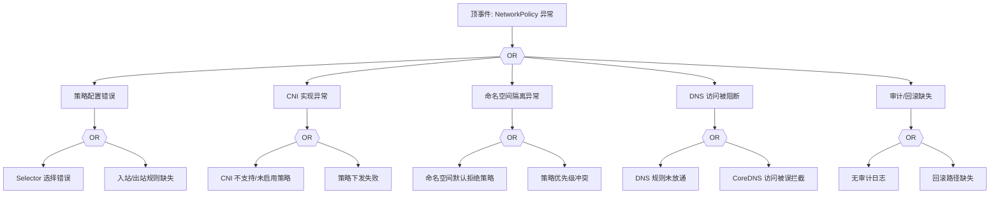

# NetworkPolicy 异常 FTA 树

## 适用范围与说明
- **目标**：覆盖 NetworkPolicy 误拦截、策略冲突与生效异常的关键成因与路径。
- **范围**：策略配置、命名空间隔离、CNI 实现、服务发现与 DNS、审计与回滚。
- **符号**：
  - **OR 门**：任一子事件成立即可触发父事件
  - **AND 门**：所有子事件同时成立才触发父事件

---

## Mermaid FTA 树



---

## 生产级观测与证据
- **事件**：应用连通性下降、DNS 解析失败、特定流量被阻断。
- **关键指标**：策略命中率、丢包率、连接失败率。
- **关键日志**：CNI policy 日志、审计日志、CoreDNS 日志。
- **配置核对**：NetworkPolicy 规则、命名空间默认策略、CNI 策略能力。

---

## JSON 工作流（含与/或门控件）

```json
{
  "flow_steps": [
    { "name": "开始", "action": "start", "step": "start_np_fta", "next_step": "event_np_abnormal" },
    { "name": "顶事件: NetworkPolicy 异常", "action": "event", "step": "event_np_abnormal", "description": "误拦截/策略不生效", "next_step": "gate_root_or" },
    { "name": "根因 OR 门", "action": "gate_or", "step": "gate_root_or", "control": "or_gate", "gate_type": "OR", "next_steps": ["cat_cfg","cat_cni","cat_ns","cat_dns","cat_audit"] }
  ]
}
```

---

## 版本适配（1.19–1.30）
- **1.19–1.23**：部分 CNI 策略能力受限，需在 FTA 中标注实现差异。
- **1.24–1.27**：运行时切换后策略下发/审计链路需校验。
- **1.28–1.30**：稳定 API 为主，策略冲突与审计证据闭环需补全。
- **共性**：遵循 `fta_methodology_and_agentic_practices.md` 中的“版本适配基线”。
