# Node 异常 FTA 树

## 适用范围与说明
- **目标**：覆盖节点不可用/不稳定的关键成因与路径，支撑生产环境的快速定位与自动化处置。
- **范围**：节点状态、kubelet、运行时、系统资源、内核与网络、存储、证书与时间、控制面依赖等。
- **符号**：
  - **OR 门**：任一子事件成立即可触发父事件
  - **AND 门**：所有子事件同时成立才触发父事件

---

## Mermaid FTA 树

```mermaid
flowchart TD
  TE[顶事件: Node异常]
  OR0{{OR}}
  TE --> OR0

  OR0 --> NSTAT[节点状态异常]
  OR0 --> KUBELET[kubelet 异常]
  OR0 --> RT[容器运行时异常]
  OR0 --> RES[资源与容量异常]
  OR0 --> NET[网络与连通性异常]
  OR0 --> STO[本地存储与镜像异常]
  OR0 --> KERNEL[内核与系统异常]
  OR0 --> TIME[时间与证书异常]
  OR0 --> CP[控制面依赖异常]

  NSTAT_OR{{OR}}
  NSTAT --> NSTAT_OR
  NSTAT_OR --> NSTAT1[Node NotReady/Unknown]
  NSTAT_OR --> NSTAT2[节点频繁重启/不可达]
  NSTAT_OR --> NSTAT3[节点被 cordon/驱逐]

  KLET_OR{{OR}}
  KUBELET --> KLET_OR
  KLET_OR --> KLET1[kubelet 服务异常]
  KLET_OR --> KLET2[心跳上报失败]
  KLET_OR --> KLET3[证书/鉴权失败]
  KLET_OR --> KLET4[驱逐策略触发]
  KLET_OR --> KLET5[PLEG 不健康]

  AND_PLEG{{"AND: PLEG 不健康触发 NotReady"}}
  KLET5 --> AND_PLEG
  AND_PLEG --> AND_PLEG1[PLEG relist 超时]
  AND_PLEG --> AND_PLEG2[容器数量过多/运行时慢响应]

  RT_OR{{OR}}
  RT --> RT_OR
  RT_OR --> RT1[containerd/dockerd 异常]
  RT_OR --> RT2[CRI socket 不可用]
  RT_OR --> RT3[镜像仓库/网络异常]
  RT_OR --> RT4[运行时 hang/无响应]

  RES_OR{{OR}}
  RES --> RES_OR
  RES_OR --> RES1[内存压力]
  RES_OR --> RES2[磁盘压力]
  RES_OR --> RES3[CPU 过载]
  RES_OR --> RES4[PID/文件句柄耗尽]

  AND_MEM{{"AND: 内存耗尽驱逐"}}
  RES1 --> AND_MEM
  AND_MEM --> AND_MEM1[节点可用内存低于驱逐阈值]
  AND_MEM --> AND_MEM2[高密度 Pod 部署无 limits 限制]

  NET_OR{{OR}}
  NET --> NET_OR
  NET_OR --> NET1[节点与 API Server 不通]
  NET_OR --> NET2[CNI 组件异常]
  NET_OR --> NET3[路由/iptables/ipvs 异常]
  NET_OR --> NET4[DNS 依赖异常]

  STO_OR{{OR}}
  STO --> STO_OR
  STO_OR --> STO1[镜像磁盘满/GC 失败]
  STO_OR --> STO2[本地卷损坏/只读]
  STO_OR --> STO3[挂载异常]

  KERNEL_OR{{OR}}
  KERNEL --> KERNEL_OR
  KERNEL_OR --> KERNEL1[内核崩溃/恐慌]
  KERNEL_OR --> KERNEL2[驱动/模块异常]
  KERNEL_OR --> KERNEL3[系统日志暴涨]

  TIME_OR{{OR}}
  TIME --> TIME_OR
  TIME_OR --> TIME1[节点证书过期]
  TIME_OR --> TIME2[时间同步失败导致 TLS 失败]

  CP_OR{{OR}}
  CP --> CP_OR
  CP_OR --> CP1[API Server 异常]
  CP_OR --> CP2[网络策略/安全策略阻断]
```



---

## 生产级观测与证据
- **事件**：
  - NodeNotReady / NodeUnreachable
  - NodeHasMemoryPressure / NodeHasDiskPressure / NodeHasPIDPressure
  - Evicted / ContainerGCFailed / ImageGCFailed
  - PLEG is not healthy
- **关键指标**：
  - kube_node_status_condition{condition="Ready"}
  - node_load1 / node_load5 / node_load15
  - node_memory_MemAvailable_bytes / node_memory_MemTotal_bytes
  - node_filesystem_avail_bytes / node_filesystem_size_bytes
  - kubelet_pleg_relist_duration_seconds
  - kubelet_running_pods / kubelet_running_containers
  - container_runtime_operations_errors_total
- **关键日志**：
  - kubelet (journalctl -u kubelet)
  - containerd/CRI-O (journalctl -u containerd)
  - kernel (dmesg, /var/log/kern.log)
  - CNI 插件日志
- **配置核对**：
  - kubelet 参数 (--eviction-hard, --max-pods)
  - 驱逐阈值 (memory.available, nodefs.available, imagefs.available)
  - 证书有效期 (kubeadm certs check-expiration)
  - iptables/ipvs 规则, CNI 配置

---

## JSON 工作流（含与/或门控件）

```json
{
  "flow_steps": [
    { "name": "开始", "action": "start", "step": "start_node_fta", "next_step": "event_node_abnormal" },
    { "name": "顶事件: Node异常", "action": "event", "step": "event_node_abnormal", "description": "Node NotReady/Unknown/频繁重启/不可达", "next_step": "gate_root_or" },
    { "name": "根因 OR 门", "action": "gate_or", "step": "gate_root_or", "control": "or_gate", "gate_type": "OR", "next_steps": ["cat_nstat", "cat_kubelet", "cat_runtime", "cat_resource", "cat_network", "cat_storage", "cat_kernel", "cat_time", "cat_cp"] },

    { "name": "类别: 节点状态异常", "action": "category", "step": "cat_nstat", "next_step": "gate_nstat_or" },
    { "name": "节点状态 OR 门", "action": "gate_or", "step": "gate_nstat_or", "control": "or_gate", "gate_type": "OR", "next_steps": ["evt_notready", "evt_reboot", "evt_cordon"] },
    {
      "name": "底事件: Node NotReady/Unknown", "action": "bottom_event", "step": "evt_notready",
      "description": "节点状态 NotReady 或 Unknown，kubelet 停止上报心跳",
      "metadata": { "severity": "critical", "probability": "medium", "mttr_minutes": 30,
        "detection": { "events": ["NodeNotReady", "NodeUnreachable"], "metrics": ["kube_node_status_condition{condition='Ready',status='false'}"], "logs": ["node not ready", "Lease not renewed"] },
        "remediation": { "manual_steps": ["SSH 到节点检查 kubelet: systemctl status kubelet", "检查 containerd 状态", "检查节点系统资源", "验证节点到 API Server 网络"], "auto_actions": [] } },
      "next_step": "gate_root_or"
    },
    {
      "name": "底事件: 节点频繁重启/不可达", "action": "bottom_event", "step": "evt_reboot",
      "description": "节点操作系统频繁重启或网络间歇性不可达",
      "metadata": { "severity": "critical", "probability": "low", "mttr_minutes": 60,
        "detection": { "events": ["NodeNotReady"], "metrics": ["node_boot_time_seconds"], "logs": ["reboot", "system startup"] },
        "remediation": { "manual_steps": ["检查 dmesg/kern.log 定位重启原因", "检查硬件故障", "检查 OOM Killer 日志", "检查看门狗触发"], "auto_actions": [] } },
      "next_step": "gate_root_or"
    },
    {
      "name": "底事件: 节点被 cordon/驱逐", "action": "bottom_event", "step": "evt_cordon",
      "description": "节点被手动或自动 cordon，不再接受新 Pod",
      "metadata": { "severity": "medium", "probability": "medium", "mttr_minutes": 10,
        "detection": { "events": ["NodeCordon"], "metrics": ["kube_node_spec_unschedulable"], "logs": ["node cordoned"] },
        "remediation": { "manual_steps": ["检查 cordon 原因", "确认维护完成后: kubectl uncordon <node>", "检查自动维护策略"], "auto_actions": [] } },
      "next_step": "gate_root_or"
    },

    { "name": "类别: kubelet 异常", "action": "category", "step": "cat_kubelet", "next_step": "gate_kubelet_or" },
    { "name": "kubelet OR 门", "action": "gate_or", "step": "gate_kubelet_or", "control": "or_gate", "gate_type": "OR", "next_steps": ["evt_kubelet_down", "evt_heartbeat_fail", "evt_kubelet_cert", "evt_eviction", "evt_pleg"] },
    {
      "name": "底事件: kubelet 服务异常", "action": "bottom_event", "step": "evt_kubelet_down",
      "description": "kubelet 进程崩溃、无法启动或 OOM",
      "metadata": { "severity": "critical", "probability": "low", "mttr_minutes": 30,
        "detection": { "events": ["NodeNotReady"], "metrics": [], "logs": ["kubelet: exit", "failed to run Kubelet"] },
        "remediation": { "manual_steps": ["systemctl status kubelet", "journalctl -u kubelet --since '10m ago'", "检查 /var/lib/kubelet/config.yaml", "systemctl restart kubelet"], "auto_actions": [] } },
      "next_step": "gate_root_or"
    },
    {
      "name": "底事件: 心跳上报失败", "action": "bottom_event", "step": "evt_heartbeat_fail",
      "description": "kubelet 无法向 API Server 上报心跳（Lease 更新失败）",
      "metadata": { "severity": "high", "probability": "medium", "mttr_minutes": 20,
        "detection": { "events": ["NodeNotReady"], "metrics": ["kubelet_node_status_update_success_total"], "logs": ["failed to update lease", "unable to update node status"] },
        "remediation": { "manual_steps": ["检查 kubelet 到 API Server 连通性", "检查 API Server 负载和可用性", "验证 kubelet 证书有效"], "auto_actions": [] } },
      "next_step": "gate_root_or"
    },
    {
      "name": "底事件: 证书/鉴权失败", "action": "bottom_event", "step": "evt_kubelet_cert",
      "description": "kubelet 客户端证书过期或 CA 不匹配",
      "metadata": { "severity": "critical", "probability": "low", "mttr_minutes": 45,
        "detection": { "events": ["NodeNotReady"], "metrics": ["kubelet_certificate_manager_client_expiration_renew_errors"], "logs": ["x509: certificate has expired", "certificate signed by unknown authority"] },
        "remediation": { "manual_steps": ["检查证书: openssl x509 -in /var/lib/kubelet/pki/kubelet-client-current.pem -noout -dates", "确认 rotateCertificates: true", "手动续签: kubeadm alpha certs renew"], "auto_actions": [] },
        "version_notes": { "1.19+": "证书自动轮换默认启用" } },
      "next_step": "gate_root_or"
    },
    {
      "name": "底事件: 驱逐策略触发", "action": "bottom_event", "step": "evt_eviction",
      "description": "kubelet 检测到资源压力触发 Pod 驱逐",
      "metadata": { "severity": "high", "probability": "common", "mttr_minutes": 30,
        "detection": { "events": ["Evicted", "NodeHasMemoryPressure", "NodeHasDiskPressure"], "metrics": ["kubelet_eviction_stats_age_seconds"], "logs": ["eviction manager: must evict"] },
        "remediation": { "manual_steps": ["检查驱逐阈值: --eviction-hard", "增加节点资源", "优化 Pod 资源配置", "减少 BestEffort Pod"], "auto_actions": ["cluster-autoscaler 扩容"] } },
      "next_step": "gate_root_or"
    },
    {
      "name": "底事件: PLEG 不健康", "action": "bottom_event", "step": "evt_pleg",
      "description": "PLEG relist 超时导致节点 NotReady",
      "metadata": { "severity": "critical", "probability": "low", "mttr_minutes": 30,
        "detection": { "events": ["NodeNotReady"], "metrics": ["kubelet_pleg_relist_duration_seconds"], "logs": ["PLEG is not healthy"] },
        "remediation": { "manual_steps": ["检查容器运行时响应速度", "减少节点容器数量", "检查是否有容器 hang", "重启 kubelet 或运行时"], "auto_actions": [] } },
      "next_step": "gate_and_pleg"
    },
    {
      "name": "AND 门: PLEG 不健康", "action": "gate_and", "step": "gate_and_pleg", "control": "and_gate", "gate_type": "AND",
      "description": "PLEG relist 超时 + 容器数量过多或运行时慢 = NotReady",
      "conditions": ["PLEG relist 超时", "容器数量过多/运行时慢响应"],
      "combined_severity": "critical",
      "next_steps": ["evt_and_pleg_timeout", "evt_and_pleg_overload"], "next_step": "gate_root_or"
    },
    { "name": "AND 条件1: PLEG relist 超时", "action": "and_condition", "step": "evt_and_pleg_timeout", "description": "PLEG relist 耗时超过 3 分钟阈值", "parent_gate": "gate_and_pleg" },
    { "name": "AND 条件2: 容器过多/运行时慢", "action": "and_condition", "step": "evt_and_pleg_overload", "description": "节点容器密度过高或运行时响应缓慢", "parent_gate": "gate_and_pleg" },

    { "name": "类别: 容器运行时异常", "action": "category", "step": "cat_runtime", "next_step": "gate_runtime_or" },
    { "name": "运行时 OR 门", "action": "gate_or", "step": "gate_runtime_or", "control": "or_gate", "gate_type": "OR", "next_steps": ["evt_rt_down", "evt_cri_sock", "evt_rt_registry", "evt_rt_hang"] },
    {
      "name": "底事件: containerd/dockerd 异常", "action": "bottom_event", "step": "evt_rt_down",
      "description": "容器运行时进程崩溃或退出",
      "metadata": { "severity": "critical", "probability": "rare", "mttr_minutes": 20,
        "detection": { "events": ["NodeNotReady"], "metrics": ["container_runtime_operations_errors_total"], "logs": ["containerd: exit", "runtime not available"] },
        "remediation": { "manual_steps": ["systemctl status containerd", "journalctl -u containerd", "systemctl restart containerd"], "auto_actions": [] },
        "version_notes": { "1.24+": "仅 containerd/CRI-O" } },
      "next_step": "gate_root_or"
    },
    {
      "name": "底事件: CRI socket 不可用", "action": "bottom_event", "step": "evt_cri_sock",
      "description": "CRI socket 文件不存在或无法连接",
      "metadata": { "severity": "critical", "probability": "rare", "mttr_minutes": 15,
        "detection": { "events": [], "metrics": [], "logs": ["failed to connect to CRI socket"] },
        "remediation": { "manual_steps": ["检查 socket: ls -la /run/containerd/containerd.sock", "确认 kubelet --container-runtime-endpoint", "重启运行时"], "auto_actions": [] } },
      "next_step": "gate_root_or"
    },
    {
      "name": "底事件: 镜像仓库/网络异常", "action": "bottom_event", "step": "evt_rt_registry",
      "description": "节点无法连接镜像仓库",
      "metadata": { "severity": "high", "probability": "medium", "mttr_minutes": 30,
        "detection": { "events": ["ErrImagePull"], "metrics": [], "logs": ["dial tcp", "timeout"] },
        "remediation": { "manual_steps": ["检查节点到仓库网络", "检查代理配置", "验证 DNS 解析"], "auto_actions": [] } },
      "next_step": "gate_root_or"
    },
    {
      "name": "底事件: 运行时 hang/无响应", "action": "bottom_event", "step": "evt_rt_hang",
      "description": "容器运行时进程 hang 住不处理请求",
      "metadata": { "severity": "critical", "probability": "rare", "mttr_minutes": 15,
        "detection": { "events": ["NodeNotReady"], "metrics": ["container_runtime_operations_duration_seconds"], "logs": ["timeout waiting for runtime"] },
        "remediation": { "manual_steps": ["crictl ps 测试运行时", "强制重启运行时", "检查 D 状态进程"], "auto_actions": [] } },
      "next_step": "gate_root_or"
    },

    { "name": "类别: 资源与容量异常", "action": "category", "step": "cat_resource", "next_step": "gate_resource_or" },
    { "name": "资源 OR 门", "action": "gate_or", "step": "gate_resource_or", "control": "or_gate", "gate_type": "OR", "next_steps": ["evt_mem_pressure", "evt_disk_pressure", "evt_cpu_overload", "evt_pid_exhaust", "gate_and_mem"] },
    {
      "name": "底事件: 内存压力", "action": "bottom_event", "step": "evt_mem_pressure",
      "description": "节点可用内存低于驱逐阈值",
      "metadata": { "severity": "high", "probability": "common", "mttr_minutes": 30,
        "detection": { "events": ["NodeHasMemoryPressure", "Evicted"], "metrics": ["node_memory_MemAvailable_bytes"], "logs": ["memory pressure"] },
        "remediation": { "manual_steps": ["free -h 检查内存", "kubectl top pod 定位高内存 Pod", "调整驱逐阈值或扩容"], "auto_actions": ["cluster-autoscaler 扩容"] } },
      "next_step": "gate_root_or"
    },
    {
      "name": "底事件: 磁盘压力", "action": "bottom_event", "step": "evt_disk_pressure",
      "description": "节点磁盘使用超过驱逐阈值",
      "metadata": { "severity": "high", "probability": "common", "mttr_minutes": 30,
        "detection": { "events": ["NodeHasDiskPressure"], "metrics": ["node_filesystem_avail_bytes"], "logs": ["disk pressure", "no space left"] },
        "remediation": { "manual_steps": ["df -h 检查磁盘", "crictl rmi --prune 清理镜像", "清理日志/临时文件", "增加磁盘"], "auto_actions": [] } },
      "next_step": "gate_root_or"
    },
    {
      "name": "底事件: CPU 过载", "action": "bottom_event", "step": "evt_cpu_overload",
      "description": "节点 CPU 持续高负载影响系统响应",
      "metadata": { "severity": "medium", "probability": "medium", "mttr_minutes": 30,
        "detection": { "events": [], "metrics": ["node_load1", "node_cpu_seconds_total{mode='idle'}"], "logs": [] },
        "remediation": { "manual_steps": ["kubectl top pod 检查", "top/htop 检查系统进程", "扩容或迁移负载"], "auto_actions": [] } },
      "next_step": "gate_root_or"
    },
    {
      "name": "底事件: PID/文件句柄耗尽", "action": "bottom_event", "step": "evt_pid_exhaust",
      "description": "节点 PID 或文件句柄耗尽",
      "metadata": { "severity": "critical", "probability": "low", "mttr_minutes": 30,
        "detection": { "events": ["NodeHasPIDPressure"], "metrics": ["node_filefd_allocated"], "logs": ["cannot allocate memory", "too many open files"] },
        "remediation": { "manual_steps": ["检查 PID: cat /proc/sys/kernel/pid_max", "增加上限: sysctl -w kernel.pid_max=", "检查 ulimit -n", "定位泄漏进程"], "auto_actions": [] } },
      "next_step": "gate_root_or"
    },
    {
      "name": "AND 门: 内存耗尽驱逐", "action": "gate_and", "step": "gate_and_mem", "control": "and_gate", "gate_type": "AND",
      "description": "可用内存低于阈值 + 高密度 Pod 无 limits = 大规模驱逐",
      "conditions": ["节点可用内存低于驱逐阈值", "高密度 Pod 无 limits"],
      "combined_severity": "critical",
      "next_steps": ["evt_and_mem_low", "evt_and_mem_nolimit"], "next_step": "gate_root_or"
    },
    { "name": "AND 条件1: 内存低于阈值", "action": "and_condition", "step": "evt_and_mem_low", "description": "MemAvailable 低于 eviction-hard 阈值(默认100Mi)", "parent_gate": "gate_and_mem" },
    { "name": "AND 条件2: Pod 无 limits", "action": "and_condition", "step": "evt_and_mem_nolimit", "description": "大量 BestEffort Pod 未设 memory limits", "parent_gate": "gate_and_mem" },

    { "name": "类别: 网络与连通性异常", "action": "category", "step": "cat_network", "next_step": "gate_network_or" },
    { "name": "网络 OR 门", "action": "gate_or", "step": "gate_network_or", "control": "or_gate", "gate_type": "OR", "next_steps": ["evt_api_unreachable", "evt_cni_fail", "evt_route_fail", "evt_dns_fail"] },
    {
      "name": "底事件: 节点与 API Server 不通", "action": "bottom_event", "step": "evt_api_unreachable",
      "description": "节点无法访问 API Server",
      "metadata": { "severity": "critical", "probability": "low", "mttr_minutes": 30,
        "detection": { "events": ["NodeNotReady"], "metrics": [], "logs": ["Unable to connect to the server", "connection refused"] },
        "remediation": { "manual_steps": ["telnet <apiserver-ip> 6443", "检查安全组/防火墙", "检查 kube-proxy", "验证 API Server 健康"], "auto_actions": [] } },
      "next_step": "gate_root_or"
    },
    {
      "name": "底事件: CNI 组件异常", "action": "bottom_event", "step": "evt_cni_fail",
      "description": "CNI 插件异常导致 Pod 网络不可用",
      "metadata": { "severity": "high", "probability": "low", "mttr_minutes": 30,
        "detection": { "events": ["NetworkNotReady", "FailedCreatePodSandBox"], "metrics": [], "logs": ["cni plugin not initialized"] },
        "remediation": { "manual_steps": ["检查 CNI DaemonSet 状态", "验证 /etc/cni/net.d/", "检查 CNI 日志", "重启 CNI Pod"], "auto_actions": [] } },
      "next_step": "gate_root_or"
    },
    {
      "name": "底事件: 路由/iptables/ipvs 异常", "action": "bottom_event", "step": "evt_route_fail",
      "description": "节点路由表或 iptables/ipvs 规则异常",
      "metadata": { "severity": "high", "probability": "low", "mttr_minutes": 30,
        "detection": { "events": [], "metrics": [], "logs": ["iptables: ", "IPVS: "] },
        "remediation": { "manual_steps": ["ip route show", "iptables -L -n -t nat", "检查 kube-proxy 状态", "重启 kube-proxy"], "auto_actions": [] } },
      "next_step": "gate_root_or"
    },
    {
      "name": "底事件: DNS 依赖异常", "action": "bottom_event", "step": "evt_dns_fail",
      "description": "节点 DNS 解析异常",
      "metadata": { "severity": "medium", "probability": "medium", "mttr_minutes": 15,
        "detection": { "events": [], "metrics": [], "logs": ["dns lookup failed"] },
        "remediation": { "manual_steps": ["检查 /etc/resolv.conf", "验证 CoreDNS 可达", "检查节点 DNS 缓存"], "auto_actions": [] } },
      "next_step": "gate_root_or"
    },

    { "name": "类别: 本地存储与镜像异常", "action": "category", "step": "cat_storage", "next_step": "gate_storage_or" },
    { "name": "存储 OR 门", "action": "gate_or", "step": "gate_storage_or", "control": "or_gate", "gate_type": "OR", "next_steps": ["evt_image_gc_fail", "evt_local_volume_fail", "evt_mount_fail"] },
    {
      "name": "底事件: 镜像磁盘满/GC 失败", "action": "bottom_event", "step": "evt_image_gc_fail",
      "description": "镜像磁盘空间耗尽，GC 无法释放",
      "metadata": { "severity": "high", "probability": "medium", "mttr_minutes": 30,
        "detection": { "events": ["ImageGCFailed", "NodeHasDiskPressure"], "metrics": ["kubelet_eviction_stats_age_seconds{eviction_signal='imagefs.available'}"], "logs": ["image garbage collection failed"] },
        "remediation": { "manual_steps": ["crictl rmi --prune", "检查 --image-gc-high-threshold", "增加 imagefs 磁盘"], "auto_actions": [] } },
      "next_step": "gate_root_or"
    },
    {
      "name": "底事件: 本地卷损坏/只读", "action": "bottom_event", "step": "evt_local_volume_fail",
      "description": "本地文件系统损坏或只读",
      "metadata": { "severity": "high", "probability": "low", "mttr_minutes": 60,
        "detection": { "events": ["FailedMount"], "metrics": [], "logs": ["read-only file system", "EXT4-fs error"] },
        "remediation": { "manual_steps": ["mount | grep ro", "fsck 修复", "更换故障磁盘"], "auto_actions": [] } },
      "next_step": "gate_root_or"
    },
    {
      "name": "底事件: 挂载异常", "action": "bottom_event", "step": "evt_mount_fail",
      "description": "节点上卷挂载操作失败",
      "metadata": { "severity": "medium", "probability": "low", "mttr_minutes": 30,
        "detection": { "events": ["FailedMount"], "metrics": [], "logs": ["mount failed"] },
        "remediation": { "manual_steps": ["检查挂载工具", "验证存储后端连通性", "检查 CSI node plugin"], "auto_actions": [] } },
      "next_step": "gate_root_or"
    },

    { "name": "类别: 内核与系统异常", "action": "category", "step": "cat_kernel", "next_step": "gate_kernel_or" },
    { "name": "内核 OR 门", "action": "gate_or", "step": "gate_kernel_or", "control": "or_gate", "gate_type": "OR", "next_steps": ["evt_kernel_panic", "evt_driver_issue", "evt_log_flood"] },
    {
      "name": "底事件: 内核崩溃/恐慌", "action": "bottom_event", "step": "evt_kernel_panic",
      "description": "内核 panic 导致节点宕机重启",
      "metadata": { "severity": "critical", "probability": "rare", "mttr_minutes": 60,
        "detection": { "events": ["NodeNotReady"], "metrics": ["node_boot_time_seconds"], "logs": ["Kernel panic", "BUG:"] },
        "remediation": { "manual_steps": ["检查 dmesg 和 kern.log", "分析 crash dump", "更新内核", "检查硬件"], "auto_actions": [] } },
      "next_step": "gate_root_or"
    },
    {
      "name": "底事件: 驱动/模块异常", "action": "bottom_event", "step": "evt_driver_issue",
      "description": "内核模块加载失败或驱动不兼容",
      "metadata": { "severity": "high", "probability": "low", "mttr_minutes": 45,
        "detection": { "events": [], "metrics": [], "logs": ["module load failed", "driver error"] },
        "remediation": { "manual_steps": ["lsmod 检查", "dmesg | grep error", "modprobe 重载", "更新驱动"], "auto_actions": [] } },
      "next_step": "gate_root_or"
    },
    {
      "name": "底事件: 系统日志暴涨", "action": "bottom_event", "step": "evt_log_flood",
      "description": "日志产生过快消耗磁盘和 IO",
      "metadata": { "severity": "medium", "probability": "medium", "mttr_minutes": 20,
        "detection": { "events": [], "metrics": ["node_filesystem_avail_bytes{mountpoint='/var/log'}"], "logs": [] },
        "remediation": { "manual_steps": ["du -sh /var/log/*", "配置 logrotate", "定位高频日志源", "配置 journald SystemMaxUse"], "auto_actions": [] } },
      "next_step": "gate_root_or"
    },

    { "name": "类别: 时间与证书异常", "action": "category", "step": "cat_time", "next_step": "gate_time_or" },
    { "name": "时间/证书 OR 门", "action": "gate_or", "step": "gate_time_or", "control": "or_gate", "gate_type": "OR", "next_steps": ["evt_node_cert_expire", "evt_time_skew_tls"] },
    {
      "name": "底事件: 节点证书过期", "action": "bottom_event", "step": "evt_node_cert_expire",
      "description": "kubelet 证书过期",
      "metadata": { "severity": "critical", "probability": "low", "mttr_minutes": 45,
        "detection": { "events": ["NodeNotReady"], "metrics": ["kubelet_certificate_manager_client_expiration_renew_errors"], "logs": ["x509: certificate has expired"] },
        "remediation": { "manual_steps": ["openssl x509 检查证书日期", "启用 rotateCertificates", "手动续签并重启 kubelet"], "auto_actions": [] } },
      "next_step": "gate_root_or"
    },
    {
      "name": "底事件: 时间同步失败 TLS 失败", "action": "bottom_event", "step": "evt_time_skew_tls",
      "description": "NTP 同步失败导致时钟偏差和 TLS 验证失败",
      "metadata": { "severity": "high", "probability": "low", "mttr_minutes": 15,
        "detection": { "events": [], "metrics": ["node_timex_offset_seconds"], "logs": ["clock skew"] },
        "remediation": { "manual_steps": ["timedatectl status", "ntpdate 手动同步", "确认 chrony/ntpd 正常"], "auto_actions": [] } },
      "next_step": "gate_root_or"
    },

    { "name": "类别: 控制面依赖异常", "action": "category", "step": "cat_cp", "next_step": "gate_cp_or" },
    { "name": "控制面 OR 门", "action": "gate_or", "step": "gate_cp_or", "control": "or_gate", "gate_type": "OR", "next_steps": ["evt_apiserver_fail", "evt_policy_block"] },
    {
      "name": "底事件: API Server 异常", "action": "bottom_event", "step": "evt_apiserver_fail",
      "description": "API Server 不可用影响节点状态同步",
      "metadata": { "severity": "critical", "probability": "rare", "mttr_minutes": 30,
        "detection": { "events": [], "metrics": ["up{job='kubernetes-apiservers'}"], "logs": ["connection refused"] },
        "remediation": { "manual_steps": ["检查 API Server 状态", "验证 etcd 连接性", "检查 API Server 证书"], "auto_actions": [] } },
      "next_step": "gate_root_or"
    },
    {
      "name": "底事件: 网络/安全策略阻断", "action": "bottom_event", "step": "evt_policy_block",
      "description": "安全组/NetworkPolicy 阻断节点到控制面通信",
      "metadata": { "severity": "high", "probability": "low", "mttr_minutes": 20,
        "detection": { "events": ["NodeNotReady"], "metrics": [], "logs": ["connection timed out"] },
        "remediation": { "manual_steps": ["检查安全组允许 6443", "检查 NetworkPolicy", "验证防火墙"], "auto_actions": [] } },
      "next_step": "gate_root_or"
    },

    { "name": "结束", "action": "end", "step": "end_node_fta" }
  ]
}
```

---

## 版本适配说明 (K8s 1.19-1.30)

| 版本范围 | 关键变更 | 节点影响 |
|---------|---------|---------|
| 1.19-1.23 | dockershim 仍存在, 证书轮换默认启用 | 同时覆盖 dockerd/containerd 日志 |
| 1.24 | 移除 dockershim | 运行时诊断路径更新为 CRI |
| 1.25-1.27 | kubelet 废弃 flag 清理 | 检查 kubelet 配置兼容性 |
| 1.28+ | kubelet 版本偏差 N-3 | 降低节点升级紧迫度 |
| 1.29-1.30 | 持续 API 清理 | 关注 kubelet feature gate 变化 |
