# Node 异常 FTA 树

## 适用范围与说明
- **目标**：覆盖节点不可用/不稳定的关键成因与路径，支撑生产环境的快速定位与自动化处置。
- **范围**：节点状态、kubelet、运行时、系统资源、内核与网络、存储、证书与时间、控制面依赖等。
- **符号**：
  - **OR 门**：任一子事件成立即可触发父事件
  - **AND 门**：所有子事件同时成立才触发父事件

---

## Mermaid FTA 树

```mermaid
flowchart TD
  TE[顶事件: Node异常]
  OR0{{OR}}
  TE --> OR0

  OR0 --> NSTAT[节点状态异常]
  OR0 --> KUBELET[kubelet 异常]
  OR0 --> RT[容器运行时异常]
  OR0 --> RES[资源与容量异常]
  OR0 --> NET[网络与连通性异常]
  OR0 --> STO[本地存储与镜像异常]
  OR0 --> KERNEL[内核与系统异常]
  OR0 --> TIME[时间与证书异常]
  OR0 --> CP[控制面依赖异常]

  NSTAT_OR{{OR}}
  NSTAT --> NSTAT_OR
  NSTAT_OR --> NSTAT1[Node NotReady/Unknown]
  NSTAT_OR --> NSTAT2[节点频繁重启/不可达]
  NSTAT_OR --> NSTAT3[节点被 cordon/驱逐]

  KLET_OR{{OR}}
  KUBELET --> KLET_OR
  KLET_OR --> KLET1[kubelet 服务异常]
  KLET_OR --> KLET2[心跳上报失败]
  KLET_OR --> KLET3[证书/鉴权失败]
  KLET_OR --> KLET4[驱逐策略触发]

  RT_OR{{OR}}
  RT --> RT_OR
  RT_OR --> RT1[containerd/dockerd 异常]
  RT_OR --> RT2[CRI socket 不可用]
  RT_OR --> RT3[镜像仓库/网络异常]

  RES_OR{{OR}}
  RES --> RES_OR
  RES_OR --> RES1[内存压力]
  RES_OR --> RES2[磁盘压力]
  RES_OR --> RES3[CPU 过载]
  RES_OR --> RES4[PID/文件句柄耗尽]

  NET_OR{{OR}}
  NET --> NET_OR
  NET_OR --> NET1[节点与 API Server 不通]
  NET_OR --> NET2[CNI 组件异常]
  NET_OR --> NET3[路由/iptables/ipvs 异常]
  NET_OR --> NET4[DNS 依赖异常]

  STO_OR{{OR}}
  STO --> STO_OR
  STO_OR --> STO1[镜像磁盘满/GC 失败]
  STO_OR --> STO2[本地卷损坏/只读]
  STO_OR --> STO3[挂载异常]

  KERNEL_OR{{OR}}
  KERNEL --> KERNEL_OR
  KERNEL_OR --> KERNEL1[内核崩溃/恐慌]
  KERNEL_OR --> KERNEL2[驱动/模块异常]
  KERNEL_OR --> KERNEL3[系统日志暴涨]

  TIME_OR{{OR}}
  TIME --> TIME_OR
  TIME_OR --> TIME1[节点证书过期]
  TIME_OR --> TIME2[时间同步失败导致 TLS 失败]

  CP_OR{{OR}}
  CP --> CP_OR
  CP_OR --> CP1[API Server 异常]
  CP_OR --> CP2[网络策略/安全策略阻断]
```



---

## 生产级观测与证据
- **事件**：`NodeNotReady`、`NodeUnreachable`、`NodeHasMemoryPressure`、`NodeHasDiskPressure`、`NodeHasPIDPressure`。
- **关键指标**：`kube_node_status_condition`、`node_load1`、`node_memory_MemAvailable_bytes`、`node_filesystem_avail_bytes`、`node_cpu_seconds_total`、`container_runtime_operations_errors_total`。
- **关键日志**：`kubelet`、`containerd`/`dockerd`、`kernel`、`cni`、`systemd`。
- **配置核对**：`kubelet` 参数、驱逐阈值、证书有效期、`iptables/ipvs` 规则、CNI 配置。

---

## JSON 工作流（含与/或门控件）

```json
{
  "flow_steps": [
    { "name": "开始", "action": "start", "step": "start_node_fta", "next_step": "event_node_abnormal" },
    { "name": "顶事件: Node异常", "action": "event", "step": "event_node_abnormal", "description": "Node NotReady/Unknown/频繁重启", "next_step": "gate_root_or" },
    { "name": "根因 OR 门", "action": "gate_or", "step": "gate_root_or", "control": "or_gate", "gate_type": "OR", "next_steps": ["cat_nstat","cat_kubelet","cat_runtime","cat_resource","cat_network","cat_storage","cat_kernel","cat_time","cat_cp"] },

    { "name": "节点状态异常", "action": "event", "step": "cat_nstat", "next_step": "gate_nstat_or" },
    { "name": "节点状态 OR 门", "action": "gate_or", "step": "gate_nstat_or", "control": "or_gate", "gate_type": "OR", "next_steps": ["evt_notready","evt_reboot","evt_cordon"] },
    { "name": "Node NotReady/Unknown", "action": "event", "step": "evt_notready" },
    { "name": "节点频繁重启/不可达", "action": "event", "step": "evt_reboot" },
    { "name": "节点被 cordon/驱逐", "action": "event", "step": "evt_cordon" },

    { "name": "kubelet 异常", "action": "event", "step": "cat_kubelet", "next_step": "gate_kubelet_or" },
    { "name": "kubelet OR 门", "action": "gate_or", "step": "gate_kubelet_or", "control": "or_gate", "gate_type": "OR", "next_steps": ["evt_kubelet_down","evt_heartbeat_fail","evt_kubelet_cert","evt_eviction"] },
    { "name": "kubelet 服务异常", "action": "event", "step": "evt_kubelet_down" },
    { "name": "心跳上报失败", "action": "event", "step": "evt_heartbeat_fail" },
    { "name": "证书/鉴权失败", "action": "event", "step": "evt_kubelet_cert" },
    { "name": "驱逐策略触发", "action": "event", "step": "evt_eviction" },

    { "name": "运行时异常", "action": "event", "step": "cat_runtime", "next_step": "gate_runtime_or" },
    { "name": "运行时 OR 门", "action": "gate_or", "step": "gate_runtime_or", "control": "or_gate", "gate_type": "OR", "next_steps": ["evt_rt_down","evt_cri_sock","evt_rt_registry"] },
    { "name": "containerd/dockerd 异常", "action": "event", "step": "evt_rt_down" },
    { "name": "CRI socket 不可用", "action": "event", "step": "evt_cri_sock" },
    { "name": "镜像仓库/网络异常", "action": "event", "step": "evt_rt_registry" },

    { "name": "资源与容量异常", "action": "event", "step": "cat_resource", "next_step": "gate_resource_or" },
    { "name": "资源 OR 门", "action": "gate_or", "step": "gate_resource_or", "control": "or_gate", "gate_type": "OR", "next_steps": ["evt_mem_pressure","evt_disk_pressure","evt_cpu_overload","evt_pid_exhaust"] },
    { "name": "内存压力", "action": "event", "step": "evt_mem_pressure" },
    { "name": "磁盘压力", "action": "event", "step": "evt_disk_pressure" },
    { "name": "CPU 过载", "action": "event", "step": "evt_cpu_overload" },
    { "name": "PID/句柄耗尽", "action": "event", "step": "evt_pid_exhaust" },

    { "name": "网络与连通性异常", "action": "event", "step": "cat_network", "next_step": "gate_network_or" },
    { "name": "网络 OR 门", "action": "gate_or", "step": "gate_network_or", "control": "or_gate", "gate_type": "OR", "next_steps": ["evt_api_unreachable","evt_cni_fail","evt_route_fail","evt_dns_fail"] },
    { "name": "节点与 API Server 不通", "action": "event", "step": "evt_api_unreachable" },
    { "name": "CNI 组件异常", "action": "event", "step": "evt_cni_fail" },
    { "name": "路由/iptables/ipvs 异常", "action": "event", "step": "evt_route_fail" },
    { "name": "DNS 依赖异常", "action": "event", "step": "evt_dns_fail" },

    { "name": "本地存储与镜像异常", "action": "event", "step": "cat_storage", "next_step": "gate_storage_or" },
    { "name": "存储 OR 门", "action": "gate_or", "step": "gate_storage_or", "control": "or_gate", "gate_type": "OR", "next_steps": ["evt_image_gc_fail","evt_local_volume_fail","evt_mount_fail"] },
    { "name": "镜像磁盘满/GC 失败", "action": "event", "step": "evt_image_gc_fail" },
    { "name": "本地卷损坏/只读", "action": "event", "step": "evt_local_volume_fail" },
    { "name": "挂载异常", "action": "event", "step": "evt_mount_fail" },

    { "name": "内核与系统异常", "action": "event", "step": "cat_kernel", "next_step": "gate_kernel_or" },
    { "name": "内核 OR 门", "action": "gate_or", "step": "gate_kernel_or", "control": "or_gate", "gate_type": "OR", "next_steps": ["evt_kernel_panic","evt_driver_issue","evt_log_flood"] },
    { "name": "内核崩溃/恐慌", "action": "event", "step": "evt_kernel_panic" },
    { "name": "驱动/模块异常", "action": "event", "step": "evt_driver_issue" },
    { "name": "系统日志暴涨", "action": "event", "step": "evt_log_flood" },

    { "name": "时间与证书异常", "action": "event", "step": "cat_time", "next_step": "gate_time_or" },
    { "name": "时间/证书 OR 门", "action": "gate_or", "step": "gate_time_or", "control": "or_gate", "gate_type": "OR", "next_steps": ["evt_node_cert_expire","evt_time_skew_tls"] },
    { "name": "节点证书过期", "action": "event", "step": "evt_node_cert_expire" },
    { "name": "时间同步失败 TLS 失败", "action": "event", "step": "evt_time_skew_tls" },

    { "name": "控制面依赖异常", "action": "event", "step": "cat_cp", "next_step": "gate_cp_or" },
    { "name": "控制面 OR 门", "action": "gate_or", "step": "gate_cp_or", "control": "or_gate", "gate_type": "OR", "next_steps": ["evt_apiserver_fail","evt_policy_block"] },
    { "name": "API Server 异常", "action": "event", "step": "evt_apiserver_fail" },
    { "name": "网络/安全策略阻断", "action": "event", "step": "evt_policy_block" },

    { "name": "结束", "action": "end", "step": "end_node_fta" }
  ]
}
```
