# NodePool 异常 FTA 树

## 适用范围与说明
- **目标**：覆盖节点池扩缩容、生命周期与可用性异常的关键成因与路径。
- **范围**：容量管理、自动扩缩容、调度与标签、节点初始化、镜像与运行时、网络与安全策略、控制面依赖。
- **符号**：
  - **OR 门**：任一子事件成立即可触发父事件
  - **AND 门**：所有子事件同时成立才触发父事件

---

## Mermaid FTA 树

```mermaid
flowchart TD
  TE[顶事件: NodePool异常]
  OR0{{OR}}
  TE --> OR0

  OR0 --> CAP[容量与扩缩容异常]
  OR0 --> INIT[节点初始化异常]
  OR0 --> SCH[调度与标签异常]
  OR0 --> IMG[镜像与运行时异常]
  OR0 --> NET[网络与安全异常]
  OR0 --> COST[配额与成本策略异常]
  OR0 --> CP[控制面/云平台依赖异常]

  CAP_OR{{OR}}
  CAP --> CAP_OR
  CAP_OR --> CAP1[扩容失败/超时]
  CAP_OR --> CAP2[缩容误判/过度缩容]
  CAP_OR --> CAP3[容量不足/上限限制]

  INIT_OR{{OR}}
  INIT --> INIT_OR
  INIT_OR --> INIT1[节点加入集群失败]
  INIT_OR --> INIT2[引导脚本/云初始化失败]
  INIT_OR --> INIT3[节点池版本/镜像不一致]

  SCH_OR{{OR}}
  SCH --> SCH_OR
  SCH_OR --> SCH1[标签/污点策略错误]
  SCH_OR --> SCH2[拓扑约束冲突]
  SCH_OR --> SCH3[亲和/反亲和策略不合理]

  IMG_OR{{OR}}
  IMG --> IMG_OR
  IMG_OR --> IMG1[运行时/CRI 异常]
  IMG_OR --> IMG2[基础镜像损坏/不可用]
  IMG_OR --> IMG3[镜像仓库限流]

  NET_OR{{OR}}
  NET --> NET_OR
  NET_OR --> NET1[CNI/ENI 配额不足]
  NET_OR --> NET2[安全组/ACL 阻断]
  NET_OR --> NET3[IP 地址池耗尽]

  COST_OR{{OR}}
  COST --> COST_OR
  COST_OR --> COST1[云资源配额不足]
  COST_OR --> COST2[实例规格不可用]

  CP_OR{{OR}}
  CP --> CP_OR
  CP_OR --> CP1[API Server/控制面异常]
  CP_OR --> CP2[云平台 API 失败]
```



---

## 生产级观测与证据
- **事件**：扩容失败、节点池处于 `Degraded`/`Updating` 状态、节点加入失败。
- **关键指标**：节点池期望与实际节点数差异、扩容耗时、失败率、IP/ENI 使用率。
- **关键日志**：`cluster-autoscaler`、云平台伸缩日志、`kubelet`。
- **配置核对**：节点池规格、标签/污点、伸缩上下限、引导脚本、镜像版本。

---

## JSON 工作流（含与/或门控件）

```json
{
  "flow_steps": [
    { "name": "开始", "action": "start", "step": "start_nodepool_fta", "next_step": "event_nodepool_abnormal" },
    { "name": "顶事件: NodePool异常", "action": "event", "step": "event_nodepool_abnormal", "description": "扩缩容异常/节点池不可用", "next_step": "gate_root_or" },
    { "name": "根因 OR 门", "action": "gate_or", "step": "gate_root_or", "control": "or_gate", "gate_type": "OR", "next_steps": ["cat_capacity","cat_init","cat_schedule","cat_image","cat_network","cat_cost","cat_cp"] },

    { "name": "容量与扩缩容异常", "action": "event", "step": "cat_capacity", "next_step": "gate_capacity_or" },
    { "name": "容量 OR 门", "action": "gate_or", "step": "gate_capacity_or", "control": "or_gate", "gate_type": "OR", "next_steps": ["evt_scale_fail","evt_scale_down_bad","evt_capacity_limit"] },
    { "name": "扩容失败/超时", "action": "event", "step": "evt_scale_fail" },
    { "name": "缩容误判/过度缩容", "action": "event", "step": "evt_scale_down_bad" },
    { "name": "容量不足/上限限制", "action": "event", "step": "evt_capacity_limit" },

    { "name": "节点初始化异常", "action": "event", "step": "cat_init", "next_step": "gate_init_or" },
    { "name": "初始化 OR 门", "action": "gate_or", "step": "gate_init_or", "control": "or_gate", "gate_type": "OR", "next_steps": ["evt_join_fail","evt_cloud_init_fail","evt_version_mismatch"] },
    { "name": "节点加入集群失败", "action": "event", "step": "evt_join_fail" },
    { "name": "引导脚本/云初始化失败", "action": "event", "step": "evt_cloud_init_fail" },
    { "name": "节点池版本/镜像不一致", "action": "event", "step": "evt_version_mismatch" },

    { "name": "调度与标签异常", "action": "event", "step": "cat_schedule", "next_step": "gate_schedule_or" },
    { "name": "调度 OR 门", "action": "gate_or", "step": "gate_schedule_or", "control": "or_gate", "gate_type": "OR", "next_steps": ["evt_taint_bad","evt_topology_conflict","evt_affinity_bad"] },
    { "name": "标签/污点策略错误", "action": "event", "step": "evt_taint_bad" },
    { "name": "拓扑约束冲突", "action": "event", "step": "evt_topology_conflict" },
    { "name": "亲和/反亲和策略不合理", "action": "event", "step": "evt_affinity_bad" },

    { "name": "镜像与运行时异常", "action": "event", "step": "cat_image", "next_step": "gate_image_or" },
    { "name": "镜像 OR 门", "action": "gate_or", "step": "gate_image_or", "control": "or_gate", "gate_type": "OR", "next_steps": ["evt_runtime_fail","evt_base_image_bad","evt_registry_limit"] },
    { "name": "运行时/CRI 异常", "action": "event", "step": "evt_runtime_fail" },
    { "name": "基础镜像损坏/不可用", "action": "event", "step": "evt_base_image_bad" },
    { "name": "镜像仓库限流", "action": "event", "step": "evt_registry_limit" },

    { "name": "网络与安全异常", "action": "event", "step": "cat_network", "next_step": "gate_network_or" },
    { "name": "网络 OR 门", "action": "gate_or", "step": "gate_network_or", "control": "or_gate", "gate_type": "OR", "next_steps": ["evt_eni_quota","evt_sg_block","evt_ip_exhaust"] },
    { "name": "CNI/ENI 配额不足", "action": "event", "step": "evt_eni_quota" },
    { "name": "安全组/ACL 阻断", "action": "event", "step": "evt_sg_block" },
    { "name": "IP 地址池耗尽", "action": "event", "step": "evt_ip_exhaust" },

    { "name": "配额与成本策略异常", "action": "event", "step": "cat_cost", "next_step": "gate_cost_or" },
    { "name": "成本 OR 门", "action": "gate_or", "step": "gate_cost_or", "control": "or_gate", "gate_type": "OR", "next_steps": ["evt_cloud_quota","evt_instance_unavailable"] },
    { "name": "云资源配额不足", "action": "event", "step": "evt_cloud_quota" },
    { "name": "实例规格不可用", "action": "event", "step": "evt_instance_unavailable" },

    { "name": "控制面/云平台依赖异常", "action": "event", "step": "cat_cp", "next_step": "gate_cp_or" },
    { "name": "控制面 OR 门", "action": "gate_or", "step": "gate_cp_or", "control": "or_gate", "gate_type": "OR", "next_steps": ["evt_cp_fail","evt_cloud_api_fail"] },
    { "name": "API Server/控制面异常", "action": "event", "step": "evt_cp_fail" },
    { "name": "云平台 API 失败", "action": "event", "step": "evt_cloud_api_fail" },

    { "name": "结束", "action": "end", "step": "end_nodepool_fta" }
  ]
}
```

---

## 版本适配（1.19–1.30）
- **1.19–1.23**：节点池镜像与引导脚本需覆盖 `dockerd` 兼容路径；CNI/ENI 配额能力差异需标注。
- **1.24–1.27**：运行时切换后初始化脚本、镜像与 CRI 版本需同步升级。
- **1.28–1.30**：稳定 API 为主，云平台伸缩 API 与审计链路需一致。
- **共性**：遵循 `fta_methodology_and_agentic_practices.md` 中的“版本适配基线”。
