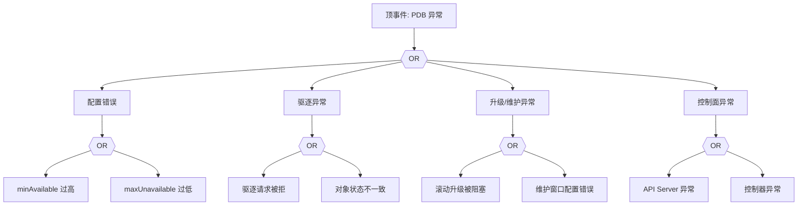

# PDB 异常 FTA 树

## 适用范围与说明
- **目标**：覆盖 PDB 阻塞驱逐、配置错误与升级失败的关键成因与路径。
- **范围**：PDB 配置、驱逐控制器、滚动升级与维护窗口、控制面依赖。
- **符号**：
  - **OR 门**：任一子事件成立即可触发父事件
  - **AND 门**：所有子事件同时成立才触发父事件

---

## Mermaid FTA 树



---

## 生产级观测与证据
- **事件**：驱逐失败、升级阻塞。
- **关键指标**：PDB 允许驱逐数、不可用副本数。
- **关键日志**：控制器日志、`apiserver` 审计日志。
- **配置核对**：PDB 配置、部署策略、维护窗口。

---

## JSON 工作流（含与/或门控件）

```json
{
  "flow_steps": [
    { "name": "开始", "action": "start", "step": "start_pdb_fta", "next_step": "event_pdb_abnormal" },
    { "name": "顶事件: PDB 异常", "action": "event", "step": "event_pdb_abnormal", "description": "驱逐阻塞/升级失败", "next_step": "gate_root_or" },
    { "name": "根因 OR 门", "action": "gate_or", "step": "gate_root_or", "control": "or_gate", "gate_type": "OR", "next_steps": ["cat_conf","cat_evict","cat_up","cat_ctrl"] }
  ]
}
```

---

## 版本适配（1.19–1.30）
- **1.19–1.23**：PDB API 版本与控制器需对齐。
- **1.24–1.27**：驱逐策略与升级控制需结合 PSA/OPA 影响。
- **1.28–1.30**：稳定 API 为主，审计链路需一致。
- **共性**：遵循 `fta_methodology_and_agentic_practices.md` 中的“版本适配基线”。
