# Pod 异常 FTA 树

## 适用范围与说明
- **目标**：覆盖 Pod 异常的主要成因与路径，便于在 AIOps/Agent Workflow 中进行根因定位与自动化处置。
- **范围**：以 Kubernetes Pod 生命周期为主线，包含调度、镜像、运行时、健康检查、网络、存储、资源配额、安全策略、节点与控制面等因素。
- **符号**：
  - **OR 门**：任一子事件成立即可触发父事件
  - **AND 门**：所有子事件同时成立才触发父事件

---

## Mermaid FTA 树

```mermaid
flowchart TD
  TE[顶事件: Pod异常]
  OR0{{OR}}
  TE --> OR0

  OR0 --> SCH[调度失败/挂起]
  OR0 --> IMG[镜像相关异常]
  OR0 --> RT[运行时/启动异常]
  OR0 --> HC[健康检查失败]
  OR0 --> NET[网络异常]
  OR0 --> STO[存储异常]
  OR0 --> RES[资源与配额异常]
  OR0 --> SEC[安全与策略异常]
  OR0 --> NODE[节点与基础设施异常]
  OR0 --> CP[控制面与集群异常]
  OR0 --> LIFE[生命周期管理异常]
  OR0 --> CFG[配置与依赖异常]
  OR0 --> TIME[时间与证书异常]

  %% ========== 1. 调度失败/挂起 ==========
  SCHOR{{OR}}
  SCH --> SCHOR
  SCHOR --> SCH1[节点不可用/污点无法容忍]
  SCHOR --> SCH2[资源不足导致无法调度]
  SCHOR --> SCH3[亲和/反亲和冲突]
  SCHOR --> SCH4[调度器异常或不可达]
  SCHOR --> SCH5[配额/命名空间限制]
  SCHOR --> SCH6[节点选择器/拓扑约束冲突]
  SCHOR --> SCH7[资源碎片化导致放置失败]

  %% ========== 2. 镜像相关异常 ==========
  IMGOR{{OR}}
  IMG --> IMGOR
  IMGOR --> IMG1[镜像不存在或标签错误]
  IMGOR --> IMG2[镜像仓库认证失败]
  IMGOR --> IMG3[镜像拉取网络失败]
  IMGOR --> IMG4[镜像格式/架构不匹配]
  IMGOR --> IMG5[镜像仓库限流/配额限制]
  IMGOR --> IMG6[镜像签名/校验失败]

  %% ========== 3. 运行时/启动异常 ==========
  RTOR{{OR}}
  RT --> RTOR
  RTOR --> RT1[容器启动命令错误]
  RTOR --> RT2[容器依赖或配置缺失]
  RTOR --> RT3[容器运行时异常]
  RTOR --> RT4[频繁重启-CrashLoopBackOff]
  RTOR --> RT5[OOMKilled]
  RTOR --> RT6[Init 容器失败]
  RTOR --> RT7[文件系统只读/权限异常]

  AND_RT4{{"AND: CrashLoop"}}
  RT4 --> AND_RT4
  AND_RT4 --> RT4A[容器进程异常退出]
  AND_RT4 --> RT4B[重启策略为 Always 或 OnFailure]

  AND_RT5{{"AND: OOM"}}
  RT5 --> AND_RT5
  AND_RT5 --> RT5A[内存上限过低]
  AND_RT5 --> RT5B[内存峰值增长或泄漏]

  %% ========== 4. 健康检查失败 ==========
  HCOR{{OR}}
  HC --> HCOR
  HCOR --> HC1[探针配置错误]
  HCOR --> HC2[应用启动耗时过长]
  HCOR --> HC3[依赖服务不可用]
  HCOR --> HC4[探针端口/协议不一致]

  AND_HC2{{"AND: 启动超时"}}
  HC2 --> AND_HC2
  AND_HC2 --> HC2A[启动耗时过长]
  AND_HC2 --> HC2B[启动探针/超时设置过短]

  %% ========== 5. 网络异常 ==========
  NETOR{{OR}}
  NET --> NETOR
  NETOR --> NET1[DNS 解析失败]
  NETOR --> NET2[CNI 插件异常]
  NETOR --> NET3[网络策略阻断]
  NETOR --> NET4[Service/Endpoint 配置错误]
  NETOR --> NET5[跨节点网络不通]
  NETOR --> NET6[kube-proxy/iptables/ipvs 异常]
  NETOR --> NET7[CoreDNS 异常/延迟升高]

  %% ========== 6. 存储异常 ==========
  STOOR{{OR}}
  STO --> STOOR
  STOOR --> STO1[PVC 未绑定或绑定失败]
  STOOR --> STO2[存储类/CSI 驱动异常]
  STOOR --> STO3[挂载权限/路径错误]
  STOOR --> STO4[存储性能/IO 异常]
  STOOR --> STO5[卷只读/卷损坏]
  STOOR --> STO6[多副本写冲突/RWX 争用]

  %% ========== 7. 资源与配额异常 ==========
  RESOR{{OR}}
  RES --> RESOR
  RESOR --> RES1[Requests/limits 配置不合理]
  RESOR --> RES2[命名空间资源配额不足]
  RESOR --> RES3[节点资源压力触发驱逐]
  RESOR --> RES4[CPU Throttling 严重]

  AND_RES3{{"AND: 节点驱逐"}}
  RES3 --> AND_RES3
  AND_RES3 --> RES3A[节点资源压力]
  AND_RES3 --> RES3B[Pod 优先级低或 QoS 低]

  %% ========== 8. 安全与策略异常 ==========
  SECOR{{OR}}
  SEC --> SECOR
  SECOR --> SEC1[RBAC 权限不足]
  SECOR --> SEC2[Pod 安全策略/准入策略阻断]
  SECOR --> SEC3[镜像安全/签名校验失败]
  SECOR --> SEC4[Seccomp/AppArmor/SELinux 拦截]
  SECOR --> SEC5[准入 Webhook 超时/失败]

  %% ========== 9. 节点与基础设施异常 ==========
  NODEOR{{OR}}
  NODE --> NODEOR
  NODEOR --> NODE1[节点 NotReady/不可达]
  NODEOR --> NODE2[节点时钟漂移]
  NODEOR --> NODE3[内核/驱动异常]
  NODEOR --> NODE4[容器运行时服务异常]
  NODEOR --> NODE5[kubelet 异常或驱逐]
  NODEOR --> NODE6[磁盘满/镜像垃圾回收失败]

  %% ========== 10. 控制面与集群异常 ==========
  CPOR{{OR}}
  CP --> CPOR
  CPOR --> CP1[API Server 不可用/超时]
  CPOR --> CP2[调度器异常]
  CPOR --> CP3[控制器管理器异常]
  CPOR --> CP4[etcd 异常]
  CPOR --> CP5[集群升级/版本兼容问题]

  %% ========== 11. 生命周期管理异常 ==========
  LIFEOR{{OR}}
  LIFE --> LIFEOR
  LIFEOR --> LIFE1[优雅终止失败]
  LIFEOR --> LIFE2[探针失败触发重建]
  LIFEOR --> LIFE3[滚动升级配置错误]
  LIFEOR --> LIFE4[preStop/terminationGracePeriod 失效]

  %% ========== 12. 配置与依赖异常 ==========
  CFGOR{{OR}}
  CFG --> CFGOR
  CFGOR --> CFG1[ConfigMap 缺失/未挂载]
  CFGOR --> CFG2[Secret 缺失/无权限]
  CFGOR --> CFG3[环境变量配置错误]
  CFGOR --> CFG4[ServiceAccount/Token 异常]
  CFGOR --> CFG5[依赖服务地址/证书配置错误]

  %% ========== 13. 时间与证书异常 ==========
  TIMEOR{{OR}}
  TIME --> TIMEOR
  TIMEOR --> TIME1[集群/节点证书过期]
  TIMEOR --> TIME2[时间同步失败导致 TLS 失败]
  TIMEOR --> TIME3[证书链不完整/根证书变更]
```



---

## 生产级观测与证据
- **事件**：
  - FailedScheduling / Unschedulable
  - ImagePullBackOff / ErrImagePull
  - BackOff / CrashLoopBackOff
  - Unhealthy (Readiness/Liveness/Startup)
  - FailedMount / FailedAttachVolume
  - Evicted / OOMKilling
  - FailedCreatePodSandBox (CNI)
  - CannotEvictPod (PDB)
- **关键指标**：
  - kube_pod_status_phase / kube_pod_container_status_restarts_total
  - kube_pod_container_status_last_terminated_reason
  - container_memory_working_set_bytes / container_cpu_cfs_throttled_seconds_total
  - node_memory_MemAvailable_bytes / node_filesystem_avail_bytes
  - kube_node_status_condition{condition="Ready"}
  - coredns_dns_request_duration_seconds / coredns_dns_responses_total
  - apiserver_request_total{code=~"5.."}
- **关键日志**：
  - kubelet (journalctl -u kubelet)
  - containerd/CRI-O 运行时日志
  - apiserver / scheduler / controller-manager / etcd
  - coredns / cni / csi driver
  - admission webhook 日志
- **配置核对**：
  - Deployment/StatefulSet spec
  - ConfigMap / Secret 引用完整性
  - 探针参数 (initialDelaySeconds, timeoutSeconds, periodSeconds)
  - requests/limits 配置
  - imagePullSecrets / securityContext / networkPolicy

---

## JSON 工作流（含与/或门控件）

```json
{
  "flow_steps": [
    { "name": "开始", "action": "start", "step": "start_pod_fta", "next_step": "event_pod_abnormal" },
    { "name": "顶事件: Pod异常", "action": "event", "step": "event_pod_abnormal", "description": "Pod Pending/CrashLoopBackOff/OOMKilled/NotReady/Evicted", "next_step": "gate_root_or" },
    { "name": "根因 OR 门", "action": "gate_or", "step": "gate_root_or", "control": "or_gate", "gate_type": "OR", "next_steps": ["cat_scheduling", "cat_image", "cat_runtime", "cat_healthcheck", "cat_network", "cat_storage", "cat_resource", "cat_security", "cat_node", "cat_controlplane", "cat_lifecycle", "cat_config", "cat_time"] },

    { "name": "类别: 调度失败/挂起", "action": "category", "step": "cat_scheduling", "next_step": "gate_scheduling_or" },
    { "name": "调度 OR 门", "action": "gate_or", "step": "gate_scheduling_or", "control": "or_gate", "gate_type": "OR", "next_steps": ["evt_node_unready", "evt_resource_insufficient", "evt_affinity_conflict", "evt_scheduler_down", "evt_ns_quota", "evt_node_selector_conflict", "evt_fragmentation"] },
    {
      "name": "底事件: 节点不可用/污点无法容忍", "action": "bottom_event", "step": "evt_node_unready",
      "description": "所有节点 NotReady 或 Pod 不容忍节点污点",
      "metadata": { "severity": "high", "probability": "common", "mttr_minutes": 15, "detection": { "events": ["FailedScheduling"], "metrics": ["kube_node_status_condition{condition='Ready',status='true'}"], "logs": ["didn't match Pod's node affinity", "had taint"] }, "remediation": { "manual_steps": ["检查节点状态: kubectl get nodes", "检查 Pod tolerations 配置", "移除或修改节点污点"], "auto_actions": [] } },
      "next_step": "gate_root_or"
    },
    {
      "name": "底事件: 资源不足导致无法调度", "action": "bottom_event", "step": "evt_resource_insufficient",
      "description": "集群 CPU/内存不足，无节点满足 Pod requests",
      "metadata": { "severity": "high", "probability": "common", "mttr_minutes": 30, "detection": { "events": ["FailedScheduling"], "metrics": ["kube_node_status_allocatable"], "logs": ["Insufficient cpu", "Insufficient memory"] }, "remediation": { "manual_steps": ["检查节点可用资源: kubectl describe nodes", "调整 Pod requests", "扩容节点或启用 Cluster Autoscaler"], "auto_actions": ["cluster-autoscaler 自动扩容"] } },
      "next_step": "gate_root_or"
    },
    {
      "name": "底事件: 亲和/反亲和冲突", "action": "bottom_event", "step": "evt_affinity_conflict",
      "description": "Pod 亲和性/反亲和性规则无法满足",
      "metadata": { "severity": "medium", "probability": "medium", "mttr_minutes": 15, "detection": { "events": ["FailedScheduling"], "metrics": [], "logs": ["didn't match pod affinity", "didn't match pod anti-affinity"] }, "remediation": { "manual_steps": ["检查 affinity/anti-affinity 规则", "使用 preferredDuringScheduling 替代 required", "确认目标节点存在匹配标签"], "auto_actions": [] } },
      "next_step": "gate_root_or"
    },
    {
      "name": "底事件: 调度器异常或不可达", "action": "bottom_event", "step": "evt_scheduler_down",
      "description": "kube-scheduler 不可用或异常",
      "metadata": { "severity": "critical", "probability": "rare", "mttr_minutes": 30, "detection": { "events": [], "metrics": ["up{job='kube-scheduler'}"], "logs": ["scheduler error"] }, "remediation": { "manual_steps": ["检查 scheduler Pod 状态", "查看 scheduler 日志", "确认 leader election 正常"], "auto_actions": [] } },
      "next_step": "gate_root_or"
    },
    {
      "name": "底事件: 配额/命名空间限制", "action": "bottom_event", "step": "evt_ns_quota",
      "description": "命名空间 ResourceQuota 或 LimitRange 阻止 Pod 创建",
      "metadata": { "severity": "medium", "probability": "common", "mttr_minutes": 15, "detection": { "events": ["FailedCreate"], "metrics": ["kube_resourcequota"], "logs": ["exceeded quota", "forbidden: exceeded quota"] }, "remediation": { "manual_steps": ["检查配额: kubectl describe quota -n <ns>", "调整配额或优化 Pod requests", "清理不需要的资源释放配额"], "auto_actions": [] } },
      "next_step": "gate_root_or"
    },
    {
      "name": "底事件: 节点选择器/拓扑约束冲突", "action": "bottom_event", "step": "evt_node_selector_conflict",
      "description": "nodeSelector 或 topologySpreadConstraints 无法满足",
      "metadata": { "severity": "medium", "probability": "medium", "mttr_minutes": 15, "detection": { "events": ["FailedScheduling"], "metrics": [], "logs": ["didn't match node selector", "topology spread constraint"] }, "remediation": { "manual_steps": ["检查 nodeSelector 标签是否存在", "调整 topologySpreadConstraints 的 maxSkew", "使用 whenUnsatisfiable: ScheduleAnyway"], "auto_actions": [] }, "version_notes": { "1.19+": "topologySpreadConstraints GA" } },
      "next_step": "gate_root_or"
    },
    {
      "name": "底事件: 资源碎片化导致放置失败", "action": "bottom_event", "step": "evt_fragmentation",
      "description": "集群总资源够但单节点剩余不足以承载 Pod",
      "metadata": { "severity": "medium", "probability": "medium", "mttr_minutes": 30, "detection": { "events": ["FailedScheduling"], "metrics": ["kube_node_status_allocatable", "kube_pod_resource_request"], "logs": ["Insufficient"] }, "remediation": { "manual_steps": ["分析各节点资源使用分布", "考虑 Pod 碎片整理（Descheduler）", "调整节点规格或添加大规格节点"], "auto_actions": [] } },
      "next_step": "gate_root_or"
    },

    { "name": "类别: 镜像相关异常", "action": "category", "step": "cat_image", "next_step": "gate_image_or" },
    { "name": "镜像 OR 门", "action": "gate_or", "step": "gate_image_or", "control": "or_gate", "gate_type": "OR", "next_steps": ["evt_image_not_found", "evt_image_auth_fail", "evt_image_network_fail", "evt_image_arch_mismatch", "evt_image_rate_limit", "evt_image_signature_fail"] },
    {
      "name": "底事件: 镜像不存在或标签错误", "action": "bottom_event", "step": "evt_image_not_found",
      "description": "镜像名称拼写错误或指定 tag 不存在",
      "metadata": { "severity": "high", "probability": "common", "mttr_minutes": 10, "detection": { "events": ["ErrImagePull", "ImagePullBackOff"], "metrics": [], "logs": ["manifest unknown", "not found"] }, "remediation": { "manual_steps": ["验证镜像名称和标签", "手动 pull 测试: crictl pull <image>", "确认镜像仓库中镜像存在"], "auto_actions": [] } },
      "next_step": "gate_root_or"
    },
    {
      "name": "底事件: 镜像仓库认证失败", "action": "bottom_event", "step": "evt_image_auth_fail",
      "description": "imagePullSecrets 缺失或凭证过期",
      "metadata": { "severity": "high", "probability": "common", "mttr_minutes": 15, "detection": { "events": ["ErrImagePull"], "metrics": [], "logs": ["unauthorized", "authentication required"] }, "remediation": { "manual_steps": ["检查 imagePullSecrets 配置", "验证 Secret 中凭证有效性", "更新 docker-registry Secret"], "auto_actions": [] } },
      "next_step": "gate_root_or"
    },
    {
      "name": "底事件: 镜像拉取网络失败", "action": "bottom_event", "step": "evt_image_network_fail",
      "description": "节点无法连接镜像仓库（网络/DNS/代理问题）",
      "metadata": { "severity": "high", "probability": "medium", "mttr_minutes": 30, "detection": { "events": ["ErrImagePull"], "metrics": [], "logs": ["dial tcp", "timeout", "no such host"] }, "remediation": { "manual_steps": ["从节点测试仓库连通性", "检查 DNS 解析", "检查代理配置: containerd/docker proxy"], "auto_actions": [] } },
      "next_step": "gate_root_or"
    },
    {
      "name": "底事件: 镜像格式/架构不匹配", "action": "bottom_event", "step": "evt_image_arch_mismatch",
      "description": "镜像架构与节点 CPU 架构不匹配（如 arm64 节点拉取 amd64 镜像）",
      "metadata": { "severity": "high", "probability": "low", "mttr_minutes": 20, "detection": { "events": ["ErrImagePull"], "metrics": [], "logs": ["exec format error", "no matching manifest"] }, "remediation": { "manual_steps": ["检查节点架构: uname -m", "使用多架构镜像 manifest", "构建对应架构镜像"], "auto_actions": [] } },
      "next_step": "gate_root_or"
    },
    {
      "name": "底事件: 镜像仓库限流/配额", "action": "bottom_event", "step": "evt_image_rate_limit",
      "description": "镜像仓库请求限流（如 Docker Hub rate limit）",
      "metadata": { "severity": "medium", "probability": "medium", "mttr_minutes": 30, "detection": { "events": ["ErrImagePull"], "metrics": [], "logs": ["toomanyrequests", "rate limit"] }, "remediation": { "manual_steps": ["配置镜像缓存/代理", "使用私有镜像仓库", "配置 Docker Hub 认证提升限额"], "auto_actions": [] } },
      "next_step": "gate_root_or"
    },
    {
      "name": "底事件: 镜像签名/校验失败", "action": "bottom_event", "step": "evt_image_signature_fail",
      "description": "镜像签名验证失败被准入策略拒绝",
      "metadata": { "severity": "medium", "probability": "low", "mttr_minutes": 30, "detection": { "events": ["FailedCreate"], "metrics": [], "logs": ["image signature verification failed", "image policy webhook denied"] }, "remediation": { "manual_steps": ["检查镜像签名策略", "使用 cosign 重新签名镜像", "更新签名验证策略"], "auto_actions": [] } },
      "next_step": "gate_root_or"
    },

    { "name": "类别: 运行时/启动异常", "action": "category", "step": "cat_runtime", "next_step": "gate_runtime_or" },
    { "name": "运行时 OR 门", "action": "gate_or", "step": "gate_runtime_or", "control": "or_gate", "gate_type": "OR", "next_steps": ["evt_cmd_error", "evt_dependency_missing", "evt_runtime_error", "evt_crashloop", "evt_oomkilled", "evt_init_fail", "evt_fs_readonly"] },
    {
      "name": "底事件: 容器启动命令错误", "action": "bottom_event", "step": "evt_cmd_error",
      "description": "容器 command/args 配置错误，进程无法启动",
      "metadata": { "severity": "high", "probability": "common", "mttr_minutes": 10, "detection": { "events": ["BackOff"], "metrics": ["kube_pod_container_status_last_terminated_reason{reason='Error'}"], "logs": ["exec:", "no such file or directory", "permission denied"] }, "remediation": { "manual_steps": ["检查容器 command 和 args", "使用 kubectl exec 进入容器调试", "验证入口脚本路径和权限"], "auto_actions": [] } },
      "next_step": "gate_root_or"
    },
    {
      "name": "底事件: 容器依赖或配置缺失", "action": "bottom_event", "step": "evt_dependency_missing",
      "description": "应用运行依赖的配置文件、环境变量或外部服务缺失",
      "metadata": { "severity": "high", "probability": "common", "mttr_minutes": 15, "detection": { "events": ["BackOff"], "metrics": [], "logs": ["config file not found", "connection refused", "environment variable not set"] }, "remediation": { "manual_steps": ["检查 ConfigMap/Secret 挂载", "验证环境变量注入", "确认依赖服务可达"], "auto_actions": [] } },
      "next_step": "gate_root_or"
    },
    {
      "name": "底事件: 容器运行时异常", "action": "bottom_event", "step": "evt_runtime_error",
      "description": "containerd/CRI-O 运行时异常导致容器创建或启动失败",
      "metadata": { "severity": "critical", "probability": "rare", "mttr_minutes": 45, "detection": { "events": ["FailedCreatePodSandBox"], "metrics": [], "logs": ["runtime error", "containerd: "] }, "remediation": { "manual_steps": ["检查运行时状态: systemctl status containerd", "查看运行时日志: journalctl -u containerd", "重启容器运行时"], "auto_actions": [] } },
      "next_step": "gate_root_or"
    },
    {
      "name": "底事件: 频繁重启(CrashLoopBackOff)", "action": "bottom_event", "step": "evt_crashloop",
      "description": "容器反复启动后退出，进入指数退避重启循环",
      "metadata": { "severity": "high", "probability": "common", "mttr_minutes": 30, "detection": { "events": ["BackOff"], "metrics": ["kube_pod_container_status_restarts_total", "kube_pod_container_status_last_terminated_reason"], "logs": ["Back-off restarting failed container"] }, "remediation": { "manual_steps": ["查看容器日志: kubectl logs <pod> --previous", "检查退出码: kubectl describe pod", "定位应用崩溃原因"], "auto_actions": [] } },
      "next_step": "gate_crashloop_and"
    },
    {
      "name": "CrashLoop AND 门", "action": "gate_and", "step": "gate_crashloop_and", "control": "and_gate", "gate_type": "AND",
      "description": "容器进程异常退出 + 重启策略触发自动重启 = CrashLoopBackOff",
      "conditions": ["容器进程异常退出", "重启策略为 Always 或 OnFailure"],
      "combined_severity": "high",
      "next_steps": ["evt_container_exit", "evt_restart_policy"], "next_step": "gate_root_or"
    },
    { "name": "AND 条件1: 容器进程异常退出", "action": "and_condition", "step": "evt_container_exit", "description": "容器主进程以非零退出码退出", "parent_gate": "gate_crashloop_and" },
    { "name": "AND 条件2: 重启策略触发", "action": "and_condition", "step": "evt_restart_policy", "description": "Pod restartPolicy 为 Always 或 OnFailure 导致持续重启", "parent_gate": "gate_crashloop_and" },
    {
      "name": "底事件: OOMKilled", "action": "bottom_event", "step": "evt_oomkilled",
      "description": "容器内存使用超过 limits 被内核 OOM Killer 终止",
      "metadata": { "severity": "high", "probability": "common", "mttr_minutes": 20, "detection": { "events": ["OOMKilling"], "metrics": ["container_memory_working_set_bytes", "kube_pod_container_status_last_terminated_reason{reason='OOMKilled'}"], "logs": ["OOMKilled", "Memory cgroup out of memory"] }, "remediation": { "manual_steps": ["增大 memory limits", "排查内存泄漏", "优化应用内存使用"], "auto_actions": ["VPA 自动调整资源"] } },
      "next_step": "gate_oom_and"
    },
    {
      "name": "OOM AND 门", "action": "gate_and", "step": "gate_oom_and", "control": "and_gate", "gate_type": "AND",
      "description": "内存限制偏低 + 内存使用飙升 = OOMKilled",
      "conditions": ["内存上限过低", "内存峰值增长或泄漏"],
      "combined_severity": "high",
      "next_steps": ["evt_mem_limit_low", "evt_mem_spike"], "next_step": "gate_root_or"
    },
    { "name": "AND 条件1: 内存上限过低", "action": "and_condition", "step": "evt_mem_limit_low", "description": "容器 memory limits 设置偏低，不足以支撑正常负载", "parent_gate": "gate_oom_and" },
    { "name": "AND 条件2: 内存峰值/泄漏", "action": "and_condition", "step": "evt_mem_spike", "description": "应用内存使用持续增长或突发峰值", "parent_gate": "gate_oom_and" },
    {
      "name": "底事件: Init 容器失败", "action": "bottom_event", "step": "evt_init_fail",
      "description": "Init 容器未成功完成，阻塞主容器启动",
      "metadata": { "severity": "high", "probability": "medium", "mttr_minutes": 20, "detection": { "events": ["BackOff"], "metrics": ["kube_pod_init_container_status_last_terminated_reason"], "logs": ["Init:Error", "Init:CrashLoopBackOff"] }, "remediation": { "manual_steps": ["检查 init 容器日志: kubectl logs <pod> -c <init-container>", "验证 init 容器依赖（数据库/配置可达）", "检查 init 容器命令和权限"], "auto_actions": [] } },
      "next_step": "gate_root_or"
    },
    {
      "name": "底事件: 文件系统只读/权限异常", "action": "bottom_event", "step": "evt_fs_readonly",
      "description": "readOnlyRootFilesystem 或 securityContext 导致写入失败",
      "metadata": { "severity": "medium", "probability": "medium", "mttr_minutes": 15, "detection": { "events": [], "metrics": [], "logs": ["read-only file system", "permission denied"] }, "remediation": { "manual_steps": ["检查 securityContext.readOnlyRootFilesystem", "添加 emptyDir 卷挂载到可写路径", "调整 runAsUser/fsGroup 权限"], "auto_actions": [] } },
      "next_step": "gate_root_or"
    },

    { "name": "类别: 健康检查失败", "action": "category", "step": "cat_healthcheck", "next_step": "gate_hc_or" },
    { "name": "健康检查 OR 门", "action": "gate_or", "step": "gate_hc_or", "control": "or_gate", "gate_type": "OR", "next_steps": ["evt_probe_bad", "evt_startup_timeout", "evt_dependency_down", "evt_probe_port_mismatch"] },
    {
      "name": "底事件: 探针配置错误", "action": "bottom_event", "step": "evt_probe_bad",
      "description": "探针路径/端口/协议/阈值配置不正确",
      "metadata": { "severity": "high", "probability": "common", "mttr_minutes": 10, "detection": { "events": ["Unhealthy"], "metrics": [], "logs": ["Liveness probe failed", "Readiness probe failed"] }, "remediation": { "manual_steps": ["验证探针路径: curl localhost:<port><path>", "检查端口和协议是否与应用一致", "调整 failureThreshold 和 periodSeconds"], "auto_actions": [] } },
      "next_step": "gate_root_or"
    },
    {
      "name": "底事件: 应用启动耗时过长", "action": "bottom_event", "step": "evt_startup_timeout",
      "description": "应用启动时间超过探针初始延迟",
      "metadata": { "severity": "medium", "probability": "common", "mttr_minutes": 10, "detection": { "events": ["Unhealthy", "Killing"], "metrics": ["kube_pod_container_status_restarts_total"], "logs": ["Startup probe failed"] }, "remediation": { "manual_steps": ["增加 initialDelaySeconds", "使用 startupProbe 替代大的 initialDelay", "优化应用启动速度"], "auto_actions": [] }, "version_notes": { "1.20+": "startupProbe GA" } },
      "next_step": "gate_startup_and"
    },
    {
      "name": "启动超时 AND 门", "action": "gate_and", "step": "gate_startup_and", "control": "and_gate", "gate_type": "AND",
      "description": "应用启动慢 + 探针等待时间短 = 误判为不健康",
      "conditions": ["启动耗时过长", "启动探针/超时设置过短"],
      "combined_severity": "high",
      "next_steps": ["evt_startup_slow", "evt_probe_timeout_short"], "next_step": "gate_root_or"
    },
    { "name": "AND 条件1: 启动耗时长", "action": "and_condition", "step": "evt_startup_slow", "description": "应用需要较长时间初始化（加载数据/建立连接等）", "parent_gate": "gate_startup_and" },
    { "name": "AND 条件2: 探针超时短", "action": "and_condition", "step": "evt_probe_timeout_short", "description": "startupProbe 或 livenessProbe 的 initialDelay/timeout 设置过短", "parent_gate": "gate_startup_and" },
    {
      "name": "底事件: 依赖服务不可用", "action": "bottom_event", "step": "evt_dependency_down",
      "description": "健康检查依赖的后端服务不可用导致探针失败",
      "metadata": { "severity": "medium", "probability": "medium", "mttr_minutes": 30, "detection": { "events": ["Unhealthy"], "metrics": [], "logs": ["connection refused", "timeout"] }, "remediation": { "manual_steps": ["检查探针依赖链", "避免在探针中检查外部依赖", "使用本地健康检查端点"], "auto_actions": [] } },
      "next_step": "gate_root_or"
    },
    {
      "name": "底事件: 探针端口/协议不一致", "action": "bottom_event", "step": "evt_probe_port_mismatch",
      "description": "探针配置的端口或协议与容器实际不一致",
      "metadata": { "severity": "high", "probability": "medium", "mttr_minutes": 10, "detection": { "events": ["Unhealthy"], "metrics": [], "logs": ["probe failed: connection refused", "probe failed: HTTP probe failed"] }, "remediation": { "manual_steps": ["确认容器监听端口: kubectl exec -- ss -tlnp", "匹配探针 port/httpGet.scheme 与容器配置"], "auto_actions": [] } },
      "next_step": "gate_root_or"
    },

    { "name": "类别: 网络异常", "action": "category", "step": "cat_network", "next_step": "gate_net_or" },
    { "name": "网络 OR 门", "action": "gate_or", "step": "gate_net_or", "control": "or_gate", "gate_type": "OR", "next_steps": ["evt_dns_fail", "evt_cni_fail", "evt_netpolicy_block", "evt_service_misconfig", "evt_crossnode_unreachable", "evt_kubeproxy_fail", "evt_coredns_slow"] },
    {
      "name": "底事件: DNS 解析失败", "action": "bottom_event", "step": "evt_dns_fail",
      "description": "Pod 内 DNS 解析失败",
      "metadata": { "severity": "high", "probability": "common", "mttr_minutes": 20, "detection": { "events": [], "metrics": ["coredns_dns_responses_total{rcode='SERVFAIL'}"], "logs": ["dns: lookup failed", "NXDOMAIN"] }, "remediation": { "manual_steps": ["检查 CoreDNS Pod 状态", "测试 DNS: kubectl exec -- nslookup kubernetes", "检查 /etc/resolv.conf"], "auto_actions": [] } },
      "next_step": "gate_root_or"
    },
    {
      "name": "底事件: CNI 插件异常", "action": "bottom_event", "step": "evt_cni_fail",
      "description": "CNI 插件异常导致 Pod 网络不可用",
      "metadata": { "severity": "critical", "probability": "low", "mttr_minutes": 30, "detection": { "events": ["FailedCreatePodSandBox", "NetworkNotReady"], "metrics": [], "logs": ["cni plugin not initialized", "failed to set up sandbox"] }, "remediation": { "manual_steps": ["检查 CNI DaemonSet 状态", "验证 /etc/cni/net.d/ 配置", "重启 CNI 插件 Pod"], "auto_actions": [] } },
      "next_step": "gate_root_or"
    },
    {
      "name": "底事件: 网络策略阻断", "action": "bottom_event", "step": "evt_netpolicy_block",
      "description": "NetworkPolicy 规则阻断 Pod 入站或出站流量",
      "metadata": { "severity": "medium", "probability": "medium", "mttr_minutes": 15, "detection": { "events": [], "metrics": [], "logs": ["connection timed out", "connection refused"] }, "remediation": { "manual_steps": ["检查命名空间 NetworkPolicy: kubectl get netpol -n <ns>", "验证策略 podSelector 和 ingress/egress 规则", "使用 kubectl exec 测试连通性"], "auto_actions": [] } },
      "next_step": "gate_root_or"
    },
    {
      "name": "底事件: Service/Endpoint 配置错误", "action": "bottom_event", "step": "evt_service_misconfig",
      "description": "Service selector 不匹配 Pod 标签或 Endpoint 为空",
      "metadata": { "severity": "medium", "probability": "common", "mttr_minutes": 10, "detection": { "events": [], "metrics": ["kube_endpoint_address_available"], "logs": [] }, "remediation": { "manual_steps": ["检查 Endpoints: kubectl get ep <svc>", "验证 Service selector 与 Pod label 匹配", "检查目标端口与容器端口一致"], "auto_actions": [] } },
      "next_step": "gate_root_or"
    },
    {
      "name": "底事件: 跨节点网络不通", "action": "bottom_event", "step": "evt_crossnode_unreachable",
      "description": "不同节点上的 Pod 之间网络不通",
      "metadata": { "severity": "high", "probability": "low", "mttr_minutes": 45, "detection": { "events": [], "metrics": [], "logs": ["unreachable", "timeout"] }, "remediation": { "manual_steps": ["检查节点间网络连通性", "验证 CNI overlay/underlay 配置", "检查安全组/防火墙规则", "检查 VXLAN/IPIP 隧道状态"], "auto_actions": [] } },
      "next_step": "gate_root_or"
    },
    {
      "name": "底事件: kube-proxy/iptables/ipvs 异常", "action": "bottom_event", "step": "evt_kubeproxy_fail",
      "description": "kube-proxy 异常导致 Service 转发失败",
      "metadata": { "severity": "high", "probability": "low", "mttr_minutes": 30, "detection": { "events": [], "metrics": ["kubeproxy_sync_proxy_rules_duration_seconds"], "logs": ["kube-proxy error", "iptables: "] }, "remediation": { "manual_steps": ["检查 kube-proxy Pod 状态", "验证 iptables/ipvs 规则", "查看 kube-proxy 日志"], "auto_actions": [] } },
      "next_step": "gate_root_or"
    },
    {
      "name": "底事件: CoreDNS 异常/延迟升高", "action": "bottom_event", "step": "evt_coredns_slow",
      "description": "CoreDNS 响应慢或异常影响 Pod DNS 解析",
      "metadata": { "severity": "medium", "probability": "medium", "mttr_minutes": 20, "detection": { "events": [], "metrics": ["coredns_dns_request_duration_seconds", "coredns_dns_responses_total"], "logs": ["i/o timeout", "SERVFAIL"] }, "remediation": { "manual_steps": ["检查 CoreDNS Pod 资源使用", "调整 CoreDNS 副本数", "检查 CoreDNS Corefile 配置"], "auto_actions": ["CoreDNS HPA 自动扩缩"] } },
      "next_step": "gate_root_or"
    },

    { "name": "类别: 存储异常", "action": "category", "step": "cat_storage", "next_step": "gate_storage_or" },
    { "name": "存储 OR 门", "action": "gate_or", "step": "gate_storage_or", "control": "or_gate", "gate_type": "OR", "next_steps": ["evt_pvc_unbound", "evt_csi_fail", "evt_mount_perm", "evt_io_latency", "evt_volume_readonly", "evt_rwx_contention"] },
    {
      "name": "底事件: PVC 未绑定或绑定失败", "action": "bottom_event", "step": "evt_pvc_unbound",
      "description": "PVC 处于 Pending 状态，无匹配 PV 或存储类无法动态供给",
      "metadata": { "severity": "high", "probability": "common", "mttr_minutes": 20, "detection": { "events": ["FailedBinding", "ProvisioningFailed"], "metrics": ["kube_persistentvolumeclaim_status_phase{phase='Pending'}"], "logs": ["no persistent volumes available"] }, "remediation": { "manual_steps": ["检查 PVC 状态: kubectl get pvc", "验证 StorageClass 存在且可用", "检查存储后端容量和配额"], "auto_actions": [] } },
      "next_step": "gate_root_or"
    },
    {
      "name": "底事件: 存储类/CSI 驱动异常", "action": "bottom_event", "step": "evt_csi_fail",
      "description": "CSI 驱动不可用或存储类配置错误",
      "metadata": { "severity": "high", "probability": "low", "mttr_minutes": 30, "detection": { "events": ["FailedAttachVolume", "ProvisioningFailed"], "metrics": [], "logs": ["CSI driver error", "volume plugin not found"] }, "remediation": { "manual_steps": ["检查 CSI driver Pod 状态", "验证 StorageClass provisioner 配置", "检查 CSI node plugin 日志"], "auto_actions": [] } },
      "next_step": "gate_root_or"
    },
    {
      "name": "底事件: 挂载权限/路径错误", "action": "bottom_event", "step": "evt_mount_perm",
      "description": "卷挂载失败：权限不足或路径不存在",
      "metadata": { "severity": "medium", "probability": "medium", "mttr_minutes": 15, "detection": { "events": ["FailedMount"], "metrics": [], "logs": ["mount failed", "permission denied"] }, "remediation": { "manual_steps": ["检查 fsGroup/runAsUser 设置", "验证 PV 路径存在", "检查节点存储设备权限"], "auto_actions": [] } },
      "next_step": "gate_root_or"
    },
    {
      "name": "底事件: 存储性能/IO 异常", "action": "bottom_event", "step": "evt_io_latency",
      "description": "存储 IO 延迟高导致应用超时或性能下降",
      "metadata": { "severity": "medium", "probability": "medium", "mttr_minutes": 60, "detection": { "events": [], "metrics": ["node_disk_io_time_seconds_total", "container_fs_writes_bytes_total"], "logs": ["slow disk", "I/O timeout"] }, "remediation": { "manual_steps": ["检查存储后端性能", "升级存储类型（如 SSD）", "检查节点 IO 负载"], "auto_actions": [] } },
      "next_step": "gate_root_or"
    },
    {
      "name": "底事件: 卷只读/卷损坏", "action": "bottom_event", "step": "evt_volume_readonly",
      "description": "卷被标记为只读或文件系统损坏",
      "metadata": { "severity": "high", "probability": "low", "mttr_minutes": 60, "detection": { "events": [], "metrics": [], "logs": ["read-only file system", "filesystem corruption"] }, "remediation": { "manual_steps": ["检查卷状态: kubectl describe pv", "在节点上检查文件系统: fsck", "从备份恢复数据"], "auto_actions": [] } },
      "next_step": "gate_root_or"
    },
    {
      "name": "底事件: 多副本写冲突/RWX 争用", "action": "bottom_event", "step": "evt_rwx_contention",
      "description": "多个 Pod 同时写入 RWX 卷导致冲突或使用 RWO 卷被多节点调度",
      "metadata": { "severity": "medium", "probability": "low", "mttr_minutes": 30, "detection": { "events": ["FailedAttachVolume"], "metrics": [], "logs": ["Multi-Attach error", "volume is already exclusively attached"] }, "remediation": { "manual_steps": ["确认卷 accessMode 与使用场景匹配", "使用 RWX 类型存储支持多写", "避免多节点竞争 RWO 卷"], "auto_actions": [] } },
      "next_step": "gate_root_or"
    },

    { "name": "类别: 资源与配额异常", "action": "category", "step": "cat_resource", "next_step": "gate_resource_or" },
    { "name": "资源 OR 门", "action": "gate_or", "step": "gate_resource_or", "control": "or_gate", "gate_type": "OR", "next_steps": ["evt_limits_bad", "evt_quota_low", "evt_evicted", "evt_cpu_throttle"] },
    {
      "name": "底事件: Requests/limits 配置不合理", "action": "bottom_event", "step": "evt_limits_bad",
      "description": "资源 requests 过大导致调度困难或 limits 过低导致 OOM/Throttle",
      "metadata": { "severity": "medium", "probability": "common", "mttr_minutes": 15, "detection": { "events": ["FailedScheduling", "OOMKilling"], "metrics": ["container_cpu_cfs_throttled_seconds_total", "container_memory_working_set_bytes"], "logs": [] }, "remediation": { "manual_steps": ["分析实际资源使用量调整 requests/limits", "使用 VPA 获取推荐值", "确保 requests ≤ limits"], "auto_actions": ["VPA 自动推荐"] } },
      "next_step": "gate_root_or"
    },
    {
      "name": "底事件: 命名空间资源配额不足", "action": "bottom_event", "step": "evt_quota_low",
      "description": "命名空间 ResourceQuota 耗尽",
      "metadata": { "severity": "medium", "probability": "common", "mttr_minutes": 15, "detection": { "events": ["FailedCreate"], "metrics": ["kube_resourcequota"], "logs": ["exceeded quota"] }, "remediation": { "manual_steps": ["检查配额使用: kubectl describe quota -n <ns>", "调整配额上限", "清理不需要的资源"], "auto_actions": [] } },
      "next_step": "gate_root_or"
    },
    {
      "name": "底事件: 节点资源压力触发驱逐", "action": "bottom_event", "step": "evt_evicted",
      "description": "kubelet 检测到节点资源压力，驱逐低优先级 Pod",
      "metadata": { "severity": "high", "probability": "medium", "mttr_minutes": 30, "detection": { "events": ["Evicted"], "metrics": ["kube_node_status_condition{condition='MemoryPressure'}", "kube_node_status_condition{condition='DiskPressure'}"], "logs": ["evicting pod", "node has condition"] }, "remediation": { "manual_steps": ["检查节点资源压力", "增加节点资源或扩容", "调整 Pod QoS 类别和优先级"], "auto_actions": ["cluster-autoscaler 自动扩容"] } },
      "next_step": "gate_evicted_and"
    },
    {
      "name": "驱逐 AND 门", "action": "gate_and", "step": "gate_evicted_and", "control": "and_gate", "gate_type": "AND",
      "description": "节点资源压力 + Pod 优先级低 = 被驱逐",
      "conditions": ["节点资源压力(内存/磁盘)", "Pod 优先级低或 QoS 低(BestEffort)"],
      "combined_severity": "high",
      "next_steps": ["evt_node_pressure", "evt_low_priority"], "next_step": "gate_root_or"
    },
    { "name": "AND 条件1: 节点资源压力", "action": "and_condition", "step": "evt_node_pressure", "description": "节点内存/磁盘/PID 达到驱逐阈值", "parent_gate": "gate_evicted_and" },
    { "name": "AND 条件2: Pod 优先级低", "action": "and_condition", "step": "evt_low_priority", "description": "Pod QoS 为 BestEffort 或 PriorityClass 低，优先被驱逐", "parent_gate": "gate_evicted_and" },
    {
      "name": "底事件: CPU Throttling 严重", "action": "bottom_event", "step": "evt_cpu_throttle",
      "description": "CPU limits 过低导致严重节流影响性能",
      "metadata": { "severity": "medium", "probability": "common", "mttr_minutes": 15, "detection": { "events": [], "metrics": ["container_cpu_cfs_throttled_seconds_total", "container_cpu_cfs_throttled_periods_total"], "logs": [] }, "remediation": { "manual_steps": ["增大 CPU limits 或移除限制", "分析 CPU 使用模式", "考虑 Burstable QoS"], "auto_actions": ["VPA 自动调整"] } },
      "next_step": "gate_root_or"
    },

    { "name": "类别: 安全与策略异常", "action": "category", "step": "cat_security", "next_step": "gate_security_or" },
    { "name": "安全 OR 门", "action": "gate_or", "step": "gate_security_or", "control": "or_gate", "gate_type": "OR", "next_steps": ["evt_rbac_denied", "evt_admission_block", "evt_image_policy", "evt_seccomp_block", "evt_webhook_timeout"] },
    {
      "name": "底事件: RBAC 权限不足", "action": "bottom_event", "step": "evt_rbac_denied",
      "description": "ServiceAccount RBAC 权限不足",
      "metadata": { "severity": "medium", "probability": "common", "mttr_minutes": 15, "detection": { "events": [], "metrics": [], "logs": ["forbidden", "User cannot"] }, "remediation": { "manual_steps": ["检查 SA 绑定: kubectl auth can-i --as=system:serviceaccount:<ns>:<sa>", "创建/更新 Role/ClusterRole", "绑定到 ServiceAccount"], "auto_actions": [] } },
      "next_step": "gate_root_or"
    },
    {
      "name": "底事件: 准入策略/PSA/OPA 阻断", "action": "bottom_event", "step": "evt_admission_block",
      "description": "Pod Security Admission/OPA/Kyverno 策略拒绝 Pod 创建",
      "metadata": { "severity": "medium", "probability": "medium", "mttr_minutes": 20, "detection": { "events": ["FailedCreate"], "metrics": [], "logs": ["violates PodSecurity", "admission webhook denied"] }, "remediation": { "manual_steps": ["检查命名空间 PSA 标签", "调整 securityContext 满足策略", "检查 OPA/Kyverno 策略规则"], "auto_actions": [] }, "version_notes": { "1.23": "PSA beta", "1.25": "PSA GA, PSP 移除" } },
      "next_step": "gate_root_or"
    },
    {
      "name": "底事件: 镜像安全/签名校验失败", "action": "bottom_event", "step": "evt_image_policy",
      "description": "镜像不满足安全策略要求",
      "metadata": { "severity": "medium", "probability": "low", "mttr_minutes": 30, "detection": { "events": ["FailedCreate"], "metrics": [], "logs": ["image policy denied", "signature verification"] }, "remediation": { "manual_steps": ["确认镜像来源满足策略", "签名镜像: cosign sign", "更新镜像白名单"], "auto_actions": [] } },
      "next_step": "gate_root_or"
    },
    {
      "name": "底事件: Seccomp/AppArmor/SELinux 拦截", "action": "bottom_event", "step": "evt_seccomp_block",
      "description": "内核安全模块拦截容器系统调用",
      "metadata": { "severity": "medium", "probability": "low", "mttr_minutes": 30, "detection": { "events": [], "metrics": [], "logs": ["seccomp: blocked", "apparmor: DENIED", "avc: denied"] }, "remediation": { "manual_steps": ["检查 securityContext seccomp/apparmor 配置", "调整安全 profile 允许必要系统调用", "使用 audit 模式定位被拦截调用"], "auto_actions": [] } },
      "next_step": "gate_root_or"
    },
    {
      "name": "底事件: 准入 Webhook 超时/失败", "action": "bottom_event", "step": "evt_webhook_timeout",
      "description": "Webhook 服务不可用或响应超时",
      "metadata": { "severity": "high", "probability": "low", "mttr_minutes": 20, "detection": { "events": ["FailedCallingWebhook"], "metrics": ["apiserver_admission_webhook_rejection_count"], "logs": ["webhook timeout", "webhook connection refused"] }, "remediation": { "manual_steps": ["检查 Webhook 服务状态", "配置 failurePolicy: Ignore 作为临时措施", "增加 timeoutSeconds"], "auto_actions": [] } },
      "next_step": "gate_root_or"
    },

    { "name": "类别: 节点与基础设施异常", "action": "category", "step": "cat_node", "next_step": "gate_node_or" },
    { "name": "节点 OR 门", "action": "gate_or", "step": "gate_node_or", "control": "or_gate", "gate_type": "OR", "next_steps": ["evt_node_notready", "evt_clock_skew", "evt_kernel_issue", "evt_runtime_service", "evt_kubelet_issue", "evt_disk_full"] },
    {
      "name": "底事件: 节点 NotReady/不可达", "action": "bottom_event", "step": "evt_node_notready",
      "description": "节点状态 NotReady 导致 Pod 被驱逐或无法调度",
      "metadata": { "severity": "critical", "probability": "low", "mttr_minutes": 30, "detection": { "events": ["NodeNotReady"], "metrics": ["kube_node_status_condition{condition='Ready',status='false'}"], "logs": ["node not ready"] }, "remediation": { "manual_steps": ["检查 kubelet 状态: systemctl status kubelet", "检查节点网络连通性", "查看节点系统日志: dmesg / journalctl"], "auto_actions": [] } },
      "next_step": "gate_root_or"
    },
    {
      "name": "底事件: 节点时钟漂移", "action": "bottom_event", "step": "evt_clock_skew",
      "description": "节点时钟偏差导致 TLS/证书/Token 验证失败",
      "metadata": { "severity": "medium", "probability": "low", "mttr_minutes": 15, "detection": { "events": [], "metrics": ["node_timex_offset_seconds"], "logs": ["x509: certificate has expired", "token expired"] }, "remediation": { "manual_steps": ["检查 NTP 同步: timedatectl status", "配置 chrony/ntpd", "验证时钟偏差: date 对比"], "auto_actions": [] } },
      "next_step": "gate_root_or"
    },
    {
      "name": "底事件: 内核/驱动异常", "action": "bottom_event", "step": "evt_kernel_issue",
      "description": "内核 panic/OOM/驱动异常影响 Pod 运行",
      "metadata": { "severity": "critical", "probability": "rare", "mttr_minutes": 60, "detection": { "events": ["NodeNotReady"], "metrics": [], "logs": ["kernel:", "Out of memory", "BUG:"] }, "remediation": { "manual_steps": ["检查 dmesg 日志", "更新内核到稳定版本", "检查驱动兼容性"], "auto_actions": [] } },
      "next_step": "gate_root_or"
    },
    {
      "name": "底事件: 容器运行时服务异常", "action": "bottom_event", "step": "evt_runtime_service",
      "description": "containerd/CRI-O 服务崩溃或无响应",
      "metadata": { "severity": "critical", "probability": "rare", "mttr_minutes": 30, "detection": { "events": ["NodeNotReady"], "metrics": [], "logs": ["containerd: exit", "runtime not running"] }, "remediation": { "manual_steps": ["检查运行时: systemctl status containerd", "重启运行时: systemctl restart containerd", "检查运行时日志和配置"], "auto_actions": [] } },
      "next_step": "gate_root_or"
    },
    {
      "name": "底事件: kubelet 异常或驱逐", "action": "bottom_event", "step": "evt_kubelet_issue",
      "description": "kubelet 异常、PLEG 不健康或触发资源驱逐",
      "metadata": { "severity": "high", "probability": "low", "mttr_minutes": 30, "detection": { "events": ["NodeNotReady", "Evicted"], "metrics": ["kubelet_pleg_relist_duration_seconds"], "logs": ["PLEG is not healthy", "kubelet eviction"] }, "remediation": { "manual_steps": ["检查 kubelet 日志: journalctl -u kubelet", "检查 PLEG 延迟", "重启 kubelet: systemctl restart kubelet"], "auto_actions": [] } },
      "next_step": "gate_root_or"
    },
    {
      "name": "底事件: 磁盘满/镜像回收失败", "action": "bottom_event", "step": "evt_disk_full",
      "description": "节点磁盘空间耗尽或镜像垃圾回收失败",
      "metadata": { "severity": "high", "probability": "medium", "mttr_minutes": 30, "detection": { "events": ["Evicted", "FreeDiskSpaceFailed"], "metrics": ["node_filesystem_avail_bytes", "kubelet_eviction_stats_age_seconds"], "logs": ["DiskPressure", "no space left on device"] }, "remediation": { "manual_steps": ["清理无用镜像: crictl rmi --prune", "清理已终止容器: crictl rm", "检查 kubelet GC 配置"], "auto_actions": [] } },
      "next_step": "gate_root_or"
    },

    { "name": "类别: 控制面与集群异常", "action": "category", "step": "cat_controlplane", "next_step": "gate_cp_or" },
    { "name": "控制面 OR 门", "action": "gate_or", "step": "gate_cp_or", "control": "or_gate", "gate_type": "OR", "next_steps": ["evt_apiserver_down", "evt_scheduler_issue", "evt_controller_issue", "evt_etcd_issue", "evt_upgrade_incompat"] },
    {
      "name": "底事件: API Server 不可用/超时", "action": "bottom_event", "step": "evt_apiserver_down",
      "description": "API Server 不可达导致所有操作失败",
      "metadata": { "severity": "critical", "probability": "rare", "mttr_minutes": 30, "detection": { "events": [], "metrics": ["up{job='kubernetes-apiservers'}"], "logs": ["connection refused", "timeout"] }, "remediation": { "manual_steps": ["检查 apiserver Pod 状态", "检查 etcd 连接性", "查看 apiserver 日志"], "auto_actions": [] } },
      "next_step": "gate_root_or"
    },
    {
      "name": "底事件: 调度器异常", "action": "bottom_event", "step": "evt_scheduler_issue",
      "description": "kube-scheduler 异常导致 Pod 无法调度",
      "metadata": { "severity": "high", "probability": "rare", "mttr_minutes": 20, "detection": { "events": ["FailedScheduling"], "metrics": ["up{job='kube-scheduler'}"], "logs": ["scheduler error"] }, "remediation": { "manual_steps": ["检查 scheduler 状态", "确认 leader election", "查看 scheduler 日志"], "auto_actions": [] } },
      "next_step": "gate_root_or"
    },
    {
      "name": "底事件: 控制器管理器异常", "action": "bottom_event", "step": "evt_controller_issue",
      "description": "controller-manager 异常导致副本/状态不同步",
      "metadata": { "severity": "high", "probability": "rare", "mttr_minutes": 20, "detection": { "events": [], "metrics": ["up{job='kube-controller-manager'}"], "logs": ["controller-manager error"] }, "remediation": { "manual_steps": ["检查 controller-manager 状态", "确认 leader election", "查看 CM 日志"], "auto_actions": [] } },
      "next_step": "gate_root_or"
    },
    {
      "name": "底事件: etcd 异常", "action": "bottom_event", "step": "evt_etcd_issue",
      "description": "etcd 集群异常影响整个控制面",
      "metadata": { "severity": "critical", "probability": "rare", "mttr_minutes": 45, "detection": { "events": [], "metrics": ["etcd_server_has_leader", "etcd_mvcc_db_total_size_in_bytes"], "logs": ["etcd cluster error", "raft:"] }, "remediation": { "manual_steps": ["检查 etcd 健康: etcdctl endpoint health", "检查 etcd 成员状态", "确认磁盘 IO 性能"], "auto_actions": [] } },
      "next_step": "gate_root_or"
    },
    {
      "name": "底事件: 集群升级/版本兼容问题", "action": "bottom_event", "step": "evt_upgrade_incompat",
      "description": "集群升级后版本不兼容导致 Pod 异常",
      "metadata": { "severity": "high", "probability": "low", "mttr_minutes": 60, "detection": { "events": [], "metrics": ["kubernetes_build_info"], "logs": ["version incompatible", "deprecated"] }, "remediation": { "manual_steps": ["检查版本兼容矩阵", "验证废弃 API 使用情况", "参考 cluster-upgrade-fta.md"], "auto_actions": [] } },
      "next_step": "gate_root_or"
    },

    { "name": "类别: 生命周期管理异常", "action": "category", "step": "cat_lifecycle", "next_step": "gate_life_or" },
    { "name": "生命周期 OR 门", "action": "gate_or", "step": "gate_life_or", "control": "or_gate", "gate_type": "OR", "next_steps": ["evt_graceful_fail", "evt_probe_recreate", "evt_rollout_bad", "evt_prestop_fail"] },
    {
      "name": "底事件: 优雅终止失败", "action": "bottom_event", "step": "evt_graceful_fail",
      "description": "Pod 删除后未在 terminationGracePeriodSeconds 内退出被强制 kill",
      "metadata": { "severity": "medium", "probability": "medium", "mttr_minutes": 15, "detection": { "events": ["Killing"], "metrics": [], "logs": ["Container killed with signal SIGKILL"] }, "remediation": { "manual_steps": ["增加 terminationGracePeriodSeconds", "确保应用处理 SIGTERM 信号", "检查 preStop hook 执行时间"], "auto_actions": [] } },
      "next_step": "gate_root_or"
    },
    {
      "name": "底事件: 探针失败触发重建", "action": "bottom_event", "step": "evt_probe_recreate",
      "description": "livenessProbe 持续失败导致容器被反复重启",
      "metadata": { "severity": "medium", "probability": "common", "mttr_minutes": 15, "detection": { "events": ["Unhealthy", "Killing"], "metrics": ["kube_pod_container_status_restarts_total"], "logs": ["Liveness probe failed", "Container will be restarted"] }, "remediation": { "manual_steps": ["检查 livenessProbe 配置", "增加 failureThreshold", "定位应用不健康原因"], "auto_actions": [] } },
      "next_step": "gate_root_or"
    },
    {
      "name": "底事件: 滚动升级配置错误", "action": "bottom_event", "step": "evt_rollout_bad",
      "description": "maxUnavailable/maxSurge 配置不当导致更新期间服务中断",
      "metadata": { "severity": "medium", "probability": "medium", "mttr_minutes": 15, "detection": { "events": [], "metrics": ["kube_deployment_status_replicas_unavailable"], "logs": [] }, "remediation": { "manual_steps": ["调整 strategy.rollingUpdate 参数", "确保 readinessProbe 正确配置", "使用 kubectl rollout undo 回滚"], "auto_actions": [] } },
      "next_step": "gate_root_or"
    },
    {
      "name": "底事件: preStop/terminationGracePeriod 失效", "action": "bottom_event", "step": "evt_prestop_fail",
      "description": "preStop hook 执行失败或 terminationGracePeriod 设置不当",
      "metadata": { "severity": "medium", "probability": "low", "mttr_minutes": 15, "detection": { "events": ["FailedPreStopHook"], "metrics": [], "logs": ["preStop hook failed", "failed to exec"] }, "remediation": { "manual_steps": ["检查 preStop hook 命令/脚本", "确保 terminationGracePeriodSeconds > preStop 执行时间", "验证 hook 脚本权限"], "auto_actions": [] } },
      "next_step": "gate_root_or"
    },

    { "name": "类别: 配置与依赖异常", "action": "category", "step": "cat_config", "next_step": "gate_config_or" },
    { "name": "配置 OR 门", "action": "gate_or", "step": "gate_config_or", "control": "or_gate", "gate_type": "OR", "next_steps": ["evt_cfg_missing", "evt_secret_missing", "evt_env_bad", "evt_sa_token_bad", "evt_dep_endpoint_bad"] },
    {
      "name": "底事件: ConfigMap 缺失/未挂载", "action": "bottom_event", "step": "evt_cfg_missing",
      "description": "引用的 ConfigMap 不存在或挂载配置错误",
      "metadata": { "severity": "high", "probability": "common", "mttr_minutes": 10, "detection": { "events": ["FailedMount"], "metrics": [], "logs": ["configmap not found", "MountVolume.SetUp failed"] }, "remediation": { "manual_steps": ["确认 ConfigMap 存在: kubectl get cm <name> -n <ns>", "检查 volumes/volumeMounts 配置", "使用 optional: true 避免阻塞启动"], "auto_actions": [] } },
      "next_step": "gate_root_or"
    },
    {
      "name": "底事件: Secret 缺失/无权限", "action": "bottom_event", "step": "evt_secret_missing",
      "description": "引用的 Secret 不存在或 SA 无权访问",
      "metadata": { "severity": "high", "probability": "common", "mttr_minutes": 10, "detection": { "events": ["FailedMount"], "metrics": [], "logs": ["secret not found", "forbidden: cannot get secrets"] }, "remediation": { "manual_steps": ["确认 Secret 存在", "检查 RBAC 权限", "使用 optional: true 配置"], "auto_actions": [] } },
      "next_step": "gate_root_or"
    },
    {
      "name": "底事件: 环境变量配置错误", "action": "bottom_event", "step": "evt_env_bad",
      "description": "环境变量引用不存在的 ConfigMap/Secret key 或值错误",
      "metadata": { "severity": "medium", "probability": "common", "mttr_minutes": 10, "detection": { "events": ["CreateContainerConfigError"], "metrics": [], "logs": ["couldn't find key", "invalid reference"] }, "remediation": { "manual_steps": ["检查 env/envFrom 引用", "确认 ConfigMap/Secret 中 key 存在", "验证环境变量值格式"], "auto_actions": [] } },
      "next_step": "gate_root_or"
    },
    {
      "name": "底事件: ServiceAccount/Token 异常", "action": "bottom_event", "step": "evt_sa_token_bad",
      "description": "ServiceAccount 不存在或 Token 挂载异常",
      "metadata": { "severity": "medium", "probability": "low", "mttr_minutes": 15, "detection": { "events": ["FailedCreate"], "metrics": [], "logs": ["serviceaccount not found", "token not found"] }, "remediation": { "manual_steps": ["确认 SA 存在: kubectl get sa -n <ns>", "检查 automountServiceAccountToken 配置", "验证 Token Projection 配置"], "auto_actions": [] }, "version_notes": { "1.24+": "不再自动创建永久 Secret Token" } },
      "next_step": "gate_root_or"
    },
    {
      "name": "底事件: 依赖服务地址/证书配置错误", "action": "bottom_event", "step": "evt_dep_endpoint_bad",
      "description": "应用配置的外部服务地址、证书或连接参数错误",
      "metadata": { "severity": "medium", "probability": "common", "mttr_minutes": 20, "detection": { "events": [], "metrics": [], "logs": ["connection refused", "TLS handshake error", "no route to host"] }, "remediation": { "manual_steps": ["验证服务地址可达", "检查 TLS 证书链完整性", "确认端口和协议配置"], "auto_actions": [] } },
      "next_step": "gate_root_or"
    },

    { "name": "类别: 时间与证书异常", "action": "category", "step": "cat_time", "next_step": "gate_time_or" },
    { "name": "时间/证书 OR 门", "action": "gate_or", "step": "gate_time_or", "control": "or_gate", "gate_type": "OR", "next_steps": ["evt_cert_expired", "evt_time_skew_tls", "evt_ca_chain_bad"] },
    {
      "name": "底事件: 集群/节点证书过期", "action": "bottom_event", "step": "evt_cert_expired",
      "description": "控制面或节点证书过期导致通信失败",
      "metadata": { "severity": "critical", "probability": "low", "mttr_minutes": 60, "detection": { "events": [], "metrics": ["apiserver_client_certificate_expiration_seconds"], "logs": ["x509: certificate has expired"] }, "remediation": { "manual_steps": ["检查证书有效期: kubeadm certs check-expiration", "续签证书: kubeadm certs renew all", "重启受影响组件"], "auto_actions": [] } },
      "next_step": "gate_root_or"
    },
    {
      "name": "底事件: 时间同步失败导致 TLS 失败", "action": "bottom_event", "step": "evt_time_skew_tls",
      "description": "节点时钟偏差导致证书验证失败",
      "metadata": { "severity": "medium", "probability": "low", "mttr_minutes": 15, "detection": { "events": [], "metrics": ["node_timex_offset_seconds"], "logs": ["x509: certificate", "clock skew"] }, "remediation": { "manual_steps": ["配置 NTP 时间同步", "检查 chrony/ntpd 状态", "手动同步: ntpdate"], "auto_actions": [] } },
      "next_step": "gate_root_or"
    },
    {
      "name": "底事件: 证书链不完整/根证书变更", "action": "bottom_event", "step": "evt_ca_chain_bad",
      "description": "CA 证书链不完整或根证书已轮换",
      "metadata": { "severity": "high", "probability": "rare", "mttr_minutes": 60, "detection": { "events": [], "metrics": [], "logs": ["x509: certificate signed by unknown authority", "unable to verify"] }, "remediation": { "manual_steps": ["检查 CA 证书链完整性", "分发更新后的 CA 证书", "重启受影响的组件和 Pod"], "auto_actions": [] } },
      "next_step": "gate_root_or"
    },

    { "name": "结束", "action": "end", "step": "end_pod_fta" }
  ]
}
```

---

## 版本适配说明 (K8s 1.19–1.30)

| 版本范围 | 关键变更 | Pod 影响 |
|---------|---------|---------|
| 1.19-1.20 | startupProbe GA, Docker 弃用警告 | 启动探针可用，运行时信号同时覆盖 Docker/containerd |
| 1.21-1.23 | PSA beta, 证书自动轮换 | 准入策略分支变化，证书轮换默认启用 |
| 1.24 | 移除 dockershim, SA Token 不再自动创建永久 Secret | 运行时迁移（重大），Token 挂载机制变化 |
| 1.25 | PSP 移除, PSA GA | 安全策略从 PSP 迁移到 PSA/OPA |
| 1.26-1.27 | 移除 in-tree 存储插件, kubelet 废弃 flag 清理 | CSI 迁移影响存储，kubelet 配置更新 |
| 1.28+ | kubelet 版本偏差 N-3, sidecar containers (1.28 alpha) | 节点升级灵活度提升，sidecar 生命周期改善 |
| 1.29-1.30 | 持续 API 清理, 容器运行时接口演进 | 关注 Release Notes 中的废弃和移除 |
