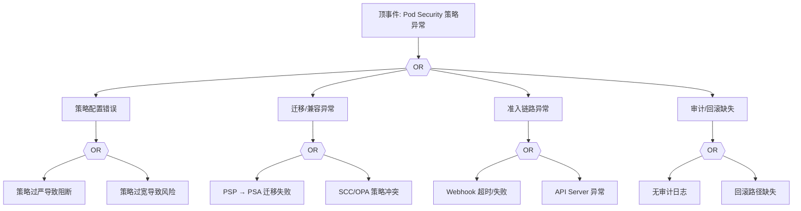

# PSP/SCC 异常 FTA 树

## 适用范围与说明
- **目标**：覆盖 Pod Security 策略阻断、误放行与迁移冲突的关键成因与路径。
- **范围**：PSP/SCC/PSA 策略、准入链路、策略审计、回滚与合规。
- **符号**：
  - **OR 门**：任一子事件成立即可触发父事件
  - **AND 门**：所有子事件同时成立才触发父事件

---

## Mermaid FTA 树



---

## 生产级观测与证据
- **事件**：创建 Pod 被拒绝、策略审计报警。
- **关键指标**：拒绝率、审计事件数量、策略命中率。
- **关键日志**：准入 Webhook 日志、`apiserver` 审计日志。
- **配置核对**：PSP/SCC/PSA 配置、命名空间标签、OPA/Gatekeeper 策略。

---

## JSON 工作流（含与/或门控件）

```json
{
  "flow_steps": [
    { "name": "开始", "action": "start", "step": "start_psp_fta", "next_step": "event_psp_abnormal" },
    { "name": "顶事件: Pod Security 策略异常", "action": "event", "step": "event_psp_abnormal", "description": "策略阻断/误放行", "next_step": "gate_root_or" },
    { "name": "根因 OR 门", "action": "gate_or", "step": "gate_root_or", "control": "or_gate", "gate_type": "OR", "next_steps": ["cat_pol","cat_mig","cat_auth","cat_audit"] }
  ]
}
```

---

## 版本适配（1.19–1.30）
- **1.19–1.23**：PSP 仍可用，需在 FTA 中明确 PSP 策略路径。
- **1.24–1.27**：1.25 移除 PSP，需迁移到 PSA/OPA，补充策略兼容分支。
- **1.28–1.30**：以 PSA/OPA 为主，审计与回滚路径需补全。
- **共性**：遵循 `fta_methodology_and_agentic_practices.md` 中的“版本适配基线”。
