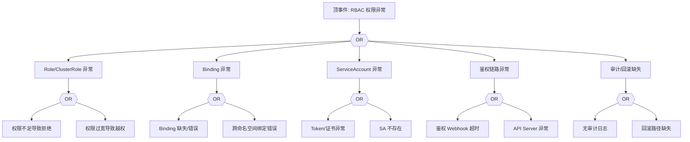

# RBAC 异常 FTA 树

## 适用范围与说明
- **目标**：覆盖权限拒绝、权限过宽与策略漂移的关键成因与路径。
- **范围**：Role/ClusterRole、Binding、ServiceAccount、鉴权链路、审计与回滚。
- **符号**：
  - **OR 门**：任一子事件成立即可触发父事件
  - **AND 门**：所有子事件同时成立才触发父事件

---

## Mermaid FTA 树



---

## 生产级观测与证据
- **事件**：`Forbidden`、`Unauthorized`。
- **关键指标**：鉴权拒绝率、审计事件数量。
- **关键日志**：`apiserver` 审计日志、鉴权 Webhook 日志。
- **配置核对**：Role/ClusterRole、RoleBinding/ClusterRoleBinding、ServiceAccount。

---

## JSON 工作流（含与/或门控件）

```json
{
  "flow_steps": [
    { "name": "开始", "action": "start", "step": "start_rbac_fta", "next_step": "event_rbac_abnormal" },
    { "name": "顶事件: RBAC 权限异常", "action": "event", "step": "event_rbac_abnormal", "description": "权限拒绝/越权", "next_step": "gate_root_or" },
    { "name": "根因 OR 门", "action": "gate_or", "step": "gate_root_or", "control": "or_gate", "gate_type": "OR", "next_steps": ["cat_role","cat_bind","cat_sa","cat_auth","cat_audit"] }
  ]
}
```

---

## 版本适配（1.19–1.30）
- **1.19–1.23**：部分审计字段不全，需补充审计链路与鉴权事件映射。
- **1.24–1.27**：PSP 移除后 RBAC 与准入策略的权限边界需重新校验。
- **1.28–1.30**：稳定 API 为主，审计证据链路需与策略回滚一致。
- **共性**：遵循 `fta_methodology_and_agentic_practices.md` 中的“版本适配基线”。
