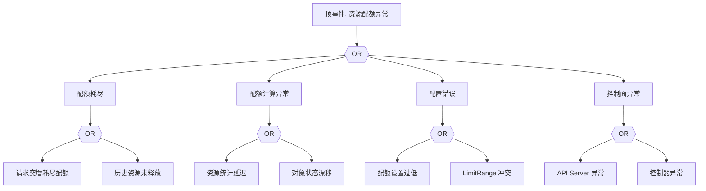

# ResourceQuota 异常 FTA 树

## 适用范围与说明
- **目标**：覆盖资源配额耗尽、配额计算异常与误拦截的关键成因与路径。
- **范围**：命名空间配额、LimitRange、资源请求/限制、控制面与审计。
- **符号**：
  - **OR 门**：任一子事件成立即可触发父事件
  - **AND 门**：所有子事件同时成立才触发父事件

---

## Mermaid FTA 树



---

## 生产级观测与证据
- **事件**：`Forbidden`、`Exceeded quota`。
- **关键指标**：命名空间配额使用率、`kube_resourcequota` 指标。
- **关键日志**：`apiserver` 审计日志、控制器日志。
- **配置核对**：`ResourceQuota`、`LimitRange`、资源请求/限制。

---

## JSON 工作流（含与/或门控件）

```json
{
  "flow_steps": [
    { "name": "开始", "action": "start", "step": "start_rq_fta", "next_step": "event_rq_abnormal" },
    { "name": "顶事件: 资源配额异常", "action": "event", "step": "event_rq_abnormal", "description": "请求被拒/配额耗尽", "next_step": "gate_root_or" },
    { "name": "根因 OR 门", "action": "gate_or", "step": "gate_root_or", "control": "or_gate", "gate_type": "OR", "next_steps": ["cat_quota","cat_calc","cat_conf","cat_ctrl"] }
  ]
}
```

---

## 版本适配（1.19–1.30）
- **1.19–1.23**：配额指标与审计字段可能不全，需补充告警口径。
- **1.24–1.27**：配额统计与控制器版本需对齐。
- **1.28–1.30**：稳定 API 为主，审计链路需一致。
- **共性**：遵循 `fta_methodology_and_agentic_practices.md` 中的“版本适配基线”。
