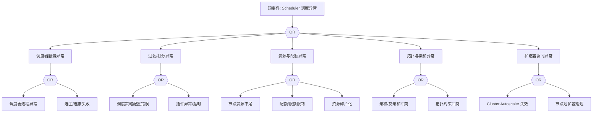

# Scheduler 异常 FTA 树

## 适用范围与说明
- **目标**：覆盖调度失败、调度延迟与调度决策异常的关键成因与路径。
- **范围**：调度器服务、过滤/打分插件、资源/配额、拓扑与亲和、扩缩容协同。
- **符号**：
  - **OR 门**：任一子事件成立即可触发父事件
  - **AND 门**：所有子事件同时成立才触发父事件

---

## Mermaid FTA 树



---

## 生产级观测与证据
- **事件**：`FailedScheduling`、调度队列积压。
- **关键指标**：`scheduler_e2e_scheduling_duration_seconds`、`scheduler_pending_pods`、`scheduler_schedule_attempts_total`。
- **关键日志**：`kube-scheduler` 日志、`cluster-autoscaler` 日志。
- **配置核对**：调度策略、插件配置、资源配额、亲和/反亲和、拓扑约束。

---

## JSON 工作流（含与/或门控件）

```json
{
  "flow_steps": [
    { "name": "开始", "action": "start", "step": "start_scheduler_fta", "next_step": "event_scheduler_abnormal" },
    { "name": "顶事件: Scheduler 调度异常", "action": "event", "step": "event_scheduler_abnormal", "description": "FailedScheduling/调度延迟", "next_step": "gate_root_or" },
    { "name": "根因 OR 门", "action": "gate_or", "step": "gate_root_or", "control": "or_gate", "gate_type": "OR", "next_steps": ["cat_svc","cat_filter","cat_res","cat_topo","cat_scale"] }
  ]
}
```

---

## 版本适配（1.19–1.30）
- **1.19–1.23**：确认调度插件与策略配置是否可用；如存在旧版调度策略需迁移与校验。
- **1.24–1.27**：与 Cluster Autoscaler 版本对齐，确保扩缩容信号可用。
- **1.28–1.30**：仅保留稳定 API，拓扑约束与资源配额的可观测信号需补全。
- **共性**：遵循 `fta_methodology_and_agentic_practices.md` 中的“版本适配基线”。
