# Service 异常 FTA 树

## 适用范围与说明
- **目标**：覆盖 Service 访问不通、Endpoint 缺失与负载均衡异常的关键成因与路径。
- **范围**：Endpoint/EndpointSlice、kube-proxy、网络策略、DNS、云 LB 依赖。
- **符号**：
  - **OR 门**：任一子事件成立即可触发父事件
  - **AND 门**：所有子事件同时成立才触发父事件

---

## 诊断命令快速参考表

### 1. Endpoint/EndpointSlice 诊断

| 节点 ID | 名称 | 诊断命令 | 预期输出模式 | 判定 |
|---------|------|----------|--------------|------|
| EP1 | 无可用 Endpoint | `kubectl get endpoints ${SERVICE_NAME} -n ${NAMESPACE} -o jsonpath='{.subsets[*].addresses[*].ip}'` | IP 地址列表 | 空表示无 Endpoint |
| EP2 | EndpointSlice 不同步 | `kubectl get endpointslice -n ${NAMESPACE} -l kubernetes.io/service-name=${SERVICE_NAME} -o wide` | EndpointSlice 列表 | 检查同步状态 |
| EP3 | Endpoint 地址错误 | `kubectl get endpoints ${SERVICE_NAME} -n ${NAMESPACE} -o yaml \| grep -A5 "addresses"` | Pod IP 列表 | 验证 IP 正确性 |
| EP1A | Pod 不健康 | `kubectl get pods -n ${NAMESPACE} -l ${SELECTOR} -o jsonpath='{range .items[*]}{.metadata.name}: {.status.conditions[?(@.type=="Ready")].status}{"\n"}{end}'` | `True/False` | 检查 Ready 状态 |
| EP1B | Selector 不匹配 | `kubectl get svc ${SERVICE_NAME} -n ${NAMESPACE} -o jsonpath='{.spec.selector}' && kubectl get pods -n ${NAMESPACE} --show-labels` | 标签匹配情况 | 验证 selector 匹配 |

### 2. kube-proxy 诊断

| 节点 ID | 名称 | 诊断命令 | 预期输出模式 | 判定 |
|---------|------|----------|--------------|------|
| KP1A | 规则丢失 | `kubectl exec -n kube-system $(kubectl get pods -n kube-system -l k8s-app=kube-proxy -o jsonpath='{.items[0].metadata.name}') -- iptables -t nat -L KUBE-SERVICES -n \| grep ${SERVICE_CLUSTER_IP}` | NAT 规则 | 检查 Service 规则 |
| KP1B | 规则冲突 | `kubectl exec -n kube-system $(kubectl get pods -n kube-system -l k8s-app=kube-proxy -o jsonpath='{.items[0].metadata.name}') -- iptables -t nat -L -n \| grep -c ${SERVICE_CLUSTER_IP}` | 规则数量 | >1 表示冲突 |
| KP1C | conntrack 表满 | `kubectl get --raw /api/v1/nodes/${NODE_NAME}/proxy/metrics \| grep nf_conntrack` | conntrack 使用率 | 接近 max 表示满 |
| KP2A | 进程崩溃 | `kubectl get pods -n kube-system -l k8s-app=kube-proxy -o jsonpath='{range .items[*]}{.metadata.name}: restarts={.status.containerStatuses[0].restartCount}{"\n"}{end}'` | 重启次数 | >0 表示有重启 |
| KP2B | 配置错误 | `kubectl logs -n kube-system -l k8s-app=kube-proxy --tail=50 \| grep -iE "error\|invalid\|failed"` | 错误日志 | 检查配置问题 |

### 3. 网络策略/连通性诊断

| 节点 ID | 名称 | 诊断命令 | 预期输出模式 | 判定 |
|---------|------|----------|--------------|------|
| NET1A | Ingress 策略阻断 | `kubectl get networkpolicy -n ${NAMESPACE} -o yaml \| grep -A20 "ingress"` | Ingress 规则 | 检查入向策略 |
| NET1B | Egress 策略阻断 | `kubectl get networkpolicy -n ${SRC_NAMESPACE} -o yaml \| grep -A20 "egress"` | Egress 规则 | 检查出向策略 |
| NET2 | 跨节点网络不通 | `kubectl run net-test --rm -i --restart=Never --image=busybox --overrides='{"spec":{"nodeName":"${NODE_NAME}"}}' -- ping -c 3 ${TARGET_POD_IP}` | ping 结果 | 检查跨节点连通 |
| NET3 | 拓扑感知问题 | `kubectl get svc ${SERVICE_NAME} -n ${NAMESPACE} -o jsonpath='{.spec.internalTrafficPolicy}'` | 流量策略 | 检查拓扑配置 |

### 4. DNS 解析诊断

| 节点 ID | 名称 | 诊断命令 | 预期输出模式 | 判定 |
|---------|------|----------|--------------|------|
| DNS1 | CoreDNS 异常 | `kubectl get pods -n kube-system -l k8s-app=kube-dns -o wide` | CoreDNS 状态 | 检查 Pod 健康 |
| DNS2A | search domain 错误 | `kubectl exec -n ${NAMESPACE} ${POD_NAME} -- cat /etc/resolv.conf` | resolv.conf 内容 | 检查 search 域 |
| DNS2B | ndots 设置 | `kubectl exec -n ${NAMESPACE} ${POD_NAME} -- cat /etc/resolv.conf \| grep ndots` | ndots 值 | 检查 ndots 配置 |
| DNS3 | Service 解析 | `kubectl run dns-test --rm -i --restart=Never --image=busybox -- nslookup ${SERVICE_NAME}.${NAMESPACE}.svc.cluster.local` | 解析结果 | 验证 Service DNS |

### 5. 云 LB 诊断

| 节点 ID | 名称 | 诊断命令 | 预期输出模式 | 判定 |
|---------|------|----------|--------------|------|
| LB1 | LB 健康检查 | `kubectl get svc ${SERVICE_NAME} -n ${NAMESPACE} -o jsonpath='{.status.loadBalancer.ingress[*].ip}'` | LB IP | 检查 LB 状态 |
| LB2 | 端口配置 | `kubectl get svc ${SERVICE_NAME} -n ${NAMESPACE} -o jsonpath='{.spec.ports[*]}'` | 端口配置 | 验证端口映射 |
| LB3 | 后端注册 | `kubectl get endpoints ${SERVICE_NAME} -n ${NAMESPACE} -o jsonpath='{.subsets[*].addresses}'` | 后端地址 | 检查后端注册 |
| LB4 | externalTrafficPolicy | `kubectl get svc ${SERVICE_NAME} -n ${NAMESPACE} -o jsonpath='{.spec.externalTrafficPolicy}'` | Cluster/Local | 检查流量策略 |

---

## Mermaid FTA 树

```mermaid
flowchart TD
  TE[顶事件: Service 访问异常]
  OR0{{OR}}
  TE --> OR0

  OR0 --> EP[Endpoint/EndpointSlice 异常]
  OR0 --> KP[kube-proxy 异常]
  OR0 --> NET[网络策略/连通性异常]
  OR0 --> DNS[DNS 解析异常]
  OR0 --> LB[云 LB 依赖异常]

  EP_OR{{OR}}
  EP --> EP_OR
  EP_OR --> EP1[无可用 Endpoint]
  EP_OR --> EP2[EndpointSlice 不同步]
  EP_OR --> EP3[Endpoint 地址错误]

  EP1_OR{{OR}}
  EP1 --> EP1_OR
  EP1_OR --> EP1A[Pod 不健康/NotReady]
  EP1_OR --> EP1B[Selector 不匹配]
  EP1_OR --> EP1C[Endpoint 全失效连锁]

  AND_EP_FAIL{{AND}}
  EP1C --> AND_EP_FAIL
  AND_EP_FAIL --> EP1C1[所有 Pod 健康检查失败]
  AND_EP_FAIL --> EP1C2[健康检查配置过于严格]

  EP1A_OR{{OR}}
  EP1A --> EP1A_OR
  EP1A_OR --> EP1A1[探针失败]
  EP1A_OR --> EP1A2[Pod CrashLoop]
  EP1A_OR --> EP1A3[容器未启动完成]

  KP_OR{{OR}}
  KP --> KP_OR
  KP_OR --> KP1[iptables/ipvs 规则异常]
  KP_OR --> KP2[kube-proxy 进程异常]
  KP_OR --> KP3[规则同步延迟]

  KP1_OR{{OR}}
  KP1 --> KP1_OR
  KP1_OR --> KP1A[规则丢失/不完整]
  KP1_OR --> KP1B[规则冲突/重复]
  KP1_OR --> KP1C[conntrack 表满]

  KP2_OR{{OR}}
  KP2 --> KP2_OR
  KP2_OR --> KP2A[进程崩溃/重启]
  KP2_OR --> KP2B[配置错误]
  KP2_OR --> KP2C[API Server 不可达]

  NET_OR{{OR}}
  NET --> NET_OR
  NET_OR --> NET1[NetworkPolicy 拦截]
  NET_OR --> NET2[跨节点网络不通]
  NET_OR --> NET3[跨区访问失败连锁]

  NET1_OR{{OR}}
  NET1 --> NET1_OR
  NET1_OR --> NET1A[Ingress 策略阻断]
  NET1_OR --> NET1B[Egress 策略阻断]

  AND_TOPO{{AND}}
  NET3 --> AND_TOPO
  AND_TOPO --> NET3A[跨节点/跨区网络延迟高]
  AND_TOPO --> NET3B[拓扑感知路由配置错误]

  DNS_OR{{OR}}
  DNS --> DNS_OR
  DNS_OR --> DNS1[CoreDNS 异常]
  DNS_OR --> DNS2[解析配置错误]
  DNS_OR --> DNS3[Service 名称解析失败]

  DNS2_OR{{OR}}
  DNS2 --> DNS2_OR
  DNS2_OR --> DNS2A[search domain 配置错误]
  DNS2_OR --> DNS2B[ndots 设置不当]
  DNS2_OR --> DNS2C[resolv.conf 异常]

  LB_OR{{OR}}
  LB --> LB_OR
  LB_OR --> LB1[负载均衡器健康检查失败]
  LB_OR --> LB2[监听/端口配置错误]
  LB_OR --> LB3[后端实例未注册]
  LB_OR --> LB4[安全组/防火墙拦截]

  LB1_OR{{OR}}
  LB1 --> LB1_OR
  LB1_OR --> LB1A[健康检查路径错误]
  LB1_OR --> LB1B[健康检查超时设置过短]
  LB1_OR --> LB1C[后端服务启动慢]
```



---

## 生产级观测与证据
- **事件**：`No endpoints available`、`FailedToUpdateEndpointSlice`、连接超时、5xx、`connection refused`。
- **关键指标**：`kube_endpoint_address_available`、`kube_endpoint_slice_address_available`、`kube_proxy_sync_proxy_rules_duration_seconds`、`kube_proxy_sync_proxy_rules_last_timestamp_seconds`、`kube_service_info`。
- **关键日志**：`kube-proxy`、`coredns`、`kubelet`、云 LB 日志、CNI 插件日志。
- **配置核对**：Service 端口、Selector、EndpointSlice、NetworkPolicy、LB 配置、externalTrafficPolicy、internalTrafficPolicy。

---

## JSON 工作流（含与/或门控件）

```json
{
  "flow_steps": [
    {
      "name": "开始",
      "action": "start",
      "step": "start_svc_fta",
      "next_step": "event_svc_abnormal"
    },
    {
      "name": "顶事件: Service 访问异常",
      "action": "event",
      "step": "event_svc_abnormal",
      "description": "连接超时/无可用 Endpoint/5xx 错误",
      "next_step": "gate_root_or",
      "cmd": {
        "type": "parallel",
        "commands": [
          { "id": "svc_status", "description": "检查Service状态", "exec": "kubectl get svc ${SERVICE_NAME} -n ${NAMESPACE} -o wide 2>/dev/null || echo 'SERVICE_NOT_FOUND'", "timeout": 5 },
          { "id": "endpoints", "description": "检查Endpoints", "exec": "kubectl get endpoints ${SERVICE_NAME} -n ${NAMESPACE} -o jsonpath='{.subsets[*].addresses[*].ip}' 2>/dev/null || echo 'NO_ENDPOINTS'", "timeout": 5 },
          { "id": "connectivity_test", "description": "测试Service连通性", "exec": "kubectl run svc-test-${RANDOM} --rm -i --restart=Never --image=busybox:1.35 --timeout=30s -- wget -qO- --timeout=5 http://${SERVICE_NAME}.${NAMESPACE}:${PORT} 2>&1 | head -20", "timeout": 35 }
        ]
      },
      "match": {
        "rules": [
          { "if": "svc_status contains 'SERVICE_NOT_FOUND'", "then": "Service不存在", "confidence": 0.95 },
          { "if": "endpoints is_empty OR endpoints contains 'NO_ENDPOINTS'", "then": "无可用Endpoint", "confidence": 0.95 },
          { "if": "connectivity_test contains 'Connection refused'", "then": "连接被拒绝", "confidence": 0.9 },
          { "if": "connectivity_test contains 'timed out'", "then": "连接超时", "confidence": 0.9 }
        ],
        "default": "继续诊断根因"
      }
    },
    {
      "name": "根因 OR 门",
      "action": "gate_or",
      "step": "gate_root_or",
      "control": "or_gate",
      "gate_type": "OR",
      "next_steps": ["cat_ep", "cat_kp", "cat_net", "cat_dns", "cat_lb"],
      "cmd": {
        "type": "parallel",
        "commands": [
          { "id": "ep_count", "description": "统计Endpoint数量", "exec": "kubectl get endpoints ${SERVICE_NAME} -n ${NAMESPACE} -o jsonpath='{.subsets[*].addresses}' 2>/dev/null | jq -r 'length' 2>/dev/null || echo '0'", "timeout": 5 },
          { "id": "kube_proxy_status", "description": "检查kube-proxy状态", "exec": "kubectl get pods -n kube-system -l k8s-app=kube-proxy -o jsonpath='{range .items[*]}{.metadata.name}: {.status.phase} restarts={.status.containerStatuses[0].restartCount}{\"\\n\"}{end}'", "timeout": 5 },
          { "id": "svc_type", "description": "检查Service类型", "exec": "kubectl get svc ${SERVICE_NAME} -n ${NAMESPACE} -o jsonpath='{.spec.type}'", "timeout": 5 },
          { "id": "dns_test", "description": "测试DNS解析", "exec": "kubectl run dns-test-${RANDOM} --rm -i --restart=Never --image=busybox:1.35 --timeout=15s -- nslookup ${SERVICE_NAME}.${NAMESPACE}.svc.cluster.local 2>&1", "timeout": 20 }
        ]
      },
      "match": {
        "rules": [
          { "if": "ep_count == 0", "then": "route_to: cat_ep", "confidence": 0.95 },
          { "if": "kube_proxy_status not contains 'Running' OR kube_proxy_status contains 'restarts>3'", "then": "route_to: cat_kp", "confidence": 0.85 },
          { "if": "dns_test contains 'NXDOMAIN' OR dns_test contains 'connection timed out'", "then": "route_to: cat_dns", "confidence": 0.9 },
          { "if": "svc_type == 'LoadBalancer'", "then": "route_to: cat_lb (检查LB配置)", "confidence": 0.7 }
        ],
        "default": "route_to: cat_ep (优先检查Endpoint)"
      }
    },

    {
      "name": "Endpoint/EndpointSlice 异常",
      "action": "category",
      "step": "cat_ep",
      "description": "后端地址不可用",
      "next_step": "gate_ep_or",
      "cmd": {
        "type": "parallel",
        "commands": [
          { "id": "endpoints_detail", "description": "获取Endpoints详情", "exec": "kubectl get endpoints ${SERVICE_NAME} -n ${NAMESPACE} -o yaml 2>/dev/null | head -50", "timeout": 5 },
          { "id": "endpointslice", "description": "获取EndpointSlice", "exec": "kubectl get endpointslice -n ${NAMESPACE} -l kubernetes.io/service-name=${SERVICE_NAME} -o wide 2>/dev/null", "timeout": 5 },
          { "id": "backend_pods", "description": "检查后端Pod状态", "exec": "kubectl get pods -n ${NAMESPACE} -l $(kubectl get svc ${SERVICE_NAME} -n ${NAMESPACE} -o jsonpath='{.spec.selector}' 2>/dev/null | jq -r 'to_entries | map(\"\\(.key)=\\(.value)\") | join(\",\")' 2>/dev/null) -o wide 2>/dev/null || echo 'NO_SELECTOR'", "timeout": 10 }
        ]
      },
      "match": {
        "rules": [
          { "if": "endpoints_detail not contains 'addresses'", "then": "Endpoints为空", "confidence": 0.95 },
          { "if": "backend_pods contains 'NO_SELECTOR'", "then": "Service selector可能有问题", "confidence": 0.8 },
          { "if": "backend_pods not contains 'Running'", "then": "后端Pod不健康", "confidence": 0.9 }
        ],
        "default": "检查具体Endpoint问题"
      }
    },
    {
      "name": "Endpoint OR 门",
      "action": "gate_or",
      "step": "gate_ep_or",
      "control": "or_gate",
      "gate_type": "OR",
      "next_steps": ["evt_no_endpoint", "evt_slice_unsync", "evt_ep_addr_bad"],
      "cmd": {
        "type": "parallel",
        "commands": [
          { "id": "ep_addresses", "description": "检查Endpoint地址", "exec": "kubectl get endpoints ${SERVICE_NAME} -n ${NAMESPACE} -o jsonpath='{.subsets[*].addresses}' 2>/dev/null", "timeout": 5 },
          { "id": "slice_addresses", "description": "检查EndpointSlice地址", "exec": "kubectl get endpointslice -n ${NAMESPACE} -l kubernetes.io/service-name=${SERVICE_NAME} -o jsonpath='{.items[*].endpoints[*].addresses}' 2>/dev/null", "timeout": 5 },
          { "id": "ep_events", "description": "获取Endpoint事件", "exec": "kubectl get events -n ${NAMESPACE} --field-selector involvedObject.name=${SERVICE_NAME} --sort-by='.lastTimestamp' | tail -10", "timeout": 5 }
        ]
      },
      "match": {
        "rules": [
          { "if": "ep_addresses is_empty AND slice_addresses is_empty", "then": "route_to: evt_no_endpoint", "confidence": 0.95 },
          { "if": "ep_addresses != slice_addresses", "then": "route_to: evt_slice_unsync", "confidence": 0.85 },
          { "if": "ep_events contains 'FailedToUpdateEndpointSlice'", "then": "route_to: evt_slice_unsync", "confidence": 0.9 }
        ],
        "default": "route_to: evt_no_endpoint"
      }
    },

    {
      "name": "无可用 Endpoint",
      "action": "event",
      "step": "evt_no_endpoint",
      "description": "Service 无后端地址",
      "next_step": "gate_no_ep_or",
      "cmd": {
        "type": "parallel",
        "commands": [
          { "id": "svc_selector", "description": "获取Service selector", "exec": "kubectl get svc ${SERVICE_NAME} -n ${NAMESPACE} -o jsonpath='{.spec.selector}'", "timeout": 5 },
          { "id": "matching_pods", "description": "查找匹配的Pod", "exec": "kubectl get pods -n ${NAMESPACE} --show-labels 2>/dev/null | head -20", "timeout": 5 },
          { "id": "pod_ready_status", "description": "检查Pod Ready状态", "exec": "kubectl get pods -n ${NAMESPACE} -l $(kubectl get svc ${SERVICE_NAME} -n ${NAMESPACE} -o jsonpath='{.spec.selector}' 2>/dev/null | jq -r 'to_entries | map(\"\\(.key)=\\(.value)\") | join(\",\")' 2>/dev/null) -o jsonpath='{range .items[*]}{.metadata.name}: Ready={.status.conditions[?(@.type==\"Ready\")].status}{\"\\n\"}{end}' 2>/dev/null", "timeout": 10 }
        ]
      },
      "match": {
        "rules": [
          { "if": "matching_pods is_empty", "then": "没有匹配selector的Pod", "confidence": 0.9 },
          { "if": "pod_ready_status contains 'Ready=False'", "then": "Pod未就绪导致无Endpoint", "confidence": 0.95 }
        ],
        "default": "继续检查具体原因"
      }
    },
    {
      "name": "无 Endpoint OR 门",
      "action": "gate_or",
      "step": "gate_no_ep_or",
      "control": "or_gate",
      "gate_type": "OR",
      "next_steps": ["evt_pod_unhealthy", "evt_selector_mismatch", "evt_ep_cascade_fail"],
      "cmd": {
        "type": "parallel",
        "commands": [
          { "id": "pod_conditions", "description": "检查Pod条件", "exec": "kubectl get pods -n ${NAMESPACE} -l $(kubectl get svc ${SERVICE_NAME} -n ${NAMESPACE} -o jsonpath='{.spec.selector}' 2>/dev/null | jq -r 'to_entries | map(\"\\(.key)=\\(.value)\") | join(\",\")' 2>/dev/null) -o jsonpath='{range .items[*]}{.metadata.name}: ContainersReady={.status.conditions[?(@.type==\"ContainersReady\")].status}, Ready={.status.conditions[?(@.type==\"Ready\")].status}{\"\\n\"}{end}' 2>/dev/null", "timeout": 10 },
          { "id": "selector_check", "description": "验证selector", "exec": "echo 'Service selector:' && kubectl get svc ${SERVICE_NAME} -n ${NAMESPACE} -o jsonpath='{.spec.selector}' && echo '' && echo 'Pod labels:' && kubectl get pods -n ${NAMESPACE} -o jsonpath='{range .items[*]}{.metadata.name}: {.metadata.labels}{\"\\n\"}{end}' | head -10", "timeout": 10 }
        ]
      },
      "match": {
        "rules": [
          { "if": "pod_conditions contains 'Ready=False'", "then": "route_to: evt_pod_unhealthy", "confidence": 0.9 },
          { "if": "selector_check labels not match selector", "then": "route_to: evt_selector_mismatch", "confidence": 0.85 }
        ],
        "default": "route_to: evt_pod_unhealthy"
      }
    },

    {
      "name": "Pod 不健康/NotReady",
      "action": "event",
      "step": "evt_pod_unhealthy",
      "description": "后端 Pod 未就绪",
      "next_step": "gate_pod_unhealthy_or",
      "cmd": {
        "type": "parallel",
        "commands": [
          { "id": "pod_status", "description": "获取Pod详细状态", "exec": "kubectl get pods -n ${NAMESPACE} -l $(kubectl get svc ${SERVICE_NAME} -n ${NAMESPACE} -o jsonpath='{.spec.selector}' 2>/dev/null | jq -r 'to_entries | map(\"\\(.key)=\\(.value)\") | join(\",\")' 2>/dev/null) -o wide 2>/dev/null", "timeout": 10 },
          { "id": "pod_events", "description": "获取Pod事件", "exec": "kubectl get events -n ${NAMESPACE} --field-selector reason=Unhealthy,reason=BackOff --sort-by='.lastTimestamp' | tail -10", "timeout": 5 }
        ]
      },
      "match": {
        "rules": [
          { "if": "pod_events contains 'Unhealthy' OR pod_events contains 'probe failed'", "then": "探针失败", "confidence": 0.9 },
          { "if": "pod_status contains 'CrashLoopBackOff'", "then": "Pod崩溃循环", "confidence": 0.95 },
          { "if": "pod_status contains 'ContainerCreating' OR pod_status contains 'Init'", "then": "容器未启动完成", "confidence": 0.9 }
        ],
        "default": "继续检查Pod健康原因"
      }
    },
    {
      "name": "Pod 不健康 OR 门",
      "action": "gate_or",
      "step": "gate_pod_unhealthy_or",
      "control": "or_gate",
      "gate_type": "OR",
      "next_steps": ["evt_probe_fail", "evt_pod_crashloop", "evt_container_starting"],
      "cmd": {
        "type": "single",
        "commands": [
          { "id": "pod_detail", "description": "获取Pod详细信息", "exec": "kubectl get pods -n ${NAMESPACE} -l $(kubectl get svc ${SERVICE_NAME} -n ${NAMESPACE} -o jsonpath='{.spec.selector}' 2>/dev/null | jq -r 'to_entries | map(\"\\(.key)=\\(.value)\") | join(\",\")' 2>/dev/null) -o jsonpath='{range .items[*]}{.metadata.name}: phase={.status.phase}, waiting={.status.containerStatuses[0].state.waiting.reason}, restarts={.status.containerStatuses[0].restartCount}{\"\\n\"}{end}' 2>/dev/null", "timeout": 10 }
        ]
      },
      "match": {
        "rules": [
          { "if": "pod_detail contains 'CrashLoopBackOff'", "then": "route_to: evt_pod_crashloop", "confidence": 0.95 },
          { "if": "pod_detail contains 'ContainerCreating' OR pod_detail contains 'PodInitializing'", "then": "route_to: evt_container_starting", "confidence": 0.9 },
          { "if": "pod_detail restarts > 0", "then": "route_to: evt_probe_fail (可能探针失败)", "confidence": 0.8 }
        ],
        "default": "route_to: evt_probe_fail"
      }
    },
    {
      "name": "探针失败",
      "action": "bottom_event",
      "step": "evt_probe_fail",
      "severity": "high",
      "probability": "common",
      "mttr_minutes": 15,
      "detection": {
        "events": ["Unhealthy", "Readiness probe failed"],
        "metrics": ["kube_pod_container_status_ready", "kube_pod_status_ready"],
        "logs": ["kubelet: Readiness probe failed"]
      },
      "remediation": {
        "manual_steps": ["检查探针配置", "验证探针路径/端口是否正确", "调整超时和阈值"],
        "auto_actions": ["增加探针超时时间", "调整 initialDelaySeconds"]
      },
      "cmd": {
        "type": "parallel",
        "commands": [
          { "id": "probe_config", "description": "获取探针配置", "exec": "kubectl get pods -n ${NAMESPACE} -l $(kubectl get svc ${SERVICE_NAME} -n ${NAMESPACE} -o jsonpath='{.spec.selector}' 2>/dev/null | jq -r 'to_entries | map(\"\\(.key)=\\(.value)\") | join(\",\")' 2>/dev/null) -o jsonpath='{range .items[*]}{.metadata.name}: readiness={.spec.containers[0].readinessProbe}, liveness={.spec.containers[0].livenessProbe}{\"\\n\"}{end}' 2>/dev/null | head -5", "timeout": 10 },
          { "id": "probe_events", "description": "获取探针事件", "exec": "kubectl get events -n ${NAMESPACE} --field-selector reason=Unhealthy --sort-by='.lastTimestamp' | tail -10", "timeout": 5 },
          { "id": "container_logs", "description": "获取容器日志", "exec": "kubectl logs -n ${NAMESPACE} -l $(kubectl get svc ${SERVICE_NAME} -n ${NAMESPACE} -o jsonpath='{.spec.selector}' 2>/dev/null | jq -r 'to_entries | map(\"\\(.key)=\\(.value)\") | join(\",\")' 2>/dev/null) --tail=30 2>/dev/null | head -50", "timeout": 10 }
        ]
      },
      "match": {
        "rules": [
          { "if": "probe_events contains 'Readiness probe failed'", "then": "confirm: Readiness探针失败，检查配置和应用响应", "confidence": 0.95 },
          { "if": "probe_events contains 'Liveness probe failed'", "then": "confirm: Liveness探针失败，可能导致重启", "confidence": 0.95 },
          { "if": "probe_config contains 'timeoutSeconds: 1'", "then": "confirm: 探针超时设置过短", "confidence": 0.8 }
        ],
        "default": "检查探针路径和应用响应"
      }
    },
    {
      "name": "Pod CrashLoop",
      "action": "bottom_event",
      "step": "evt_pod_crashloop",
      "severity": "critical",
      "probability": "common",
      "mttr_minutes": 20,
      "detection": {
        "events": ["BackOff", "CrashLoopBackOff"],
        "metrics": ["kube_pod_container_status_waiting_reason{reason='CrashLoopBackOff'}"],
        "logs": ["kubelet: Back-off restarting failed container"]
      },
      "remediation": {
        "manual_steps": ["检查 Pod 日志", "验证启动命令", "检查资源限制"],
        "auto_actions": ["回滚到上一个稳定版本"]
      },
      "cmd": {
        "type": "sequence",
        "commands": [
          { "id": "crash_logs", "description": "获取崩溃日志", "exec": "kubectl logs -n ${NAMESPACE} -l $(kubectl get svc ${SERVICE_NAME} -n ${NAMESPACE} -o jsonpath='{.spec.selector}' 2>/dev/null | jq -r 'to_entries | map(\"\\(.key)=\\(.value)\") | join(\",\")' 2>/dev/null) --previous --tail=50 2>/dev/null | head -50", "timeout": 10 },
          { "id": "pod_describe", "description": "描述Pod", "exec": "kubectl describe pods -n ${NAMESPACE} -l $(kubectl get svc ${SERVICE_NAME} -n ${NAMESPACE} -o jsonpath='{.spec.selector}' 2>/dev/null | jq -r 'to_entries | map(\"\\(.key)=\\(.value)\") | join(\",\")' 2>/dev/null) 2>/dev/null | grep -A20 'Events:' | head -30", "timeout": 10 }
        ]
      },
      "match": {
        "rules": [
          { "if": "crash_logs contains 'OOMKilled' OR pod_describe contains 'OOMKilled'", "then": "confirm: 内存溢出导致崩溃", "confidence": 0.95 },
          { "if": "crash_logs contains 'error' OR crash_logs contains 'panic'", "then": "confirm: 应用错误导致崩溃", "confidence": 0.9 }
        ],
        "default": "需要进一步分析崩溃日志"
      }
    },
    {
      "name": "容器未启动完成",
      "action": "bottom_event",
      "step": "evt_container_starting",
      "severity": "medium",
      "probability": "common",
      "mttr_minutes": 10,
      "detection": {
        "events": ["ContainerCreating", "PodInitializing"],
        "metrics": ["kube_pod_container_status_waiting"],
        "logs": []
      },
      "remediation": {
        "manual_steps": ["等待容器启动完成", "检查是否有资源争用"],
        "auto_actions": ["增加 startupProbe 时间"]
      },
      "cmd": {
        "type": "parallel",
        "commands": [
          { "id": "container_status", "description": "检查容器状态", "exec": "kubectl get pods -n ${NAMESPACE} -l $(kubectl get svc ${SERVICE_NAME} -n ${NAMESPACE} -o jsonpath='{.spec.selector}' 2>/dev/null | jq -r 'to_entries | map(\"\\(.key)=\\(.value)\") | join(\",\")' 2>/dev/null) -o jsonpath='{range .items[*]}{.metadata.name}: {.status.containerStatuses[*].state}{\"\\n\"}{end}' 2>/dev/null", "timeout": 10 },
          { "id": "init_status", "description": "检查Init容器状态", "exec": "kubectl get pods -n ${NAMESPACE} -l $(kubectl get svc ${SERVICE_NAME} -n ${NAMESPACE} -o jsonpath='{.spec.selector}' 2>/dev/null | jq -r 'to_entries | map(\"\\(.key)=\\(.value)\") | join(\",\")' 2>/dev/null) -o jsonpath='{range .items[*]}{.metadata.name}: initContainers={.status.initContainerStatuses[*].state}{\"\\n\"}{end}' 2>/dev/null", "timeout": 10 }
        ]
      },
      "match": {
        "rules": [
          { "if": "container_status contains 'waiting' AND container_status contains 'ContainerCreating'", "then": "confirm: 容器正在创建中", "confidence": 0.9 },
          { "if": "init_status contains 'waiting' OR init_status contains 'running'", "then": "confirm: Init容器未完成", "confidence": 0.9 }
        ],
        "default": "等待容器启动"
      }
    },

    {
      "name": "Selector 不匹配",
      "action": "bottom_event",
      "step": "evt_selector_mismatch",
      "severity": "high",
      "probability": "medium",
      "mttr_minutes": 10,
      "detection": {
        "events": [],
        "metrics": ["kube_endpoint_address_available{endpoint='<service>'}==0"],
        "logs": []
      },
      "remediation": {
        "manual_steps": ["检查 Service selector 与 Pod labels 是否匹配", "验证命名空间是否正确"],
        "auto_actions": ["修正 Service selector"]
      },
      "cmd": {
        "type": "sequence",
        "commands": [
          { "id": "svc_selector", "description": "获取Service selector", "exec": "kubectl get svc ${SERVICE_NAME} -n ${NAMESPACE} -o jsonpath='selector: {.spec.selector}'", "timeout": 5 },
          { "id": "pod_labels", "description": "获取所有Pod标签", "exec": "kubectl get pods -n ${NAMESPACE} -o jsonpath='{range .items[*]}{.metadata.name}: {.metadata.labels}{\"\\n\"}{end}' | head -20", "timeout": 5 }
        ]
      },
      "match": {
        "rules": [
          { "if": "svc_selector not subset of any pod_labels", "then": "confirm: Service selector与Pod标签不匹配", "confidence": 0.95 }
        ],
        "default": "Selector配置正常"
      }
    },

    {
      "name": "Endpoint 全失效连锁",
      "action": "event",
      "step": "evt_ep_cascade_fail",
      "severity": "critical",
      "probability": "medium",
      "mttr_minutes": 20,
      "detection": {
        "events": ["No endpoints available"],
        "metrics": ["kube_endpoint_address_available==0"],
        "logs": ["kube-proxy: no endpoints available"]
      },
      "remediation": {
        "manual_steps": ["检查所有后端 Pod 状态", "验证健康检查配置"],
        "auto_actions": ["放宽健康检查阈值", "扩展副本数"]
      },
      "next_step": "gate_ep_cascade_and",
      "cmd": {
        "type": "parallel",
        "commands": [
          { "id": "all_pods_status", "description": "检查所有后端Pod状态", "exec": "kubectl get pods -n ${NAMESPACE} -l $(kubectl get svc ${SERVICE_NAME} -n ${NAMESPACE} -o jsonpath='{.spec.selector}' 2>/dev/null | jq -r 'to_entries | map(\"\\(.key)=\\(.value)\") | join(\",\")' 2>/dev/null) -o wide 2>/dev/null", "timeout": 10 },
          { "id": "ready_count", "description": "统计Ready Pod数量", "exec": "kubectl get pods -n ${NAMESPACE} -l $(kubectl get svc ${SERVICE_NAME} -n ${NAMESPACE} -o jsonpath='{.spec.selector}' 2>/dev/null | jq -r 'to_entries | map(\"\\(.key)=\\(.value)\") | join(\",\")' 2>/dev/null) -o jsonpath='{range .items[*]}{.status.conditions[?(@.type==\"Ready\")].status}{\"\\n\"}{end}' 2>/dev/null | grep -c True || echo '0'", "timeout": 10 }
        ]
      },
      "match": {
        "rules": [
          { "if": "ready_count == 0", "then": "所有Pod都不健康", "confidence": 0.95 }
        ],
        "default": "检查部分Pod失败原因"
      }
    },
    {
      "name": "Endpoint 失效 AND 门",
      "action": "gate_and",
      "step": "gate_ep_cascade_and",
      "control": "and_gate",
      "gate_type": "AND",
      "next_steps": ["evt_all_probe_fail", "evt_probe_config_strict"],
      "cmd": {
        "type": "parallel",
        "commands": [
          { "id": "probe_failures", "description": "检查探针失败", "exec": "kubectl get events -n ${NAMESPACE} --field-selector reason=Unhealthy --sort-by='.lastTimestamp' | wc -l", "timeout": 5 },
          { "id": "probe_config", "description": "获取探针配置", "exec": "kubectl get pods -n ${NAMESPACE} -l $(kubectl get svc ${SERVICE_NAME} -n ${NAMESPACE} -o jsonpath='{.spec.selector}' 2>/dev/null | jq -r 'to_entries | map(\"\\(.key)=\\(.value)\") | join(\",\")' 2>/dev/null) -o jsonpath='{.items[0].spec.containers[0].readinessProbe}' 2>/dev/null", "timeout": 10 }
        ]
      },
      "match": {
        "rules": [
          { "if": "probe_failures > 5 AND probe_config contains 'failureThreshold: 1'", "then": "AND条件满足: 探针频繁失败 + 配置严格", "confidence": 0.85 }
        ],
        "default": "需要同时满足所有Pod失败和配置过严"
      }
    },
    {
      "name": "所有 Pod 健康检查失败",
      "action": "and_condition",
      "step": "evt_all_probe_fail",
      "severity": "critical",
      "probability": "medium",
      "mttr_minutes": 15,
      "detection": {
        "events": ["Unhealthy"],
        "metrics": ["sum(kube_pod_status_ready{pod=~'<deployment>.*'})==0"],
        "logs": []
      },
      "remediation": {
        "manual_steps": ["分析所有 Pod 健康检查失败原因"],
        "auto_actions": ["重启 Deployment"]
      },
      "cmd": {
        "type": "single",
        "commands": [
          { "id": "unhealthy_events", "description": "获取Unhealthy事件", "exec": "kubectl get events -n ${NAMESPACE} --field-selector reason=Unhealthy --sort-by='.lastTimestamp' | tail -20", "timeout": 5 }
        ]
      },
      "match": {
        "rules": [
          { "if": "unhealthy_events count > total_pods", "then": "confirm: 所有Pod都经历过健康检查失败", "confidence": 0.9 }
        ],
        "default": "部分Pod健康检查失败"
      }
    },
    {
      "name": "健康检查配置过于严格",
      "action": "and_condition",
      "step": "evt_probe_config_strict",
      "severity": "medium",
      "probability": "common",
      "mttr_minutes": 10,
      "detection": {
        "events": [],
        "metrics": [],
        "logs": []
      },
      "remediation": {
        "manual_steps": ["检查 failureThreshold 和 timeoutSeconds 设置", "验证应用启动时间"],
        "auto_actions": ["增加 failureThreshold", "延长超时时间"]
      },
      "cmd": {
        "type": "single",
        "commands": [
          { "id": "strict_config", "description": "检查严格配置", "exec": "kubectl get pods -n ${NAMESPACE} -l $(kubectl get svc ${SERVICE_NAME} -n ${NAMESPACE} -o jsonpath='{.spec.selector}' 2>/dev/null | jq -r 'to_entries | map(\"\\(.key)=\\(.value)\") | join(\",\")' 2>/dev/null) -o jsonpath='{range .items[*]}readiness: failureThreshold={.spec.containers[0].readinessProbe.failureThreshold}, timeoutSeconds={.spec.containers[0].readinessProbe.timeoutSeconds}{\"\\n\"}{end}' 2>/dev/null | head -5", "timeout": 10 }
        ]
      },
      "match": {
        "rules": [
          { "if": "strict_config failureThreshold <= 1 OR strict_config timeoutSeconds <= 1", "then": "confirm: 健康检查配置过于严格", "confidence": 0.85 }
        ],
        "default": "健康检查配置合理"
      }
    },

    {
      "name": "EndpointSlice 不同步",
      "action": "bottom_event",
      "step": "evt_slice_unsync",
      "severity": "high",
      "probability": "medium",
      "mttr_minutes": 15,
      "detection": {
        "events": ["FailedToUpdateEndpointSlice"],
        "metrics": ["kube_endpoint_slice_address_available"],
        "logs": ["endpoint-slice-controller: failed to update"]
      },
      "remediation": {
        "manual_steps": ["检查 endpoint-slice-controller 状态", "验证 API Server 连接"],
        "auto_actions": ["重启 kube-controller-manager"]
      },
      "cmd": {
        "type": "parallel",
        "commands": [
          { "id": "slice_status", "description": "检查EndpointSlice状态", "exec": "kubectl get endpointslice -n ${NAMESPACE} -l kubernetes.io/service-name=${SERVICE_NAME} -o yaml 2>/dev/null | head -50", "timeout": 5 },
          { "id": "controller_logs", "description": "检查控制器日志", "exec": "kubectl logs -n kube-system -l component=kube-controller-manager --tail=30 2>/dev/null | grep -i 'endpoint' | head -20", "timeout": 10 },
          { "id": "slice_events", "description": "获取EndpointSlice事件", "exec": "kubectl get events -n ${NAMESPACE} --field-selector reason=FailedToUpdateEndpointSlice --sort-by='.lastTimestamp' | tail -10", "timeout": 5 }
        ]
      },
      "match": {
        "rules": [
          { "if": "slice_events contains 'FailedToUpdateEndpointSlice'", "then": "confirm: EndpointSlice更新失败", "confidence": 0.95 },
          { "if": "controller_logs contains 'error' AND controller_logs contains 'endpoint'", "then": "confirm: 控制器处理Endpoint异常", "confidence": 0.85 }
        ],
        "default": "EndpointSlice同步正常"
      }
    },
    {
      "name": "Endpoint 地址错误",
      "action": "bottom_event",
      "step": "evt_ep_addr_bad",
      "severity": "high",
      "probability": "rare",
      "mttr_minutes": 15,
      "detection": {
        "events": [],
        "metrics": [],
        "logs": ["connection refused to endpoint"]
      },
      "remediation": {
        "manual_steps": ["检查 Pod IP 是否正确", "验证 CNI 分配"],
        "auto_actions": ["重建 Pod"]
      },
      "cmd": {
        "type": "parallel",
        "commands": [
          { "id": "ep_ips", "description": "获取Endpoint IP", "exec": "kubectl get endpoints ${SERVICE_NAME} -n ${NAMESPACE} -o jsonpath='{.subsets[*].addresses[*].ip}'", "timeout": 5 },
          { "id": "pod_ips", "description": "获取Pod IP", "exec": "kubectl get pods -n ${NAMESPACE} -l $(kubectl get svc ${SERVICE_NAME} -n ${NAMESPACE} -o jsonpath='{.spec.selector}' 2>/dev/null | jq -r 'to_entries | map(\"\\(.key)=\\(.value)\") | join(\",\")' 2>/dev/null) -o jsonpath='{range .items[*]}{.metadata.name}: {.status.podIP}{\"\\n\"}{end}' 2>/dev/null", "timeout": 10 },
          { "id": "connectivity_test", "description": "测试Endpoint连通性", "exec": "kubectl run ep-test-${RANDOM} --rm -i --restart=Never --image=busybox:1.35 --timeout=15s -- nc -zv -w 3 $(kubectl get endpoints ${SERVICE_NAME} -n ${NAMESPACE} -o jsonpath='{.subsets[0].addresses[0].ip}' 2>/dev/null) ${PORT} 2>&1", "timeout": 20 }
        ]
      },
      "match": {
        "rules": [
          { "if": "ep_ips != pod_ips", "then": "confirm: Endpoint IP与Pod IP不一致", "confidence": 0.9 },
          { "if": "connectivity_test contains 'Connection refused'", "then": "confirm: Endpoint地址不可达", "confidence": 0.95 }
        ],
        "default": "Endpoint地址正常"
      }
    },

    {
      "name": "kube-proxy 异常",
      "action": "category",
      "step": "cat_kp",
      "description": "代理规则异常",
      "next_step": "gate_kp_or",
      "cmd": {
        "type": "parallel",
        "commands": [
          { "id": "kp_pods", "description": "检查kube-proxy Pod", "exec": "kubectl get pods -n kube-system -l k8s-app=kube-proxy -o wide", "timeout": 5 },
          { "id": "kp_logs", "description": "获取kube-proxy日志", "exec": "kubectl logs -n kube-system -l k8s-app=kube-proxy --tail=50 2>/dev/null | grep -iE 'error|failed|sync' | head -20", "timeout": 10 },
          { "id": "kp_mode", "description": "检查kube-proxy模式", "exec": "kubectl get cm kube-proxy -n kube-system -o jsonpath='{.data.config\\.conf}' 2>/dev/null | grep -i mode || echo 'MODE_NOT_FOUND'", "timeout": 5 }
        ]
      },
      "match": {
        "rules": [
          { "if": "kp_pods not contains 'Running'", "then": "kube-proxy Pod异常", "confidence": 0.95 },
          { "if": "kp_logs contains 'error' OR kp_logs contains 'failed'", "then": "kube-proxy存在错误", "confidence": 0.85 }
        ],
        "default": "检查具体kube-proxy问题"
      }
    },
    {
      "name": "kube-proxy OR 门",
      "action": "gate_or",
      "step": "gate_kp_or",
      "control": "or_gate",
      "gate_type": "OR",
      "next_steps": ["evt_rules_bad", "evt_proxy_crash", "evt_sync_delay"],
      "cmd": {
        "type": "parallel",
        "commands": [
          { "id": "kp_restarts", "description": "检查重启次数", "exec": "kubectl get pods -n kube-system -l k8s-app=kube-proxy -o jsonpath='{range .items[*]}{.metadata.name}: restarts={.status.containerStatuses[0].restartCount}{\"\\n\"}{end}'", "timeout": 5 },
          { "id": "sync_errors", "description": "检查同步错误", "exec": "kubectl logs -n kube-system -l k8s-app=kube-proxy --tail=100 2>/dev/null | grep -c 'sync.*error\\|failed to sync' || echo '0'", "timeout": 10 }
        ]
      },
      "match": {
        "rules": [
          { "if": "kp_restarts > 3", "then": "route_to: evt_proxy_crash", "confidence": 0.9 },
          { "if": "sync_errors > 5", "then": "route_to: evt_rules_bad", "confidence": 0.85 }
        ],
        "default": "route_to: evt_rules_bad"
      }
    },

    {
      "name": "iptables/ipvs 规则异常",
      "action": "event",
      "step": "evt_rules_bad",
      "description": "代理规则错误",
      "next_step": "gate_rules_or",
      "cmd": {
        "type": "parallel",
        "commands": [
          { "id": "iptables_check", "description": "检查iptables规则", "exec": "kubectl exec -n kube-system $(kubectl get pods -n kube-system -l k8s-app=kube-proxy -o jsonpath='{.items[0].metadata.name}') -- iptables -t nat -L KUBE-SERVICES -n 2>/dev/null | wc -l || echo '0'", "timeout": 10 },
          { "id": "ipvs_check", "description": "检查ipvs规则", "exec": "kubectl exec -n kube-system $(kubectl get pods -n kube-system -l k8s-app=kube-proxy -o jsonpath='{.items[0].metadata.name}') -- ipvsadm -Ln 2>/dev/null | wc -l || echo '0'", "timeout": 10 }
        ]
      },
      "match": {
        "rules": [
          { "if": "iptables_check == 0 AND ipvs_check == 0", "then": "无代理规则", "confidence": 0.95 }
        ],
        "default": "规则存在，检查是否正确"
      }
    },
    {
      "name": "规则 OR 门",
      "action": "gate_or",
      "step": "gate_rules_or",
      "control": "or_gate",
      "gate_type": "OR",
      "next_steps": ["evt_rules_lost", "evt_rules_conflict", "evt_conntrack_full"],
      "cmd": {
        "type": "parallel",
        "commands": [
          { "id": "svc_rules", "description": "检查Service规则", "exec": "kubectl exec -n kube-system $(kubectl get pods -n kube-system -l k8s-app=kube-proxy -o jsonpath='{.items[0].metadata.name}') -- iptables -t nat -L -n 2>/dev/null | grep -c ${SERVICE_CLUSTER_IP} || echo '0'", "timeout": 10 },
          { "id": "conntrack_usage", "description": "检查conntrack使用", "exec": "kubectl exec -n kube-system $(kubectl get pods -n kube-system -l k8s-app=kube-proxy -o jsonpath='{.items[0].metadata.name}') -- cat /proc/sys/net/netfilter/nf_conntrack_count 2>/dev/null && echo '/' && kubectl exec -n kube-system $(kubectl get pods -n kube-system -l k8s-app=kube-proxy -o jsonpath='{.items[0].metadata.name}') -- cat /proc/sys/net/netfilter/nf_conntrack_max 2>/dev/null", "timeout": 10 }
        ]
      },
      "match": {
        "rules": [
          { "if": "svc_rules == 0", "then": "route_to: evt_rules_lost", "confidence": 0.9 },
          { "if": "svc_rules > 2", "then": "route_to: evt_rules_conflict", "confidence": 0.8 },
          { "if": "conntrack_usage > 90%", "then": "route_to: evt_conntrack_full", "confidence": 0.9 }
        ],
        "default": "route_to: evt_rules_lost"
      }
    },
    {
      "name": "规则丢失/不完整",
      "action": "bottom_event",
      "step": "evt_rules_lost",
      "severity": "critical",
      "probability": "medium",
      "mttr_minutes": 15,
      "detection": {
        "events": [],
        "metrics": ["kube_proxy_sync_proxy_rules_last_queued_timestamp_seconds"],
        "logs": ["kube-proxy: Failed to sync proxy rules"]
      },
      "remediation": {
        "manual_steps": ["检查 iptables/ipvs 规则", "验证 kube-proxy 配置"],
        "auto_actions": ["重启 kube-proxy Pod"]
      },
      "cmd": {
        "type": "sequence",
        "commands": [
          { "id": "rule_detail", "description": "获取规则详情", "exec": "kubectl exec -n kube-system $(kubectl get pods -n kube-system -l k8s-app=kube-proxy -o jsonpath='{.items[0].metadata.name}') -- iptables -t nat -L KUBE-SERVICES -n 2>/dev/null | head -30", "timeout": 10 },
          { "id": "sync_logs", "description": "获取同步日志", "exec": "kubectl logs -n kube-system -l k8s-app=kube-proxy --tail=50 2>/dev/null | grep -i 'sync' | head -20", "timeout": 10 }
        ]
      },
      "match": {
        "rules": [
          { "if": "rule_detail not contains SERVICE_CLUSTER_IP", "then": "confirm: Service规则丢失", "confidence": 0.95 },
          { "if": "sync_logs contains 'failed'", "then": "confirm: 规则同步失败", "confidence": 0.9 }
        ],
        "default": "规则正常"
      }
    },
    {
      "name": "规则冲突/重复",
      "action": "bottom_event",
      "step": "evt_rules_conflict",
      "severity": "high",
      "probability": "rare",
      "mttr_minutes": 20,
      "detection": {
        "events": [],
        "metrics": [],
        "logs": ["iptables: multiple rules"]
      },
      "remediation": {
        "manual_steps": ["清理重复规则", "检查其他组件是否修改了 iptables"],
        "auto_actions": ["重启 kube-proxy 重建规则"]
      },
      "cmd": {
        "type": "single",
        "commands": [
          { "id": "duplicate_rules", "description": "检查重复规则", "exec": "kubectl exec -n kube-system $(kubectl get pods -n kube-system -l k8s-app=kube-proxy -o jsonpath='{.items[0].metadata.name}') -- iptables -t nat -L -n 2>/dev/null | sort | uniq -d | head -20", "timeout": 10 }
        ]
      },
      "match": {
        "rules": [
          { "if": "duplicate_rules not empty", "then": "confirm: 存在重复规则", "confidence": 0.9 }
        ],
        "default": "无重复规则"
      }
    },
    {
      "name": "conntrack 表满",
      "action": "bottom_event",
      "step": "evt_conntrack_full",
      "severity": "critical",
      "probability": "medium",
      "mttr_minutes": 15,
      "detection": {
        "events": [],
        "metrics": ["node_nf_conntrack_entries / node_nf_conntrack_entries_limit"],
        "logs": ["nf_conntrack: table full, dropping packet"]
      },
      "remediation": {
        "manual_steps": ["增加 conntrack 表大小", "检查是否存在连接泄漏"],
        "auto_actions": ["调整 net.netfilter.nf_conntrack_max"]
      },
      "cmd": {
        "type": "parallel",
        "commands": [
          { "id": "conntrack_count", "description": "获取conntrack计数", "exec": "kubectl exec -n kube-system $(kubectl get pods -n kube-system -l k8s-app=kube-proxy -o jsonpath='{.items[0].metadata.name}') -- cat /proc/sys/net/netfilter/nf_conntrack_count 2>/dev/null", "timeout": 5 },
          { "id": "conntrack_max", "description": "获取conntrack上限", "exec": "kubectl exec -n kube-system $(kubectl get pods -n kube-system -l k8s-app=kube-proxy -o jsonpath='{.items[0].metadata.name}') -- cat /proc/sys/net/netfilter/nf_conntrack_max 2>/dev/null", "timeout": 5 },
          { "id": "dmesg_conntrack", "description": "检查内核日志", "exec": "kubectl exec -n kube-system $(kubectl get pods -n kube-system -l k8s-app=kube-proxy -o jsonpath='{.items[0].metadata.name}') -- dmesg 2>/dev/null | grep -i conntrack | tail -10", "timeout": 10 }
        ]
      },
      "match": {
        "rules": [
          { "if": "conntrack_count / conntrack_max > 0.9", "then": "confirm: conntrack表使用率超过90%", "confidence": 0.95 },
          { "if": "dmesg_conntrack contains 'table full'", "then": "confirm: conntrack表已满", "confidence": 0.98 }
        ],
        "default": "conntrack使用正常"
      }
    },

    {
      "name": "kube-proxy 进程异常",
      "action": "event",
      "step": "evt_proxy_crash",
      "description": "kube-proxy 不可用",
      "next_step": "gate_proxy_crash_or",
      "cmd": {
        "type": "parallel",
        "commands": [
          { "id": "kp_status", "description": "检查kube-proxy状态", "exec": "kubectl get pods -n kube-system -l k8s-app=kube-proxy -o wide", "timeout": 5 },
          { "id": "kp_events", "description": "获取kube-proxy事件", "exec": "kubectl get events -n kube-system --field-selector involvedObject.name=kube-proxy --sort-by='.lastTimestamp' | tail -10", "timeout": 5 }
        ]
      },
      "match": {
        "rules": [
          { "if": "kp_status contains 'CrashLoopBackOff'", "then": "kube-proxy崩溃循环", "confidence": 0.95 },
          { "if": "kp_events contains 'BackOff'", "then": "kube-proxy重启", "confidence": 0.9 }
        ],
        "default": "检查具体进程问题"
      }
    },
    {
      "name": "进程异常 OR 门",
      "action": "gate_or",
      "step": "gate_proxy_crash_or",
      "control": "or_gate",
      "gate_type": "OR",
      "next_steps": ["evt_proxy_restart", "evt_proxy_config_bad", "evt_api_unreachable"],
      "cmd": {
        "type": "parallel",
        "commands": [
          { "id": "restart_reason", "description": "检查重启原因", "exec": "kubectl get pods -n kube-system -l k8s-app=kube-proxy -o jsonpath='{range .items[*]}{.metadata.name}: lastState={.status.containerStatuses[0].lastState}{\"\\n\"}{end}'", "timeout": 5 },
          { "id": "config_errors", "description": "检查配置错误", "exec": "kubectl logs -n kube-system -l k8s-app=kube-proxy --tail=50 2>/dev/null | grep -iE 'invalid|error.*config' | head -10", "timeout": 10 }
        ]
      },
      "match": {
        "rules": [
          { "if": "restart_reason contains 'OOMKilled' OR restart_reason contains 'Error'", "then": "route_to: evt_proxy_restart", "confidence": 0.9 },
          { "if": "config_errors not empty", "then": "route_to: evt_proxy_config_bad", "confidence": 0.85 }
        ],
        "default": "route_to: evt_proxy_restart"
      }
    },
    {
      "name": "进程崩溃/重启",
      "action": "bottom_event",
      "step": "evt_proxy_restart",
      "severity": "high",
      "probability": "medium",
      "mttr_minutes": 10,
      "detection": {
        "events": ["BackOff", "CrashLoopBackOff"],
        "metrics": ["kube_pod_container_status_restarts_total{pod=~'kube-proxy.*'}"],
        "logs": ["kubelet: Back-off restarting"]
      },
      "remediation": {
        "manual_steps": ["检查 kube-proxy 日志", "验证配置"],
        "auto_actions": ["重启 kube-proxy DaemonSet"]
      },
      "cmd": {
        "type": "sequence",
        "commands": [
          { "id": "crash_logs", "description": "获取崩溃日志", "exec": "kubectl logs -n kube-system -l k8s-app=kube-proxy --previous --tail=50 2>/dev/null | head -50", "timeout": 10 },
          { "id": "describe_kp", "description": "描述kube-proxy Pod", "exec": "kubectl describe pods -n kube-system -l k8s-app=kube-proxy 2>/dev/null | grep -A20 'Events:' | head -25", "timeout": 10 }
        ]
      },
      "match": {
        "rules": [
          { "if": "crash_logs contains 'OOMKilled' OR describe_kp contains 'OOMKilled'", "then": "confirm: 内存溢出导致崩溃", "confidence": 0.95 },
          { "if": "crash_logs contains 'panic'", "then": "confirm: 程序panic", "confidence": 0.95 }
        ],
        "default": "需要进一步分析崩溃原因"
      }
    },
    {
      "name": "配置错误",
      "action": "bottom_event",
      "step": "evt_proxy_config_bad",
      "severity": "high",
      "probability": "medium",
      "mttr_minutes": 15,
      "detection": {
        "events": [],
        "metrics": [],
        "logs": ["kube-proxy: invalid configuration"]
      },
      "remediation": {
        "manual_steps": ["检查 kube-proxy ConfigMap", "验证 mode 设置"],
        "auto_actions": ["回滚配置"]
      },
      "cmd": {
        "type": "sequence",
        "commands": [
          { "id": "kp_config", "description": "获取kube-proxy配置", "exec": "kubectl get cm kube-proxy -n kube-system -o yaml 2>/dev/null | head -80", "timeout": 5 },
          { "id": "config_errors", "description": "搜索配置错误", "exec": "kubectl logs -n kube-system -l k8s-app=kube-proxy --tail=50 2>/dev/null | grep -iE 'invalid|error' | head -10", "timeout": 10 }
        ]
      },
      "match": {
        "rules": [
          { "if": "config_errors contains 'invalid configuration'", "then": "confirm: 配置无效", "confidence": 0.95 }
        ],
        "default": "配置正常"
      }
    },
    {
      "name": "API Server 不可达",
      "action": "bottom_event",
      "step": "evt_api_unreachable",
      "severity": "critical",
      "probability": "medium",
      "mttr_minutes": 20,
      "detection": {
        "events": [],
        "metrics": [],
        "logs": ["kube-proxy: unable to retrieve endpoints", "connection refused"]
      },
      "remediation": {
        "manual_steps": ["检查 API Server 状态", "验证网络连通性"],
        "auto_actions": ["检查控制面健康"]
      },
      "cmd": {
        "type": "parallel",
        "commands": [
          { "id": "api_logs", "description": "搜索API连接错误", "exec": "kubectl logs -n kube-system -l k8s-app=kube-proxy --tail=50 2>/dev/null | grep -iE 'api.*error|connection refused|unable to' | head -10", "timeout": 10 },
          { "id": "api_status", "description": "检查API Server状态", "exec": "kubectl get componentstatuses 2>/dev/null || kubectl get --raw /healthz 2>/dev/null || echo 'API_CHECK_FAILED'", "timeout": 10 }
        ]
      },
      "match": {
        "rules": [
          { "if": "api_logs contains 'connection refused' OR api_logs contains 'unable to retrieve'", "then": "confirm: API Server连接失败", "confidence": 0.95 },
          { "if": "api_status contains 'API_CHECK_FAILED'", "then": "confirm: API Server不可达", "confidence": 0.95 }
        ],
        "default": "API Server正常"
      }
    },

    {
      "name": "规则同步延迟",
      "action": "bottom_event",
      "step": "evt_sync_delay",
      "severity": "medium",
      "probability": "common",
      "mttr_minutes": 10,
      "detection": {
        "events": [],
        "metrics": ["kube_proxy_sync_proxy_rules_duration_seconds"],
        "logs": []
      },
      "remediation": {
        "manual_steps": ["检查 Service/Endpoint 数量", "优化 kube-proxy 配置"],
        "auto_actions": ["切换到 ipvs 模式"]
      },
      "cmd": {
        "type": "parallel",
        "commands": [
          { "id": "sync_duration", "description": "检查同步耗时", "exec": "kubectl logs -n kube-system -l k8s-app=kube-proxy --tail=50 2>/dev/null | grep -i 'sync.*duration\\|took' | tail -10", "timeout": 10 },
          { "id": "svc_count", "description": "统计Service数量", "exec": "kubectl get svc -A --no-headers 2>/dev/null | wc -l", "timeout": 5 },
          { "id": "ep_count", "description": "统计Endpoint数量", "exec": "kubectl get endpoints -A --no-headers 2>/dev/null | wc -l", "timeout": 5 }
        ]
      },
      "match": {
        "rules": [
          { "if": "sync_duration > 10s AND svc_count > 1000", "then": "confirm: Service数量大导致同步延迟", "confidence": 0.85 }
        ],
        "default": "同步延迟正常"
      }
    },

    {
      "name": "网络策略/连通性异常",
      "action": "category",
      "step": "cat_net",
      "description": "网络层阻断",
      "next_step": "gate_net_or",
      "cmd": {
        "type": "parallel",
        "commands": [
          { "id": "netpol_list", "description": "列出NetworkPolicy", "exec": "kubectl get networkpolicy -n ${NAMESPACE} -o wide 2>/dev/null || echo 'NO_NETPOL'", "timeout": 5 },
          { "id": "cni_status", "description": "检查CNI状态", "exec": "kubectl get pods -n kube-system -l k8s-app=calico-node -o wide 2>/dev/null || kubectl get pods -n kube-system -l app=terway -o wide 2>/dev/null || echo 'CNI_CHECK'", "timeout": 5 }
        ]
      },
      "match": {
        "rules": [
          { "if": "netpol_list not contains 'NO_NETPOL'", "then": "存在NetworkPolicy，需要检查是否阻断流量", "confidence": 0.7 },
          { "if": "cni_status not contains 'Running'", "then": "CNI异常", "confidence": 0.9 }
        ],
        "default": "检查具体网络问题"
      }
    },
    {
      "name": "网络 OR 门",
      "action": "gate_or",
      "step": "gate_net_or",
      "control": "or_gate",
      "gate_type": "OR",
      "next_steps": ["evt_netpolicy_block", "evt_crossnode_fail", "evt_topo_cascade"],
      "cmd": {
        "type": "parallel",
        "commands": [
          { "id": "netpol_check", "description": "检查NetworkPolicy影响", "exec": "kubectl get networkpolicy -n ${NAMESPACE} -o yaml 2>/dev/null | grep -B5 -A20 'policyTypes' | head -50", "timeout": 5 },
          { "id": "node_network", "description": "检查节点网络", "exec": "kubectl get nodes -o jsonpath='{range .items[*]}{.metadata.name}: NetworkUnavailable={.status.conditions[?(@.type==\"NetworkUnavailable\")].status}{\"\\n\"}{end}'", "timeout": 5 }
        ]
      },
      "match": {
        "rules": [
          { "if": "netpol_check contains 'Ingress' OR netpol_check contains 'Egress'", "then": "route_to: evt_netpolicy_block", "confidence": 0.8 },
          { "if": "node_network contains 'True'", "then": "route_to: evt_crossnode_fail", "confidence": 0.95 }
        ],
        "default": "route_to: evt_netpolicy_block"
      }
    },

    {
      "name": "NetworkPolicy 拦截",
      "action": "event",
      "step": "evt_netpolicy_block",
      "description": "网络策略阻断流量",
      "next_step": "gate_netpolicy_or",
      "cmd": {
        "type": "parallel",
        "commands": [
          { "id": "src_netpol", "description": "检查源命名空间策略", "exec": "kubectl get networkpolicy -n ${SRC_NAMESPACE} -o yaml 2>/dev/null | head -50", "timeout": 5 },
          { "id": "dst_netpol", "description": "检查目标命名空间策略", "exec": "kubectl get networkpolicy -n ${NAMESPACE} -o yaml 2>/dev/null | head -50", "timeout": 5 }
        ]
      },
      "match": {
        "rules": [
          { "if": "src_netpol contains 'Egress' AND src_netpol not contains target port", "then": "Egress策略可能阻断", "confidence": 0.8 },
          { "if": "dst_netpol contains 'Ingress' AND dst_netpol not contains source", "then": "Ingress策略可能阻断", "confidence": 0.8 }
        ],
        "default": "检查具体NetworkPolicy配置"
      }
    },
    {
      "name": "NetworkPolicy OR 门",
      "action": "gate_or",
      "step": "gate_netpolicy_or",
      "control": "or_gate",
      "gate_type": "OR",
      "next_steps": ["evt_ingress_block", "evt_egress_block"],
      "cmd": {
        "type": "single",
        "commands": [
          { "id": "policy_types", "description": "获取策略类型", "exec": "kubectl get networkpolicy -n ${NAMESPACE} -o jsonpath='{range .items[*]}{.metadata.name}: policyTypes={.spec.policyTypes}{\"\\n\"}{end}' 2>/dev/null", "timeout": 5 }
        ]
      },
      "match": {
        "rules": [
          { "if": "policy_types contains 'Ingress'", "then": "route_to: evt_ingress_block", "confidence": 0.8 },
          { "if": "policy_types contains 'Egress'", "then": "route_to: evt_egress_block", "confidence": 0.8 }
        ],
        "default": "route_to: evt_ingress_block"
      }
    },
    {
      "name": "Ingress 策略阻断",
      "action": "bottom_event",
      "step": "evt_ingress_block",
      "severity": "high",
      "probability": "common",
      "mttr_minutes": 10,
      "detection": {
        "events": [],
        "metrics": [],
        "logs": ["connection refused"]
      },
      "remediation": {
        "manual_steps": ["检查目标 Pod 的 NetworkPolicy ingress 规则", "验证来源 Pod 标签"],
        "auto_actions": ["添加允许规则"]
      },
      "cmd": {
        "type": "single",
        "commands": [
          { "id": "ingress_rules", "description": "获取Ingress规则", "exec": "kubectl get networkpolicy -n ${NAMESPACE} -o jsonpath='{range .items[*]}{.metadata.name}: ingress={.spec.ingress}{\"\\n\"}{end}' 2>/dev/null", "timeout": 5 }
        ]
      },
      "match": {
        "rules": [
          { "if": "ingress_rules contains 'deny-all' OR ingress_rules is_empty", "then": "confirm: Ingress策略阻断所有入向流量", "confidence": 0.9 }
        ],
        "default": "Ingress规则正常"
      }
    },
    {
      "name": "Egress 策略阻断",
      "action": "bottom_event",
      "step": "evt_egress_block",
      "severity": "high",
      "probability": "common",
      "mttr_minutes": 10,
      "detection": {
        "events": [],
        "metrics": [],
        "logs": ["connection timed out"]
      },
      "remediation": {
        "manual_steps": ["检查源 Pod 的 NetworkPolicy egress 规则", "验证目标端口"],
        "auto_actions": ["添加允许规则"]
      },
      "cmd": {
        "type": "single",
        "commands": [
          { "id": "egress_rules", "description": "获取Egress规则", "exec": "kubectl get networkpolicy -n ${SRC_NAMESPACE} -o jsonpath='{range .items[*]}{.metadata.name}: egress={.spec.egress}{\"\\n\"}{end}' 2>/dev/null", "timeout": 5 }
        ]
      },
      "match": {
        "rules": [
          { "if": "egress_rules contains 'deny-all' OR egress_rules is_empty", "then": "confirm: Egress策略阻断所有出向流量", "confidence": 0.9 }
        ],
        "default": "Egress规则正常"
      }
    },

    {
      "name": "跨节点网络不通",
      "action": "bottom_event",
      "step": "evt_crossnode_fail",
      "severity": "critical",
      "probability": "medium",
      "mttr_minutes": 30,
      "detection": {
        "events": [],
        "metrics": [],
        "logs": ["no route to host", "connection timed out"]
      },
      "remediation": {
        "manual_steps": ["检查 CNI 插件状态", "验证节点间路由", "检查 Pod CIDR"],
        "auto_actions": ["重启 CNI DaemonSet"]
      },
      "cmd": {
        "type": "parallel",
        "commands": [
          { "id": "cni_pods", "description": "检查CNI Pod", "exec": "kubectl get pods -n kube-system -l k8s-app=calico-node -o wide 2>/dev/null || kubectl get pods -n kube-system -l app=terway -o wide 2>/dev/null || kubectl get pods -n kube-system | grep -E 'cni|flannel|cilium'", "timeout": 5 },
          { "id": "node_status", "description": "检查节点状态", "exec": "kubectl get nodes -o jsonpath='{range .items[*]}{.metadata.name}: Ready={.status.conditions[?(@.type==\"Ready\")].status}, NetworkUnavailable={.status.conditions[?(@.type==\"NetworkUnavailable\")].status}{\"\\n\"}{end}'", "timeout": 5 },
          { "id": "pod_cidr", "description": "检查Pod CIDR", "exec": "kubectl get nodes -o jsonpath='{range .items[*]}{.metadata.name}: podCIDR={.spec.podCIDR}{\"\\n\"}{end}'", "timeout": 5 }
        ]
      },
      "match": {
        "rules": [
          { "if": "cni_pods not contains 'Running'", "then": "confirm: CNI Pod异常", "confidence": 0.95 },
          { "if": "node_status contains 'NetworkUnavailable=True'", "then": "confirm: 节点网络不可用", "confidence": 0.95 }
        ],
        "default": "需要进一步测试跨节点连通性"
      }
    },

    {
      "name": "跨区访问失败连锁",
      "action": "event",
      "step": "evt_topo_cascade",
      "severity": "high",
      "probability": "medium",
      "mttr_minutes": 20,
      "detection": {
        "events": [],
        "metrics": ["histogram_quantile(0.99, kube_proxy_network_programming_duration_seconds_bucket)"],
        "logs": []
      },
      "remediation": {
        "manual_steps": ["检查 topology aware routing 配置", "验证 hints 注解"],
        "auto_actions": ["禁用 topology aware routing"]
      },
      "next_step": "gate_topo_and",
      "cmd": {
        "type": "parallel",
        "commands": [
          { "id": "traffic_policy", "description": "检查流量策略", "exec": "kubectl get svc ${SERVICE_NAME} -n ${NAMESPACE} -o jsonpath='internalTrafficPolicy={.spec.internalTrafficPolicy}, externalTrafficPolicy={.spec.externalTrafficPolicy}'", "timeout": 5 },
          { "id": "topology_hints", "description": "检查拓扑hints", "exec": "kubectl get endpointslice -n ${NAMESPACE} -l kubernetes.io/service-name=${SERVICE_NAME} -o jsonpath='{.items[*].endpoints[*].hints}' 2>/dev/null", "timeout": 5 }
        ]
      },
      "match": {
        "rules": [
          { "if": "traffic_policy contains 'Local'", "then": "使用Local流量策略", "confidence": 0.8 }
        ],
        "default": "检查拓扑配置"
      }
    },
    {
      "name": "拓扑 AND 门",
      "action": "gate_and",
      "step": "gate_topo_and",
      "control": "and_gate",
      "gate_type": "AND",
      "next_steps": ["evt_crosszone_latency", "evt_topo_config_bad"],
      "cmd": {
        "type": "parallel",
        "commands": [
          { "id": "zone_distribution", "description": "检查Pod分布", "exec": "kubectl get pods -n ${NAMESPACE} -l $(kubectl get svc ${SERVICE_NAME} -n ${NAMESPACE} -o jsonpath='{.spec.selector}' 2>/dev/null | jq -r 'to_entries | map(\"\\(.key)=\\(.value)\") | join(\",\")' 2>/dev/null) -o jsonpath='{range .items[*]}{.metadata.name}: node={.spec.nodeName}{\"\\n\"}{end}' 2>/dev/null", "timeout": 10 },
          { "id": "node_zones", "description": "获取节点可用区", "exec": "kubectl get nodes -o jsonpath='{range .items[*]}{.metadata.name}: zone={.metadata.labels.topology\\.kubernetes\\.io/zone}{\"\\n\"}{end}'", "timeout": 5 }
        ]
      },
      "match": {
        "rules": [
          { "if": "zone_distribution single zone AND traffic_policy Local", "then": "AND条件满足: 单区部署 + Local策略", "confidence": 0.8 }
        ],
        "default": "需要同时满足跨区延迟和配置错误"
      }
    },
    {
      "name": "跨节点/跨区网络延迟高",
      "action": "and_condition",
      "step": "evt_crosszone_latency",
      "severity": "medium",
      "probability": "common",
      "mttr_minutes": 30,
      "detection": {
        "events": [],
        "metrics": [],
        "logs": []
      },
      "remediation": {
        "manual_steps": ["检查跨区网络延迟", "优化部署拓扑"],
        "auto_actions": ["启用 Pod 拓扑约束"]
      },
      "cmd": {
        "type": "single",
        "commands": [
          { "id": "latency_test", "description": "测试跨区延迟", "exec": "echo '需要在实际环境中测试跨区网络延迟'", "timeout": 5 }
        ]
      },
      "match": {
        "rules": [
          { "if": "latency_test > 10ms", "then": "confirm: 跨区延迟较高", "confidence": 0.7 }
        ],
        "default": "延迟正常"
      }
    },
    {
      "name": "拓扑感知路由配置错误",
      "action": "and_condition",
      "step": "evt_topo_config_bad",
      "severity": "medium",
      "probability": "medium",
      "mttr_minutes": 15,
      "detection": {
        "events": [],
        "metrics": [],
        "logs": []
      },
      "remediation": {
        "manual_steps": ["检查 Service.spec.internalTrafficPolicy", "验证 topology hints"],
        "auto_actions": ["修正配置"]
      },
      "cmd": {
        "type": "single",
        "commands": [
          { "id": "topo_config", "description": "获取拓扑配置", "exec": "kubectl get svc ${SERVICE_NAME} -n ${NAMESPACE} -o yaml 2>/dev/null | grep -E 'TrafficPolicy|topology'", "timeout": 5 }
        ]
      },
      "match": {
        "rules": [
          { "if": "topo_config misconfigured", "then": "confirm: 拓扑配置错误", "confidence": 0.8 }
        ],
        "default": "拓扑配置正常"
      }
    },

    {
      "name": "DNS 解析异常",
      "action": "category",
      "step": "cat_dns",
      "description": "Service 名称解析失败",
      "next_step": "gate_dns_or",
      "cmd": {
        "type": "parallel",
        "commands": [
          { "id": "dns_test", "description": "测试DNS解析", "exec": "kubectl run dns-test-${RANDOM} --rm -i --restart=Never --image=busybox:1.35 --timeout=15s -- nslookup ${SERVICE_NAME}.${NAMESPACE}.svc.cluster.local 2>&1", "timeout": 20 },
          { "id": "coredns_status", "description": "检查CoreDNS状态", "exec": "kubectl get pods -n kube-system -l k8s-app=kube-dns -o wide", "timeout": 5 }
        ]
      },
      "match": {
        "rules": [
          { "if": "dns_test contains 'NXDOMAIN'", "then": "DNS解析失败-域名不存在", "confidence": 0.9 },
          { "if": "dns_test contains 'connection timed out'", "then": "DNS服务不可达", "confidence": 0.95 },
          { "if": "coredns_status not contains 'Running'", "then": "CoreDNS异常", "confidence": 0.95 }
        ],
        "default": "DNS服务正常"
      }
    },
    {
      "name": "DNS OR 门",
      "action": "gate_or",
      "step": "gate_dns_or",
      "control": "or_gate",
      "gate_type": "OR",
      "next_steps": ["evt_coredns_fail", "evt_dns_config_bad", "evt_svc_resolve_fail"],
      "cmd": {
        "type": "parallel",
        "commands": [
          { "id": "coredns_ready", "description": "检查CoreDNS就绪", "exec": "kubectl get pods -n kube-system -l k8s-app=kube-dns -o jsonpath='{range .items[*]}{.metadata.name}: Ready={.status.conditions[?(@.type==\"Ready\")].status}{\"\\n\"}{end}'", "timeout": 5 },
          { "id": "resolv_conf", "description": "检查resolv.conf", "exec": "kubectl run resolv-test-${RANDOM} --rm -i --restart=Never --image=busybox:1.35 --timeout=10s -- cat /etc/resolv.conf 2>&1", "timeout": 15 }
        ]
      },
      "match": {
        "rules": [
          { "if": "coredns_ready contains 'Ready=False'", "then": "route_to: evt_coredns_fail", "confidence": 0.95 },
          { "if": "resolv_conf misconfigured", "then": "route_to: evt_dns_config_bad", "confidence": 0.8 }
        ],
        "default": "route_to: evt_svc_resolve_fail"
      }
    },
    {
      "name": "CoreDNS 异常",
      "action": "bottom_event",
      "step": "evt_coredns_fail",
      "severity": "critical",
      "probability": "medium",
      "mttr_minutes": 15,
      "detection": {
        "events": ["SERVFAIL", "OOMKilled"],
        "metrics": ["kube_pod_container_status_ready{pod=~'coredns.*'}"],
        "logs": ["coredns: failed to"]
      },
      "remediation": {
        "manual_steps": ["检查 CoreDNS Pod 状态", "参考 dns-fta.md 进行诊断"],
        "auto_actions": ["重启 CoreDNS Pod"]
      },
      "cmd": {
        "type": "parallel",
        "commands": [
          { "id": "coredns_pods", "description": "获取CoreDNS Pod状态", "exec": "kubectl get pods -n kube-system -l k8s-app=kube-dns -o wide", "timeout": 5 },
          { "id": "coredns_logs", "description": "获取CoreDNS日志", "exec": "kubectl logs -n kube-system -l k8s-app=kube-dns --tail=30 2>/dev/null | grep -iE 'error|failed' | head -15", "timeout": 10 }
        ]
      },
      "match": {
        "rules": [
          { "if": "coredns_pods not contains 'Running'", "then": "confirm: CoreDNS Pod异常，参考dns-fta.md诊断", "confidence": 0.95 }
        ],
        "default": "CoreDNS运行正常"
      }
    },

    {
      "name": "解析配置错误",
      "action": "event",
      "step": "evt_dns_config_bad",
      "description": "resolv.conf 配置问题",
      "next_step": "gate_dns_config_or",
      "cmd": {
        "type": "single",
        "commands": [
          { "id": "pod_dns_config", "description": "获取Pod DNS配置", "exec": "kubectl get pods -n ${NAMESPACE} -l $(kubectl get svc ${SERVICE_NAME} -n ${NAMESPACE} -o jsonpath='{.spec.selector}' 2>/dev/null | jq -r 'to_entries | map(\"\\(.key)=\\(.value)\") | join(\",\")' 2>/dev/null) -o jsonpath='{.items[0].spec.dnsConfig}' 2>/dev/null", "timeout": 10 }
        ]
      },
      "match": {
        "rules": [
          { "if": "pod_dns_config misconfigured", "then": "DNS配置可能有问题", "confidence": 0.7 }
        ],
        "default": "检查具体配置"
      }
    },
    {
      "name": "DNS 配置 OR 门",
      "action": "gate_or",
      "step": "gate_dns_config_or",
      "control": "or_gate",
      "gate_type": "OR",
      "next_steps": ["evt_search_domain_bad", "evt_ndots_bad", "evt_resolv_bad"],
      "cmd": {
        "type": "single",
        "commands": [
          { "id": "resolv_content", "description": "获取resolv.conf内容", "exec": "kubectl exec -n ${NAMESPACE} $(kubectl get pods -n ${NAMESPACE} -l $(kubectl get svc ${SERVICE_NAME} -n ${NAMESPACE} -o jsonpath='{.spec.selector}' 2>/dev/null | jq -r 'to_entries | map(\"\\(.key)=\\(.value)\") | join(\",\")' 2>/dev/null) -o jsonpath='{.items[0].metadata.name}' 2>/dev/null) -- cat /etc/resolv.conf 2>/dev/null", "timeout": 10 }
        ]
      },
      "match": {
        "rules": [
          { "if": "resolv_content search domain wrong", "then": "route_to: evt_search_domain_bad", "confidence": 0.8 },
          { "if": "resolv_content ndots wrong", "then": "route_to: evt_ndots_bad", "confidence": 0.8 }
        ],
        "default": "route_to: evt_resolv_bad"
      }
    },
    {
      "name": "search domain 配置错误",
      "action": "bottom_event",
      "step": "evt_search_domain_bad",
      "severity": "medium",
      "probability": "medium",
      "mttr_minutes": 10,
      "detection": {
        "events": [],
        "metrics": [],
        "logs": ["NXDOMAIN for"]
      },
      "remediation": {
        "manual_steps": ["检查 Pod DNS 配置", "验证 search 域列表"],
        "auto_actions": ["修正 dnsConfig"]
      },
      "cmd": {
        "type": "single",
        "commands": [
          { "id": "search_domain", "description": "检查search域", "exec": "kubectl exec -n ${NAMESPACE} $(kubectl get pods -n ${NAMESPACE} -l $(kubectl get svc ${SERVICE_NAME} -n ${NAMESPACE} -o jsonpath='{.spec.selector}' 2>/dev/null | jq -r 'to_entries | map(\"\\(.key)=\\(.value)\") | join(\",\")' 2>/dev/null) -o jsonpath='{.items[0].metadata.name}' 2>/dev/null) -- cat /etc/resolv.conf 2>/dev/null | grep search", "timeout": 10 }
        ]
      },
      "match": {
        "rules": [
          { "if": "search_domain not contains '${NAMESPACE}.svc.cluster.local'", "then": "confirm: search域配置错误", "confidence": 0.85 }
        ],
        "default": "search域配置正常"
      }
    },
    {
      "name": "ndots 设置不当",
      "action": "bottom_event",
      "step": "evt_ndots_bad",
      "severity": "medium",
      "probability": "common",
      "mttr_minutes": 10,
      "detection": {
        "events": [],
        "metrics": ["coredns_dns_request_count_total"],
        "logs": []
      },
      "remediation": {
        "manual_steps": ["检查 ndots 设置是否合理", "验证解析路径"],
        "auto_actions": ["调整 ndots 值"]
      },
      "cmd": {
        "type": "single",
        "commands": [
          { "id": "ndots_value", "description": "获取ndots值", "exec": "kubectl exec -n ${NAMESPACE} $(kubectl get pods -n ${NAMESPACE} -l $(kubectl get svc ${SERVICE_NAME} -n ${NAMESPACE} -o jsonpath='{.spec.selector}' 2>/dev/null | jq -r 'to_entries | map(\"\\(.key)=\\(.value)\") | join(\",\")' 2>/dev/null) -o jsonpath='{.items[0].metadata.name}' 2>/dev/null) -- cat /etc/resolv.conf 2>/dev/null | grep ndots", "timeout": 10 }
        ]
      },
      "match": {
        "rules": [
          { "if": "ndots_value > 5", "then": "confirm: ndots值过高，可能导致DNS查询效率低", "confidence": 0.8 }
        ],
        "default": "ndots设置正常"
      }
    },
    {
      "name": "resolv.conf 异常",
      "action": "bottom_event",
      "step": "evt_resolv_bad",
      "severity": "high",
      "probability": "rare",
      "mttr_minutes": 15,
      "detection": {
        "events": [],
        "metrics": [],
        "logs": []
      },
      "remediation": {
        "manual_steps": ["检查 Pod 内 /etc/resolv.conf", "验证 kubelet DNS 配置"],
        "auto_actions": ["重建 Pod"]
      },
      "cmd": {
        "type": "single",
        "commands": [
          { "id": "resolv_check", "description": "检查resolv.conf", "exec": "kubectl exec -n ${NAMESPACE} $(kubectl get pods -n ${NAMESPACE} -l $(kubectl get svc ${SERVICE_NAME} -n ${NAMESPACE} -o jsonpath='{.spec.selector}' 2>/dev/null | jq -r 'to_entries | map(\"\\(.key)=\\(.value)\") | join(\",\")' 2>/dev/null) -o jsonpath='{.items[0].metadata.name}' 2>/dev/null) -- cat /etc/resolv.conf 2>/dev/null", "timeout": 10 }
        ]
      },
      "match": {
        "rules": [
          { "if": "resolv_check is_empty OR resolv_check malformed", "then": "confirm: resolv.conf异常", "confidence": 0.9 }
        ],
        "default": "resolv.conf正常"
      }
    },

    {
      "name": "Service 名称解析失败",
      "action": "bottom_event",
      "step": "evt_svc_resolve_fail",
      "severity": "high",
      "probability": "medium",
      "mttr_minutes": 10,
      "detection": {
        "events": [],
        "metrics": [],
        "logs": ["NXDOMAIN", "could not resolve"]
      },
      "remediation": {
        "manual_steps": ["验证 Service 是否存在", "检查命名空间是否正确"],
        "auto_actions": ["使用 FQDN 访问"]
      },
      "cmd": {
        "type": "parallel",
        "commands": [
          { "id": "svc_exists", "description": "验证Service存在", "exec": "kubectl get svc ${SERVICE_NAME} -n ${NAMESPACE} -o name 2>/dev/null || echo 'NOT_FOUND'", "timeout": 5 },
          { "id": "fqdn_test", "description": "测试FQDN解析", "exec": "kubectl run fqdn-test-${RANDOM} --rm -i --restart=Never --image=busybox:1.35 --timeout=15s -- nslookup ${SERVICE_NAME}.${NAMESPACE}.svc.cluster.local 2>&1", "timeout": 20 }
        ]
      },
      "match": {
        "rules": [
          { "if": "svc_exists contains 'NOT_FOUND'", "then": "confirm: Service不存在", "confidence": 0.95 },
          { "if": "fqdn_test contains 'NXDOMAIN'", "then": "confirm: Service DNS记录不存在", "confidence": 0.9 }
        ],
        "default": "Service DNS解析正常"
      }
    },

    {
      "name": "云 LB 依赖异常",
      "action": "category",
      "step": "cat_lb",
      "description": "LoadBalancer 类型 Service 异常",
      "next_step": "gate_lb_or",
      "cmd": {
        "type": "parallel",
        "commands": [
          { "id": "lb_status", "description": "检查LB状态", "exec": "kubectl get svc ${SERVICE_NAME} -n ${NAMESPACE} -o jsonpath='type={.spec.type}, externalIP={.status.loadBalancer.ingress[*].ip}'", "timeout": 5 },
          { "id": "lb_events", "description": "获取LB事件", "exec": "kubectl get events -n ${NAMESPACE} --field-selector involvedObject.name=${SERVICE_NAME} --sort-by='.lastTimestamp' | tail -10", "timeout": 5 }
        ]
      },
      "match": {
        "rules": [
          { "if": "lb_status externalIP is_empty", "then": "LB未分配外部IP", "confidence": 0.9 },
          { "if": "lb_events contains 'Error' OR lb_events contains 'Failed'", "then": "LB配置存在问题", "confidence": 0.85 }
        ],
        "default": "检查具体LB问题"
      }
    },
    {
      "name": "LB OR 门",
      "action": "gate_or",
      "step": "gate_lb_or",
      "control": "or_gate",
      "gate_type": "OR",
      "next_steps": ["evt_lb_health_fail", "evt_lb_port_bad", "evt_lb_backend_missing", "evt_lb_sg_block"],
      "cmd": {
        "type": "parallel",
        "commands": [
          { "id": "lb_annotations", "description": "获取LB注解", "exec": "kubectl get svc ${SERVICE_NAME} -n ${NAMESPACE} -o jsonpath='{.metadata.annotations}' 2>/dev/null", "timeout": 5 },
          { "id": "node_ready", "description": "检查节点就绪状态", "exec": "kubectl get nodes -o jsonpath='{range .items[*]}{.metadata.name}: Ready={.status.conditions[?(@.type==\"Ready\")].status}{\"\\n\"}{end}'", "timeout": 5 }
        ]
      },
      "match": {
        "rules": [
          { "if": "lb_annotations contains 'health-check' AND endpoints empty", "then": "route_to: evt_lb_health_fail", "confidence": 0.8 },
          { "if": "node_ready contains 'Ready=False'", "then": "route_to: evt_lb_backend_missing", "confidence": 0.85 }
        ],
        "default": "route_to: evt_lb_health_fail"
      }
    },

    {
      "name": "负载均衡器健康检查失败",
      "action": "event",
      "step": "evt_lb_health_fail",
      "description": "LB 健康检查异常",
      "next_step": "gate_lb_health_or",
      "cmd": {
        "type": "parallel",
        "commands": [
          { "id": "health_check_config", "description": "获取健康检查配置", "exec": "kubectl get svc ${SERVICE_NAME} -n ${NAMESPACE} -o jsonpath='{.metadata.annotations}' 2>/dev/null | grep -i health", "timeout": 5 },
          { "id": "backend_health", "description": "检查后端健康", "exec": "kubectl get endpoints ${SERVICE_NAME} -n ${NAMESPACE} -o jsonpath='{.subsets[*].addresses}' 2>/dev/null", "timeout": 5 }
        ]
      },
      "match": {
        "rules": [
          { "if": "backend_health is_empty", "then": "后端无健康实例", "confidence": 0.9 }
        ],
        "default": "检查健康检查配置"
      }
    },
    {
      "name": "LB 健康检查 OR 门",
      "action": "gate_or",
      "step": "gate_lb_health_or",
      "control": "or_gate",
      "gate_type": "OR",
      "next_steps": ["evt_health_path_bad", "evt_health_timeout", "evt_backend_slow_start"],
      "cmd": {
        "type": "single",
        "commands": [
          { "id": "health_config", "description": "获取健康检查详情", "exec": "kubectl get svc ${SERVICE_NAME} -n ${NAMESPACE} -o yaml 2>/dev/null | grep -A10 'health'", "timeout": 5 }
        ]
      },
      "match": {
        "rules": [
          { "if": "health_config contains 'path' AND path wrong", "then": "route_to: evt_health_path_bad", "confidence": 0.8 },
          { "if": "health_config timeout < 3", "then": "route_to: evt_health_timeout", "confidence": 0.8 }
        ],
        "default": "route_to: evt_backend_slow_start"
      }
    },
    {
      "name": "健康检查路径错误",
      "action": "bottom_event",
      "step": "evt_health_path_bad",
      "severity": "high",
      "probability": "common",
      "mttr_minutes": 10,
      "detection": {
        "events": [],
        "metrics": [],
        "logs": ["health check failed", "404"]
      },
      "remediation": {
        "manual_steps": ["检查 LB 健康检查路径配置", "验证应用是否提供健康检查端点"],
        "auto_actions": ["修正健康检查配置"]
      },
      "cmd": {
        "type": "parallel",
        "commands": [
          { "id": "health_path", "description": "获取健康检查路径", "exec": "kubectl get svc ${SERVICE_NAME} -n ${NAMESPACE} -o yaml 2>/dev/null | grep -E 'health.*path\\|healthCheckPath'", "timeout": 5 },
          { "id": "test_health_endpoint", "description": "测试健康端点", "exec": "kubectl run health-test-${RANDOM} --rm -i --restart=Never --image=busybox:1.35 --timeout=15s -- wget -qO- --timeout=5 http://$(kubectl get endpoints ${SERVICE_NAME} -n ${NAMESPACE} -o jsonpath='{.subsets[0].addresses[0].ip}' 2>/dev/null):${PORT}/health 2>&1 | head -10", "timeout": 20 }
        ]
      },
      "match": {
        "rules": [
          { "if": "test_health_endpoint contains '404' OR test_health_endpoint contains 'Connection refused'", "then": "confirm: 健康检查路径不存在或端点不可达", "confidence": 0.9 }
        ],
        "default": "健康检查路径正常"
      }
    },
    {
      "name": "健康检查超时设置过短",
      "action": "bottom_event",
      "step": "evt_health_timeout",
      "severity": "medium",
      "probability": "common",
      "mttr_minutes": 10,
      "detection": {
        "events": [],
        "metrics": [],
        "logs": ["health check timeout"]
      },
      "remediation": {
        "manual_steps": ["增加健康检查超时时间", "检查应用响应延迟"],
        "auto_actions": ["调整超时配置"]
      },
      "cmd": {
        "type": "single",
        "commands": [
          { "id": "timeout_config", "description": "获取超时配置", "exec": "kubectl get svc ${SERVICE_NAME} -n ${NAMESPACE} -o yaml 2>/dev/null | grep -iE 'timeout\\|interval'", "timeout": 5 }
        ]
      },
      "match": {
        "rules": [
          { "if": "timeout_config timeout < 3", "then": "confirm: 健康检查超时设置过短", "confidence": 0.85 }
        ],
        "default": "超时配置正常"
      }
    },
    {
      "name": "后端服务启动慢",
      "action": "bottom_event",
      "step": "evt_backend_slow_start",
      "severity": "medium",
      "probability": "common",
      "mttr_minutes": 15,
      "detection": {
        "events": [],
        "metrics": [],
        "logs": []
      },
      "remediation": {
        "manual_steps": ["调整健康检查间隔", "配置 slow start"],
        "auto_actions": ["增加健康检查初始延迟"]
      },
      "cmd": {
        "type": "parallel",
        "commands": [
          { "id": "pod_start_time", "description": "获取Pod启动时间", "exec": "kubectl get pods -n ${NAMESPACE} -l $(kubectl get svc ${SERVICE_NAME} -n ${NAMESPACE} -o jsonpath='{.spec.selector}' 2>/dev/null | jq -r 'to_entries | map(\"\\(.key)=\\(.value)\") | join(\",\")' 2>/dev/null) -o jsonpath='{range .items[*]}{.metadata.name}: startTime={.status.startTime}, ready={.status.conditions[?(@.type==\"Ready\")].lastTransitionTime}{\"\\n\"}{end}' 2>/dev/null", "timeout": 10 },
          { "id": "startup_probe", "description": "检查startupProbe", "exec": "kubectl get pods -n ${NAMESPACE} -l $(kubectl get svc ${SERVICE_NAME} -n ${NAMESPACE} -o jsonpath='{.spec.selector}' 2>/dev/null | jq -r 'to_entries | map(\"\\(.key)=\\(.value)\") | join(\",\")' 2>/dev/null) -o jsonpath='{.items[0].spec.containers[0].startupProbe}' 2>/dev/null", "timeout": 10 }
        ]
      },
      "match": {
        "rules": [
          { "if": "pod_start_time ready - startTime > 60s AND startup_probe is_empty", "then": "confirm: 后端启动慢且无startupProbe", "confidence": 0.8 }
        ],
        "default": "启动时间正常"
      }
    },

    {
      "name": "监听/端口配置错误",
      "action": "bottom_event",
      "step": "evt_lb_port_bad",
      "severity": "high",
      "probability": "medium",
      "mttr_minutes": 10,
      "detection": {
        "events": [],
        "metrics": [],
        "logs": ["port mismatch", "connection refused"]
      },
      "remediation": {
        "manual_steps": ["检查 Service port/targetPort 配置", "验证 LB 监听端口"],
        "auto_actions": ["修正端口配置"]
      },
      "cmd": {
        "type": "parallel",
        "commands": [
          { "id": "svc_ports", "description": "获取Service端口配置", "exec": "kubectl get svc ${SERVICE_NAME} -n ${NAMESPACE} -o jsonpath='{.spec.ports[*]}'", "timeout": 5 },
          { "id": "container_ports", "description": "获取容器端口配置", "exec": "kubectl get pods -n ${NAMESPACE} -l $(kubectl get svc ${SERVICE_NAME} -n ${NAMESPACE} -o jsonpath='{.spec.selector}' 2>/dev/null | jq -r 'to_entries | map(\"\\(.key)=\\(.value)\") | join(\",\")' 2>/dev/null) -o jsonpath='{.items[0].spec.containers[0].ports}' 2>/dev/null", "timeout": 10 }
        ]
      },
      "match": {
        "rules": [
          { "if": "svc_ports targetPort != container_ports containerPort", "then": "confirm: 端口配置不匹配", "confidence": 0.9 }
        ],
        "default": "端口配置正常"
      }
    },
    {
      "name": "后端实例未注册",
      "action": "bottom_event",
      "step": "evt_lb_backend_missing",
      "severity": "high",
      "probability": "medium",
      "mttr_minutes": 15,
      "detection": {
        "events": [],
        "metrics": [],
        "logs": ["no healthy upstream"]
      },
      "remediation": {
        "manual_steps": ["检查节点是否注册到 LB", "验证 externalTrafficPolicy 配置"],
        "auto_actions": ["更新 LB 后端组"]
      },
      "cmd": {
        "type": "parallel",
        "commands": [
          { "id": "traffic_policy", "description": "检查流量策略", "exec": "kubectl get svc ${SERVICE_NAME} -n ${NAMESPACE} -o jsonpath='externalTrafficPolicy={.spec.externalTrafficPolicy}'", "timeout": 5 },
          { "id": "node_distribution", "description": "检查Pod节点分布", "exec": "kubectl get pods -n ${NAMESPACE} -l $(kubectl get svc ${SERVICE_NAME} -n ${NAMESPACE} -o jsonpath='{.spec.selector}' 2>/dev/null | jq -r 'to_entries | map(\"\\(.key)=\\(.value)\") | join(\",\")' 2>/dev/null) -o jsonpath='{range .items[*]}{.metadata.name}: {.spec.nodeName}{\"\\n\"}{end}' 2>/dev/null", "timeout": 10 }
        ]
      },
      "match": {
        "rules": [
          { "if": "traffic_policy contains 'Local' AND node_distribution single node", "then": "confirm: Local策略下Pod仅在单节点，其他节点无法访问", "confidence": 0.85 }
        ],
        "default": "后端注册正常"
      }
    },
    {
      "name": "安全组/防火墙拦截",
      "action": "bottom_event",
      "step": "evt_lb_sg_block",
      "severity": "high",
      "probability": "common",
      "mttr_minutes": 15,
      "detection": {
        "events": [],
        "metrics": [],
        "logs": ["connection timed out"]
      },
      "remediation": {
        "manual_steps": ["检查安全组入向规则", "验证节点防火墙配置"],
        "auto_actions": ["更新安全组规则"]
      },
      "cmd": {
        "type": "parallel",
        "commands": [
          { "id": "nodeport", "description": "获取NodePort", "exec": "kubectl get svc ${SERVICE_NAME} -n ${NAMESPACE} -o jsonpath='{.spec.ports[*].nodePort}'", "timeout": 5 },
          { "id": "external_test", "description": "从外部测试连通性", "exec": "echo '需要从LB或外部测试到NodePort的连通性'", "timeout": 5 }
        ]
      },
      "match": {
        "rules": [
          { "if": "external_test timeout", "then": "confirm: 安全组/防火墙可能阻断流量", "confidence": 0.8 }
        ],
        "default": "安全组规则正常"
      }
    },

    {
      "name": "结束",
      "action": "end",
      "step": "end_svc_fta"
    }
  ]
}
```

---

## 版本适配（1.19–1.30）
- **1.19–1.23**：EndpointSlice 可能未默认启用，需同时覆盖 Endpoints 与 EndpointSlice；kube-proxy iptables 模式为主。
- **1.24–1.27**：kube-proxy 与 ipvs/iptables 模式差异需注明；topology aware routing 成为 beta 特性。
- **1.28–1.30**：稳定 API 为主，internalTrafficPolicy 和 externalTrafficPolicy 成为标准配置；LB 集成与审计链路需统一。
- **共性**：遵循 `fta-methodology-and-agentic-practices.md` 中的"版本适配基线"。