# Service 异常 FTA 树

## 适用范围与说明
- **目标**：覆盖 Service 访问不通、Endpoint 缺失与负载均衡异常的关键成因与路径。
- **范围**：Endpoint/EndpointSlice、kube-proxy、网络策略、DNS、云 LB 依赖。
- **符号**：
  - **OR 门**：任一子事件成立即可触发父事件
  - **AND 门**：所有子事件同时成立才触发父事件

---

## Mermaid FTA 树

```mermaid
flowchart TD
  TE[顶事件: Service 访问异常]
  OR0{{OR}}
  TE --> OR0

  OR0 --> EP[Endpoint/EndpointSlice 异常]
  OR0 --> KP[kube-proxy 异常]
  OR0 --> NET[网络策略/连通性异常]
  OR0 --> DNS[DNS 解析异常]
  OR0 --> LB[云 LB 依赖异常]

  EP_OR{{OR}}
  EP --> EP_OR
  EP_OR --> EP1[无可用 Endpoint]
  EP_OR --> EP2[EndpointSlice 不同步]
  EP_OR --> EP3[Endpoint 地址错误]

  EP1_OR{{OR}}
  EP1 --> EP1_OR
  EP1_OR --> EP1A[Pod 不健康/NotReady]
  EP1_OR --> EP1B[Selector 不匹配]
  EP1_OR --> EP1C[Endpoint 全失效连锁]

  AND_EP_FAIL{{AND}}
  EP1C --> AND_EP_FAIL
  AND_EP_FAIL --> EP1C1[所有 Pod 健康检查失败]
  AND_EP_FAIL --> EP1C2[健康检查配置过于严格]

  EP1A_OR{{OR}}
  EP1A --> EP1A_OR
  EP1A_OR --> EP1A1[探针失败]
  EP1A_OR --> EP1A2[Pod CrashLoop]
  EP1A_OR --> EP1A3[容器未启动完成]

  KP_OR{{OR}}
  KP --> KP_OR
  KP_OR --> KP1[iptables/ipvs 规则异常]
  KP_OR --> KP2[kube-proxy 进程异常]
  KP_OR --> KP3[规则同步延迟]

  KP1_OR{{OR}}
  KP1 --> KP1_OR
  KP1_OR --> KP1A[规则丢失/不完整]
  KP1_OR --> KP1B[规则冲突/重复]
  KP1_OR --> KP1C[conntrack 表满]

  KP2_OR{{OR}}
  KP2 --> KP2_OR
  KP2_OR --> KP2A[进程崩溃/重启]
  KP2_OR --> KP2B[配置错误]
  KP2_OR --> KP2C[API Server 不可达]

  NET_OR{{OR}}
  NET --> NET_OR
  NET_OR --> NET1[NetworkPolicy 拦截]
  NET_OR --> NET2[跨节点网络不通]
  NET_OR --> NET3[跨区访问失败连锁]

  NET1_OR{{OR}}
  NET1 --> NET1_OR
  NET1_OR --> NET1A[Ingress 策略阻断]
  NET1_OR --> NET1B[Egress 策略阻断]

  AND_TOPO{{AND}}
  NET3 --> AND_TOPO
  AND_TOPO --> NET3A[跨节点/跨区网络延迟高]
  AND_TOPO --> NET3B[拓扑感知路由配置错误]

  DNS_OR{{OR}}
  DNS --> DNS_OR
  DNS_OR --> DNS1[CoreDNS 异常]
  DNS_OR --> DNS2[解析配置错误]
  DNS_OR --> DNS3[Service 名称解析失败]

  DNS2_OR{{OR}}
  DNS2 --> DNS2_OR
  DNS2_OR --> DNS2A[search domain 配置错误]
  DNS2_OR --> DNS2B[ndots 设置不当]
  DNS2_OR --> DNS2C[resolv.conf 异常]

  LB_OR{{OR}}
  LB --> LB_OR
  LB_OR --> LB1[负载均衡器健康检查失败]
  LB_OR --> LB2[监听/端口配置错误]
  LB_OR --> LB3[后端实例未注册]
  LB_OR --> LB4[安全组/防火墙拦截]

  LB1_OR{{OR}}
  LB1 --> LB1_OR
  LB1_OR --> LB1A[健康检查路径错误]
  LB1_OR --> LB1B[健康检查超时设置过短]
  LB1_OR --> LB1C[后端服务启动慢]
```



---

## 生产级观测与证据
- **事件**：`No endpoints available`、`FailedToUpdateEndpointSlice`、连接超时、5xx、`connection refused`。
- **关键指标**：`kube_endpoint_address_available`、`kube_endpoint_slice_address_available`、`kube_proxy_sync_proxy_rules_duration_seconds`、`kube_proxy_sync_proxy_rules_last_timestamp_seconds`、`kube_service_info`。
- **关键日志**：`kube-proxy`、`coredns`、`kubelet`、云 LB 日志、CNI 插件日志。
- **配置核对**：Service 端口、Selector、EndpointSlice、NetworkPolicy、LB 配置、externalTrafficPolicy、internalTrafficPolicy。

---

## JSON 工作流（含与/或门控件）

```json
{
  "flow_steps": [
    { "name": "开始", "action": "start", "step": "start_svc_fta", "next_step": "event_svc_abnormal" },
    { "name": "顶事件: Service 访问异常", "action": "event", "step": "event_svc_abnormal", "description": "连接超时/无可用 Endpoint/5xx 错误", "next_step": "gate_root_or" },
    { "name": "根因 OR 门", "action": "gate_or", "step": "gate_root_or", "control": "or_gate", "gate_type": "OR", "next_steps": ["cat_ep", "cat_kp", "cat_net", "cat_dns", "cat_lb"] },

    { "name": "Endpoint/EndpointSlice 异常", "action": "event", "step": "cat_ep", "description": "后端地址不可用", "next_step": "gate_ep_or" },
    { "name": "Endpoint OR 门", "action": "gate_or", "step": "gate_ep_or", "control": "or_gate", "gate_type": "OR", "next_steps": ["evt_no_endpoint", "evt_slice_unsync", "evt_ep_addr_bad"] },

    { "name": "无可用 Endpoint", "action": "event", "step": "evt_no_endpoint", "description": "Service 无后端地址", "next_step": "gate_no_ep_or" },
    { "name": "无 Endpoint OR 门", "action": "gate_or", "step": "gate_no_ep_or", "control": "or_gate", "gate_type": "OR", "next_steps": ["evt_pod_unhealthy", "evt_selector_mismatch", "evt_ep_cascade_fail"] },

    { "name": "Pod 不健康/NotReady", "action": "event", "step": "evt_pod_unhealthy", "description": "后端 Pod 未就绪", "next_step": "gate_pod_unhealthy_or" },
    { "name": "Pod 不健康 OR 门", "action": "gate_or", "step": "gate_pod_unhealthy_or", "control": "or_gate", "gate_type": "OR", "next_steps": ["evt_probe_fail", "evt_pod_crashloop", "evt_container_starting"] },
    {
      "name": "探针失败",
      "action": "event",
      "step": "evt_probe_fail",
      "severity": "high",
      "probability": "common",
      "mttr_minutes": 15,
      "detection": {
        "events": ["Unhealthy", "Readiness probe failed"],
        "metrics": ["kube_pod_container_status_ready", "kube_pod_status_ready"],
        "logs": ["kubelet: Readiness probe failed"]
      },
      "remediation": {
        "manual_steps": ["检查探针配置", "验证探针路径/端口是否正确", "调整超时和阈值"],
        "auto_actions": ["增加探针超时时间", "调整 initialDelaySeconds"]
      }
    },
    {
      "name": "Pod CrashLoop",
      "action": "event",
      "step": "evt_pod_crashloop",
      "severity": "critical",
      "probability": "common",
      "mttr_minutes": 20,
      "detection": {
        "events": ["BackOff", "CrashLoopBackOff"],
        "metrics": ["kube_pod_container_status_waiting_reason{reason='CrashLoopBackOff'}"],
        "logs": ["kubelet: Back-off restarting failed container"]
      },
      "remediation": {
        "manual_steps": ["检查 Pod 日志", "验证启动命令", "检查资源限制"],
        "auto_actions": ["回滚到上一个稳定版本"]
      }
    },
    {
      "name": "容器未启动完成",
      "action": "event",
      "step": "evt_container_starting",
      "severity": "medium",
      "probability": "common",
      "mttr_minutes": 10,
      "detection": {
        "events": ["ContainerCreating", "PodInitializing"],
        "metrics": ["kube_pod_container_status_waiting"],
        "logs": []
      },
      "remediation": {
        "manual_steps": ["等待容器启动完成", "检查是否有资源争用"],
        "auto_actions": ["增加 startupProbe 时间"]
      }
    },

    {
      "name": "Selector 不匹配",
      "action": "event",
      "step": "evt_selector_mismatch",
      "severity": "high",
      "probability": "medium",
      "mttr_minutes": 10,
      "detection": {
        "events": [],
        "metrics": ["kube_endpoint_address_available{endpoint='<service>'}==0"],
        "logs": []
      },
      "remediation": {
        "manual_steps": ["检查 Service selector 与 Pod labels 是否匹配", "验证命名空间是否正确"],
        "auto_actions": ["修正 Service selector"]
      }
    },

    {
      "name": "Endpoint 全失效连锁",
      "action": "event",
      "step": "evt_ep_cascade_fail",
      "severity": "critical",
      "probability": "medium",
      "mttr_minutes": 20,
      "detection": {
        "events": ["No endpoints available"],
        "metrics": ["kube_endpoint_address_available==0"],
        "logs": ["kube-proxy: no endpoints available"]
      },
      "remediation": {
        "manual_steps": ["检查所有后端 Pod 状态", "验证健康检查配置"],
        "auto_actions": ["放宽健康检查阈值", "扩展副本数"]
      },
      "next_step": "gate_ep_cascade_and"
    },
    { "name": "Endpoint 失效 AND 门", "action": "gate_and", "step": "gate_ep_cascade_and", "control": "and_gate", "gate_type": "AND", "next_steps": ["evt_all_probe_fail", "evt_probe_config_strict"] },
    {
      "name": "所有 Pod 健康检查失败",
      "action": "event",
      "step": "evt_all_probe_fail",
      "severity": "critical",
      "probability": "medium",
      "mttr_minutes": 15,
      "detection": {
        "events": ["Unhealthy"],
        "metrics": ["sum(kube_pod_status_ready{pod=~'<deployment>.*'})==0"],
        "logs": []
      },
      "remediation": {
        "manual_steps": ["分析所有 Pod 健康检查失败原因"],
        "auto_actions": ["重启 Deployment"]
      }
    },
    {
      "name": "健康检查配置过于严格",
      "action": "event",
      "step": "evt_probe_config_strict",
      "severity": "medium",
      "probability": "common",
      "mttr_minutes": 10,
      "detection": {
        "events": [],
        "metrics": [],
        "logs": []
      },
      "remediation": {
        "manual_steps": ["检查 failureThreshold 和 timeoutSeconds 设置", "验证应用启动时间"],
        "auto_actions": ["增加 failureThreshold", "延长超时时间"]
      }
    },

    {
      "name": "EndpointSlice 不同步",
      "action": "event",
      "step": "evt_slice_unsync",
      "severity": "high",
      "probability": "medium",
      "mttr_minutes": 15,
      "detection": {
        "events": ["FailedToUpdateEndpointSlice"],
        "metrics": ["kube_endpoint_slice_address_available"],
        "logs": ["endpoint-slice-controller: failed to update"]
      },
      "remediation": {
        "manual_steps": ["检查 endpoint-slice-controller 状态", "验证 API Server 连接"],
        "auto_actions": ["重启 kube-controller-manager"]
      }
    },
    {
      "name": "Endpoint 地址错误",
      "action": "event",
      "step": "evt_ep_addr_bad",
      "severity": "high",
      "probability": "rare",
      "mttr_minutes": 15,
      "detection": {
        "events": [],
        "metrics": [],
        "logs": ["connection refused to endpoint"]
      },
      "remediation": {
        "manual_steps": ["检查 Pod IP 是否正确", "验证 CNI 分配"],
        "auto_actions": ["重建 Pod"]
      }
    },

    { "name": "kube-proxy 异常", "action": "event", "step": "cat_kp", "description": "代理规则异常", "next_step": "gate_kp_or" },
    { "name": "kube-proxy OR 门", "action": "gate_or", "step": "gate_kp_or", "control": "or_gate", "gate_type": "OR", "next_steps": ["evt_rules_bad", "evt_proxy_crash", "evt_sync_delay"] },

    { "name": "iptables/ipvs 规则异常", "action": "event", "step": "evt_rules_bad", "description": "代理规则错误", "next_step": "gate_rules_or" },
    { "name": "规则 OR 门", "action": "gate_or", "step": "gate_rules_or", "control": "or_gate", "gate_type": "OR", "next_steps": ["evt_rules_lost", "evt_rules_conflict", "evt_conntrack_full"] },
    {
      "name": "规则丢失/不完整",
      "action": "event",
      "step": "evt_rules_lost",
      "severity": "critical",
      "probability": "medium",
      "mttr_minutes": 15,
      "detection": {
        "events": [],
        "metrics": ["kube_proxy_sync_proxy_rules_last_queued_timestamp_seconds"],
        "logs": ["kube-proxy: Failed to sync proxy rules"]
      },
      "remediation": {
        "manual_steps": ["检查 iptables/ipvs 规则", "验证 kube-proxy 配置"],
        "auto_actions": ["重启 kube-proxy Pod"]
      }
    },
    {
      "name": "规则冲突/重复",
      "action": "event",
      "step": "evt_rules_conflict",
      "severity": "high",
      "probability": "rare",
      "mttr_minutes": 20,
      "detection": {
        "events": [],
        "metrics": [],
        "logs": ["iptables: multiple rules"]
      },
      "remediation": {
        "manual_steps": ["清理重复规则", "检查其他组件是否修改了 iptables"],
        "auto_actions": ["重启 kube-proxy 重建规则"]
      }
    },
    {
      "name": "conntrack 表满",
      "action": "event",
      "step": "evt_conntrack_full",
      "severity": "critical",
      "probability": "medium",
      "mttr_minutes": 15,
      "detection": {
        "events": [],
        "metrics": ["node_nf_conntrack_entries / node_nf_conntrack_entries_limit"],
        "logs": ["nf_conntrack: table full, dropping packet"]
      },
      "remediation": {
        "manual_steps": ["增加 conntrack 表大小", "检查是否存在连接泄漏"],
        "auto_actions": ["调整 net.netfilter.nf_conntrack_max"]
      }
    },

    { "name": "kube-proxy 进程异常", "action": "event", "step": "evt_proxy_crash", "description": "kube-proxy 不可用", "next_step": "gate_proxy_crash_or" },
    { "name": "进程异常 OR 门", "action": "gate_or", "step": "gate_proxy_crash_or", "control": "or_gate", "gate_type": "OR", "next_steps": ["evt_proxy_restart", "evt_proxy_config_bad", "evt_api_unreachable"] },
    {
      "name": "进程崩溃/重启",
      "action": "event",
      "step": "evt_proxy_restart",
      "severity": "high",
      "probability": "medium",
      "mttr_minutes": 10,
      "detection": {
        "events": ["BackOff", "CrashLoopBackOff"],
        "metrics": ["kube_pod_container_status_restarts_total{pod=~'kube-proxy.*'}"],
        "logs": ["kubelet: Back-off restarting"]
      },
      "remediation": {
        "manual_steps": ["检查 kube-proxy 日志", "验证配置"],
        "auto_actions": ["重启 kube-proxy DaemonSet"]
      }
    },
    {
      "name": "配置错误",
      "action": "event",
      "step": "evt_proxy_config_bad",
      "severity": "high",
      "probability": "medium",
      "mttr_minutes": 15,
      "detection": {
        "events": [],
        "metrics": [],
        "logs": ["kube-proxy: invalid configuration"]
      },
      "remediation": {
        "manual_steps": ["检查 kube-proxy ConfigMap", "验证 mode 设置"],
        "auto_actions": ["回滚配置"]
      }
    },
    {
      "name": "API Server 不可达",
      "action": "event",
      "step": "evt_api_unreachable",
      "severity": "critical",
      "probability": "medium",
      "mttr_minutes": 20,
      "detection": {
        "events": [],
        "metrics": [],
        "logs": ["kube-proxy: unable to retrieve endpoints", "connection refused"]
      },
      "remediation": {
        "manual_steps": ["检查 API Server 状态", "验证网络连通性"],
        "auto_actions": ["检查控制面健康"]
      }
    },

    {
      "name": "规则同步延迟",
      "action": "event",
      "step": "evt_sync_delay",
      "severity": "medium",
      "probability": "common",
      "mttr_minutes": 10,
      "detection": {
        "events": [],
        "metrics": ["kube_proxy_sync_proxy_rules_duration_seconds"],
        "logs": []
      },
      "remediation": {
        "manual_steps": ["检查 Service/Endpoint 数量", "优化 kube-proxy 配置"],
        "auto_actions": ["切换到 ipvs 模式"]
      }
    },

    { "name": "网络策略/连通性异常", "action": "event", "step": "cat_net", "description": "网络层阻断", "next_step": "gate_net_or" },
    { "name": "网络 OR 门", "action": "gate_or", "step": "gate_net_or", "control": "or_gate", "gate_type": "OR", "next_steps": ["evt_netpolicy_block", "evt_crossnode_fail", "evt_topo_cascade"] },

    { "name": "NetworkPolicy 拦截", "action": "event", "step": "evt_netpolicy_block", "description": "网络策略阻断流量", "next_step": "gate_netpolicy_or" },
    { "name": "NetworkPolicy OR 门", "action": "gate_or", "step": "gate_netpolicy_or", "control": "or_gate", "gate_type": "OR", "next_steps": ["evt_ingress_block", "evt_egress_block"] },
    {
      "name": "Ingress 策略阻断",
      "action": "event",
      "step": "evt_ingress_block",
      "severity": "high",
      "probability": "common",
      "mttr_minutes": 10,
      "detection": {
        "events": [],
        "metrics": [],
        "logs": ["connection refused"]
      },
      "remediation": {
        "manual_steps": ["检查目标 Pod 的 NetworkPolicy ingress 规则", "验证来源 Pod 标签"],
        "auto_actions": ["添加允许规则"]
      }
    },
    {
      "name": "Egress 策略阻断",
      "action": "event",
      "step": "evt_egress_block",
      "severity": "high",
      "probability": "common",
      "mttr_minutes": 10,
      "detection": {
        "events": [],
        "metrics": [],
        "logs": ["connection timed out"]
      },
      "remediation": {
        "manual_steps": ["检查源 Pod 的 NetworkPolicy egress 规则", "验证目标端口"],
        "auto_actions": ["添加允许规则"]
      }
    },

    {
      "name": "跨节点网络不通",
      "action": "event",
      "step": "evt_crossnode_fail",
      "severity": "critical",
      "probability": "medium",
      "mttr_minutes": 30,
      "detection": {
        "events": [],
        "metrics": [],
        "logs": ["no route to host", "connection timed out"]
      },
      "remediation": {
        "manual_steps": ["检查 CNI 插件状态", "验证节点间路由", "检查 Pod CIDR"],
        "auto_actions": ["重启 CNI DaemonSet"]
      }
    },

    {
      "name": "跨区访问失败连锁",
      "action": "event",
      "step": "evt_topo_cascade",
      "severity": "high",
      "probability": "medium",
      "mttr_minutes": 20,
      "detection": {
        "events": [],
        "metrics": ["histogram_quantile(0.99, kube_proxy_network_programming_duration_seconds_bucket)"],
        "logs": []
      },
      "remediation": {
        "manual_steps": ["检查 topology aware routing 配置", "验证 hints 注解"],
        "auto_actions": ["禁用 topology aware routing"]
      },
      "next_step": "gate_topo_and"
    },
    { "name": "拓扑 AND 门", "action": "gate_and", "step": "gate_topo_and", "control": "and_gate", "gate_type": "AND", "next_steps": ["evt_crosszone_latency", "evt_topo_config_bad"] },
    {
      "name": "跨节点/跨区网络延迟高",
      "action": "event",
      "step": "evt_crosszone_latency",
      "severity": "medium",
      "probability": "common",
      "mttr_minutes": 30,
      "detection": {
        "events": [],
        "metrics": [],
        "logs": []
      },
      "remediation": {
        "manual_steps": ["检查跨区网络延迟", "优化部署拓扑"],
        "auto_actions": ["启用 Pod 拓扑约束"]
      }
    },
    {
      "name": "拓扑感知路由配置错误",
      "action": "event",
      "step": "evt_topo_config_bad",
      "severity": "medium",
      "probability": "medium",
      "mttr_minutes": 15,
      "detection": {
        "events": [],
        "metrics": [],
        "logs": []
      },
      "remediation": {
        "manual_steps": ["检查 Service.spec.internalTrafficPolicy", "验证 topology hints"],
        "auto_actions": ["修正配置"]
      }
    },

    { "name": "DNS 解析异常", "action": "event", "step": "cat_dns", "description": "Service 名称解析失败", "next_step": "gate_dns_or" },
    { "name": "DNS OR 门", "action": "gate_or", "step": "gate_dns_or", "control": "or_gate", "gate_type": "OR", "next_steps": ["evt_coredns_fail", "evt_dns_config_bad", "evt_svc_resolve_fail"] },
    {
      "name": "CoreDNS 异常",
      "action": "event",
      "step": "evt_coredns_fail",
      "severity": "critical",
      "probability": "medium",
      "mttr_minutes": 15,
      "detection": {
        "events": ["SERVFAIL", "OOMKilled"],
        "metrics": ["kube_pod_container_status_ready{pod=~'coredns.*'}"],
        "logs": ["coredns: failed to"]
      },
      "remediation": {
        "manual_steps": ["检查 CoreDNS Pod 状态", "参考 dns-fta.md 进行诊断"],
        "auto_actions": ["重启 CoreDNS Pod"]
      }
    },

    { "name": "解析配置错误", "action": "event", "step": "evt_dns_config_bad", "description": "resolv.conf 配置问题", "next_step": "gate_dns_config_or" },
    { "name": "DNS 配置 OR 门", "action": "gate_or", "step": "gate_dns_config_or", "control": "or_gate", "gate_type": "OR", "next_steps": ["evt_search_domain_bad", "evt_ndots_bad", "evt_resolv_bad"] },
    {
      "name": "search domain 配置错误",
      "action": "event",
      "step": "evt_search_domain_bad",
      "severity": "medium",
      "probability": "medium",
      "mttr_minutes": 10,
      "detection": {
        "events": [],
        "metrics": [],
        "logs": ["NXDOMAIN for"]
      },
      "remediation": {
        "manual_steps": ["检查 Pod DNS 配置", "验证 search 域列表"],
        "auto_actions": ["修正 dnsConfig"]
      }
    },
    {
      "name": "ndots 设置不当",
      "action": "event",
      "step": "evt_ndots_bad",
      "severity": "medium",
      "probability": "common",
      "mttr_minutes": 10,
      "detection": {
        "events": [],
        "metrics": ["coredns_dns_request_count_total"],
        "logs": []
      },
      "remediation": {
        "manual_steps": ["检查 ndots 设置是否合理", "验证解析路径"],
        "auto_actions": ["调整 ndots 值"]
      }
    },
    {
      "name": "resolv.conf 异常",
      "action": "event",
      "step": "evt_resolv_bad",
      "severity": "high",
      "probability": "rare",
      "mttr_minutes": 15,
      "detection": {
        "events": [],
        "metrics": [],
        "logs": []
      },
      "remediation": {
        "manual_steps": ["检查 Pod 内 /etc/resolv.conf", "验证 kubelet DNS 配置"],
        "auto_actions": ["重建 Pod"]
      }
    },

    {
      "name": "Service 名称解析失败",
      "action": "event",
      "step": "evt_svc_resolve_fail",
      "severity": "high",
      "probability": "medium",
      "mttr_minutes": 10,
      "detection": {
        "events": [],
        "metrics": [],
        "logs": ["NXDOMAIN", "could not resolve"]
      },
      "remediation": {
        "manual_steps": ["验证 Service 是否存在", "检查命名空间是否正确"],
        "auto_actions": ["使用 FQDN 访问"]
      }
    },

    { "name": "云 LB 依赖异常", "action": "event", "step": "cat_lb", "description": "LoadBalancer 类型 Service 异常", "next_step": "gate_lb_or" },
    { "name": "LB OR 门", "action": "gate_or", "step": "gate_lb_or", "control": "or_gate", "gate_type": "OR", "next_steps": ["evt_lb_health_fail", "evt_lb_port_bad", "evt_lb_backend_missing", "evt_lb_sg_block"] },

    { "name": "负载均衡器健康检查失败", "action": "event", "step": "evt_lb_health_fail", "description": "LB 健康检查异常", "next_step": "gate_lb_health_or" },
    { "name": "LB 健康检查 OR 门", "action": "gate_or", "step": "gate_lb_health_or", "control": "or_gate", "gate_type": "OR", "next_steps": ["evt_health_path_bad", "evt_health_timeout", "evt_backend_slow_start"] },
    {
      "name": "健康检查路径错误",
      "action": "event",
      "step": "evt_health_path_bad",
      "severity": "high",
      "probability": "common",
      "mttr_minutes": 10,
      "detection": {
        "events": [],
        "metrics": [],
        "logs": ["health check failed", "404"]
      },
      "remediation": {
        "manual_steps": ["检查 LB 健康检查路径配置", "验证应用是否提供健康检查端点"],
        "auto_actions": ["修正健康检查配置"]
      }
    },
    {
      "name": "健康检查超时设置过短",
      "action": "event",
      "step": "evt_health_timeout",
      "severity": "medium",
      "probability": "common",
      "mttr_minutes": 10,
      "detection": {
        "events": [],
        "metrics": [],
        "logs": ["health check timeout"]
      },
      "remediation": {
        "manual_steps": ["增加健康检查超时时间", "检查应用响应延迟"],
        "auto_actions": ["调整超时配置"]
      }
    },
    {
      "name": "后端服务启动慢",
      "action": "event",
      "step": "evt_backend_slow_start",
      "severity": "medium",
      "probability": "common",
      "mttr_minutes": 15,
      "detection": {
        "events": [],
        "metrics": [],
        "logs": []
      },
      "remediation": {
        "manual_steps": ["调整健康检查间隔", "配置 slow start"],
        "auto_actions": ["增加健康检查初始延迟"]
      }
    },

    {
      "name": "监听/端口配置错误",
      "action": "event",
      "step": "evt_lb_port_bad",
      "severity": "high",
      "probability": "medium",
      "mttr_minutes": 10,
      "detection": {
        "events": [],
        "metrics": [],
        "logs": ["port mismatch", "connection refused"]
      },
      "remediation": {
        "manual_steps": ["检查 Service port/targetPort 配置", "验证 LB 监听端口"],
        "auto_actions": ["修正端口配置"]
      }
    },
    {
      "name": "后端实例未注册",
      "action": "event",
      "step": "evt_lb_backend_missing",
      "severity": "high",
      "probability": "medium",
      "mttr_minutes": 15,
      "detection": {
        "events": [],
        "metrics": [],
        "logs": ["no healthy upstream"]
      },
      "remediation": {
        "manual_steps": ["检查节点是否注册到 LB", "验证 externalTrafficPolicy 配置"],
        "auto_actions": ["更新 LB 后端组"]
      }
    },
    {
      "name": "安全组/防火墙拦截",
      "action": "event",
      "step": "evt_lb_sg_block",
      "severity": "high",
      "probability": "common",
      "mttr_minutes": 15,
      "detection": {
        "events": [],
        "metrics": [],
        "logs": ["connection timed out"]
      },
      "remediation": {
        "manual_steps": ["检查安全组入向规则", "验证节点防火墙配置"],
        "auto_actions": ["更新安全组规则"]
      }
    },

    { "name": "结束", "action": "end", "step": "end_svc_fta" }
  ]
}
```

---

## 版本适配（1.19–1.30）
- **1.19–1.23**：EndpointSlice 可能未默认启用，需同时覆盖 Endpoints 与 EndpointSlice；kube-proxy iptables 模式为主。
- **1.24–1.27**：kube-proxy 与 ipvs/iptables 模式差异需注明；topology aware routing 成为 beta 特性。
- **1.28–1.30**：稳定 API 为主，internalTrafficPolicy 和 externalTrafficPolicy 成为标准配置；LB 集成与审计链路需统一。
- **共性**：遵循 `fta_methodology_and_agentic_practices.md` 中的"版本适配基线"。
