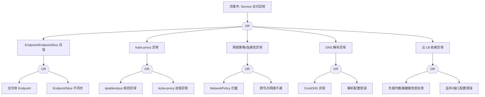

# Service 异常 FTA 树

## 适用范围与说明
- **目标**：覆盖 Service 访问不通、Endpoint 缺失与负载均衡异常的关键成因与路径。
- **范围**：Endpoint/EndpointSlice、kube-proxy、网络策略、DNS、云 LB 依赖。
- **符号**：
  - **OR 门**：任一子事件成立即可触发父事件
  - **AND 门**：所有子事件同时成立才触发父事件

---

## Mermaid FTA 树



---

## 生产级观测与证据
- **事件**：`No endpoints available`、连接超时、5xx。
- **关键指标**：`kube_endpoint_address_available`、`kube_endpoint_slice_address_available`、`kube_proxy_sync_proxy_rules_duration_seconds`。
- **关键日志**：`kube-proxy`、`coredns`、云 LB 日志。
- **配置核对**：Service 端口、Selector、EndpointSlice、NetworkPolicy、LB 配置。

---

## JSON 工作流（含与/或门控件）

```json
{
  "flow_steps": [
    { "name": "开始", "action": "start", "step": "start_svc_fta", "next_step": "event_svc_abnormal" },
    { "name": "顶事件: Service 访问异常", "action": "event", "step": "event_svc_abnormal", "description": "连接超时/无可用 Endpoint", "next_step": "gate_root_or" },
    { "name": "根因 OR 门", "action": "gate_or", "step": "gate_root_or", "control": "or_gate", "gate_type": "OR", "next_steps": ["cat_ep","cat_kp","cat_net","cat_dns","cat_lb"] }
  ]
}
```

---

## 版本适配（1.19–1.30）
- **1.19–1.23**：EndpointSlice 可能未默认启用，需同时覆盖 Endpoints 与 EndpointSlice。
- **1.24–1.27**：kube-proxy 与 ipvs/iptables 模式差异需注明。
- **1.28–1.30**：稳定 API 为主，LB 集成与审计链路需统一。
- **共性**：遵循 `fta_methodology_and_agentic_practices.md` 中的“版本适配基线”。
