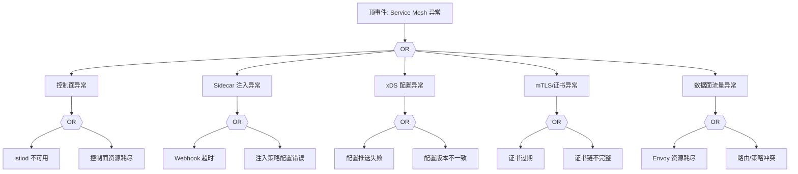

# Service Mesh（Istio）异常 FTA 树

## 适用范围与说明
- **目标**：覆盖 Istio 控制面不可用、Sidecar 注入失败与流量策略失效的关键成因与路径。
- **范围**：控制面组件、注入器、xDS 配置、mTLS 证书、数据面流量。
- **符号**：
  - **OR 门**：任一子事件成立即可触发父事件
  - **AND 门**：所有子事件同时成立才触发父事件

---

## Mermaid FTA 树



---

## 生产级观测与证据
- **事件**：注入失败、流量 5xx、策略不生效。
- **关键指标**：istiod 可用性、xDS 推送失败率、Envoy 错误率。
- **关键日志**：istiod、注入器、Envoy 日志。
- **配置核对**：Sidecar 注入配置、DestinationRule、VirtualService、证书与密钥。

---

## JSON 工作流（含与/或门控件）

```json
{
  "flow_steps": [
    { "name": "开始", "action": "start", "step": "start_istio_fta", "next_step": "event_istio_abnormal" },
    { "name": "顶事件: Service Mesh 异常", "action": "event", "step": "event_istio_abnormal", "description": "注入失败/流量异常", "next_step": "gate_root_or" },
    { "name": "根因 OR 门", "action": "gate_or", "step": "gate_root_or", "control": "or_gate", "gate_type": "OR", "next_steps": ["cat_cp","cat_inj","cat_xds","cat_mtls","cat_data"] }
  ]
}
```

---

## 版本适配（1.19–1.30）
- **1.19–1.23**：Istio 版本需与 K8s API 兼容，旧版注入 Webhook 可能不兼容。
- **1.24–1.27**：PSP 移除后需调整 Sidecar 安全策略；控制面版本需对齐。
- **1.28–1.30**：稳定 API 为主，策略与审计链路需统一。
- **共性**：遵循 `fta_methodology_and_agentic_practices.md` 中的“版本适配基线”。
