# Service Mesh（Istio）异常 FTA 树

## 适用范围与说明
- **目标**：覆盖 Istio 控制面不可用、Sidecar 注入失败、xDS 配置推送异常、mTLS 证书问题、数据面流量异常与多集群联邦故障的关键成因与路径。
- **范围**：istiod 控制面、Sidecar 注入器（MutatingWebhook）、xDS/Envoy 配置同步、mTLS 证书生命周期、VirtualService/DestinationRule 流量策略、Gateway、多集群/联邦。
- **符号**：
  - **OR 门**：任一子事件成立即可触发父事件
  - **AND 门**：所有子事件同时成立才触发父事件

---

## Mermaid FTA 树

```mermaid
flowchart TD
  TE["顶事件: Service Mesh 异常<br/>流量中断 / 注入失败 / 策略不生效"]
  OR0{{OR}}
  TE --> OR0

  %% ======== 一级分类 ========
  OR0 --> CAT_CP["A. 控制面（istiod）异常"]
  OR0 --> CAT_INJ["B. Sidecar 注入异常"]
  OR0 --> CAT_XDS["C. xDS 配置/推送异常"]
  OR0 --> CAT_MTLS["D. mTLS/证书异常"]
  OR0 --> CAT_DATA["E. 数据面流量异常"]
  OR0 --> CAT_MULTI["F. 多集群/联邦异常"]

  %% ======== A. 控制面 ========
  A_OR{{OR}}
  CAT_CP --> A_OR
  A_OR --> A1["A1. istiod Pod 不可用<br/>崩溃 / OOM / 调度失败"]
  A_OR --> A2["A2. istiod 资源耗尽<br/>CPU/内存/连接数"]
  A_OR --> A3["A3. istiod 版本不兼容<br/>与 K8s/Envoy 版本冲突"]
  A_OR --> A4["A4. 控制面证书过期<br/>CA 签发异常"]

  %% ======== B. Sidecar 注入 ========
  B_OR{{OR}}
  CAT_INJ --> B_OR
  B_OR --> B1["B1. Webhook 服务不可达<br/>istiod Service 异常"]
  B_OR --> B2["B2. Namespace 标签缺失<br/>istio-injection=enabled"]
  B_OR --> B3["B3. 注入策略冲突<br/>Sidecar 配置覆盖"]
  B_OR --> B4_AND["B4. 注入静默失败<br/>(AND 门)"]

  B4_AND_GATE{{"AND"}}
  B4_AND --> B4_AND_GATE
  B4_AND_GATE --> B4C1["Webhook failurePolicy=Ignore"]
  B4_AND_GATE --> B4C2["istiod 不可用"]

  %% ======== C. xDS 配置 ========
  C_OR{{OR}}
  CAT_XDS --> C_OR
  C_OR --> C1["C1. xDS 推送失败<br/>Envoy 拒绝配置"]
  C_OR --> C2["C2. 配置版本不一致<br/>Envoy 使用旧配置"]
  C_OR --> C3["C3. xDS 推送风暴<br/>大量配置变更"]
  C_OR --> C4["C4. Envoy 配置过大<br/>内存溢出"]
  C_OR --> C5_AND["C5. 配置推送延迟<br/>(AND 门)"]

  C5_AND_GATE{{"AND"}}
  C5_AND --> C5_AND_GATE
  C5_AND_GATE --> C5C1["Service/Endpoint 数量巨大"]
  C5_AND_GATE --> C5C2["istiod 资源不足处理不过来"]

  %% ======== D. mTLS/证书 ========
  D_OR{{OR}}
  CAT_MTLS --> D_OR
  D_OR --> D1["D1. 证书过期<br/>自动轮换失败"]
  D_OR --> D2["D2. 证书链不完整<br/>中间 CA 缺失"]
  D_OR --> D3["D3. mTLS 模式不匹配<br/>STRICT vs PERMISSIVE 冲突"]
  D_OR --> D4["D4. SDS 推送失败<br/>证书未送达 Envoy"]
  D_OR --> D5_AND["D5. mTLS 握手失败<br/>(AND 门)"]

  D5_AND_GATE{{"AND"}}
  D5_AND --> D5_AND_GATE
  D5_AND_GATE --> D5C1["PeerAuthentication 设为 STRICT"]
  D5_AND_GATE --> D5C2["对端未注入 Sidecar"]

  %% ======== E. 数据面流量 ========
  E_OR{{OR}}
  CAT_DATA --> E_OR
  E_OR --> E1["E1. VirtualService 路由错误<br/>匹配规则/权重问题"]
  E_OR --> E2["E2. DestinationRule 异常<br/>子集/负载均衡错误"]
  E_OR --> E3["E3. Envoy 资源耗尽<br/>连接数/内存/CPU"]
  E_OR --> E4["E4. 重试/超时配置不当<br/>重试风暴"]
  E_OR --> E5["E5. Gateway 配置错误<br/>入口流量异常"]

  %% ======== F. 多集群 ========
  F_OR{{OR}}
  CAT_MULTI --> F_OR
  F_OR --> F1["F1. 跨集群服务发现失败<br/>Remote Secret 异常"]
  F_OR --> F2["F2. 东西向网关不可达<br/>跨集群通信中断"]
  F_OR --> F3["F3. 信任域不一致<br/>跨集群 mTLS 失败"]
```



---

## 生产级观测与证据

| 类别 | 关键信号 |
|------|---------|
| **事件** | Sidecar 注入 Webhook 失败事件、Pod 创建事件（有/无 sidecar）、VirtualService/DestinationRule 配置事件 |
| **关键指标** | `pilot_xds_pushes{type="error"}`、`pilot_proxy_convergence_time`、`pilot_xds_push_time`、`pilot_conflict_inbound_listener`、`pilot_conflict_outbound_listener_http_over_current_tcp`、`envoy_cluster_upstream_rq_xx{code="5xx"}`、`istio_requests_total{response_code=~"5.."}`、`citadel_server_csr_count`、`citadel_server_csr_parsing_err_count`、`istiod_memory_used` |
| **关键日志** | istiod 日志（xDS push / certificate rotation / webhook）、Envoy access log（upstream_reset_before_response_started / TLS handshake error）、istio-proxy 容器日志 |
| **配置核对** | MeshConfig、IstioOperator、PeerAuthentication、AuthorizationPolicy、VirtualService、DestinationRule、Gateway、Sidecar 资源、MutatingWebhookConfiguration（istio-sidecar-injector） |

---

## JSON 工作流（含与/或门控件）

```json
{
  "flow_steps": [
    { "name": "开始", "action": "start", "step": "start_istio_fta", "next_step": "event_istio_abnormal" },
    { "name": "顶事件: Service Mesh 异常", "action": "event", "step": "event_istio_abnormal", "description": "流量中断 / 注入失败 / 策略不生效", "next_step": "gate_root_or" },
    { "name": "根因 OR 门", "action": "gate_or", "step": "gate_root_or", "control": "or_gate", "gate_type": "OR", "next_steps": ["cat_cp", "cat_inj", "cat_xds", "cat_mtls", "cat_data", "cat_multi"] },

    { "name": "A. 控制面（istiod）异常", "action": "category", "step": "cat_cp", "next_step": "gate_cp_or" },
    { "name": "控制面 OR 门", "action": "gate_or", "step": "gate_cp_or", "control": "or_gate", "gate_type": "OR", "next_steps": ["event_istiod_down", "event_istiod_resource", "event_istiod_version", "event_istiod_ca_expired"] },

    {
      "name": "A1. istiod Pod 不可用", "action": "bottom_event", "step": "event_istiod_down",
      "description": "istiod Pod 崩溃、OOM 或无法调度，控制面完全不可用",
      "next_step": "end",
      "metadata": {
        "severity": "critical",
        "probability": "low",
        "mttr_minutes": 10,
        "detection": {
          "events": ["CrashLoopBackOff (istiod)", "OOMKilled"],
          "metrics": ["kube_pod_container_status_restarts_total{container='discovery'}", "up{job='istiod'} == 0"],
          "logs": ["panic:", "signal: killed", "failed to start gRPC server"]
        },
        "remediation": {
          "manual_steps": ["检查 istiod Pod 日志: kubectl logs -n istio-system deploy/istiod", "确认资源限制是否足够", "检查 istiod 配置: IstioOperator / MeshConfig", "确认 K8s API Server 可达"],
          "auto_actions": ["Deployment 自动重启"]
        },
        "version_notes": ""
      }
    },
    {
      "name": "A2. istiod 资源耗尽", "action": "bottom_event", "step": "event_istiod_resource",
      "description": "istiod CPU/内存/gRPC 连接数耗尽，xDS 推送延迟或失败",
      "next_step": "end",
      "metadata": {
        "severity": "high",
        "probability": "medium",
        "mttr_minutes": 15,
        "detection": {
          "events": ["istiod 响应慢"],
          "metrics": ["container_memory_working_set_bytes{container='discovery'}", "pilot_xds_push_time > 30s", "pilot_xds_pushes{type='error'}"],
          "logs": ["context deadline exceeded", "slow xDS push"]
        },
        "remediation": {
          "manual_steps": ["增大 istiod 资源限制", "增加 istiod 副本数（HPA）", "使用 Sidecar 资源限制 xDS 推送范围", "减少 ServiceEntry 数量"],
          "auto_actions": ["配置 istiod HPA"]
        },
        "version_notes": ""
      }
    },
    {
      "name": "A3. istiod 版本不兼容", "action": "bottom_event", "step": "event_istiod_version",
      "description": "Istio 版本与 K8s 版本或数据面 Envoy 版本不兼容",
      "next_step": "end",
      "metadata": {
        "severity": "high",
        "probability": "low",
        "mttr_minutes": 30,
        "detection": {
          "events": ["istioctl version 显示版本不匹配"],
          "metrics": ["istio_build{component='pilot'}"],
          "logs": ["unsupported Kubernetes version", "xDS protocol version mismatch"]
        },
        "remediation": {
          "manual_steps": ["检查 Istio 支持矩阵: https://istio.io/latest/docs/releases/supported-releases/", "升级或降级 Istio 版本", "确保数据面代理版本与控制面版本差不超过 1 个小版本"],
          "auto_actions": []
        },
        "version_notes": "Istio 版本与 K8s 版本有明确的兼容矩阵"
      }
    },
    {
      "name": "A4. 控制面证书过期", "action": "bottom_event", "step": "event_istiod_ca_expired",
      "description": "istiod 根 CA 或中间 CA 证书过期，无法签发新的工作负载证书",
      "next_step": "end",
      "metadata": {
        "severity": "critical",
        "probability": "low",
        "mttr_minutes": 30,
        "detection": {
          "events": ["证书签发失败"],
          "metrics": ["citadel_server_csr_parsing_err_count 增长", "istio-proxy 日志中 TLS 握手失败"],
          "logs": ["certificate has expired", "failed to sign certificate"]
        },
        "remediation": {
          "manual_steps": ["检查 CA 证书有效期: istioctl pc secret <pod>", "轮换根证书: 参考 Istio 文档 Root CA rotation", "使用外部 CA（cert-manager / Vault）管理证书", "重启 istiod 触发重新签发"],
          "auto_actions": []
        },
        "version_notes": "Istio 1.10+ 支持外部 CA 集成"
      }
    },

    { "name": "B. Sidecar 注入异常", "action": "category", "step": "cat_inj", "next_step": "gate_inj_or" },
    { "name": "注入 OR 门", "action": "gate_or", "step": "gate_inj_or", "control": "or_gate", "gate_type": "OR", "next_steps": ["event_wh_unreachable", "event_ns_label_missing", "event_inject_policy", "event_inject_silent_fail"] },

    {
      "name": "B1. Webhook 服务不可达", "action": "bottom_event", "step": "event_wh_unreachable",
      "description": "istiod 注入 Webhook Service 后端不可达，Pod 创建被阻断",
      "next_step": "end",
      "metadata": {
        "severity": "critical",
        "probability": "low",
        "mttr_minutes": 10,
        "detection": {
          "events": ["failed calling webhook: connection refused"],
          "metrics": ["apiserver_admission_webhook_fail_open_count"],
          "logs": ["dial tcp: connection refused", "Internal error occurred: failed calling webhook"]
        },
        "remediation": {
          "manual_steps": ["确认 istiod Pod 运行且 Ready", "检查 istio-system namespace 中 istiod Service", "检查 NetworkPolicy 是否阻断 API Server → istiod", "检查 Webhook caBundle 是否正确"],
          "auto_actions": []
        },
        "version_notes": ""
      }
    },
    {
      "name": "B2. Namespace 标签缺失", "action": "bottom_event", "step": "event_ns_label_missing",
      "description": "目标 Namespace 未添加 istio-injection=enabled 或 istio.io/rev 标签",
      "next_step": "end",
      "metadata": {
        "severity": "medium",
        "probability": "common",
        "mttr_minutes": 5,
        "detection": {
          "events": ["Pod 创建后无 sidecar 容器"],
          "metrics": [],
          "logs": ["kubectl get ns <ns> --show-labels 无 istio 标签"]
        },
        "remediation": {
          "manual_steps": ["kubectl label namespace <ns> istio-injection=enabled", "或使用 revision 标签: kubectl label namespace <ns> istio.io/rev=<revision>", "重新创建 Pod 使注入生效"],
          "auto_actions": []
        },
        "version_notes": "Istio 1.12+ 推荐使用 istio.io/rev 标签替代 istio-injection"
      }
    },
    {
      "name": "B3. 注入策略冲突", "action": "bottom_event", "step": "event_inject_policy",
      "description": "Pod annotation (sidecar.istio.io/inject=false) 或 Sidecar 资源配置覆盖了注入",
      "next_step": "end",
      "metadata": {
        "severity": "medium",
        "probability": "medium",
        "mttr_minutes": 10,
        "detection": {
          "events": ["Pod 无 sidecar 但 Namespace 已启用注入"],
          "metrics": [],
          "logs": ["injection skipped: annotation sidecar.istio.io/inject=false"]
        },
        "remediation": {
          "manual_steps": ["检查 Pod/Deployment annotation: sidecar.istio.io/inject", "检查 Sidecar 资源是否限制了注入", "使用 istioctl analyze 检查配置一致性"],
          "auto_actions": []
        },
        "version_notes": ""
      }
    },
    {
      "name": "B4. 注入静默失败 (AND)", "action": "gate_and", "step": "event_inject_silent_fail",
      "control": "and_gate", "gate_type": "AND",
      "conditions": ["Webhook failurePolicy 设为 Ignore", "istiod 不可用"],
      "combined_severity": "critical",
      "description": "istiod 不可用时 Webhook 静默跳过注入，Pod 正常创建但无 sidecar，流量脱离 Mesh",
      "next_steps": ["event_failure_policy_ignore", "event_istiod_unavailable"],
      "metadata": {
        "severity": "critical",
        "probability": "low",
        "mttr_minutes": 20,
        "detection": {
          "events": ["新创建的 Pod 缺少 istio-proxy 容器"],
          "metrics": ["istio_requests_total 对应 workload 突然消失"],
          "logs": ["webhook failed open"]
        },
        "remediation": {
          "manual_steps": ["恢复 istiod 可用性", "将 failurePolicy 改为 Fail（注意对可用性的影响）", "识别并重启所有缺失 sidecar 的 Pod", "配置告警: 检测 Pod 创建时无 sidecar"],
          "auto_actions": []
        },
        "version_notes": "生产环境建议 failurePolicy=Fail 配合 istiod HA"
      }
    },
    { "name": "Webhook failurePolicy=Ignore", "action": "and_condition", "step": "event_failure_policy_ignore", "next_step": "end" },
    { "name": "istiod 不可用", "action": "and_condition", "step": "event_istiod_unavailable", "next_step": "end" },

    { "name": "C. xDS 配置/推送异常", "action": "category", "step": "cat_xds", "next_step": "gate_xds_or" },
    { "name": "xDS OR 门", "action": "gate_or", "step": "gate_xds_or", "control": "or_gate", "gate_type": "OR", "next_steps": ["event_xds_push_fail", "event_xds_version_mismatch", "event_xds_push_storm", "event_envoy_config_oom", "event_xds_push_delay"] },

    {
      "name": "C1. xDS 推送失败", "action": "bottom_event", "step": "event_xds_push_fail",
      "description": "istiod 推送配置被 Envoy 拒绝，存在配置冲突或语法错误",
      "next_step": "end",
      "metadata": {
        "severity": "high",
        "probability": "medium",
        "mttr_minutes": 15,
        "detection": {
          "events": ["Envoy 配置推送 NACK"],
          "metrics": ["pilot_xds_pushes{type='error'}", "pilot_total_xds_rejects"],
          "logs": ["xDS push error", "NACK", "rejected by Envoy"]
        },
        "remediation": {
          "manual_steps": ["istioctl proxy-status 查看配置同步状态", "istioctl analyze 检查配置冲突", "检查 VirtualService/DestinationRule 语法", "istioctl proxy-config <cluster/listener/route> <pod> 查看实际配置"],
          "auto_actions": []
        },
        "version_notes": ""
      }
    },
    {
      "name": "C2. 配置版本不一致", "action": "bottom_event", "step": "event_xds_version_mismatch",
      "description": "部分 Envoy 使用旧版配置，与当前策略不一致",
      "next_step": "end",
      "metadata": {
        "severity": "high",
        "probability": "medium",
        "mttr_minutes": 15,
        "detection": {
          "events": [],
          "metrics": ["pilot_proxy_convergence_time > 30s"],
          "logs": ["proxy out of sync"]
        },
        "remediation": {
          "manual_steps": ["istioctl proxy-status 检查 SYNCED/STALE 状态", "重启 stale 状态的 Pod", "检查 istiod 到 Envoy 的 gRPC 连接稳定性", "增大 istiod 资源或副本数"],
          "auto_actions": []
        },
        "version_notes": ""
      }
    },
    {
      "name": "C3. xDS 推送风暴", "action": "bottom_event", "step": "event_xds_push_storm",
      "description": "大量 Service/Endpoint 变更触发级联 xDS 推送，istiod 和 Envoy 负载飙升",
      "next_step": "end",
      "metadata": {
        "severity": "high",
        "probability": "medium",
        "mttr_minutes": 20,
        "detection": {
          "events": [],
          "metrics": ["pilot_xds_push_time 峰值", "pilot_xds_pushes 频率骤增", "istiod CPU/内存飙升"],
          "logs": ["debounce: full push"]
        },
        "remediation": {
          "manual_steps": ["使用 Sidecar 资源限制每个 namespace 的可见性范围", "增大 push debounce 时间", "减少不必要的 ServiceEntry", "使用 exportTo 限制配置传播范围"],
          "auto_actions": []
        },
        "version_notes": ""
      }
    },
    {
      "name": "C4. Envoy 配置过大", "action": "bottom_event", "step": "event_envoy_config_oom",
      "description": "集群 Service/Endpoint 过多导致 Envoy 配置膨胀，sidecar OOM",
      "next_step": "end",
      "metadata": {
        "severity": "high",
        "probability": "medium",
        "mttr_minutes": 20,
        "detection": {
          "events": ["OOMKilled (istio-proxy)"],
          "metrics": ["container_memory_working_set_bytes{container='istio-proxy'}", "envoy_server_total_connections"],
          "logs": ["signal: killed (istio-proxy)"]
        },
        "remediation": {
          "manual_steps": ["使用 Sidecar 资源声明每个 workload 需要访问的服务列表", "增大 istio-proxy 内存限制", "减少集群 Service/Endpoint 总数", "使用 exportTo 限制配置范围"],
          "auto_actions": []
        },
        "version_notes": "Istio 1.22+ ambient mode 可消除 sidecar 开销"
      }
    },
    {
      "name": "C5. 配置推送延迟 (AND)", "action": "gate_and", "step": "event_xds_push_delay",
      "control": "and_gate", "gate_type": "AND",
      "conditions": ["Service/Endpoint 数量巨大（数千+）", "istiod 资源不足无法及时处理"],
      "combined_severity": "high",
      "description": "配置变更后需要很长时间才能传播到所有 Envoy，期间流量可能路由到旧后端",
      "next_steps": ["event_large_scale_svc", "event_istiod_under_resourced"],
      "metadata": {
        "severity": "high",
        "probability": "medium",
        "mttr_minutes": 20,
        "detection": {
          "events": [],
          "metrics": ["pilot_proxy_convergence_time > 60s", "pilot_xds_push_time > 30s"],
          "logs": ["slow xDS push", "push debounce"]
        },
        "remediation": {
          "manual_steps": ["增大 istiod 资源和副本数", "使用 Sidecar 资源限制 xDS 推送范围", "启用增量 xDS (delta xDS)", "考虑拆分为多个 Mesh"],
          "auto_actions": []
        },
        "version_notes": "Delta xDS 在 Istio 1.18+ 稳定"
      }
    },
    { "name": "Service/Endpoint 数量巨大", "action": "and_condition", "step": "event_large_scale_svc", "next_step": "end" },
    { "name": "istiod 资源不足", "action": "and_condition", "step": "event_istiod_under_resourced", "next_step": "end" },

    { "name": "D. mTLS/证书异常", "action": "category", "step": "cat_mtls", "next_step": "gate_mtls_or" },
    { "name": "mTLS OR 门", "action": "gate_or", "step": "gate_mtls_or", "control": "or_gate", "gate_type": "OR", "next_steps": ["event_cert_expired", "event_cert_chain_broken", "event_mtls_mode_mismatch", "event_sds_push_fail", "event_mtls_handshake_fail"] },

    {
      "name": "D1. 证书过期", "action": "bottom_event", "step": "event_cert_expired",
      "description": "工作负载证书或根 CA 过期，Envoy 间 TLS 握手失败",
      "next_step": "end",
      "metadata": {
        "severity": "critical",
        "probability": "low",
        "mttr_minutes": 15,
        "detection": {
          "events": ["TLS handshake failed"],
          "metrics": ["citadel_server_csr_count 下降", "istio_requests_total{response_code='503'}"],
          "logs": ["certificate has expired or is not yet valid", "TLS error: certificate verify failed"]
        },
        "remediation": {
          "manual_steps": ["istioctl pc secret <pod> 检查证书有效期", "重启 istiod 触发证书重新签发", "如根 CA 过期，执行根证书轮换流程", "重启受影响的工作负载 Pod"],
          "auto_actions": ["Istio 自动证书轮换（默认 24h）"]
        },
        "version_notes": ""
      }
    },
    {
      "name": "D2. 证书链不完整", "action": "bottom_event", "step": "event_cert_chain_broken",
      "description": "使用外部 CA 时证书链不完整，缺少中间证书",
      "next_step": "end",
      "metadata": {
        "severity": "critical",
        "probability": "low",
        "mttr_minutes": 20,
        "detection": {
          "events": ["TLS 握手失败"],
          "metrics": ["istio_requests_total{response_code='503'} 飙升"],
          "logs": ["unable to verify the first certificate", "certificate chain too short"]
        },
        "remediation": {
          "manual_steps": ["检查 cacerts Secret 中证书链完整性", "确认包含: root-cert.pem + ca-cert.pem + cert-chain.pem + ca-key.pem", "使用 openssl verify 验证证书链", "参考 Istio 文档: Plugging External CA"],
          "auto_actions": []
        },
        "version_notes": ""
      }
    },
    {
      "name": "D3. mTLS 模式不匹配", "action": "bottom_event", "step": "event_mtls_mode_mismatch",
      "description": "PeerAuthentication 设置的 mTLS 模式在不同服务间不一致",
      "next_step": "end",
      "metadata": {
        "severity": "high",
        "probability": "common",
        "mttr_minutes": 10,
        "detection": {
          "events": ["503 错误增多"],
          "metrics": ["istio_requests_total{response_code='503',response_flags='UF'}"],
          "logs": ["upstream connect error or disconnect/reset before headers", "TLS mismatch"]
        },
        "remediation": {
          "manual_steps": ["istioctl authn tls-check <pod> 检查 mTLS 状态", "统一 PeerAuthentication 策略（推荐全局 STRICT）", "过渡期使用 PERMISSIVE 模式", "检查 DestinationRule trafficPolicy.tls.mode 是否匹配"],
          "auto_actions": []
        },
        "version_notes": ""
      }
    },
    {
      "name": "D4. SDS 推送失败", "action": "bottom_event", "step": "event_sds_push_fail",
      "description": "Secret Discovery Service 未能将证书推送到 Envoy，使用过期证书",
      "next_step": "end",
      "metadata": {
        "severity": "high",
        "probability": "low",
        "mttr_minutes": 15,
        "detection": {
          "events": [],
          "metrics": ["citadel_server_csr_count", "pilot_xds_pushes{type='error'}"],
          "logs": ["failed to push SDS", "secret not found"]
        },
        "remediation": {
          "manual_steps": ["重启 istio-proxy 触发重新获取证书", "检查 istiod 到 Pod 的 gRPC 连接", "确认 istiod CA 功能正常", "istioctl pc secret <pod> 查看证书状态"],
          "auto_actions": []
        },
        "version_notes": ""
      }
    },
    {
      "name": "D5. mTLS 握手失败 (AND)", "action": "gate_and", "step": "event_mtls_handshake_fail",
      "control": "and_gate", "gate_type": "AND",
      "conditions": ["PeerAuthentication 设为 STRICT", "对端服务未注入 Sidecar（无 mTLS 能力）"],
      "combined_severity": "critical",
      "description": "STRICT 模式要求 mTLS，但对端无 Sidecar 无法建立 TLS 连接，通信完全中断",
      "next_steps": ["event_strict_mode", "event_no_sidecar_peer"],
      "metadata": {
        "severity": "critical",
        "probability": "medium",
        "mttr_minutes": 10,
        "detection": {
          "events": ["503/Connection reset"],
          "metrics": ["istio_requests_total{response_code='503',response_flags='UF'}"],
          "logs": ["connection termination: TLS error", "upstream connect error"]
        },
        "remediation": {
          "manual_steps": ["为对端服务启用 Sidecar 注入", "或将对端的 PeerAuthentication 设为 PERMISSIVE", "使用 DestinationRule 对特定服务禁用 mTLS", "istioctl analyze 检查策略冲突"],
          "auto_actions": []
        },
        "version_notes": ""
      }
    },
    { "name": "PeerAuthentication STRICT 模式", "action": "and_condition", "step": "event_strict_mode", "next_step": "end" },
    { "name": "对端未注入 Sidecar", "action": "and_condition", "step": "event_no_sidecar_peer", "next_step": "end" },

    { "name": "E. 数据面流量异常", "action": "category", "step": "cat_data", "next_step": "gate_data_or" },
    { "name": "数据面 OR 门", "action": "gate_or", "step": "gate_data_or", "control": "or_gate", "gate_type": "OR", "next_steps": ["event_vs_route_error", "event_dr_error", "event_envoy_resource", "event_retry_storm", "event_gw_config_error"] },

    {
      "name": "E1. VirtualService 路由错误", "action": "bottom_event", "step": "event_vs_route_error",
      "description": "VirtualService 匹配规则或权重配置错误，流量路由到错误后端",
      "next_step": "end",
      "metadata": {
        "severity": "high",
        "probability": "common",
        "mttr_minutes": 10,
        "detection": {
          "events": ["流量到达非预期后端"],
          "metrics": ["istio_requests_total 按 destination 分布异常"],
          "logs": ["route not found", "no healthy upstream"]
        },
        "remediation": {
          "manual_steps": ["istioctl proxy-config route <pod> 查看路由规则", "检查 VirtualService 的 match 条件和 route 配置", "确认 hosts 字段与 Service 名匹配", "istioctl analyze 验证配置"],
          "auto_actions": []
        },
        "version_notes": ""
      }
    },
    {
      "name": "E2. DestinationRule 异常", "action": "bottom_event", "step": "event_dr_error",
      "description": "DestinationRule 子集定义不正确或负载均衡配置错误",
      "next_step": "end",
      "metadata": {
        "severity": "high",
        "probability": "medium",
        "mttr_minutes": 15,
        "detection": {
          "events": ["503 错误 / no healthy upstream"],
          "metrics": ["envoy_cluster_upstream_rq_xx{code='503'}"],
          "logs": ["no healthy upstream", "cluster not found"]
        },
        "remediation": {
          "manual_steps": ["istioctl proxy-config cluster <pod> 查看集群配置", "确认 DestinationRule subset 标签与 Pod 标签匹配", "检查 connectionPool / outlierDetection 配置", "确认 DestinationRule 与 VirtualService 的 host 一致"],
          "auto_actions": []
        },
        "version_notes": ""
      }
    },
    {
      "name": "E3. Envoy 资源耗尽", "action": "bottom_event", "step": "event_envoy_resource",
      "description": "istio-proxy（Envoy）连接数、内存或 CPU 耗尽，导致流量处理异常",
      "next_step": "end",
      "metadata": {
        "severity": "high",
        "probability": "medium",
        "mttr_minutes": 15,
        "detection": {
          "events": ["503 / connection reset"],
          "metrics": ["envoy_server_total_connections", "envoy_server_memory_allocated", "container_cpu_usage_seconds_total{container='istio-proxy'}"],
          "logs": ["too many connections", "overloaded", "circuit breaker triggered"]
        },
        "remediation": {
          "manual_steps": ["增大 istio-proxy 资源限制", "调整 connectionPool 参数（maxConnections / maxPendingRequests）", "检查是否存在连接泄漏", "使用 Sidecar 资源减少 Envoy 监听范围"],
          "auto_actions": []
        },
        "version_notes": ""
      }
    },
    {
      "name": "E4. 重试/超时配置不当", "action": "bottom_event", "step": "event_retry_storm",
      "description": "过于激进的重试配置导致重试风暴，放大后端故障",
      "next_step": "end",
      "metadata": {
        "severity": "high",
        "probability": "medium",
        "mttr_minutes": 15,
        "detection": {
          "events": ["后端服务过载"],
          "metrics": ["envoy_cluster_upstream_rq_retry 大幅增长", "istio_requests_total 远超预期"],
          "logs": ["upstream retry"]
        },
        "remediation": {
          "manual_steps": ["审查 VirtualService retries 配置", "设置合理的 retryOn / attempts / perTryTimeout", "配置 retryBudget 限制重试比例", "使用 outlierDetection 而非仅靠重试"],
          "auto_actions": []
        },
        "version_notes": ""
      }
    },
    {
      "name": "E5. Gateway 配置错误", "action": "bottom_event", "step": "event_gw_config_error",
      "description": "Istio Gateway 资源配置错误导致入口流量无法路由",
      "next_step": "end",
      "metadata": {
        "severity": "critical",
        "probability": "medium",
        "mttr_minutes": 15,
        "detection": {
          "events": ["外部访问 503/404"],
          "metrics": ["istio_requests_total{reporter='destination',destination_service='istio-ingressgateway'}"],
          "logs": ["no route found", "route not found"]
        },
        "remediation": {
          "manual_steps": ["检查 Gateway 资源: hosts / port / protocol 配置", "确认 VirtualService 绑定到正确的 Gateway", "istioctl proxy-config listener <gateway-pod> 验证", "检查 TLS 证书是否正确挂载"],
          "auto_actions": []
        },
        "version_notes": "Istio 1.22+ 支持 K8s Gateway API 替代 Istio Gateway"
      }
    },

    { "name": "F. 多集群/联邦异常", "action": "category", "step": "cat_multi", "next_step": "gate_multi_or" },
    { "name": "多集群 OR 门", "action": "gate_or", "step": "gate_multi_or", "control": "or_gate", "gate_type": "OR", "next_steps": ["event_remote_secret", "event_ew_gateway", "event_trust_domain"] },

    {
      "name": "F1. 跨集群服务发现失败", "action": "bottom_event", "step": "event_remote_secret",
      "description": "Remote Secret 配置错误或过期，istiod 无法发现远端集群的 Service",
      "next_step": "end",
      "metadata": {
        "severity": "high",
        "probability": "low",
        "mttr_minutes": 20,
        "detection": {
          "events": ["远端服务不可达"],
          "metrics": ["pilot_xds_pushes{type='error'} 相关远端集群"],
          "logs": ["failed to list services from remote cluster", "remote cluster unreachable"]
        },
        "remediation": {
          "manual_steps": ["检查 istio-system/istio-remote-secret-* Secret", "确认远端集群 kubeconfig 有效", "测试远端 API Server 连通性", "重新创建: istioctl create-remote-secret"],
          "auto_actions": []
        },
        "version_notes": ""
      }
    },
    {
      "name": "F2. 东西向网关不可达", "action": "bottom_event", "step": "event_ew_gateway",
      "description": "跨集群东西向网关（eastwest gateway）不可达，跨集群通信中断",
      "next_step": "end",
      "metadata": {
        "severity": "critical",
        "probability": "low",
        "mttr_minutes": 20,
        "detection": {
          "events": ["跨集群服务 503"],
          "metrics": ["istio_requests_total{response_code='503',destination_cluster='remote'}"],
          "logs": ["upstream connect error", "connection timeout to eastwest gateway"]
        },
        "remediation": {
          "manual_steps": ["检查东西向网关 Pod 和 Service 状态", "确认 LoadBalancer IP 可达", "检查防火墙/安全组规则", "确认 DNS 解析正确"],
          "auto_actions": []
        },
        "version_notes": ""
      }
    },
    {
      "name": "F3. 信任域不一致", "action": "bottom_event", "step": "event_trust_domain",
      "description": "多集群间 trust domain 不同导致 mTLS 互信失败",
      "next_step": "end",
      "metadata": {
        "severity": "critical",
        "probability": "low",
        "mttr_minutes": 30,
        "detection": {
          "events": ["跨集群 TLS 握手失败"],
          "metrics": ["istio_requests_total{response_code='503',response_flags='UF'}"],
          "logs": ["certificate verify failed", "trust domain mismatch"]
        },
        "remediation": {
          "manual_steps": ["确认所有集群使用相同 trust domain", "或配置 trust domain aliases", "使用共享根 CA", "参考 Istio 多集群安全文档"],
          "auto_actions": []
        },
        "version_notes": ""
      }
    },

    { "name": "结束", "action": "end", "step": "end" }
  ]
}
```

---

## 版本适配（1.19–1.30）

| 版本范围 | 关键变化 |
|---------|---------|
| **1.19–1.21** | Istio 1.10–1.12 对应支持；Sidecar 注入使用 MutatingWebhook v1 |
| **1.22** | 移除 `admissionregistration.k8s.io/v1beta1`；Istio 版本需 1.11+ |
| **1.23–1.24** | PSP 移除后 Sidecar 安全上下文需调整；Istio 1.14+ 支持 |
| **1.25** | PodSecurity Admission 替代 PSP，Istio sidecar 需配置合适的 security context |
| **1.26–1.27** | K8s Gateway API 逐步成熟（Istio 1.17+ 支持）；ambient mode alpha |
| **1.28–1.30** | Gateway API v1 GA（Istio 1.22+）；ambient mode beta；delta xDS 稳定 |
| **共性** | 遵循 `fta-methodology-and-agentic-practices.md` 中的"版本适配基线"；Istio 版本与 K8s 版本有严格兼容矩阵 |
