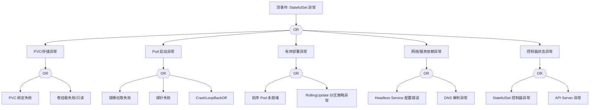

# StatefulSet 异常 FTA 树

## 适用范围与说明
- **目标**：覆盖 StatefulSet Pod 启动失败、序号错乱与持久化异常的关键成因与路径。
- **范围**：有序部署、PVC 绑定、存储与网络、镜像与探针、控制器状态。
- **符号**：
  - **OR 门**：任一子事件成立即可触发父事件
  - **AND 门**：所有子事件同时成立才触发父事件

---

## Mermaid FTA 树



---

## 生产级观测与证据
- **事件**：`FailedCreate`、`FailedMount`、`FailedScheduling`、`Unhealthy`。
- **关键指标**：`kube_statefulset_status_replicas`、`kube_statefulset_status_replicas_ready`、`kube_persistentvolumeclaim_status_phase`。
- **关键日志**：`kube-controller-manager`、`kubelet`、CSI 日志。
- **配置核对**：`volumeClaimTemplates`、滚动策略、Headless Service、资源请求。

---

## JSON 工作流（含与/或门控件）

```json
{
  "flow_steps": [
    { "name": "开始", "action": "start", "step": "start_sts_fta", "next_step": "event_sts_abnormal" },
    { "name": "顶事件: StatefulSet 异常", "action": "event", "step": "event_sts_abnormal", "description": "Pod 未就绪/有序部署卡住", "next_step": "gate_root_or" },
    { "name": "根因 OR 门", "action": "gate_or", "step": "gate_root_or", "control": "or_gate", "gate_type": "OR", "next_steps": ["cat_pvc","cat_pod","cat_order","cat_net","cat_ctrl"] }
  ]
}
```

---

## 版本适配（1.19–1.30）
- **1.19–1.23**：关注 PVC 绑定与 Headless Service 解析路径差异；旧版 CSI 事件需补充。
- **1.24–1.27**：容器运行时切换后，挂载日志路径需更新为 `containerd` 相关。
- **1.28–1.30**：仅保留稳定 API，滚动策略与分区字段需校验。
- **共性**：遵循 `fta_methodology_and_agentic_practices.md` 中的“版本适配基线”。
