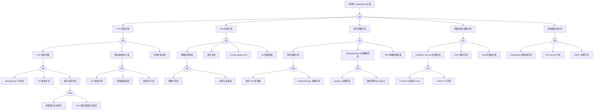

# StatefulSet 异常 FTA 树

## 适用范围与说明
- **目标**：覆盖 StatefulSet Pod 启动失败、序号错乱与持久化异常的关键成因与路径。
- **范围**：有序部署、PVC 绑定、存储与网络、镜像与探针、控制器状态。
- **符号**：
  - **OR 门**：任一子事件成立即可触发父事件
  - **AND 门**：所有子事件同时成立才触发父事件

---

## Mermaid FTA 树



---

## 生产级观测与证据
- **事件**：`FailedCreate`、`FailedMount`、`FailedScheduling`、`Unhealthy`、`ProvisioningFailed`。
- **关键指标**：`kube_statefulset_status_replicas`、`kube_statefulset_status_replicas_ready`、`kube_statefulset_status_replicas_current`、`kube_persistentvolumeclaim_status_phase`。
- **关键日志**：`kube-controller-manager`、`kubelet`、CSI 日志、etcd 日志（如果是 etcd StatefulSet）。
- **配置核对**：`volumeClaimTemplates`、滚动策略、Headless Service、资源请求、podManagementPolicy。

---

## JSON 工作流（含与/或门控件）

```json
{
  "flow_steps": [
    { "name": "开始", "action": "start", "step": "start_sts_fta", "next_step": "event_sts_abnormal" },
    { "name": "顶事件: StatefulSet 异常", "action": "event", "step": "event_sts_abnormal", "description": "Pod 未就绪/有序部署卡住/PVC 异常", "next_step": "gate_root_or" },
    { "name": "根因 OR 门", "action": "gate_or", "step": "gate_root_or", "control": "or_gate", "gate_type": "OR", "next_steps": ["cat_pvc", "cat_pod", "cat_order", "cat_net", "cat_ctrl"] },

    { "name": "PVC/存储异常", "action": "event", "step": "cat_pvc", "description": "持久化存储问题", "next_step": "gate_pvc_or" },
    { "name": "PVC OR 门", "action": "gate_or", "step": "gate_pvc_or", "control": "or_gate", "gate_type": "OR", "next_steps": ["evt_pvc_bind_fail", "evt_mount_fail", "evt_expand_fail"] },

    { "name": "PVC 绑定失败", "action": "event", "step": "evt_pvc_bind_fail", "description": "PVC 无法绑定 PV", "next_step": "gate_pvc_bind_or" },
    { "name": "PVC 绑定 OR 门", "action": "gate_or", "step": "gate_pvc_bind_or", "control": "or_gate", "gate_type": "OR", "next_steps": ["evt_sc_missing", "evt_pv_insufficient", "evt_topo_conflict"] },
    {
      "name": "StorageClass 不存在",
      "action": "event",
      "step": "evt_sc_missing",
      "severity": "critical",
      "probability": "medium",
      "mttr_minutes": 10,
      "detection": {
        "events": ["ProvisioningFailed"],
        "metrics": ["kube_persistentvolumeclaim_status_phase{phase='Pending'}"],
        "logs": ["storageclass not found"]
      },
      "remediation": {
        "manual_steps": ["检查 StorageClass 是否存在", "验证 volumeClaimTemplates 配置"],
        "auto_actions": ["创建 StorageClass"]
      }
    },
    {
      "name": "PV 容量不足",
      "action": "event",
      "step": "evt_pv_insufficient",
      "severity": "high",
      "probability": "medium",
      "mttr_minutes": 20,
      "detection": {
        "events": ["ProvisioningFailed"],
        "metrics": ["kube_persistentvolume_status_phase"],
        "logs": ["no persistent volumes available", "insufficient capacity"]
      },
      "remediation": {
        "manual_steps": ["检查存储后端容量", "扩展存储池"],
        "auto_actions": ["触发存储扩容"]
      }
    },
    {
      "name": "拓扑约束冲突",
      "action": "event",
      "step": "evt_topo_conflict",
      "severity": "high",
      "probability": "medium",
      "mttr_minutes": 20,
      "detection": {
        "events": ["FailedScheduling"],
        "metrics": [],
        "logs": ["volume node affinity conflict"]
      },
      "remediation": {
        "manual_steps": ["检查 PV 拓扑约束", "验证 Pod 调度节点"],
        "auto_actions": ["调整拓扑配置"]
      },
      "next_step": "gate_topo_and"
    },
    { "name": "拓扑 AND 门", "action": "gate_and", "step": "gate_topo_and", "control": "and_gate", "gate_type": "AND", "next_steps": ["evt_sc_no_topo", "evt_pod_wrong_zone"] },
    {
      "name": "存储类不支持拓扑",
      "action": "event",
      "step": "evt_sc_no_topo",
      "severity": "medium",
      "probability": "medium",
      "mttr_minutes": 15,
      "detection": {
        "events": [],
        "metrics": [],
        "logs": []
      },
      "remediation": {
        "manual_steps": ["使用支持 WaitForFirstConsumer 的 StorageClass"],
        "auto_actions": ["更新 StorageClass"]
      }
    },
    {
      "name": "Pod 调度到错误可用区",
      "action": "event",
      "step": "evt_pod_wrong_zone",
      "severity": "medium",
      "probability": "medium",
      "mttr_minutes": 15,
      "detection": {
        "events": [],
        "metrics": [],
        "logs": []
      },
      "remediation": {
        "manual_steps": ["添加 topologySpreadConstraints", "配置 volumeBindingMode"],
        "auto_actions": ["重新调度 Pod"]
      }
    },

    { "name": "卷挂载失败/只读", "action": "event", "step": "evt_mount_fail", "description": "卷挂载问题", "next_step": "gate_mount_or" },
    { "name": "挂载 OR 门", "action": "gate_or", "step": "gate_mount_or", "control": "or_gate", "gate_type": "OR", "next_steps": ["evt_csi_fail", "evt_mount_perm", "evt_vol_corrupt"] },
    {
      "name": "CSI 驱动异常",
      "action": "event",
      "step": "evt_csi_fail",
      "severity": "critical",
      "probability": "medium",
      "mttr_minutes": 20,
      "detection": {
        "events": ["FailedMount", "FailedAttachVolume"],
        "metrics": [],
        "logs": ["csi: failed to", "driver not found"]
      },
      "remediation": {
        "manual_steps": ["检查 CSI 驱动 Pod 状态", "验证 CSI 配置"],
        "auto_actions": ["重启 CSI 驱动"]
      }
    },
    {
      "name": "挂载权限错误",
      "action": "event",
      "step": "evt_mount_perm",
      "severity": "high",
      "probability": "medium",
      "mttr_minutes": 15,
      "detection": {
        "events": ["FailedMount"],
        "metrics": [],
        "logs": ["permission denied", "read-only file system"]
      },
      "remediation": {
        "manual_steps": ["检查 fsGroup 和 securityContext", "验证存储权限"],
        "auto_actions": ["调整权限配置"]
      }
    },
    {
      "name": "卷损坏/只读",
      "action": "event",
      "step": "evt_vol_corrupt",
      "severity": "critical",
      "probability": "rare",
      "mttr_minutes": 60,
      "detection": {
        "events": ["VolumeResizeFailed"],
        "metrics": [],
        "logs": ["read-only", "I/O error", "filesystem corrupted"]
      },
      "remediation": {
        "manual_steps": ["检查存储健康状态", "从备份恢复"],
        "auto_actions": ["触发存储修复"]
      }
    },

    {
      "name": "存储扩容失败",
      "action": "event",
      "step": "evt_expand_fail",
      "severity": "high",
      "probability": "medium",
      "mttr_minutes": 30,
      "detection": {
        "events": ["VolumeResizeFailed", "FileSystemResizeFailed"],
        "metrics": [],
        "logs": ["failed to expand volume"]
      },
      "remediation": {
        "manual_steps": ["检查存储类是否支持扩容", "验证后端容量"],
        "auto_actions": ["重试扩容"]
      }
    },

    { "name": "Pod 启动异常", "action": "event", "step": "cat_pod", "description": "Pod 无法正常运行", "next_step": "gate_pod_or" },
    { "name": "Pod OR 门", "action": "gate_or", "step": "gate_pod_or", "control": "or_gate", "gate_type": "OR", "next_steps": ["evt_image_fail", "evt_probe_fail", "evt_crashloop", "evt_init_fail"] },

    { "name": "镜像拉取失败", "action": "event", "step": "evt_image_fail", "description": "容器镜像问题", "next_step": "gate_image_or" },
    { "name": "镜像 OR 门", "action": "gate_or", "step": "gate_image_or", "control": "or_gate", "gate_type": "OR", "next_steps": ["evt_image_notfound", "evt_image_auth"] },
    {
      "name": "镜像不存在",
      "action": "event",
      "step": "evt_image_notfound",
      "severity": "critical",
      "probability": "common",
      "mttr_minutes": 10,
      "detection": {
        "events": ["ErrImagePull", "ImagePullBackOff"],
        "metrics": ["kube_pod_container_status_waiting_reason{reason='ErrImagePull'}"],
        "logs": ["manifest unknown"]
      },
      "remediation": {
        "manual_steps": ["检查镜像名称和标签"],
        "auto_actions": ["修正镜像配置"]
      }
    },
    {
      "name": "仓库认证失败",
      "action": "event",
      "step": "evt_image_auth",
      "severity": "high",
      "probability": "common",
      "mttr_minutes": 10,
      "detection": {
        "events": ["ErrImagePull"],
        "metrics": [],
        "logs": ["unauthorized"]
      },
      "remediation": {
        "manual_steps": ["检查 imagePullSecrets"],
        "auto_actions": ["更新凭据"]
      }
    },

    {
      "name": "探针失败",
      "action": "event",
      "step": "evt_probe_fail",
      "severity": "high",
      "probability": "common",
      "mttr_minutes": 15,
      "detection": {
        "events": ["Unhealthy"],
        "metrics": ["kube_pod_status_ready==0"],
        "logs": ["probe failed"]
      },
      "remediation": {
        "manual_steps": ["检查探针配置", "验证应用健康端点"],
        "auto_actions": ["调整探针参数"]
      }
    },
    {
      "name": "CrashLoopBackOff",
      "action": "event",
      "step": "evt_crashloop",
      "severity": "critical",
      "probability": "common",
      "mttr_minutes": 20,
      "detection": {
        "events": ["BackOff", "CrashLoopBackOff"],
        "metrics": ["kube_pod_container_status_waiting_reason{reason='CrashLoopBackOff'}"],
        "logs": ["Back-off restarting"]
      },
      "remediation": {
        "manual_steps": ["检查容器日志", "验证配置"],
        "auto_actions": ["回滚版本"]
      }
    },
    {
      "name": "Init 容器失败",
      "action": "event",
      "step": "evt_init_fail",
      "severity": "high",
      "probability": "medium",
      "mttr_minutes": 15,
      "detection": {
        "events": ["BackOff"],
        "metrics": ["kube_pod_init_container_status_waiting"],
        "logs": ["Init:"]
      },
      "remediation": {
        "manual_steps": ["检查 Init 容器日志", "验证依赖服务"],
        "auto_actions": ["修复 Init 容器"]
      }
    },

    { "name": "有序部署异常", "action": "event", "step": "cat_order", "description": "有序启动问题", "next_step": "gate_order_or" },
    { "name": "有序 OR 门", "action": "gate_or", "step": "gate_order_or", "control": "or_gate", "gate_type": "OR", "next_steps": ["evt_order_stuck", "evt_partition_bad", "evt_policy_bad"] },

    {
      "name": "有序部署卡住",
      "action": "event",
      "step": "evt_order_stuck",
      "severity": "critical",
      "probability": "common",
      "mttr_minutes": 20,
      "detection": {
        "events": [],
        "metrics": ["kube_statefulset_status_replicas_ready < kube_statefulset_status_replicas"],
        "logs": []
      },
      "remediation": {
        "manual_steps": ["检查前序 Pod 状态", "考虑使用 Parallel 策略"],
        "auto_actions": ["修复前序 Pod"]
      },
      "next_step": "gate_order_and"
    },
    { "name": "有序 AND 门", "action": "gate_and", "step": "gate_order_and", "control": "and_gate", "gate_type": "AND", "next_steps": ["evt_prev_pod_not_ready", "evt_ordered_policy"] },
    {
      "name": "前序 Pod 未就绪",
      "action": "event",
      "step": "evt_prev_pod_not_ready",
      "severity": "high",
      "probability": "common",
      "mttr_minutes": 15,
      "detection": {
        "events": [],
        "metrics": ["kube_pod_status_ready{pod=~'.*-0'}==0"],
        "logs": []
      },
      "remediation": {
        "manual_steps": ["优先修复前序 Pod"],
        "auto_actions": ["重启前序 Pod"]
      }
    },
    {
      "name": "OrderedReady 策略生效",
      "action": "event",
      "step": "evt_ordered_policy",
      "severity": "medium",
      "probability": "common",
      "mttr_minutes": 10,
      "detection": {
        "events": [],
        "metrics": [],
        "logs": []
      },
      "remediation": {
        "manual_steps": ["评估是否可以使用 Parallel 策略"],
        "auto_actions": ["调整 podManagementPolicy"]
      }
    },

    { "name": "RollingUpdate 分区策略异常", "action": "event", "step": "evt_partition_bad", "description": "分区更新问题", "next_step": "gate_partition_or" },
    { "name": "分区 OR 门", "action": "gate_or", "step": "gate_partition_or", "control": "or_gate", "gate_type": "OR", "next_steps": ["evt_partition_wrong", "evt_update_stuck_partition"] },
    {
      "name": "partition 设置错误",
      "action": "event",
      "step": "evt_partition_wrong",
      "severity": "medium",
      "probability": "medium",
      "mttr_minutes": 10,
      "detection": {
        "events": [],
        "metrics": [],
        "logs": []
      },
      "remediation": {
        "manual_steps": ["检查 updateStrategy.rollingUpdate.partition 值"],
        "auto_actions": ["调整 partition"]
      }
    },
    {
      "name": "更新停滞在 partition",
      "action": "event",
      "step": "evt_update_stuck_partition",
      "severity": "medium",
      "probability": "medium",
      "mttr_minutes": 15,
      "detection": {
        "events": [],
        "metrics": ["kube_statefulset_status_update_revision != kube_statefulset_status_current_revision"],
        "logs": []
      },
      "remediation": {
        "manual_steps": ["逐步降低 partition 值完成更新"],
        "auto_actions": ["设置 partition=0"]
      }
    },

    {
      "name": "Pod 管理策略错误",
      "action": "event",
      "step": "evt_policy_bad",
      "severity": "medium",
      "probability": "medium",
      "mttr_minutes": 10,
      "detection": {
        "events": [],
        "metrics": [],
        "logs": []
      },
      "remediation": {
        "manual_steps": ["检查 podManagementPolicy 设置"],
        "auto_actions": ["调整策略"]
      }
    },

    { "name": "网络/服务依赖异常", "action": "event", "step": "cat_net", "description": "网络和服务发现问题", "next_step": "gate_net_or" },
    { "name": "网络 OR 门", "action": "gate_or", "step": "gate_net_or", "control": "or_gate", "gate_type": "OR", "next_steps": ["evt_headless_bad", "evt_dns_fail", "evt_pod_comm_fail"] },

    { "name": "Headless Service 配置错误", "action": "event", "step": "evt_headless_bad", "description": "Headless Service 问题", "next_step": "gate_headless_or" },
    { "name": "Headless OR 门", "action": "gate_or", "step": "gate_headless_or", "control": "or_gate", "gate_type": "OR", "next_steps": ["evt_clusterip_not_none", "evt_selector_mismatch"] },
    {
      "name": "ClusterIP 设置非 None",
      "action": "event",
      "step": "evt_clusterip_not_none",
      "severity": "high",
      "probability": "medium",
      "mttr_minutes": 10,
      "detection": {
        "events": [],
        "metrics": [],
        "logs": []
      },
      "remediation": {
        "manual_steps": ["检查 Service 的 clusterIP 是否为 None"],
        "auto_actions": ["修正 Service 配置"]
      }
    },
    {
      "name": "Selector 不匹配",
      "action": "event",
      "step": "evt_selector_mismatch",
      "severity": "high",
      "probability": "medium",
      "mttr_minutes": 10,
      "detection": {
        "events": [],
        "metrics": [],
        "logs": []
      },
      "remediation": {
        "manual_steps": ["检查 Service selector 与 StatefulSet labels"],
        "auto_actions": ["修正 selector"]
      }
    },

    {
      "name": "DNS 解析异常",
      "action": "event",
      "step": "evt_dns_fail",
      "severity": "high",
      "probability": "medium",
      "mttr_minutes": 15,
      "detection": {
        "events": [],
        "metrics": [],
        "logs": ["NXDOMAIN", "could not resolve"]
      },
      "remediation": {
        "manual_steps": ["检查 CoreDNS 状态", "验证 Headless Service"],
        "auto_actions": ["参考 dns-fta.md"]
      }
    },
    {
      "name": "Pod 间通信失败",
      "action": "event",
      "step": "evt_pod_comm_fail",
      "severity": "high",
      "probability": "medium",
      "mttr_minutes": 20,
      "detection": {
        "events": [],
        "metrics": [],
        "logs": ["connection refused", "timeout"]
      },
      "remediation": {
        "manual_steps": ["检查 NetworkPolicy", "验证 CNI 状态"],
        "auto_actions": ["检查网络配置"]
      }
    },

    { "name": "控制器状态异常", "action": "event", "step": "cat_ctrl", "description": "控制器问题", "next_step": "gate_ctrl_or" },
    { "name": "控制器 OR 门", "action": "gate_or", "step": "gate_ctrl_or", "control": "or_gate", "gate_type": "OR", "next_steps": ["evt_sts_controller", "evt_api_fail", "evt_rbac_deny"] },
    {
      "name": "StatefulSet 控制器异常",
      "action": "event",
      "step": "evt_sts_controller",
      "severity": "critical",
      "probability": "rare",
      "mttr_minutes": 20,
      "detection": {
        "events": [],
        "metrics": ["kube_pod_container_status_ready{pod=~'kube-controller-manager.*'}"],
        "logs": ["statefulset controller: error"]
      },
      "remediation": {
        "manual_steps": ["检查 kube-controller-manager 状态"],
        "auto_actions": ["重启控制器"]
      }
    },
    {
      "name": "API Server 异常",
      "action": "event",
      "step": "evt_api_fail",
      "severity": "critical",
      "probability": "medium",
      "mttr_minutes": 20,
      "detection": {
        "events": [],
        "metrics": ["apiserver_request_total{code=~'5..'}"],
        "logs": ["connection refused"]
      },
      "remediation": {
        "manual_steps": ["检查 API Server 状态"],
        "auto_actions": ["参考 apiserver-fta.md"]
      }
    },
    {
      "name": "RBAC 权限不足",
      "action": "event",
      "step": "evt_rbac_deny",
      "severity": "high",
      "probability": "medium",
      "mttr_minutes": 10,
      "detection": {
        "events": ["Forbidden"],
        "metrics": [],
        "logs": ["forbidden"]
      },
      "remediation": {
        "manual_steps": ["检查 ServiceAccount 权限"],
        "auto_actions": ["修复 RBAC"]
      }
    },

    { "name": "结束", "action": "end", "step": "end_sts_fta" }
  ]
}
```

---

## 版本适配（1.19–1.30）
- **1.19–1.23**：关注 PVC 绑定与 Headless Service 解析路径差异；旧版 CSI 事件需补充；volumeBindingMode 设置重要。
- **1.24–1.27**：容器运行时切换后，挂载日志路径需更新为 `containerd` 相关；minReadySeconds 字段可用。
- **1.28–1.30**：仅保留稳定 API，滚动策略与分区字段需校验；PVC 自动删除策略可用。
- **共性**：遵循 `fta_methodology_and_agentic_practices.md` 中的"版本适配基线"。
