# Terway 异常 FTA 树

## 适用范围与说明
- **目标**：覆盖 Terway CNI 在生产环境中的可用性、连通性与资源分配异常。
- **范围**：ENI 分配、IP 地址池、CNI 插件、节点网络、策略/安全组、控制面依赖。
- **符号**：
  - **OR 门**：任一子事件成立即可触发父事件
  - **AND 门**：所有子事件同时成立才触发父事件

---

## Mermaid FTA 树

```mermaid
flowchart TD
  TE[顶事件: Terway异常]
  OR0{{OR}}
  TE --> OR0

  OR0 --> ENI[ENI 分配异常]
  OR0 --> IP[IP 地址池异常]
  OR0 --> CNI[CNI 插件异常]
  OR0 --> NET[节点网络异常]
  OR0 --> SEC[安全组/ACL 异常]
  OR0 --> CP[控制面/云平台依赖异常]

  ENI_OR{{OR}}
  ENI --> ENI_OR
  ENI_OR --> ENI1[ENI 配额不足]
  ENI_OR --> ENI2[ENI 绑定失败]
  ENI_OR --> ENI3[ENI 状态异常/漂移]

  IP_OR{{OR}}
  IP --> IP_OR
  IP_OR --> IP1[IP 池耗尽]
  IP_OR --> IP2[IP 泄漏/未回收]
  IP_OR --> IP3[IP 冲突]

  %% AND 门: IP 耗尽 + 泄漏
  AND_IP{{"AND: IP 完全耗尽"}}
  IP --> AND_IP
  AND_IP --> AND_IP1[vSwitch IP 池耗尽]
  AND_IP --> AND_IP2[已释放 Pod 的 IP 未回收]

  CNI_OR{{OR}}
  CNI --> CNI_OR
  CNI_OR --> CNI1[CNI 配置错误]
  CNI_OR --> CNI2[CNI 二进制/守护进程异常]
  CNI_OR --> CNI3[路由/iptables 配置失败]

  NET_OR{{OR}}
  NET --> NET_OR
  NET_OR --> NET1[节点与 VPC 不通]
  NET_OR --> NET2[跨节点网络不通]
  NET_OR --> NET3[MTU/分片异常]

  SEC_OR{{OR}}
  SEC --> SEC_OR
  SEC_OR --> SEC1[安全组/ACL 阻断]
  SEC_OR --> SEC2[策略不一致导致丢包]

  CP_OR{{OR}}
  CP --> CP_OR
  CP_OR --> CP1[云 API 限流/失败]
  CP_OR --> CP2[控制面不可用]

  %% AND 门: 扩容时网络不可用
  AND_SCALE{{"AND: 扩容网络阻塞"}}
  ENI --> AND_SCALE
  AND_SCALE --> AND_SCALE1[ENI 配额达上限]
  AND_SCALE --> AND_SCALE2[云 API 限流无法创建新 ENI]
```



---

## 生产级观测与证据
- **事件**：
  - FailedCreatePodSandBox (网络分配失败)
  - Pod 无法获取 IP
  - ENI 绑定/解绑失败
- **关键指标**：
  - ENI 使用率 (每节点/每实例类型)
  - vSwitch IP 使用率
  - Terway IP 分配延迟
  - CNI 操作失败率
  - 节点网络丢包率
- **关键日志**：
  - Terway Daemon 日志 (terway DaemonSet Pod)
  - CNI 插件日志 (/var/log/terway.log)
  - kubelet 网络事件日志
  - 阿里云 API 调用日志
- **配置核对**：
  - ENI/IP 池配置 (eni-config ConfigMap)
  - 安全组规则 (入站/出站)
  - vSwitch CIDR 与可用 IP
  - Terway 运行模式 (ENI/ENIIP/VPC)
  - NetworkPolicy 配置

---

## JSON 工作流（含与/或门控件）

```json
{
  "flow_steps": [
    { "name": "开始", "action": "start", "step": "start_terway_fta", "next_step": "event_terway_abnormal" },
    { "name": "顶事件: Terway异常", "action": "event", "step": "event_terway_abnormal", "description": "Pod 无法分配 IP/网络不可达/ENI 异常", "next_step": "gate_root_or" },
    { "name": "根因 OR 门", "action": "gate_or", "step": "gate_root_or", "control": "or_gate", "gate_type": "OR", "next_steps": ["cat_eni", "cat_ip", "cat_cni", "cat_network", "cat_security", "cat_cp"] },

    { "name": "类别: ENI 分配异常", "action": "category", "step": "cat_eni", "next_step": "gate_eni_or" },
    { "name": "ENI OR 门", "action": "gate_or", "step": "gate_eni_or", "control": "or_gate", "gate_type": "OR", "next_steps": ["evt_eni_quota", "evt_eni_bind_fail", "evt_eni_drift", "gate_and_scale"] },
    {
      "name": "底事件: ENI 配额不足", "action": "bottom_event", "step": "evt_eni_quota",
      "description": "实例 ENI 数量达到上限，无法分配新 ENI",
      "metadata": { "severity": "high", "probability": "common", "mttr_minutes": 30,
        "detection": { "events": ["FailedCreatePodSandBox"], "metrics": [], "logs": ["ENI bindquota exceeded", "no available ENI slot"] },
        "remediation": { "manual_steps": ["检查实例 ENI 配额: 不同实例类型支持 ENI 数不同", "选择支持更多 ENI 的实例规格", "使用 ENIIP 模式增加 IP 密度", "清理未使用的 ENI"], "auto_actions": [] } },
      "next_step": "gate_root_or"
    },
    {
      "name": "底事件: ENI 绑定失败", "action": "bottom_event", "step": "evt_eni_bind_fail",
      "description": "ENI 绑定到 ECS 实例失败",
      "metadata": { "severity": "high", "probability": "low", "mttr_minutes": 30,
        "detection": { "events": ["FailedCreatePodSandBox"], "metrics": [], "logs": ["bindENI failed", "AttachNetworkInterface failed"] },
        "remediation": { "manual_steps": ["检查 ECS 实例状态", "验证阿里云 API 权限", "检查 RAM 角色授权", "确认 vSwitch 与实例在同一可用区"], "auto_actions": [] } },
      "next_step": "gate_root_or"
    },
    {
      "name": "底事件: ENI 状态异常/漂移", "action": "bottom_event", "step": "evt_eni_drift",
      "description": "ENI 状态不一致（云平台与 Terway 记录不匹配）",
      "metadata": { "severity": "medium", "probability": "low", "mttr_minutes": 30,
        "detection": { "events": [], "metrics": [], "logs": ["ENI status mismatch", "stale ENI"] },
        "remediation": { "manual_steps": ["比对 Terway 缓存与云平台 ENI 列表", "手动清理残留 ENI", "重启 Terway Daemon Pod", "检查 ENI 回收策略"], "auto_actions": [] } },
      "next_step": "gate_root_or"
    },
    {
      "name": "AND 门: 扩容网络阻塞", "action": "gate_and", "step": "gate_and_scale", "control": "and_gate", "gate_type": "AND",
      "description": "ENI 配额满 + 云 API 限流 = 完全无法分配网络",
      "conditions": ["ENI 配额达上限", "云 API 限流无法创建新 ENI"],
      "combined_severity": "critical",
      "next_steps": ["evt_and_scale_quota", "evt_and_scale_throttle"], "next_step": "gate_root_or"
    },
    { "name": "AND 条件1: ENI 配额满", "action": "and_condition", "step": "evt_and_scale_quota", "description": "所有节点 ENI 已达实例类型上限", "parent_gate": "gate_and_scale" },
    { "name": "AND 条件2: API 限流", "action": "and_condition", "step": "evt_and_scale_throttle", "description": "阿里云 API 限流导致 ENI 创建请求被拒", "parent_gate": "gate_and_scale" },

    { "name": "类别: IP 地址池异常", "action": "category", "step": "cat_ip", "next_step": "gate_ip_or" },
    { "name": "IP OR 门", "action": "gate_or", "step": "gate_ip_or", "control": "or_gate", "gate_type": "OR", "next_steps": ["evt_ip_exhaust", "evt_ip_leak", "evt_ip_conflict", "gate_and_ip"] },
    {
      "name": "底事件: IP 池耗尽", "action": "bottom_event", "step": "evt_ip_exhaust",
      "description": "vSwitch 可用 IP 地址耗尽",
      "metadata": { "severity": "critical", "probability": "medium", "mttr_minutes": 30,
        "detection": { "events": ["FailedCreatePodSandBox"], "metrics": [], "logs": ["no available IP", "IP pool exhausted"] },
        "remediation": { "manual_steps": ["检查 vSwitch 剩余 IP 数", "扩展 vSwitch CIDR", "添加新 vSwitch", "优化 Pod 密度减少 IP 消耗"], "auto_actions": [] } },
      "next_step": "gate_root_or"
    },
    {
      "name": "底事件: IP 泄漏/未回收", "action": "bottom_event", "step": "evt_ip_leak",
      "description": "Pod 删除后 IP 未被回收，持续占用 IP 池",
      "metadata": { "severity": "high", "probability": "medium", "mttr_minutes": 30,
        "detection": { "events": [], "metrics": [], "logs": ["IP not released", "stale IP allocation"] },
        "remediation": { "manual_steps": ["比对 Pod 列表与 IP 分配表", "手动清理残留 IP: terway-cli", "重启 Terway Daemon 触发回收", "检查 GC 策略配置"], "auto_actions": [] } },
      "next_step": "gate_root_or"
    },
    {
      "name": "底事件: IP 冲突", "action": "bottom_event", "step": "evt_ip_conflict",
      "description": "同一 IP 被分配给多个 Pod 或与 VPC 内其他资源冲突",
      "metadata": { "severity": "critical", "probability": "rare", "mttr_minutes": 30,
        "detection": { "events": [], "metrics": [], "logs": ["IP conflict", "duplicate IP"] },
        "remediation": { "manual_steps": ["检查 VPC 内 IP 使用情况", "重启冲突 Pod 获取新 IP", "检查 Terway IP 分配逻辑", "确认 vSwitch 未被其他服务共用"], "auto_actions": [] } },
      "next_step": "gate_root_or"
    },
    {
      "name": "AND 门: IP 完全耗尽", "action": "gate_and", "step": "gate_and_ip", "control": "and_gate", "gate_type": "AND",
      "description": "vSwitch IP 池耗尽 + 已释放 Pod 的 IP 未回收 = 无法分配任何 IP",
      "conditions": ["vSwitch IP 池耗尽", "已释放 Pod IP 未回收"],
      "combined_severity": "critical",
      "next_steps": ["evt_and_ip_full", "evt_and_ip_leak"], "next_step": "gate_root_or"
    },
    { "name": "AND 条件1: IP 池满", "action": "and_condition", "step": "evt_and_ip_full", "description": "vSwitch 可分配 IP 为零", "parent_gate": "gate_and_ip" },
    { "name": "AND 条件2: IP 泄漏", "action": "and_condition", "step": "evt_and_ip_leak", "description": "GC 未正常回收已释放 Pod 的 IP", "parent_gate": "gate_and_ip" },

    { "name": "类别: CNI 插件异常", "action": "category", "step": "cat_cni", "next_step": "gate_cni_or" },
    { "name": "CNI OR 门", "action": "gate_or", "step": "gate_cni_or", "control": "or_gate", "gate_type": "OR", "next_steps": ["evt_cni_config", "evt_cni_daemon", "evt_route_fail"] },
    {
      "name": "底事件: CNI 配置错误", "action": "bottom_event", "step": "evt_cni_config",
      "description": "Terway CNI 配置文件错误（/etc/cni/net.d/）",
      "metadata": { "severity": "high", "probability": "low", "mttr_minutes": 15,
        "detection": { "events": ["FailedCreatePodSandBox"], "metrics": [], "logs": ["invalid CNI configuration", "error loading CNI config"] },
        "remediation": { "manual_steps": ["检查 /etc/cni/net.d/ 配置文件", "验证 Terway ConfigMap 配置", "确认 CNI 版本与 K8s 版本兼容"], "auto_actions": [] } },
      "next_step": "gate_root_or"
    },
    {
      "name": "底事件: CNI 二进制/守护进程异常", "action": "bottom_event", "step": "evt_cni_daemon",
      "description": "Terway Daemon Pod 崩溃或 CNI 二进制文件损坏",
      "metadata": { "severity": "critical", "probability": "low", "mttr_minutes": 20,
        "detection": { "events": ["FailedCreatePodSandBox"], "metrics": [], "logs": ["terway daemon not ready", "CNI plugin not found"] },
        "remediation": { "manual_steps": ["检查 Terway DaemonSet 状态", "查看 Terway Daemon Pod 日志", "确认 CNI 二进制: ls /opt/cni/bin/terway", "重启 Terway DaemonSet"], "auto_actions": [] } },
      "next_step": "gate_root_or"
    },
    {
      "name": "底事件: 路由/iptables 配置失败", "action": "bottom_event", "step": "evt_route_fail",
      "description": "Terway 下发路由或 iptables 规则失败",
      "metadata": { "severity": "high", "probability": "low", "mttr_minutes": 20,
        "detection": { "events": [], "metrics": [], "logs": ["failed to add route", "iptables error"] },
        "remediation": { "manual_steps": ["检查节点路由表: ip route show", "检查 iptables 规则", "确认 Terway 运行模式配置", "重启 Terway Daemon"], "auto_actions": [] } },
      "next_step": "gate_root_or"
    },

    { "name": "类别: 节点网络异常", "action": "category", "step": "cat_network", "next_step": "gate_net_or" },
    { "name": "网络 OR 门", "action": "gate_or", "step": "gate_net_or", "control": "or_gate", "gate_type": "OR", "next_steps": ["evt_vpc_unreachable", "evt_crossnode_fail", "evt_mtu_issue"] },
    {
      "name": "底事件: 节点与 VPC 不通", "action": "bottom_event", "step": "evt_vpc_unreachable",
      "description": "节点主网卡或 ENI 无法访问 VPC 网络",
      "metadata": { "severity": "critical", "probability": "rare", "mttr_minutes": 30,
        "detection": { "events": ["NodeNotReady"], "metrics": [], "logs": ["network unreachable", "no route to host"] },
        "remediation": { "manual_steps": ["检查 ECS 实例网络状态", "验证 vSwitch 路由表", "检查安全组规则", "检查 ENI 绑定状态"], "auto_actions": [] } },
      "next_step": "gate_root_or"
    },
    {
      "name": "底事件: 跨节点网络不通", "action": "bottom_event", "step": "evt_crossnode_fail",
      "description": "不同节点上的 Pod 之间网络不通",
      "metadata": { "severity": "high", "probability": "low", "mttr_minutes": 30,
        "detection": { "events": [], "metrics": [], "logs": ["connection timed out", "destination unreachable"] },
        "remediation": { "manual_steps": ["确认 Pod 所在 vSwitch 路由互通", "检查安全组是否允许 Pod CIDR 流量", "验证 Terway 运行模式的路由配置", "检查 VPC 路由表条目"], "auto_actions": [] } },
      "next_step": "gate_root_or"
    },
    {
      "name": "底事件: MTU/分片异常", "action": "bottom_event", "step": "evt_mtu_issue",
      "description": "MTU 设置不一致导致大包丢失",
      "metadata": { "severity": "medium", "probability": "low", "mttr_minutes": 20,
        "detection": { "events": [], "metrics": [], "logs": ["packet too large", "ICMP need frag"] },
        "remediation": { "manual_steps": ["检查各网络接口 MTU: ip link show", "统一 MTU 配置（通常 1500 或 9000）", "检查 Terway MTU 配置", "测试大包传输: ping -s 1400 -M do"], "auto_actions": [] } },
      "next_step": "gate_root_or"
    },

    { "name": "类别: 安全组/ACL 异常", "action": "category", "step": "cat_security", "next_step": "gate_security_or" },
    { "name": "安全 OR 门", "action": "gate_or", "step": "gate_security_or", "control": "or_gate", "gate_type": "OR", "next_steps": ["evt_sg_block", "evt_acl_misconfig"] },
    {
      "name": "底事件: 安全组/ACL 阻断", "action": "bottom_event", "step": "evt_sg_block",
      "description": "安全组规则阻断 Pod 或节点流量",
      "metadata": { "severity": "high", "probability": "medium", "mttr_minutes": 15,
        "detection": { "events": [], "metrics": [], "logs": ["connection refused", "connection timed out"] },
        "remediation": { "manual_steps": ["检查 ENI 关联的安全组规则", "确保允许 Pod CIDR 和 Service CIDR 流量", "检查入站/出站规则完整性", "使用 VPC 流日志排查丢包"], "auto_actions": [] } },
      "next_step": "gate_root_or"
    },
    {
      "name": "底事件: 策略不一致导致丢包", "action": "bottom_event", "step": "evt_acl_misconfig",
      "description": "不同 ENI 关联不同安全组，策略不一致导致间歇丢包",
      "metadata": { "severity": "medium", "probability": "low", "mttr_minutes": 20,
        "detection": { "events": [], "metrics": [], "logs": ["intermittent packet loss"] },
        "remediation": { "manual_steps": ["统一节点池 ENI 安全组配置", "检查 Terway 安全组自动管理配置", "验证所有 ENI 安全组规则一致"], "auto_actions": [] } },
      "next_step": "gate_root_or"
    },

    { "name": "类别: 控制面/云平台依赖异常", "action": "category", "step": "cat_cp", "next_step": "gate_cp_or" },
    { "name": "控制面 OR 门", "action": "gate_or", "step": "gate_cp_or", "control": "or_gate", "gate_type": "OR", "next_steps": ["evt_cloud_api_fail", "evt_cp_down"] },
    {
      "name": "底事件: 云 API 限流/失败", "action": "bottom_event", "step": "evt_cloud_api_fail",
      "description": "阿里云 ECS/VPC API 限流或返回错误",
      "metadata": { "severity": "high", "probability": "medium", "mttr_minutes": 20,
        "detection": { "events": [], "metrics": [], "logs": ["Throttling", "ServiceUnavailable", "API rate limit"] },
        "remediation": { "manual_steps": ["检查 API 调用频率", "配置 Terway API 重试策略", "提交工单申请 API 限流放宽", "检查 RAM 角色授权"], "auto_actions": [] } },
      "next_step": "gate_root_or"
    },
    {
      "name": "底事件: 控制面不可用", "action": "bottom_event", "step": "evt_cp_down",
      "description": "K8s API Server 不可用影响 Terway 获取 Pod 信息",
      "metadata": { "severity": "critical", "probability": "rare", "mttr_minutes": 30,
        "detection": { "events": [], "metrics": ["up{job='kubernetes-apiservers'}"], "logs": ["connection refused"] },
        "remediation": { "manual_steps": ["检查 API Server 状态", "Terway 有本地缓存可短期容忍", "恢复 API Server 后验证网络恢复"], "auto_actions": [] } },
      "next_step": "gate_root_or"
    },

    { "name": "结束", "action": "end", "step": "end_terway_fta" }
  ]
}
```

---

## 版本适配说明 (K8s 1.19-1.30)

| 版本范围 | 关键变更 | Terway 影响 |
|---------|---------|---------|
| 1.19-1.23 | CNI spec 0.4.0, dockershim 存在 | CNI 插件需覆盖 Docker 网络模式 |
| 1.24 | 移除 dockershim, CNI spec 1.0.0 过渡 | Terway 需适配 containerd CRI |
| 1.25-1.27 | NetworkPolicy API 稳定 | Terway NetworkPolicy 功能增强 |
| 1.28+ | 持续演进 | 关注 Terway 版本与 K8s 版本兼容矩阵 |
