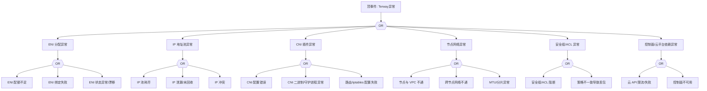

# Terway 异常 FTA 树

## 适用范围与说明
- **目标**：覆盖 Terway CNI 在生产环境中的可用性、连通性与资源分配异常。
- **范围**：ENI 分配、IP 地址池、CNI 插件、节点网络、策略/安全组、控制面依赖。
- **符号**：
  - **OR 门**：任一子事件成立即可触发父事件
  - **AND 门**：所有子事件同时成立才触发父事件

---

## Mermaid FTA 树



---

## 生产级观测与证据
- **事件**：Pod 无法获取 IP、`FailedCreatePodSandBox`、网络不可达。
- **关键指标**：ENI 使用率、IP 使用率、CNI 失败率、节点网络丢包率。
- **关键日志**：Terway Daemon、CNI 插件日志、kubelet 网络事件。
- **配置核对**：ENI/IP 池配置、安全组规则、CNI 配置、VPC 路由。

---

## JSON 工作流（含与/或门控件）

```json
{
  "flow_steps": [
    { "name": "开始", "action": "start", "step": "start_terway_fta", "next_step": "event_terway_abnormal" },
    { "name": "顶事件: Terway异常", "action": "event", "step": "event_terway_abnormal", "description": "Pod 无法分配 IP/网络不可达", "next_step": "gate_root_or" },
    { "name": "根因 OR 门", "action": "gate_or", "step": "gate_root_or", "control": "or_gate", "gate_type": "OR", "next_steps": ["cat_eni","cat_ip","cat_cni","cat_network","cat_security","cat_cp"] },

    { "name": "ENI 分配异常", "action": "event", "step": "cat_eni", "next_step": "gate_eni_or" },
    { "name": "ENI OR 门", "action": "gate_or", "step": "gate_eni_or", "control": "or_gate", "gate_type": "OR", "next_steps": ["evt_eni_quota","evt_eni_bind_fail","evt_eni_drift"] },
    { "name": "ENI 配额不足", "action": "event", "step": "evt_eni_quota" },
    { "name": "ENI 绑定失败", "action": "event", "step": "evt_eni_bind_fail" },
    { "name": "ENI 状态异常/漂移", "action": "event", "step": "evt_eni_drift" },

    { "name": "IP 地址池异常", "action": "event", "step": "cat_ip", "next_step": "gate_ip_or" },
    { "name": "IP OR 门", "action": "gate_or", "step": "gate_ip_or", "control": "or_gate", "gate_type": "OR", "next_steps": ["evt_ip_exhaust","evt_ip_leak","evt_ip_conflict"] },
    { "name": "IP 池耗尽", "action": "event", "step": "evt_ip_exhaust" },
    { "name": "IP 泄漏/未回收", "action": "event", "step": "evt_ip_leak" },
    { "name": "IP 冲突", "action": "event", "step": "evt_ip_conflict" },

    { "name": "CNI 插件异常", "action": "event", "step": "cat_cni", "next_step": "gate_cni_or" },
    { "name": "CNI OR 门", "action": "gate_or", "step": "gate_cni_or", "control": "or_gate", "gate_type": "OR", "next_steps": ["evt_cni_config","evt_cni_daemon","evt_route_fail"] },
    { "name": "CNI 配置错误", "action": "event", "step": "evt_cni_config" },
    { "name": "CNI 二进制/守护进程异常", "action": "event", "step": "evt_cni_daemon" },
    { "name": "路由/iptables 配置失败", "action": "event", "step": "evt_route_fail" },

    { "name": "节点网络异常", "action": "event", "step": "cat_network", "next_step": "gate_net_or" },
    { "name": "网络 OR 门", "action": "gate_or", "step": "gate_net_or", "control": "or_gate", "gate_type": "OR", "next_steps": ["evt_vpc_unreachable","evt_crossnode_fail","evt_mtu_issue"] },
    { "name": "节点与 VPC 不通", "action": "event", "step": "evt_vpc_unreachable" },
    { "name": "跨节点网络不通", "action": "event", "step": "evt_crossnode_fail" },
    { "name": "MTU/分片异常", "action": "event", "step": "evt_mtu_issue" },

    { "name": "安全组/ACL 异常", "action": "event", "step": "cat_security", "next_step": "gate_security_or" },
    { "name": "安全 OR 门", "action": "gate_or", "step": "gate_security_or", "control": "or_gate", "gate_type": "OR", "next_steps": ["evt_sg_block","evt_acl_misconfig"] },
    { "name": "安全组/ACL 阻断", "action": "event", "step": "evt_sg_block" },
    { "name": "策略不一致导致丢包", "action": "event", "step": "evt_acl_misconfig" },

    { "name": "控制面/云平台依赖异常", "action": "event", "step": "cat_cp", "next_step": "gate_cp_or" },
    { "name": "控制面 OR 门", "action": "gate_or", "step": "gate_cp_or", "control": "or_gate", "gate_type": "OR", "next_steps": ["evt_cloud_api_fail","evt_cp_down"] },
    { "name": "云 API 限流/失败", "action": "event", "step": "evt_cloud_api_fail" },
    { "name": "控制面不可用", "action": "event", "step": "evt_cp_down" },

    { "name": "结束", "action": "end", "step": "end_terway_fta" }
  ]
}
```

---

## 版本适配（1.19–1.30）
- **1.19–1.23**：CNI 插件能力差异较大，需标注 ENI/IP 配额与事件字段差异。
- **1.24–1.27**：运行时切换后 CNI 日志路径与故障信号需同步更新。
- **1.28–1.30**：稳定 API 为主，云 API 与审计链路需一致。
- **共性**：遵循 `fta_methodology_and_agentic_practices.md` 中的“版本适配基线”。
