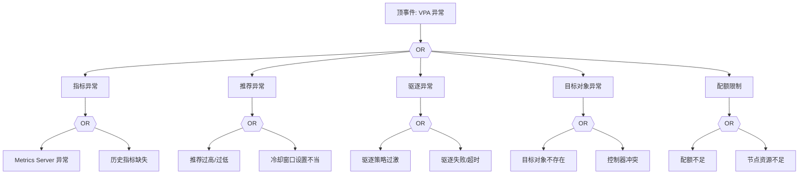

# VPA 异常 FTA 树

## 适用范围与说明
- **目标**：覆盖 VPA 推荐异常、驱逐误操作与指标缺失的关键成因与路径。
- **范围**：VPA 组件、指标采集、驱逐策略、目标对象与资源配额。
- **符号**：
  - **OR 门**：任一子事件成立即可触发父事件
  - **AND 门**：所有子事件同时成立才触发父事件

---

## Mermaid FTA 树



---

## 生产级观测与证据
- **事件**：VPA 推荐异常、驱逐事件激增。
- **关键指标**：VPA 推荐值、驱逐次数、指标采集成功率。
- **关键日志**：VPA 组件日志、`metrics-server` 日志。
- **配置核对**：VPA 资源、更新模式、驱逐策略、资源配额。

---

## JSON 工作流（含与/或门控件）

```json
{
  "flow_steps": [
    { "name": "开始", "action": "start", "step": "start_vpa_fta", "next_step": "event_vpa_abnormal" },
    { "name": "顶事件: VPA 异常", "action": "event", "step": "event_vpa_abnormal", "description": "推荐异常/驱逐异常", "next_step": "gate_root_or" },
    { "name": "根因 OR 门", "action": "gate_or", "step": "gate_root_or", "control": "or_gate", "gate_type": "OR", "next_steps": ["cat_metrics","cat_rec","cat_evict","cat_obj","cat_quota"] }
  ]
}
```

---

## 版本适配（1.19–1.30）
- **1.19–1.23**：VPA 组件版本差异较大，需核对指标 API。
- **1.24–1.27**：与 metrics-server 版本对齐，驱逐策略需校验。
- **1.28–1.30**：稳定 API 为主，审计与回滚路径需一致。
- **共性**：遵循 `fta_methodology_and_agentic_practices.md` 中的“版本适配基线”。
