# VPA 异常 FTA 树

## 适用范围与说明
- **目标**：覆盖 VPA 推荐异常、驱逐误操作与指标缺失的关键成因与路径。
- **范围**：VPA 组件、指标采集、驱逐策略、目标对象与资源配额。
- **符号**：
  - **OR 门**：任一子事件成立即可触发父事件
  - **AND 门**：所有子事件同时成立才触发父事件

---

## Mermaid FTA 树

```mermaid
flowchart TD
  TE[顶事件: VPA 异常]
  OR0{{OR}}
  TE --> OR0

  OR0 --> COMP[VPA 组件异常]
  OR0 --> MET[指标异常]
  OR0 --> REC[推荐异常]
  OR0 --> EVICT[驱逐异常]
  OR0 --> OBJ[目标对象异常]
  OR0 --> AUDIT[审计与回滚缺失]

  %% ========== 1. VPA 组件异常 ==========
  COMP_OR{{OR}}
  COMP --> COMP_OR
  COMP_OR --> COMP_REC[Recommender 异常]
  COMP_OR --> COMP_UPD[Updater 异常]
  COMP_OR --> COMP_ADM[Admission Controller 异常]

  COMP_REC_OR{{OR}}
  COMP_REC --> COMP_REC_OR
  COMP_REC_OR --> COMP_REC1[Recommender Pod 不可用]
  COMP_REC_OR --> COMP_REC2[Recommender OOM]

  COMP_UPD_OR{{OR}}
  COMP_UPD --> COMP_UPD_OR
  COMP_UPD_OR --> COMP_UPD1[Updater Pod 不可用]
  COMP_UPD_OR --> COMP_UPD2[Updater 配置错误]

  COMP_ADM_OR{{OR}}
  COMP_ADM --> COMP_ADM_OR
  COMP_ADM_OR --> COMP_ADM1[Admission Controller 不可用]
  COMP_ADM_OR --> COMP_ADM2[Webhook 证书过期]

  %% ========== 2. 指标异常 ==========
  MET_OR{{OR}}
  MET --> MET_OR
  MET_OR --> MET_SRV[Metrics Server 异常]
  MET_OR --> MET_HIST[历史指标异常]
  MET_OR --> MET_PROM[Prometheus 异常]

  MET_SRV_OR{{OR}}
  MET_SRV --> MET_SRV_OR
  MET_SRV_OR --> MET_SRV1[Metrics Server 不可用]
  MET_SRV_OR --> MET_SRV2[指标采集延迟]
  MET_SRV_OR --> MET_SRV3[kubelet 指标 API 异常]

  MET_HIST_OR{{OR}}
  MET_HIST --> MET_HIST_OR
  MET_HIST_OR --> MET_HIST1[历史数据不足]
  MET_HIST_OR --> MET_HIST2[Checkpoint 丢失]

  %% AND 门：指标不可用 + updateMode=Auto
  AND_MET{{"AND: 指标不可用 + Auto 模式"}}
  MET --> AND_MET
  AND_MET --> AND_MET1[Metrics Server 不可用]
  AND_MET --> AND_MET2[VPA updateMode 为 Auto]

  %% ========== 3. 推荐异常 ==========
  REC_OR{{OR}}
  REC --> REC_OR
  REC_OR --> REC_VAL[推荐值异常]
  REC_OR --> REC_CONF[推荐配置异常]
  REC_OR --> REC_ALGO[算法异常]

  REC_VAL_OR{{OR}}
  REC_VAL --> REC_VAL_OR
  REC_VAL_OR --> REC_VAL1[推荐值过高]
  REC_VAL_OR --> REC_VAL2[推荐值过低]
  REC_VAL_OR --> REC_VAL3[推荐值震荡]

  REC_CONF_OR{{OR}}
  REC_CONF --> REC_CONF_OR
  REC_CONF_OR --> REC_CONF1[minAllowed/maxAllowed 配置不当]
  REC_CONF_OR --> REC_CONF2[containerPolicies 冲突]

  %% ========== 4. 驱逐异常 ==========
  EVICT_OR{{OR}}
  EVICT --> EVICT_OR
  EVICT_OR --> EVICT_POL[驱逐策略异常]
  EVICT_OR --> EVICT_EXEC[驱逐执行异常]
  EVICT_OR --> EVICT_IMPACT[驱逐影响异常]

  EVICT_POL_OR{{OR}}
  EVICT_POL --> EVICT_POL_OR
  EVICT_POL_OR --> EVICT_POL1[驱逐过于频繁]
  EVICT_POL_OR --> EVICT_POL2[minReplicas 配置错误]

  EVICT_EXEC_OR{{OR}}
  EVICT_EXEC --> EVICT_EXEC_OR
  EVICT_EXEC_OR --> EVICT_EXEC1[PDB 阻塞驱逐]
  EVICT_EXEC_OR --> EVICT_EXEC2[驱逐超时]

  %% AND 门：驱逐触发 + PDB 阻塞
  AND_EVICT{{"AND: 驱逐触发 + PDB 阻塞"}}
  EVICT_EXEC --> AND_EVICT
  AND_EVICT --> AND_EVICT1[VPA 触发驱逐更新]
  AND_EVICT --> AND_EVICT2[PDB 不允许驱逐]

  %% ========== 5. 目标对象异常 ==========
  OBJ_OR{{OR}}
  OBJ --> OBJ_OR
  OBJ_OR --> OBJ_TARGET[目标配置异常]
  OBJ_OR --> OBJ_CTRL[控制器冲突]

  OBJ_TARGET_OR{{OR}}
  OBJ_TARGET --> OBJ_TARGET_OR
  OBJ_TARGET_OR --> OBJ_TARGET1[targetRef 不存在]
  OBJ_TARGET_OR --> OBJ_TARGET2[selector 不匹配]

  OBJ_CTRL_OR{{OR}}
  OBJ_CTRL --> OBJ_CTRL_OR
  OBJ_CTRL_OR --> OBJ_CTRL1[VPA 与 HPA 冲突]
  OBJ_CTRL_OR --> OBJ_CTRL2[多 VPA 作用于同一对象]

  %% ========== 6. 审计与回滚缺失 ==========
  AUDIT_OR{{OR}}
  AUDIT --> AUDIT_OR
  AUDIT_OR --> AUDIT1[推荐历史未记录]
  AUDIT_OR --> AUDIT2[驱逐事件未告警]
  AUDIT_OR --> AUDIT3[无回滚机制]
```



---

## 生产级观测与证据
- **事件**：
  - `EvictedByVPA` - Pod 被 VPA 驱逐
  - `RecommendationProvided` - 推荐值已生成
- **关键指标**：
  - `vpa_recommender_recommendation_latency_seconds` - 推荐延迟
  - `vpa_updater_evictions_total` - 驱逐次数
  - VPA 推荐值与实际使用对比
- **关键日志**：
  - VPA Recommender 日志 - 推荐计算
  - VPA Updater 日志 - 驱逐决策
  - VPA Admission Controller 日志 - 资源注入
- **配置核对**：
  - VPA CR 配置 (updateMode, resourcePolicy)
  - Metrics Server 状态
  - PDB 配置

---

## JSON 工作流（含与/或门控件）

```json
{
  "flow_steps": [
    { "name": "开始", "action": "start", "step": "start_vpa_fta", "next_step": "event_vpa_abnormal" },
    { "name": "顶事件: VPA 异常", "action": "event", "step": "event_vpa_abnormal", "description": "推荐异常/驱逐异常/资源调整失败", "next_step": "gate_root_or" },
    { "name": "根因 OR 门", "action": "gate_or", "step": "gate_root_or", "control": "or_gate", "gate_type": "OR", "next_steps": ["cat_comp", "cat_metrics", "cat_rec", "cat_evict", "cat_obj", "cat_audit"] },

    { "name": "类别: VPA 组件异常", "action": "category", "step": "cat_comp", "next_step": "gate_comp_or" },
    { "name": "VPA 组件 OR 门", "action": "gate_or", "step": "gate_comp_or", "control": "or_gate", "gate_type": "OR", "next_steps": ["subcat_comp_rec", "subcat_comp_upd", "subcat_comp_adm"] },

    { "name": "子类: Recommender 异常", "action": "subcategory", "step": "subcat_comp_rec", "next_step": "gate_comp_rec_or" },
    { "name": "Recommender OR 门", "action": "gate_or", "step": "gate_comp_rec_or", "control": "or_gate", "gate_type": "OR", "next_steps": ["event_comp_rec_pod", "event_comp_rec_oom"] },
    {
      "name": "底事件: Recommender Pod 不可用",
      "action": "bottom_event",
      "step": "event_comp_rec_pod",
      "description": "VPA Recommender Pod 未正常运行",
      "metadata": {
        "severity": "high",
        "probability": "low",
        "mttr_minutes": 20,
        "detection": {
          "events": ["PodNotReady"],
          "metrics": ["up{job='vpa-recommender'}"],
          "logs": ["recommender pod not running"]
        },
        "remediation": {
          "manual_steps": ["检查 Recommender Pod 状态", "查看 Pod 日志和事件", "重新部署 VPA 组件"],
          "auto_actions": ["配置 VPA 组件可用性告警"]
        }
      },
      "next_step": "gate_root_or"
    },
    {
      "name": "底事件: Recommender OOM",
      "action": "bottom_event",
      "step": "event_comp_rec_oom",
      "description": "Recommender 内存不足被 OOM Kill",
      "metadata": {
        "severity": "high",
        "probability": "medium",
        "mttr_minutes": 20,
        "detection": {
          "events": ["OOMKilled"],
          "metrics": ["container_memory_usage_bytes{container='recommender'}"],
          "logs": ["OOMKilled"]
        },
        "remediation": {
          "manual_steps": ["增加 Recommender 内存限制", "减少监控的 VPA 数量", "优化 checkpoint 存储"],
          "auto_actions": []
        }
      },
      "next_step": "gate_root_or"
    },

    { "name": "子类: Updater 异常", "action": "subcategory", "step": "subcat_comp_upd", "next_step": "gate_comp_upd_or" },
    { "name": "Updater OR 门", "action": "gate_or", "step": "gate_comp_upd_or", "control": "or_gate", "gate_type": "OR", "next_steps": ["event_comp_upd_pod", "event_comp_upd_conf"] },
    {
      "name": "底事件: Updater Pod 不可用",
      "action": "bottom_event",
      "step": "event_comp_upd_pod",
      "description": "VPA Updater Pod 未正常运行",
      "metadata": {
        "severity": "high",
        "probability": "low",
        "mttr_minutes": 20,
        "detection": {
          "events": ["PodNotReady"],
          "metrics": ["up{job='vpa-updater'}"],
          "logs": []
        },
        "remediation": {
          "manual_steps": ["检查 Updater Pod 状态", "重新部署 VPA 组件"],
          "auto_actions": []
        }
      },
      "next_step": "gate_root_or"
    },
    {
      "name": "底事件: Updater 配置错误",
      "action": "bottom_event",
      "step": "event_comp_upd_conf",
      "description": "Updater 启动参数配置错误",
      "metadata": {
        "severity": "medium",
        "probability": "low",
        "mttr_minutes": 20,
        "detection": {
          "events": [],
          "metrics": [],
          "logs": ["configuration error"]
        },
        "remediation": {
          "manual_steps": ["检查 Updater 启动参数", "验证 eviction-tolerance 等配置"],
          "auto_actions": []
        }
      },
      "next_step": "gate_root_or"
    },

    { "name": "子类: Admission Controller 异常", "action": "subcategory", "step": "subcat_comp_adm", "next_step": "gate_comp_adm_or" },
    { "name": "Admission Controller OR 门", "action": "gate_or", "step": "gate_comp_adm_or", "control": "or_gate", "gate_type": "OR", "next_steps": ["event_comp_adm_pod", "event_comp_adm_cert"] },
    {
      "name": "底事件: Admission Controller 不可用",
      "action": "bottom_event",
      "step": "event_comp_adm_pod",
      "description": "VPA Admission Controller 不可用导致资源注入失败",
      "metadata": {
        "severity": "high",
        "probability": "low",
        "mttr_minutes": 20,
        "detection": {
          "events": ["FailedCallingWebhook"],
          "metrics": ["up{job='vpa-admission-controller'}"],
          "logs": []
        },
        "remediation": {
          "manual_steps": ["检查 Admission Controller Pod", "验证 Webhook 配置"],
          "auto_actions": []
        }
      },
      "next_step": "gate_root_or"
    },
    {
      "name": "底事件: Webhook 证书过期",
      "action": "bottom_event",
      "step": "event_comp_adm_cert",
      "description": "VPA Admission Controller Webhook 证书过期",
      "metadata": {
        "severity": "high",
        "probability": "medium",
        "mttr_minutes": 30,
        "detection": {
          "events": ["FailedCallingWebhook"],
          "metrics": [],
          "logs": ["x509: certificate has expired"]
        },
        "remediation": {
          "manual_steps": ["更新 Webhook 证书", "重新部署 VPA Admission Controller"],
          "auto_actions": ["配置证书自动轮换"]
        }
      },
      "next_step": "gate_root_or"
    },

    { "name": "类别: 指标异常", "action": "category", "step": "cat_metrics", "next_step": "gate_metrics_or" },
    { "name": "指标异常 OR 门", "action": "gate_or", "step": "gate_metrics_or", "control": "or_gate", "gate_type": "OR", "next_steps": ["subcat_met_srv", "subcat_met_hist", "gate_and_met"] },

    { "name": "子类: Metrics Server 异常", "action": "subcategory", "step": "subcat_met_srv", "next_step": "gate_met_srv_or" },
    { "name": "Metrics Server OR 门", "action": "gate_or", "step": "gate_met_srv_or", "control": "or_gate", "gate_type": "OR", "next_steps": ["event_met_srv_unavail", "event_met_srv_delay", "event_met_srv_kubelet"] },
    {
      "name": "底事件: Metrics Server 不可用",
      "action": "bottom_event",
      "step": "event_met_srv_unavail",
      "description": "Metrics Server 不可用导致 VPA 无法获取指标",
      "metadata": {
        "severity": "critical",
        "probability": "low",
        "mttr_minutes": 20,
        "detection": {
          "events": [],
          "metrics": ["up{job='metrics-server'}"],
          "logs": ["failed to get metrics"]
        },
        "remediation": {
          "manual_steps": ["检查 metrics-server Pod 状态", "验证 API Service 配置"],
          "auto_actions": []
        }
      },
      "next_step": "gate_root_or"
    },
    {
      "name": "底事件: 指标采集延迟",
      "action": "bottom_event",
      "step": "event_met_srv_delay",
      "description": "指标采集延迟导致推荐不准确",
      "metadata": {
        "severity": "medium",
        "probability": "medium",
        "mttr_minutes": 20,
        "detection": {
          "events": [],
          "metrics": [],
          "logs": ["stale metrics"]
        },
        "remediation": {
          "manual_steps": ["检查 metrics-server 配置", "优化采集间隔"],
          "auto_actions": []
        }
      },
      "next_step": "gate_root_or"
    },
    {
      "name": "底事件: kubelet 指标 API 异常",
      "action": "bottom_event",
      "step": "event_met_srv_kubelet",
      "description": "kubelet 指标 API 返回错误",
      "metadata": {
        "severity": "high",
        "probability": "low",
        "mttr_minutes": 30,
        "detection": {
          "events": [],
          "metrics": [],
          "logs": ["error scraping kubelet"]
        },
        "remediation": {
          "manual_steps": ["检查 kubelet 状态", "验证 kubelet 指标端点"],
          "auto_actions": []
        }
      },
      "next_step": "gate_root_or"
    },

    { "name": "子类: 历史指标异常", "action": "subcategory", "step": "subcat_met_hist", "next_step": "gate_met_hist_or" },
    { "name": "历史指标 OR 门", "action": "gate_or", "step": "gate_met_hist_or", "control": "or_gate", "gate_type": "OR", "next_steps": ["event_met_hist_short", "event_met_hist_ckpt"] },
    {
      "name": "底事件: 历史数据不足",
      "action": "bottom_event",
      "step": "event_met_hist_short",
      "description": "历史指标数据不足导致推荐不准确",
      "metadata": {
        "severity": "medium",
        "probability": "common",
        "mttr_minutes": 30,
        "detection": {
          "events": [],
          "metrics": [],
          "logs": ["not enough history"]
        },
        "remediation": {
          "manual_steps": ["等待更多数据积累", "调整 recommender 参数"],
          "auto_actions": []
        }
      },
      "next_step": "gate_root_or"
    },
    {
      "name": "底事件: Checkpoint 丢失",
      "action": "bottom_event",
      "step": "event_met_hist_ckpt",
      "description": "VPA Checkpoint 数据丢失导致推荐重置",
      "metadata": {
        "severity": "medium",
        "probability": "low",
        "mttr_minutes": 30,
        "detection": {
          "events": [],
          "metrics": [],
          "logs": ["checkpoint not found"]
        },
        "remediation": {
          "manual_steps": ["检查 checkpoint 存储配置", "等待数据重新积累"],
          "auto_actions": []
        }
      },
      "next_step": "gate_root_or"
    },
    {
      "name": "AND 门: 指标不可用 + Auto 模式",
      "action": "gate_and",
      "step": "gate_and_met",
      "control": "and_gate",
      "gate_type": "AND",
      "description": "指标不可用且 VPA 为 Auto 模式时可能导致错误驱逐",
      "conditions": ["Metrics Server 不可用", "VPA updateMode 为 Auto"],
      "combined_severity": "critical",
      "next_steps": ["event_and_met_srv", "event_and_met_mode"],
      "next_step": "gate_root_or"
    },
    {
      "name": "AND 条件1: Metrics 不可用",
      "action": "and_condition",
      "step": "event_and_met_srv",
      "description": "Metrics Server 或指标采集不可用",
      "parent_gate": "gate_and_met"
    },
    {
      "name": "AND 条件2: Auto 模式",
      "action": "and_condition",
      "step": "event_and_met_mode",
      "description": "VPA updateMode 配置为 Auto",
      "parent_gate": "gate_and_met"
    },

    { "name": "类别: 推荐异常", "action": "category", "step": "cat_rec", "next_step": "gate_rec_or" },
    { "name": "推荐异常 OR 门", "action": "gate_or", "step": "gate_rec_or", "control": "or_gate", "gate_type": "OR", "next_steps": ["subcat_rec_val", "subcat_rec_conf"] },

    { "name": "子类: 推荐值异常", "action": "subcategory", "step": "subcat_rec_val", "next_step": "gate_rec_val_or" },
    { "name": "推荐值 OR 门", "action": "gate_or", "step": "gate_rec_val_or", "control": "or_gate", "gate_type": "OR", "next_steps": ["event_rec_val_high", "event_rec_val_low", "event_rec_val_osc"] },
    {
      "name": "底事件: 推荐值过高",
      "action": "bottom_event",
      "step": "event_rec_val_high",
      "description": "VPA 推荐值过高导致资源浪费或超配额",
      "metadata": {
        "severity": "medium",
        "probability": "medium",
        "mttr_minutes": 30,
        "detection": {
          "events": [],
          "metrics": [],
          "logs": []
        },
        "remediation": {
          "manual_steps": ["检查负载模式是否有峰值", "配置 maxAllowed 限制", "调整推荐算法参数"],
          "auto_actions": []
        }
      },
      "next_step": "gate_root_or"
    },
    {
      "name": "底事件: 推荐值过低",
      "action": "bottom_event",
      "step": "event_rec_val_low",
      "description": "VPA 推荐值过低导致资源不足",
      "metadata": {
        "severity": "high",
        "probability": "medium",
        "mttr_minutes": 30,
        "detection": {
          "events": ["OOMKilled"],
          "metrics": [],
          "logs": []
        },
        "remediation": {
          "manual_steps": ["检查历史数据是否完整", "配置 minAllowed 保护", "调整目标利用率"],
          "auto_actions": []
        }
      },
      "next_step": "gate_root_or"
    },
    {
      "name": "底事件: 推荐值震荡",
      "action": "bottom_event",
      "step": "event_rec_val_osc",
      "description": "推荐值频繁变化导致频繁驱逐",
      "metadata": {
        "severity": "medium",
        "probability": "medium",
        "mttr_minutes": 30,
        "detection": {
          "events": [],
          "metrics": ["vpa_recommender_recommendation_latency_seconds"],
          "logs": []
        },
        "remediation": {
          "manual_steps": ["增加推荐稳定窗口", "调整 pod-update-threshold"],
          "auto_actions": []
        }
      },
      "next_step": "gate_root_or"
    },

    { "name": "子类: 推荐配置异常", "action": "subcategory", "step": "subcat_rec_conf", "next_step": "gate_rec_conf_or" },
    { "name": "推荐配置 OR 门", "action": "gate_or", "step": "gate_rec_conf_or", "control": "or_gate", "gate_type": "OR", "next_steps": ["event_rec_conf_bound", "event_rec_conf_policy"] },
    {
      "name": "底事件: minAllowed/maxAllowed 配置不当",
      "action": "bottom_event",
      "step": "event_rec_conf_bound",
      "description": "资源边界配置导致推荐受限",
      "metadata": {
        "severity": "medium",
        "probability": "common",
        "mttr_minutes": 15,
        "detection": {
          "events": [],
          "metrics": [],
          "logs": []
        },
        "remediation": {
          "manual_steps": ["检查 VPA resourcePolicy 配置", "调整 minAllowed/maxAllowed"],
          "auto_actions": []
        }
      },
      "next_step": "gate_root_or"
    },
    {
      "name": "底事件: containerPolicies 冲突",
      "action": "bottom_event",
      "step": "event_rec_conf_policy",
      "description": "容器策略配置冲突或不完整",
      "metadata": {
        "severity": "medium",
        "probability": "low",
        "mttr_minutes": 20,
        "detection": {
          "events": [],
          "metrics": [],
          "logs": []
        },
        "remediation": {
          "manual_steps": ["检查 containerPolicies 配置", "确保所有容器都有策略"],
          "auto_actions": []
        }
      },
      "next_step": "gate_root_or"
    },

    { "name": "类别: 驱逐异常", "action": "category", "step": "cat_evict", "next_step": "gate_evict_or" },
    { "name": "驱逐异常 OR 门", "action": "gate_or", "step": "gate_evict_or", "control": "or_gate", "gate_type": "OR", "next_steps": ["subcat_evict_pol", "subcat_evict_exec"] },

    { "name": "子类: 驱逐策略异常", "action": "subcategory", "step": "subcat_evict_pol", "next_step": "gate_evict_pol_or" },
    { "name": "驱逐策略 OR 门", "action": "gate_or", "step": "gate_evict_pol_or", "control": "or_gate", "gate_type": "OR", "next_steps": ["event_evict_pol_freq", "event_evict_pol_min"] },
    {
      "name": "底事件: 驱逐过于频繁",
      "action": "bottom_event",
      "step": "event_evict_pol_freq",
      "description": "VPA 驱逐过于频繁影响应用稳定性",
      "metadata": {
        "severity": "high",
        "probability": "medium",
        "mttr_minutes": 30,
        "detection": {
          "events": ["EvictedByVPA"],
          "metrics": ["vpa_updater_evictions_total"],
          "logs": []
        },
        "remediation": {
          "manual_steps": ["增加 pod-update-threshold", "配置 eviction-tolerance", "考虑使用 Off 或 Initial 模式"],
          "auto_actions": []
        }
      },
      "next_step": "gate_root_or"
    },
    {
      "name": "底事件: minReplicas 配置错误",
      "action": "bottom_event",
      "step": "event_evict_pol_min",
      "description": "Updater minReplicas 配置导致驱逐行为异常",
      "metadata": {
        "severity": "medium",
        "probability": "low",
        "mttr_minutes": 20,
        "detection": {
          "events": [],
          "metrics": [],
          "logs": []
        },
        "remediation": {
          "manual_steps": ["检查 Updater --min-replicas 参数", "确保与 PDB 配置一致"],
          "auto_actions": []
        }
      },
      "next_step": "gate_root_or"
    },

    { "name": "子类: 驱逐执行异常", "action": "subcategory", "step": "subcat_evict_exec", "next_step": "gate_evict_exec_or" },
    { "name": "驱逐执行 OR 门", "action": "gate_or", "step": "gate_evict_exec_or", "control": "or_gate", "gate_type": "OR", "next_steps": ["event_evict_exec_pdb", "event_evict_exec_timeout", "gate_and_evict"] },
    {
      "name": "底事件: PDB 阻塞驱逐",
      "action": "bottom_event",
      "step": "event_evict_exec_pdb",
      "description": "PodDisruptionBudget 阻塞 VPA 驱逐",
      "metadata": {
        "severity": "medium",
        "probability": "common",
        "mttr_minutes": 30,
        "detection": {
          "events": [],
          "metrics": [],
          "logs": ["cannot evict pod, PDB violated"]
        },
        "remediation": {
          "manual_steps": ["检查 PDB 配置", "调整 PDB 允许更多驱逐", "或等待其他 Pod 恢复"],
          "auto_actions": []
        }
      },
      "next_step": "gate_root_or"
    },
    {
      "name": "底事件: 驱逐超时",
      "action": "bottom_event",
      "step": "event_evict_exec_timeout",
      "description": "驱逐操作超时",
      "metadata": {
        "severity": "medium",
        "probability": "low",
        "mttr_minutes": 20,
        "detection": {
          "events": [],
          "metrics": [],
          "logs": ["eviction timed out"]
        },
        "remediation": {
          "manual_steps": ["检查 Pod 终止过程", "检查是否有 Finalizer 阻塞"],
          "auto_actions": []
        }
      },
      "next_step": "gate_root_or"
    },
    {
      "name": "AND 门: 驱逐触发 + PDB 阻塞",
      "action": "gate_and",
      "step": "gate_and_evict",
      "control": "and_gate",
      "gate_type": "AND",
      "description": "VPA 需要驱逐更新但 PDB 不允许",
      "conditions": ["VPA 触发驱逐更新", "PDB 不允许驱逐"],
      "combined_severity": "high",
      "next_steps": ["event_and_evict_trigger", "event_and_evict_pdb"],
      "next_step": "gate_root_or"
    },
    {
      "name": "AND 条件1: VPA 触发驱逐",
      "action": "and_condition",
      "step": "event_and_evict_trigger",
      "description": "VPA Updater 判定需要驱逐 Pod 更新资源",
      "parent_gate": "gate_and_evict"
    },
    {
      "name": "AND 条件2: PDB 阻塞",
      "action": "and_condition",
      "step": "event_and_evict_pdb",
      "description": "PDB 当前不允许驱逐任何 Pod",
      "parent_gate": "gate_and_evict"
    },

    { "name": "类别: 目标对象异常", "action": "category", "step": "cat_obj", "next_step": "gate_obj_or" },
    { "name": "目标对象 OR 门", "action": "gate_or", "step": "gate_obj_or", "control": "or_gate", "gate_type": "OR", "next_steps": ["subcat_obj_target", "subcat_obj_ctrl"] },

    { "name": "子类: 目标配置异常", "action": "subcategory", "step": "subcat_obj_target", "next_step": "gate_obj_target_or" },
    { "name": "目标配置 OR 门", "action": "gate_or", "step": "gate_obj_target_or", "control": "or_gate", "gate_type": "OR", "next_steps": ["event_obj_target_miss", "event_obj_target_sel"] },
    {
      "name": "底事件: targetRef 不存在",
      "action": "bottom_event",
      "step": "event_obj_target_miss",
      "description": "VPA targetRef 指向的对象不存在",
      "metadata": {
        "severity": "high",
        "probability": "low",
        "mttr_minutes": 15,
        "detection": {
          "events": [],
          "metrics": [],
          "logs": ["target not found"]
        },
        "remediation": {
          "manual_steps": ["检查 VPA targetRef 配置", "确保目标 Deployment/StatefulSet 存在"],
          "auto_actions": []
        }
      },
      "next_step": "gate_root_or"
    },
    {
      "name": "底事件: selector 不匹配",
      "action": "bottom_event",
      "step": "event_obj_target_sel",
      "description": "VPA 无法匹配到目标 Pod",
      "metadata": {
        "severity": "medium",
        "probability": "low",
        "mttr_minutes": 20,
        "detection": {
          "events": [],
          "metrics": [],
          "logs": ["no pods matched"]
        },
        "remediation": {
          "manual_steps": ["检查目标对象的 selector", "验证 Pod 标签匹配"],
          "auto_actions": []
        }
      },
      "next_step": "gate_root_or"
    },

    { "name": "子类: 控制器冲突", "action": "subcategory", "step": "subcat_obj_ctrl", "next_step": "gate_obj_ctrl_or" },
    { "name": "控制器冲突 OR 门", "action": "gate_or", "step": "gate_obj_ctrl_or", "control": "or_gate", "gate_type": "OR", "next_steps": ["event_obj_ctrl_hpa", "event_obj_ctrl_multi"] },
    {
      "name": "底事件: VPA 与 HPA 冲突",
      "action": "bottom_event",
      "step": "event_obj_ctrl_hpa",
      "description": "VPA 和 HPA 同时作用于同一 Deployment",
      "metadata": {
        "severity": "high",
        "probability": "common",
        "mttr_minutes": 30,
        "detection": {
          "events": [],
          "metrics": [],
          "logs": []
        },
        "remediation": {
          "manual_steps": ["避免 VPA 和 HPA 同时管理 CPU/Memory", "VPA 管理资源，HPA 管理副本数", "或使用 updateMode: Off"],
          "auto_actions": []
        }
      },
      "next_step": "gate_root_or"
    },
    {
      "name": "底事件: 多 VPA 作用于同一对象",
      "action": "bottom_event",
      "step": "event_obj_ctrl_multi",
      "description": "多个 VPA 作用于同一目标对象",
      "metadata": {
        "severity": "high",
        "probability": "low",
        "mttr_minutes": 20,
        "detection": {
          "events": [],
          "metrics": [],
          "logs": ["multiple VPAs targeting same object"]
        },
        "remediation": {
          "manual_steps": ["删除重复的 VPA", "确保每个目标只有一个 VPA"],
          "auto_actions": []
        }
      },
      "next_step": "gate_root_or"
    },

    { "name": "类别: 审计与回滚缺失", "action": "category", "step": "cat_audit", "next_step": "gate_audit_or" },
    { "name": "审计回滚 OR 门", "action": "gate_or", "step": "gate_audit_or", "control": "or_gate", "gate_type": "OR", "next_steps": ["event_audit_hist", "event_audit_alert", "event_audit_rollback"] },
    {
      "name": "底事件: 推荐历史未记录",
      "action": "bottom_event",
      "step": "event_audit_hist",
      "description": "VPA 推荐历史未记录无法追溯",
      "metadata": {
        "severity": "medium",
        "probability": "common",
        "mttr_minutes": 30,
        "detection": {
          "events": [],
          "metrics": [],
          "logs": []
        },
        "remediation": {
          "manual_steps": ["配置 VPA 推荐指标导出", "记录 VPA status 变化"],
          "auto_actions": []
        }
      },
      "next_step": "gate_root_or"
    },
    {
      "name": "底事件: 驱逐事件未告警",
      "action": "bottom_event",
      "step": "event_audit_alert",
      "description": "VPA 驱逐事件未配置告警",
      "metadata": {
        "severity": "medium",
        "probability": "common",
        "mttr_minutes": 30,
        "detection": {
          "events": [],
          "metrics": [],
          "logs": []
        },
        "remediation": {
          "manual_steps": ["配置基于 vpa_updater_evictions_total 的告警", "监控驱逐频率异常"],
          "auto_actions": []
        }
      },
      "next_step": "gate_root_or"
    },
    {
      "name": "底事件: 无回滚机制",
      "action": "bottom_event",
      "step": "event_audit_rollback",
      "description": "VPA 配置变更后无回滚能力",
      "metadata": {
        "severity": "medium",
        "probability": "common",
        "mttr_minutes": 30,
        "detection": {
          "events": [],
          "metrics": [],
          "logs": []
        },
        "remediation": {
          "manual_steps": ["将 VPA 配置纳入 GitOps", "建立 VPA 变更审批流程"],
          "auto_actions": []
        }
      },
      "next_step": "gate_root_or"
    },

    { "name": "结束", "action": "end", "step": "end_vpa_fta" }
  ]
}
```

---

## 版本适配（1.19–1.30）
- **1.19–1.23**：
  - VPA 组件版本差异较大，需核对指标 API
  - Metrics Server 版本需要匹配
- **1.24–1.27**：
  - 与 metrics-server 版本对齐
  - 驱逐策略需校验与 PDB 兼容性
- **1.28–1.30**：
  - 稳定 API 为主
  - 推荐使用 VPA 与 HPA 配合的最佳实践
  - 审计与回滚路径需一致
- **共性**：
  - VPA 不应与 HPA 同时管理相同资源类型
  - 生产环境建议先用 Off 模式观察推荐
  - 遵循 `fta-methodology-and-agentic-practices.md` 中的"版本适配基线"
