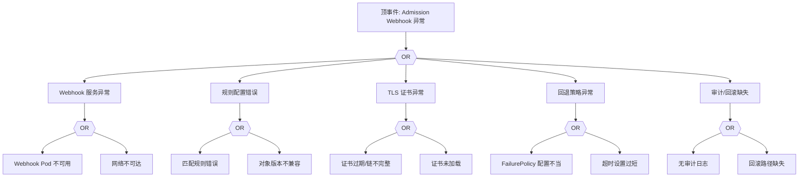

# Admission Webhook 异常 FTA 树

## 适用范围与说明
- **目标**：覆盖准入 Webhook 拒绝、超时与策略冲突的关键成因与路径。
- **范围**：Webhook 服务可用性、规则配置、证书与 TLS、回退策略、审计。
- **符号**：
  - **OR 门**：任一子事件成立即可触发父事件
  - **AND 门**：所有子事件同时成立才触发父事件

---

## Mermaid FTA 树



---

## 生产级观测与证据
- **事件**：`FailedCallingWebhook`、`WebhookTimeout`。
- **关键指标**：Webhook 调用失败率、延迟、拒绝率。
- **关键日志**：Webhook 服务日志、`apiserver` 日志。
- **配置核对**：`ValidatingWebhookConfiguration`/`MutatingWebhookConfiguration`、`failurePolicy`、`timeoutSeconds`。

---

## JSON 工作流（含与/或门控件）

```json
{
  "flow_steps": [
    { "name": "开始", "action": "start", "step": "start_webhook_fta", "next_step": "event_webhook_abnormal" },
    { "name": "顶事件: Admission Webhook 异常", "action": "event", "step": "event_webhook_abnormal", "description": "准入拒绝/超时", "next_step": "gate_root_or" },
    { "name": "根因 OR 门", "action": "gate_or", "step": "gate_root_or", "control": "or_gate", "gate_type": "OR", "next_steps": ["cat_svc","cat_rule","cat_tls","cat_fail","cat_audit"] }
  ]
}
```

---

## 版本适配（1.19–1.30）
- **1.19–1.23**：Webhook API 版本兼容性需校验，旧版对象版本可能导致拒绝。
- **1.24–1.27**：PSP 移除后准入链路变化，需补充 PSA/OPA 分支。
- **1.28–1.30**：稳定 API 为主，审计与回滚路径需统一。
- **共性**：遵循 `fta_methodology_and_agentic_practices.md` 中的“版本适配基线”。
