<!-- condition: kubectl get events -A | grep -E 'Webhook.*denied|admission.*rejected' 显示 Webhook 拒绝事件 -->

# Admission Webhook 异常 FTA 树

## 适用范围与说明
- **目标**：覆盖准入 Webhook 拒绝、超时与策略冲突的关键成因与路径。
- **范围**：Webhook 服务可用性、规则配置、证书与 TLS、回退策略、审计。
- **符号**：
  - **OR 门**：任一子事件成立即可触发父事件
  - **AND 门**：所有子事件同时成立才触发父事件

---

## Mermaid FTA 树

```mermaid
flowchart TD
  TE[顶事件: Admission Webhook 异常]
  OR0{{OR}}
  TE --> OR0

  OR0 --> SVC[Webhook 服务异常]
  OR0 --> RULE[规则配置错误]
  OR0 --> TLS[TLS 证书异常]
  OR0 --> FAIL[回退策略异常]
  OR0 --> PERF[性能与超时异常]
  OR0 --> AUDIT[审计与回滚缺失]

  %% ========== 1. Webhook 服务异常 ==========
  SVC_OR{{OR}}
  SVC --> SVC_OR
  SVC_OR --> SVC_POD[Webhook Pod 异常]
  SVC_OR --> SVC_NET[网络连通异常]
  SVC_OR --> SVC_SVC[Service 配置异常]

  %% 1.1 Webhook Pod 异常
  SVC_POD_OR{{OR}}
  SVC_POD --> SVC_POD_OR
  SVC_POD_OR --> SVC_POD1[Pod 未就绪/CrashLoop]
  SVC_POD_OR --> SVC_POD2[资源不足导致 OOM]
  SVC_POD_OR --> SVC_POD3[镜像拉取失败]

  %% 1.2 网络连通异常
  SVC_NET_OR{{OR}}
  SVC_NET --> SVC_NET_OR
  SVC_NET_OR --> SVC_NET1[NetworkPolicy 阻断]
  SVC_NET_OR --> SVC_NET2[跨命名空间网络隔离]
  SVC_NET_OR --> SVC_NET3[DNS 解析失败]

  %% 1.3 Service 配置异常
  SVC_SVC_OR{{OR}}
  SVC_SVC --> SVC_SVC_OR
  SVC_SVC_OR --> SVC_SVC1[Service 端口配置错误]
  SVC_SVC_OR --> SVC_SVC2[Endpoint 为空]
  SVC_SVC_OR --> SVC_SVC3[Service 不存在]

  %% ========== 2. 规则配置错误 ==========
  RULE_OR{{OR}}
  RULE --> RULE_OR
  RULE_OR --> RULE_MATCH[匹配规则异常]
  RULE_OR --> RULE_OBJ[对象版本异常]
  RULE_OR --> RULE_SCOPE[作用域异常]

  %% 2.1 匹配规则异常
  RULE_MATCH_OR{{OR}}
  RULE_MATCH --> RULE_MATCH_OR
  RULE_MATCH_OR --> RULE_MATCH1[operations 配置过宽]
  RULE_MATCH_OR --> RULE_MATCH2[resources 配置错误]
  RULE_MATCH_OR --> RULE_MATCH3[namespaceSelector 过滤失效]

  %% 2.2 对象版本异常
  RULE_OBJ_OR{{OR}}
  RULE_OBJ --> RULE_OBJ_OR
  RULE_OBJ_OR --> RULE_OBJ1[admissionReviewVersions 不兼容]
  RULE_OBJ_OR --> RULE_OBJ2[API 版本升级后不匹配]
  RULE_OBJ_OR --> RULE_OBJ3[matchPolicy 配置不当]

  %% 2.3 作用域异常
  RULE_SCOPE_OR{{OR}}
  RULE_SCOPE --> RULE_SCOPE_OR
  RULE_SCOPE_OR --> RULE_SCOPE1[拦截系统关键资源]
  RULE_SCOPE_OR --> RULE_SCOPE2[objectSelector 配置错误]

  %% AND 门：拦截系统资源 + failurePolicy=Fail
  AND_SYSTEM{{"AND: 拦截系统资源 + Fail 策略"}}
  RULE_SCOPE1 --> AND_SYSTEM
  AND_SYSTEM --> AND_SYS1[Webhook 匹配 kube-system 资源]
  AND_SYSTEM --> AND_SYS2[failurePolicy 设置为 Fail]

  %% ========== 3. TLS 证书异常 ==========
  TLS_OR{{OR}}
  TLS --> TLS_OR
  TLS_OR --> TLS_CERT[证书配置异常]
  TLS_OR --> TLS_LOAD[证书加载异常]
  TLS_OR --> TLS_CA[CA 信任异常]

  %% 3.1 证书配置异常
  TLS_CERT_OR{{OR}}
  TLS_CERT --> TLS_CERT_OR
  TLS_CERT_OR --> TLS_CERT1[证书过期]
  TLS_CERT_OR --> TLS_CERT2[证书链不完整]
  TLS_CERT_OR --> TLS_CERT3[证书 SAN 不匹配]

  %% 3.2 证书加载异常
  TLS_LOAD_OR{{OR}}
  TLS_LOAD --> TLS_LOAD_OR
  TLS_LOAD_OR --> TLS_LOAD1[Secret 挂载失败]
  TLS_LOAD_OR --> TLS_LOAD2[证书文件权限错误]
  TLS_LOAD_OR --> TLS_LOAD3[证书热更新失败]

  %% 3.3 CA 信任异常
  TLS_CA_OR{{OR}}
  TLS_CA --> TLS_CA_OR
  TLS_CA_OR --> TLS_CA1[caBundle 未配置]
  TLS_CA_OR --> TLS_CA2[caBundle 与实际 CA 不匹配]
  TLS_CA_OR --> TLS_CA3[自签证书未被信任]

  %% ========== 4. 回退策略异常 ==========
  FAIL_OR{{OR}}
  FAIL --> FAIL_OR
  FAIL_OR --> FAIL_POL[failurePolicy 异常]
  FAIL_OR --> FAIL_SIDE[sideEffects 异常]
  FAIL_OR --> FAIL_REINV[reinvocationPolicy 异常]

  %% 4.1 failurePolicy 异常
  FAIL_POL_OR{{OR}}
  FAIL_POL --> FAIL_POL_OR
  FAIL_POL_OR --> FAIL_POL1[Fail 策略阻断所有请求]
  FAIL_POL_OR --> FAIL_POL2[Ignore 策略绕过安全检查]

  %% 4.2 sideEffects 异常
  FAIL_SIDE_OR{{OR}}
  FAIL_SIDE --> FAIL_SIDE_OR
  FAIL_SIDE_OR --> FAIL_SIDE1[sideEffects 配置为 Unknown]
  FAIL_SIDE_OR --> FAIL_SIDE2[dry-run 请求触发副作用]

  %% 4.3 reinvocationPolicy 异常
  FAIL_REINV_OR{{OR}}
  FAIL_REINV --> FAIL_REINV_OR
  FAIL_REINV_OR --> FAIL_REINV1[多 Webhook 顺序冲突]
  FAIL_REINV_OR --> FAIL_REINV2[IfNeeded 导致无限循环]

  %% ========== 5. 性能与超时异常 ==========
  PERF_OR{{OR}}
  PERF --> PERF_OR
  PERF_OR --> PERF_TIMEOUT[超时配置异常]
  PERF_OR --> PERF_LATENCY[Webhook 延迟异常]
  PERF_OR --> PERF_LOAD[高负载异常]

  %% 5.1 超时配置异常
  PERF_TIMEOUT_OR{{OR}}
  PERF_TIMEOUT --> PERF_TIMEOUT_OR
  PERF_TIMEOUT_OR --> PERF_TIMEOUT1[timeoutSeconds 设置过短]
  PERF_TIMEOUT_OR --> PERF_TIMEOUT2[复杂校验超时]

  %% 5.2 Webhook 延迟异常
  PERF_LATENCY_OR{{OR}}
  PERF_LATENCY --> PERF_LATENCY_OR
  PERF_LATENCY_OR --> PERF_LATENCY1[外部依赖调用慢]
  PERF_LATENCY_OR --> PERF_LATENCY2[Webhook 代码性能差]
  PERF_LATENCY_OR --> PERF_LATENCY3[数据库查询慢]

  %% AND 门：高延迟 + 短超时 + Fail 策略
  AND_TIMEOUT{{"AND: 高延迟 + 短超时"}}
  PERF_LATENCY --> AND_TIMEOUT
  AND_TIMEOUT --> AND_TO1[Webhook 响应延迟 > 5s]
  AND_TIMEOUT --> AND_TO2[timeoutSeconds < 延迟时间]

  %% 5.3 高负载异常
  PERF_LOAD_OR{{OR}}
  PERF_LOAD --> PERF_LOAD_OR
  PERF_LOAD_OR --> PERF_LOAD1[突发请求导致排队]
  PERF_LOAD_OR --> PERF_LOAD2[Webhook 副本数不足]
  PERF_LOAD_OR --> PERF_LOAD3[资源限制过低]

  %% ========== 6. 审计与回滚缺失 ==========
  AUDIT_OR{{OR}}
  AUDIT --> AUDIT_OR
  AUDIT_OR --> AUDIT1[Webhook 决策未记录审计]
  AUDIT_OR --> AUDIT2[配置变更无版本控制]
  AUDIT_OR --> AUDIT3[无快速禁用机制]
```



---

## 生产级观测与证据
- **事件**：
  - `FailedCallingWebhook` - Webhook 调用失败
  - `WebhookTimeout` - Webhook 超时
  - `AdmissionWebhookDenied` - 请求被 Webhook 拒绝
- **关键指标**：
  - `apiserver_admission_webhook_admission_duration_seconds` - Webhook 调用延迟
  - `apiserver_admission_webhook_rejection_count` - Webhook 拒绝次数
  - `apiserver_admission_webhook_fail_open_count` - failurePolicy=Ignore 触发次数
- **关键日志**：
  - `apiserver` - Webhook 调用日志、TLS 握手错误
  - Webhook 服务日志 - 请求处理详情、错误信息
  - 审计日志 - 准入决策记录
- **配置核对**：
  - `ValidatingWebhookConfiguration` / `MutatingWebhookConfiguration`
  - `failurePolicy`、`timeoutSeconds`、`sideEffects`
  - caBundle、Service 配置

---

## JSON 工作流（含与/或门控件）

```json
{
  "flow_steps": [
    { "name": "开始", "action": "start", "step": "start_webhook_fta", "next_step": "event_webhook_abnormal" },
    { "name": "顶事件: Admission Webhook 异常", "action": "event", "step": "event_webhook_abnormal", "description": "准入拒绝/超时/策略冲突", "next_step": "gate_root_or" },
    { "name": "根因 OR 门", "action": "gate_or", "step": "gate_root_or", "control": "or_gate", "gate_type": "OR", "next_steps": ["cat_svc", "cat_rule", "cat_tls", "cat_fail", "cat_perf", "cat_audit"] },

    { "name": "类别: Webhook 服务异常", "action": "category", "step": "cat_svc", "next_step": "gate_svc_or" },
    { "name": "服务异常 OR 门", "action": "gate_or", "step": "gate_svc_or", "control": "or_gate", "gate_type": "OR", "next_steps": ["subcat_svc_pod", "subcat_svc_net", "subcat_svc_svc"] },

    { "name": "子类: Webhook Pod 异常", "action": "subcategory", "step": "subcat_svc_pod", "next_step": "gate_svc_pod_or" },
    { "name": "Pod 异常 OR 门", "action": "gate_or", "step": "gate_svc_pod_or", "control": "or_gate", "gate_type": "OR", "next_steps": ["event_svc_pod_ready", "event_svc_pod_oom", "event_svc_pod_image"] },
    {
      "name": "底事件: Pod 未就绪/CrashLoop",
      "action": "bottom_event",
      "step": "event_svc_pod_ready",
      "description": "Webhook Pod 处于 CrashLoopBackOff 或未通过就绪检查",
      "metadata": {
        "severity": "critical",
        "probability": "common",
        "mttr_minutes": 30,
        "detection": {
          "events": ["PodNotReady", "CrashLoopBackOff", "BackOff"],
          "metrics": ["kube_pod_status_ready{condition='false'}"],
          "logs": ["pod failed readiness probe", "container exited with error"]
        },
        "remediation": {
          "manual_steps": [
            "检查 Pod 状态: kubectl get pods -n <namespace> -l app=<webhook>",
            "查看 Pod 日志: kubectl logs -n <namespace> <pod-name>",
            "检查事件: kubectl describe pod -n <namespace> <pod-name>",
            "修复应用错误并重新部署"
          ],
          "auto_actions": ["配置 PodDisruptionBudget 保证最小可用副本", "配置自动重启策略"]
        }
      },
      "next_step": "gate_root_or"
    },
    {
      "name": "底事件: 资源不足导致 OOM",
      "action": "bottom_event",
      "step": "event_svc_pod_oom",
      "description": "Webhook Pod 内存不足被 OOM Kill",
      "metadata": {
        "severity": "high",
        "probability": "medium",
        "mttr_minutes": 20,
        "detection": {
          "events": ["OOMKilled"],
          "metrics": ["container_memory_usage_bytes", "kube_pod_container_status_last_terminated_reason{reason='OOMKilled'}"],
          "logs": ["OOMKilled", "memory cgroup out of memory"]
        },
        "remediation": {
          "manual_steps": [
            "增加内存限制: resources.limits.memory",
            "检查是否有内存泄漏",
            "优化 Webhook 代码内存使用"
          ],
          "auto_actions": ["配置 VPA 自动调整资源"]
        }
      },
      "next_step": "gate_root_or"
    },
    {
      "name": "底事件: 镜像拉取失败",
      "action": "bottom_event",
      "step": "event_svc_pod_image",
      "description": "Webhook Pod 镜像拉取失败",
      "metadata": {
        "severity": "high",
        "probability": "low",
        "mttr_minutes": 30,
        "detection": {
          "events": ["ImagePullBackOff", "ErrImagePull"],
          "metrics": [],
          "logs": ["Failed to pull image", "repository does not exist"]
        },
        "remediation": {
          "manual_steps": [
            "检查镜像名称和标签是否正确",
            "验证镜像仓库访问权限",
            "检查 imagePullSecrets 配置"
          ],
          "auto_actions": []
        }
      },
      "next_step": "gate_root_or"
    },

    { "name": "子类: 网络连通异常", "action": "subcategory", "step": "subcat_svc_net", "next_step": "gate_svc_net_or" },
    { "name": "网络异常 OR 门", "action": "gate_or", "step": "gate_svc_net_or", "control": "or_gate", "gate_type": "OR", "next_steps": ["event_svc_net_policy", "event_svc_net_ns", "event_svc_net_dns"] },
    {
      "name": "底事件: NetworkPolicy 阻断",
      "action": "bottom_event",
      "step": "event_svc_net_policy",
      "description": "NetworkPolicy 阻断 API Server 到 Webhook 的请求",
      "metadata": {
        "severity": "high",
        "probability": "medium",
        "mttr_minutes": 20,
        "detection": {
          "events": ["NetworkPolicyDenied"],
          "metrics": [],
          "logs": ["connection refused", "network policy blocked"]
        },
        "remediation": {
          "manual_steps": [
            "检查 Webhook 命名空间的 NetworkPolicy",
            "添加允许 API Server CIDR 入站的规则",
            "或使用 namespaceSelector 允许 kube-system"
          ],
          "auto_actions": []
        }
      },
      "next_step": "gate_root_or"
    },
    {
      "name": "底事件: 跨命名空间网络隔离",
      "action": "bottom_event",
      "step": "event_svc_net_ns",
      "description": "API Server 与 Webhook 跨命名空间网络不通",
      "metadata": {
        "severity": "high",
        "probability": "low",
        "mttr_minutes": 30,
        "detection": {
          "events": [],
          "metrics": [],
          "logs": ["connection timed out", "no route to host"]
        },
        "remediation": {
          "manual_steps": [
            "检查命名空间间网络隔离策略",
            "验证 CNI 插件跨命名空间通信",
            "检查节点间网络连通性"
          ],
          "auto_actions": []
        }
      },
      "next_step": "gate_root_or"
    },
    {
      "name": "底事件: DNS 解析失败",
      "action": "bottom_event",
      "step": "event_svc_net_dns",
      "description": "API Server 无法解析 Webhook Service DNS",
      "metadata": {
        "severity": "high",
        "probability": "low",
        "mttr_minutes": 20,
        "detection": {
          "events": [],
          "metrics": [],
          "logs": ["no such host", "DNS lookup failed"]
        },
        "remediation": {
          "manual_steps": [
            "检查 CoreDNS 状态: kubectl get pods -n kube-system -l k8s-app=kube-dns",
            "验证 Service DNS: nslookup <service>.<namespace>.svc.cluster.local",
            "检查 CoreDNS 配置"
          ],
          "auto_actions": []
        }
      },
      "next_step": "gate_root_or"
    },

    { "name": "子类: Service 配置异常", "action": "subcategory", "step": "subcat_svc_svc", "next_step": "gate_svc_svc_or" },
    { "name": "Service 配置 OR 门", "action": "gate_or", "step": "gate_svc_svc_or", "control": "or_gate", "gate_type": "OR", "next_steps": ["event_svc_svc_port", "event_svc_svc_ep", "event_svc_svc_miss"] },
    {
      "name": "底事件: Service 端口配置错误",
      "action": "bottom_event",
      "step": "event_svc_svc_port",
      "description": "Webhook Service 端口与 WebhookConfiguration 不匹配",
      "metadata": {
        "severity": "high",
        "probability": "medium",
        "mttr_minutes": 15,
        "detection": {
          "events": ["FailedCallingWebhook"],
          "metrics": [],
          "logs": ["connection refused", "dial tcp: connect"]
        },
        "remediation": {
          "manual_steps": [
            "检查 WebhookConfiguration 中 clientConfig.service.port",
            "验证 Service spec.ports 配置",
            "确保 targetPort 与 Pod containerPort 匹配"
          ],
          "auto_actions": []
        }
      },
      "next_step": "gate_root_or"
    },
    {
      "name": "底事件: Endpoint 为空",
      "action": "bottom_event",
      "step": "event_svc_svc_ep",
      "description": "Webhook Service 没有可用的 Endpoint",
      "metadata": {
        "severity": "critical",
        "probability": "medium",
        "mttr_minutes": 20,
        "detection": {
          "events": ["FailedCallingWebhook"],
          "metrics": ["kube_endpoint_address_not_ready"],
          "logs": ["no endpoints available"]
        },
        "remediation": {
          "manual_steps": [
            "检查 Endpoint: kubectl get endpoints <service-name> -n <namespace>",
            "验证 Pod 标签与 Service selector 匹配",
            "确保 Pod 就绪检查通过"
          ],
          "auto_actions": []
        }
      },
      "next_step": "gate_root_or"
    },
    {
      "name": "底事件: Service 不存在",
      "action": "bottom_event",
      "step": "event_svc_svc_miss",
      "description": "WebhookConfiguration 引用的 Service 不存在",
      "metadata": {
        "severity": "critical",
        "probability": "low",
        "mttr_minutes": 15,
        "detection": {
          "events": ["FailedCallingWebhook"],
          "metrics": [],
          "logs": ["service not found"]
        },
        "remediation": {
          "manual_steps": [
            "检查 Service 是否存在: kubectl get svc -n <namespace>",
            "确认 WebhookConfiguration 中的 namespace 和 name",
            "创建或修复 Service 配置"
          ],
          "auto_actions": []
        }
      },
      "next_step": "gate_root_or"
    },

    { "name": "类别: 规则配置错误", "action": "category", "step": "cat_rule", "next_step": "gate_rule_or" },
    { "name": "规则配置 OR 门", "action": "gate_or", "step": "gate_rule_or", "control": "or_gate", "gate_type": "OR", "next_steps": ["subcat_rule_match", "subcat_rule_obj", "subcat_rule_scope"] },

    { "name": "子类: 匹配规则异常", "action": "subcategory", "step": "subcat_rule_match", "next_step": "gate_rule_match_or" },
    { "name": "匹配规则 OR 门", "action": "gate_or", "step": "gate_rule_match_or", "control": "or_gate", "gate_type": "OR", "next_steps": ["event_rule_match_ops", "event_rule_match_res", "event_rule_match_ns"] },
    {
      "name": "底事件: operations 配置过宽",
      "action": "bottom_event",
      "step": "event_rule_match_ops",
      "description": "operations 配置为 ['*'] 拦截所有操作",
      "metadata": {
        "severity": "medium",
        "probability": "common",
        "mttr_minutes": 15,
        "detection": {
          "events": [],
          "metrics": ["apiserver_admission_webhook_admission_duration_seconds"],
          "logs": []
        },
        "remediation": {
          "manual_steps": [
            "精确配置需要拦截的 operations: CREATE, UPDATE, DELETE",
            "避免使用 '*' 通配符",
            "根据实际需求最小化拦截范围"
          ],
          "auto_actions": []
        }
      },
      "next_step": "gate_root_or"
    },
    {
      "name": "底事件: resources 配置错误",
      "action": "bottom_event",
      "step": "event_rule_match_res",
      "description": "resources/apiGroups/apiVersions 配置错误",
      "metadata": {
        "severity": "high",
        "probability": "medium",
        "mttr_minutes": 20,
        "detection": {
          "events": ["FailedCallingWebhook", "AdmissionWebhookDenied"],
          "metrics": [],
          "logs": ["webhook rejected request"]
        },
        "remediation": {
          "manual_steps": [
            "检查 rules 配置中的 apiGroups 和 resources",
            "验证 apiVersion 与实际资源版本匹配",
            "使用 kubectl api-resources 确认资源名称"
          ],
          "auto_actions": []
        }
      },
      "next_step": "gate_root_or"
    },
    {
      "name": "底事件: namespaceSelector 过滤失效",
      "action": "bottom_event",
      "step": "event_rule_match_ns",
      "description": "namespaceSelector 配置不当导致拦截范围异常",
      "metadata": {
        "severity": "medium",
        "probability": "medium",
        "mttr_minutes": 15,
        "detection": {
          "events": [],
          "metrics": [],
          "logs": []
        },
        "remediation": {
          "manual_steps": [
            "检查 namespaceSelector 标签匹配逻辑",
            "验证命名空间标签: kubectl get ns --show-labels",
            "排除系统命名空间: matchExpressions not in [kube-system, kube-public]"
          ],
          "auto_actions": []
        }
      },
      "next_step": "gate_root_or"
    },

    { "name": "子类: 对象版本异常", "action": "subcategory", "step": "subcat_rule_obj", "next_step": "gate_rule_obj_or" },
    { "name": "对象版本 OR 门", "action": "gate_or", "step": "gate_rule_obj_or", "control": "or_gate", "gate_type": "OR", "next_steps": ["event_rule_obj_ver", "event_rule_obj_api", "event_rule_obj_match"] },
    {
      "name": "底事件: admissionReviewVersions 不兼容",
      "action": "bottom_event",
      "step": "event_rule_obj_ver",
      "description": "Webhook 不支持 API Server 发送的 AdmissionReview 版本",
      "metadata": {
        "severity": "high",
        "probability": "low",
        "mttr_minutes": 30,
        "detection": {
          "events": ["FailedCallingWebhook"],
          "metrics": [],
          "logs": ["admission review version not supported"]
        },
        "remediation": {
          "manual_steps": [
            "配置支持多版本: admissionReviewVersions: ['v1', 'v1beta1']",
            "更新 Webhook 代码支持 v1 版本",
            "检查 API Server 版本与 Webhook 兼容性"
          ],
          "auto_actions": []
        }
      },
      "next_step": "gate_root_or"
    },
    {
      "name": "底事件: API 版本升级后不匹配",
      "action": "bottom_event",
      "step": "event_rule_obj_api",
      "description": "集群升级后 API 版本变化导致 Webhook 不匹配",
      "metadata": {
        "severity": "high",
        "probability": "low",
        "mttr_minutes": 45,
        "detection": {
          "events": ["FailedCallingWebhook"],
          "metrics": [],
          "logs": ["no matching rule"]
        },
        "remediation": {
          "manual_steps": [
            "检查 API 废弃/升级通知",
            "更新 WebhookConfiguration rules 中的 apiVersions",
            "升级 Webhook 应用适配新 API"
          ],
          "auto_actions": []
        }
      },
      "next_step": "gate_root_or"
    },
    {
      "name": "底事件: matchPolicy 配置不当",
      "action": "bottom_event",
      "step": "event_rule_obj_match",
      "description": "matchPolicy 设置为 Exact 导致版本转换时不匹配",
      "metadata": {
        "severity": "medium",
        "probability": "low",
        "mttr_minutes": 15,
        "detection": {
          "events": [],
          "metrics": [],
          "logs": []
        },
        "remediation": {
          "manual_steps": [
            "将 matchPolicy 设置为 Equivalent 以支持版本转换",
            "或确保配置的版本是资源的首选版本"
          ],
          "auto_actions": []
        }
      },
      "next_step": "gate_root_or"
    },

    { "name": "子类: 作用域异常", "action": "subcategory", "step": "subcat_rule_scope", "next_step": "gate_rule_scope_or" },
    { "name": "作用域 OR 门", "action": "gate_or", "step": "gate_rule_scope_or", "control": "or_gate", "gate_type": "OR", "next_steps": ["event_rule_scope_sys", "event_rule_scope_obj", "gate_and_system"] },
    {
      "name": "底事件: 拦截系统关键资源",
      "action": "bottom_event",
      "step": "event_rule_scope_sys",
      "description": "Webhook 拦截 kube-system 等系统命名空间资源",
      "metadata": {
        "severity": "critical",
        "probability": "medium",
        "mttr_minutes": 15,
        "detection": {
          "events": ["FailedCallingWebhook"],
          "metrics": [],
          "logs": ["webhook blocked system resource"]
        },
        "remediation": {
          "manual_steps": [
            "添加 namespaceSelector 排除系统命名空间",
            "使用 objectSelector 排除关键组件",
            "配置 failurePolicy: Ignore 作为备选"
          ],
          "auto_actions": []
        }
      },
      "next_step": "gate_root_or"
    },
    {
      "name": "底事件: objectSelector 配置错误",
      "action": "bottom_event",
      "step": "event_rule_scope_obj",
      "description": "objectSelector 标签匹配逻辑错误",
      "metadata": {
        "severity": "medium",
        "probability": "low",
        "mttr_minutes": 15,
        "detection": {
          "events": [],
          "metrics": [],
          "logs": []
        },
        "remediation": {
          "manual_steps": [
            "检查 objectSelector 配置",
            "验证对象标签与 selector 匹配",
            "使用 matchExpressions 进行复杂匹配"
          ],
          "auto_actions": []
        }
      },
      "next_step": "gate_root_or"
    },
    {
      "name": "AND 门: 拦截系统资源 + Fail 策略",
      "action": "gate_and",
      "step": "gate_and_system",
      "control": "and_gate",
      "gate_type": "AND",
      "description": "当 Webhook 拦截系统资源且 failurePolicy=Fail 时，可能导致集群不可用",
      "conditions": ["Webhook 匹配 kube-system 资源", "failurePolicy 设置为 Fail"],
      "combined_severity": "critical",
      "next_steps": ["event_and_sys_match", "event_and_sys_fail"],
      "next_step": "gate_root_or"
    },
    {
      "name": "AND 条件1: Webhook 匹配系统资源",
      "action": "and_condition",
      "step": "event_and_sys_match",
      "description": "Webhook rules 配置会匹配 kube-system 等系统命名空间的资源",
      "parent_gate": "gate_and_system"
    },
    {
      "name": "AND 条件2: failurePolicy=Fail",
      "action": "and_condition",
      "step": "event_and_sys_fail",
      "description": "failurePolicy 配置为 Fail，Webhook 不可用时拒绝所有请求",
      "parent_gate": "gate_and_system"
    },

    { "name": "类别: TLS 证书异常", "action": "category", "step": "cat_tls", "next_step": "gate_tls_or" },
    { "name": "TLS 证书 OR 门", "action": "gate_or", "step": "gate_tls_or", "control": "or_gate", "gate_type": "OR", "next_steps": ["subcat_tls_cert", "subcat_tls_load", "subcat_tls_ca"] },

    { "name": "子类: 证书配置异常", "action": "subcategory", "step": "subcat_tls_cert", "next_step": "gate_tls_cert_or" },
    { "name": "证书配置 OR 门", "action": "gate_or", "step": "gate_tls_cert_or", "control": "or_gate", "gate_type": "OR", "next_steps": ["event_tls_cert_exp", "event_tls_cert_chain", "event_tls_cert_san"] },
    {
      "name": "底事件: 证书过期",
      "action": "bottom_event",
      "step": "event_tls_cert_exp",
      "description": "Webhook TLS 证书已过期",
      "metadata": {
        "severity": "critical",
        "probability": "medium",
        "mttr_minutes": 30,
        "detection": {
          "events": ["FailedCallingWebhook"],
          "metrics": ["certmanager_certificate_expiration_timestamp_seconds"],
          "logs": ["x509: certificate has expired", "tls: bad certificate"]
        },
        "remediation": {
          "manual_steps": [
            "检查证书有效期: openssl x509 -in cert.pem -noout -dates",
            "更新 Secret 中的证书",
            "重启 Webhook Pod 加载新证书"
          ],
          "auto_actions": ["配置 cert-manager 自动续期"]
        }
      },
      "next_step": "gate_root_or"
    },
    {
      "name": "底事件: 证书链不完整",
      "action": "bottom_event",
      "step": "event_tls_cert_chain",
      "description": "证书链缺少中间证书",
      "metadata": {
        "severity": "high",
        "probability": "low",
        "mttr_minutes": 30,
        "detection": {
          "events": [],
          "metrics": [],
          "logs": ["unable to verify certificate chain", "certificate chain incomplete"]
        },
        "remediation": {
          "manual_steps": [
            "获取完整证书链",
            "将中间证书添加到 tls.crt",
            "验证证书链: openssl verify -CAfile ca.crt fullchain.crt"
          ],
          "auto_actions": []
        }
      },
      "next_step": "gate_root_or"
    },
    {
      "name": "底事件: 证书 SAN 不匹配",
      "action": "bottom_event",
      "step": "event_tls_cert_san",
      "description": "证书 SAN 不包含 Webhook Service DNS 名称",
      "metadata": {
        "severity": "high",
        "probability": "medium",
        "mttr_minutes": 30,
        "detection": {
          "events": ["FailedCallingWebhook"],
          "metrics": [],
          "logs": ["x509: certificate is valid for X, not Y"]
        },
        "remediation": {
          "manual_steps": [
            "检查证书 SAN: openssl x509 -noout -text | grep -A1 'Subject Alternative Name'",
            "重新签发包含 <service>.<namespace>.svc 的证书",
            "使用 cert-manager 自动配置正确的 DNS 名称"
          ],
          "auto_actions": []
        }
      },
      "next_step": "gate_root_or"
    },

    { "name": "子类: 证书加载异常", "action": "subcategory", "step": "subcat_tls_load", "next_step": "gate_tls_load_or" },
    { "name": "证书加载 OR 门", "action": "gate_or", "step": "gate_tls_load_or", "control": "or_gate", "gate_type": "OR", "next_steps": ["event_tls_load_mount", "event_tls_load_perm", "event_tls_load_hot"] },
    {
      "name": "底事件: Secret 挂载失败",
      "action": "bottom_event",
      "step": "event_tls_load_mount",
      "description": "证书 Secret 挂载到 Pod 失败",
      "metadata": {
        "severity": "high",
        "probability": "low",
        "mttr_minutes": 20,
        "detection": {
          "events": ["FailedMount", "MountVolume.SetUp failed"],
          "metrics": [],
          "logs": ["secret not found", "failed to mount"]
        },
        "remediation": {
          "manual_steps": [
            "检查 Secret 是否存在: kubectl get secret <name> -n <namespace>",
            "验证 Pod spec.volumes 配置",
            "检查 ServiceAccount 权限"
          ],
          "auto_actions": []
        }
      },
      "next_step": "gate_root_or"
    },
    {
      "name": "底事件: 证书文件权限错误",
      "action": "bottom_event",
      "step": "event_tls_load_perm",
      "description": "证书文件权限不正确导致无法读取",
      "metadata": {
        "severity": "medium",
        "probability": "low",
        "mttr_minutes": 15,
        "detection": {
          "events": [],
          "metrics": [],
          "logs": ["permission denied", "cannot read certificate"]
        },
        "remediation": {
          "manual_steps": [
            "检查 Secret volume 的 defaultMode",
            "配置适当的文件权限: defaultMode: 0644",
            "验证容器内证书文件权限"
          ],
          "auto_actions": []
        }
      },
      "next_step": "gate_root_or"
    },
    {
      "name": "底事件: 证书热更新失败",
      "action": "bottom_event",
      "step": "event_tls_load_hot",
      "description": "证书更新后 Webhook 未重新加载",
      "metadata": {
        "severity": "medium",
        "probability": "medium",
        "mttr_minutes": 15,
        "detection": {
          "events": [],
          "metrics": [],
          "logs": ["using old certificate"]
        },
        "remediation": {
          "manual_steps": [
            "实现证书文件监控和热重载",
            "或重启 Webhook Pod 加载新证书",
            "使用支持 inotify 的证书加载库"
          ],
          "auto_actions": ["配置 Deployment 滚动更新触发器"]
        }
      },
      "next_step": "gate_root_or"
    },

    { "name": "子类: CA 信任异常", "action": "subcategory", "step": "subcat_tls_ca", "next_step": "gate_tls_ca_or" },
    { "name": "CA 信任 OR 门", "action": "gate_or", "step": "gate_tls_ca_or", "control": "or_gate", "gate_type": "OR", "next_steps": ["event_tls_ca_miss", "event_tls_ca_mismatch", "event_tls_ca_self"] },
    {
      "name": "底事件: caBundle 未配置",
      "action": "bottom_event",
      "step": "event_tls_ca_miss",
      "description": "WebhookConfiguration 中 caBundle 为空",
      "metadata": {
        "severity": "critical",
        "probability": "low",
        "mttr_minutes": 15,
        "detection": {
          "events": ["FailedCallingWebhook"],
          "metrics": [],
          "logs": ["x509: certificate signed by unknown authority"]
        },
        "remediation": {
          "manual_steps": [
            "获取 CA 证书并 base64 编码",
            "配置 WebhookConfiguration.caBundle",
            "或使用 cert-manager cainjector 自动注入"
          ],
          "auto_actions": ["部署 cert-manager cainjector"]
        }
      },
      "next_step": "gate_root_or"
    },
    {
      "name": "底事件: caBundle 与实际 CA 不匹配",
      "action": "bottom_event",
      "step": "event_tls_ca_mismatch",
      "description": "caBundle 中的 CA 与签发 Webhook 证书的 CA 不同",
      "metadata": {
        "severity": "critical",
        "probability": "medium",
        "mttr_minutes": 20,
        "detection": {
          "events": ["FailedCallingWebhook"],
          "metrics": [],
          "logs": ["x509: certificate signed by unknown authority"]
        },
        "remediation": {
          "manual_steps": [
            "检查证书签发 CA: openssl x509 -in cert.pem -noout -issuer",
            "更新 caBundle 为正确的 CA",
            "使用 cert-manager Certificate 资源管理"
          ],
          "auto_actions": []
        }
      },
      "next_step": "gate_root_or"
    },
    {
      "name": "底事件: 自签证书未被信任",
      "action": "bottom_event",
      "step": "event_tls_ca_self",
      "description": "使用自签证书但未配置正确的 CA 信任",
      "metadata": {
        "severity": "high",
        "probability": "medium",
        "mttr_minutes": 20,
        "detection": {
          "events": ["FailedCallingWebhook"],
          "metrics": [],
          "logs": ["x509: certificate signed by unknown authority", "self-signed certificate"]
        },
        "remediation": {
          "manual_steps": [
            "将自签 CA 证书添加到 caBundle",
            "或使用 cert-manager 签发受信任的证书",
            "验证 caBundle 包含正确的 CA"
          ],
          "auto_actions": []
        }
      },
      "next_step": "gate_root_or"
    },

    { "name": "类别: 回退策略异常", "action": "category", "step": "cat_fail", "next_step": "gate_fail_or" },
    { "name": "回退策略 OR 门", "action": "gate_or", "step": "gate_fail_or", "control": "or_gate", "gate_type": "OR", "next_steps": ["subcat_fail_pol", "subcat_fail_side", "subcat_fail_reinv"] },

    { "name": "子类: failurePolicy 异常", "action": "subcategory", "step": "subcat_fail_pol", "next_step": "gate_fail_pol_or" },
    { "name": "failurePolicy OR 门", "action": "gate_or", "step": "gate_fail_pol_or", "control": "or_gate", "gate_type": "OR", "next_steps": ["event_fail_pol_fail", "event_fail_pol_ignore"] },
    {
      "name": "底事件: Fail 策略阻断所有请求",
      "action": "bottom_event",
      "step": "event_fail_pol_fail",
      "description": "failurePolicy=Fail 在 Webhook 不可用时阻断所有请求",
      "metadata": {
        "severity": "critical",
        "probability": "common",
        "mttr_minutes": 10,
        "detection": {
          "events": ["FailedCallingWebhook"],
          "metrics": ["apiserver_admission_webhook_fail_open_count"],
          "logs": ["webhook call failed", "failurePolicy=Fail"]
        },
        "remediation": {
          "manual_steps": [
            "临时修改 failurePolicy 为 Ignore",
            "修复 Webhook 服务",
            "对于非关键 Webhook 考虑使用 Ignore"
          ],
          "auto_actions": ["配置 Webhook 高可用"]
        }
      },
      "next_step": "gate_root_or"
    },
    {
      "name": "底事件: Ignore 策略绕过安全检查",
      "action": "bottom_event",
      "step": "event_fail_pol_ignore",
      "description": "failurePolicy=Ignore 在 Webhook 故障时绕过安全检查",
      "metadata": {
        "severity": "high",
        "probability": "medium",
        "mttr_minutes": 30,
        "detection": {
          "events": [],
          "metrics": ["apiserver_admission_webhook_fail_open_count > 0"],
          "logs": ["webhook failed, failing open"]
        },
        "remediation": {
          "manual_steps": [
            "监控 fail_open 事件",
            "确保 Webhook 高可用",
            "对于安全关键 Webhook 使用 Fail 策略"
          ],
          "auto_actions": ["配置 fail_open 告警"]
        }
      },
      "next_step": "gate_root_or"
    },

    { "name": "子类: sideEffects 异常", "action": "subcategory", "step": "subcat_fail_side", "next_step": "gate_fail_side_or" },
    { "name": "sideEffects OR 门", "action": "gate_or", "step": "gate_fail_side_or", "control": "or_gate", "gate_type": "OR", "next_steps": ["event_fail_side_unknown", "event_fail_side_dryrun"] },
    {
      "name": "底事件: sideEffects 配置为 Unknown",
      "action": "bottom_event",
      "step": "event_fail_side_unknown",
      "description": "sideEffects 设置为 Unknown 导致 dry-run 行为不确定",
      "metadata": {
        "severity": "medium",
        "probability": "low",
        "mttr_minutes": 15,
        "detection": {
          "events": [],
          "metrics": [],
          "logs": []
        },
        "remediation": {
          "manual_steps": [
            "将 sideEffects 设置为 None 或 NoneOnDryRun",
            "确保 Webhook 在 dry-run 时不产生副作用",
            "更新 WebhookConfiguration"
          ],
          "auto_actions": []
        }
      },
      "next_step": "gate_root_or"
    },
    {
      "name": "底事件: dry-run 请求触发副作用",
      "action": "bottom_event",
      "step": "event_fail_side_dryrun",
      "description": "Webhook 在 dry-run 模式下仍执行副作用操作",
      "metadata": {
        "severity": "medium",
        "probability": "low",
        "mttr_minutes": 30,
        "detection": {
          "events": [],
          "metrics": [],
          "logs": []
        },
        "remediation": {
          "manual_steps": [
            "修改 Webhook 代码检查 request.dryRun 字段",
            "在 dry-run 时跳过副作用操作",
            "设置 sideEffects: NoneOnDryRun"
          ],
          "auto_actions": []
        }
      },
      "next_step": "gate_root_or"
    },

    { "name": "子类: reinvocationPolicy 异常", "action": "subcategory", "step": "subcat_fail_reinv", "next_step": "gate_fail_reinv_or" },
    { "name": "reinvocationPolicy OR 门", "action": "gate_or", "step": "gate_fail_reinv_or", "control": "or_gate", "gate_type": "OR", "next_steps": ["event_fail_reinv_order", "event_fail_reinv_loop"] },
    {
      "name": "底事件: 多 Webhook 顺序冲突",
      "action": "bottom_event",
      "step": "event_fail_reinv_order",
      "description": "多个 MutatingWebhook 执行顺序导致结果不一致",
      "metadata": {
        "severity": "medium",
        "probability": "low",
        "mttr_minutes": 30,
        "detection": {
          "events": [],
          "metrics": [],
          "logs": ["conflicting mutations"]
        },
        "remediation": {
          "manual_steps": [
            "检查各 Webhook 的执行顺序",
            "调整 webhook name 字母顺序控制执行顺序",
            "使用 reinvocationPolicy: IfNeeded 重新执行"
          ],
          "auto_actions": []
        }
      },
      "next_step": "gate_root_or"
    },
    {
      "name": "底事件: IfNeeded 导致无限循环",
      "action": "bottom_event",
      "step": "event_fail_reinv_loop",
      "description": "reinvocationPolicy=IfNeeded 导致 Webhook 无限调用",
      "metadata": {
        "severity": "high",
        "probability": "rare",
        "mttr_minutes": 30,
        "detection": {
          "events": [],
          "metrics": ["apiserver_admission_webhook_admission_duration_seconds"],
          "logs": ["webhook reinvocation limit reached"]
        },
        "remediation": {
          "manual_steps": [
            "检查 Webhook 是否每次都修改对象",
            "确保 Webhook 修改是幂等的",
            "使用 reinvocationPolicy: Never"
          ],
          "auto_actions": []
        }
      },
      "next_step": "gate_root_or"
    },

    { "name": "类别: 性能与超时异常", "action": "category", "step": "cat_perf", "next_step": "gate_perf_or" },
    { "name": "性能超时 OR 门", "action": "gate_or", "step": "gate_perf_or", "control": "or_gate", "gate_type": "OR", "next_steps": ["subcat_perf_timeout", "subcat_perf_latency", "subcat_perf_load"] },

    { "name": "子类: 超时配置异常", "action": "subcategory", "step": "subcat_perf_timeout", "next_step": "gate_perf_timeout_or" },
    { "name": "超时配置 OR 门", "action": "gate_or", "step": "gate_perf_timeout_or", "control": "or_gate", "gate_type": "OR", "next_steps": ["event_perf_timeout_short", "event_perf_timeout_complex"] },
    {
      "name": "底事件: timeoutSeconds 设置过短",
      "action": "bottom_event",
      "step": "event_perf_timeout_short",
      "description": "timeoutSeconds 设置过短导致正常请求超时",
      "metadata": {
        "severity": "high",
        "probability": "common",
        "mttr_minutes": 10,
        "detection": {
          "events": ["WebhookTimeout"],
          "metrics": ["apiserver_admission_webhook_admission_duration_seconds"],
          "logs": ["context deadline exceeded"]
        },
        "remediation": {
          "manual_steps": [
            "增加 timeoutSeconds (默认 10s, 最大 30s)",
            "优化 Webhook 响应时间",
            "检查 Webhook 依赖服务延迟"
          ],
          "auto_actions": []
        }
      },
      "next_step": "gate_root_or"
    },
    {
      "name": "底事件: 复杂校验超时",
      "action": "bottom_event",
      "step": "event_perf_timeout_complex",
      "description": "复杂校验逻辑导致处理时间过长",
      "metadata": {
        "severity": "medium",
        "probability": "medium",
        "mttr_minutes": 45,
        "detection": {
          "events": ["WebhookTimeout"],
          "metrics": [],
          "logs": ["processing took too long"]
        },
        "remediation": {
          "manual_steps": [
            "优化校验逻辑，减少复杂度",
            "使用缓存减少重复计算",
            "将耗时操作异步化"
          ],
          "auto_actions": []
        }
      },
      "next_step": "gate_root_or"
    },

    { "name": "子类: Webhook 延迟异常", "action": "subcategory", "step": "subcat_perf_latency", "next_step": "gate_perf_latency_or" },
    { "name": "延迟异常 OR 门", "action": "gate_or", "step": "gate_perf_latency_or", "control": "or_gate", "gate_type": "OR", "next_steps": ["event_perf_latency_ext", "event_perf_latency_code", "event_perf_latency_db", "gate_and_timeout"] },
    {
      "name": "底事件: 外部依赖调用慢",
      "action": "bottom_event",
      "step": "event_perf_latency_ext",
      "description": "Webhook 调用外部服务响应慢",
      "metadata": {
        "severity": "high",
        "probability": "medium",
        "mttr_minutes": 30,
        "detection": {
          "events": ["WebhookTimeout"],
          "metrics": [],
          "logs": ["external service slow", "timeout calling external API"]
        },
        "remediation": {
          "manual_steps": [
            "为外部调用设置超时",
            "实现熔断机制",
            "使用缓存减少外部调用"
          ],
          "auto_actions": []
        }
      },
      "next_step": "gate_root_or"
    },
    {
      "name": "底事件: Webhook 代码性能差",
      "action": "bottom_event",
      "step": "event_perf_latency_code",
      "description": "Webhook 代码实现效率低下",
      "metadata": {
        "severity": "medium",
        "probability": "medium",
        "mttr_minutes": 60,
        "detection": {
          "events": [],
          "metrics": ["apiserver_admission_webhook_admission_duration_seconds"],
          "logs": []
        },
        "remediation": {
          "manual_steps": [
            "进行代码性能分析 (profiling)",
            "优化算法和数据结构",
            "减少不必要的对象拷贝和分配"
          ],
          "auto_actions": []
        }
      },
      "next_step": "gate_root_or"
    },
    {
      "name": "底事件: 数据库查询慢",
      "action": "bottom_event",
      "step": "event_perf_latency_db",
      "description": "Webhook 数据库查询响应慢",
      "metadata": {
        "severity": "high",
        "probability": "medium",
        "mttr_minutes": 45,
        "detection": {
          "events": [],
          "metrics": [],
          "logs": ["slow query", "database timeout"]
        },
        "remediation": {
          "manual_steps": [
            "优化数据库查询，添加索引",
            "使用连接池减少连接开销",
            "实现查询结果缓存"
          ],
          "auto_actions": []
        }
      },
      "next_step": "gate_root_or"
    },
    {
      "name": "AND 门: 高延迟 + 短超时",
      "action": "gate_and",
      "step": "gate_and_timeout",
      "control": "and_gate",
      "gate_type": "AND",
      "description": "当 Webhook 响应延迟高于配置的超时时间时，必然触发超时",
      "conditions": ["Webhook 响应延迟 > 5s", "timeoutSeconds < 延迟时间"],
      "combined_severity": "high",
      "next_steps": ["event_and_to_latency", "event_and_to_timeout"],
      "next_step": "gate_root_or"
    },
    {
      "name": "AND 条件1: Webhook 高延迟",
      "action": "and_condition",
      "step": "event_and_to_latency",
      "description": "Webhook 响应延迟超过 5 秒",
      "parent_gate": "gate_and_timeout"
    },
    {
      "name": "AND 条件2: 超时配置过短",
      "action": "and_condition",
      "step": "event_and_to_timeout",
      "description": "timeoutSeconds 配置小于实际响应延迟",
      "parent_gate": "gate_and_timeout"
    },

    { "name": "子类: 高负载异常", "action": "subcategory", "step": "subcat_perf_load", "next_step": "gate_perf_load_or" },
    { "name": "高负载 OR 门", "action": "gate_or", "step": "gate_perf_load_or", "control": "or_gate", "gate_type": "OR", "next_steps": ["event_perf_load_burst", "event_perf_load_replica", "event_perf_load_resource"] },
    {
      "name": "底事件: 突发请求导致排队",
      "action": "bottom_event",
      "step": "event_perf_load_burst",
      "description": "突发请求超过 Webhook 处理能力导致排队",
      "metadata": {
        "severity": "high",
        "probability": "medium",
        "mttr_minutes": 20,
        "detection": {
          "events": ["WebhookTimeout"],
          "metrics": [],
          "logs": ["request queue full", "processing backlog"]
        },
        "remediation": {
          "manual_steps": [
            "增加 Webhook 副本数",
            "配置 HPA 自动扩缩",
            "实现请求限流"
          ],
          "auto_actions": ["配置 HPA"]
        }
      },
      "next_step": "gate_root_or"
    },
    {
      "name": "底事件: Webhook 副本数不足",
      "action": "bottom_event",
      "step": "event_perf_load_replica",
      "description": "Webhook 副本数不足以处理请求量",
      "metadata": {
        "severity": "high",
        "probability": "medium",
        "mttr_minutes": 15,
        "detection": {
          "events": [],
          "metrics": ["kube_deployment_spec_replicas"],
          "logs": []
        },
        "remediation": {
          "manual_steps": [
            "增加 Deployment replicas",
            "配置 PodDisruptionBudget",
            "使用 topologySpreadConstraints 分散副本"
          ],
          "auto_actions": []
        }
      },
      "next_step": "gate_root_or"
    },
    {
      "name": "底事件: 资源限制过低",
      "action": "bottom_event",
      "step": "event_perf_load_resource",
      "description": "Webhook Pod 资源限制过低导致性能不足",
      "metadata": {
        "severity": "medium",
        "probability": "medium",
        "mttr_minutes": 15,
        "detection": {
          "events": [],
          "metrics": ["container_cpu_usage_seconds_total", "container_memory_usage_bytes"],
          "logs": []
        },
        "remediation": {
          "manual_steps": [
            "增加 CPU 和内存限制",
            "监控资源使用率",
            "使用 VPA 自动调整"
          ],
          "auto_actions": ["配置 VPA"]
        }
      },
      "next_step": "gate_root_or"
    },

    { "name": "类别: 审计与回滚缺失", "action": "category", "step": "cat_audit", "next_step": "gate_audit_or" },
    { "name": "审计回滚 OR 门", "action": "gate_or", "step": "gate_audit_or", "control": "or_gate", "gate_type": "OR", "next_steps": ["event_audit_log", "event_audit_version", "event_audit_disable"] },
    {
      "name": "底事件: Webhook 决策未记录审计",
      "action": "bottom_event",
      "step": "event_audit_log",
      "description": "Webhook 准入决策未记录到审计日志",
      "metadata": {
        "severity": "medium",
        "probability": "common",
        "mttr_minutes": 30,
        "detection": {
          "events": [],
          "metrics": [],
          "logs": []
        },
        "remediation": {
          "manual_steps": [
            "配置 API Server 审计策略记录 Webhook 决策",
            "在 Webhook 内部记录决策日志",
            "使用结构化日志便于查询"
          ],
          "auto_actions": []
        }
      },
      "next_step": "gate_root_or"
    },
    {
      "name": "底事件: 配置变更无版本控制",
      "action": "bottom_event",
      "step": "event_audit_version",
      "description": "WebhookConfiguration 变更未纳入版本控制",
      "metadata": {
        "severity": "medium",
        "probability": "common",
        "mttr_minutes": 30,
        "detection": {
          "events": [],
          "metrics": [],
          "logs": []
        },
        "remediation": {
          "manual_steps": [
            "将 WebhookConfiguration 纳入 GitOps 管理",
            "使用 Helm/Kustomize 管理配置",
            "配置变更审批流程"
          ],
          "auto_actions": []
        }
      },
      "next_step": "gate_root_or"
    },
    {
      "name": "底事件: 无快速禁用机制",
      "action": "bottom_event",
      "step": "event_audit_disable",
      "description": "Webhook 故障时无法快速禁用",
      "metadata": {
        "severity": "high",
        "probability": "medium",
        "mttr_minutes": 20,
        "detection": {
          "events": [],
          "metrics": [],
          "logs": []
        },
        "remediation": {
          "manual_steps": [
            "建立 Webhook 紧急禁用流程",
            "准备禁用命令: kubectl delete validatingwebhookconfiguration <name>",
            "配置监控告警触发自动禁用"
          ],
          "auto_actions": ["配置 Webhook 健康检查和自动禁用脚本"]
        }
      },
      "next_step": "gate_root_or"
    },

    { "name": "结束", "action": "end", "step": "end_webhook_fta" }
  ]
}
```

---

## 版本适配（1.19–1.30）
- **1.19–1.23**：
  - Webhook API 版本兼容性需校验，admissionregistration.k8s.io/v1beta1 与 v1 有差异
  - 旧版对象版本可能导致 admissionReviewVersions 不匹配
  - sideEffects 字段在 v1 中为必填
- **1.24–1.27**：
  - PSP 移除后准入链路变化，需补充 PSA/OPA 分支
  - matchPolicy 默认值变更需注意
  - 超时配置最大值调整
- **1.28–1.30**：
  - 稳定 API 为主，审计与回滚路径需统一
  - CEL 验证表达式可替代部分 ValidatingWebhook
  - 推荐使用 ValidatingAdmissionPolicy 替代简单校验
- **共性**：
  - Webhook 是集群稳定性的关键组件，配置需谨慎
  - failurePolicy 选择需权衡可用性和安全性
  - 遵循 `fta-methodology-and-agentic-practices.md` 中的"版本适配基线"
