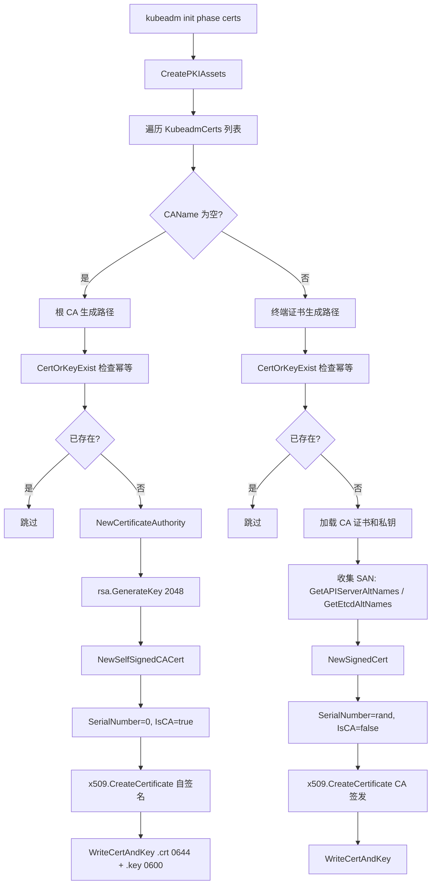
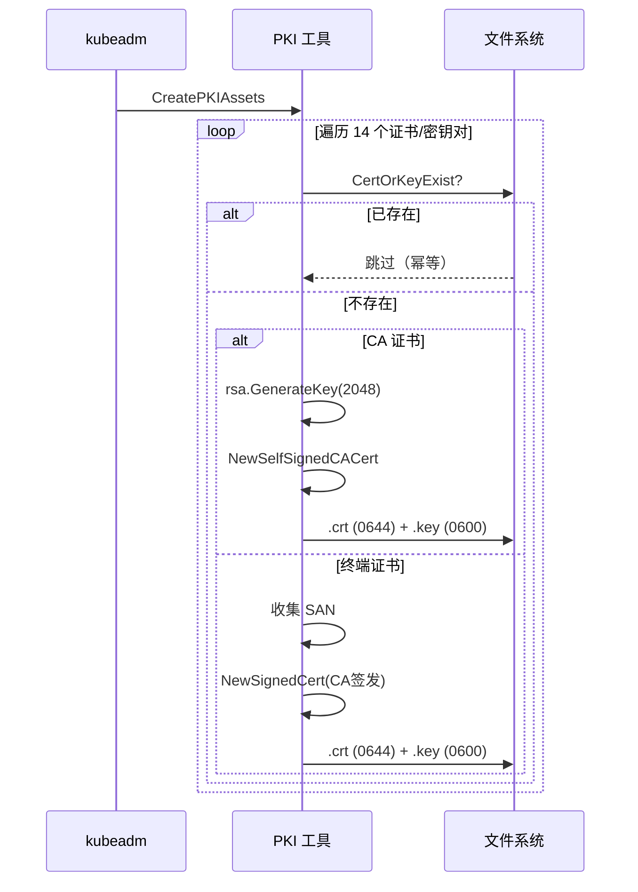

# CA 证书生成源码分析

## 函数签名

```go
func CreatePKIAssets(cfg *kubeadmapi.InitConfiguration) error

func NewCertificateAuthority(config *certutil.Config) (*x509.Certificate, crypto.Signer, error)

func NewSelfSignedCACert(cfg Config, key crypto.Signer) (*x509.Certificate, error)

func NewSignedCert(cfg certutil.Config, key crypto.Signer, caCert *x509.Certificate, caKey crypto.Signer) (*x509.Certificate, error)

func WriteCertAndKey(pkiPath string, name string, cert *x509.Certificate, key crypto.Signer) error

func CertOrKeyExist(pkiPath string, name string) bool

func UsingExternalCA(cfg *kubeadmapi.InitConfiguration) (bool, error)
```

## 源码位置

| 组件 | 源码路径 | 说明 |
|------|---------|------|
| CA 生成主控 | `cmd/kubeadm/app/phases/certs/certs.go` | CreatePKIAssets、KubeadmCerts 列表 |
| PKI 工具函数 | `cmd/kubeadm/app/util/pkiutil/pki_helpers.go` | NewCertificateAuthority、WriteCertAndKey |
| 通用证书库 | `staging/src/k8s.io/client-go/util/cert/cert.go` | NewSelfSignedCACert、NewSignedCert |
| 配置定义 | `cmd/kubeadm/app/phases/certs/certs.go` | KubeadmCert 结构体 |
| 证书验证 | `cmd/kubeadm/app/util/pkiutil/pki_helpers.go` | 证书已存在检查 |

## 参数说明

### KubeadmCerts 完整列表

| 证书名 | CA 来源 | CN | 类型 |
|--------|--------|-----|------|
| `ca` | 自签名 | `kubernetes-ca` | 根 CA |
| `etcd/ca` | 自签名 | `etcd-ca` | etcd CA |
| `front-proxy-ca` | 自签名 | `front-proxy-ca` | Front Proxy CA |
| `apiserver` | kubernetes-ca | `kube-apiserver` | 服务端证书 |
| `apiserver-kubelet-client` | kubernetes-ca | `kube-apiserver-kubelet-client` | 客户端证书 |
| `admin` | kubernetes-ca | `kubernetes-admin` | 客户端证书 |
| `controller-manager` | kubernetes-ca | `system:kube-controller-manager` | 客户端证书 |
| `scheduler` | kubernetes-ca | `system:kube-scheduler` | 客户端证书 |
| `etcd/server` | etcd-ca | `etcd-server` | 服务端证书 |
| `etcd/peer` | etcd-ca | `etcd-peer` | 服务端+客户端证书 |
| `etcd/healthcheck-client` | etcd-ca | `kube-etcd-healthcheck-client` | 客户端证书 |
| `apiserver-etcd-client` | etcd-ca | `kube-apiserver-etcd-client` | 客户端证书 |
| `front-proxy-client` | front-proxy-ca | `front-proxy-client` | 客户端证书 |
| `sa` | 无 (密钥对) | 无 | 公钥/私钥 |

### CA 证书关键属性

| 属性 | CA 证书 | 终端实体证书 |
|------|--------|-------------|
| `SerialNumber` | `0` (固定) | 随机 `big.Int` |
| `IsCA` | `true` | `false` |
| `KeyUsage` | `CertSign \| KeyEncipherment \| DigitalSignature` | `KeyEncipherment \| DigitalSignature` |
| `BasicConstraintsValid` | `true` | `true` |
| `ValidityPeriod` | 10 年 | 1 年 |
| 密钥算法 | RSA 2048 | RSA 2048 |

### 文件权限设计

| 文件类型 | 权限 | 说明 |
|---------|------|------|
| `.crt` (证书) | `0644` | 所有人可读 |
| `.key` (私钥) | `0600` | 仅 root 可读写 |

## 返回值

| 函数 | 返回值 | 说明 |
|------|--------|------|
| `CreatePKIAssets` | `error` | 所有证书生成成功或失败 |
| `NewCertificateAuthority` | `(*x509.Certificate, crypto.Signer, error)` | CA 证书和私钥 |
| `NewSelfSignedCACert` | `(*x509.Certificate, error)` | 自签名 CA 证书 |
| `NewSignedCert` | `(*x509.Certificate, error)` | CA 签发的终端证书 |
| `WriteCertAndKey` | `error` | 写入成功或失败 |
| `CertOrKeyExist` | `bool` | 证书/密钥是否已存在 |

## 调用链



## 源码分析

### 概述

Kubernetes 集群部署时，kubeadm 首先生成三组 CA 证书：kubernetes-ca、etcd-ca、front-proxy-ca。每个 CA 形成独立的信任域，签发各自的终端实体证书。CA 生成过程是幂等的——已存在的证书不会被覆盖，防止意外替换。

### CreatePKIAssets — 主控函数

```go
// cmd/kubeadm/app/phases/certs/certs.go
var KubeadmCerts = []*KubeadmCert{
    KubeadmCertRootCA,
    KubeadmCertEtcdCA,
    KubeadmCertFrontProxyCA,
    KubeadmCertApiserver,
    KubeadmCertApiserverKubeletClient,
    KubeadmCertAdmin,
    KubeadmCertControllerManager,
    KubeadmCertScheduler,
    KubeadmCertEtcdServer,
    KubeadmCertEtcdPeer,
    KubeadmCertEtcdHealthcheck,
    KubeadmCertApiserverEtcdClient,
    KubeadmCertFrontProxyClient,
    KubeadmCertServiceAccount,
}

func CreatePKIAssets(cfg *kubeadmapi.InitConfiguration) error {
    certificatesDir := cfg.CertificatesDir
    certList := KubeadmCerts

    for _, cert := range certList {
        if cert.CAName == "" {
            if err := cert.CreateFromCA(cfg, nil); err != nil {
                return err
            }
        } else {
            caCert := GetCert(cert.CAName)
            if err := cert.CreateFromCA(cfg, caCert); err != nil {
                return err
            }
        }
    }
    return nil
}
```

### NewSelfSignedCACert — CA 生成核心

```go
// staging/src/k8s.io/client-go/util/cert/cert.go
func NewSelfSignedCACert(cfg Config, key crypto.Signer) (*x509.Certificate, error) {
    now := time.Now()

    templ := x509.Certificate{
        SerialNumber: new(big.Int).SetInt64(0),
        Subject: pkix.Name{
            CommonName:   cfg.CommonName,
            Organization: cfg.Organization,
        },
        NotBefore:             now.UTC(),
        NotAfter:              now.Add(cfg.ValidityPeriod).UTC(),
        KeyUsage:              x509.KeyUsageKeyEncipherment | x509.KeyUsageDigitalSignature | x509.KeyUsageCertSign,
        BasicConstraintsValid: true,
        IsCA:                  true,
    }

    certDERBytes, err := x509.CreateCertificate(
        rand.Reader,
        &templ,
        &templ,
        key.Public(),
        key,
    )
    if err != nil {
        return nil, err
    }

    return x509.ParseCertificate(certDERBytes)
}
```

### NewCertificateAuthority — kubeadm 封装

```go
// cmd/kubeadm/app/util/pkiutil/pki_helpers.go
func NewCertificateAuthority(config *certutil.Config) (*x509.Certificate, crypto.Signer, error) {
    key, err := rsa.GenerateKey(cryptorand.Reader, 2048)
    if err != nil {
        return nil, nil, fmt.Errorf("failed to generate RSA key: %v", err)
    }

    cert, err := certutil.NewSelfSignedCACert(*config, key)
    if err != nil {
        return nil, nil, fmt.Errorf("failed to create self-signed CA certificate: %v", err)
    }

    return cert, key, nil
}
```

### 证书写入磁盘

```go
func WriteCertAndKey(pkiPath string, name string, cert *x509.Certificate, key crypto.Signer) error {
    if err := WriteCert(pkiPath, name, cert); err != nil {
        return err
    }
    return WriteKey(pkiPath, name, key)
}

func WriteCert(pkiPath string, name string, cert *x509.Certificate) error {
    certificatePath := pathForCert(pkiPath, name)
    return certutil.WriteCert(certificatePath, certToPem(cert))
}

func WriteKey(pkiPath string, name string, key crypto.Signer) error {
    privateKeyPath := pathForKey(pkiPath, name)
    return keyutil.WriteKey(privateKeyPath, keyToPem(key))
}
```

### 幂等性设计

```go
func (k *KubeadmCert) CreateFromCA(cfg *kubeadmapi.InitConfiguration, caCert *KubeadmCert) error {
    pkiDir := cfg.CertificatesDir
    if certutil.CertOrKeyExist(pkiDir, k.BaseName) {
        return nil  // 已存在，跳过
    }
    // ... 生成证书
}
```

### 外部 CA 支持

```go
func UsingExternalCA(cfg *kubeadmapi.InitConfiguration) (bool, error) {
    caCertExists := certutil.CertOrKeyExist(cfg.CertificatesDir, "ca")
    caKeyExists := keyutil.KeyExists(filepath.Join(cfg.CertificatesDir, "ca.key"))

    if caCertExists && !caKeyExists {
        return true, nil
    }
    return false, nil
}
```

## 执行流程



## 使用场景

1. **首次部署**：kubeadm init 生成完整 PKI
2. **证书续期**：`kubeadm certs renew` 利用已有 CA 签发新证书
3. **外部 CA**：预先放置 CA 证书（不含私钥），kubeadm 跳过签发
4. **证书检查**：`kubeadm certs check-expiration` 检查有效期
5. **证书轮换**：`kubeadm certs renew all` 批量续期

## 配置示例

```yaml
apiVersion: kubeadm.k8s.io/v1beta3
kind: InitConfiguration
certificatesDir: /etc/kubernetes/pki
---
apiVersion: kubeadm.k8s.io/v1beta3
kind: ClusterConfiguration
apiServer:
  certSANs:
    - "192.168.1.10"
    - "lb.example.com"
etcd:
  local:
    serverCertSANs:
      - "etcd.example.com"
    peerCertSANs:
      - "etcd-peer.example.com"
```

## 实战示例

### 证书检查

```bash
# 检查所有证书有效期
kubeadm certs check-expiration
# [certs] Checking expiration for certificate: ca
# CERTIFICATE                EXPIRES
# ca                         Jan 01, 2035 00:00 UTC   10y      no
# apiserver                  Jan 01, 2025 00:00 UTC   364d     yes
# apiserver-kubelet-client   Jan 01, 2025 00:00 UTC   364d     yes
# etcd/ca                    Jan 01, 2035 00:00 UTC   10y      no
# etcd/server                Jan 01, 2025 00:00 UTC   364d     yes
# ...

# 查看 CA 证书详情
openssl x509 -in /etc/kubernetes/pki/ca.crt -noout -text
# Subject: CN = kubernetes-ca
# Issuer: CN = kubernetes-ca
# X509v3 Basic Constraints: critical
#     CA:TRUE
# X509v3 Key Usage: critical
#     Certificate Sign, Key Encipherment, Digital Signature

# 续期所有证书
kubeadm certs renew all
# [certs] Renewed certificate: apiserver
# [certs] Renewed certificate: apiserver-kubelet-client
# [certs] Renewed certificate: etcd/server
# ...

# 重启组件使证书生效
systemctl restart kubelet
```

## 常见错误

| 错误 | 现象 | 原因 | 解决方案 |
|------|------|------|----------|
| CA 私钥丢失 | `unable to sign certificate: private key not found` | 外部 CA 模式下 ca.key 缺失 | 使用外部 PKI 签发所有证书 |
| RSA 密钥生成失败 | `failed to generate RSA key` | 系统熵不足 | 安装 `haveged` 或使用硬件 RNG |
| 证书已存在 | kubeadm init 跳过证书 | 幂等性设计 | 手动删除旧证书后重新生成 |
| SAN 缺失 | 外部访问 TLS 失败 | certSANs 未配置 | 添加 SAN 后 `kubeadm init phase certs apiserver` |
| 证书链不完整 | `certificate signed by unknown authority` | CA 证书文件损坏 | `kubeadm init phase certs ca` 重新生成 |

## 相关函数

- [`GetAPIServerAltNames`](13-cert-config.md) — API Server SAN 收集
- [`GetEtcdAltNames`](04-etcd-cert.md) — etcd SAN 收集
- [`buildKubeConfigFromSpec`](12-kubeconfig-certs.md) — kubeconfig 证书嵌入
- [`X509 Authenticator`](08-rbac-mapping.md) — 证书身份提取
- [`kubeadm certs renew`](README.md) — 证书续期命令
