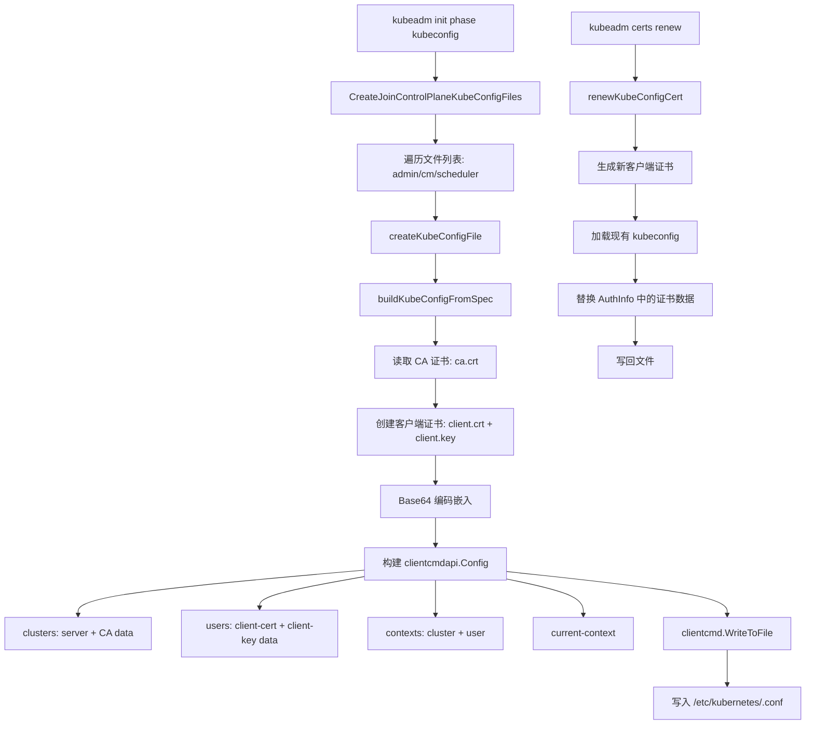
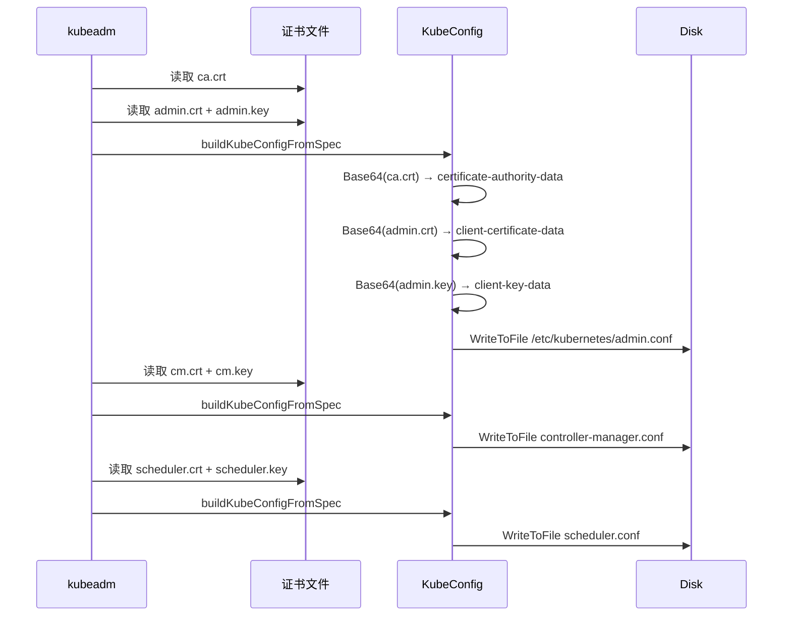

# kubeconfig 中的证书嵌入逻辑

## 函数签名

```go
func CreateJoinControlPlaneKubeConfigFiles(outDir string, cfg *kubeadmapi.InitConfiguration, kubeConfigFileNames []string) error

func buildKubeConfigFromSpec(spec *kubeConfigSpec) (*clientcmdapi.Config, error)

func createKubeConfigFile(certDir string, spec *kubeConfigSpec, kubeConfigFileName string) error

func WriteKubeConfig(out io.Writer, kubeConfigFileName string, cfg *kubeadmapi.InitConfiguration, kubeConfigSpec *kubeConfigSpec) error

func renewKubeConfigCert(cfg *kubeadmapi.InitConfiguration, cert *certs.KubeadmCert) error
```

## 源码位置

| 组件 | 源码路径 | 说明 |
|------|---------|------|
| kubeconfig 生成主控 | `cmd/kubeadm/app/phases/kubeconfig/kubeconfig.go` | 创建所有 kubeconfig 文件 |
| kubeconfig 工具 | `cmd/kubeadm/app/util/kubeconfig/kubeconfig.go` | 加载/写入/验证 kubeconfig |
| 客户端证书创建 | `cmd/kubeadm/app/phases/certs/certs.go` | 证书 CN/O 定义 |
| client-go 配置 | `staging/src/k8s.io/client-go/tools/clientcmd/` | kubeconfig 解析库 |

## 参数说明

### kubeadm 生成的 kubeconfig 列表

| kubeconfig 文件 | 使用者 | CN | Organization | CA 来源 | 存储 |
|----------------|-------|-----|-------------|--------|------|
| `admin.conf` | 集群管理员 | `kubernetes-admin` | `system:masters` | kubernetes-ca | `/etc/kubernetes/admin.conf` |
| `super-admin.conf` | 超级管理员(v1.29+) | `kubernetes-super-admin` | `system:masters` | kubernetes-ca | `/etc/kubernetes/super-admin.conf` |
| `controller-manager.conf` | kube-controller-manager | `system:kube-controller-manager` | `system:kube-controller-manager` | kubernetes-ca | `/etc/kubernetes/controller-manager.conf` |
| `scheduler.conf` | kube-scheduler | `system:kube-scheduler` | `system:kube-scheduler` | kubernetes-ca | `/etc/kubernetes/scheduler.conf` |
| `kubelet.conf` | kubelet | `system:node:<name>` | `system:nodes` | kubernetes-ca | `/etc/kubernetes/kubelet.conf` |

### kubeConfigSpec 字段

| 字段 | 类型 | 说明 |
|------|------|------|
| `ClientName` | `string` | 客户端证书 CommonName |
| `Organization` | `[]string` | 客户端证书 Organization |
| `CAPath` | `string` | CA 证书文件路径 |
| `ClientCertPath` | `string` | 客户端证书文件路径 |
| `ClientKeyPath` | `string` | 客户端私钥文件路径 |
| `APIServerEndpoint` | `string` | API Server 地址 |
| `ClusterName` | `string` | 集群名称 |

### 嵌入模式 vs 引用模式对比

| 特性 | 嵌入模式 | 引用模式 |
|-----|---------|---------|
| 文件数量 | 单个 kubeconfig 文件 | kubeconfig + 多个证书文件 |
| 分发便利性 | 高（单文件） | 低（需同步多文件） |
| 证书更新 | 需重新生成 kubeconfig | 替换证书文件即可 |
| 安全性 | 私钥在文件中 | 私钥可单独设置权限 |
| kubeadm 默认 | **是** | 否 |

## 返回值

| 函数 | 返回值 | 说明 |
|------|--------|------|
| `CreateJoinControlPlaneKubeConfigFiles` | `error` | 所有 kubeconfig 创建成功或失败 |
| `buildKubeConfigFromSpec` | `(*clientcmdapi.Config, error)` | 构建的 kubeconfig 对象 |
| `createKubeConfigFile` | `error` | 单个 kubeconfig 写入成功或失败 |
| `renewKubeConfigCert` | `error` | 证书续期成功或失败 |

## 调用链



## 源码分析

### 概述

kubeadm 在证书阶段不仅生成 `.crt`/`.key` 文件，还会生成多个 kubeconfig 文件。这些 kubeconfig 文件将 CA 证书和客户端证书以 Base64 编码直接嵌入，使组件无需依赖外部证书文件即可建立 TLS 连接。

### kubeconfig 生成核心源码

```go
// cmd/kubeadm/app/phases/kubeconfig/kubeconfig.go
func CreateJoinControlPlaneKubeConfigFiles(outDir string, cfg *kubeadmapi.InitConfiguration, kubeConfigFileNames []string) error {
    for _, kubeConfigFileName := range kubeConfigFileNames {
        spec, err := buildKubeConfigSpec(cfg, kubeConfigFileName)
        if err != nil {
            return err
        }

        if err := createKubeConfigFile(outDir, spec, kubeConfigFileName); err != nil {
            return err
        }
    }
    return nil
}

func buildKubeConfigFromSpec(spec *kubeConfigSpec) (*clientcmdapi.Config, error) {
    caCert, err := os.ReadFile(spec.CAPath)
    if err != nil {
        return nil, fmt.Errorf("failed to read CA cert: %v", err)
    }

    clientCert, clientKey, err := getOrCreateClientCert(spec)
    if err != nil {
        return nil, fmt.Errorf("failed to get client cert: %v", err)
    }

    config := &clientcmdapi.Config{
        Clusters: map[string]*clientcmdapi.Cluster{
            spec.ClusterName: {
                Server:                   spec.APIServerEndpoint,
                CertificateAuthorityData: caCert,
            },
        },
        AuthInfos: map[string]*clientcmdapi.AuthInfo{
            spec.ClientName: {
                ClientCertificateData: clientCert,
                ClientKeyData:         clientKey,
            },
        },
        Contexts: map[string]*clientcmdapi.Context{
            spec.ClientName + "@" + spec.ClusterName: {
                Cluster:  spec.ClusterName,
                AuthInfo: spec.ClientName,
            },
        },
        CurrentContext: spec.ClientName + "@" + spec.ClusterName,
    }

    return config, nil
}
```

### 嵌入模式示例

```yaml
apiVersion: v1
kind: Config
clusters:
- cluster:
    certificate-authority-data: LS0tLS1CRUdJTi...  # Base64 ca.crt
    server: https://192.168.1.10:6443
  name: kubernetes
users:
- name: kubernetes-admin
  user:
    client-certificate-data: LS0tLS1CRUdJTi...    # Base64 admin.crt
    client-key-data: LS0tLS1CRUdJTi...            # Base64 admin.key
contexts:
- context:
    cluster: kubernetes
    user: kubernetes-admin
  name: kubernetes-admin@kubernetes
current-context: kubernetes-admin@kubernetes
```

### 证书轮换对 kubeconfig 的影响

```go
func renewKubeConfigCert(cfg *kubeadmapi.InitConfiguration, cert *certs.KubeadmCert) error {
    newCert, newKey, err := generateNewClientCert(cfg, cert)
    if err != nil {
        return err
    }

    kubeConfig, err := clientcmd.LoadFromFile(cert.KubeConfigFile)
    if err != nil {
        return err
    }

    authInfo := kubeConfig.AuthInfos[cert.ClientName]
    authInfo.ClientCertificateData = certToPEM(newCert)
    authInfo.ClientKeyData = keyToPEM(newKey)

    return clientcmd.WriteToFile(*kubeConfig, cert.KubeConfigFile)
}
```

### 各组件 kubeconfig 的启动参数

```bash
# Controller Manager
--kubeconfig=/etc/kubernetes/controller-manager.conf
--authentication-kubeconfig=/etc/kubernetes/controller-manager.conf
--authorization-kubeconfig=/etc/kubernetes/controller-manager.conf

# Scheduler
--kubeconfig=/etc/kubernetes/scheduler.conf
--authentication-kubeconfig=/etc/kubernetes/scheduler.conf
--authorization-kubeconfig=/etc/kubernetes/scheduler.conf
```

### 高可用集群中的 kubeconfig

```yaml
# admin.conf 中的 server 地址
clusters:
- cluster:
    server: https://lb.example.com:6443  # controlPlaneEndpoint
```

## 执行流程



## 使用场景

1. **管理员访问**：使用 admin.conf 作为 kubectl 配置
2. **组件认证**：Controller Manager/Scheduler 使用各自的 kubeconfig
3. **证书续期**：`kubeadm certs renew` 自动更新嵌入的证书
4. **多集群管理**：不同 kubeconfig 指向不同集群
5. **CI/CD 集成**：将 kubeconfig 作为 Secret 注入 Pipeline

## 配置示例

### kubeconfig 文件结构

```yaml
apiVersion: v1
kind: Config
clusters:
- cluster:
    certificate-authority-data: LS0tLS1CRUdJTiBDRVJUSUZJQ0FURS0tLS0tCk1JSUR...
    server: https://192.168.1.10:6443
  name: production
users:
- name: kubernetes-admin
  user:
    client-certificate-data: LS0tLS1CRUdJTiBDRVJUSUZJQ0FURS0tLS0tCk1JSUR...
    client-key-data: LS0tLS1CRUdJTiBSU0EgUFJJVkFURSBLRVktLS0tLQpNSUl...
contexts:
- context:
    cluster: production
    user: kubernetes-admin
  name: admin@production
current-context: admin@production
```

## 实战示例

### kubeconfig 证书检查

```bash
# 查看 kubeconfig
kubectl config view --raw

# 提取并解码 CA 证书
kubectl config view --raw -o jsonpath='{.clusters[0].cluster.certificate-authority-data}' | base64 -d > ca.crt
openssl x509 -in ca.crt -noout -subject -issuer
# subject=CN = kubernetes-ca
# issuer=CN = kubernetes-ca

# 提取并解码客户端证书
kubectl config view --raw -o jsonpath='{.users[0].user.client-certificate-data}' | base64 -d > client.crt
openssl x509 -in client.crt -noout -subject -enddate
# subject=CN = kubernetes-admin, O = system:masters
# notAfter=Jan  1 00:00:00 2026 GMT

# 查看证书有效期
kubectl config view --raw -o jsonpath='{.users[0].user.client-certificate-data}' | base64 -d | openssl x509 -noout -enddate
# notAfter=Jan  1 00:00:00 2026 GMT

# 更新 kubeconfig 中的证书
kubectl config set-credentials kubernetes-admin \
  --client-certificate=/etc/kubernetes/pki/admin.crt \
  --client-key=/etc/kubernetes/pki/admin.key \
  --embed-certs=true

# 更新 CA
kubectl config set-cluster kubernetes \
  --certificate-authority=/etc/kubernetes/pki/ca.crt \
  --embed-certs=true
```

### 高可用场景 kubeconfig

```bash
# 使用 controlPlaneEndpoint 的 admin.conf
cat /etc/kubernetes/admin.conf | grep server:
#     server: https://lb.example.com:6443

# 如果 SAN 缺少 lb.example.com
openssl x509 -in /etc/kubernetes/pki/apiserver.crt -noout -ext subjectAltName | grep lb.example.com
# (empty - SAN missing)

# 修复: 添加 certSANs 并重新生成
kubeadm init phase certs apiserver --config kubeadm-config.yaml
kubeadm init phase kubeconfig admin --config kubeadm-config.yaml
```

## 常见错误

| 错误 | 现象 | 原因 | 解决方案 |
|------|------|------|----------|
| kubeconfig 证书过期 | `Unable to connect: x509: certificate has expired` | 嵌入的客户端证书过期 | `kubeadm certs renew admin.conf` |
| CA 不匹配 | `certificate signed by unknown authority` | kubeconfig 中 CA 与服务端 CA 不同 | 重新生成 kubeconfig |
| 私钥不匹配 | `tls: private key does not match public key` | 证书与密钥不匹配 | 完整续期所有相关证书 |
| 权限不足 | `Error from server (Forbidden)` | 证书 CN/O 的 RBAC 权限不够 | 检查并创建对应的 ClusterRoleBinding |
| server 地址不可达 | `connection refused` | controlPlaneEndpoint 配置错误 | 检查负载均衡器配置 |

## 相关函数

- [`CreatePKIAssets`](02-ca-generation.md) — 证书生成入口
- [`buildKubeConfigFromSpec`](README.md) — kubeconfig 构建核心
- [`GetAPIServerAltNames`](13-cert-config.md) — API Server SAN 计算
- [`kubeadm certs renew`](README.md) — 证书续期命令
- [`X509 Authenticator`](08-rbac-mapping.md) — 证书身份提取
