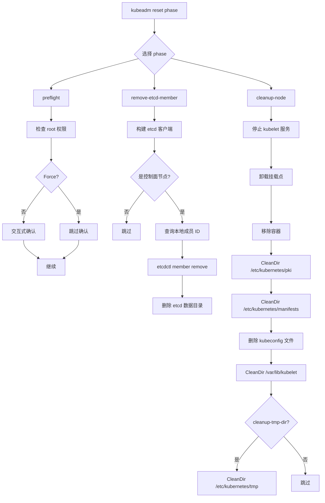

# reset 子命令与 Phase 操作速查

## 函数签名

```go
func NewPreflightPhase() workflow.Phase
func NewRemoveETCDMemberPhase() workflow.Phase
func NewCleanupNodePhase() workflow.Phase

func runPreflight(c workflow.RunData) error
func runRemoveETCDMember(c workflow.RunData) error
func runCleanupNode(c workflow.RunData) error
```

## 源码位置

| 组件 | 源码路径 | 说明 |
|------|---------|------|
| Phase 注册 | `cmd/kubeadm/app/cmd/phases/reset/reset.go` | Phase 列表定义 |
| preflight | `cmd/kubeadm/app/cmd/phases/reset/preflight.go` | 预检阶段实现 |
| remove-etcd-member | `cmd/kubeadm/app/cmd/phases/reset/removeetcdmember.go` | etcd 成员移除 |
| cleanup-node | `cmd/kubeadm/app/cmd/phases/reset/cleanupnode.go` | 节点清理 |
| unmount | `cmd/kubeadm/app/cmd/phases/reset/unmount.go` | 挂载点卸载 |
| workflow runner | `cmd/kubeadm/app/cmd/phases/workflow/runner.go` | Phase 执行框架 |

## 参数说明

### preflight Phase 继承的标志

| 标志 | 来源常量 | 说明 |
|------|---------|------|
| `--dry-run` | `options.DryRun` | 干跑模式，不执行实际操作 |
| `-f, --force` | `options.Force` | 跳过用户确认提示 |
| `--ignore-preflight-errors` | `options.IgnorePreflightErrors` | 忽略指定预检错误 |

### remove-etcd-member Phase 继承的标志

| 标志 | 来源常量 | 说明 |
|------|---------|------|
| `--dry-run` | `options.DryRun` | 干跑模式 |
| `--kubeconfig` | `options.KubeconfigPath` | kubeconfig 路径 |

### cleanup-node Phase 继承的标志

| 标志 | 来源常量 | 说明 |
|------|---------|------|
| `--certificates-dir` | `options.CertificatesDir` | 证书目录，默认 `/etc/kubernetes/pki` |
| `--cri-socket` | `options.NodeCRISocket` | CRI socket 路径 |
| `--cleanup-tmp-dir` | `options.CleanupTmpDir` | 是否清理 `/etc/kubernetes/tmp` |
| `--dry-run` | `options.DryRun` | 干跑模式 |

### 全局标志

| 标志 | 说明 | 默认值 |
|------|------|--------|
| `--config` | 配置文件路径 | |
| `--kubeconfig` | kubeconfig 路径 | `/etc/kubernetes/admin.conf` |

## 返回值

| 函数 | 返回值 | 说明 |
|------|--------|------|
| `NewPreflightPhase` | `workflow.Phase` | 预检阶段定义 |
| `NewRemoveETCDMemberPhase` | `workflow.Phase` | etcd 移除阶段定义 |
| `NewCleanupNodePhase` | `workflow.Phase` | 清理阶段定义 |
| `runPreflight` | `error` | 预检失败返回错误 |
| `runRemoveETCDMember` | `error` | etcd 移除失败返回错误 |
| `runCleanupNode` | `error` | 清理失败返回错误 |

## 调用链



## 源码分析

### 概述

与 `kubeadm init phase` 类似，`kubeadm reset` 支持通过子命令单独执行各个阶段。reset 共有 3 个 Phase：preflight、remove-etcd-member、cleanup-node。每个 Phase 通过 `InheritFlags` 声明它需要的命令行标志，`workflow.Runner.BindToCommand()` 会自动将继承的标志绑定到对应的 phase 子命令上。

### Phase 定义源码

```go
// cmd/kubeadm/app/cmd/phases/reset/preflight.go
func NewPreflightPhase() workflow.Phase {
    return workflow.Phase{
        Name:         "preflight",
        Aliases:      []string{"pre-flight"},
        Short:        "Run reset pre-flight checks",
        InheritFlags: []string{
            options.IgnorePreflightErrors,
            options.Force,
            options.DryRun,
        },
        Run: runPreflight,
    }
}

func runPreflight(c workflow.RunData) error {
    r := c.(resetData)
    if !r.ForceReset() && !r.DryRun() {
        if err := util.InteractivelyConfirmAction("reset",
            "Are you sure you want to proceed?", r.InputReader()); err != nil {
            return err
        }
    }
    fmt.Println("[preflight] Running pre-flight checks")
    return preflight.RunRootCheckOnly(r.IgnorePreflightErrors())
}
```

### remove-etcd-member Phase

```go
// cmd/kubeadm/app/cmd/phases/reset/removeetcdmember.go
func NewRemoveETCDMemberPhase() workflow.Phase {
    return workflow.Phase{
        Name:         "remove-etcd-member",
        Short:        "Remove a local etcd member",
        InheritFlags: []string{
            options.KubeconfigPath,
            options.DryRun,
        },
        Run: runRemoveETCDMember,
    }
}

func runRemoveETCDMember(c workflow.RunData) error {
    r := c.(resetData)
    if r.Cfg() == nil {
        fmt.Println("[reset] No kubeadm config, skipping etcd member removal")
        return nil
    }
    if r.DryRun() {
        fmt.Println("[dryrun] Would remove local etcd member")
        return nil
    }
    return etcdphase.RemoveStackedEtcdMember(
        r.Client(),
        r.Cfg(),
        r.ResetCfg().Timeouts.EtcdTakeover.Duration,
    )
}
```

### cleanup-node Phase

```go
// cmd/kubeadm/app/cmd/phases/reset/cleanupnode.go
func NewCleanupNodePhase() workflow.Phase {
    return workflow.Phase{
        Name:         "cleanup-node",
        Aliases:      []string{"cleanupnode"},
        Short:        "Run cleanup node",
        InheritFlags: []string{
            options.CertificatesDir,
            options.NodeCRISocket,
            options.CleanupTmpDir,
            options.DryRun,
        },
        Run: runCleanupNode,
    }
}

func runCleanupNode(c workflow.RunData) error {
    r := c.(resetData)
    addFlag := ""
    if r.DryRun() {
        addFlag = "[dryrun] "
    }

    fmt.Printf("[%s] Stopping the kubelet service\n", addFlag)
    if !r.DryRun() {
        stopKubelet()
    }

    fmt.Printf("[%s] Unmounting mounted directories in %q\n", addFlag, "/var/lib/kubelet")
    if !r.DryRun() {
        unmountKubeletDirectory()
    }

    fmt.Printf("[%s] Removing Kubernetes-managed containers\n", addFlag)
    if !r.DryRun() {
        removeKubernetesContainers(r.CRISocketPath())
    }

    dirsToClean := []string{
        filepath.Join(r.CertificatesDir()),
        "/etc/kubernetes/manifests",
    }
    for _, dir := range dirsToClean {
        fmt.Printf("[%s] Deleting contents of %s\n", addFlag, dir)
        if !r.DryRun() {
            CleanDir(dir)
        }
    }

    filesToDelete := []string{
        "/etc/kubernetes/admin.conf",
        "/etc/kubernetes/super-admin.conf",
        "/etc/kubernetes/kubelet.conf",
        "/etc/kubernetes/bootstrap-kubelet.conf",
        "/etc/kubernetes/controller-manager.conf",
        "/etc/kubernetes/scheduler.conf",
    }
    for _, file := range filesToDelete {
        fmt.Printf("[%s] Deleting file %s\n", addFlag, file)
        if !r.DryRun() {
            os.RemoveAll(file)
        }
    }

    if r.CleanupTmpDir() {
        fmt.Printf("[%s] Deleting contents of /etc/kubernetes/tmp\n", addFlag)
        if !r.DryRun() {
            CleanDir("/etc/kubernetes/tmp")
        }
    }

    CleanDir("/var/lib/kubelet")
    CleanDir("/var/lib/etcd")

    return nil
}
```

### init vs reset Phase 对比

```
┌──────────────────────────────────────────────────────────────────┐
│  kubeadm init phases              │ kubeadm reset phases          │
├───────────────────────────────────┼──────────────────────────────┤
│  preflight                        │ preflight                     │
│  certs                            │ ─                            │
│  kubeconfig                       │ ─                            │
│  kubelet-start                    │ ─                            │
│  control-plane                    │ ─                            │
│  etcd                             │ remove-etcd-member           │
│  wait-control-plane               │ ─                            │
│  upload-config                    │ ─                            │
│  bootstrap-token                  │ ─                            │
│  mark-control-plane               │ ─                            │
│  addon                            │ ─                            │
│  ─                                │ cleanup-node                 │
├───────────────────────────────────┼──────────────────────────────┤
│  共 12 个 phase                   │ 共 3 个 phase                 │
└───────────────────────────────────┴──────────────────────────────┘
```

**关键差异**：
- init 是构建过程（12 个阶段），逐步创建组件
- reset 是销毁过程（3 个阶段），快速回滚
- reset 的 `cleanup-node` 是一个聚合阶段，一次性完成所有清理

## 执行流程

```
1. 用户执行 kubeadm reset phase <command>
2. workflow.Runner 解析命令，匹配 Phase Name 或 Alias
3. 从全局数据中获取 resetData
4. 执行 Phase.Run(data)
5. 根据继承标志读取配置参数
6. 输出执行日志
7. 返回执行结果
```

## 使用场景

1. **仅移除 etcd 成员**：节点已清理，但 etcd 成员残留
2. **仅清理节点**：etcd 已手动移除，只需清理本机配置
3. **跳过确认脚本化**：`--force` 标志用于自动化脚本
4. **干跑验证**：`--dry-run` 预览将要执行的操作
5. **配置文件驱动**：`--config` 使用 ResetConfiguration YAML

## 配置示例

```yaml
apiVersion: kubeadm.k8s.io/v1beta4
kind: ResetConfiguration
certificatesDir: /etc/kubernetes/pki
cleanupTmpDir: true
criSocket: unix:///run/containerd/containerd.sock
dryRun: false
force: true
ignorePreflightErrors:
  - IsPrivilegedUser
skipPhases:
  - preflight
unmountFlags:
  - MNT_DETACH
timeouts:
  etcdTakeover: 2m0s
```

使用配置文件执行：

```bash
kubeadm reset --config=reset-config.yaml
```

**优先级**: 命令行标志 > 配置文件 > 默认值

## 实战示例

### 分阶段执行 reset

```bash
# 阶段 1: 预检（带确认）
kubeadm reset phase preflight
# [reset] Are you sure you want to proceed? [y/N]: y
# [preflight] Running pre-flight checks

# 阶段 2: 移除 etcd 成员
kubeadm reset phase remove-etcd-member --kubeconfig=/etc/kubernetes/admin.conf
# [reset] Reading configuration from the cluster...
# [reset] Removing local etcd member

# 阶段 3: 清理节点
kubeadm reset phase cleanup-node --cleanup-tmp-dir
# [reset] Stopping the kubelet service
# [reset] Unmounting mounted directories in "/var/lib/kubelet"
# [reset] Removing Kubernetes-managed containers
# [reset] Deleting contents of /etc/kubernetes/pki
# [reset] Deleting contents of /etc/kubernetes/manifests
# [reset] Deleting file /etc/kubernetes/admin.conf
# [reset] Deleting file /etc/kubernetes/kubelet.conf
# [reset] Deleting file /etc/kubernetes/controller-manager.conf
# [reset] Deleting file /etc/kubernetes/scheduler.conf
# [reset] Deleting contents of /etc/kubernetes/tmp
# [reset] Deleting contents of /var/lib/kubelet
# [reset] Deleting contents of /var/lib/etcd
```

### 跳过 etcd 移除执行完整 reset

```bash
kubeadm reset --force --skip-phases=remove-etcd-member
# [preflight] Running pre-flight checks
# [reset] Stopping the kubelet service
# [reset] Unmounting mounted directories in "/var/lib/kubelet"
# [reset] Removing Kubernetes-managed containers
# [reset] Deleting contents of /etc/kubernetes/pki
# ...
```

### kubectl view 输出对比

```bash
# 查看帮助
kubeadm reset phase --help
# Use "kubeadm reset phase <command> --help" for more information about a given command.
#
# Available Commands:
#   cleanup-node        Run cleanup node
#   preflight           Run reset pre-flight checks
#   remove-etcd-member  Remove a local etcd member

# 查看 cleanup-node 帮助
kubeadm reset phase cleanup-node --help
# Run cleanup node
#
# Usage:
#   kubeadm reset phase cleanup-node [flags]
#
# Flags:
#       --certificates-dir string   The directory where the certificates are stored. (default "/etc/kubernetes/pki")
#       --cleanup-tmp-dir           Also clean up the /etc/kubernetes/tmp directory.
#       --cri-socket string         Path to the CRI socket to connect
#   -h, --help                      help for cleanup-node
```

## 常见错误

| 错误 | 现象 | 原因 | 解决方案 |
|------|------|------|----------|
| 未知 phase 名 | `unknown phase "xxx"` | phase 名称拼写错误 | `kubeadm reset phase --help` 查看可用 phase |
| 标志不生效 | `unknown flag: --kubeconfig` 在 preflight 阶段 | 标志不属于该 phase 的 InheritFlags | 查看每个 phase 的 `--help` |
| skip-phases 全部跳过 | reset 没执行任何操作 | `--skip-phases=preflight,remove-etcd-member,cleanup-node` | 至少保留 cleanup-node |
| config 文件与标志冲突 | 配置与命令行不一致 | 命令行优先级高于配置文件 | 使用 `--config` 时避免混用命令行标志 |
| 退出码非零 | 脚本中 reset 返回 1 | preflight 确认拒绝或致命错误 | 使用 `--force` 或检查错误信息 |

## 相关函数

- [`newCmdReset`](01-overview.md) — reset 命令入口，Phase 注册
- [`runCleanupNode`](04-cleanup.md) — cleanup-node 阶段详细实现
- [`runRemoveEtcd`](05-etcd-cleanup.md) — etcd 成员移除详细实现
- [`CleanDir`](04-cleanup.md) — 目录清理工具函数
- [`RemoveStackedEtcdMember`](05-etcd-cleanup.md) — 移除 stacked etcd 成员
- [`InteractivelyConfirmAction`](02-reset.md) — 交互式确认工具
