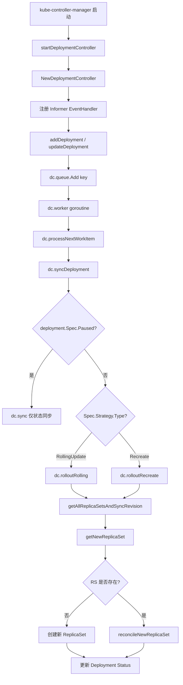

# Deployment Create — Kubernetes Deployment 控制器源码分析

## 函数签名

```go
func NewDeploymentController(
    dInformer appsinformers.DeploymentInformer,
    rsInformer appsinformers.ReplicaSetInformer,
    podInformer coreinformers.PodInformer,
    client clientset.Interface,
) (*DeploymentController, error)

func (dc *DeploymentController) Run(workers int, stopCh <-chan struct{})

func (dc *DeploymentController) syncDeployment(ctx context.Context, key string) error
```

## 源码位置

| 组件 | 源码路径 | 说明 |
|------|---------|------|
| 控制器入口 | `pkg/controller/deployment/deployment_controller.go` | NewDeploymentController、Run、事件处理 |
| 同步逻辑 | `pkg/controller/deployment/sync.go` | syncDeployment、getAllReplicaSetsAndSyncRevision |
| 滚动更新 | `pkg/controller/deployment/rolling.go` | rolloutRolling、reconcileNewReplicaSet |
| Recreate 策略 | `pkg/controller/deployment/recreate.go` | rolloutRecreate |
| 进度追踪 | `pkg/controller/deployment/progress.go` | calculateStatus、syncRolloutStatus |
| 回滚逻辑 | `pkg/controller/deployment/rollback.go` | rollbackToRevision |
| ReplicaSet 工具 | `pkg/controller/deployment/util/deployment_util.go` | FindNewReplicaSet、GetNewReplicaSet |
| ReplicaSet 控制器 | `pkg/controller/replicaset/replica_set.go` | ReplicaSet 核心逻辑 |
| API 类型 | `staging/src/k8s.io/api/apps/v1/types.go` | Deployment/ReplicaSet 数据结构 |

## 参数说明

### NewDeploymentController 参数

| 参数名 | 类型 | 说明 |
|--------|------|------|
| `dInformer` | `appsinformers.DeploymentInformer` | Deployment 资源 Informer，监听 Deployment 变更 |
| `rsInformer` | `appsinformers.ReplicaSetInformer` | ReplicaSet 资源 Informer，监听 RS 变更 |
| `podInformer` | `coreinformers.PodInformer` | Pod 资源 Informer，监听 Pod 变更 |
| `client` | `clientset.Interface` | Kubernetes API 客户端，用于 CRUD 操作 |

### DeploymentSpec 关键字段

| 字段 | 类型 | 说明 | 默认值 |
|------|------|------|--------|
| `replicas` | `*int32` | 期望副本数 | 1 |
| `selector` | `*metav1.LabelSelector` | Pod 选择器，必须匹配 template.labels | 必填 |
| `template` | `corev1.PodTemplateSpec` | Pod 模板定义 | 必填 |
| `strategy` | `DeploymentStrategy` | 更新策略 | RollingUpdate |
| `minReadySeconds` | `int32` | Pod 就绪后最少等待秒数 | 0 |
| `revisionHistoryLimit` | `*int32` | 保留历史 ReplicaSet 数量 | 10 |
| `progressDeadlineSeconds` | `*int32` | 进度超时时间（秒） | 600 |
| `paused` | `bool` | 是否暂停发布 | false |

## 返回值

| 函数 | 返回值 | 说明 |
|------|--------|------|
| `NewDeploymentController` | `(*DeploymentController, error)` | 返回控制器实例，初始化失败时返回 error |
| `Run` | 无 | 阻塞运行，直到 stopCh 关闭 |
| `syncDeployment` | `error` | 同步成功返回 nil，失败返回具体错误 |

## 调用链



## 源码分析

### 概述

本模块基于 Kubernetes 官方源码（`kubernetes/kubernetes`），系统梳理 Deployment 控制器创建、更新、扩缩容、滚动发布的完整逻辑。Deployment 是 Kubernetes 中最常用的无状态工作负载管理对象，它通过 ReplicaSet 间接管理 Pod，提供声明式更新、滚动发布、版本回滚等核心能力。

Deployment 控制器本质上是一个典型的 Kubernetes 控制器模式（Informer + WorkQueue + Reconcile Loop）的实现。它监听 Deployment、ReplicaSet、Pod 三种资源的变化事件，通过事件驱动的协调循环（Reconcile Loop）将集群的实际状态不断逼近用户声明的期望状态。

### 控制器层级关系

Deployment 控制器采用分层管理架构。用户创建 Deployment 对象后，Deployment 控制器并不会直接创建或管理 Pod，而是通过 ReplicaSet 这个中间层间接管理 Pod。这种设计有几个重要原因：

1. **版本管理**：每次 Deployment 更新模板时，会创建一个新的 ReplicaSet，旧版本的 ReplicaSet 被保留（按 `revisionHistoryLimit` 限制数量），从而支持版本回滚
2. **滚动发布控制**：通过同时管理新旧多个 ReplicaSet 的副本数，实现精确的滚动更新控制
3. **关注点分离**：ReplicaSet 控制器专注于 Pod 副本数的精确管理，Deployment 控制器专注于发布策略和版本编排

### 控制器初始化源码

```go
// pkg/controller/deployment/deployment_controller.go
func NewDeploymentController(
    dInformer appsinformers.DeploymentInformer,
    rsInformer appsinformers.ReplicaSetInformer,
    podInformer coreinformers.PodInformer,
    client clientset.Interface,
) (*DeploymentController, error) {
    dc := &DeploymentController{
        client:        client,
        eventBroadcaster: record.NewBroadcaster(),
    }

    dc.eventBroadcaster.StartLogging(klog.Infof)
    dc.eventBroadcaster.StartRecordingToSink(&coreclient.EventSinkImpl{Interface: client.CoreV1().Events("")})
    dc.recorder = dc.eventBroadcaster.NewRecorder(scheme.Scheme, v1.EventSource{Component: "deployment-controller"})

    dc.dLister = dInformer.Lister()
    dc.rsLister = rsInformer.Lister()
    dc.podLister = podInformer.Lister()

    dc.dListerSynced = dInformer.Informer().HasSynced
    dc.rsListerSynced = rsInformer.Informer().HasSynced
    dc.podListerSynced = podInformer.Informer().HasSynced

    dInformer.Informer().AddEventHandler(cache.ResourceEventHandlerFuncs{
        AddFunc:    dc.addDeployment,
        UpdateFunc: dc.updateDeployment,
        DeleteFunc: dc.deleteDeployment,
    })

    rsInformer.Informer().AddEventHandler(cache.ResourceEventHandlerFuncs{
        AddFunc:    dc.addReplicaSet,
        UpdateFunc: dc.updateReplicaSet,
        DeleteFunc: dc.deleteReplicaSet,
    })

    podInformer.Informer().AddEventHandler(cache.ResourceEventHandlerFuncs{
        DeleteFunc: dc.deletePod,
    })

    dc.queue = workqueue.NewNamedRateLimitingQueue(
        workqueue.NewControllerRateLimiter(),
        "deployment",
    )

    return dc, nil
}
```

### Informer 事件处理源码

```go
func (dc *DeploymentController) addDeployment(obj interface{}) {
    d := obj.(*apps.Deployment)
    klog.V(4).Infof("Adding deployment %s/%s", d.Namespace, d.Name)
    dc.enqueueDeployment(d)
}

func (dc *DeploymentController) updateDeployment(oldObj, newObj interface{}) {
    oldD := oldObj.(*apps.Deployment)
    newD := newObj.(*apps.Deployment)

    if oldD.ResourceVersion == newD.ResourceVersion {
        return
    }

    klog.V(4).Infof("Updating deployment %s/%s", newD.Namespace, newD.Name)
    dc.enqueueDeployment(newD)
}

func (dc *DeploymentController) deleteDeployment(obj interface{}) {
    d, ok := obj.(*apps.Deployment)
    if !ok {
        tombstone, ok := obj.(cache.DeletedFinalStateUnknown)
        if !ok {
            utilruntime.HandleError(fmt.Errorf("couldn't get object from tombstone"))
            return
        }
        d, ok = tombstone.Obj.(*apps.Deployment)
        if !ok {
            utilruntime.HandleError(fmt.Errorf("tombstone contained object that is not a Deployment"))
            return
        }
    }
    klog.V(4).Infof("Deleting deployment %s/%s", d.Namespace, d.Name)
    dc.enqueueDeployment(d)
}

func (dc *DeploymentController) enqueueDeployment(deployment *apps.Deployment) {
    key, err := controller.KeyFunc(deployment)
    if err != nil {
        utilruntime.HandleError(fmt.Errorf("couldn't get key for object %#v: %v", deployment, err))
        return
    }
    dc.queue.AddRateLimited(key)
}
```

### Worker 处理循环

```go
func (dc *DeploymentController) Run(workers int, stopCh <-chan struct{}) {
    defer utilruntime.HandleCrash()
    defer dc.queue.ShutDown()

    klog.Infof("Starting deployment controller")
    defer klog.Infof("Shutting down deployment controller")

    if !cache.WaitForNamedCacheSync("deployment", stopCh, dc.dListerSynced, dc.rsListerSynced, dc.podListerSynced) {
        return
    }

    for i := 0; i < workers; i++ {
        go wait.Until(dc.worker, time.Second, stopCh)
    }

    <-stopCh
}

func (dc *DeploymentController) worker() {
    for dc.processNextWorkItem() {
    }
}

func (dc *DeploymentController) processNextWorkItem() bool {
    key, quit := dc.queue.Get()
    if quit {
        return false
    }
    defer dc.queue.Done(key)

    err := dc.syncHandler(context.TODO(), key.(string))
    if err == nil {
        dc.queue.Forget(key)
        return true
    }

    utilruntime.HandleError(fmt.Errorf("sync %q failed with %v", key, err))
    dc.queue.AddRateLimited(key)

    return true
}
```

### DeploymentStrategy 数据结构

```go
type DeploymentStrategy struct {
    Type          DeploymentStrategyType `json:"type,omitempty"`
    RollingUpdate *RollingUpdateDeployment `json:"rollingUpdate,omitempty"`
}

type RollingUpdateDeployment struct {
    MaxUnavailable *intstr.IntOrString `json:"maxUnavailable,omitempty"`
    MaxSurge       *intstr.IntOrString `json:"maxSurge,omitempty"`
}
```

### 关键函数速查

| 函数 | 位置 | 说明 |
|------|------|------|
| `NewDeploymentController` | `deployment_controller.go` | 控制器初始化 |
| `syncDeployment` | `sync.go` | 主协调函数 |
| `getAllReplicaSetsAndSyncRevision` | `sync.go` | 获取所有 RS 并同步版本 |
| `rolloutRolling` | `rolling.go` | RollingUpdate 策略执行 |
| `rolloutRecreate` | `recreate.go` | Recreate 策略执行 |
| `getNewReplicaSet` | `sync.go` | 获取当前版本的 RS |
| `cleanupOldReplicaSets` | `sync.go` | 清理过期 RS |
| `calculateStatus` | `progress.go` | 计算 Deployment Status |
| `rollbackToRevision` | `rollback.go` | 回滚到指定版本 |

## 执行流程

```
1. 用户执行 kubectl apply -f deployment.yaml
2. API Server 接收请求，验证并写入 etcd
3. Deployment Informer 通过 Watch 机制捕获到新增事件
4. addDeployment 将 namespace/name key 加入 WorkQueue
5. Worker goroutine 取出 key，调用 syncDeployment
6. syncDeployment 从 Lister 获取 Deployment 对象
7. 获取关联的所有 ReplicaSet 和 Pod
8. 根据 Strategy.Type 选择执行路径:
   - RollingUpdate: 调用 rolloutRolling
   - Recreate: 调用 rolloutRecreate
9. 创建/更新 ReplicaSet 对象
10. ReplicaSet Informer 捕获 RS 变更，触发 RS Controller
11. RS Controller 创建/删除 Pod
12. Deployment Controller 更新 Deployment Status
```

## 使用场景

1. **无状态应用部署**：Web 服务、API 服务、微服务等
2. **滚动发布**：零停机更新镜像版本
3. **金丝雀发布**：配合 pause/resume 实现金丝雀验证
4. **快速回滚**：一键回滚到历史版本
5. **自动扩缩容**：结合 HPA 实现基于指标的自动伸缩

## 配置示例

```yaml
apiVersion: apps/v1
kind: Deployment
metadata:
  name: nginx
  namespace: production
  labels:
    app: nginx
    version: v1
  annotations:
    kubernetes.io/change-cause: "升级 nginx 到 1.25 支持 HTTP/3"
spec:
  replicas: 5
  minReadySeconds: 10
  revisionHistoryLimit: 10
  progressDeadlineSeconds: 600
  strategy:
    type: RollingUpdate
    rollingUpdate:
      maxSurge: 2
      maxUnavailable: 1
  selector:
    matchLabels:
      app: nginx
  template:
    metadata:
      labels:
        app: nginx
        version: v1
    spec:
      containers:
      - name: nginx
        image: nginx:1.25
        ports:
        - containerPort: 80
          protocol: TCP
        resources:
          requests:
            cpu: 100m
            memory: 128Mi
          limits:
            cpu: 500m
            memory: 512Mi
        livenessProbe:
          httpGet:
            path: /
            port: 80
          initialDelaySeconds: 15
          periodSeconds: 10
        readinessProbe:
          httpGet:
            path: /
            port: 80
          initialDelaySeconds: 5
          periodSeconds: 5
      terminationGracePeriodSeconds: 30
```

## 实战示例

### 创建 Deployment 并观察过程

```bash
# 创建 Deployment
kubectl apply -f deployment.yaml --record

# 查看部署状态
kubectl rollout status deployment/nginx

# 查看 ReplicaSet 变化
kubectl get rs -l app=nginx -w

# 查看 Pod 状态
kubectl get pods -l app=nginx -o wide

# 查看部署详情
kubectl describe deployment nginx
```

### kubectl apply 输出

```
deployment.apps/nginx created
```

### kubectl rollout status 输出

```
Waiting for deployment "nginx" rollout to finish: 0 of 5 updated replicas are available...
Waiting for deployment "nginx" rollout to finish: 1 of 5 updated replicas are available...
Waiting for deployment "nginx" rollout to finish: 2 of 5 updated replicas are available...
Waiting for deployment "nginx" rollout to finish: 3 of 5 updated replicas are available...
Waiting for deployment "nginx" rollout to finish: 4 of 5 updated replicas are available...
deployment "nginx" successfully rolled out
```

### kubectl get rs 输出

```
NAME               DESIRED   CURRENT   READY   AGE
nginx-7c4c8d5d4f   5         5         5       2m
```

### 滚动更新过程

```bash
# 更新镜像触发滚动发布
kubectl set image deployment/nginx nginx=nginx:1.26 --record

# 观察滚动过程
kubectl rollout status deployment/nginx
kubectl get rs -l app=nginx -w

# 查看发布历史
kubectl rollout history deployment/nginx
```

### kubectl rollout history 输出

```
deployment.apps/nginx
REVISION  CHANGE-CAUSE
1         kubectl apply --filename=deployment.yaml --record=true
2         kubectl set image deployment/nginx nginx=nginx:1.26 --record=true
```

## 常见错误

| 错误 | 现象 | 原因 | 解决方案 |
|------|------|------|----------|
| selector 与 template.labels 不匹配 | `Invalid value: map[string]string{...}: `selector` does not match template `labels`` | spec.selector 未包含 template.metadata.labels 中的所有标签 | 确保 selector.matchLabels 是 template.labels 的子集 |
| ProgressDeadlineSeconds 超时 | Deployment 显示 `Progressing=False, ProgressDeadlineExceeded` | 新 Pod 在 progressDeadlineSeconds 内未就绪 | 检查 readinessProbe、镜像拉取、资源限制 |
| 镜像拉取失败 | Pod 状态为 `ImagePullBackOff`，Deployment 无法完成更新 | 镜像不存在或无权限拉取 | 检查镜像名和 imagePullSecrets |
| maxSurge/maxUnavailable 配置冲突 | 更新卡住不继续 | maxSurge=0 且 maxUnavailable=0 时无法更新 | 至少一个值大于 0 |
| 回滚目标版本不存在 | `unable to find specified revision X in history` | 目标 Revision 对应的 RS 已被清理 | 增大 revisionHistoryLimit |
| ReplicaSet 副本数不对齐 | Deployment availableReplicas 不等于 replicas | RS Controller 处理延迟或资源不足 | 检查节点资源和调度约束 |

## 相关函数

- [`syncDeployment`](02-deployment-controller.md) — 主协调函数，驱动整个 Deployment 生命周期
- [`rolloutRolling`](04-rolling-update.md) — RollingUpdate 策略的核心实现
- [`calculateStatus`](05-deployment-status.md) — 计算 Deployment Status 的各个字段
- [`rollbackToRevision`](06-revision-history.md) — 版本回滚的实现逻辑
- [`cleanupOldReplicaSets`](02-deployment-controller.md) — 清理超出 revisionHistoryLimit 的旧 RS
- [`FindNewReplicaSet`](02-deployment-controller.md) — 根据 PodTemplateHash 查找当前版本的 RS
- [`GetPodTemplateSpecHash`](02-deployment-controller.md) — 计算 PodTemplate 的 hash 值

## 版本说明

- 基于 Kubernetes v1.28 - v1.32 源码分析
- Deployment 自 v1.9 起 GA（General Availability），控制器逻辑已稳定
- v1.22 中 `extensions/v1beta1` 和 `apps/v1beta1` API 被移除，仅保留 `apps/v1`
- `progressDeadlineSeconds` 自 v1.12 起支持自动设置 `Progressing=False` condition

## 相关资源

- [Kubernetes Deployment 官方文档](https://kubernetes.io/docs/concepts/workloads/controllers/deployment/)
- [Kubernetes 控制器模式设计文档](https://github.com/kubernetes/community/blob/master/contributors/devel/sig-api-machinery/controllers.md)
- [RollingUpdate 策略详解](https://kubernetes.io/docs/tutorials/kubernetes-basics/update/update-intro/)
