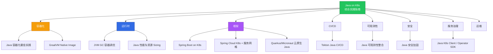
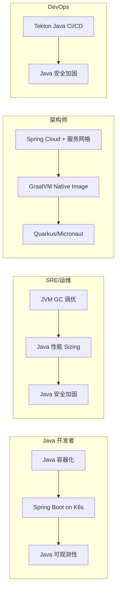

# Java on Kubernetes 综合实践指南

> **一站式 Java + Kubernetes 知识入口** | 12 篇专题指南 | 覆盖从容器化到生产的完整生命周期  
> **最后更新**: 2026-04-30

---

## 📋 指南导航

本指南是 Java 应用在 Kubernetes 上运行的**统一入口**，整合了 12 个专题深度指南。



---

## 一、专题指南索引

### 🐳 容器化 (2 篇)

| # | 指南 | 说明 | 难度 |
|---|------|------|------|
| 1 | [Java 容器化最佳实践](./domain-13-docker/12-java-containerization-guide.md) | Dockerfile 模板、Jib/Buildpacks、分层 JAR、多架构构建、安全加固 | 中级 |
| 2 | [GraalVM Native Image 指南](./domain-10-extensions/99-graalvm-native-image-guide.md) | Spring Boot 3 原生编译、Quarkus/Micronaut 原生、Metadata 配置、K8s 部署 | 高级 |

### ⚙️ 运行时 (2 篇)

| # | 指南 | 说明 | 难度 |
|---|------|------|------|
| 3 | [JVM GC 容器调优深度指南](./domain-12-troubleshooting/99-jvm-gc-container-tuning-guide.md) | G1GC/ZGC/Shenandoah 对比、容器感知参数、GC 监控告警 | 高级 |
| 4 | [Java 性能调优与资源 Sizing](./domain-12-troubleshooting/99-java-performance-resource-sizing-guide.md) | 资源 Sizing 公式、启动优化、线程池调优、CDS/AppCDS | 高级 |

### 🌱 框架 (3 篇)

| # | 指南 | 说明 | 难度 |
|---|------|------|------|
| 5 | [Spring Boot on Kubernetes](./domain-4-workloads/99-spring-boot-kubernetes-guide.md) | 探针、配置管理、优雅停机、数据库连接池、生产 Deployment | 中级 |
| 6 | [Spring Cloud K8s + 服务网格](./domain-26-service-mesh-microservices/99-spring-cloud-kubernetes-service-mesh-guide.md) | Spring Cloud → K8s 原生映射、Istio 集成、Resilience4j、迁移路径 | 高级 |
| 7 | [Quarkus/Micronaut 云原生 Java](./domain-10-extensions/99-quarkus-micronaut-cloud-native-java-guide.md) | Quarkus vs Micronaut vs Spring Boot、Dev Services、反应式编程 | 中级 |

### 🔄 CI/CD (1 篇)

| # | 指南 | 说明 | 难度 |
|---|------|------|------|
| 8 | [Tekton Java CI/CD 流水线](./domain-23-gitops-ci-cd/99-tekton-java-cicd-guide.md) | Maven/Gradle Task、Jib 构建、安全扫描、GitOps 集成 | 中级 |

### 👁️ 可观测性 (1 篇)

| # | 指南 | 说明 | 难度 |
|---|------|------|------|
| 9 | [Java 可观测性整合指南](./domain-8-observability/99-java-observability-kubernetes-guide.md) | Micrometer + JMX Exporter + OTel Agent + 日志 JSON + Grafana Dashboard | 高级 |

### 🔒 安全 (1 篇)

| # | 指南 | 说明 | 难度 |
|---|------|------|------|
| 10 | [Java 安全加固指南](./domain-25-cloud-native-security/99-java-security-kubernetes-guide.md) | SecurityContext、KeyStore/TrustStore、OAuth2、SBOM、NetworkPolicy | 高级 |

### 🔧 平台开发 (1 篇)

| # | 指南 | 说明 | 难度 |
|---|------|------|------|
| 11 | [Java K8s Client / Operator SDK](./domain-9-platform-ops/99-java-k8s-client-operator-guide.md) | fabric8/client-java、Java Operator SDK、Informer 模式 | 高级 |

### 🛠️ 运维 (1 篇)

| # | 指南 | 说明 | 难度 |
|---|------|------|------|
| 12 | [Java 性能与资源 Sizing](./domain-12-troubleshooting/99-java-performance-resource-sizing-guide.md) | 容器资源公式、启动优化、线程池、连接池 Sizing | 高级 |

---

## 二、快速开始路线图

### 2.1 按角色推荐阅读路径



### 2.2 按阶段推荐阅读路径

| 阶段 | 推荐指南 | 目标 |
|------|---------|------|
| **入门** | Java 容器化 → Spring Boot on K8s | 将 Java 应用部署到 K8s |
| **进阶** | JVM GC 调优 → Java 可观测性 → Java 安全加固 | 生产级运维能力 |
| **高级** | Spring Cloud + 服务网格 → GraalVM Native Image | 架构优化 |
| **专家** | Java Operator SDK → Quarkus/Micronaut | 平台级开发 |

---

## 三、Java on K8s 核心速查

### 3.1 关键配置参数速查

```bash
# JVM 容器感知 (JDK 11+ 默认开启)
-XX:+UseContainerSupport

# 堆内存 = 容器限制 × 百分比
-XX:MaxRAMPercentage=75.0       # 推荐默认值
-XX:InitialRAMPercentage=50.0   # 初始堆

# GC 选择
-XX:+UseG1GC                     # 通用场景
-XX:+UseZGC -XX:+ZGenerational   # 低延迟 (JDK 21+)

# 健康检查端口分离
-Dserver.port=8080               # 业务端口
-Dmanagement.server.port=8081    # 管理端口
```

### 3.2 生产 Deployment 最小集

```yaml
spec:
  template:
    spec:
      securityContext:
        runAsNonRoot: true
        runAsUser: 1001
        fsGroup: 1001
      containers:
        - name: app
          securityContext:
            allowPrivilegeEscalation: false
            readOnlyRootFilesystem: true
            capabilities:
              drop: [ALL]
          resources:
            requests: { memory: "768Mi", cpu: "250m" }
            limits: { memory: "1Gi", cpu: "1000m" }
          startupProbe:
            httpGet: { path: /actuator/health/readiness, port: 8081 }
            periodSeconds: 2
            failureThreshold: 30
          livenessProbe:
            httpGet: { path: /actuator/health/liveness, port: 8081 }
            periodSeconds: 10
          readinessProbe:
            httpGet: { path: /actuator/health/readiness, port: 8081 }
            periodSeconds: 5
```

### 3.3 常见问题速查

| 问题 | 指南 | 关键章节 |
|------|------|---------|
| OOMKilled | JVM GC 调优 → 容器内存分配公式 | 第六节 |
| 启动慢被杀 | Spring Boot on K8s → 探针配置 | 第二节 |
| GC 暂停过长 | JVM GC 调优 → ZGC 章节 | 第四节 |
| 镜像太大 | Java 容器化 → 镜像瘦身策略 | 第八节 |
| 配置无法注入 | Spring Boot on K8s → 配置管理 | 第三节 |
| 连接池耗尽 | Spring Boot on K8s → 数据库连接池 | 第六节 |
| 日志乱码/分散 | Java 可观测性 → 日志结构化 | 第五节 |
| 追踪断链 | Java 可观测性 → 分布式追踪 | 第八节 |
| 安全扫描不通过 | Java 安全加固 → 容器运行时安全 | 第二节 |
| Spring Cloud 迁移 | Spring Cloud K8s + 服务网格 → 迁移路径 | 第六节 |

---

## 四、技术矩阵

### 4.1 框架 × 能力矩阵

| 能力 | Spring Boot | Spring Cloud | Quarkus | Micronaut | Native Image |
|------|------------|-------------|---------|-----------|-------------|
| K8s 探针 | Actuator | Actuator | 原生支持 | 原生支持 | 部分支持 |
| 配置注入 | ConfigMap | Spring Cloud K8s | ConfigMapping | @ConfigurationProperties | 有限支持 |
| 服务发现 | K8s DNS | Spring Cloud K8s | 原生 K8s | 原生 K8s | 支持 |
| 可观测性 | Micrometer | Micrometer | Micrometer | Micrometer | 有限 |
| 原生编译 | Spring AOT | 不支持 | 原生支持 | 原生支持 | 核心能力 |
| 启动时间 | 2-5s | 5-15s | 0.5-2s | 0.5-1s | 10-50ms |
| 内存占用 | 200-500MB | 400-800MB | 50-150MB | 50-100MB | 30-80MB |

---

## 🔗 相关外部资源

- [Spring Boot 官方文档 - Kubernetes](https://docs.spring.io/spring-boot/docs/current/reference/html/deployment.html#deployment.cloud.kubernetes)
- [GraalVM Native Image 文档](https://docs.oracle.com/en/graalvm/enterprise/22/docs/reference-manual/native-image/)
- [OpenTelemetry Java Instrumentation](https://github.com/open-telemetry/opentelemetry-java-instrumentation)
- [Java Operator SDK](https://github.com/java-operator-sdk/java-operator-sdk)
