# 07 - Terway 故障树速查 (FTA Troubleshooting Quick Reference)

> **适用版本**: 阿里云 ACK v1.25 - v1.32+ | **Terway 版本**: v1.5+ | **最后更新**: 2026-05

---

## 1. FTA 故障树全景

```mermaid
flowchart TD
  TE[顶事件: Terway异常]
  OR0{{OR}}
  TE --> OR0

  OR0 --> ENI[ENI 分配异常]
  OR0 --> IP[IP 地址池异常]
  OR0 --> CNI[CNI 插件异常]
  OR0 --> NET[节点网络异常]
  OR0 --> SEC[安全组/ACL 异常]
  OR0 --> CP[控制面/云平台依赖异常]

  ENI_OR{{OR}}
  ENI --> ENI_OR
  ENI_OR --> ENI1[ENI 配额不足]
  ENI_OR --> ENI2[ENI 绑定失败]
  ENI_OR --> ENI3[ENI 状态异常/漂移]

  IP_OR{{OR}}
  IP --> IP_OR
  IP_OR --> IP1[IP 池耗尽]
  IP_OR --> IP2[IP 泄漏/未回收]
  IP_OR --> IP3[IP 冲突]

  AND_IP{{"AND: IP 完全耗尽"}}
  IP --> AND_IP
  AND_IP --> AND_IP1[vSwitch IP 池耗尽]
  AND_IP --> AND_IP2[已释放 Pod 的 IP 未回收]

  CNI_OR{{OR}}
  CNI --> CNI_OR
  CNI_OR --> CNI1[CNI 配置错误]
  CNI_OR --> CNI2[CNI 二进制/守护进程异常]
  CNI_OR --> CNI3[路由/iptables 配置失败]

  NET_OR{{OR}}
  NET --> NET_OR
  NET_OR --> NET1[节点与 VPC 不通]
  NET_OR --> NET2[跨节点网络不通]
  NET_OR --> NET3[MTU/分片异常]

  SEC_OR{{OR}}
  SEC --> SEC_OR
  SEC_OR --> SEC1[安全组/ACL 阻断]
  SEC_OR --> SEC2[策略不一致导致丢包]

  CP_OR{{OR}}
  CP --> CP_OR
  CP_OR --> CP1[云 API 限流/失败]
  CP_OR --> CP2[控制面不可用]

  AND_SCALE{{"AND: 扩容网络阻塞"}}
  ENI --> AND_SCALE
  AND_SCALE --> AND_SCALE1[ENI 配额达上限]
  AND_SCALE --> AND_SCALE2[云 API 限流无法创建新 ENI]
```



---

## 2. 6 大故障类别概览

| 类别 | 子事件 | 严重度 | 门类型 | 典型触发场景 |
|------|--------|--------|--------|-------------|
| ENI 分配异常 | 配额不足 / 绑定失败 / 状态漂移 | High | OR (+ AND: 扩容阻塞) | 大规模扩容、实例规格不足 |
| IP 地址池异常 | 池耗尽 / IP 泄漏 / IP 冲突 | Critical | OR (+ AND: 完全耗尽) | vSwitch CIDR 满载、GC 故障 |
| CNI 插件异常 | 配置错误 / 守护进程崩溃 / 路由失败 | High | OR | 升级失败、配置误改 |
| 节点网络异常 | VPC 不通 / 跨节点失败 / MTU 异常 | High | OR | ECS 实例级故障、路由表变更 |
| 安全组/ACL 异常 | 安全组阻断 / 策略不一致 | Medium | OR | 安全组规则误操作 |
| 控制面/云平台异常 | API 限流 / 控制面不可用 | High | OR | API 配额耗尽、API Server 异常 |

---

## 3. 10 分钟快速诊断流程

> 来源: 07-terway-troubleshooting.md S0

| 步骤 | 操作 | 命令 | 判定 |
|------|------|------|------|
| 1 | Terway Pod 状态 | `kubectl get pods -n kube-system -l app=terway` | 全部 Running 为正常 |
| 2 | 节点 ENI 信息 | `kubectl describe node <node> \| grep aliyun.com` | 查看 allocated/eni-max/ip-max |
| 3 | Pod IP 归属 | `kubectl get pod <pod> -o yaml \| grep k8s.aliyun.com` | 确认 ENI 模式或 Veth 模式 |
| 4 | VPC 路由 | 阿里云控制台 -> VPC 路由表 | Pod CIDR 指向各节点 ECS |
| 5 | 安全组 | 节点安全组是否放通 Pod 间通信端口 | 入站放通 Pod CIDR |
| 6a | 快速缓解: IP 分配失败 | 检查 ENI 配额 / IP 池 / 升级实例规格 | |
| 6b | 快速缓解: 跨节点不通 | 检查 VPC 路由表 + 安全组规则 | |
| 6c | 快速缓解: 策略不生效 | 确认 Calico 策略引擎版本兼容 | |
| 7 | 证据留存 | 保存节点 Annotation / terway 日志 / ENI 截图 / VPC 路由表 | |

---

## 4. ENI 分配异常诊断

### 4.1 决策树

```
Pod ContainerCreating, 事件含 ENI/bindquota/AttachNetworkInterface
    |
    +-- 检查 terway 日志
    |       |
    |       +-- "bindquota exceeded" / "no available ENI slot"
    |       |       --> ENI 配额不足 (evt_eni_quota)
    |       |
    |       +-- "AttachNetworkInterface failed" / "bindENI failed"
    |       |       --> ENI 绑定失败 (evt_eni_bind_fail)
    |       |
    |       +-- "ENI status mismatch" / "stale ENI" / "orphan ENI"
    |       |       --> ENI 状态漂移 (evt_eni_drift)
    |       |
    |       +-- 同时存在 "bindquota exceeded" + "Throttling"
    |               --> AND 门: 扩容网络阻塞 (gate_and_scale)
```

### 4.2 诊断命令

| 节点 ID | 名称 | 诊断命令 | 预期输出 | 判定 |
|---------|------|---------|----------|------|
| `cat_eni` | ENI 异常分类 | `kubectl get events -n ${NAMESPACE} --field-selector reason=FailedCreatePodSandBox -o json \| jq '[.items[] \| select(.message \| test("ENI\|bindquota\|AttachNetworkInterface"))] \| length'` | `> 0` | 进入 ENI 子树 |
| `evt_eni_quota` | ENI 配额不足 | `aliyun ecs DescribeInstances --InstanceIds '["${INSTANCE_ID}"]' \| jq '.Instances.Instance[0].NetworkInterfaces.NetworkInterface \| length'` | 达到实例类型上限 | 确认根因 |
| | | `kubectl logs -n kube-system -l app=terway --tail=50 \| grep -E "bindquota exceeded\|no available ENI slot"` | 含配额超限 | 确认根因 |
| | | `kubectl describe node ${NODE_NAME} \| grep -E "aliyun.com/allocated-eni\|aliyun.com/eni-max"` | allocated >= max | 确认根因 |
| `evt_eni_bind_fail` | ENI 绑定失败 | `kubectl logs -n kube-system -l app=terway --tail=50 \| grep -E "AttachNetworkInterface failed\|bindENI failed"` | 含绑定失败 | 确认根因 |
| | | `aliyun ecs DescribeNetworkInterfaces --InstanceId ${INSTANCE_ID} \| jq '.NetworkInterfaceSets.NetworkInterfaceSet[] \| {id: .NetworkInterfaceId, status: .Status}'` | 状态非 InUse | 进一步检查 |
| `evt_eni_drift` | ENI 状态漂移 | `kubectl exec -n kube-system $(kubectl get pods -n kube-system -l app=terway -o jsonpath='{.items[0].metadata.name}') -- terway-cli show` | 与云平台 ENI 列表不匹配 | 确认根因 |
| | | `aliyun ecs DescribeNetworkInterfaces --InstanceId ${INSTANCE_ID} --Status Detaching \| jq '.NetworkInterfaceSets.NetworkInterfaceSet \| length'` | 有 Detaching 状态 | 确认根因 |

### 4.3 解决方案

| 子事件 | 处置 |
|--------|------|
| ENI 配额不足 | 1) 释放不再使用的 Pod (独占 ENI) 2) 升级 ECS 实例规格 3) 切换 ENIIP 模式 (`eni` -> `eniip`) 4) 清理未使用 ENI |
| ENI 绑定失败 | 1) 检查 ECS 实例状态 2) 验证 RAM 角色授权 (AliyunECSNetworkInterfaceManagementAccess) 3) 确认 vSwitch 与实例在同一可用区 |
| ENI 状态漂移 | 1) 比对 Terway 缓存与云平台 ENI 列表 2) 手动清理残留 ENI 3) 重启 Terway Daemon Pod 4) 检查 ENI 回收策略 |

---

## 5. IP 地址池异常诊断

### 5.1 决策树

```
Pod ContainerCreating, 事件含 IP/pool/address
    |
    +-- 检查 terway 日志
    |       |
    |       +-- "no available IP" / "IP pool exhausted"
    |       |       --> IP 池耗尽 (evt_ip_exhaust)
    |       |
    |       +-- "IP not released" / "stale IP" / "orphan IP"
    |       |       --> IP 泄漏 (evt_ip_leak)
    |       |
    |       +-- "IP conflict" / "duplicate IP" / "already in use"
    |       |       --> IP 冲突 (evt_ip_conflict)
    |       |
    |       +-- 同时存在 "pool exhausted" + "IP not released"
    |               --> AND 门: IP 完全耗尽 (gate_and_ip)
```

### 5.2 诊断命令

| 节点 ID | 名称 | 诊断命令 | 预期输出 | 判定 |
|---------|------|---------|----------|------|
| `cat_ip` | IP 异常分类 | `kubectl get events -n ${NAMESPACE} --field-selector reason=FailedCreatePodSandBox -o json \| jq '[.items[] \| select(.message \| test("IP\|pool\|address"))] \| length'` | `> 0` | 进入 IP 子树 |
| `evt_ip_exhaust` | IP 池耗尽 | `aliyun vpc DescribeVSwitchAttributes --VSwitchId ${VSWITCH_ID} \| jq '.AvailableIpAddressCount'` | `< 10` | 确认根因 |
| | | `kubectl logs -n kube-system -l app=terway --tail=50 \| grep -E "no available IP\|IP pool exhausted"` | 含 IP 耗尽 | 确认根因 |
| `evt_ip_leak` | IP 泄漏 | `kubectl exec -n kube-system $(kubectl get pods -n kube-system -l app=terway -o jsonpath='{.items[0].metadata.name}') -- terway-cli show \| grep -c "allocated"` | 分配数 >> 运行 Pod 数 | 确认根因 |
| | | `kubectl logs -n kube-system -l app=terway --tail=100 \| grep -E "IP not released\|stale IP"` | 含 IP 泄漏日志 | 确认根因 |
| `evt_ip_conflict` | IP 冲突 | `kubectl logs -n kube-system -l app=terway --tail=50 \| grep -E "IP conflict\|duplicate IP"` | 含 IP 冲突 | 确认根因 |
| | | `arping -I eth0 -c 3 ${CONFLICT_IP} 2>&1` | 多个 MAC 响应 | 确认根因 |

### 5.3 IP 泄漏检测脚本

```bash
#!/bin/bash
NODE_NAME="${1:?用法: $0 <node-name>}"
TERWAY_POD=$(kubectl get pods -n kube-system -l app=terway \
  --field-selector spec.nodeName=${NODE_NAME} \
  -o jsonpath='{.items[0].metadata.name}')

ALLOCATED=$(kubectl exec -n kube-system ${TERWAY_POD} -- terway-cli show 2>&1 | grep -c "allocated")
RUNNING=$(kubectl get pods --all-namespaces --field-selector spec.nodeName=${NODE_NAME},status.phase=Running -o json | jq '.items | length')

echo "节点: ${NODE_NAME}"
echo "已分配 IP 数: ${ALLOCATED}"
echo "运行中 Pod 数: ${RUNNING}"
echo "泄漏 IP 数: $((ALLOCATED - RUNNING))"

if [ ${ALLOCATED} -gt ${RUNNING} ]; then
  echo "检测到 IP 泄漏, 建议执行: kubectl exec -n kube-system ${TERWAY_POD} -- terway-cli garbage-collect"
fi
```

### 5.4 解决方案

| 子事件 | 处置 |
|--------|------|
| IP 池耗尽 | 1) 检查 vSwitch 剩余 IP 数 2) 扩展 vSwitch CIDR 3) 添加新 vSwitch 4) 优化 Pod 密度 |
| IP 泄漏 | 1) `terway-cli garbage-collect` 2) 比对 Pod 列表与 IP 分配表 3) 重启 Terway Daemon 触发回收 4) 检查 GC 策略配置 |
| IP 冲突 | 1) 检查 VPC 内 IP 使用 2) 重启冲突 Pod 获取新 IP 3) 确认 vSwitch 未被其他服务共用 |

---

## 6. CNI 插件异常诊断

### 6.1 决策树

```
Pod 事件含 FailedCreatePodSandBox / cni plugin / terway
    |
    +-- 检查 terway 日志
    |       |
    |       +-- "invalid CNI" / "error loading CNI"
    |       |       --> CNI 配置错误 (evt_cni_config)
    |       |
    |       +-- "daemon not ready" / "CNI plugin not found" / Pod CrashLoopBackOff
    |       |       --> CNI 守护进程异常 (evt_cni_daemon)
    |       |
    |       +-- "failed to add route" / "iptables error"
    |               --> 路由/iptables 配置失败 (evt_route_fail)
```

### 6.2 诊断命令

| 节点 ID | 名称 | 诊断命令 | 预期输出 | 判定 |
|---------|------|---------|----------|------|
| `cat_cni` | CNI 异常分类 | `kubectl describe pod ${POD_NAME} -n ${NAMESPACE} \| grep -E "FailedCreatePodSandBox\|cni plugin\|terway"` | 含 CNI 错误 | 进入 CNI 子树 |
| `evt_cni_config` | CNI 配置错误 | `ssh ${NODE_NAME} 'cat /etc/cni/net.d/*.conf \| head -20'` | JSON 格式错误或缺失 | 确认根因 |
| | | `kubectl logs -n kube-system -l app=terway --tail=50 \| grep -E "invalid CNI\|error loading CNI"` | 含配置错误 | 确认根因 |
| | | `kubectl get configmap -n kube-system eni-config -o yaml` | 配置项异常 | 确认根因 |
| `evt_cni_daemon` | CNI 守护进程异常 | `kubectl get pods -n kube-system -l app=terway -o json \| jq '.items[] \| {name: .metadata.name, ready: .status.containerStatuses[0].ready, restarts: .status.containerStatuses[0].restartCount}'` | ready=false 或重启多 | 确认根因 |
| | | `ssh ${NODE_NAME} 'ls -la /opt/cni/bin/terway 2>&1'` | 文件不存在或权限异常 | 确认根因 |
| `evt_route_fail` | 路由配置失败 | `ssh ${NODE_NAME} 'ip route show \| grep -E "via\|dev eth"'` | 缺少必要路由 | 确认根因 |
| | | `kubectl logs -n kube-system -l app=terway --tail=50 \| grep -E "failed to add route\|iptables error"` | 含路由错误 | 确认根因 |

### 6.3 解决方案

| 子事件 | 处置 |
|--------|------|
| CNI 配置错误 | 1) 检查 `/etc/cni/net.d/` 配置文件 2) 验证 Terway ConfigMap 3) 确认 CNI 版本与 K8s 版本兼容 |
| CNI 守护进程异常 | 1) 检查 Terway DaemonSet 状态 2) 查看 Pod 日志 3) `ls /opt/cni/bin/terway` 确认二进制 4) 重启 Terway DaemonSet |
| 路由/iptables 失败 | 1) `ip route show` 检查路由表 2) `iptables -L -n -t nat` 检查规则 3) 确认 Terway 运行模式 4) 重启 Terway Daemon |

---

## 7. 节点网络异常诊断

### 7.1 决策树

```
节点 NetworkUnavailable=True 或 Pod 间通信失败
    |
    +-- ping 100.100.100.200 (VPC 元数据服务)
    |       |
    |       +-- 超时/不可达 --> 节点与 VPC 不通 (evt_vpc_unreachable)
    |       |
    |       +-- 正常 --> 进入下一步
    |
    +-- Pod-A ping Pod-B (跨节点)
    |       |
    |       +-- 超时/不可达 --> 跨节点网络不通 (evt_crossnode_fail)
    |       |
    |       +-- 正常 --> 进入下一步
    |
    +-- ping -s 1400 -M do <target>
            |
            +-- "message too long" / "Frag needed" --> MTU/分片异常 (evt_mtu_issue)
```

### 7.2 诊断命令

| 节点 ID | 名称 | 诊断命令 | 预期输出 | 判定 |
|---------|------|---------|----------|------|
| `cat_network` | 网络异常分类 | `kubectl get node ${NODE_NAME} -o json \| jq '.status.conditions[] \| select(.type=="NetworkUnavailable") \| .status'` | `True` | 进入网络子树 |
| `evt_vpc_unreachable` | 节点与 VPC 不通 | `ssh ${NODE_NAME} 'ping -c 3 100.100.100.200 2>&1'` | 超时或不可达 | 确认根因 |
| | | `ssh ${NODE_NAME} 'ip link show eth0 && ip addr show eth0'` | 接口 DOWN 或无 IP | 确认根因 |
| | | `kubectl get events --field-selector involvedObject.name=${NODE_NAME},reason=NodeNotReady -o json \| jq '.items[-1].message'` | NodeNotReady 事件 | 确认根因 |
| `evt_crossnode_fail` | 跨节点网络不通 | `kubectl exec ${POD_NAME} -n ${NAMESPACE} -- ping -c 3 <other-pod-ip> 2>&1` | 超时或不可达 | 确认根因 |
| | | `aliyun vpc DescribeRouteTableList --VpcId ${VPC_ID} \| jq '.RouterTableList.RouterTableListType[].RouteTableId'` | 路由表配置异常 | 进一步检查 |
| | | `ip route get <pod-b-ip>` | 无路由 | 确认根因 |
| `evt_mtu_issue` | MTU/分片异常 | `ssh ${NODE_NAME} 'ip link show \| grep mtu'` | MTU 不一致 | 确认根因 |
| | | `ssh ${NODE_NAME} 'ping -s 1400 -M do <target-ip> 2>&1'` | "message too long" | 确认根因 |

### 7.3 解决方案

| 子事件 | 处置 |
|--------|------|
| VPC 不通 | 1) 检查 ECS 实例网络状态 2) 验证 vSwitch 路由表 3) 检查安全组规则 4) 检查 ENI 绑定状态 |
| 跨节点不通 | 1) 确认 Pod 所在 vSwitch 路由互通 2) 检查安全组是否允许 Pod CIDR 3) 验证 Terway 路由配置 4) 检查 VPC 路由表条目; 临时修复: `kubectl delete pod -n kube-system -l app=terway --field-selector spec.nodeName=<node>` 触发路由同步 |
| MTU 异常 | 1) `ip link show` 检查各接口 MTU 2) 统一 MTU (通常 1500 或 9000) 3) 检查 Terway MTU 配置 |

---

## 8. 安全组/ACL 异常诊断

### 8.1 安全组 + NetworkPolicy 优先级矩阵

> 来源: 07-terway-troubleshooting.md S2.4.2

| 流量方向 | 安全组 | NetworkPolicy | 实际效果 |
|----------|--------|---------------|----------|
| 入站 | 拒绝 | 允许 | **拒绝** (安全组优先) |
| 入站 | 允许 | 拒绝 | **拒绝** (策略生效) |
| 出站 | 拒绝 | 允许 | **拒绝** (安全组优先) |

> 排查建议: 必须同时检查安全组规则和 NetworkPolicy 规则, 避免遗漏.

### 8.2 诊断命令

| 节点 ID | 名称 | 诊断命令 | 预期输出 | 判定 |
|---------|------|---------|----------|------|
| `cat_security` | 安全异常分类 | `kubectl logs ${POD_NAME} -n ${NAMESPACE} --tail=30 2>&1 \| grep -E "connection refused\|connection timed out\|no route"` | 含连接失败 | 进入安全子树 |
| `evt_sg_block` | 安全组阻断 | `aliyun ecs DescribeSecurityGroupAttribute --SecurityGroupId ${SG_ID} --Direction ingress \| jq '.Permissions.Permission[] \| select(.IpProtocol=="ALL" or .IpProtocol=="TCP")'` | 缺少必要规则 | 确认根因 |
| | | `aliyun vpc DescribeFlowLogs --FlowLogId ${FLOW_LOG_ID} \| jq '.FlowLogs.FlowLog[]'` | 有 REJECT 记录 | 确认根因 |
| | | `kubectl describe node ${NODE_NAME} \| grep "SecurityGroup"` | 安全组 ID | 基础信息 |
| `evt_acl_misconfig` | 策略不一致 | `aliyun ecs DescribeNetworkInterfaces --InstanceId ${INSTANCE_ID} \| jq '.NetworkInterfaceSets.NetworkInterfaceSet[] \| {id: .NetworkInterfaceId, sg: .SecurityGroupIds.SecurityGroupId}'` | 不同 ENI 关联不同安全组 | 确认根因 |
| | Calico 检查 | `kubectl get pods -n kube-system -l k8s-app=calico-node` | 非 Running | 策略引擎异常 |

### 8.3 解决方案

| 子事件 | 处置 |
|--------|------|
| 安全组阻断 | 1) 检查 ENI 关联安全组 2) 放通 Pod CIDR 和 Service CIDR 流量 3) 使用 VPC 流日志排查丢包; 修复: `aliyun ecs AuthorizeSecurityGroup --SecurityGroupId <sg-id> --IpProtocol all --SourceCidrIp <pod-cidr> --PortRange "-1/-1" --Priority 1` |
| 策略不一致 | 1) 统一节点池 ENI 安全组 2) 检查 Terway 安全组自动管理配置 3) 验证所有 ENI 安全组一致 |
| NetworkPolicy 不生效 | 1) 确认 Calico 策略引擎运行 2) 升级 Terway v1.4+ 和 Calico v3.24+ 3) ENI 模式下同节点 Pod 间流量可能绕过策略 (已知限制) |

---

## 9. 控制面/云平台异常诊断

### 9.1 决策树

```
terway 日志含 Throttling / ServiceUnavailable / connection refused
    |
    +-- 检查 terway 日志
    |       |
    |       +-- "Throttling" / "rate limit" / "429"
    |       |       --> 云 API 限流 (evt_cloud_api_fail)
    |       |
    |       +-- "connection refused" / "unable to connect"
    |               --> 控制面不可用 (evt_cp_down)
    |
    +-- 检查 API Server
            |
            +-- kubectl get --raw /healthz 非 ok
                    --> 控制面不可用
```

### 9.2 诊断命令

| 节点 ID | 名称 | 诊断命令 | 预期输出 | 判定 |
|---------|------|---------|----------|------|
| `cat_cp` | 控制面异常分类 | `kubectl logs -n kube-system -l app=terway --tail=50 \| grep -E "Throttling\|ServiceUnavailable\|connection refused"` | 含 API 错误 | 进入控制面子树 |
| `evt_cloud_api_fail` | 云 API 限流 | `kubectl logs -n kube-system -l app=terway --tail=100 \| grep -E "Throttling\|rate limit\|429"` | 含限流信息 | 确认根因 |
| | | `aliyun ecs DescribeInstances 2>&1 \| grep -E "Throttling\|ServiceUnavailable"` | API 返回限流 | 确认根因 |
| `evt_cp_down` | 控制面不可用 | `kubectl get --raw /healthz 2>&1` | 非 ok 或超时 | 确认根因 |
| | | `kubectl logs -n kube-system -l app=terway --tail=50 \| grep "connection refused"` | 含连接拒绝 | 确认根因 |

### 9.3 解决方案

| 子事件 | 处置 |
|--------|------|
| 云 API 限流 | 1) 检查 API 调用频率 2) 配置 Terway API 重试策略 3) 提交工单申请限流放宽 4) 检查 RAM 角色授权 |
| 控制面不可用 | 1) 检查 API Server 状态 2) Terway 有本地缓存可短期容忍 3) 恢复 API Server 后验证网络恢复 |

---

## 10. AND 门组合故障

### 10.1 IP 完全耗尽 (vSwitch 空 + IP 泄漏)

```
条件 A: vSwitch 可用 IP 为零
    AND
条件 B: GC 未回收已释放 Pod 的 IP
    =
结果: 无法分配任何 IP (Critical)
```

| 条件 | 检测命令 | 确认标志 |
|------|---------|---------|
| A: vSwitch IP 池空 | `aliyun vpc DescribeVSwitchAttributes --VSwitchId ${VSWITCH_ID} \| jq '.AvailableIpAddressCount'` | `== 0` |
| B: IP 未回收 | `kubectl logs -n kube-system -l app=terway --tail=50 \| grep -E "IP not released\|stale IP"` | 有泄漏日志 |

**紧急恢复**:
1. 立即扩展 vSwitch CIDR 或添加新 vSwitch
2. `terway-cli garbage-collect` 强制回收泄漏 IP
3. 重启 Terway Daemon Pod 触发全量同步
4. 降低非关键业务副本数释放 IP

### 10.2 扩容网络阻塞 (ENI 配额满 + API 限流)

```
条件 A: 所有节点 ENI 达实例类型上限
    AND
条件 B: 云 API 限流无法创建新 ENI
    =
结果: 扩容完全阻塞, 新 Pod 无法获得网络 (Critical)
```

| 条件 | 检测命令 | 确认标志 |
|------|---------|---------|
| A: ENI 配额满 | `kubectl logs -n kube-system -l app=terway --tail=50 \| grep -E "bindquota exceeded\|no available ENI"` | 有配额超限日志 |
| B: API 限流 | `kubectl logs -n kube-system -l app=terway --tail=50 \| grep -E "Throttling\|rate limit\|429"` | 有限流日志 |

**紧急恢复**:
1. 提交工单紧急申请 API 限流放宽
2. 升级 ECS 实例规格 (支持更多 ENI)
3. 切换 ENIIP 模式减少 ENI 消耗
4. 释放非生产环境 Pod 腾出 ENI

---

## 11. 错误信息速查目录

| 错误信息 | 来源 | 根因 | 快速修复 |
|---------|------|------|---------|
| `failed to allocate pod IP: no available IP` | terway Pod | vSwitch IP 池耗尽 | 扩展 vSwitch CIDR / 添加 vSwitch |
| `exceeded eni quota` | terway Pod | 实例 ENI 数量达上限 | 升级实例规格 / 切换 eniip 模式 |
| `fixed IP already in use` | terway Pod | 固定 IP 被其他 Pod 占用 | 检查 Pod Annotation / 重启冲突 Pod |
| `pool is empty` | terway IPAM | IP 资源池耗尽 | 检查 vSwitch / 清理孤儿 IP |
| `instance type eni limit exceeded` | terway | 实例规格 ENI 限制 | 升级实例规格 |
| `Destination Host Unreachable` | Pod 内 ping | 跨节点路由缺失/VPC 不通 | 检查 VPC 路由表 / 安全组 |
| `no route to host` | Pod 内命令 | VPC 路由缺失 | 检查 VPC 路由表 |
| `route conflict detected` | terway Pod | 自定义路由与 Pod CIDR 冲突 | 清理冲突路由 |
| `Throttling.User` | 阿里云 API | API 调用频率超限 | 降低 Pod 创建速率 / 申请限流放宽 |
| `InvalidVSwitchId.NotFound` | 阿里云 API | vSwitch 不存在或已删除 | 更新 eni-config 中 vSwitch ID |
| `InvalidSecurityGroupId.NotFound` | 阿里云 API | 安全组 ID 不存在 | 更新 eni-config 中安全组 ID |
| `AttachNetworkInterface failed` | terway Pod | ENI 绑定 ECS 失败 | 检查 ECS 状态 / RAM 权限 / 可用区 |
| `bindquota exceeded` | terway Pod | 节点 ENI 绑定配额超限 | 升级实例规格 / 释放未使用 ENI |
| `no available ENI slot` | terway Pod | 无可用 ENI 槽位 | 升级实例规格 / 切换 eniip 模式 |
| `ENI status mismatch` | terway Pod | ENI 状态不一致 | 重启 Terway / 手动清理残留 ENI |
| `stale ENI` / `orphan ENI` | terway Pod | 残留 ENI 未清理 | `terway-cli show` 比对 / 手动清理 |
| `IP conflict` | terway Pod | IP 被多个资源使用 | 检查 VPC IP 使用 / 重启冲突 Pod |
| `duplicate IP` | terway Pod | 重复 IP 分配 | 重启 Terway Daemon / 检查 IP 分配逻辑 |
| `IP not released` / `stale IP` | terway Pod | IP 泄漏/未回收 | `terway-cli garbage-collect` |
| `invalid CNI configuration` | terway Pod | CNI 配置文件错误 | 检查 `/etc/cni/net.d/` |
| `error loading CNI config` | terway Pod | CNI 配置加载失败 | 检查 ConfigMap / CNI 版本兼容性 |
| `terway daemon not ready` | terway Pod | Terway Daemon 未就绪 | 检查 DaemonSet / Pod 日志 |
| `CNI plugin not found` | terway Pod | CNI 二进制缺失 | `ls /opt/cni/bin/terway` |
| `failed to add route` | terway Pod | 路由下发失败 | `ip route show` / 重启 Terway |
| `iptables error` | terway Pod | iptables 规则配置失败 | `iptables -L -n -t nat` / 重启 Terway |
| `connection refused` | 应用/Pod | 服务端未监听或安全组阻断 | 检查服务状态 / 安全组 |
| `connection timed out` | 应用/Pod | 安全组阻断或网络不可达 | 检查安全组 / VPC 路由 |
| `no route to host` | Pod 内命令 | 路由缺失 | 检查 VPC 路由表 |
| `ServiceUnavailable` | 阿里云 API | 云服务暂时不可用 | 等待恢复 / 配置重试策略 |
| `dial tcp: i/o timeout` | 应用日志 | 跨节点连接超时 | 检查 VPC 路由 / 安全组 |
| `message too long` / `Frag needed` | ping 输出 | MTU 不一致 | 统一 MTU 配置 |
| `soft lockup` / `watchdog timeout` | 内核日志 | 节点网络栈异常 | 检查内核版本 / 升级内核 |

---

## 12. 生产级观测与证据清单

### 12.1 关键事件

| 事件 | 来源 | 含义 |
|------|------|------|
| `FailedCreatePodSandBox` | kubelet | 网络分配失败 |
| `NodeNotReady` | kubelet | 节点网络不可用 |
| `Pod 无法获取 IP` | terway | IPAM 分配失败 |
| ENI 绑定/解绑失败 | terway | ENI 操作异常 |

### 12.2 关键指标

| 指标 | 告警阈值 | 来源 |
|------|---------|------|
| ENI 使用率 (每节点) | > 85% warning, > 95% critical | `aliyun_terway_allocated_eni / aliyun_terway_eni_max` |
| vSwitch IP 使用率 | AvailableIpAddressCount < 10 | 阿里云 API |
| Terway IP 分配延迟 P99 | > 5s warning, > 15s critical | `terway_pod_allocate_duration_seconds` |
| CNI 操作失败率 | > 0 | terway metrics |
| 节点网络丢包率 | > 0.1% warning, > 1% critical | `ip -s link show` |

### 12.3 关键日志

| 日志 | 位置 | 检索方式 |
|------|------|---------|
| Terway Daemon 日志 | terway DaemonSet Pod | `kubectl logs -n kube-system -l app=terway --tail=200` |
| CNI 插件日志 | 节点 `/var/log/terway.log` | `ssh <node> 'cat /var/log/terway.log'` |
| kubelet 网络事件 | 节点 journalctl | `journalctl -u kubelet \| grep -E "network\|cni"` |
| 阿里云 API 调用日志 | terway Pod | `kubectl logs -n kube-system -l app=terway \| grep -E "Throttling\|API"` |

### 12.4 配置核对清单

| 配置项 | 检查命令 | 关注点 |
|--------|---------|--------|
| ENI/IP 池配置 | `kubectl get configmap -n kube-system eni-config -o yaml` | ENI_ALLOCATE_MODE / max-eni-ip |
| 安全组规则 | `aliyun ecs DescribeSecurityGroupAttribute --SecurityGroupId ${SG_ID}` | 入站/出站是否放通 Pod CIDR |
| vSwitch CIDR | `aliyun vpc DescribeVSwitchAttributes --VSwitchId ${VSWITCH_ID}` | AvailableIpAddressCount |
| Terway 运行模式 | `kubectl get ds -n kube-system terway-eniip -o yaml` | ENI / ENIIP / VPC 模式 |
| NetworkPolicy 配置 | `kubectl get networkpolicy --all-namespaces` | 是否与安全组冲突 |
| 节点 Annotation | `kubectl describe node <node> \| grep aliyun.com` | allocated-eni / eni-max / ip-max |
| Calico 状态 | `kubectl get pods -n kube-system -l k8s-app=calico-node` | 是否 Running |

---

## 13. 交叉引用

| 文档 | 路径 | 内容 |
|------|------|------|
| Terway 运维手册 | [04-operations.md](./04-operations.md) | 日常运维操作 |
| FTA 完整树 (含 JSON 工作流) | [topic-fta/list/terway-fta.md](../topic-fta/list/terway-fta.md) | 完整 FTA 树定义 + 自动化工作流 |
| 结构化排查指南 | [topic-structural-trouble-shooting/03-networking/07-terway-troubleshooting.md](../topic-structural-trouble-shooting/03-networking/07-terway-troubleshooting.md) | 详细排查步骤与脚本 |
| Terway 架构 | [02-architecture.md](./02-architecture.md) | 架构与模式说明 |
| Terway 性能调优 | [06-performance.md](./06-performance.md) | 性能优化参考 |
